# monitor
affichage d'un serveur domotique  
Ce programme est écrit en PHP   
Prérequis :
-	Serveur Nginx avec Maria DB, PHP, phpMyAdmin, voir http://domo-site.fr/accueil/dossiers/3 
https://www.linuxtricks.fr/wiki/debian-installer-un-serveur-lamp-apache-mysql-php  
-	Certificats HTTPS 
-	Logiciel d’édition d’images svg : Adobe Illustrator ou Inscape  
l'écran de ma tablette: 
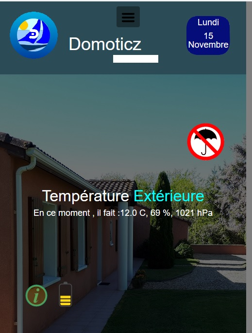 
l'écran avant d'insérer les données d'un serveur domotique,  avant la connexion à la base de données 
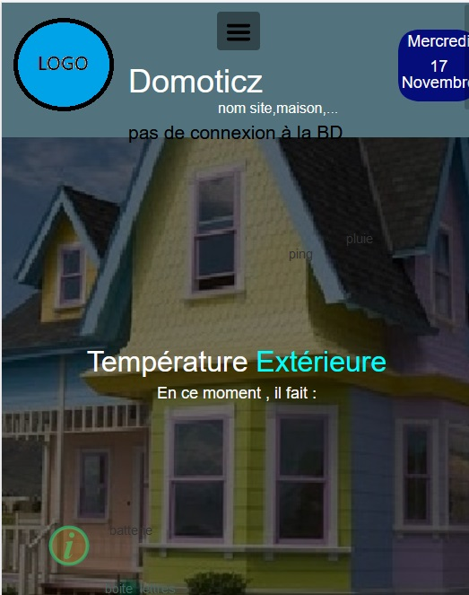 
Par défaut le programme propose 4 onglets mais après connection à un  serveur domotique ou après une demande de jeton ,d'autres onglets peuvent  être ajoutés en modifiant le fichier de configuration: 
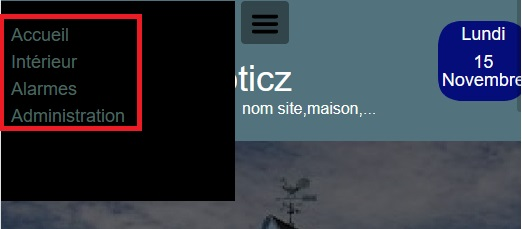 
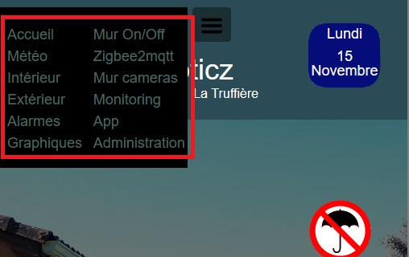 
En plus de la page d'accueil, les pages par défaut: 
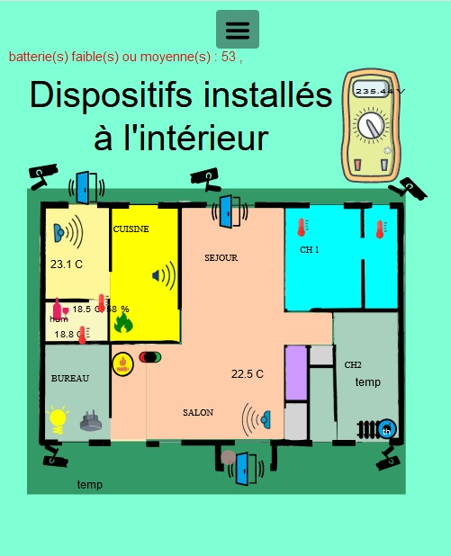 
L'alarmes reçoit les informations de 2 PIR et 2 contacts de porte ; elle peut : - mettre en service le mode DETECT dans Zoneminder pour des caméras - tester le bon fonctionnement de l'envoi d'un SMS depuis un modem GSM  - envoyer en cas d'intrusion, un E_mail, un SMS par intrernet ou par GSM  
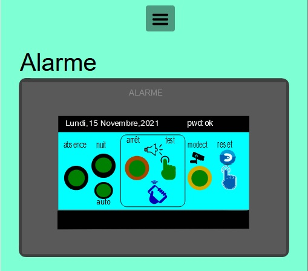 
Le test de la BD se fait sans mot de passe ; password=000000 
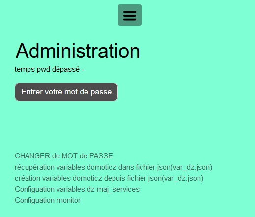  
Les pages optionnelles: 
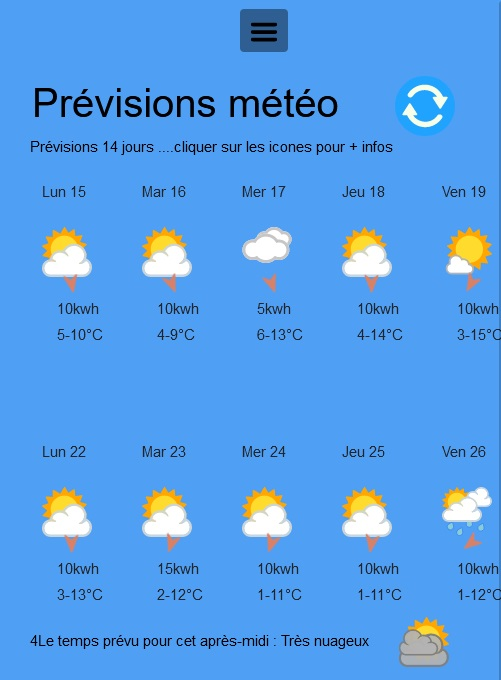 
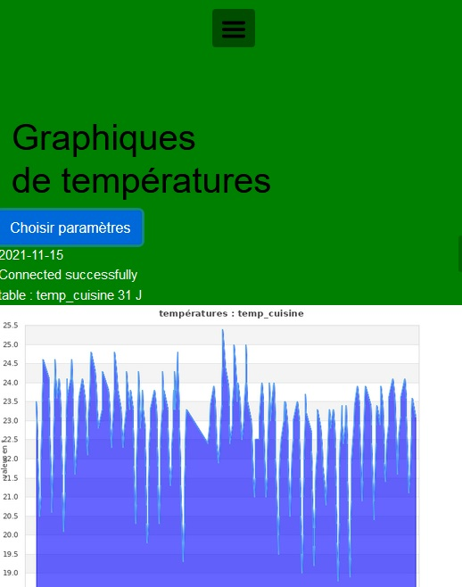 
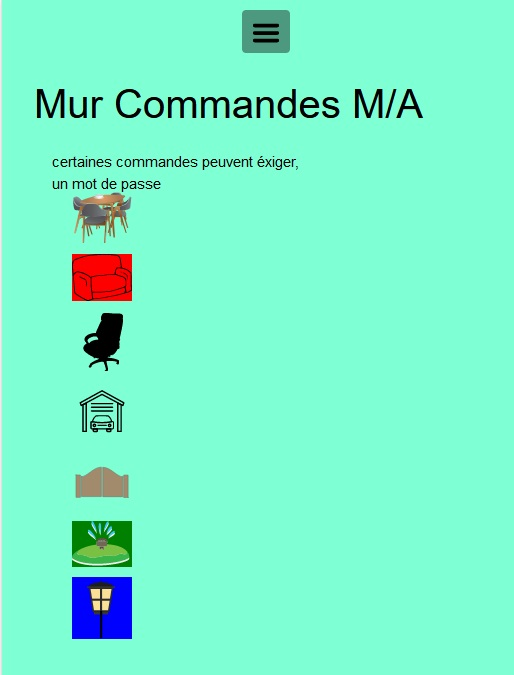 
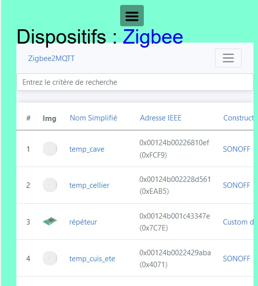  

Une vidéo  est disponible sur le site web : domo-site.fr 
