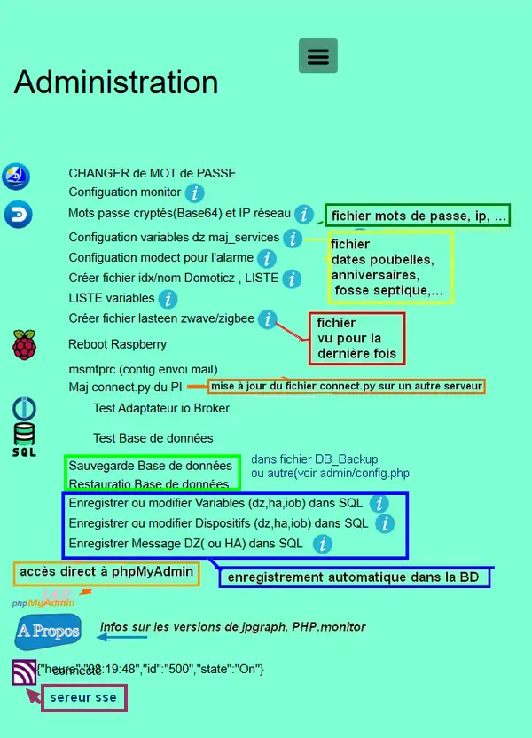
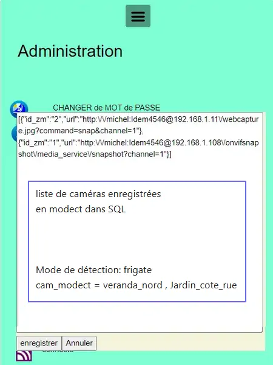

14.  ADMINISTRATION
-------------------

|image788|

14.1 fichiers communs à toutes les pages
^^^^^^^^^^^^^^^^^^^^^^^^^^^^^^^^^^^^^^^^
- **css**

voir le § :ref:`1.2.2.1 styles CSS communs à toutes les pages`

- **Index_loc.php**  *chargement de la page impératif*

.. code-block::

   // administration
   include ("include/admin.php");

- **header.php**  *Affichage obligatoire dans le menu*

.. code-block::

   <li class="zz"><a href="#admin">Administration</a></li>

- **ajax.php**

.. code-block::

   if ($app=="admin") {admin($variable,$command);}	//$command=fenetre(administration footer

- **config.php** *emplacement du fichier* 

.. code-block::

   define('MONCONFIG', 'admin/config.php');//fichier config 

- **fonctions.php**    *admin()*

Extrait de la fonction:

|image794|

14.2 admin.php, info_admin.php, test_db.php et backup_bd
^^^^^^^^^^^^^^^^^^^^^^^^^^^^^^^^^^^^^^^^^^^^^^^^^^^^^^^^

|image795|

|image796|

|image797|

- **admin.php**

|image798|

- **info_admin.php**

|image799|

- **test_db.php**

.. code-block::

   <?php
   echo '<textarea id="adm1" style="height:'.$height.'px;" name="command" >';
   echo "test....BD: ";
   // Create connection
   $con = new mysqli(SERVEUR, UTILISATEUR, MOTDEPASSE);
   // Check connection
   if ($con->connect_error) {   die("Pas de connexion au serveur: " . $con->connect_error);$_SESSION["exeption_db"]="pas de connexion à la BD";}
   else echo " connection au serveur OK , ..";
   $conn = new mysqli(SERVEUR, UTILISATEUR, MOTDEPASSE, DBASE);
   if ($conn->connect_error) { die("Verifier le nom de la BD: " . $conn->connect_error);$_SESSION["exeption_db"]="pas de connexion à la BD";}
   echo " connection à la BD OK , ..";$_SESSION["exeption_db"]="";
   echo "connexion terminée , ..";
   ?>
   </textarea>

- **backup_db.php** , *Pour la sauvegarde de la BD*

|image801|

|image802|

14.3 le javascript
^^^^^^^^^^^^^^^^^^
*Pour la fonction mdp() et le clavier(Minimal Virtual Keypad), voir le §  :ref:`5.5 Le Javascript, dans footer.php et mes_js.js`

- **appel de admin()**  *de fonctions.php*

|image804|

- **info_admin()**

.. code-block::

   $('.info_admin').click(function(){
   var rel=$(this).attr('rel');$('#affich_content_info').empty;var info_admin="";
   affich_info_admin(rel);
   });	
   function affich_info_admin(rel){	
   console.log(rel);
   <?php echo "var info_admin = ". $js_info_admin . ";\n";?>
   document.getElementById("affich_content_info").innerHTML = info_admin[rel];
   }

14.4 fonctions PHP
^^^^^^^^^^^^^^^^^^
- **admin()**

|image805|

|image806|

|image807|

|image808|

14.5 Téléchargement d’un fichier externe dans Domoticz
^^^^^^^^^^^^^^^^^^^^^^^^^^^^^^^^^^^^^^^^^^^^^^^^^^^^^^
*Pour la mise à jour des fichiers "connect.lua, connect.py, connect.js, etc..." (variables pour les scripts Domoticz)* 

.. note::

   Plusieurs solutions étaient possibles mais avec l’installations de scripts et de modules supplémentaires.

   En http, on ne peut seulement télécharger un fichier depuis un site distant.
   
   La solution retenue :

      -	Avec l’API de Domoticz il est possible de mettre à jour des variables ; àprès la lecture distante et la  mise à jour d’un fichier de Domoticz, on enregistre le résultat dans un fichier temporaire et on met à 1 une variable (nommée ici "upload") dans Domoticz pour l’exécution d’un script qui va télécharger ce fichier temporaire ; la variable est mise à 0 jusqu’à une prochaine modification du fichier.

   |image811|

   .. code-block::

      maj_variable("22","upload","1","2")
   
   Pour la mise à jour de la liste des caméras dont la détection est activée, c’est le même script qui est utilisé, la variable « upload » est alors passé à 2 :

   |image812|

- **Les fonctions JS wajax() et yajax()** ,  *dans mes_js.js*

 |image813|

- **Les fichiers temporaires**,  *dans monitor pour Domoticz*

 |image814|

14.6 Copies d’écran et explications
^^^^^^^^^^^^^^^^^^^^^^^^^^^^^^^^^^^

|image815|

|image816|

|image817|

|image818|

|image819|

|image820|

14.6.1 Fichier connect.xxx (mots de passe et login en base64 ,ips réseau
=======================================================================
*pour utiliser ces données dans des scripts (lua, python, js ou autres)*

|image821|

14.6.1.1 connect.lua
""""""""""""""""""""

|image822|

.. important:: **L’ip de monitor dans ce fichier permet, en cas de changement de l’IP de ne pas avoir à modifier les scripts. C’est également valable pour tous les serveurs.**

14.6.1.2 connect.py
"""""""""""""""""""
*Un double de connect.lua est enregistré au format python pour les script écrit dans ce langage*

|image823|

.. important::

   Ce double peut aussi servir à un autre serveur (un PI par exemple) ce qui facilite les mises à jour.

   Une commande dans administration permet une mise à jour automatique du RPI; pour cela le fichier admin/config.php doit posséder l’IP du serveur :

   .. code-block:: 

      define('IPRPI', '192.168.1.8');//IP du Raspberry

   |image825|

- **admin.php**

 |image826|

- **admin()**  *fonctions.php*

|image827|

|image828|

|image829|

|image830|

.. warning:: **Cette commande utilise SSH2 et SCP** , voir le § :ref:`14.10  Commandes ssh2 PC distant`

14.6.1.3 connect.js
"""""""""""""""""""
*pour node-red*

|image831|

14.7 Explications concernant l’importation distantes d’un tableau LUA
^^^^^^^^^^^^^^^^^^^^^^^^^^^^^^^^^^^^^^^^^^^^^^^^^^^^^^^^^^^^^^^^^^^^^
*Compléments sur les fichiers de variables LUA*

Concerne :

. le tableau de variable string_tableau.lua

. la liste des caméras Modect pour l’alarme

. le fichier des Logins/mots de passe

- **string_tableau.lua**   *exemple*

|image832|

.. code-block::

   -- liste de variables
   -- string
   jour_poubelle_grise="Wednesday"
   jour_poubelle_jaune="Sunday"
   semaine_poub_jaune= 0  -- 0 pour pair 1 pour impair
   -- table anniversaires
   anniversaires = {["27-08"]="Damien",["18-05"]="Yoann",["14-09"]="Jonathan",["19-07"]="Alexandra",["25-08"]="Charlotte",["01-05"]="Guillaume",["07-11"]="Corentin",["22-08"]="Pauline",["14-03"]="Clémence",["31-10"]="Eric",["01-02"]="Nathalie",["14-04"]="Christèle",["25-04"]="Katy",["23-05"]="Eveline",["23-08"]="Jean Paul",["24-07"]="Arthur",["09-07"]="Jade",["27-03"]="Judith",["06-03"]="Annie",["02-11"]="Nicole",["22-12"]="Michel"};

+ **Dans monitor** *admin/config.php* 

.. code-block::

   define('VARTAB', URLDOMOTIC.'modules_lua/string_tableaux.lua');

Création d'un fichier temporaire dans monitor, le répertoire « dz » est à créer avec les autorisations pour écrire

.. code-block::

   define('DZCONFIG', 'admin/dz/temp.lua');//fichier temp

|image835|

|image836|

+ **Dans monitor,  fonctions.php** : *function admin()*

         |image837|

      .. code-block::

         case "3" :
         echo $file.'
<form >';
           $content = file_get_contents($file);
	        if($choix==3){ file_put_contents(DZCONFIG.'.bak.'.$time, $content);}	          

- **upload et Maj par dz** :*on met à 1,2 ou 3  la variable,  dz se charge d’importer le fichier*

|image839|

Le script lua utilisé pour ouvrir ces fichiers:

.. code-block:: 

   package.path = package.path..";www/modules_lua/?.lua"
   require 'string_tableaux'
   require 'connect'

|image842|

 Le script python : *upload_fichier.py*

.. note::

   C’est pour la raison ci-dessous que l’adresse ip de monitor se trouve dans le fichier « connect.lua »

   |image843|

.. warning:: **REMARQUE IMPORTANTE**

   pour que python trouve le fichier connect et donc la variable ip_monitor, il faut ajouter le répertoire vide __INIT__.py

    |image845|

- **string_modect.lua**

**admin.php**

.. code-block:: 

   <a class="admin1" href="#admin" rel="10" title="reponse1" >Configuation modect dz alarmes</a>

|image849|

**fonctions.php**  *admin()*

|image850|

Pour cette fonction le script LUA est similaire à string_tableaux.lua (celui pour les poubelles, la fosse septique, les anniversaires,...

La variable est mise à 2, voir le § : :ref:`14.5 Téléchargement d’un fichier externe dans Domoticz`

|image847|

.. seealso:: *MODECT* 

   Affichage dans admin.php mais aussi dans alarmes.php

   |image853|

14.8 Explications concernant la mise à jour automatique SQL des variables et dispositifs
^^^^^^^^^^^^^^^^^^^^^^^^^^^^^^^^^^^^^^^^^^^^^^^^^^^^^^^^^^^^^^^^^^^^^^^^^^^^^^^^^^^^^^^^
- **admin.php**

:darkblue:`rel=17 et rel=18`

.. code-block:: 

   <a class="admin1" href="#admin" rel="17" title="reponse2" >Enregistrer Variable (DZ ou HA) dans SQL&nbsp;&nbsp;</a>
	 
	<a class="admin1" href="#admin" rel="18" title="reponse2" >Enregistrer Dispositifs DZ( ou HA) dans SQL&nbsp;&nbsp;</a>

- **footer.php**

|image857|

- **fonction.php** : *admin()*

|image858|

14.8.1 Affichage dans monitor
=============================

|image859|

- **footer.php**

|image860|

|image861|

**ajax.php puis fonctions.php** : *mysql_app()*

|image862|

**Confirmation de l'enregistrement des données**

|image863|

14.9 Explications concernant l’affichage des infos de la page admin.php
^^^^^^^^^^^^^^^^^^^^^^^^^^^^^^^^^^^^^^^^^^^^^^^^^^^^^^^^^^^^^^^^^^^^^^^

|image864|

- **admin.php**

on ajoute pour les lignes concernées :

.. code-block::
    

..important:: **:red:`rel` correspond au n° de l’élément dans la table du fichier:info_admin.php**

|image865|

14.10  Commandes ssh2 PC distant
^^^^^^^^^^^^^^^^^^^^^^^^^^^^^^^^
*ici un RPI depuis monitor*

.. admonition:: **SSH, ou Secure Shell**
*un protocole utilisé pour se connecter en toute sécurité à des systèmes distants*.

   .. note::

      Mon RAID1 étant alimenté en 230 Volts, le PI étant alimenté sur batterie, lors d’une coupure secteur, lors de la remise sous tension, le raid1 n’est pas reconnu ; Absent de la maison il faut donc faire un reboot du PI ou un « mount -a «  en bash d’où la commande ci-dessous.

      Autre application: mise à jour de la configuration pour l’envoi de notifications par mails lors d’un changement de mot de passe par exemple.

   Pour cela on utilise le paquet php8.2-ssh2

   .. code-block:: 

      sudo apt install php8.2-ssh2

14.10.1 reboot PC
=================
*ou RPI*

Sur le pi, soit une commande sudo reboot, soit un script qui effectue la commande ; j’ai choisi cette dernière solution car il suffit de modifier ce fichier pour faire d’autres commandes.

.. code-block::

   #!/usr/bin/bash
   echo  "reboot"
   sudo reboot

**La fonction PHP**  *sh_scp.php*

|image868|

Comme pour toutes les autres commandes « Administration » les scripts JS et ajax existent déjà, il suffit d’ajouter l’appel de la fonction ci-dessus dans admin.php :

.. code-block::

   
   <a class="admin1" href="#admin" rel="20" style="margin-left:35px" title="reponse1" >Reboot Raspberry</a>

La fonction PHP admin() appelle la fonction ssh_scp.php

|image870|

14.10.2 commandes scp pour l’envoi ou la réception de fichiers distants
=======================================================================
*SCP veut dire Secure Copy et il est utilisé pour copier en toute sécurité des fichiers d’un ordinateur local vers des serveurs distants ou inversement, à l'aide du protocole SSH, SSH2 avec PHP*

Comme pour le reboot ci-dessus, le processus est le même mais plusieurs étapes sont nécessaires :

-	télécharger le fichier distant :green:`/etc/mcmtprc par exemple` , celui de la commande affichée dans « Administration »

-	le modifier

-	le renvoyer au pc distant

**fonctions.php , extrait de admin()**

|image872|

.. admonition:: **Exemple pour le fichier /etc/msmtprc**

    |image876|

   *msmtp est un client SMTP très simple et facile à configurer*  

   |image873|

.. important:: *SSH2 et SCP concerne aussi la commande de maj du fichier python connect.py si il est utilisé par plusieurs serveurs.*

   La commande ci-dessous met à jour connect.py dans Domoticz, Monitor, et un autre serveur (le PI)

   *REMARQUE* : pour que python trouve le fichier connect  et donc les variables,il faut ajouter le répertoire vide __INIT__.py

   Ce fichier permet de ne pas avoir à modifier les scripts python lors d’un changement de serveur

   Exemple ( fichier rec_sms_serie.py) 	

   |image875|

   connect.py

    |image877|

.. |image794| image:: ../media/image794.webp
   :width: 630px 
.. |image795| image:: ../media/image795.webp
   :width: 464px 
.. |image796| image:: ../media/image796.webp
   :width: 406px 
.. |image797| image:: ../media/image797.webp
   :width: 419px 
.. |image798| image:: ../media/image798.webp
   :width: 700px 
.. |image799| image:: ../media/image799.webp
   :width: 700px 
.. |image801| image:: ../media/image801.webp
   :width: 700px 
.. |image802| image:: ../media/image802.webp
   :width: 324px 
.. |image804| image:: ../media/image804.webp
   :width: 664px 
.. |image805| image:: ../media/image805.webp
   :width: 700px 
.. |image806| image:: ../media/image806.webp
   :width: 605px 
.. |image807| image:: ../media/image807.webp
   :width: 650px 
.. |image808| image:: ../media/image808.webp
   :width: 635px 
.. |image811| image:: ../media/image811.webp
   :width: 650px 
.. |image812| image:: ../media/image812.webp
   :width: 700px 
.. |image813| image:: ../media/image813.webp
   :width: 618px 
.. |image814| image:: ../media/image814.webp
   :width: 319px 
.. |image815| image:: ../media/image815.webp
   :width: 379px 
.. |image816| image:: ../media/image816.webp
   :width: 536px 
.. |image817| image:: ../media/image817.webp
   :width: 532px 
.. |image818| image:: ../media/image818.webp
   :width: 526px 
.. |image819| image:: ../media/image819.webp
   :width: 461px 
.. |image820| image:: ../media/image820.webp
   :width: 477px 
.. |image821| image:: ../media/image821.webp
   :width: 508px 
.. |image822| image:: ../media/image822.webp
   :width: 485px 
.. |image823| image:: ../media/image823.webp
   :width: 595px 
.. |image825| image:: ../media/image825.webp
   :width: 427px 
.. |image826| image:: ../media/image826.webp
   :width: 700px 
.. |image827| image:: ../media/image827.webp
   :width: 604px 
.. |image828| image:: ../media/image828.webp
   :width: 650px 
.. |image829| image:: ../media/image829.webp
   :width: 700px 
.. |image830| image:: ../media/image830.webp
   :width: 403px
.. |image831| image:: ../media/image831.webp
   :width: 324px
.. |image832| image:: ../media/image832.webp
   :width: 374px
.. |image835| image:: ../media/image835.webp
   :width: 324px
.. |image836| image:: ../media/image836.webp
   :width: 488px
.. |image837| image:: ../media/image837.webp
   :width: 629px
.. |image839| image:: ../media/image839.webp
   :width: 613px
.. |image842| image:: ../media/image842.webp
   :width: 605px
.. |image843| image:: ../media/image843.webp
   :width: 528px
.. |image845| image:: ../media/image845.webp
   :width: 518px
.. |image847| image:: ../media/image847.webp
   :width: 518px

.. |image850| image:: ../media/image850.webp
   :width: 609px
.. |image853| image:: ../media/image853.webp
   :width: 497px
.. |image857| image:: ../media/image857.webp
   :width: 700px
.. |image858| image:: ../media/image858.webp
   :width: 650px
.. |image859| image:: ../media/image859.webp
   :width: 413px
.. |image860| image:: ../media/image860.webp
   :width: 590px
.. |image861| image:: ../media/image861.webp
   :width: 629px
.. |image862| image:: ../media/image862.webp
   :width: 700px
.. |image863| image:: ../media/image863.webp
   :width: 480px
.. |image864| image:: ../media/image864.webp
   :width: 387px
.. |image865| image:: ../media/image865.webp
   :width: 613px
.. |image868| image:: ../media/image868.webp
   :width: 700px

.. |image872| image:: ../media/image872.webp
   :width: 700px
.. |image875| image:: ../media/image875.webp
   :width: 576px
.. |image876| image:: ../media/image876.webp
   :width: 537px
.. |image877| image:: ../media/image877.webp
   :width: 425px

