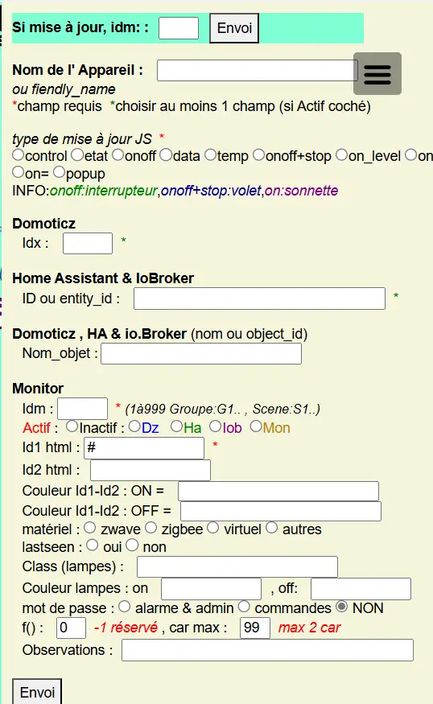
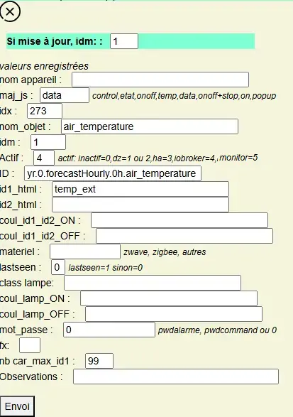
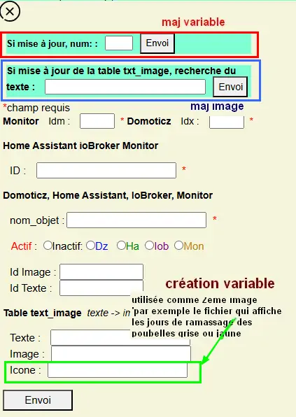

14.  ADMINISTRATION
-------------------
Page sans les options:

|image74|

Page avec toutes les options , voir aussi ce §  :ref:`14.1.1 Pour utiliser les didfférentes fonctions optionnelles`

|image788|

Si un serveur SSE est installé et SSE==true :

.. code-block

   define('SSE', true);//  true si serveur SSE utilisé par monitor

|image789|

Pour ajouter d'autres fonctions voir ce §  :ref:`14.1.2 Pour ajouter des fonctions personnelles`

14.1 fichiers communs à toutes les pages
^^^^^^^^^^^^^^^^^^^^^^^^^^^^^^^^^^^^^^^^
- **css**

voir le § :ref:`1.2.2.1 styles CSS communs à toutes les pages`

- **Index_loc.php**  *chargement de la page impératif*

.. code-block::

   // administration
   include ("include/admin.php");

- **header.php**  *Affichage obligatoire dans le menu*

.. code-block::

   <li class="zz"><a href="#admin">Administration</a></li>

- **ajax.php**

.. code-block::

   if ($app=="admin") {admin($variable,$command);}	//$command=fenetre(administration footer

- **config.php** *emplacement du fichier* 

.. code-block::

   define('MONCONFIG', 'admin/config.php');//fichier config 

- **fonctions.php**    *admin()*

Extrait de la fonction:

|image794|

14.1.1 Pour utiliser les didfférentes fonctions optionnelles
============================================================
Choisir les fonctions dans admin/config.php

.. code-block::

   define('ECRAN_ADMIN', array( // enable ou disable
     "connect_lua" => "enable", // Mots passe cryptés(Base64) et IP réseau
     "string_tableaux" => "enable",//Configuation variables dz maj_services
     "modect" => "enable", //Configuation modect dz alarmes 
     "idx_dz_list" => "enable", //Créer fichier idx/nom Domoticz , LISTE
     "var_list" => "enable", //LISTE variables (HA et DZ)
     "idx_dz-zigbee" => "enable", //Créer fichier idx/nom Domoticz , TABLEAU zigbee
     "reboot_pi" => "enable", //Reboot Raspberry
     "msmtprc" => "enable", //msmtprc (config envoi mail)
     "connect_py" => "enable" // Maj automatique des IP depuis connect.py
	));

14.1.2 Pour ajouter des fonctions personnelles
==============================================
voir les paragraphes: 

	. :ref:`14.2 admin.php, info_admin.php, test_db.php et backup_bd`,

	. :ref:`14.4 fonctions PHP`

- ajouter dans admin.php l'appel à la fonction:

.. code-block::

    <a class="admin1" href="#admin" rel="<N° CHOIX (CASE) DE LA FONCTION PHP>" style="margin-left:70px" title="reponse1" ></a> 

**admin() de fonctions.php**

|image90|

|image95|

.. important:: **Les N° pour $choix (rel de admin.php) 1 à 49 sont réservés pour des maj ultérieures du programme.**

.. admonition:: **Exemple pour executer un script PHP**

   .. code-block::

      case "14" :include ('include/backup_bd.php');echo "sauvegarde effectuée";return;

.. admonition:: **Exemple pour la modification d'un fichier**

   *ici modification du mot de passe*

   .. code-block::

      case "7" :
        echo $file.'
<form >';
        $content = file_get_contents($file);
	file_put_contents($file.'.bak.'.$time, $content);
	$_SESSION["contenu"]=$content; $find="PWDALARM','";$tab = explode($find, $content);$tab=$tab[1];$tab = explode("'", $tab);$content=$tab[0];$_SESSION["mdpass"]=$find.$content;$height="30";}
	echo '<textarea id="adm1" style="height: auto;max-height: 200px;min-height: 400px;" name="command" >' . htmlspecialchars($content) . '</textarea> 
	<input type="button" value="enregistrer" id="enr" onclick=\'wajax($("#adm1").val(),'.$rel.');\' /><input type="button" id="annuler" value="Annuler" onclick="yajax('.$idrep.')"> ';
	echo '</form>
';
        return "sauvegarde OK";	 
      case "8" :
       $newpass=$idrep;$oldpass=$_SESSION["mdpass"];$content=$_SESSION["contenu"];
       $str = str_replace($oldpass, "PWDALARM','".$newpass,$content);
       file_put_contents($file, $str);echo '
<a style="background-color: #605b5dde;color:white;
       border-color: #e0e3e6;border-radius: 0.55rem" class="btn btn-primary"  onclick="location.reload();
       return false;">redemarrer </a>
';//echo file_get_contents($file);
       return ;	 
      break;

   on utilise "explode" pour rechercher le texte à modifier 

   |image96|

14.2 admin.php, info_admin.php, test_db.php et backup_bd
^^^^^^^^^^^^^^^^^^^^^^^^^^^^^^^^^^^^^^^^^^^^^^^^^^^^^^^^

|image795|

Si io.broker est utilisé:

|image1401|

|image796|

|image797|

- **admin.php**

|image84|

|image798|

- **info_admin.php**

|image799|

- **test_db.php**

.. code-block::

   <?php
   echo '<textarea id="adm1" style="height:'.$height.'px;" name="command" >';
   echo "test....BD: ";
   // Create connection
   $con = new mysqli(SERVEUR, UTILISATEUR, MOTDEPASSE);
   // Check connection
   if ($con->connect_error) {   die("Pas de connexion au serveur: " . $con->connect_error);$_SESSION["exeption_db"]="pas de connexion à la BD";}
   else echo " connection au serveur OK , ..";
   $conn = new mysqli(SERVEUR, UTILISATEUR, MOTDEPASSE, DBASE);
   if ($conn->connect_error) { die("Verifier le nom de la BD: " . $conn->connect_error);$_SESSION["exeption_db"]="pas de connexion à la BD";}
   echo " connection à la BD OK , ..";$_SESSION["exeption_db"]="";
   echo "connexion terminée , ..";
   ?>
   </textarea>

- **backup_db.php** , *Pour la sauvegarde de la BD*

|image801|

|image802|

.. note::

   en Bash, sauvegarde  :

   .. code-block::

      mysqldump -u ltuser -p monitor > /var/www/html/monitor/DB_Backup/monitor.sql

   restauration  :

   .. code-block::

      mysql -u root -p monitor < /var/www/html/monitor/DB_Backup/monitor.sql

   **RQ: pour la restaurer, la base doit déjà exister**

   |image1541|

14.3 le javascript
^^^^^^^^^^^^^^^^^^
*Pour la fonction mdp() et le clavier(Minimal Virtual Keypad)*, voir le §  :ref:`5.5 Le Javascript, dans footer.php et mes_js.js`

- **appel de admin()**  *de fonctions.php*

|image804|

- **info_admin()**

.. code-block::

   $('.info_admin').click(function(){
   var rel=$(this).attr('rel');$('#affich_content_info').empty;var info_admin="";
   affich_info_admin(rel);
   });	
   function affich_info_admin(rel){	
   console.log(rel);
   <?php echo "var info_admin = ". $js_info_admin . ";\n";?>
   document.getElementById("affich_content_info").innerHTML = info_admin[rel];
   }

14.3.1 Topic SSE
================
voir également le § :ref:`1.1.3.2 Solution temps réel MQTT`

|image497|

14.4 fonctions PHP
^^^^^^^^^^^^^^^^^^
- **admin()**

|image805|

|image806|

|image807|

|image1402|

|image808|

14.5 Téléchargement d’un fichier externe dans Domoticz ou Home Assistant
^^^^^^^^^^^^^^^^^^^^^^^^^^^^^^^^^^^^^^^^^^^^^^^^^^^^^^^^^^^^^^^^^^^^^^^^

*Pour la mise à jour des fichiers "connect.lua, connect.py, connect.js, etc..." (variables persistentes pour les scripts Dz,Ha )* 

.. note::

   Plusieurs solutions étaient possibles mais avec l’installations de scripts et de modules supplémentaires.

   En http, on ne peut seulement télécharger un fichier depuis un site distant, on ne peut modifier un fichier.
   
   La solution retenue :

   -	Avec l’API de Domoticz ou celle de Home Assistant,  il est possible de mettre à jour des variables ; àprès la lecture et la  mise à jour d’un fichier de Monitor, on enregistre le résultat dans un fichier temporaire et on met à 1, 2, 3 ,abcd,  une variable (nommée ici "upload")  pour l’exécution d’un script qui va télécharger ce fichier deis DZ ou HA; la variable est mise à 0 jusqu’à une prochaine modification du fichier.

14.5.1 Domoticz
=============== 
La variable :

|image811|

   .. code-block::

      maj_variable("22","upload","connect","2")
   
   |image812|

   le script python :

   .. code-block::

      	#!/usr/bin/env python3
	# -*- coding: utf-8 -*-
	import requests, sys
	from connect import ip_monitor
	x= str(sys.argv[1])
	y = x.split(".")
	z=y[1]
	ip= ip_monitor
	rep="/opt/domoticz/"
	if z=="lua" :
    	rep="/opt/domoticz/www/modules_lua/"
	if z=="py" :
    	rep="/opt/domoticz/scripts/python/"    
	addr="http://"+ip+"/monitor/admin/connect/connect."+z
	req = requests.get(addr)
	with open(rep+x, "wb") as fp:
    	fp.write(req.content)

14.5.2 Home Assistant
=====================
14.5.2.1 la variable, input_text
""""""""""""""""""""""""""""""""
La variable , ici var_upload

|image1367|

|image1366|

Faire un essai avec un navigateur en envoyant "connect":

.. code-block::

   http://<IP DE MONITOR>/monitor/ajax.php?app=turn&device=input_text.var_upload&command=value&type=connect

.. note::

   l'api étant utilisée pour d'autres fonctions, ne pas tenir compte du nom des variables (ici type=valeur de var_upload)

Explications:

- dans ajax.php:

|image1570| 

- dans fonctions.php:

|image1571|

- réponse de Home Assistant:

|image1572|

|image1573|

14.5.2.2 Téléchargement du fichier :darkblue:`connect.py, connect.yaml`
"""""""""""""""""""""""""""""""""""""""""""""""""""""""""""""""""""""""
.. important::

   Python_script de HA ne peut être utilisé car l'import de modules n'est pas possible

   La fonction Python est simple aussi pour éviter d'utiliser pyscript, on va utiliser le chemin du fichier sous docker.

   |image1574|

   Pour ne pas utiliser les répertoires :darkblue:`python_script & pyscript`, réservés pour les scripts python particuliers, on crée le répertoire python

Dans configuration.yaml on crée le service:

.. code-block::

   shell_command:
     upload_fichier:
       "python3 /config/python/upload_fichier.py connect > /config/connect.log  2>&1" 

Le fichier : :darkblue:`upload_fichier.py` :

.. code-block::

   #!/usr/bin/env python3
   # -*- coding: utf-8 -*-
   import requests, sys
   from connect import ip_monitor
   x= str(sys.argv[1])
   #ip= str(sys.argv[2])
   ip=ip_monitor
   def import_fichier(ip,z,rep):
       addr="http://"+ip+"/monitor/admin/connect/"+z
       print(addr)
       req = requests.get(addr)
       with open(rep+z, "wb") as fp:
           fp.write(req.content)      
   rep="/config/python/"
   z= x+".py"
   import_fichier(ip,z,rep)
   rep="/config/"
   z= x+".yaml"
   import_fichier(ip,z,rep)
   rep="/config"

Dans automations.yaml on crée l'automation:

.. code-block::
   
   id: maj_connect
   alias: import_fichiers_connect
   triggers:
    - trigger: state
      entity_id:
        - input_text.var_upload
      to: connect
      from: '0'
   conditions: []
   actions:
    - action: shell_command.upload_fichier
      data: {}
    - data:
        value: '0'
      target:
        entity_id: input_text.var_upload
      action: input_text.set_value

|image1575|

|image1576|

14.5.3 Monitor
==============

   - **Les fonctions JS wajax() et yajax()** ,  *dans mes_js.js*

   |image813|

   - **Les fichiers temporaires**,  *dans monitor pour Domoticz*

   |image814|

14.6 Copies d’écran et explications
^^^^^^^^^^^^^^^^^^^^^^^^^^^^^^^^^^^

|image815|

|image816|

|image817|

|image818|

|image819|

|image820|

|image1403|

14.6.1 Fichier connect.xxx (mots de passe et login en base64 ,ips réseau
========================================================================
*pour utiliser ces données dans des scripts (lua, python, js ou autres)*

connect.lua, connect.py, connect.js et connect.yaml sont enregistrés dans admin/connect/:

|image1362|

|image822|

ces fichiers adaptés pour chaque langage sont téléchargés par les serveurs dans leurs répertoires d'utilisation.

.. IMPORTANT::

   Depuis la version 3.03, Si l'installaton de monitor est éffectuée automatiquement avec :ref:`lamp_monitor_install.sh` l'adresse IP de monitor est indiqué dans les fichiers connect.lua et connect.py; 

   |image1369|

   Si l'installation est effectué manuellement ou si la version de monitor est antérieure à 3.03,  l'adresse ip de monitor devra être ajoutée dans ces 2 fichiers pour Domoticz et dans connect.py pour Home Assistant

   |image1368|

14.6.1.1 connect.lua
""""""""""""""""""""

|image822|

.. important:: **L’ip de monitor dans ce fichier permet, en cas de changement de l’IP de ne pas avoir à modifier les scripts. C’est également valable pour tous les serveurs.**

14.6.1.2 connect.py
"""""""""""""""""""
*connect.py, connect.lua, connect.js, connect.yaml sont enregistrés dans monitor*, la modification de connect.py entraine la modification automatique des 3 autres formats

Ces originaux sont enregistrés dans admin/connect/ , il est toujours possible d'établir des liens symboliques dans monitor:

.. code-block::

   ln -s admin/connect/connect.py python/connect.py

|image823|

.. important::

   Ces originaux peuvent aussi servir à d'autres serveurs (un PI par exemple) ce qui facilite les mises à jour.

   Une commande dans administration permet une mise à jour automatique du RPI; pour cela le fichier admin/config.php doit posséder l’IP du serveur :

   .. code-block:: 

      define('IPRPI', '192.168.1.8');//IP du Raspberry

   |image825|

   Pour récupérer le connect.py de Monitor, **pour l'utiliser avec SSH**, le chemin  doit être indiqué dans SSH_MONITOR_PATH de admin/config.php

   .. code-block::

      //SSH_MONITOR_PATH :ex /var/www/monitor/admin/tmp/, ex autre  home/USER/
      define('SSH_MONITOR_PATH', '/var/www/monitor/admin/tmp/');

      ce chemin est utilisé dans fonctions.php admin()

   |image1280|   

   |image1363| 

- **admin.php**

 |image826|

- **admin()**  *fonctions.php*

|image827|

|image828|

|image829|

|image830|

.. warning:: **Cette commande utilise SSH2 et SCP** , voir le § :ref:`14.10  Commandes ssh2 PC distant`

14.6.1.3 connect.js
"""""""""""""""""""
*pour node-red*

|image831|

14.6.1.4 connect.yaml
"""""""""""""""""""""
*pour Home Assistant*

14.6.2 fonction devices_plan() partie consacrée à io.broker
===========================================================

|image1404|

14.7 Explications concernant l’importation distantes d’un tableau LUA
^^^^^^^^^^^^^^^^^^^^^^^^^^^^^^^^^^^^^^^^^^^^^^^^^^^^^^^^^^^^^^^^^^^^^
*Compléments sur les fichiers de variables LUA*

Concerne :

. le tableau de variable string_tableau.lua

. la liste des caméras Modect pour l’alarme

. le fichier des Logins/mots de passe

- **string_tableau.lua**   *exemple*

|image832|

.. code-block::

   -- liste de variables
   -- string
   jour_poubelle_grise="Wednesday"
   jour_poubelle_jaune="Sunday"
   semaine_poub_jaune= 0  -- 0 pour pair 1 pour impair
   -- table anniversaires
   anniversaires = {["27-08"]="Damien",["18-05"]="Yoann",["14-09"]="Jonathan",["19-07"]="Alexandra",["25-08"]="Charlotte",["01-05"]="Guillaume",["07-11"]="Corentin",["22-08"]="Pauline",["14-03"]="Clémence",["31-10"]="Eric",["01-02"]="Nathalie",["14-04"]="Christèle",["25-04"]="Katy",["23-05"]="Eveline",["23-08"]="Jean Paul",["24-07"]="Arthur",["09-07"]="Jade",["27-03"]="Judith",["06-03"]="Annie",["02-11"]="Nicole",["22-12"]="Michel"};

+ **Dans monitor** *admin/config.php* 

.. code-block::

   define('VARTAB', URLDOMOTIC.'modules_lua/string_tableaux.lua');

Création d'un fichier temporaire dans monitor, le répertoire « dz » est à créer avec les autorisations pour écrire

.. code-block::

   define('DZCONFIG', 'admin/dz/temp.lua');//fichier temp

|image835|

|image836|

+ **Dans monitor,  fonctions.php** : *function admin()*

         |image837|

      .. code-block::

         case "3" :
         echo $file.'
<form >';
           $content = file_get_contents($file);
	        if($choix==3){ file_put_contents(DZCONFIG.'.bak.'.$time, $content);}	          

- **upload et Maj par dz** :*on met à 1,2,3 ou 4 , ou ...  la variable,  dz se charge d’importer le fichier*

|image839|

|image178|

Le script lua utilisé pour ouvrir ces fichiers:

.. code-block:: 

   package.path = package.path..";www/modules_lua/?.lua"
   require 'string_tableaux'
   require 'connect'
   ...
   require 'table_zigbee'

|image842|

 Le script python : *upload_fichier.py*

.. note::

   C’est pour la raison ci-dessous que l’adresse ip de monitor se trouve dans les fichiers « connect.lua , connect.py et connect.js »

   |image843|

   Dernière version de upload.py:

   .. code-block::

      #!/usr/bin/env python3
      # -*- coding: utf-8 -*-
      import requests, sys
      from connect import ip_monitor
      x= str(sys.argv[1])
      y = x.split(".")
      z=y[1]
      z1=y[0]
      ip= ip_monitor
      rep="/opt/domoticz/"
      if z=="lua" :
          rep="/opt/domoticz/www/modules_lua/"
          addr="http://"+ip+"/monitor/admin/connect/"+z1+"."+z
      if z=="json" :
          rep="/opt/domoticz/www/modules_lua/" 
          addr="http://"+ip+"/monitor/admin/"+z1+"."+z
      if z=="py" :
          rep="/opt/domoticz/scripts/python/"
          addr="http://"+ip+"/monitor/admin/connect/"+z1+"."+z
      req = requests.get(addr)
      with open(rep+x, "wb") as fp:
          fp.write(req.content)

.. warning:: **REMARQUE IMPORTANTE**

   pour que python trouve le fichier connect et donc la variable ip_monitor, il faut ajouter le répertoire vide __INIT__.py

    |image845|

14.7.1 string_modect.json
=========================

**admin.php**

.. code-block:: 

   <a class="admin1" href="#admin" rel="10" title="reponse1" >Configuation modect dz alarmes</a>

|image849|

**fonctions.php**  *admin()*

|image850|

|image847|

|image1355|

.. seealso:: *MODECT* 

   Affichage dans admin.php mais aussi dans alarmes.php

   |image853|

14.8 Explications concernant les créations et les maj automatiques SQL des variables,  dispositifs & messages
^^^^^^^^^^^^^^^^^^^^^^^^^^^^^^^^^^^^^^^^^^^^^^^^^^^^^^^^^^^^^^^^^^^^^^^^^^^^^^^^^^^^^^^^^^^^^^^^^^^^^^^^^^^^^
- **admin.php**

:darkblue:`rel=17 et rel=18`

.. code-block:: 

   <a class="admin1" href="#admin" rel="17" title="reponse2" >Enregistrer Variable (DZ ou HA) dans SQL&nbsp;&nbsp;</a>
	 
	<a class="admin1" href="#admin" rel="18" title="reponse2" >Enregistrer Dispositifs DZ( ou HA) dans SQL&nbsp;&nbsp;</a>

- **footer.php**

|image857|

- **fonction.php** : *admin()*

|image858|

14.8.1 création d'un dispositif dans monitor
============================================

|image859|

.. note:: 

   **idm & iob+** :voir aussi :ref:`0.3.2 Les Dispositifs`

   |image1953|

- **footer.php**

|image860|

|image861|

**ajax.php puis fonctions.php** : *mysql_app()*

|image862|

**Confirmation de l'enregistrement des données**

|image863|

14.8.2 Mise à jour d'un dispositif dans monitor
===============================================
le choix s'effectue sur la même fenêtre que pour une création; les données de la base de données concernant le dispositif peuvent être mises à jour .

|image1331|

|image1332|

14.8.3 création d'une variable dans monitor
===========================================
*et d'une correspondance texte->image (table text_image)*

|image1334|

14.8.4 maj d'une variable dans monitor
======================================
Récupérer le numéro d'enregistrement de la variable:

|image1333|

|image1335|

14.8.5 maj de la table text_image
=================================
le texte contenu dans la variable est transformé en image

|image1336|

|image1337|

.. note:: l'icone peut contenir tout type d'images 

   |image1338|

14.9 Explications concernant l’affichage des infos de la page admin.php
^^^^^^^^^^^^^^^^^^^^^^^^^^^^^^^^^^^^^^^^^^^^^^^^^^^^^^^^^^^^^^^^^^^^^^^

|image864|

- **admin.php**

on ajoute pour les lignes concernées :

.. code-block::

    

..important:: :red:`rel correspond au n° de l’élément dans la table du fichier:info_admin.php`

|image865|

14.10  Commandes ssh2 PC distant
^^^^^^^^^^^^^^^^^^^^^^^^^^^^^^^^
*ici un RPI depuis monitor*

.. admonition:: **SSH, ou Secure Shell**

   *un protocole utilisé pour se connecter en toute sécurité à des systèmes distants*.

   **Les connexions étant privés , l'autorisation se fait par mot de passe**

   .. note::

      Mon RAID1 étant alimenté en 230 Volts, le PI étant alimenté sur batterie, lors d’une coupure secteur, lors de la remise sous tension, le raid1 n’est pas reconnu ; Absent de la maison il faut donc faire un reboot du PI ou un « mount -a «  en bash d’où la commande ci-dessous.

      Autre application: mise à jour de la configuration pour l’envoi de notifications par mails lors d’un changement de mot de passe par exemple.

   Pour cela on utilise le paquet php8.x-ssh2

   .. code-block:: 

      sudo apt install php8.3-ssh2 (indiquer la version de php, ici 8.3)

14.10.1 reboot PC
=================
*ou RPI*

Sur le pi, soit une commande sudo reboot, soit un script qui effectue la commande ; j’ai choisi cette dernière solution car il suffit de modifier ce fichier pour faire d’autres commandes.

.. code-block::

   #!/usr/bin/bash
   echo  "reboot"
   sudo reboot

**La fonction PHP**  *sh_scp.php*

|image868|

Comme pour toutes les autres commandes « Administration » les scripts JS et ajax existent déjà, il suffit d’ajouter l’appel de la fonction ci-dessus dans admin.php :

.. code-block::

   
   <a class="admin1" href="#admin" rel="20" style="margin-left:35px" title="reponse1" >Reboot Raspberry</a>

La fonction PHP admin() appelle la fonction ssh_scp.php

|image870|

14.10.2 commandes scp pour l’envoi ou la réception de fichiers distants
=======================================================================
*SCP veut dire Secure Copy et il est utilisé pour copier en toute sécurité des fichiers d’un ordinateur local vers des serveurs distants ou inversement, à l'aide du protocole SSH, SSH2 avec PHP*

Comme pour le reboot ci-dessus, le processus est le même mais plusieurs étapes sont nécessaires :

-	télécharger le fichier distant :green:`/etc/mcmtprc par exemple` , celui de la commande affichée dans « Administration »

-	le modifier

-	le renvoyer au pc distant

**fonctions.php , extrait de admin()**

|image872|

.. admonition:: **Exemple pour le fichier /etc/msmtprc**

    |image876|

   *msmtp est un client SMTP très simple et facile à configurer*  

   |image873|

14.11 exemple: mise à jour fichier de configuration du RPI
^^^^^^^^^^^^^^^^^^^^^^^^^^^^^^^^^^^^^^^^^^^^^^^^^^^^^^^^^^
voir ce paragraphe :ref:`14.6.1.2 connect.py`

14.12 Gestion des erreurs
^^^^^^^^^^^^^^^^^^^^^^^^^
14.12.1 Erreurs Domoticz et monitor
===================================
- **fonctions_1.php**

   |image1972|

- **fonctions.php**

   |image1973|

   |image1974|

- **footer.php**

   |image1975|

14.13 A Propos
==============
Affiche les numéros des versions de monitor, PHP et Jpgraph

|image63|

.. |image63| image:: ../media/image63.webp
   :width: 400px 
.. |image74| image:: ../media/image74.webp
   :width: 400px 
.. |image84| image:: ../media/image84.webp
   :width: 700px 
.. |image90| image:: ../media/image90.webp
   :width: 700px 

.. |image96| image:: ../media/image96.webp
   :width: 497px 
.. |image178| image:: ../media/image178.webp
   :width: 650px 
.. |image497| image:: ../media/image497.webp
   :width: 460px 
.. |image788| image:: ../media/image788.webp
   :width: 605px
.. |image789| image:: ../media/image789.webp
   :width: 375px 
.. |image794| image:: ../media/image794.webp
   :width: 630px 
.. |image795| image:: ../media/image795.webp
   :width: 464px 
.. |image796| image:: ../media/image796.webp
   :width: 406px 
.. |image797| image:: ../media/image797.webp
   :width: 419px 
.. |image798| image:: ../media/image798.webp
   :width: 700px 
.. |image799| image:: ../media/image799.webp
   :width: 700px 

.. |image802| image:: ../media/image802.webp
   :width: 324px 
.. |image804| image:: ../media/image804.webp
   :width: 664px 
.. |image805| image:: ../media/image805.webp
   :width: 700px 
.. |image806| image:: ../media/image806.webp
   :width: 605px 
.. |image807| image:: ../media/image807.webp
   :width: 650px 
.. |image808| image:: ../media/image808.webp
   :width: 635px 
.. |image811| image:: ../media/image811.webp
   :width: 650px 
.. |image812| image:: ../media/image812.webp
   :width: 700px 
.. |image813| image:: ../media/image813.webp
   :width: 618px 
.. |image814| image:: ../media/image814.webp
   :width: 319px 
.. |image815| image:: ../media/image815.webp
   :width: 379px 

.. |image817| image:: ../media/image817.webp
   :width: 532px 
.. |image818| image:: ../media/image818.webp
   :width: 526px 
.. |image819| image:: ../media/image819.webp
   :width: 461px 
.. |image820| image:: ../media/image820.webp
   :width: 477px 
.. |image821| image:: ../media/image821.webp
   :width: 508px 
.. |image822| image:: ../media/image822.webp
   :width: 485px 
.. |image823| image:: ../media/image823.webp
   :width: 595px 
.. |image825| image:: ../media/image825.webp
   :width: 427px 
.. |image826| image:: ../media/image826.webp
   :width: 700px 
.. |image827| image:: ../media/image827.webp
   :width: 604px 
.. |image828| image:: ../media/image828.webp
   :width: 650px 
.. |image829| image:: ../media/image829.webp
   :width: 700px 
.. |image830| image:: ../media/image830.webp
   :width: 403px
.. |image831| image:: ../media/image831.webp
   :width: 324px
.. |image832| image:: ../media/image832.webp
   :width: 374px
.. |image835| image:: ../media/image835.webp
   :width: 324px
.. |image836| image:: ../media/image836.webp
   :width: 488px
.. |image837| image:: ../media/image837.webp
   :width: 629px
.. |image839| image:: ../media/image839.webp
   :width: 613px
.. |image842| image:: ../media/image842.webp
   :width: 605px
.. |image843| image:: ../media/image843.webp
   :width: 528px
.. |image845| image:: ../media/image845.webp
   :width: 518px
.. |image847| image:: ../media/image847.webp
   :width: 401px
.. |image849| image:: ../media/image849.webp
   :width: 401px
.. |image850| image:: ../media/image850.webp
   :width: 609px
.. |image853| image:: ../media/image853.webp
   :width: 497px
.. |image857| image:: ../media/image857.webp
   :width: 700px
.. |image858| image:: ../media/image858.webp
   :width: 650px

.. |image860| image:: ../media/image860.webp
   :width: 590px
.. |image861| image:: ../media/image861.webp
   :width: 629px
.. |image862| image:: ../media/image862.webp
   :width: 700px
.. |image863| image:: ../media/image863.webp
   :width: 480px
.. |image864| image:: ../media/image864.webp
   :width: 387px
.. |image865| image:: ../media/image865.webp
   :width: 613px

.. |image870| image:: ../media/image870.webp
   :width: 700px
.. |image872| image:: ../media/image872.webp
   :width: 700px
.. |image873| image:: ../media/image873.webp
   :width: 450px
.. |image876| image:: ../media/image876.webp
   :width: 537px
.. |image1280| image:: ../img/image1280.webp
   :width: 700px
.. |image1331| image:: ../img/image1331.webp
   :width: 404px

.. |image1333| image:: ../img/image1333.webp
   :width: 493px

.. |image1336| image:: ../img/image1336.webp
   :width: 425px
.. |image1337| image:: ../img/image1337.webp
   :width: 425px
.. |image1338| image:: ../img/image1338.webp
   :width: 337px
.. |image1355| image:: ../img/image1355.webp
   :width: 700px
.. |image1362| image:: ../img/image1362.webp
   :width: 534px
.. |image1363| image:: ../img/image1363.webp
   :width: 700px

.. |image1368| image:: ../img/image1368.webp
   :width: 394px
.. |image1369| image:: ../img/image1369.webp
   :width: 460px
.. |image1401| image:: ../img/image1401.webp
   :width: 436px

.. |image1403| image:: ../img/image1403.webp
   :width: 600px
.. |image1404| image:: ../img/image1404.webp
   :width: 700px
.. |image1541| image:: ../img/image1541.webp
   :width: 636px
.. |image1570| image:: ../img/image1570.webp
   :width: 700px
.. |image1571| image:: ../img/image1571.webp
   :width: 700px

.. |image1573| image:: ../img/image1573.webp
   :width: 400px

.. |image1575| image:: ../img/image1575.webp
   :width: 434px

.. |image1953| image:: ../img/image1953.webp
   :width: 700px
.. |image1972| image:: ../img/image1972.webp
   :width: 700px
.. |image1973| image:: ../img/image1973.webp
   :width: 650px
.. |image1974| image:: ../img/image1974.webp
   :width: 480px
.. |image1975| image:: ../img/image1975.webp
   :width: 700px
