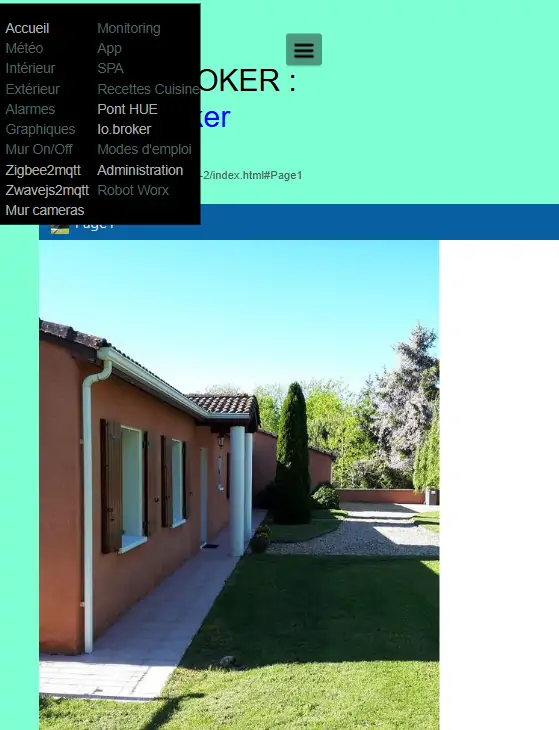
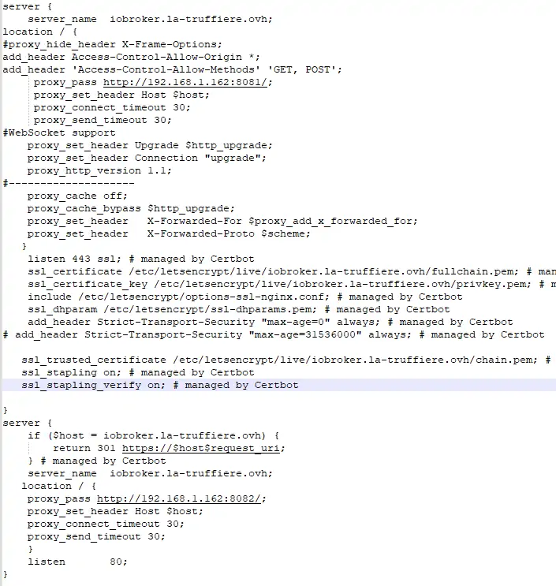

16. Ajouter des pages ou des alertes
------------------------------------
16.1 Ajouter un plan (ex : 1er étage)
^^^^^^^^^^^^^^^^^^^^^^^^^^^^^^^^^^^^^
- **créer la page** avec le plan, voir le § :ref:`2. Une 1ere PAGE : LE PLAN INTERIEUR`
	
- **Ajouter la page à index_loc.php**

|image901|

- **Ajouter la page au menu dans header.php** 

|image902|

- **Ajouter l'ID et les classes**  *si ellesexistent au fichier mes_css.css*

ci-dessous les ID's des pages existantes

.. code-block::

   #interieur, #exterieur, #meteo, #alarmes,#commandes,#murcam ,#murinter,#app_diverses,#graphiques,#admin, #zigbee, #zwave, #dvr, #nagios,#spa,#recettes{

16.2 Ajouter une page vierge
^^^^^^^^^^^^^^^^^^^^^^^^^^^^
*affichage d’un sous domaine distant*

.. code-block::

   <?php
   session_start();
   $domaine=$_SESSION["domaine"];
   if ($domaine==URLMONITOR) $lien_ID_MENU=NOM SOUS DOMAINE dans config.php;
   if ($domaine==IPMONITOR) $lien_ID MENU= NOM  IP dans config.php;;
   ?>
   <!-- section TITRE start -->
   <!-- ================ -->
   

	

		

	  <h1 id="about" class="title" style="position:relative;top:-30px;">TITRE1 : TITRE2</h1>
		         <iframe id="ID de l’IFRAME" src="<?php echo $lien_IDMENU;?>" frameborder="0" ></iframe>
		

	   

		   
 		
   <!-- section TITRE fin-->

|image903|

16.3 Ajouter une alerte, une alarme, ...
^^^^^^^^^^^^^^^^^^^^^^^^^^^^^^^^^^^^^^^^
16.3.1 Exemple avec un rappel pour la prise de médicaments sur la page d’accueil
================================================================================
- *Télécharger une icones ou image svg*

|image904|

- **Dans Domoticz** : *Créer la variable*

|image905|

*Dans le script notifications_timer* :

.. code-block::

   --médicaments
   elseif (time=='20:00' and domoticz.variables('pilule_tension').value == '0') then
        domoticz.variables('pilule_tension').set('pilule_michel')
   end

*Dans le script notifications_variables (pour une alerte sms)*

.. code-block::

   return {
	on = {
		variables = { 'pilule_tension'	}
	},
	execute = function(domoticz, variable)
	    --domoticz.log('Variable ' .. variable.name .. ' was changed', domoticz.LOG_INFO)
	    if (domoticz.variables('pilule_tension').changed) then 
                 if (domoticz.variables('pilule_tension').value ~= "0") then 
	             txt=tostring(domoticz.variables('pilule_tension').value) 
	             print('médicaments')
                 alerte_gsm('alerteù'..txt)
                 end
            end

*Dans la base de données SQL* :

La table "dispositifs"

|image908|

La table "text_image" :

|image909|

- **Dans monitor** :  *Accueil.php*

.. code-block::

   

*Les styles css* :

.. code-block::

   .pilule{position: relative;top: -300px;width: 50px;left: 220px;}

*Les scripts dans footer.php* :

|image912|

*Affichage sur la page d'accueil* :

|image913|

16.4 Ajouter une page web io.broker
^^^^^^^^^^^^^^^^^^^^^^^^^^^^^^^^^^^
une autre solution d'afficher une page si io.broker est installé.

.. important::

   l'adaptateur webui doit être installé

   |image1496|

   https://github.com/iobroker-community-adapters/ioBroker.webui

16.4.1 Ajout de la page dans monitor
====================================
|image1497|

Ajouter les infos de connexion dans admin/config.php, ici sur le 3eme serveur:

.. code-block::

   define('URLIOB', 'https://iobroker.<DOMAINE>');
   define('IPDOMOTIC2', '192.168.1.162');//ip 3emme serveur Domotique
   define('USERDOMOTIC2', '<LOGIN>');//user du serveur,répertoire :home/user
   define('PWDDOMOTIC2', '<PASS>');//mot passe serveur
   define('URLDOMOTIC2', 'http://192.168.1.162:8081/');//url ex:http://192.168.1.104:8081/
   define('TOKEN_DOMOTIC2',""); 
   define('PORT_API_DOMO2','8093');//port de l'API éventuel
   define('PORT_WEBUI_DOMO2','8082/webui/');//port web UI et dossier éventuel

16.4.1.1  page include/iobroker.php
"""""""""""""""""""""""""""""""""""

|image1498|

- styles css:

.. code-block::

   /* pour iframe , ajout de #iobrokerapp*/
   #habridgeapp, #iobrokerapp{width: 700px;height: 800px;position: relative;top: 10px;}
   /* pour la page,  ajout de #iobroker */
   #interieur, #exterieur, #meteo, #alarmes,#commandes,#murcam ,
   #murinter,#app_diverses,#graphiques,#admin, #zigbee, #zwave, #dvr, #nagios,#spa,#recettes, #habridge, #modes_emploi, #iobroker{
    width: 100%;
    height: 1120px;padding: 80px 0;
    min-height: 100%;
    position: relative;
    color: #000;
    top: 350px;z-index:-20;overflow: auto;
   }
   #interieur, #exterieur,#alarmes,#commandes,#murcam ,#murinter,
   #app_diverses,#admin, #zigbee, #zwave, #dvr, #nagios,#spa,#recettes, #habridge, #modes_emploi, #iobroker{
    background-color: aquamarine;}
   /* Large devices (small desktops <535) */
   @media (max-width:534px) {#habridgeapp, #iobrokerapp{width: 480px;height: 600px;}}

16.4.1.2  page index_loc.php,include/header.php
"""""""""""""""""""""""""""""""""""""""""""""""
- ajouter dans index_loc.php:

.. code-block::

   if (URLIOB!="") include ("include/iobroker.php");//iobroker

- ajouter dans include/header.php:

.. code-block::

   <?php if (URLIOB!="") echo '<li class="zz"><a href="#iobroker">Io.broker</a></li>';?>

si besoin, modifier la hauteur du menu:

.. code-block::

   .nav {height: 295px;}

16.4.2 Hôte virtuel dans NGINX
==============================

configuration pour le port 80 avant la demande de certificat Let'sencrypt

.. note::

   un domaine et un sous domaine doit être crée chez un hébergeur (OVHcloud est l'un des moins cher avec une extension .ovh) 

.. code-block::

    upstream iobroker { 
    server 192.168.1.162:8082;
   }
   server {
    server_name  iobroker.DOMAINE;
   location / {
    proxy_pass http://iobroker/webui/runtime.html;
     proxy_set_header Host $host;
        proxy_connect_timeout 30;
        proxy_send_timeout 30;
    }
    listen 80; 
    }
 
16.4.2.1 Demande de certificat avec Cerbot
""""""""""""""""""""""""""""""""""""""""""
Pour installer Cerbot , :ref:`21.12.3 Accès distant SSL & HTTP2`

.. code-block::

    sudo certbot --nginx --agree-tos --redirect --hsts --staple-ocsp --email <xxxxxxxxxx>@orange.fr -d iobroker.<DOMAINE>

confifuration de l'hôte  modifiée par Cerbot:

|image1499|

.. |image901| image:: ../media/image901.webp
   :width: 534px
.. |image902| image:: ../media/image902.webp
   :width: 700px
.. |image903| image:: ../media/image903.webp
   :width: 700px
.. |image904| image:: ../media/image904.webp
   :width: 416px
.. |image905| image:: ../media/image905.webp
   :width: 575px
.. |image908| image:: ../media/image908.webp
   :width: 502px
.. |image909| image:: ../media/image909.webp
   :width: 432px
.. |image912| image:: ../media/image912.webp
   :width: 700px
.. |image913| image:: ../media/image913.webp
   :width: 503px
.. |image1496| image:: ../img/image1496.webp
   :width: 250px

.. |image1498| image:: ../img/image1498.webp
   :width: 700px

