5. L’ALARME
-----------
Pour l’activation ou l’arrêt par GSM voire ce paragraphe qui traite du script python avec les codes retenus pour l’alarme. :ref:`18.4 Commandes de l’alarme à partir d’un GSM`

|image408|

*Pour entrer le mot de passe : redirection vers la page administration* 

Le script LUA dans Evènements de Domoticz : https://raw.githubusercontent.com/mgrafr/monitor/main/scripts_dz/lua/alarme_intrusion.lua

5.1 Dans Domoticz, les interrupteurs virtuels, les variables
^^^^^^^^^^^^^^^^^^^^^^^^^^^^^^^^^^^^^^^^^^^^^^^^^^^^^^^^^^^^
**les interrupteurs virtuels**

Les boutons poussoir marche/arrêt pour les commandes :

- m/a alarme de nuit

- m/a alarme absence

- m/a al_nuit_auto

- m/a sirène

- m/a mode detect des caméras

- poussoir de reset des valeurs de Domoticz,

- activation/désactivation de la sirène : permet de faire des essais sans nuisances sonores ; la sirène est toutefois indiquée ON ou OFF

**Option** : allumages de lampes :

Dans ce tuto : lampe_salon (lampe commandée par le 433MHz avec une interface Sonoff modifié, voir le site domo-site.fr

|image409|

Pour le test sirène : un interrupteur « PUSH »

|image410|

On ajoute les dispositifs au plan ; 

.. info::
   le plan peut se résumer à un simple cadre ou être très simplifié, il ne sert qu’à regrouper les dispositifs pour récupérer les données avec un seul appel à l’API json

|image414|

|image417|

**Les variables, initialisée** à 0

-	**ma-alarme** :

|image418|

o	0  =  alarme non activée,

o	1  = alarme absence activée, les capteurs PIR sont pris en compte

o	2  = alarme nuit activée, les capteurs PIR sont ignorés

-	**modect** : pour la mise en service de la détection par caméras (non utilisé actuellement, pour une notification en page d’accueil ou autre …)

-	**porte-ouverte**

-	**intrusion**

-	**alarme* : est utilisée pour un affichage sur la page d’accueil ; 

-	**activation-sir-txt**, texte activation de la sirène : activer ou désactiver

- **Notifications** : notifications_devices.lua, notifications_timer.lua 

|image423|

https://raw.githubusercontent.com/mgrafr/monitor/main/scripts_dz/lua/notification_devices.lua

|image424|

.. warning::

   **ATTENTION** :
   L’utilisation du modem 4G Ebyte n’autorise pas, pour les textes, les accents et les espaces, utiliser des Under scores(ou autre signe) pour séparer les mots

Script :darkblue:`notifications_variables.lua`, lignes concernées 

.. code-block:: 'fr'

   if (domoticz.variables('porte-ouverte').changed) then  
	             txt=tostring(domoticz.variables('porte-ouverte').value) 
	             print("porte-ouverte")
                 alerte_gsm('alarmeù'..txt)
   end
   if (domoticz.variables('intrusion').changed) then  
	             txt=tostring(domoticz.variables('intrusion').value) 
	             print('intrusion')
                 alerte_gsm('alarmeù'..txt)
   end

Script :darkblue:`notifications_timer.lua`, lignes concernées

voir ce paragraphe : :ref:`le script LUA pour les notifications concernant le temps: ‘notification-timer.lua>`_

|image426|

.. note::

   L’utilisation de :red:`timer= at hh :mm-hh` :mm ne peut être utilisé ; 

   j’ai essayé isTimer mais ça ne fonctionne que pour ON ; else avec isTimer ne fonctionne pas.

.. admonition:: **des explications concrnant le script alarme_intrusion.lua** 

   |image428|

   |image429|

   **Pour activer ou désactiver la sirène** :

      Pour les textes : notifications_devices.lua
   .. code-block:: 'fr'

     -- activation sirène
            if (device.name == 'activation-sirene' and  device.state=='On') then domoticz.variables('activation-sir-txt').set("désactiver");
            else domoticz.variables('activation-sir-txt').set("activer");
            end  

   *Pour l’activation ou la désactivation* :

    |image431|

   *Pour allumer des lampes* :

    |image432|

   *Pour ajouter des dispositifs* :

    |image433|

**Le fichier pushover.sh** :

 .. code-block:: 'fr'

   #!/bin/bash
   TITLE="Alerte"
   APP_TOKEN="xxxxxxxxxxxxxxxxxxxxxxxxxxxxxxxxxx"
   USER_TOKEN="xxxxxxxxxxxxxxxxxxxxxxxxxxxxxxxxxxxx"
   MESSAGE=$1 
   echo $1
   curl -s -F "token=$APP_TOKEN" \
   -F "user=$USER_TOKEN" \
   -F "title=$TITLE" \
   -F "message=$MESSAGE" \
   https://api.pushover.net/1/messages.json

*Ou en Python* :

.. code-block:: 'fr'

   #!/bin/python
   import requests,sys
   x= str(sys.argv[1])
   r = requests.post("https://api.pushover.net/1/messages.json", data = {
   "token": "xxxxxxxxxxxxxxxxxxxxxxxxxxxxxxxxxxx",
   "user": "xxxxxxxxxxxxxxxxxxxxxxxxxxxxxxxxxxxxxxxxx",
   "message": x
   })
   print(r.text)

Voir les pages web :

- http://domo-site.fr/accueil/dossiers/10 

- Et http://domo-site.fr/accueil/dossiers/8

.. admonition:: **Résumé des scripts Domoticz concernés**

   |image434|

5.1.1 explications concernant MODECT
====================================
Si l’alarme absence est activée les caméras autorisées passent en mode MODECT automatiquement.

Dans les autres cas Modect peut être activé manuellement.

|image435|

|image436|

.. warning

   **Il faut avoir installé Zoneminder**

5.1.1.1 Jeton ZM
""""""""""""""""
Dans fonctions.php :

|image437|

|image438|

*Le format du fichier est json pour une exploitation facile avec Domoticz*

5.1.1.2 le script lua
"""""""""""""""""""""

*dans :darkblue:`alarme_intrusion.lua`*

|image439|

Le fichier :darkblue:`string_modect` est écrit automatiquement à partir de Zoneminder, il est visible dans « administration »

|image440|

|image05|

*Capture d'écran de ZM* :

|image441|

Le choix des caméras se fait dans la BD :

|image442|

5.2 Construction de l’image
^^^^^^^^^^^^^^^^^^^^^^^^^^^
On ajoute les composants avec Inkscape, les ID pour les changements de couleur, *pas besoin de onclick, il n’y a que des dispositifs virtuels*.

La construction de la page est identique à celle du plan intérieur.

|image443|

|image444|

Les boutons M/A sont réalisés avec 2 cercles de grandeur et de couleur différentes, les poussoirs simples (les mains) sont des icones téléchargées ; 

l’icône png de Domoticz a été convertie en svg.

|image445| |image446| |image447|

On ajoute des zones de textes pour la date, les messages ,...

|image448|

.. code-block:: 'fr'

   <text xml:space="preserve"
   style="font-size:14.8002px;line-height:1.25;font-family:sans-serif;fill:#ffffff;stroke-width:1"
   x="295"
   y="93.74398"
   id="console1"
   transform="scale(1.0550891,0.94778725)"><tspan
     sodipodi:role="line"
     id="tspan1850"
     x="269.5726"
     y="93.74398"
     style="stroke-width:1">txt</tspan></text>

On enregistre l’image dans un fichier PHP, comme indiqué au paragraphe :ref:`2.2 Des exemples d’autres dispositifs`

On peut aussi ajouter les ID en s'aidant de l'outil de dévelopement  (F12 du navigateur)

|image450|

.. admonition:: **Vérifier qu’il n’y a pas de doublon d’ID**

   dans ce cas faire des remplacements : 

   exemple: **remplacer « pathxxxx »** par « pathyyy »

   ou avec Notepad tous les ’’path remplacé par ‘’patha

.. admonition:: **Un extrait concernant le bouton « activation/désactivation de la sirène »**

   |image451|

5.3 Base de données
===================
**Table « dispositifs »**

Après avoir ajouté les ID : enregistrement des dispositifs virtuels dans la base de données ; On ajoute au dispositif dans la colonne pass : « **pwdalarm** » pour limiter l’accès ;(:red:`cette valeur peut être modifiée dans config.php`)

|image452|

|image453|

Comme on peut le voir pour l’alarme absence il a été préféré l’ID du cercle à l’ID choisi avec Inkscape 

|image454|

|image455|

**Il est aussi possible de renommer l’ID du cercle.**

*les variables concernées*

|image456|

5.4- Le PHP
^^^^^^^^^^^
- **alarme.php** :

https://raw.githubusercontent.com/mgrafr/monitor/main/include/alarmes.php

|image457|

- **test_pass.php** : surligné en jaune, pour admin.php, voir le § :ref:`14.2 admin.php, test_db.php et backup_bd`

|image449|

|image458|

|image459|

|image460|

.. code-block:: 'fr'

   <text xml:space="preserve"
   style="font-size:14.868px;line-height:1.25;font-family:sans-serif;fill:#000000;stroke-width:0.999996;"
   x="80.619217"
   y="282.70932"
   id="text6416"
   transform="scale(1.0628321,0.94088238)"><tspan
     sodipodi:role="line"
     id="not"
     x="80.619217"
     y="282.70932"
     style="stroke-width:0.999996;fill:white;" /></text>

- **Mot de Passe**

*Le fichier config.php gère les mots de passe de l’alarme et de la commande des dispositifs (on/off)*

.. code-block:: 'fr'

   // mot passe alarme et administation , la page administration est ON
   define('PWDALARM','004546');//mot passe alarme
   define('NOM_PASS_AL','pwdalarm');// nom du mot de passe dans la BD
   define('TIME_PASS_AL','3600');// temps de validité du mot de passe

*La fonction mdp() dans fonctions.php* :

.. code-block:: 'fr'

   // --------------MOT de PASSE-----------------------------
   function mdp($mdp,$page_pass){// 1=commandes , 2=alarmes
   //if ($_SESSION["pec"]=="admin"){echo "azerty";$page_pass=3;}
   switch	($page_pass) {
   case "1":
   if ($mdp==PWDCOMMAND) {$mp="OK";$_SESSION['passwordc']=$mdp;}
   else {$mp="entrer le mot de passe";}		
   break;
   case "2":
   if ($mdp==PWDALARM) {$mp="OK";$_SESSION['passworda']=$mdp;$_SESSION['time']=time()+TIME_PASS_AL;}
   else {$mp="pasword non valide";}			
   break;		
   default:
   $mp="erreur";
   }
   $info=['statut' => $mp];
   return $info;}

**Le script qui commande les poussoirs M/A**

|image464|

5.5 Le Javascript, dans footer.php et mes_js.js
^^^^^^^^^^^^^^^^^^^^^^^^^^^^^^^^^^^^^^^^^^^^^^^
- Les scripts pour les mots de passe, dans js/mes_js.js

|image465|

- Et le script pour le clavier affiché dans administration

|image466|

.. warning::

   Sans mot de passe les commandes sont impossibles ; si le temps est dépassé pour l’utilisation du mot de passe, le bouton « Entrer votre mot de passe » apparait lors d’un click. 

|image467|

|image468|

*La fonction maj_services (footer.php) permet la mise à jour des textes « activer ou désactiver »*

- Le script pour afficher une modale « modalink »

|image469|

5.6 -Comme pour les autres pages
^^^^^^^^^^^^^^^^^^^^^^^^^^^^^^^^
Il ne reste qu’à :

	- Ajouter cette page dans config.php

.. code-block:: 'fr'

   define('ON_ALARM',true);// affichage pour utilisation de l'alarme

- Ce qui ajoutera l’alarme dans le menu 
	 
|image471|

5.7- Affichage d’une icône sur la page d’accueil
^^^^^^^^^^^^^^^^^^^^^^^^^^^^^^^^^^^^^^^^^^^^^^^^

|image472|

Pour l’alarme de nuit, pour ne pas oublier de l’annuler le matin si la fonction auto n’a pas été choisie

- **CSS**

.. code-block:: 'fr'

   #alarme_nuit{position:absolute;top:815px;left: 170px;width: 40px;}

.. code-block:: 'fr'

   /* Large devices (small desktops <535) */
   @media (max-width:534px) {#alarme_nuit{top:580px;}

- **accueil.php** :

.. code-block:: 'fr'

   

Dans Domoticz : la variable a déjà été crée, quand l’alarme nuit est activée, son contenu :

|image476|

La table text_images : correspondance entre le texte et l’image

|image477|

|image479|

5.8 Améliorations utiles
^^^^^^^^^^^^^^^^^^^^^^^^
5.8.1- la mise en marche automatiquement de l’alarme de nuit
============================================================
 - à certaines heures 
	
.  On ajoute un bouton avec Inkscape ; pour cela :
.  On charge dans Inkscape le fichier PHP de l’image ; on accepte l’avertissement car ce n’est pas une extension svg.
.  On modifie l’image ; on ajoute un bouton
.  On sauvegarde l’image sous un autre nom, l’extension sera .svg; comme précédemment avec les images, on la copie dans le fichier avec l’extension PHP

|image480|

5.8.1.1 Dans Domoticz
"""""""""""""""""""""
- On ajoute un poussoir virtuel : al_nuit_auto

|image481| |image482|

- On ajout le switch au plan

|image483|

|image484|

- *Les scripts lua notification_timer.lua & notification_devices.lua* :

voir ce § :ref:`Notifications : notifications_devices.lua, notifications_timer.lua>`_

**Log** :

|image485|

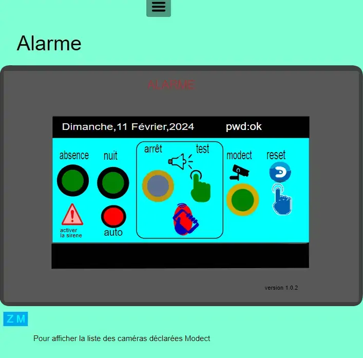
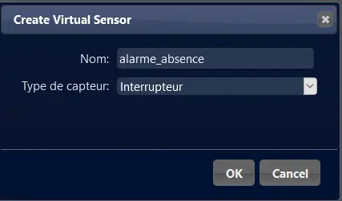
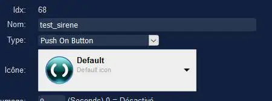
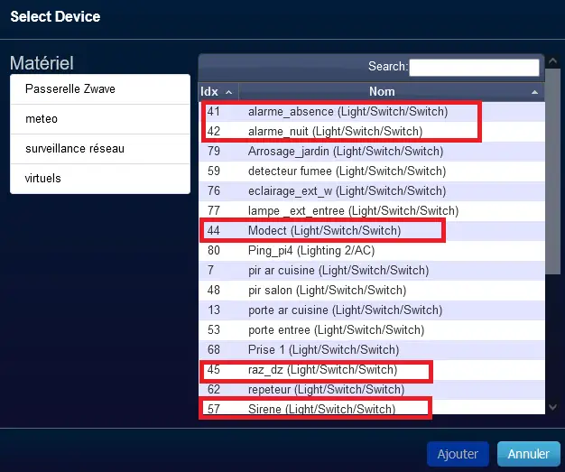
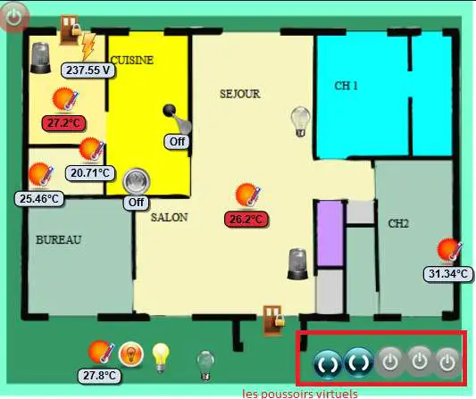
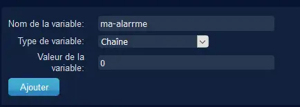
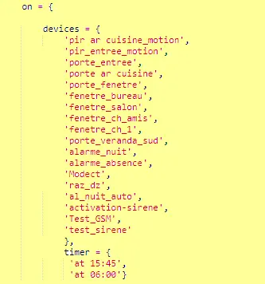
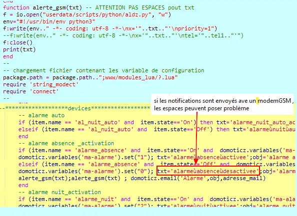
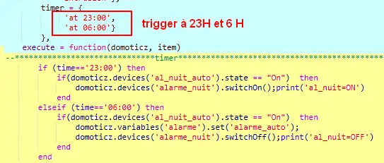
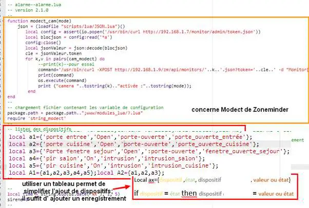
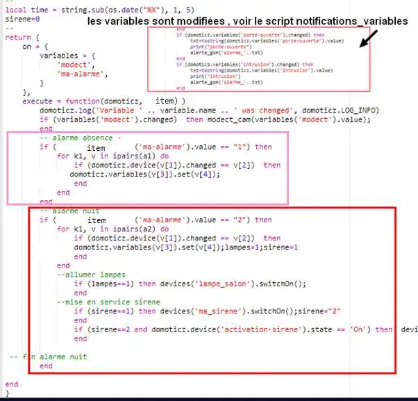
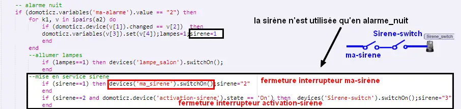
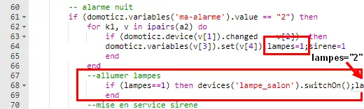
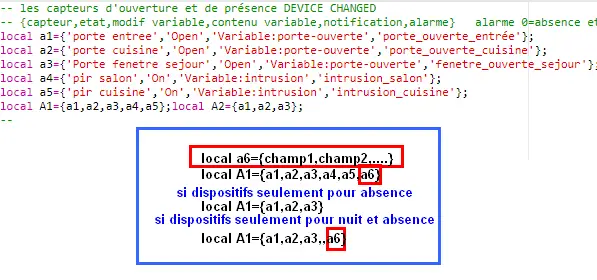
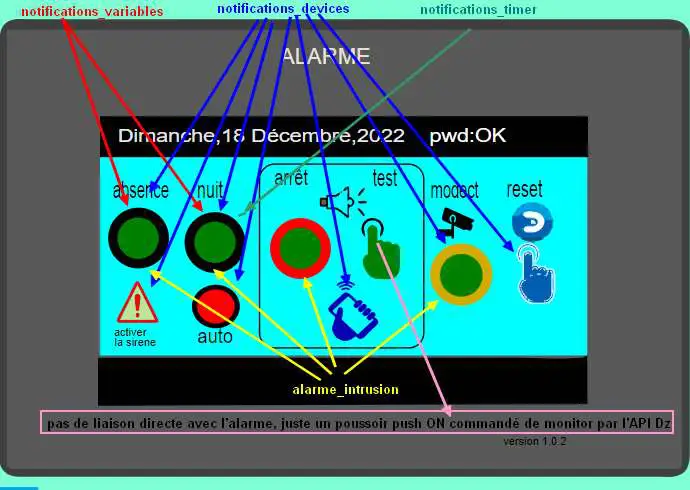
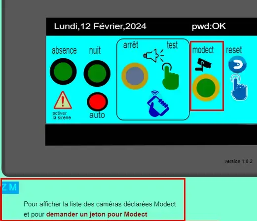
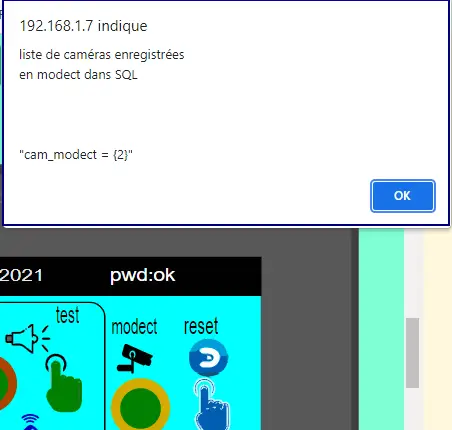
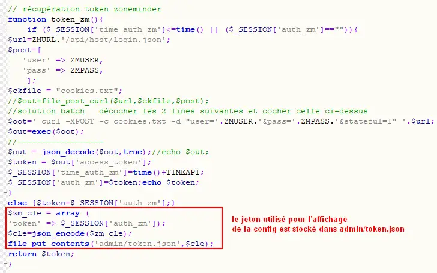
.. |image438| image:: ../media/image438.webp
   :width: 644px
.. |image439| image:: ../media/image439.webp
   :width: 661px
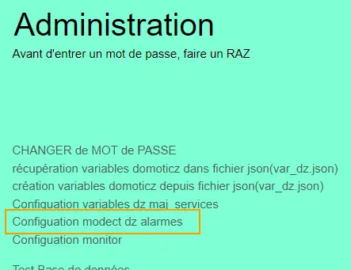
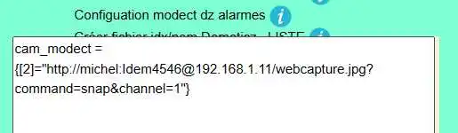
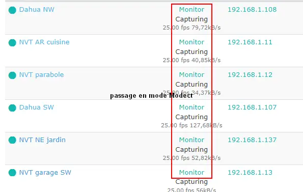
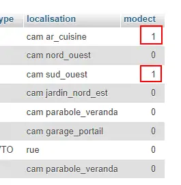
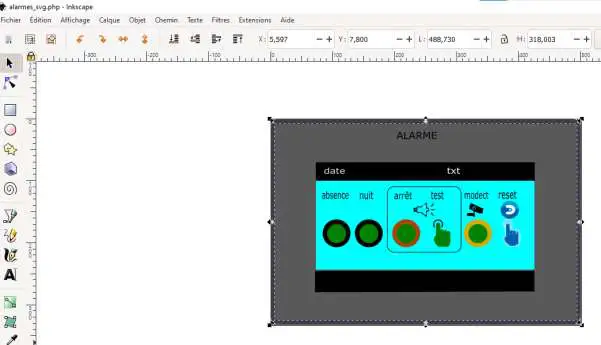
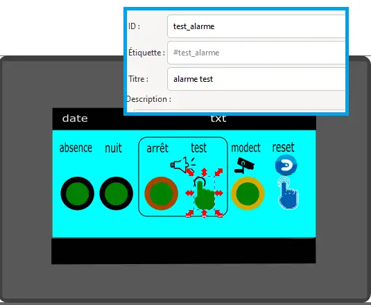
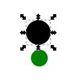
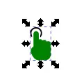
.. |image447| image:: ../media/image447.webp
   :width: 81px
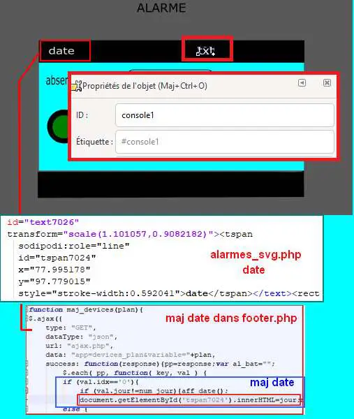
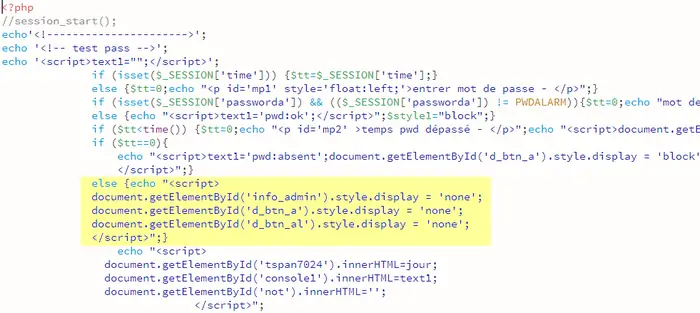
.. |image450| image:: ../media/image450.webp
   :width: 571px
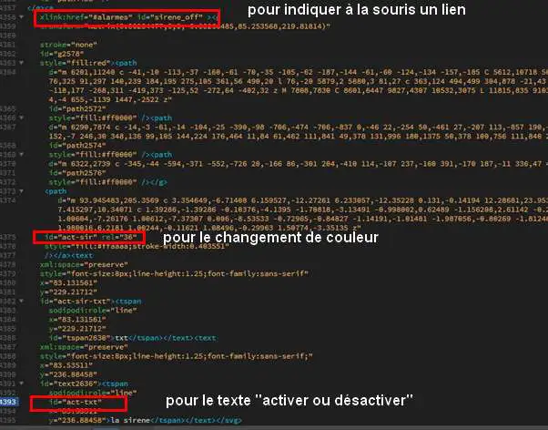
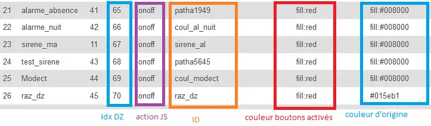
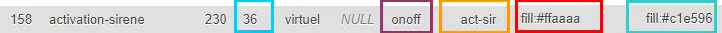
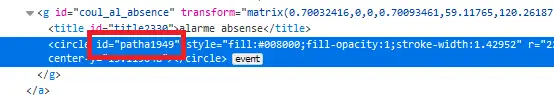
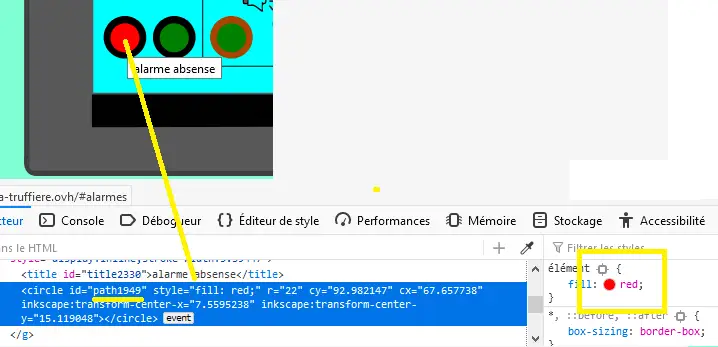
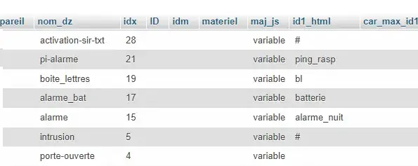
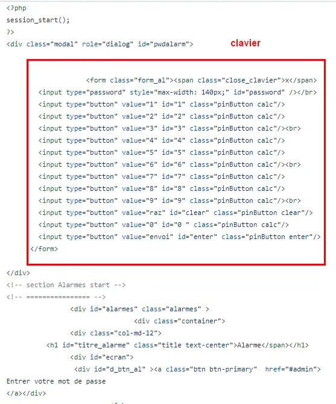
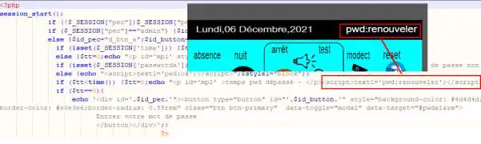
.. |image459| image:: ../media/image459.webp
   :width: 661px
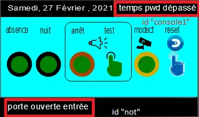
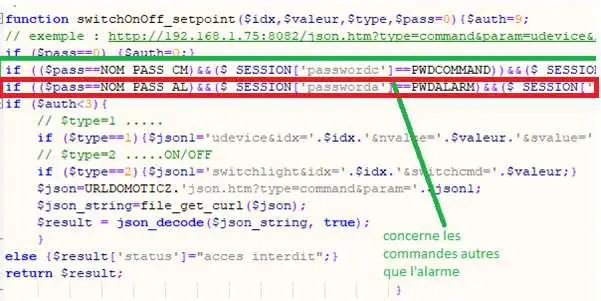
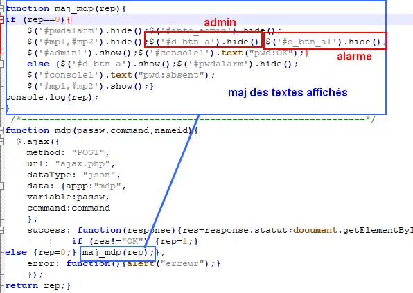
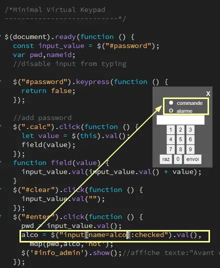
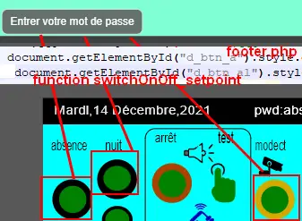
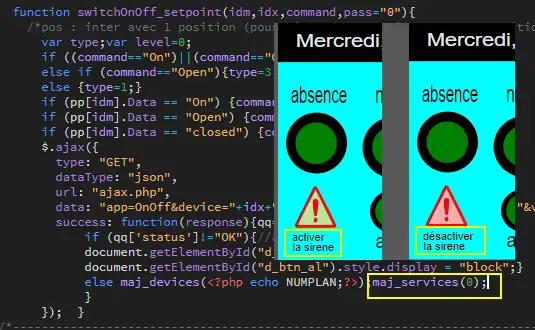
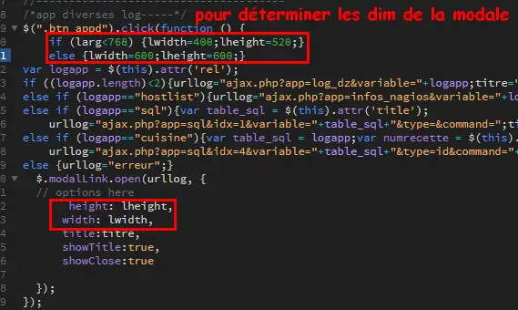
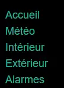
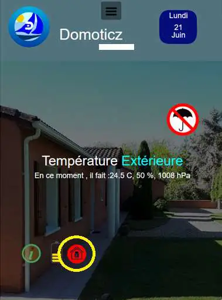
.. |image476| image:: ../media/image476.webp
   :width: 617px
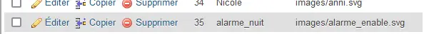
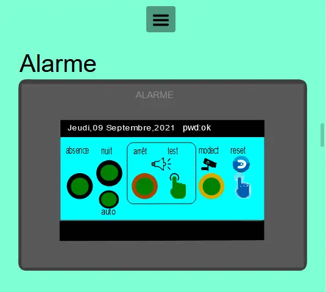
.. |image480| image:: ../media/image480.webp
   :width: 650px
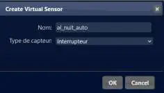
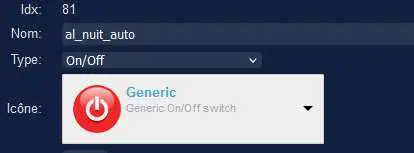
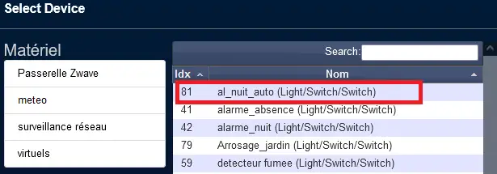

.. |image485| image:: ../media/image485.webp
   :width: 700px 
