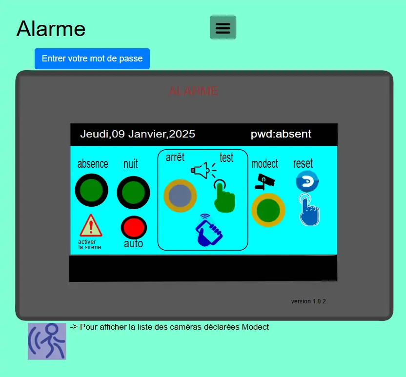

5. L’ALARME
-----------
Pour l’activation ou l’arrêt par GSM voire ce paragraphe qui traite du script python avec les codes retenus pour l’alarme. :ref:`18.4 Commandes de l’alarme à partir d’un GSM`

|image408|

*Pour entrer le mot de passe : redirection vers la page administration* 

Le script LUA dans Evènements de Domoticz : https://raw.githubusercontent.com/mgrafr/monitor/main/scripts_dz/lua/alarme_intrusion.lua

5.1 Dans Domoticz, les interrupteurs virtuels, les variables
^^^^^^^^^^^^^^^^^^^^^^^^^^^^^^^^^^^^^^^^^^^^^^^^^^^^^^^^^^^^
**les interrupteurs virtuels**

Les boutons poussoir marche/arrêt pour les commandes :

- m/a alarme de nuit

- m/a alarme absence

- m/a al_nuit_auto

- m/a sirène

- m/a mode detect des caméras

- poussoir de reset des valeurs de Domoticz,

- activation/désactivation de la sirène : permet de faire des essais sans nuisances sonores ; la sirène est toutefois indiquée ON ou OFF

**Option** : allumages de lampes :

Dans ce tuto : lampe_salon (lampe commandée par le 433MHz avec une interface Sonoff modifié, voir le site domo-site.fr

|image409|

Pour le test sirène : un interrupteur « PUSH »

|image410|

On ajoute les dispositifs au plan ; 

.. info::
   le plan peut se résumer à un simple cadre ou être très simplifié, il ne sert qu’à regrouper les dispositifs pour récupérer les données avec un seul appel à l’API json

|image414|

|image417|

**Les variables, initialisée** à 0

-	**ma-alarme** :

|image418|

o	0  =  alarme non activée,

o	1  = alarme absence activée, les capteurs PIR sont pris en compte

o	2  = alarme nuit activée, les capteurs PIR sont ignorés

-	**modect** : pour la mise en service de la détection par caméras (non utilisé actuellement, pour une notification en page d’accueil ou autre …)

-	**porte-ouverte**

-	**intrusion**

-	**alarme* : est utilisée pour un affichage sur la page d’accueil ; 

-	**activation-sir-txt**, texte activation de la sirène : activer ou désactiver

- **Notifications** : notifications_devices.lua, notifications_timer.lua 

|image423|

https://raw.githubusercontent.com/mgrafr/monitor/main/scripts_dz/lua/notification_devices.lua

|image424|

.. warning::

   **ATTENTION** :
   L’utilisation du modem 4G Ebyte n’autorise pas, pour les textes, les accents et les espaces, utiliser des Under scores(ou autre signe) pour séparer les mots

Script :darkblue:`notifications_variables.lua`, lignes concernées 

.. code-block:: 'fr'

   if (domoticz.variables('porte-ouverte').changed) then  
	             txt=tostring(domoticz.variables('porte-ouverte').value) 
	             print("porte-ouverte")
                 alerte_gsm('alarmeù'..txt)
   end
   if (domoticz.variables('intrusion').changed) then  
	             txt=tostring(domoticz.variables('intrusion').value) 
	             print('intrusion')
                 alerte_gsm('alarmeù'..txt)
   end

Script :darkblue:`notifications_timer.lua`, lignes concernées

voir ce paragraphe : :ref:`le script LUA pour les notifications concernant le temps: ‘notification-timer.lua>`_

|image426|

.. note::

   L’utilisation de :red:`timer= at hh :mm-hh` :mm ne peut être utilisé ; 

   j’ai essayé isTimer mais ça ne fonctionne que pour ON ; else avec isTimer ne fonctionne pas.

.. admonition:: **des explications concrnant le script alarme_intrusion.lua** 

   |image428|

   |image429|

   **Pour activer ou désactiver la sirène** :

      Pour les textes : notifications_devices.lua
   .. code-block:: 'fr'

     -- activation sirène
            if (device.name == 'activation-sirene' and  device.state=='On') then domoticz.variables('activation-sir-txt').set("désactiver");
            else domoticz.variables('activation-sir-txt').set("activer");
            end  

   *Pour l’activation ou la désactivation* :

    |image431|

   *Pour allumer des lampes* :

    |image432|

   *Pour ajouter des dispositifs* :

    |image433|

.. |image409| image:: ../media/image409.webp
   :width: 427px
.. |image410| image:: ../media/image410.webp
   :width: 450px
.. |image414| image:: ../media/image414.webp
   :width: 626px
.. |image417| image:: ../media/image417.webp
   :width: 533px
.. |image418| image:: ../media/image418.webp
   :width: 434px
.. |image423| image:: ../media/image423.webp
   :width: 379px
.. |image424| image:: ../media/image424.webp
   :width: 379px
.. |image426| image:: ../media/image426.webp
   :width: 633px
.. |image428| image:: ../media/image428.webp
   :width: 602px
.. |image429| image:: ../media/image429.webp
   :width: 602px
.. |image431| image:: ../media/image431.webp
   :width: 700px
.. |image432| image:: ../media/image432.webp
   :width: 520px
.. |image433| image:: ../media/image433.webp
   :width: 597px
