12. - Autres Pages  Nagios, SQL, Vis2
-------------------------------------
12.1 Ajout d'une page Vis2 de IoBroker
^^^^^^^^^^^^^^^^^^^^^^^^^^^^^^^^^^^^^^
|image1710| 

12.2 Ajout d'une page avec diverses App
^^^^^^^^^^^^^^^^^^^^^^^^^^^^^^^^^^^^^^^
Les scripts pour afficher des données sur d’autres pages peuvent être sur ce modèle, avec l’utilisation de modalink pour afficher ces données : https://github.com/dmhendricks/jquery-modallink

|image679| 

|image680| 

.. note:: 

   **Les fichiers header.php, config.php, les styles css, etc**

   voir les pages précédentes :

   - :ref:`7.1- les pages index_loc.php, header.php, entete_html.php`

   - :ref:`8.1 les fichiers de base`

- **Le fichier app_diverses.php**

.. code-block::

   <?php
   session_start();
   $domaine=$_SESSION["domaine"];
   if ($domaine==URLMONITOR) $lien_img="";
   if ($domaine==IPMONITOR) $lien_img="/monitor";
   ?><!-- section App diverses start -->
		

			

		

	   <h1 class="title_ext text-center">App  diverses</h1> 
	   /images/dz.webp" style="width:50px;height:auto;margin:10px 0 10px 120px" alt="dz">
		<form2>
		
<input type="button" rel="1" style="margin-left: 60px;" class="btn_appd" value="afficher fichier log normal">
	
		
<input type="button" rel="2" style="margin-left: 60px;" class="btn_appd" value="afficher fichier log statut">

		
<input type="button" rel="4" style="margin-left: 60px;" class="btn_appd" value="afficher fichier log erreur">

		/images/nagios.webp" style="width:100px;height:auto;margin:10px 0 10px 100px" alt="dz">
		
<input type="button" rel="hostlist" style="margin-left: 60px;" class="btn_appd" value="afficher hosts Nagios">

		/images/serveur-sql.svg" style="width:40px;height:auto;margin:0 0 10px 118px" alt="dz">
		
<input type="button" rel="sql" title="date_poub" style="margin-left: 60px;" class="btn_appd" value="afficher historique poubelles">

		</form>   

|image682|

- **footer.php**

|image683|

- **Fonctions.php**, *les fonctions log_dz()  et app_nagios()*

|image684|

|image685|

|image686|

12.3 Ajout de donnée MySQL
^^^^^^^^^^^^^^^^^^^^^^^^^^
12.3.1 Edition de l’historique du ramassage des poubelles
=========================================================

|image687|

.. admonition:: **ne nombre d'enregistrements affichés doit être défini dans admin/config.php**

   .. code-block::

      define('ON_APP',true);// mise en service page app diverses
      define('APP_NB_ENR',30); //nb d'enregistrements affichés , concene poubelles

|image688|

- **Le fichier app_diverses.php**

   Une icône est téléchargée ou celle du fichier image (celle-ci-dessus) est utilisée

|image689|

.. code-block::

   /images/serveur-sql.svg" style="width:40px;height:auto;margin:0 0 10px 118px" alt="dz">
   
<input type="button" rel="sql1" style="margin-left: 60px;" class="btn_appd" value="afficher historique poubelles">

- **La fonction php : sql_app()**  déjà vu au §  :ref:`1.6.1- exemple avec la date de ramassage des poubelles`

- **footer.php** 

   |image691|

Ligne de code concernée:

.. code-block::

   else if (logapp=="hostlist"){urllog="ajax.php?app=infos_nagios&variable="+logapp;titre="Hosts Nagios";}
   else if (logapp=="sql"){var table_sql = $(this).attr('title');
	urllog="ajax.php?app=sql&idx=1&variable="+table_sql+"&type=&command=";titre="historique poubelles";}
   else {urllog="erreur";}

12.3.2 Ajout d’une icône à l’historique des poubelles
=====================================================

- **Dans la BD** : une colonne est réservée pour l’icône

   . dans la table "date_poub"

   . dans la table "text_image

|image692|

- **footer.php** *maj_services() et $(#poubelles)*

|image694|

|image695|

- **fonctions.php**  *status_variables()* 

pour que maj_services (footer.php) récupère le chemin de l’icône la fonction sql_app doit envoyer la donnée

|image696|

Pour la restitution de l’historique :

|image697|

- **Affichage dans monitor**

|image698|

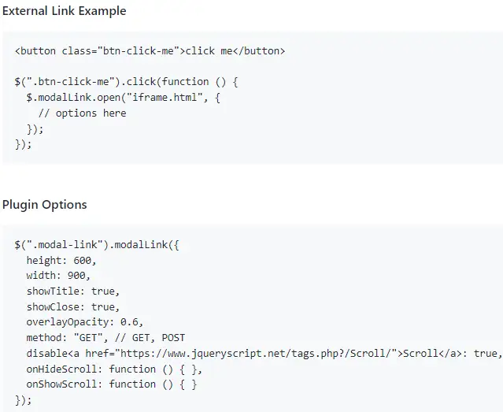
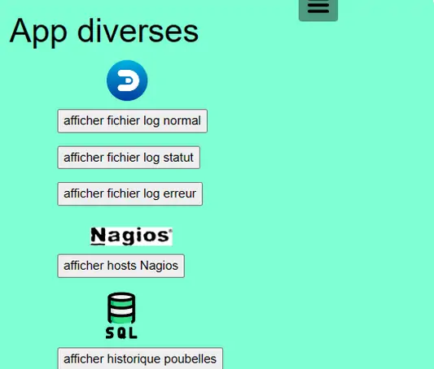
.. |image682| image:: ../media/image682.webp
   :width: 535px
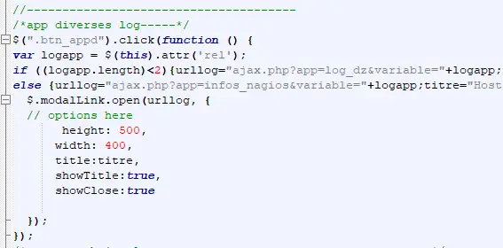
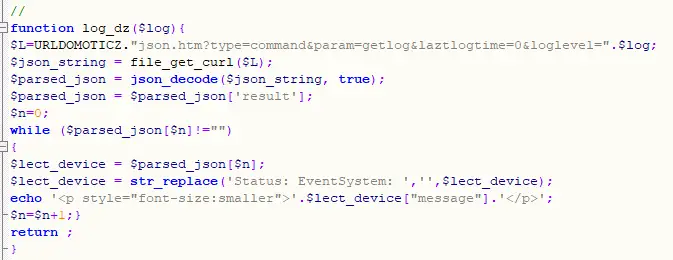
.. |image685| image:: ../media/image685.webp
   :width: 585px
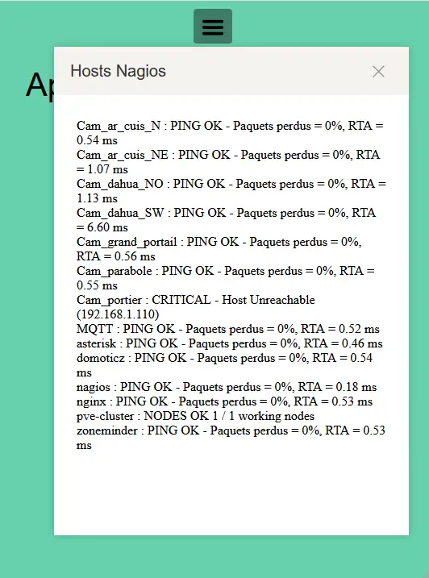
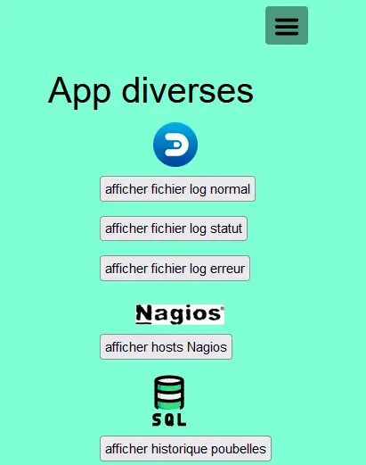
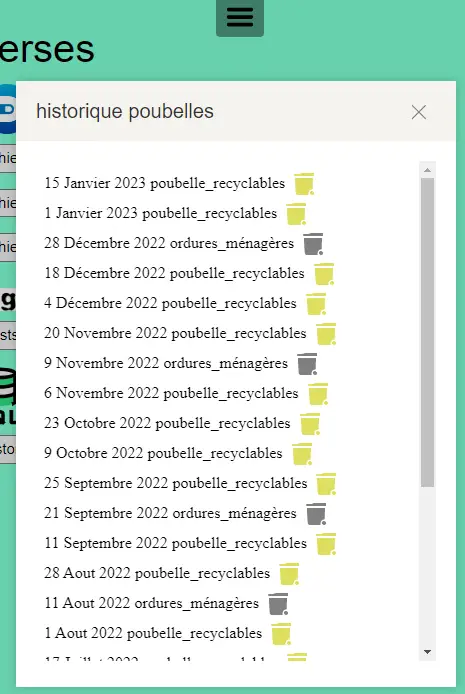
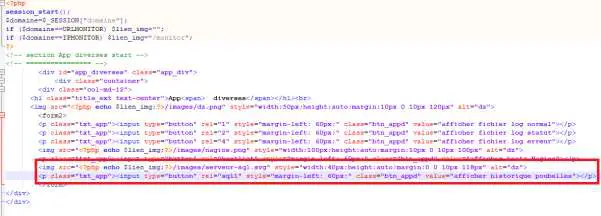
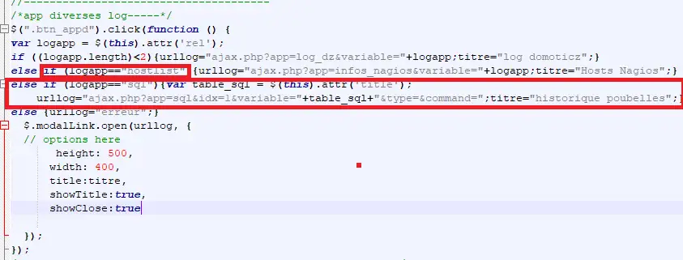
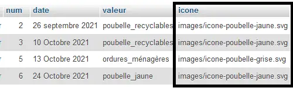
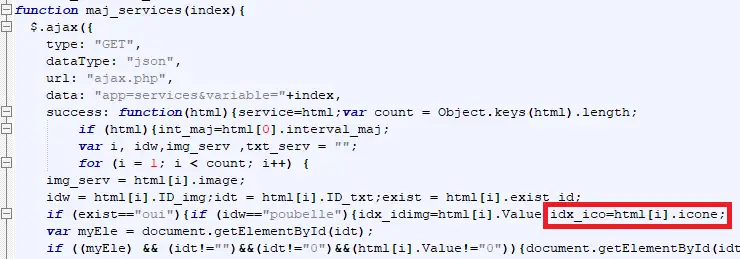
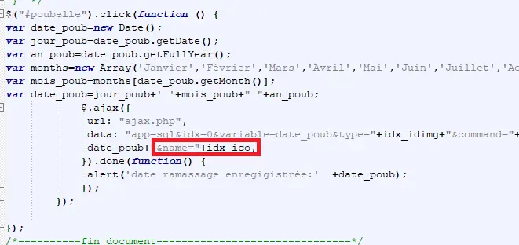
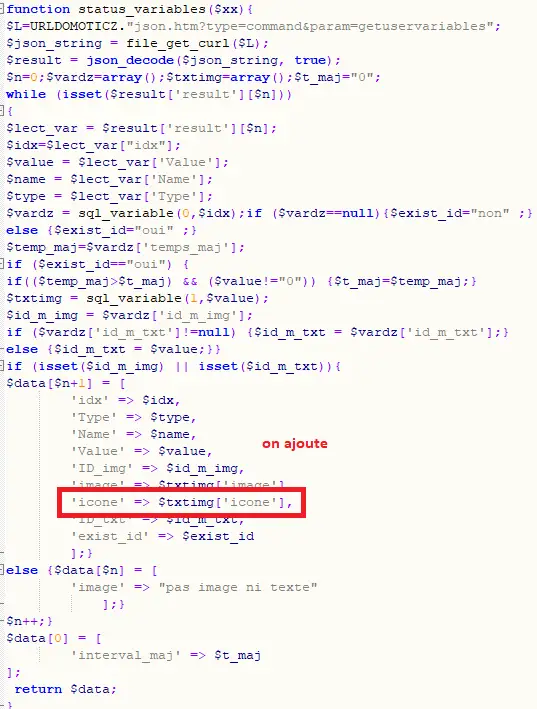
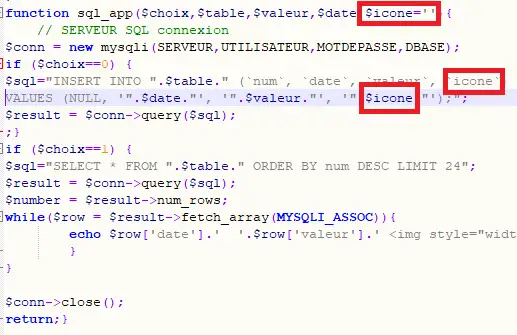
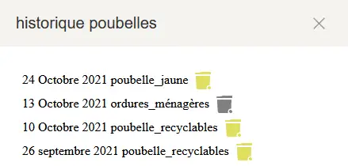
.. |image1710| image:: ../media/image1710.webp
   :width: 700px

