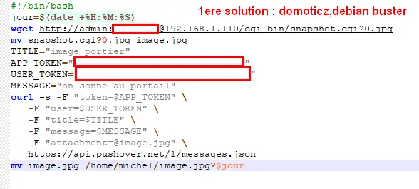

13. APPLICATIONS externes en lien avec Domoticz ou monitor
----------------------------------------------------------
13.1 Affichage des notifications sur un téléviseur LG
^^^^^^^^^^^^^^^^^^^^^^^^^^^^^^^^^^^^^^^^^^^^^^^^^^^^^
Le script optionnel pour la notification sur un téléviseur LG (web os)

.. prereq:: **sudo et Node.js doit être installés**

   *ainsi que les modules lgtv et superagent*

   Pour les installer:

   .. code-block::

      npm install lgtv
      npm install superagent

   |image699|

- **Les variables Domoticz** ,  *à ajouter* :

|image700|

- **Le script, notifications_tv.lua**  à ajouter à Domoticz->Evènements :

.. code-block::

   --notification à 19h30 et 20h30 , rappel possible à 20h"30 :
   -- variable nb_not_tv = 2   trigger->TIME
   package.path = package.path..";www/modules_lua/?.lua"
   -- pour notification_lg ip tv et ip dz
   require 'connect'
   local iptv=ip_tv
   local ipdz=ip_domoticz
   commandArray = {}
   local time = string.sub(os.date("%X"), 1, 5)
   --
   local idx="7";-- idx de la variable not_tv_ok
   function notification()
		os.execute("node userdata/scripts/js/notification_lg.js "..texte.." "..idx.." not_tv_ok 2 1 "..iptv.." "..ipdz.." >> /home/michel/tv.log 2>&1");
        print(time.."..  maj notification");
   end
   --
   --19h30 et 20h00
   -- on envoie les 1eres notifications 
   if ((time == "19:30") or (time == "20:00")) then
    tv_conf=uservariables['not_tv_conf']
    print('tv_conf'..tv_conf) 
   -- les poubelles :    
    if (uservariables['not_tv_poubelle']=="1") then 
        texte=" mettre_la_poubelle " 
        notification()
    end    
   -- autres:         
    if (uservariables['not_tv_fosse']=="1") then
        texte="entretien_fosse_septique" 
        notification()
   -- ..................
    end
   --  si affichage ok on incrémente le nb d' affichage
    if (uservariables['not_tv_ok']=='1') then
        print('connexion reussie') 
        tv_nb=tonumber(uservariables['not_tv_nb'])
         print('tv_nb_0'..tostring(tv_nb))-- pour test 
        tv_nb=tv_nb+1
        print('tv_nb_1'..tostring(tv_nb))  -- pour test
        commandArray['Variable:not_tv_nb'] = tostring(tv_nb)
        commandArray['Variable:not_tv_ok'] = tostring("0")
            else print('pas de notification') 
    end   
   end
   -- si une notification n'a pas eu lieu (TV allumé apres 19h30 etc .....not_tv est inférieur à 2.)
   --20h30
   if (time == "20:30") then 
    tv_conf=uservariables['not_tv_conf']
     tv_nb=tonumber(uservariables['not_tv_nb'])
    if (tv_nb <= tonumber(tv_conf))  then 
    print('tv_nb_2'..tv_nb)  -- pour test  
   -- les poubelles :    
        if (uservariables['not_tv_poubelle']=="1") then 
        texte=" mettre_la_poubelle " 
        notification()
        end
   -- autres:         
        if (uservariables['not_tv_fosse']=="1") then
        texte="entretien_fosse_septique" 
        notification()
   -- ..................
        end
    end
   --remise à zero des notifications pour ce jour
        commandArray['Variable:not_tv_poubelle'] = tostring("0")
        commandArray['Variable:not_tv_fosse'] = tostring("0")
        commandArray['Variable:not_tv_nb'] = tostring('0')
        commandArray['Variable:not_tv_ok'] = tostring("0")
        tv_nb=0
   end
   return commandArray

Les valeurs transmises par dz au script dans l’ordre : texte, idx, vtype, vvalue

|image703|

.. warning:: **Scripts js**
   Script :darkblue:`notification_lg.js` à ajouter à Home/user/

   Script :darkblue:`node_modules/lgtv/index.js` à remplacer 
   
   Voir le dossier http://domo-site/accueil/dossiers/32

- **Essai avec la console** :

|image704|

13.2 Portier Dahua VTO 2000 et VTO 2022
^^^^^^^^^^^^^^^^^^^^^^^^^^^^^^^^^^^^^^^
13.2.1 VTO 2000A
================
Voir les pages http://domo-site.fr/accueil/dossiers/21

|image705|

Et : http://domo-site.fr/accueil/dossiers/7

|image706|

- **Domoticz** , on crée une variable « sonnette »

|image707|

   . **Le script LUA** :

.. code-block::

   --vto2000 Dahua exploiter le changement de valeur d' une variable 
   -- pour signaler l' appui sur le portier video vto2000
   --
   package.path = package.path..";www/modules_lua/?.lua"
   require 'connect'
   commandArray = {}
   -- 
   if (uservariables['sonnette']=="1") then 
   --          --envoi image pushover ---------------
            os.execute("/bin/bash userdata/scripts/bash/pushover_img.sh "..ip_domoticz..">> /home/michel/push.log 2>&1");
            commandArray['Variable:sonnette'] = '0'
   end
   return commandArray

:red:`La variable passe à 1 à la demande d'asterisk quand la sonnette est activée sur le portier`

 . **pushover_img.sh**

   2 versions, sous **linux/debian** et sous **docker/debian**

   |image709|

   |image710|

.. important:: **En utilisant connect.lua**

   *on évite une mise à jour lors d'un changement d’IP*

   on évite d'afficher les logins et mots de passe

   connect.lua :

  |image711| 

   - **Dans DZ** , on indique la variable de connect.lua, :darkblue:`ex : ip_domoticz`

   .. code-block::
      
      package.path = package.path..";www/modules_lua/?.lua"
      require 'connect'
      --
      os.execute("/bin/bash userdata/scripts/bash/pushover_img.sh "..ip_domoticz..">> /home/michel/push.log 2>&1");

   - **Dans pushover_img.sh**

   .. code-block::

      wget  http://$1:8086/camsnapshot.jpg?idx=1 -O /opt/domoticz/userdata/camsnapshot.jpg

- **asterisk**

|image712| 

13.4 Surveillance du PI par Domoticz
^^^^^^^^^^^^^^^^^^^^^^^^^^^^^^^^^^^^

.. |image699| image:: ../media/image699.webp
   :width: 423px
.. |image700| image:: ../media/image700.webp
   :width: 650px
.. |image703| image:: ../media/image703.webp
   :width: 642px
.. |image704| image:: ../media/image704.webp
   :width: 644px
.. |image705| image:: ../media/image705.webp
   :width: 601px
.. |image706| image:: ../media/image706.webp
   :width: 642px

.. |image710| image:: ../media/image710.webp
   :width: 700px
.. |image711| image:: ../media/image711.webp
   :width: 288px
.. |image712| image:: ../media/image712.webp
   :width: 450px

