13. APPLICATIONS externes en lien avec Domoticz, HA ou monitor
--------------------------------------------------------------
13.1 Affichage des notifications sur un téléviseur LG
^^^^^^^^^^^^^^^^^^^^^^^^^^^^^^^^^^^^^^^^^^^^^^^^^^^^^
Le script optionnel pour la notification sur un téléviseur LG (web os)

.. admonition:: **PREREQUIS**

   **sudo et Node.js doit être installés**

   *ainsi que les modules lgtv et superagent*

   Pour les installer:

   .. code-block::

      npm install lgtv
      npm install superagent

   |image699|

- **Les variables Domoticz** ,  *à ajouter* :

|image700|

- **Le script, notifications_tv.lua**  à ajouter à Domoticz->Evènements :

.. code-block::

   --notification à 19h30 et 20h30 , rappel possible à 20h"30 :
   -- variable nb_not_tv = 2   trigger->TIME
   package.path = package.path..";www/modules_lua/?.lua"
   -- pour notification_lg ip tv et ip dz
   require 'connect'
   local iptv=ip_tv
   local ipdz=ip_domoticz
   commandArray = {}
   local time = string.sub(os.date("%X"), 1, 5)
   --
   local idx="7";-- idx de la variable not_tv_ok
   function notification()
		os.execute("node userdata/scripts/js/notification_lg.js "..texte.." "..idx.." not_tv_ok 2 1 "..iptv.." "..ipdz.." >> /home/michel/tv.log 2>&1");
        print(time.."..  maj notification");
   end
   --
   --19h30 et 20h00
   -- on envoie les 1eres notifications 
   if ((time == "19:30") or (time == "20:00")) then
    tv_conf=uservariables['not_tv_conf']
    print('tv_conf'..tv_conf) 
   -- les poubelles :    
    if (uservariables['not_tv_poubelle']=="1") then 
        texte=" mettre_la_poubelle " 
        notification()
    end    
   -- autres:         
    if (uservariables['not_tv_fosse']=="1") then
        texte="entretien_fosse_septique" 
        notification()
   -- ..................
    end
   --  si affichage ok on incrémente le nb d' affichage
    if (uservariables['not_tv_ok']=='1') then
        print('connexion reussie') 
        tv_nb=tonumber(uservariables['not_tv_nb'])
         print('tv_nb_0'..tostring(tv_nb))-- pour test 
        tv_nb=tv_nb+1
        print('tv_nb_1'..tostring(tv_nb))  -- pour test
        commandArray['Variable:not_tv_nb'] = tostring(tv_nb)
        commandArray['Variable:not_tv_ok'] = tostring("0")
            else print('pas de notification') 
    end   
   end
   -- si une notification n'a pas eu lieu (TV allumé apres 19h30 etc .....not_tv est inférieur à 2.)
   --20h30
   if (time == "20:30") then 
    tv_conf=uservariables['not_tv_conf']
     tv_nb=tonumber(uservariables['not_tv_nb'])
    if (tv_nb <= tonumber(tv_conf))  then 
    print('tv_nb_2'..tv_nb)  -- pour test  
   -- les poubelles :    
        if (uservariables['not_tv_poubelle']=="1") then 
        texte=" mettre_la_poubelle " 
        notification()
        end
   -- autres:         
        if (uservariables['not_tv_fosse']=="1") then
        texte="entretien_fosse_septique" 
        notification()
   -- ..................
        end
    end
   --remise à zero des notifications pour ce jour
        commandArray['Variable:not_tv_poubelle'] = tostring("0")
        commandArray['Variable:not_tv_fosse'] = tostring("0")
        commandArray['Variable:not_tv_nb'] = tostring('0')
        commandArray['Variable:not_tv_ok'] = tostring("0")
        tv_nb=0
   end
   return commandArray

Les valeurs transmises par dz au script dans l’ordre : texte, idx, vtype, vvalue

|image703|

.. warning:: **Scripts js**
   Script :darkblue:`notification_lg.js` à ajouter à Home/user/

   Script :darkblue:`node_modules/lgtv/index.js` à remplacer 
   
   Voir le dossier http://domo-site/accueil/dossiers/32

- **Essai avec la console** :

|image704|

13.2 Portier Dahua VTO 2000 et VTO 2022
^^^^^^^^^^^^^^^^^^^^^^^^^^^^^^^^^^^^^^^
13.2.1 VTO 2000A
================
Voir les pages http://domo-site.fr/accueil/dossiers/21

|image705|

Et : http://domo-site.fr/accueil/dossiers/7

|image706|

- **Domoticz** , on crée une variable « sonnette »

|image707|

   . **Le script LUA** :

.. code-block::

   --vto2000 Dahua exploiter le changement de valeur d' une variable 
   -- pour signaler l' appui sur le portier video vto2000
   --
   package.path = package.path..";www/modules_lua/?.lua"
   require 'connect'
   commandArray = {}
   -- 
   if (uservariables['sonnette']=="1") then 
   --          --envoi image pushover ---------------
            os.execute("/bin/bash userdata/scripts/bash/./pushover_img.sh "..ip_domoticz..">> /home/michel/push.log 2>&1");
            commandArray['Variable:sonnette'] = '0'
   end
   return commandArray

:red:`La variable passe à 1 à la demande d'asterisk quand la sonnette est activée sur le portier`

 . **pushover_image.sh**

  |image710|

.. important:: **En utilisant connect.lua**

   *on évite une mise à jour lors d'un changement d’IP*

   on évite d'afficher les logins et mots de passe

   connect.lua :

  |image711| 

   - **Dans DZ** , on indique la variable de connect.lua, :darkblue:`ex : ip_domoticz`

   .. code-block::
      
      package.path = package.path..";www/modules_lua/?.lua"
      require 'connect'
      --
      os.execute("/bin/bash userdata/scripts/bash/pushover_img.sh "..ip_domoticz..">> /home/michel/push.log 2>&1");

   - **Dans pushover_img.sh**

   .. code-block::

      wget  http://$1/camsnapshot.jpg?idx=1 -O /opt/domoticz/userdata/camsnapshot.jpg

   .. note:: **Si domoticz est sous docker**, c'est le cas ici, l':red:`ip et le port` sont ceux de :darkblue:`docker-compose.yml` et non l'ip du serveur

      *Il est difficile de récupérer l'ip de l'hôte il est préférable d'utiliser* l':red:`IP 127.0.0.1`

      |image257|

- **asterisk**

   .  *sip.conf*

|image712| 

   .  *extensions.conf*

|image714| 

.. admonition:: **Réglages du portier vidéo**

   |image713| 

   **configTools** -> *VDPConfig*

   |image715|

   |image716|

   |image717|

   |image718|

   |image719|

13.3 -La boite aux lettres
^^^^^^^^^^^^^^^^^^^^^^^^^^
*Voir domo-site pour la programmation de l’esp8266 , de dzvent et Python*

|image720|

- **Le matériel**

   .	2 ILS (pour le volet , pour la porte

   .	1 esp 01 et une alim 12V/3,3 Volts

Voir la page consacrée à la réalisation et la programmation de l’ESP pour une communication MQTT: http://domo-site.fr/accueil/dossiers/68

- **Les images svg**

|image721|  |image722|

- **Le fichier accueil.php** , * concernée*

.. code-block::

   

- **Le fichier footer.php** , *le script pour afficher une demande de confirmation de la relève du courrier*

.. code-block::

   /*---popup boite_lettres-----------------------------------*/
   var bl=0;var modalContainer = document.createElement('div');
   modalContainer.setAttribute('id', 'modal_bl');
   var customBox = document.createElement('div');
   customBox.className = 'custom-box';
   // Affichage boîte de confirmation
   document.getElementById('confirm-box').addEventListener('click', function() {
    customBox.innerHTML = '
Confirmation de la relève du courrier
';
    customBox.innerHTML += '<button style="margin-right: 20px;" id="modal-confirm">Confirmer</button>';
    customBox.innerHTML += '<button id="modal-close">Annuler</button>';
    modalShow();
   console.log(bl);
   });
   function modalShow() {
    modalContainer.appendChild(customBox);
    document.body.appendChild(modalContainer);
    document.getElementById('modal-close').addEventListener('click', function() {
        modalClose();
    });
    if (document.getElementById('modal-confirm')) {
        document.getElementById('modal-confirm').addEventListener('click', function () {
           console.log('Confirmé !');bl=1; 
           modalClose(bl);
        });
    } else if (document.getElementById('modal-submit')) {
        document.getElementById('modal-submit').addEventListener('click', function () {
            console.log(document.getElementById('modal-prompt').value);
            bl=0;modalClose(bl);
        });       }   }
   function modalClose(bl) {
    while (modalContainer.hasChildNodes()) {
        modalContainer.removeChild(modalContainer.firstChild);
    }
    document.body.removeChild(modalContainer);
	 console.log(bl);if (bl==1) {maj_variable(19,"boite_lettres","0",2);maj_services(0);bl=0;}  
   }

|image725|

Un clique sur la BL fait apparaitre le popup de confirmation

|image726|

- **Les styles css**

.. code-block::

   .bl{position: absolute;top: 870px;left: 115px;}
   #bl{width: 40px;height: auto;}
   .custom-box {border: 2px solid grey;text-align: center;padding: 10px;
    width: fit-content;background-color: #e5c666;margin: auto;}
   #modal_bl {position: absolute;top: 0;left: 0;display: flex;
    width: 100%;height: 100%;background-color: rgba(0, 0, 0, 0.5);}

- **La variable Domoticz**

|image728|

- **Les tables sql**

   . Variables dans la table « dispositifs »

   |image729|

   . La table « text_image »

   |image730|

Après confirmation de la relève, la confirmation de la maj de la variable Domoticz

|image731|

Domoticz(script dzvents) envoie par MQTT la confirmation de la mise à zéro de la variable boite lettres

.. code-block::

   -- script notifications_autres
   return {
	on = {
		variables = {'boite_lettres'}
	},
	execute = function(domoticz, variable)
	    domoticz.log('Variable ' .. variable.name .. ' was changed', domoticz.LOG_INFO)
	    if (domoticz.variables('boite_lettres').changed) then
                if (domoticz.variables('boite_lettres').value == "0") then 
                print("topic envoyé : esp/in/boite_lettres")
                 local command = "/home/michel/domoticz/scripts/python/mqtt.py esp/in/boite_lettres valeur 0   >> /home/michel/esp.log 2>&1" ;
                 os.execute(command);    
                end 
           end     
       end
   }

13.4 Surveillance du PI par Domoticz
^^^^^^^^^^^^^^^^^^^^^^^^^^^^^^^^^^^^

|image733|

.. note:: Voir cette page : http://domo-site.fr/accueil/dossiers/44

- **Les tables SQL "text_image" et "variables_dz"**

|image734|

|image735|

C'est le script JS ,

- **maj_services** qui gère l’affichage de la page d’accueil

|image736|

- **Domoticz** , DZEvent « notifications_devices » 

   A partir de l’info du matériel « **System Alive Checker** » , la variable « pi-alarme » est modifié

   |image737|

.. code-block::

   return {
	on = {
		devices = {
			'Ping_pi4',
				}
	},
     execute = function(domoticz, device)
        domoticz.log('device '..device.name..' was changed', domoticz.LOG_INFO)
            if (device.name == 'Ping_pi4' and  device.state=='Off' and domoticz.variables('pi-alarme').value == "0") then 
            domoticz.variables('pi-alarme').set("pi_hs")
            domoticz.variables('variable_sp').set("1")
            txt='alarmeùpiùhs';obj='alarme pi hs'alerte_gsm(txt);domoticz.email('Alarme',obj,adresse_mail) 
            elseif (device.name == 'Ping_pi4' and  device.state=='On' and domoticz.variables('pi-alarme').value == "pi_hs") then 
            domoticz.variables('pi-alarme').set("0")
            txt='alarmeùPIùdeùnouveauùOK';obj='alarme PI de nouveau OK'alerte_gsm(txt);domoticz.email('Alarme',obj,adresse_mail) 
            end
            --

- **monitor**	*page "nagios"* 

   c’est le script JS « maj_devices(plan) » qui gère le changement de couleur de l’icône, à partir du dispositif dans Domoticz

   |image740|

13.5 Capteur de pression chaudière 
^^^^^^^^^^^^^^^^^^^^^^^^^^^^^^^^^^
*Réalisé avec un microcontrôleur Wemos D1 : pour la partie réalisation du capteur, voir le site web : domo-site.fr*

|image741|

-	Envoie les données de pression sur le serveur MQTT

-	Domoticz récupère et traites les données

-	Monitor affiche en temps réel les données, l’historique des données, un graphique ,...

|image742|

13.5.1 l’image SVG
==================
Elle est ajoutée à **interieur.php** (ci-dessous)  et **accueil.php** (ci-dessus)

|image743|

- **Accueil.php**

.. code-block::

   

.. admonition:: **Pour annuler l'alarme**

   |image747|

   - **footer.php**, la fenêtre modale est déjà utilisée pour la boite aux lettres, ajout d’une variable « ch=0 pour la BL et ch=1 pour la pression chaudière

   |image745|

   .. important:: **Une variable doit être créée dans Domoticz**, *voir le paragraphe suivant*

_ **L’image SVG**

.. code-block::

   <svg version="1.1" id="svgpression" xmlns="http://www.w3.org/2000/svg" xmlns:xlink="http://www.w3.org/1999/xlink" x="0px"
	 y="0px" viewBox="0 0 111.7 136.9" style="enable-background:new 0 0 111.7 136.9;" xml:space="preserve">
   <g id="chaudiere">
	<path id="path14834" class="st1" d="M25.1,15.8v-4.2c2.1,0,3.2,2,5.4,1.8c4-0.4,5.2-5.3,1.4-6.9c-1.1-0.5-2.6-0.4-3.6,0.1
		c-1.2,0.6-1.8,1.4-3.2,1.4c0-0.9,0.3-2.2-0.4-3c-0.9-1.1-2.7-1-3.3,0.3c-0.4,0.8-0.2,1.9-0.2,2.8c-1.5,0-2.1-0.7-3.2-1.4
		c-1.1-0.5-2.6-0.6-3.8-0.1c-3.6,1.6-2.4,6.5,1.6,6.9c2.2,0.2,3.3-1.8,5.4-1.8v4.5c-1.6,0-3.2,0.3-4.8,0.5c-4,0.5-8.2,1.3-12,2.7
		c-1.2,0.5-2.6,1-3.6,1.8c-0.6,0.5-0.9,1-0.5,1.8c0.6,0.9,2,1.5,3.1,1.9c2.1,0.8,4.3,1.5,6.6,1.9c9.5,2.1,19.7,2.5,29.5,2.3
		c7.5-0.2,15.5-0.8,22.7-2.9c1.9-0.5,3.8-1,5.5-1.9c0.7-0.3,1.5-0.8,1.9-1.4c0.4-0.6,0.1-1.2-0.4-1.6c-0.9-0.8-2.1-1.3-3.2-1.7
		c-2.8-1-5.6-1.6-8.5-2.3c-2.1-0.5-4.5-0.9-6.7-1c0.5-1.9,1.6-3.8,3.1-5.1c1.9-1.9,4.2-3.3,7-4c6.2-1.6,13.1,1,16.5,6
		c1.4,2.1,2,4.4,2,6.9h7.6c0-3.2-0.8-6.4-2.3-9.2c-1.1-2.1-2.7-4-4.6-5.6c-7.4-6.2-19-7.1-27.3-2.1c-3.2,1.9-5.8,4.6-7.6,7.7
		c-0.6,1-1.1,2.2-1.5,3.4c-0.1,0.4-0.1,1.1-0.6,1.3c-0.6,0.2-1.3,0-1.9-0.1c-1.5-0.1-2.9,0-4.4-0.1C32.7,15.3,28.9,15.8,25.1,15.8
		 M76.5,21.6c-0.4,0.1-0.7,0.5-0.9,0.8c-0.1,0.4-0.1,0.8-0.1,1.2c0,1-0.4,2.9,0.8,3.5c0.8,0.4,2.2,0.1,3.1,0.1h6.8
		c0.9,0,2.2,0.2,3-0.1c1.2-0.6,0.9-2.2,0.9-3.2c0-0.5,0.1-0.8-0.1-1.3c-0.1-0.4-0.4-0.7-0.8-0.9c-0.9-0.4-2.3-0.1-3.2-0.1h-6.6
		C78.7,21.5,77.4,21.3,76.5,21.6 M0,27.1v64.6v16.8v4.3c0,0.6-0.1,1.4,0.3,2c0.9,1.2,2.9,1.8,4.3,2.3c3.6,1.2,7.2,1.9,10.9,2.5
		c5.5,0.9,11,1.1,16.5,1.2c7.8,0.2,15.6-0.3,23.4-1.4c3.4-0.5,6.9-1.3,10.1-2.4c1.3-0.5,3-1.1,4-2.1c0.9-0.9,0.4-2.7,0.4-3.8v-9.9
		h9.4c0,2.5-0.1,5.1,0.3,7.6c1.1,5.9,5.1,11,10.8,14c1.9,1,4.5,2.2,6.8,2.3v-5c0-0.5,0.2-1.5-0.1-1.9c-0.3-0.3-1.1-0.5-1.6-0.6
		c-1-0.4-1.8-0.9-2.7-1.4c-3.4-2.3-5.5-5.7-5.9-9.5c-0.3-2.8,0-5.8,0-8.6V80.8v-52h-7.6v8.6c-1.2-0.2-2.4-0.1-3.6-0.1h-5.8v-10
		c-2.1,0.8-4.1,1.8-6.3,2.3c-9.4,2.5-19.5,3-29.3,3c-8.7,0-17.8-0.5-26.2-2.6c-1.6-0.4-3.3-0.8-4.9-1.5C2.1,28,1.1,27.5,0,27.1
		 M79.3,42.2v53.9C76.3,95.8,73,96,69.9,96V42.2H79.3 M17,71c1.2-0.1,2.6-0.1,3.8,0.3c5.5,1.4,7.5,7.5,4.2,11.6
		c-0.6,0.8-1.4,1.5-2.4,1.9c-1,0.5-2.1,0.9-3.2,1c-1.1,0.1-2.2,0.1-3.2-0.2c-5.5-1.2-7.8-7.3-4.8-11.4c0.6-0.8,1.5-1.6,2.4-2.1
		C14.7,71.5,15.8,71.2,17,71 M17.3,74.4c-0.6,0.1-1.3,0.4-1.8,0.7c-3.1,2.1-1.9,6.7,1.9,7.3c0.5,0.1,1,0.1,1.6,0
		c0.7-0.1,1.4-0.4,1.9-0.8c1.1-0.8,1.8-2,1.8-3.3C22.6,75.9,20,73.9,17.3,74.4 M17.8,91.1c4.9-0.5,9.1,4,8.7,8.1
		c-0.4,3.8-3.6,6.5-7.7,6.9c-0.7,0.1-1.5,0-2.2-0.1c-5.5-0.9-8.2-6.5-5.7-10.9C12.3,92.6,14.9,91.3,17.8,91.1 M17.3,94.6
		c-3.6,0.6-4.8,4.7-2.3,6.9c1.1,1,2.7,1.3,4.3,1c2.9-0.5,4.2-3.7,2.9-5.9C21.2,95,19.2,94.2,17.3,94.6 M99.8,115.2
		c-0.5,0.1-0.9,0.5-1.1,1c-0.4,1.1-0.1,2.7-0.1,3.8v5.6c0,0.8-0.1,1.7,0.6,2.3s2.1,0.4,3,0.4c0.6,0,1.3,0.1,1.8-0.1
		c0.6-0.2,1-0.6,1.1-1.2c0.2-1.2,0.1-2.5,0.1-3.7v-5.1c0-0.7,0.2-1.7-0.3-2.3c-0.7-1-2.5-0.7-3.6-0.7
		C100.8,115.1,100.3,115.1,99.8,115.2 M106.5,118.6v6.9h5.2v-6.9H106.5 M6.6,121.2v7.9c0,1-0.3,2.3,0.6,3.1c0.9,0.8,2.2,1.4,3.3,1.7
		c2.3,0.8,4.7,1.2,7.1,1.8c4.2,0.8,8.6,1,12.9,1.2c6.6,0.3,13.2-0.1,19.7-0.9c3.1-0.4,6.3-1,9.3-2.1c1.1-0.4,2.6-0.9,3.4-1.8
		c0.6-0.8,0.4-2.2,0.4-3.1v-7.8c-2.8,0.5-5.6,1.3-8.5,1.7c-11,1.6-22.4,1.7-33.4,0.7c-3-0.3-6.1-0.6-9-1.2
		C10.4,122,8.5,121.4,6.6,121.2L6.6,121.2z"/>
	<rect x="6.5" y="37" class="st185" width="56.9" height="25"/>
   </g>text id="text_chaudiere" transform="matrix(1 0 0 1 7 55)" class="st33 st36a">tmp</text>
   </svg>

.. warning:: **Pour la notification (chaudière rouge en page d’accueil) supprimer les dernières lignes <rect et <text et modifier les ID (les id doivent être uniques)**

   |image746|

- **interieur.php**

.. code-block::

   
<?php include ("include/chaudiere_svg.php");?>

|image749|

chaudiere_svg.php:

|image750|

13.5.2 Dans Domoticz, le capteur, le plan, les variables et les scripts
=======================================================================
- **le capteur**

|image752|

.. error:: **Pour éviter des erreurs comme celles-ci**

   |image753|

   L’envoie des données doivent être un tableau json de cette forme :

   |image651|

   *Le topic est « domoticz/in »* 

- **Le plan**

*Le capteur est ajouté au plan pour une communication automatique avec Monitor ou toute autre application, les données sont récupérées dans un fichier json*

|image756|  |image757|

- **Le fichier json** appelé par la fonction « devices_plan » , voir le § :ref:`1.3.5 les scripts JavaScript`

|image758|

.. admonition:: **Enregistrer les valeurs dans la BD SQL**

   - Le **script export_sql.lua**

    Pour n’envoyer à la BD que les changements de pression (pour limiter le nombre d’enregistrements) , il faut :

     .	Soit créer une user variable
     .  Soit utiliser une donnée persistante, solution retenue ici

      |image759|

    	Le script : les lignes à ajouter pour l’enregistrement dans la BD et le déclenchement d’une alarme

   .. code-block::

      package.path = package.path..";www/modules_lua/?.lua"
      require 'datas'
      require 'string_tableaux'

      function write_datas(data)
      f = io.open("www/modules_lua/datas.lua", "w")
      f:write("pression="..data)
      f:close()
      end

      elseif (deviceName=='pression_chaudière') then 
        pressionch=tonumber(deviceValue);
        print ("pression_chaudiere:"..pressionch.."--"..pression);
        if (pression~=pressionch) then 
            libelle="pression_chaudiere#valeur";don=" "..libelle.."#"..tostring(deviceValue).."#"..datetime
            envoi_fab(don)
            --donnees['pression']=tonumber(deviceValue)
            write_datas(tonumber(deviceValue),data1)
            --pression_chaudiere: variable du fichier 'string_tableaux'
            if (pressionch<pression_chaudiere and uservariables['pression-chaudiere']=="ras") then 
                commandArray['Variable:pression-chaudiere'] = "manque_pression";  print("pression basse")
            elseif (pressionch<pression_chaudiere and uservariables['pression-chaudiere']~="pression_basse") then 
                commandArray['Variable:pression-chaudiere']="ras"    
            end
        end

   |image760|

       . *variable domoticz*

       |image762|

       . *Le script notifications_variables.lua*

.. code-block::

   return {
	on = {
		variables = {'pression-chaudiere'}
	},
	execute = function(domoticz, variable)
	    domoticz.log('Variable ' .. variable.name .. ' was changed', domoticz.LOG_INFO)
	if (domoticz.variables('pression-chaudiere').value == "manque_pression") then	             txt=tostring(domoticz.variables('pression-chaudiere').value) 
	             domoticz.variables('pression-chaudiere').set('pression_basse')
	 	         print("envoi SMS pression-chaudiere")
                 alerte_gsm('alarme_'..txt)
        end	

13.5.3 Dans la Base de données SQL
==================================

13.5.3.1 Créer une nouvelle table
"""""""""""""""""""""""""""""""""

.. code-block::

   CREATE TABLE `pression_chaudiere` (
  `num` int(5) NOT NULL,
  `date` timestamp NOT NULL DEFAULT current_timestamp() ON UPDATE current_timestamp(),
  `valeur` varchar(4) NOT NULL
   ) ENGINE=InnoDB DEFAULT CHARSET=utf8;
     ALTER TABLE `pression_chaudiere` CHANGE `num` `num` INT(4) NOT NULL AUTO_INCREMENT, add PRIMARY KEY (`num`);

13.5.3.2 Mettre à jour la table des dispositifs
"""""""""""""""""""""""""""""""""""""""""""""""
voir paragraphe :ref:`0.3.2 Les Dispositifs`

|image764|

|image765|

- Mettre à jour la variables DZ pour l’affichage d’une notification sur l’app donc la tablette ou le smartphone voir § :ref:`0.3.1.2 Table dispositifs pour les variables`

13.5.3.3  Mettre à jour la table "text-image"
"""""""""""""""""""""""""""""""""""""""""""""

|image767|

Pour afficher comme ci-dessus une image plutôt qu’un texte , voir § :ref:`0.3.1.1 Table text-image`

13.5.4 Styles CSS
=================

.. code-block::

   #bar_pression {position: relative;top: -770px;width: 100px;left: 500px;}
   #pression_chaud{width:60px}
   .pression_chaud{position: relative;top: -460px;left: 220px;}
   @media (max-width:534px) {#pression_chaud{width:50px}.pression_chaud{top: -305px;}}

13.6 SMS réception et émission
^^^^^^^^^^^^^^^^^^^^^^^^^^^^^^
13.6.1 réception SMS
====================
Voir le § consacrées au modem GSM et la communication série entre Domoticz et un RPI :ref:`18.3 Liaison série Domoticz-PI`

- **Variable Domoticz**

|image768|

13.6.2 émission SMS
===================

.. note::

   Un fichier python : sms_dz.py surveille en permanence la variable x de aldz.py et déclenche l’envoi d’un sms si celle-ci est différente de « 0 » ; priority indique la priorité pour l’envoi des SMS :

	-	0 envoi à tous les numéros

	-	1 envoi au 1er numéro

	-	2 envoi au 2eme numéro

	-	3 .....3eme .....

   :darkblue:`Si bien sûr ces numéros existent`

   Cela est possible avec l’utilisation du module Python « importlib »

   |image773|

- **aldz.py**

|image772|

.. note:: 

   **Le fichier aldz.py est modifié par Domoticz (scripts LUA notifications_devices et notifications_variables)**

|image775|

|image776|

- **sms_dz.py**

On import aussi aldz (b) et la variable lue est donc :darkblue:`b.x`

|image774|

13.6.2.1 Enregistrement des n° de téléphone
"""""""""""""""""""""""""""""""""""""""""""
*Il est possible d’envoyé plusieurs SMS à des numéros différents ; pour cela, il faut ajouter les numéros à connect.lua (la maj est automatique vers connec.py)*

|image777|

Le nombre de numéros n’est pas limité : tel={‘xxxxxxxxxx’,’yyyyyyyyyy’,’zzzzzzzzzz’,…)

.. important:: **Le tableau est LUA avec des {}, remplacés par des crochets dans connect.py et connect.js**

Importer sur Github le fichier complet : https://raw.githubusercontent.com/mgrafr/monitor/main/share/scripts_dz/py/sms_dz.py

.. admonition:: **Démarrage automatique avec systemd**

   Après installation de Domoticz, utiliser systemd de Debian ; le fichier à créer : sms_dz.service , 

   à télécharger https://raw.githubusercontent.com/mgrafr/monitor/main/share/debian/systemd/system/sms_dz.service

   Ne pas oublier d’activer le script avant de le démarrer :

   .. code-block::

      systemctl enable sms_dz
      systemctl start sms_dz

13.7- afficher les données du compteur Linky
^^^^^^^^^^^^^^^^^^^^^^^^^^^^^^^^^^^^^^^^^^^^
*A partir des données reçues par Domoticz par le plugin domoticz-linky* : https://github.com/guillaumezin/DomoticzLinky

|image778|

Complément d'informations : § :ref:`18.5 Données compteur Linky`

- **L’image svg**

.. code-block::

   <svg version="1.1" id="Calque_1" xmlns="http://www.w3.org/2000/svg" xmlns:xlink="http://www.w3.org/1999/xlink" x="0px" y="0px"
	 viewBox="0 0 162.2 321.9" style="enable-background:new 0 0 162.2 321.9;" xml:space="preserve">
   <a xlink:href="#interieur" onclick="popup_device(71)">
   <path class="linky0" d="M3.5,56.5c-0.1,0.1-0.1,1.1,0.3,0.7C3.9,57.1,4,56.1,3.5,56.5z"/>
   <path class="linky1" d="M84.2,250.9c0,2.5,0.2,4-1,6l-1-1c2.3,1.7,3.2,1.7,6,1c-2.3-1.8-1.7-3.2-1-6H84.2z"/>
   <path class="linky2" d="M82.2,251.9l1,1L82.2,251.9z"/>
   <path class="linky3" d="M83.2,251.9c-0.5,2.2-0.5,2.8,0,5C84,254.8,84,253.9,83.2,251.9 M86.2,251.9v5C87.7,254.7,87.7,254,86.2,251.9z
	"/>
   <path class="linky2" d="M87.2,251.9l1,1L87.2,251.9z"/>
   <path class="linky3" d="M3.2,308.9c0.7,3.6,1.8,5.3,5,7L3.2,308.9 M163.2,309.9c-2,2.8-3.9,4.4-7,6
	C160.3,317.2,164.4,314.2,163.2,309.9z"/>
   <path class="linky0" d="M5.2,310.9l1,0.5L5.2,310.9 M162.2,310.9c-0.1,0.2,1-5,1-5S162.3,310.6,162.2,310.9z"/>
   <rect y="0" class="linky4" width="162.2" height="321.9"/>
   <rect x="338" y="0" class="linky4" width="0" height="0"/>
   <rect x="15" y="103" class="linky5" width="130" height="76"/>
   <circle class="linky5" cx="76.6" cy="74.6" r="5.6"/>
   <circle class="linky6" cx="73.8" cy="17.8" r="2.8"/>
   <circle class="linky7" cx="76.1" cy="22.8" r="5"/>
   <circle class="linky8" cx="77.4" cy="270.5" r="6.4"/>
   <text transform="matrix(1 0 0 1 15 57)" class="st33 linky10">P Max</text>
   <text id="txtlinky" transform="matrix(1 0 0 1 8 156)" class="linky11 linky9 linky12">0</text>
   <text transform="matrix(1 0 0 1 40 230)" class="linky9 linky10">kW</text></a>
   </svg>

- **La BD**

|image779|

.. admonition:: **Explications pour explode(concerne le PHP)**

   *Data concerne 6 éléments* , :darkblue:`fonctions devices_plan() et pour_data()`

   |image780|

   Pour n’afficher que le 5eme élément on utilise dans une fonction PHP « explode »

   Explode renvoie un tableau de chaînes, chacune étant une sous-chaîne limitée par un séparateur, ici un point-virgule.

   |image781|

   .. important:: :red:`Contrairement à LUA, en PHP les tables commencent à 0 : 4 = table[4 ]= 5eme champ`

 .. note::

   Data a été utilisé car c'est le cas avec l'API pour beaucoup de dispositifs mais Counter et Usage peuvent aussi être utilisé dans l'utilisation des compteurs.

   c'est d'ailleurs counter et usage qu'i faut utiliser avec DzVent, voir le § :ref:`13.7.1 enregistrement dans la BD SQL` , ci dessous

   |image256|

13.7.1 enregistrement dans la BD SQL
====================================
- **Créer la table**

.. code-block::

   CREATE TABLE `energie` (
  `num` int(4) NOT NULL,
  `date` timestamp NOT NULL DEFAULT current_timestamp() ON UPDATE current_timestamp(),
  `conso` varchar(10) NOT NULL,
  `pmax` varchar(10) NOT NULL
   ) ENGINE=InnoDB DEFAULT CHARSET=utf8;  
   ALTER TABLE `energie` CHANGE `num` `num` INT(4) NOT NULL AUTO_INCREMENT, add PRIMARY KEY (`num`);

*La table possède 2 valeurs aussi le champ « valeur » ne peut être utilisé , 2 champs distincts sont créés* 

- **Domoticz**  , *graphique.php*

Depuis la mise à jour 2023-2 de Domoticz , DeviceValue ne peut plus être utilisé aussi le script lua a été réécrit en dzvent: :darkblue:`export_timer_sql`

*Comme c'est la consommation de la veille qui est affichée , il suffit donc de choisir à quelle heure enregistrer ces paramètres.*

|image782|

voir également le paragraphe :ref:`6.2.1 fabric`

- **monitor**

|image784|

|image785|

|image786|

Pour ajouter un historique de la consommation :

|image787|

13.8 Pont HA (ha-bridge)
^^^^^^^^^^^^^^^^^^^^^^^^
https://github.com/bwssytems/ha-bridge

ha-bridge est un logiciel qui simule sur votre ordinateur un pont Philips Hue

.. admonition:: **fonction du pont**

   extrait du readme de github :

   Émule l’API Philips Hue à d’autres passerelles domotiques telles qu’Amazon Echo/Dot ou d’autres systèmes prenant en charge la découverte de réseau local Philips Hue.

   :darkblue:`Le ha-bridge ne fait pas partie de meethue.philips.com donc la connexion cloud ne s’applique pas à ce système. Le pont gère les commandes de base telles que les commandes « On », « Off », « Brightness » et « Color » du protocole hue. Ce pont peut 
   contrôler la plupart des appareils qui ont une API distincte.`

13.8.1 Installation dans un conteneur LXC Proxmox
=================================================

Vous pouvez l’installer comme moi dans un conteneur LXC (debian12 standart)  ou dans une VM, le programme java est léger.

|image1077|

Comme pour les autres VM et CT on installe sudo et l'on crée un utilisateur avec des droits.

Après **apt update & apt upgrade**:

|image1078|

.. code-block::

   usermod -aG sudo <UTILISATEUR>

Java 8 ou > doit être installé , pour debian12 un package existe , java 17:

.. code-block::

   apt install default-jdk -y

|image1079|

.. admonition:: **Téléchargement & Installation de ha-bridge**

   *https://github.com/bwssytems/ha-bridge/releases* , choisir la version java 11

   |image1088|

   .. code-block:: 

      mkdir ha-bridge
      cd ha-bridge
      wget https://github.com/bwssytems/ha-bridge/releases/download/v5.4.1RC1/ha-bridge-5.4.1-java11.jar

   **Création du service systemd** :darkblue:`nano /etc/systemd/system/ha-bridge.service`

   .. note:: **Il faut choisir le port** 

      le port 80 est nécessaire pour Alexa et il n'est pas pas utilisé sur mon installation domotique, sont utilisés 8084(zigbee2mqtt), 8086 (dz), 8090(dvr), 8091(Zwavejs), 8123(HA)
 
   .. code-block::

      [Unit]
      Description=HA Bridge
      Wants=network.target
      After=syslog.target network-online.target

      [Service]
      Type=simple
      WorkingDirectory=/opt/habridge
      ExecStart=/usr/bin/java -jar -Dconfig.file=/etc/habridge/habridge.config /opt/habridge/ha-bridge-5.4.1-java11.jar

      Restart=on-failure
      RestartSec=10
      KillMode=process

      [Install]
      WantedBy=multi-user.target
   
    **activation du service**

   .. code::

      systemctl daemon-reload
      systemctl start ha-bridge.service
      systemctl enable ha-bridge.service

   .. important:: si le port est différent de 80 , ajouter dans ExecStart : :darkblue:`-Dserveur.port=<port number>`

13.8.2 Le serveur de ha-bridge
==============================

On récupère l'ip :

|image1080|

On ouvre la page d'accueil du serveur dans un navigateur, ici :darkblue:`http://192.168.1.14/`

|image1081|

*Come indiqué précédemment, Google Home et Alexa exigent que le pont réponde sur le port 80. Si le port 80 est déjà utilisé, il faut utiliser les fonctions de proxy de Nginx pour rediriger les urls concernant ha-bridge vers un port non utilisé par exemple 8088.* 

.. important:: **Vérifier qu'il ne soit pas déjà utilisé**

   si 80 est utilisé :

   Le fichier de configuration :darkblue:`/etc/nginx/conf.d/habridge.conf`

   .. code-block::

       location / {
        proxy_pass http://192.168.1.14:8088;
        proxy_set_header Host $host;
        proxy_set_header X-Real-IP $remote_addr;
        proxy_set_header X-Forwarded-For $proxy_add_x_forwarded_for;
       }

       location /api {
        proxy_pass http://192.168.1.14:8088/api;
       }

13.8.2.1 accès distant
""""""""""""""""""""""

.. code-block::

   upstream pontha {
       server 192.168.1.14;   }
   server {
    server_name  pontha.<DOMAINE>;
   location / {
    proxy_pass http://pontha;
    proxy_set_header Host $host;
        proxy_connect_timeout 30;
        proxy_send_timeout 30;    }
    listen 443 ssl; # managed by Certbot
    ssl_certificate /etc/letsencrypt/live/pontha.<DOMAINE>/fullchain.pem; # managed by Certbot
    ssl_certificate_key /etc/letsencrypt/live/pontha.<DOMAINE>/privkey.pem; # managed by Certbot
    include /etc/letsencrypt/options-ssl-nginx.conf; # managed by Certbot
    ssl_dhparam /etc/letsencrypt/ssl-dhparams.pem; # managed by Certbot}
   server {
    if ($host = pontha.<DOMAINE>) {
        return 301 https://$host$request_uri;    } 
    listen       80;
    server_name  pontha.<DOMAINE>;
    return 404; # managed by Certbot}

La demande de certificat Let'sEncrypt:

.. code-block::

   sudo certbot --nginx -d pontha.<DOMAINE> 

|image1138|

13.8.3 Enregistrement d'Alexa & Domoticz dans le pont
=====================================================

|image1082|

|image1083|

|image1085|

Sauvegarder la configuration

|image1086|

Il suffit d'actualiser la page et un nouvel onglet pour Domoticz est disponible avec la liste des dispositifs

|image1087|

13.8.3.1 Les dispositifs et les actions
"""""""""""""""""""""""""""""""""""""""
Exemple avec les interrupteurs virtuels de l'alarme d'absence et de l'alarme de nuit

.. note:: 

   J'ai choisi ces dispositifs pour les essais car en déconnectant la sirène , à part quelques SMS, rien ne perturbe le quotidien , pas d'allumage ni extinction de lumière; mais :red:`IL NE FAUT PAS ARRÊTER L'ALARME AVEC L'ASSISTANT VOCAL`

Ajout du premier dispositif :

|image1089|

|image1090|

|image1091|

Il en sera de même pour tous les dispositifs

13.8.4 Ajouter Ha-bridge dans le matériel Domoticz
==================================================
Sur le serveur Ha-bridge, utiliser le "link button"

|image1098|

Dans Domoticz, cliquer sur "**register on bridge**" et ajouter le pont

|image1099|

Des nouveaux dispositifs sont crées:

|image1139|

13.8.5 détection des nouveaux appareils par Alexa
=================================================
j' ai utilisé un émulateur Android gratuit pour les essais

|image1105| https://www.bluestacks.com/fr/index.html

Dans HA bridge, renuméroter les dispositifs et associer les appareils en appuyant sur "lien"

|image1100| 

Dans l'application Alexa : Ajouter un appareil

|image1102|

Choisir Philips HUE

|image1103|

|image1104|

Découverte des appareils:

|image1106|

|image1101|

|image1107|

Il ne reste plus qu'à configurer les appareils

|image1108|

13.8.6 Intégrer le Pont Hue à Monitor
=====================================

Les fichiers concernés:

- **admin/config.php**

.. code-block::

   define('ON_HABRIDGE',true);// mise en service Ha-bridge(Pont HUE)
   define('IPHABRIDGE', 'http://192.168.1.14');// port 80 obligatoire ou ProxyPass
   define('URLHABRIDGE', 'https://habridge.<DOMAINE>');

- **Les styles**

.. code-block::

   #murinter,#app_diverses,#graphiques,#admin, #zigbee, #zwave, #dvr, #nagios,#spa,#recettes, #habridge{
    width: 100%;height: 1120px;padding: 80px 0;min-height: 100%;position: relative;color: #000;
    top: 350px;z-index:-20;overflow: auto;}
   #interieur, #exterieur,#alarmes,#commandes,#murcam ,#murinter,#app_diverses,#admin, #zigbee, #zwave, #dvr,
    #nagios,#spa,#recettes, #habridge{background-color: aquamarine;}
   #habridgeapp{width: 750px;height: 700px;position: relative;top: 10px;}
   @media (max-width:534px) {#habridgeapp{width: 500px;height: 600px;}}

- **index_loc.php**

.. code-block::

   if (ON_HABRIDGE==true) include ("include/habridge.php");//pont hue Alexa

- **include/header.php**

.. code-block::

   <?php if (ON_HABRIDGE==true) echo '<li class="zz"><a href="#habridge">Pont HUE</a></li>';?>

- **include/habridge.php**

.. code-block::

   <?php
   //session_start();
   $domaine=$_SESSION["domaine"];
     if ($domaine==URLMONITOR) $lien_habridge=URLHABRIDGE;
     if ($domaine==IPMONITOR) $lien_habridge=IPHABRIDGE;
   ?>
   <!-- section pont HUE start -->
    

	

		

	  <h1 id="about" class="title" style="position:relative;top:10px;">Pont HUE : Ha-bridge</h1>
	  <iframe id="habridgeapp" src="<?php echo $lien_habridge;?>" frameborder="0" ></iframe>
	  

    

<!-- section pont HUE fin-->

|image1110|

13.9 Installation de Jupyter
^^^^^^^^^^^^^^^^^^^^^^^^^^^^
|image1199|

Dans le terninal web, mise à jour de pip3 :

.. code-block::

   pip3 install --upgrade pip

|image1200|

13.9.1 Installation du noyau & configuration
============================================

.. code-block::

   pip3 install hass_pyscript_kernel
   jupyter pyscript install

|image1201|

|image1202|

Avec nano, effectuer la configuration (le chemin du fichier est indiqué comme le montre l'image précédente):

|image1203|

13.9.2 Quelques vérifications
=============================
Vérifier que Jupyter reconnaît le nouveau noyau

.. code-block::

   jupyter kernelspec list

|image1204|

Vérifier le fichier de configuration:

.. code-block::

   jupyter pyscript info

|image1205|

13.9.3 Exécution de Jupyter: Jupyter notebook
=============================================
Contrairement au tutoriel (https://github.com/craigbarratt/hass-pyscript-jupyter/blob/master/README.md), Jupyter notebook ne se lance pas, j'ai du l'installer de nouveau en suivant la methode officielle:

.. code-block::

   pip3 install jupyter

Lancer jupyter notebook:

|image1207|

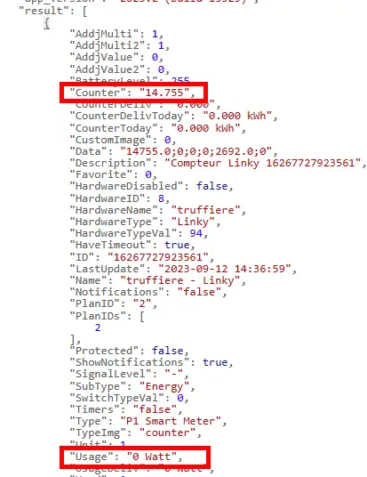
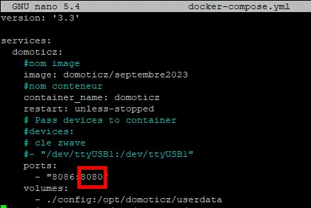
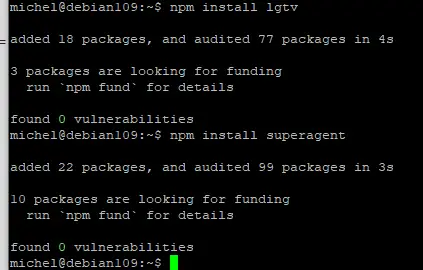
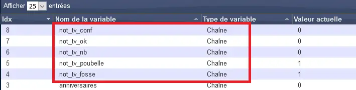
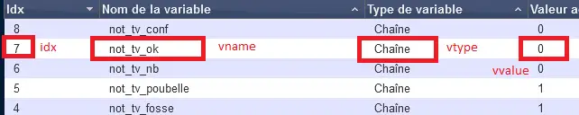
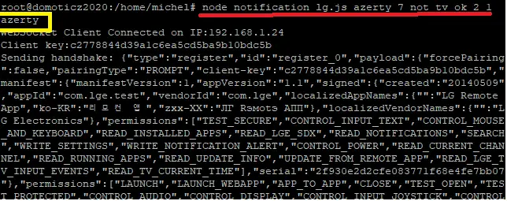
.. |image705| image:: ../media/image705.webp
   :width: 601px

.. |image707| image:: ../media/image707.webp
   :width: 659px
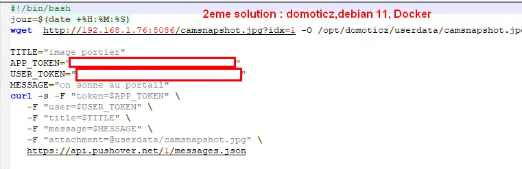
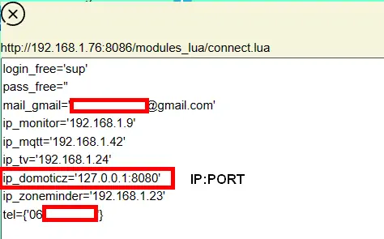
.. |image712| image:: ../media/image712.webp
   :width: 450px
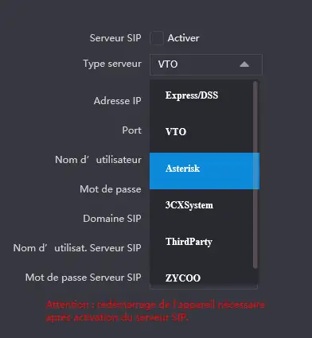
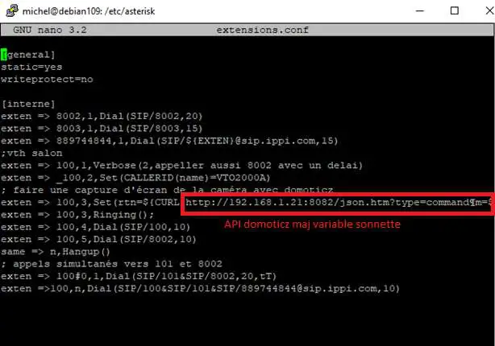
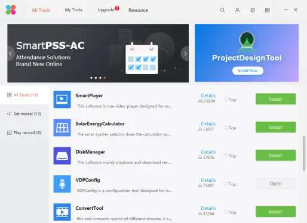
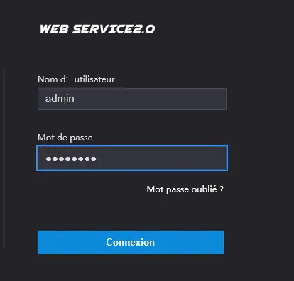
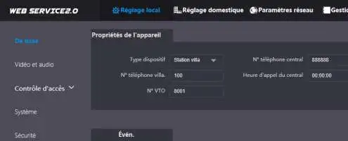
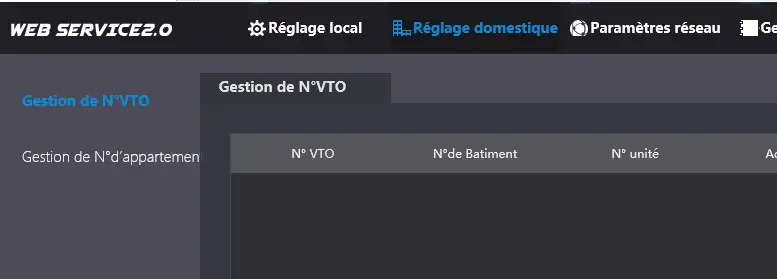
.. |image719| image:: ../media/image719.webp
   :width: 650px
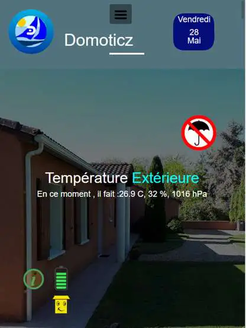
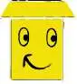
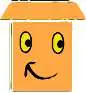
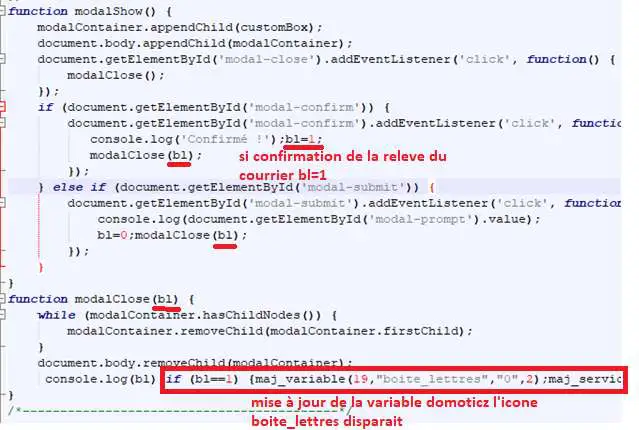
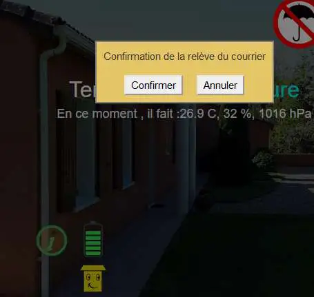
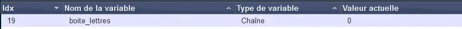
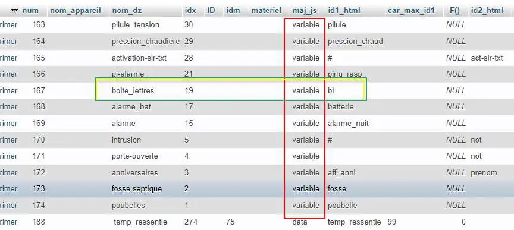
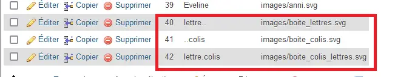
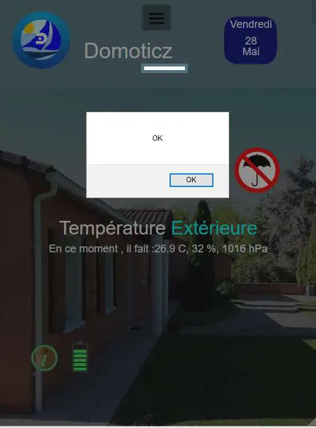
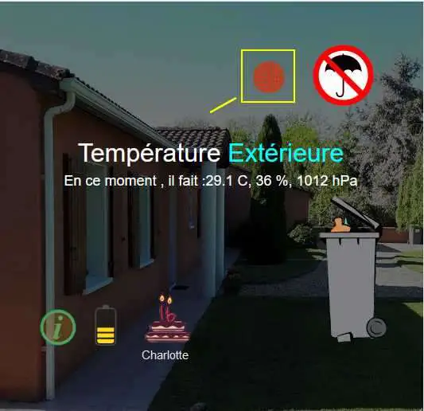
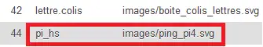
.. |image735| image:: ../media/image735.webp
   :width: 430px
.. |image736| image:: ../media/image736.webp
   :width: 650px
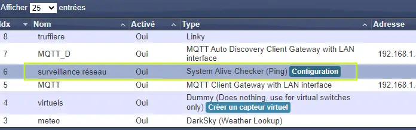
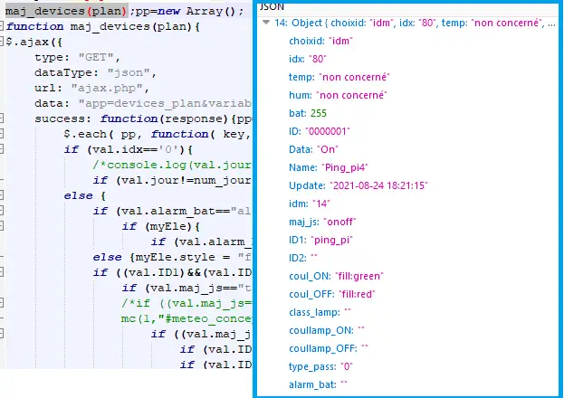

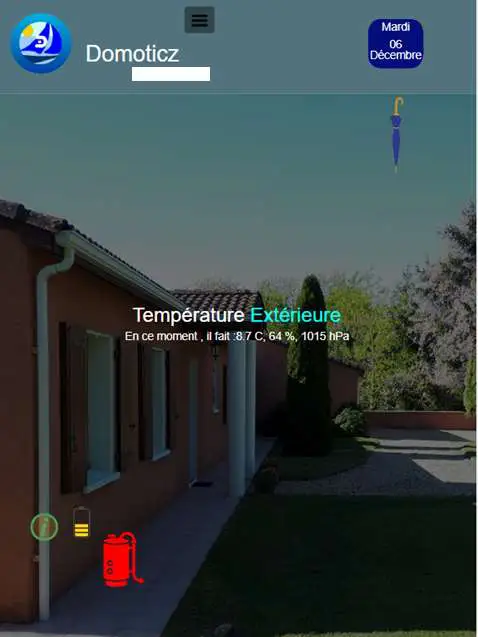
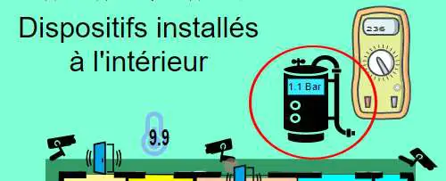
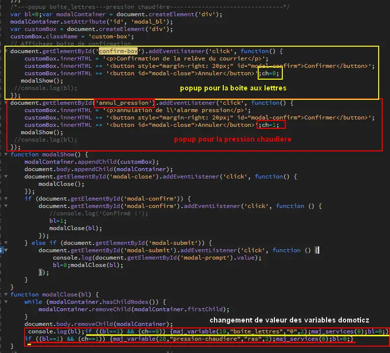
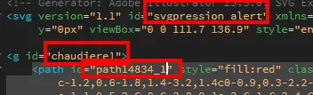
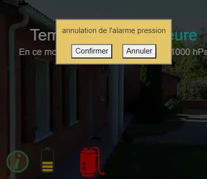
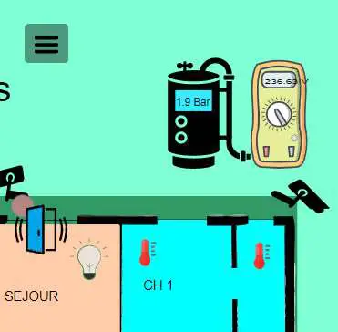
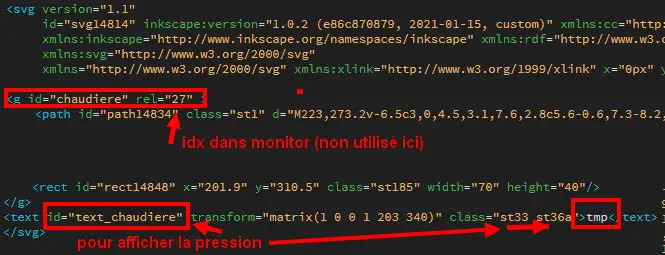
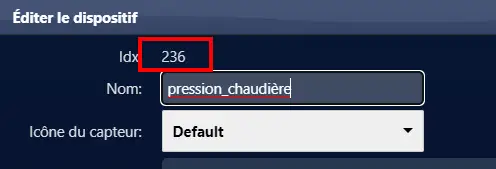
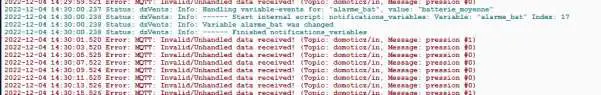
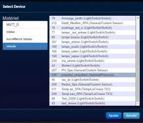
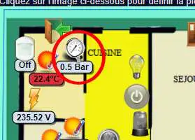
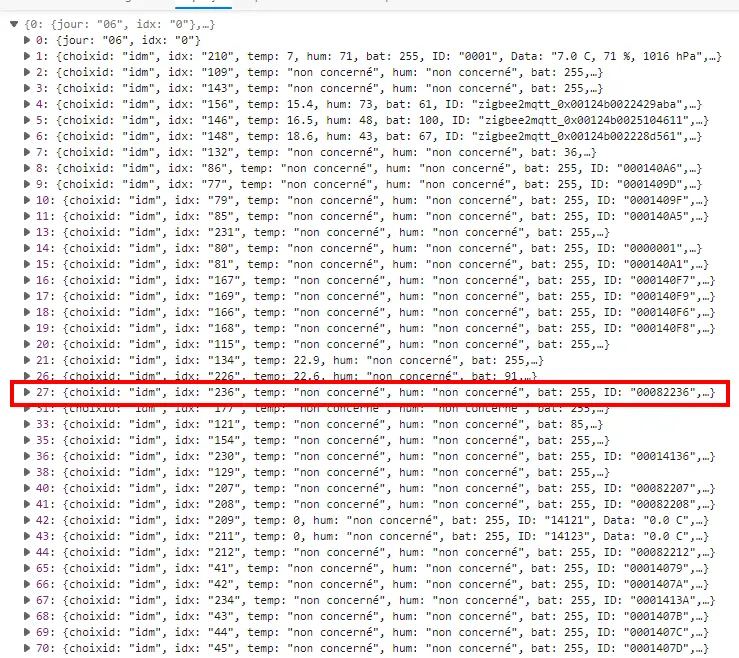
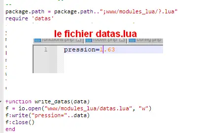
.. |image651| image:: ../media/image651.webp
   :width: 474px
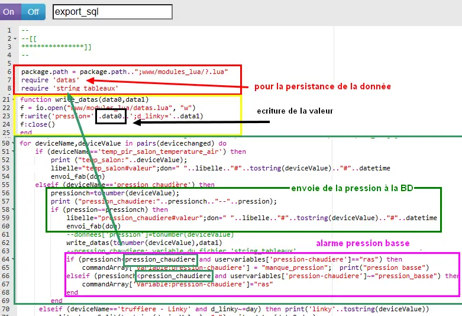
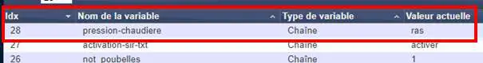
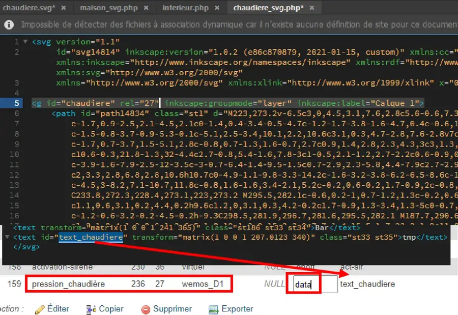
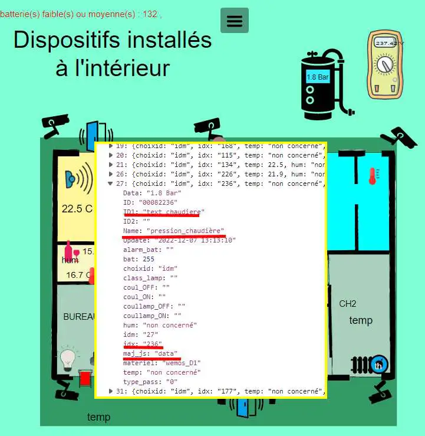
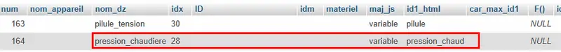
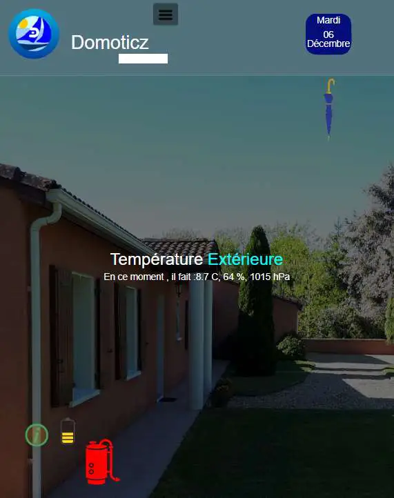
.. |image768| image:: ../media/image768.webp
   :width: 650px    
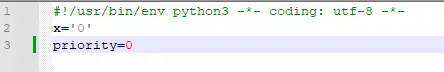
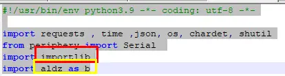
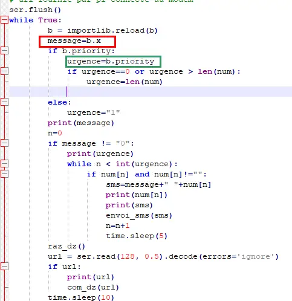
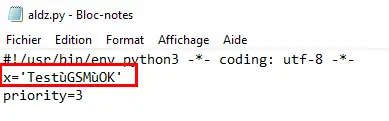

.. |image777| image:: ../media/image777.webp
   :width: 432px    

.. |image1087| image:: ../media/image1087.webp
   :width: 700px

.. |image1103| image:: ../media/image1103.webp
   :width: 450px

.. |image1199| image:: ../media/image1199.webp
   :width: 200px

