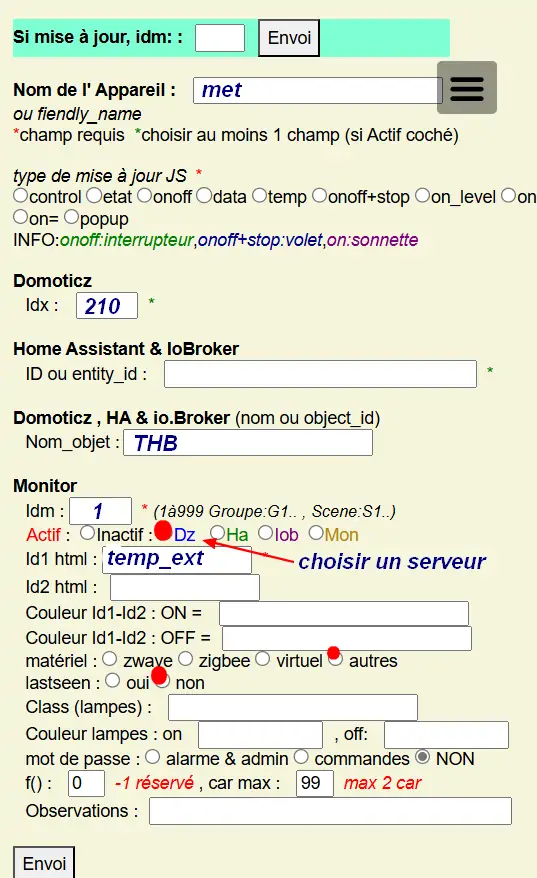
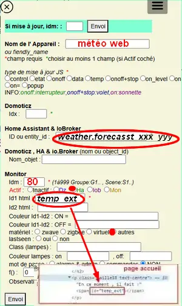
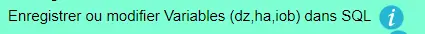
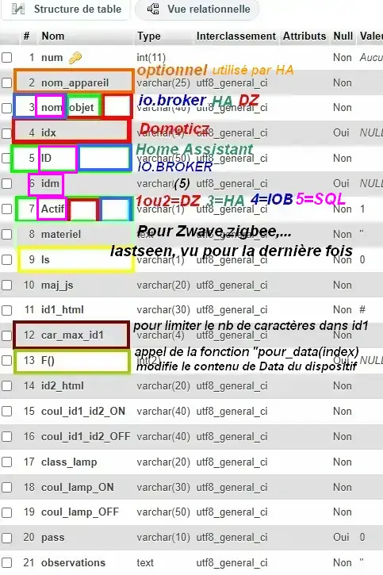
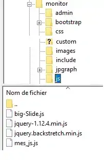

0. Infos pour bien débuter
--------------------------

0.1	Prérequis, installation : différents choix
^^^^^^^^^^^^^^^^^^^^^^^^^^^^^^^^^^^^^^^^^^^^^^^^^^
-	Après l’installation de Proxmox :

Installation automatique : conteneur LXC, LEMP (Linux, Nginx, Maria DB, PHP), monitor : https://raw.githubusercontent.com/mgrafr/monitor/main/install/create_ct_lxc_monitor.sh

- 	    installation automatique : LEMP + monitor (pour installation dans une VM ou une partition Linux) : https://raw.githubusercontent.com/mgrafr/monitor/main/install/lemp_monitor_install.sh

- 	    installation uniquement de monitor (pour une installation avec LAMP, MySQL,) : https://raw.githubusercontent.com/mgrafr/monitor/main/install/install_only_monitor.sh

0.1.1 installation automatique d’un conteneur LXC +LEMP+ monitor
================================================================
-	L’installation de Proxmox voir (:ref:`21.1 Proxmox`)

-	Création d’un conteneur LXC

-	Debian 12, et les dépendances sudo, curl,...

-	Nginx, PHP 8.2, maria db, phpMyAdmin, monitor

-	Quelques programme python utiles : pip, Paho-mqtt

-	Un utilisateur système est crée

-	Un utilisateur MySQL PMA et monitor est aussi crée 

Télécharger depuis le Shell de PVE le fichier d’installation install.sh :

.. code-block::

   wget https://raw.githubusercontent.com/mgrafr/monitor/main/install/create_ct_lxc_monitor.sh

|image3|

Donner des autorisations au fichier « create_ct_lxc_monitor.sh »

.. code-block::

   chmod +x create_ct_lxc_monitor.sh

.. admonition:: Si des problèmes de lecture existent 

   convertir le fichier en UNIX

   pour installer do2unix :  apt install dos2unix

   commande : dos2unix NOM_FICHIER (ex : dos2unix lemp_install.sh)

**Installation :**

.. code-block::

   ./create_ct_lxc_monitor.sh
 
|image6|
 
|image7|

|image8|

|image9|
 
Choisir le langage UTF-8 : fr_FR.UTF-8

  
|image10|
 
|image11|

0.1.1.a Installation de LEMP & Monitor
""""""""""""""""""""""""""""""""""""""

|image12|

|image13|
 
|image14|
 
|image15|

|image16|

|image17| 
 
Sécuriser Maria DB, mot passe root
 
  
|image18|

|image19|

|image20|
 
|image21|

**créer un certificat SSL auto-signé pour Nginx**

Il suffit de répondre (O)ui pour créer ce certificat, sinon taper (N)on

.. admonition:: avec un certificat SSL auto-signé

   http reste disponible ce qui permet d’éviter les restrictions CORS pour afficher d’autres serveurs comme Zigbee, Zwave, Nagios, ……

   Pour une installation manuelle de ce certificat, voir le paragraphe :ref:`0.1.3 – Installation de monitor uniquement`

   Pour l’utiliser avec HA, ajouter dans /config/configuration.yaml
 
	|image22|
 

|image23|

Fin de l'installation:

|image24|

.. admonition:: Vérifications en cas de problèmes :

   avec Filezilla :

   |image25|

   Pour accéder en écriture aux fichiers dans /www/html/monitor, donner des droits :

   :red:`chmod -R 777 /www/html/*`
 
   **MySQL :**

   :red:`mysql -u root`
   

   |image27| 
 
   **phpMyAdmin** :   Accès par monitor

   |image28| 

 
   Ou en ajoutant l’adresse dans le navigateur :

   :red:`<IP Monitor>/phpmyadmin/`

|image29| 

|image30| 
 
**Les tables installées lors de l’installation :**
 
|image31|

La suite, mode découverte , :ref:`0.1.3.1 mode « découverte »`

0.1.2 -Installation automatique de LEMP et Monitor : 
====================================================
Installer auparavant un système Debian 12 ou supérieur
	Télécharger le script : lemp_monitor_install.sh,

.. code-block::

   https://raw.githubusercontent.com/mgrafr/monitor/main/install/lemp_monitor_install.sh 
 
Donner des autorisations au fichier lemp_install.sh 

.. code-block::

   chmod +x  lemp_monitor_install.sh

Lancer le script :

.. code-block::

   ./lemp_monitor_install.sh

|image33|
  
**La suite :**   :ref:`0.1.1.a Installation de LEMP & Monitor`

0.1.3 – Installation de monitor uniquement
==========================================
	Après l’installation d’un OS (Debian, Ubuntu…et LEMP ou LAMP, Maria DB ou MySQL ...

Quelques liens utiles :

|	o phpMyAdmin, voir http://domo-site.fr/accueil/dossiers/3
|	o LAMP :   https://www.linuxtricks.fr/wiki/debian-installer-un-serveur-lamp-apache-mysql-php
|	o LEMP : voir ce paragraphe `

**Installation :**

*-	Soit télécharger et extraire le fichier :*

.. code-block::

   https://github.com/mgrafr/monitor

|image34|                    

*-	Soit cloner le référentiel : https://github.com/mgrafr/monitor.git*

.. code-block::

   git clone https://github.com/mgrafr/monitor.git  <REPERTOIRE_DESTINATION

.. admonition:: Git doit avoir été installé 

   sur Debian ou Ubuntu, :red:`apt install git`

*-       soit télécharger en bash avec wget :*

.. code-block::

   https://raw.githubusercontent.com/mgrafr/monitor/main/install/install_only_monitor.sh

Et apprès avoir rendu exécutable le fichier, le lancer :
 
|image35| 

.. code-block::'

  ./install_only_monitor.sh

**Installation**

|image37|

.. note::

   Choisir le serveur web pour une installation de monitor dans le bon répertoire ;

   Choisir « autre » si Apache ou Nginx ne sont pas utilisé, monitor sera installé dans « /tmp » il suffira alors de créer un lien symbolique vers le serveur web.

   Si un répertoire « monitor » existe déjà sur le chemin choisi (précédente installation), le supprimer

|image38| 
 
0.1.3.1 mode « découverte »
"""""""""""""""""""""""""""
.. note::
    
   **IMPORTANT** : après l’installation le programme est en mode « découverte », 

   pour utiliser Domoticz et toutes les fonctions nécessitant des tables de la base de données, :darkblue:`désactiver le mode « découverte »` ;
   En profiter pour changer le mot de passe actuel **1234**

   Pour cela soit :

   *-	Utiliser la fonction du programme* 

   |image39|

   |image40|

   *-	Modifier le fichier /admin/config.php*

   |image41|

   |image42|
             
**Pour utiliser Domoticz ou Home Assistant ou les 2 :**

Indiquer l‘ IP et le port

|image43|
 
**Logiciels utiles :**

-	Logiciel d’édition d’images svg : Adobe Illustrator ou Inkscape 
-	Pour les autres images webp, un convertisseur en ligne : https://convertio.co/fr/

0.1.3.2 -Création d’un certificat SSL auto-signé pour Nginx :
"""""""""""""""""""""""""""""""""""""""""""""""""""""""""""""
Dans le cas où l’installation n’est pas automatique (en automatique il suffit d’accepter la création du certificat).

Avant de commencer, vous devez avoir un utilisateur non root configuré avec des privilèges ; si vous avez installé Monitor en suivant ce tuto, c’est déjà fait

.. admonition:: **Étape 1** : Créer le certificat SSL

   .. code-block::

      sudo openssl req -x509 -nodes -days 365 -newkey rsa:2048 -keyout /etc/ssl/private/nginx-selfsigned.key -out /etc/ssl/certs/nginx-selfsigned.crt

   |image44|
 
   *Explications :*

   -  **openssl**: l’outil en ligne de commande pour créer et gérer des certificats, clés ,….

   -  **req** : cette commande spécifie que nous voulons utiliser la gestion des demandes de signature de certificat (CSR) X.509. (C’est une norme d’infrastructure à clé publique à laquelle SSL et TLS adhèrent pour sa gestion des clés et des certificats). 
   
   -  **x509** : pour compléter la commande précédente en indiquant que nous voulons créer un certificat auto-signé.

   -  **nodes**: pour ignorer l’option de sécurisation de notre certificat avec une phrase secrète. Une phrase secrète empêcherait Nginx de démarrer normalement car il faudrait saisir la phrase secrète à chaque 

   *démarrage.*

   -  **days 365** : la durée en jours de validité du certificat 

   -  **newkey rsa:2048** : pour générer un nouveau certificat et une nouvelle clé en une seule fois. Il est indiqué de créer une clé RSA de 2048 bits

   -  **keyout** : emplacement du fichier de la clé privée généré.

   -  **out**: emplacement du certificat créé.

   :darkblue:`Les deux fichiers créés sont placés dans les sous-répertoires appropriés du répertoire /etc/ssl` 

   |image45|

   *Confidentialité persistante*

   .. code-block::

      sudo openssl dhparam -out /etc/ssl/certs/dhparam.pem 2048
    
   |image46|

   C’est assez long

.. admonition:: **Étape 2** :Configurer Nginx pour utiliser SSL

   Créer 2 lignes de configuration dans un fichier pointant vers la clé SSL et le certificat

   *-	Créer le fichier self-signed.conf dans /etc/nginx/snippets*
   
   .. code-block::

      cd /etc/nginx/snippets

      sudo nano self-signed.conf

   *-   Ajouter*

   .. code-block::

      #certificat et clé privée

      ssl_certificate /etc/ssl/certs/nginx-selfsigned.crt;
      ssl_certificate_key /etc/ssl/private/nginx-selfsigned.key;

   |image47|
 
   Ctrl X, Enter, ctrl X

   
   *-   Créer un bloc de configuration avec des paramètres de chiffrement forts*

     -	Comme précédemment créer un fichier *ssl-params.conf*

   .. code-block:: 

      sudo nano ssl-params.conf

   *-   Ajouter* :

   .. code-block::

      # from https://cipherli.st/
      # and https://raymii.org/s/tutorials/Strong_SSL_Security_On_nginx.html

      ssl_protocols TLSv1 TLSv1.1 TLSv1.2;
      ssl_prefer_server_ciphers on;
      ssl_ciphers "EECDH+AESGCM:EDH+AESGCM:AES256+EECDH:AES256+EDH";
      ssl_ecdh_curve secp384r1;
      ssl_session_cache shared:SSL:10m;
      ssl_session_tickets off;
      ssl_stapling on;
      ssl_stapling_verify on;
      resolver 8.8.8.8 8.8.4.4 valid=300s;
      resolver_timeout 5s;
      # Disable preloading HSTS for now.  You can use the commented out header line that includes
      # the "preload" directive if you understand the implications.
      #add_header Strict-Transport-Security "max-age=63072000; includeSubdomains; preload";
      add_header Strict-Transport-Security "max-age=63072000; includeSubdomains";
      add_header X-Frame-Options DENY;
     add_header X-Content-Type-Options nosniff;

     ssl_dhparam /etc/ssl/certs/dhparam.pem;
	
   |image48|	 

   *Ajustez la configuration Nginx pour utiliser SSL : extrait de monitor.conf*

    le fichier sur github : :darkblue:`https://raw.githubusercontent.com/mgrafr/monitor/main/share/nginx/monitor.conf`

   .. code-block::

      server {

      listen 80 ;
      listen [::]:80 ;
      server_name 192.168.1.127;

      # SSL configuration
      listen 443 ssl ;
      listen [::]:443 ssl;
      include /etc/nginx/snippets/selfsigned.conf;
      include /etc/nginx/snippets/ssl-params.conf;

      root /www/html;
      index  index.php index.html index.htm;

      location ~ \.php$ {
         fastcgi_split_path_info ^(.+\.php)(/.+)$;
         fastcgi_pass   unix:/var/run/php/php8.2-fpm.sock;
         fastcgi_index  index.php;
         fastcgi_param  SCRIPT_FILENAME $document_root$fastcgi_script_name;
         include        fastcgi_params;
      ……
 
.. admonition:: *Vérifier la configuration*
 
   .. code-block::

      sudo nginx -t
 
   Vous devrez confirmer manuellement que vous faites confiance au serveur pour y accéder.= ; les navigateurs ne peuvent vérifier les certificats auto-signés

   Redémarrer le serveur Nginx

   .. code-block::

      sudo systemctl restart nginx

0.2	La page d’accueil et connexion avec Domoticz ou HA : 
^^^^^^^^^^^^^^^^^^^^^^^^^^^^^^^^^^^^^^^^^^^^^^^^^^^^^^^^^^^^
0.2.1 page d’accueil :
======================
Pour modifier l’image, les titres et slogan de la page d’accueil : voir ce paragraphe :ref:`1.1.1.a Pour l’image de fond suivant la résolution d’écran et le logo`

|image52|
 
0.2.2. Premier dispositif
=========================
0.2.2.1 pour Domoticz
""""""""""""""""""""""
Température extérieure : le matériel

.. warning::

   Depuis le 1 avril 2023 le service Darsky n’est assuré que pour des appareil Apple !!!
   J’ai donc provisoirement migré vers Météo Concept que j’utilise pour ma météo à 14 jours ; Je n’utilise pas ces valeurs dans Domoticz 

A la place OpenWeatherMap peut être utilisé :
 
Pour la météo actuelle laisser les curseurs en rouge

|image53|

**Le dispositif :**
 
|image54|

 **Création d’un plan :**  

 |image55|

 |image56| 
 
 |image57| 	 
 
Noter : 

	- l’Idx du plan Domoticz

	- L’Idx (Domoticz) du dispositif 285 

l'Idm (Id monitor)  , il est le premier dispositif : 1

Ajoutons ces données dans la base SQL , soit avec phpmyadmin ou plus simplement avec l’appli :

 |image4| 	 
 
 |image58|
 |image59| 
 
 |image60| 

*Avec OpenWeather l’API fournit la température ressentie, pour l’ajouter enregistrer le dispositif et ajouter à accueil.php :*

.. code-block::

   
T° ressentie :

La classe "text-centre" :

.. code-block::

   .text-centre {
    margin-right: 2px;
    margin-left: 2px;
    margin-bottom: 2px;
    display: block;
    float: none;}   

.. admonition:: **Script de remplacement**

   Indépendant de Domoticz, la fonction PHP 

   .. code-block::

      case 2:// relevé temps réel station la pus proche (40Km)
      $url = 'https://api.meteo-concept.com/api/observations/around?param=temperature&radius=40&token='.TOKEN_MC.'&insee='.INSEE;
      //$url2 = 'https://api.meteo-concept.com/api/forecast/nextHours?token='.TOKEN_MC.'&insee='.INSEE;		
      $prevam = file_get_curl($url);//echo $prevam;return;
      $forecastam = json_decode($prevam);$info=array();
	//$info['time']=$forecastam[0]->observation->time;
	$info['temp']=$forecastam[0]->observation->temperature->value;
	$info['hPa']=$forecastam[0]->observation->atmospheric_pressure->value;
      return json_encode($info);
      break;		

      
   lien Github du fichier avec les fonctions PHP : :darkblue:`https://raw.githubusercontent.com/mgrafr/monitor/main/fonctions.php` 

   Appel, depuis Monitor, la fonction:c()  dans footer.php

   .. code-block::

      mc(1,"#meteo_concept");
      mc(0,"#meteo_concept_am");
      //mc(3,"#temp_ext");	//pour la T° locale 
      setTimeout(pluie, 3600000, 2);
      function mc(variable,id){
        $.ajax({
        type: "GET",
        url: "ajax.php",
        data: "app=meteo_concept&variable="+variable,
        success: function(data){
        if (variable==3 || variable==2) $(id).html(data.data);
		else $(id).html(data);
        }
      });
      //setTimeout(mc, 1800000, 3,"#temp_ext");//:red:`pour la T° locale rafraichissement toutes les 30mn`	
       };

   *footer.php et ajax.php  sont dans le référentiel :*  :darkblue:`https://github.com/mgrafr/monitor`

|image64| 

0.2.2.2 pour Home Assistant
"""""""""""""""""""""""""""
La météo est installée lors de l’installation du programme :

|image65| 

Enregistrement du dispositif :

|image66| 
|image67| 

Affichage sue la page d’accueil :

|image68| 
 
Les données json de ce dispositif :

|image69|
 
0.2.2.3 Affichage sur la page d’accueil de Monitor :
""""""""""""""""""""""""""""""""""""""""""""""""""""
Extrait du fichier /include/accueil.php

|image70|
 
*L’ID html est ici « :darkblue:`temp_ext` »*

                

0.3 _ Base de données Maria DB 
^^^^^^^^^^^^^^^^^^^^^^^^^^^^^^
La base de données a été créée lors de l’installation du serveur : nom=monitor (donnée lors de la création, il peut être différent)

Connexion en local : :darkblue:`IP/phpMyAdmin`
                        
|image72|

Pour les autorisations d’accès, voir le paragraphe concernant la configuration /admin/config.php

Elles ont été créées lors de l’installation automatique, pour l’installation manuelle :
 
*Extrait de config.php:*

.. code-block::

   // parametres serveur DBMaria
   define('SERVEUR','localhost');
   define('MOTDEPASSE','<MOT DE PASSE>');
   define('UTILISATEUR','<UTILISATEUR>');
   define('DBASE','monitor');

.. warning::
   En cas d ‘absence de base de données ou de mauvais paramétrages ,sur la page d' accueil :

   **" pas de connexion à la BD "**

**Ajout à la base de données des données fournie par Domoticz**

0.3.1 Les variables (table dispositifs)
=======================================
	La correspondance entre les variables Domoticz ou HA et l’affichage sur les pages perso se fait par l’intermédiaire de la BD « Domoticz » ; 

	- tables :

	- text-image

	- dispositifs 

	- ....

  |image75|

.. admonition:: **quelques explications**
	
   **Table « text-image »** :

   Pour un texte contenu dans une variable Domoticz correspond une image ou 0 ou « none »

   |image76|

   ex: le texte "poubelle jaune" dans la variable poubelle aura un alias : l'image d'une poubelle jaune

 
   **Table « dispositifs»**, ne sont concernés pour les variables que les champs :

   |image77|

   |image78|

        . num : ne sert qu’à éditer plus facilement la BD

          :red:`(Pour modifier plus facilement la table, ajouter au début un enregistrement (num par exemple) afin de pouvoir éditer les enregistrements)`.

   |image79|
 
   . Id1_html : ID de l’image dans la page ou #shell (voir ci-dessous)

   . Id2_html : ID du texte dans la page, concerne surtout l’alarme mais peut afficher d’autres notifications ; 

             commande Bash, accès au Shell par SSH2 depuis Domoticz sous Docker; sous Docker l’accès au Shell du serveur n’est pas possible, la parade consiste à passer par monitor.

              voir ci-après un exemple de commande bash
  
   . Nom_idx : nom de la variable du serveur domotique (dz)

   .. warning::

      **IMPORTANT** : le nom de la variable Domoticz ne doit pas comporter d’espace

      (le programme fonctionne mais l’API renvoie « NULL »)
   
   . Idx , id de la variable du serveur domotique(dz)
   		ex : idx de Domoticz
                |image87|

   . Nom appareil : non obligatoire

   . ID , id de la variable (ha)
   		Ex : Home Assistant, nom essai, ID input_text.essai
		 |image88|
       
.. admonition:: **un exemple bash concret : redémarrer un script après modifications**

   Ici :red:`systemctl restart sms_dz` (script chargé de l’envoi des sms et qui doit être redémarré si le fichier « connect.py » a été modifié (ajout, remplacement de N° de tel)

   **Dans Domoticz** : créer une variable avec les données ci-dessous et l'exploiter dans un script LUA

   |image80|

   scrpt LUA:

   .. code-block::

      -- le fichier connect.py est modifié ` 
      f = io.open("userdata/scripts/python/connect.py", "w")
                    env="#!/usr/bin/env python3"
                    f:write(env.." -*- coding: utf-8 -*-".."\n"..fich)
                    f:close()
      -- on modifie la variable
                    domoticz.variables('BASH').set("restart_sms_dz")	
 
   **Dans SQL** :

   |image81|
 
     *Ou par Monitor* :

     |image82|

     |image83|
                          
   **Dans monitor, PHP-SSH2**

   raw.githubusercontent.com/mgrafr/monitor/main/include/ssh_scp.php

   Extrait du fichier :
 
   |image85|

	Monitor surveille les modifications de variables, si une variable avec une ID_img =#shell apparait, si la valeur est !=0 le nom du script indiqué dans Value est exécuté :
	
	Appel ajax depuis footer.php vers ajax.php->ssh_scp.php->serveur dz ou ha->exécution du fichier Bash

    .. code-block::

       #!/usr/bin/bash
       echo "MOT DE PASSE" | sudo -S systemctl restart sms_dz

   :darkblue:`Le mot de passe peut être ajouté à connect.py`

*Pourquoi une correspondance ?* :

cela évite, lors d’une modification dans Domoticz ou HA, de modifier tous les ID (idm) dans monitor

*Installation des tables* : lors de l’installation automatique, elles sont installées, sinon télécharger le référentiel :
 
|image89|

*Les API de Domoticz et Home assistant pour les variables* :

-	DZ ,  URL : PORT/json.htm?type=command&param=getuservariables ,( renvoie la liste de toutes les variables et leurs valeurs)

-	HA ,  URL : 8123/api/states/sensor.liste_var (renvoie la liste des dispositifs enregistrés comme input text)

	Le template sensor : sensor.liste_var

.. code-block:: 'fr'	

   template:
     -  sensor:
          -  name: "liste_var"
             unique_id : 1234567890
             state: >
               
                {{input_text.entity_id ~ "=" ~ input_text.state ~ ", " }}
               

0.3.2 Les Dispositifs
=====================
Comme pour les variables, la table fournie une correspondance entre les dispositifs dans Domoticz ou HA et Monitor et une info sur le matériel (Zgbee, Zwave, et n° de nœud.) (Pour les dispositifs Domoticz n’enregistre pas le type de matériel)

**Table « dispositifs »**
 
|image91| 

|image92| 

La table permet en plus de gérer et modifier si besoin l’affichage de tous les dispositifs sans intervenir sur la page HTML ; :red:`pour les switches, les scripts pour commander l’allumage ou l’extinction sont générés automatiquement à partir des données de cette table`.

- num : ne sert qu’à éditer plus facilement la BD
	voir le paragraphe précédent :ref:`0.3.1 Les variables (table dispositifs)`
 
- Nom appareil : nom usuel

- nom_dz : nom du dispositif Domoticz

- idx : celui de Domoticz

- ID : celui de Home Assistant

- idm : idm de monitor peut-être la même que idx ; c’est utile pour l’affichage des infos concernant un dispositif ; de plus cela permet de retrouver facilement un dispositif dans l’image svg du plan en faisant 	une recherche ;dans l’image cet idm est indiqué par « rel=idm »
	:darkblue:`Voir le paragraphe concernant les images svg`

- Matériel : pour les types zwave ou Zigbee

- maj_js : types de mise à jour java script
	-	control // détecteur présence(on/off)
	-	etat  //porte, volet ,(closed/open)
	-	Temp ou data // température, humidité, ph, M3/h, orp,…. toutes données ; temp est utilisé pour une raison historique, à l’époque où seules des mesures de températures étaient exploitées….il est 		préférable d’utiliser « data »

	|image93| 

	|image94| 
 
	-	onoff commandes 
	-	onoff+stop commandes (volets par exemple) 
	-	popup //ouverture d’une fenêtre (commandes particulières)
		.	exemple des scripts générés automatiquement 

.. code-block::	

   /* switchOnOff*  */
	
   $("#coul_al_absence").click(function(){switchOnOff_setpoint("65","41","On","pwdalarm");});
   $("#coul_al_nuit").click(function(){switchOnOff_setpoint("66","42","On","pwdalarm");});
   $("#sirene_al").click(function(){switchOnOff_setpoint("67","234","On","pwdalarm");});
   $("#patha5645").click(function(){switchOnOff_setpoint("68","43","On","pwdalarm");});
   $("#coul_modect").click(function(){switchOnOff_setpoint("69","44","On","pwdalarm");});
   $("#raz_dz").click(function(){switchOnOff_setpoint("70","45","On","pwdalarm");});
   $("#sw7").click(function(){switchOnOff_setpoint("9","77","On","0");});
   $("#sw8").click(function(){switchOnOff_setpoint("10","79","On","0");});
   $("#ping_pi").click(function(){switchOnOff_setpoint("14","80","On","0");});
   $("#coul_al_nuit-2").click(function(){switchOnOff_setpoint("15","81","On","pwdalarm");});
   $("#sw2").click(function(){switchOnOff_setpoint("11","85","On","0");});
   $("#gsm").click(function(){switchOnOff_setpoint("8","86","On","pwdalarm");});
   $("#sw3").click(function(){switchOnOff_setpoint("18","166","On","0");});
   $("#sw4").click(function(){switchOnOff_setpoint("16","167","On","0");});
   $("#sw5").click(function(){switchOnOff_setpoint("19","168","On","0");});
   $("#sw1").click(function(){switchOnOff_setpoint("17","169","On","0");});
   $("#volet_bureau,#volet_bureau1").on("click", function (){$("#popup_vr").fadeIn(300);document.getElementById("VR").setAttribute("title","31");document.getElementById("VR").setAttribute("rel","177");})
   $("#act-sir").click(function(){switchOnOff_setpoint("36","230","On","pwdalarm");});
 
.. _switches:

switches
********

le script dans footer.php pour ajouter le javascript automatiquement:

.. code-block::

   <?php 
   require("fonctions.php");
   if ($_SESSION["exeption_db"]=="" &&  DECOUVERTE==false)   {sql_plan('0');}	
   ?>
		 
	Voir chapitre :ref:`1._ Configuration minimum`

	*Il est possible d’ajouter des types*

- id1_html , Id2_html : id d’affichage pour un idx ou idm, souvent 1 seul ID, le 2eme lorsque l’image comporte de nombreuses zones,

- car_max_id1 : nb de caractères maximum affichés (concerne Data avec plusieurs données (T°,%hum)

- F() N° case de la fonction « pour_data($nc,$l_device) » , fichier fonctions.php

- class_lamp : utilisé pour les lampes en plus de l’interrupteur associé ; c’est une class car il peut y avoir plusieurs lampes

- coul_id1_id2_ON, coul_id1_id2_OFF, coul_lamp_ON, coul_lamp_ON : couleur des ID ou de la class des dispositifs suivant leur position, (class_lamp pour les lampes des différents interrupteurs)

- pass : par défaut « 0 » pas de mot de passe , pwalarm pour mot de passe de l’alarme et pwcommand pour les commandes (on/off ,…)

- doc : pour associer un document au dispositif

Pour créer cette table l’importer depuis le référentiel « monitor » 

API Domoticz et HA pour les dispositifs :

**DZ** : URL :PORT/json.htm?type=devices&plan=NUMERO DU PLAN

**HA** : URL:8123/api/states

Dans les 2 cas, un fichier json de tous lis dispositifs et les valeurs

........ha :
 
|image97| 

0.3.3 caméras
=============
On crée une table dans la base de données : :darkblue:`cameras`

*Si l’on veut un accès extérieur il est utile d’indiquer également le domaine;*
*Si l’on utilise Zoneminder, il est nécessaire d’assurer la correspondance des Numéros de dispositifs*
 
|image98| 

- num : n° auto incrémenté pour faciliter les modifications
- Idx : N° idx :darkblue:`celui qui correspond au onclick du plan`, 
- Id_zm : optionnel, utilisé avec Zoneminder, :darkblue:`option à définir dans admin/config.php`
- Ip : IP locale
- url : url locale de la caméra
- marque : dahua ou generic, :darkblue:`option à définir dans admin/config.php` 
- type : VTO ou vide :darkblue:`concerne uniquement les portier VTO Dahua`
- localisation :

téléchargement de la table "cameras.sql" : https://raw.githubusercontent.com/mgrafr/monitor/main/bd_sql/cameras.sql

0.3.4 Autres tables SQL
=======================
Enregistrements de températures, tension ,....

|image99| 

Exemple pour une table temp_meteo :

.. code-block::

   -- Structure de la table `temp_meteo`
   --
   CREATE TABLE `temp_meteo` (
     `num` int(11) NOT NULL,
     `date` timestamp NOT NULL DEFAULT current_timestamp() ON UPDATE current_timestamp(),
     `valeur` varchar(4) NOT NULL
   ) ENGINE=InnoDB DEFAULT CHARSET=utf8 COLLATE=utf8_general_ci;
   -- Index pour la table `temp_meteo`
   ALTER TABLE `temp_meteo`
     ADD PRIMARY KEY (`num`);
   -- AUTO_INCREMENT pour la table `temp_meteo`
   ALTER TABLE `temp_meteo`
     MODIFY `num` int(11) NOT NULL AUTO_INCREMENT, AUTO_INCREMENT=21294;
   COMMIT;

- num : n° auto incrémenté pour faciliter les modifications
- date : la date et l’heure
- valeur : la température

0.4 Le serveur http de NGINX
^^^^^^^^^^^^^^^^^^^^^^^^^^^^
|image101| 

**Configuration de monitor** : :darkblue:`/admin/config.php`
 
Extrait du fichier, fichier complet : https://raw.githubusercontent.com/mgrafr/monitor/main/admin/config.php

.. code-block::

   <?php
   // NE PAS MODIFIER LES VALEURS EN MAJUSCULES------
   //general monitor
   define('URLMONITOR', 'monitor.xxxxxxx.ovh');//domaine
   define('IPMONITOR', '192.168.1.7');//ip 
   define('MONCONFIG', 'admin/config.php');//fichier config 
   define('DZCONFIG', 'admin/dz/temp.lua');//fichier temp 
   define('FAVICON', 'favicon.ico');//fichier favicon  , icone du domaine dans barre url
   // répertoire des images
   $rep='images/';//ne pas changer
   // images logo et titres
   define('IMAGEACCUEIL', $rep.'maison.jpg');//image page accueil pour écrans >534 px
   define('IMAGEACCUEILSMALL', $rep.'maison_small.jpg');//image page accueil pour écrans <535 px
   define('IMGLOGO', $rep.'logo.png');//image logo
   define('NOMSITE', 'Domoticz');//nom principal du site
   define('NOMSLOGAN', xxxxxx');//nom secondaire ou slogan
   // 

**Les fichiers à la racine du site** :

|image103| 
 
- **ajax.php** : appels ajax depuis javascript, explications dans les divers paragraphes

	extrait du script :

.. code-block::

   <?php
   require ("fonctions.php");
   $retour=array();
   //POST-------------------
   $appp = isset($_POST['appp']) ? $_POST['appp'] : '';
   $variablep = isset($_POST['variable']) ? $_POST['variable'] : '';
   $commandp = isset($_POST['command']) ? $_POST['command'] : '';
   //GET----------------------
   $app = isset($_GET['app']) ? $_GET['app'] : '';
   $idx = isset($_GET['idx']) ? $_GET['idx'] : '';
   $device = isset($_GET['device']) ? $_GET['device'] : '';
   $name = isset($_GET['name']) ? $_GET['name'] : '';
   $variable = isset($_GET['variable']) ? $_GET['variable'] : '';
   $command = isset($_GET['command']) ? $_GET['command'] : '';
   $type = isset($_GET['type']) ? $_GET['type'] : '';
   $table = isset($_GET['table']) ? $_GET['table'] : '';
   // APPEL A des FONCTIONS PHP 'fonctions.php
   if ($app=="aff_th") {$retour= status_devices($device,'Temp','Humidity');echo json_encode($retour); }
   else if ($app=="devices_plan") {if (DECOUVERTE==true) {include('include/json_demo/devices_plan_json.php');return;}
	else {$retour=devices_plan($variable);echo json_encode($retour); }}
   else if ($app=="turn") {$retour=devices_id($device,$command);echo $retour; }
   else if ($app=="OnOff") {$retour=switchOnOff_setpoint($device,$command,$type,$variable,$name);echo json_encode($retour); }
   else if ($app=="meteo_concept") {if (DECOUVERTE==true) {include('include/json_demo/meteo_concept_json.php');return;}
	else {echo $retour=meteo_concept($variable); }}

- **Cookies.txt** & **cookie.txt** : utilisés par Zoneminder suivant les versions de l’API

- **favicon.ico** : l’icône associée à la barre de l’url

- **fonctions.php** : toutes les fonctions PHP appelées au démarrage et lors des appels Ajax

- **Index.php** :  le ficher appelé lors du chargement du site ; pour les écrans > 768x1024 ce fichier gère un affichage de 768x1024 appelant la page dans une iframe ; sur cette page il faut indiquer l’adresse 	du répertoire du site sur le serveur

.. code-block::

   <?php
   echo '<!DOCTYPE html><html><body style="background-color: cornsilk;">';
   $rep="/"; $domaine=$_SERVER['HTTP_HOST'];$port=$_SERVER['SERVER_PORT'];
   if (substr($domaine, 0, 7)=="192.168") $rep="/monitor/";
   header('Location: '.$rep.'index_loc.php');
   exit();
   ?>
 
- **Index_loc.php** : la page d’accueil réelle du site ; sauf pour ajouter des pages non incluses dans le programme, ne pas modifier ce fichier.

|image106|

0.5 Le Framework Bootstrap
^^^^^^^^^^^^^^^^^^^^^^^^^^
Pour des mises en page faciles, des fenêtres modales ,…..
 
|image107|

0.6 Les styles CSS
^^^^^^^^^^^^^^^^^^^
|image108| 

Un extrait :

.. code-block::

   body {
       font-size: 15px;
       line-height: 1.50;
       color: #333333;
       position: relative;
       font-family: 'Open Sans', sans-serif;
   }
   html, body {height: 100%;}
   .table td{border:0}
   #menu {width:17em;}
   #maison1{margin-top:12%;}
   .header {height: 150px;color: #ffffff;background-color: rgba(8, 55, 70, 0.7);
	padding: 10px 0;-webkit-transition: all 0.2s ease-in-out;
	-moz-transition: all 0.2s ease-in-out;	-o-transition: all 0.2s ease-in-out;
	-ms-transition: all 0.2s ease-in-out;
 
Les Media queries pour les différents écrans

|image110| 
 
0.7 Les images
^^^^^^^^^^^^^^
Toutes sont au format svg ou webp sauf les caméras

.. note::
   *Avantages du format SVG*
   Les images SVG peuvent être créées et modifiées un éditeur de texte
   Les images SVG peuvent contenir du javascript 
   Les images SVG sont zoomables
   Les graphiques SVG ne perdent aucune qualité s'ils sont zoomés ou redimensionnés
   SVG est open source
   Les fichiers SVG sont du pur XML

|image111| 

Webp est un format d'image moderne qui offre une compression supérieure avec perte et sans perte pour les images du Web

Les caméras sont au format jpg :

|image112|

0.8 Les fichiers PHP
^^^^^^^^^^^^^^^^^^^^
Ils sont regroupés dans le dossier « include », sauf
-	 fonctions.php, ajax.php, à la racine de monitor
-	/admin/config. PHP
-	/jpgraph

 |image113|

Affichage de graphique avec jpgraph
 
|image114|

0.9 Les fichiers Javascript & Python
^^^^^^^^^^^^^^^^^^^^^^^^^^^^^^^^^^^^
Utilisation de jQuery

|image115| |image116|

	
.. |image3| image:: ../media/image3.webp
   :width: 604px
   :height: 176px

.. |image6| image:: ../media/image6.webp
   :width: 405px
   :height: 104px
.. |image7| image:: ../media/image7.webp
   :width: 538px
   :height: 194px
.. |image8| image:: ../media/image8.webp
   :width: 544px
   :height: 170px
.. |image9| image:: ../media/image9.webp
   :width: 554px
   :height: 276px
.. |image10| image:: ../media/image10.webp
   :width: 636px
.. |image11| image:: ../media/image11.webp
   :width: 626px
.. |image12| image:: ../media/image12.webp
   :width: 557px
   :height: 269px
.. |image13| image:: ../media/image13.webp
   :width: 552px
   :height: 182px
.. |image14| image:: ../media/image14.webp
   :width: 592px
.. |image15| image:: ../media/image15.webp
   :width: 541px
   :height: 176px
.. |image16| image:: ../media/image16.webp
   :width: 547px
   :height: 266px
.. |image17| image:: ../media/image17.webp
   :width: 592px
   :height: 519px
.. |image18| image:: ../media/image18.webp
   :width: 563px
.. |image19| image:: ../media/image19.webp
   :width: 628px
.. |image20| image:: ../media/image20.webp
   :width: 581px
.. |image21| image:: ../media/image21.webp
   :width: 583px  
.. |image22| image:: ../media/image22.webp
   :width: 250px
.. |image23| image:: ../media/image23.webp
   :width: 540px  
.. |image24| image:: ../media/image24.webp
   :width: 485px  
.. |image25| image:: ../media/image25.webp
   :width: 257px  
.. |image27| image:: ../media/image27.webp
   :width: 557px  
.. |image28| image:: ../media/image28.webp
   :width: 391px  
.. |image29| image:: ../media/image29.webp
   :width: 463px  
.. |image30| image:: ../media/image30.webp
   :width: 562px  
.. |image31| image:: ../media/image31.webp
   :width: 206px  
.. |image33| image:: ../media/image33.webp
   :width: 319px  
.. |image34| image:: ../media/image34.webp
   :width: 403px  
.. |image35| image:: ../media/image35.webp
   :width: 585px  
.. |image37| image:: ../media/image37.webp
   :width: 548px  
.. |image38| image:: ../media/image38.webp
   :width: 399px  
.. |image39| image:: ../media/image39.webp
   :width: 470px 
.. |image40| image:: ../media/image40.webp
   :width: 478px 
.. |image41| image:: ../media/image41.webp
   :width: 520px 
.. |image42| image:: ../media/image42.webp
   :width: 520px 
.. |image43| image:: ../media/image43.webp
   :width: 618px 
.. |image44| image:: ../media/image43.webp
   :width: 605px 
.. |image45| image:: ../media/image45.webp
   :width: 353px 
.. |image46| image:: ../media/image46.webp
   :width: 605px 
.. |image47| image:: ../media/image47.webp
   :width: 432px 
.. |image48| image:: ../media/image48.webp
   :width: 644px
.. |image50| image:: ../media/image50.webp
   :width: 605px
.. |image52| image:: ../media/image52.webp
   :width: 446px
.. |image53| image:: ../media/image53.webp
   :width: 605px
.. |image54| image:: ../media/image54.webp
   :width: 303px
.. |image55| image:: ../media/image55.webp
   :width: 562px
.. |image56| image:: ../media/image56.webp
   :width: 562px
.. |image57| image:: ../media/image57.webp
   :width: 531px

.. |image59| image:: ../media/image59.webp
   :width: 414px
.. |image60| image:: ../media/image60.webp
   :width: 459px
.. |image64| image:: ../media/image64.webp
   :width: 485px
.. |image65| image:: ../media/image65.webp
   :width: 232px

.. |image67| image:: ../media/image67.webp
   :width: 287px
.. |image68| image:: ../media/image68.webp
   :width: 393px
.. |image69| image:: ../media/image69.webp
   :width: 452px
.. |image70| image:: ../media/image70.webp
   :width: 650px
.. |image72| image:: ../media/image72.webp
   :width: 424px
.. |image75| image:: ../media/image75.webp
   :width: 216px
.. |image76| image:: ../media/image76.webp
   :width: 598px
.. |image77| image:: ../media/image77.webp
   :width: 343px     
.. |image78| image:: ../media/image78.webp
   :width: 605px     
.. |image79| image:: ../media/image79.webp
   :width: 650px        
.. |image80| image:: ../media/image80.webp
   :width: 650px
.. |image81| image:: ../media/image81.webp
   :width: 349px        

.. |image83| image:: ../media/image83.webp
   :width: 401px     

.. |image87| image:: ../media/image87.webp
   :width: 406px     
.. |image88| image:: ../media/image88.webp
   :width: 408px     
.. |image89| image:: ../media/image89.webp
   :width: 413px     

.. |image92| image:: ../media/image92.webp
   :width: 700px   
.. |image93| image:: ../media/image93.webp
   :width: 590px  
.. |image94| image:: ../media/image94.webp
   :width: 520px   
.. |image97| image:: ../media/image97.webp
   :width: 538px   
.. |image98| image:: ../media/image98.webp
   :width: 700px   
.. |image99| image:: ../media/image99.webp
   :width: 566px   
.. |image101| image:: ../media/image101.webp
   :width: 307px 
.. |image103| image:: ../media/image103.webp
   :width: 334px 
.. |image106| image:: ../media/image106.webp
   :width: 671px 
.. |image107| image:: ../media/image107.webp
   :width: 270px 
.. |image108| image:: ../media/image108.webp
   :width: 310px 
.. |image110| image:: ../media/image110.webp
   :width: 676px 
.. |image111| image:: ../media/image111.webp
   :width: 120px 
.. |image112| image:: ../media/image112.webp
   :width: 295px 
.. |image113| image:: ../media/image113.webp
   :width: 321px 
.. |image114| image:: ../media/image114.webp
   :width: 265px 

.. |image116| image:: ../media/image116.webp
   :width: 293px 
