0. Infos pour bien débuter
--------------------------
*Cette application offre un affichage convivial pour les serveurs domotique Domoticz et Home Assistant et bien plus encore.*

|image1111|

0.1	Prérequis, installation : différents choix
^^^^^^^^^^^^^^^^^^^^^^^^^^^^^^^^^^^^^^^^^^^^^^^^^^
-	Après l’installation de Proxmox :

- Installation automatique : **conteneur LXC**, LEMP (Linux, Nginx, Maria DB, PHP, serveur SSE-PHP), monitor (version dev): https://raw.githubusercontent.com/mgrafr/monitor/main/install/create_ct_lxc_monitor.sh

- installation automatique : **LEMP + monitor** + Serveur SSE-PHP (pour installation dans une VM ou une partition Linux) : https://raw.githubusercontent.com/mgrafr/monitor/main/install/lemp_monitor_install.sh

- installation **uniquement de monitor** +serveur SSE-PHP (version en développement) (pour une installation avec LAMP, MySQL,) : https://raw.githubusercontent.com/mgrafr/monitor/main/install/install_only_monitor.sh

-	    dernière version stable : https://github.com/mgrafr/monitor/archive/refs/tags/monitor-V3.2.3.tar.gz

0.1.1 installation automatique d’un conteneur LXC +LEMP+ monitor
================================================================
-	L’installation de Proxmox voir (:ref:`21.1 Proxmox`)

-	Création d’un conteneur LXC

-	Debian 12, et les dépendances sudo, curl,...

-	Nginx, PHP 8.3, PHP8.3-gd, PHP8.3-ssh2

	maria db 10.11, phpMyAdmin 5.2+snapshot, monitor

-	Quelques programmes python utiles : pip, Paho-mqtt

-       Quelques utilitaires : dos2unix et unzip

-       Un serveur SSE en PHP (en option SSE NodeJS)

-	Un utilisateur système est crée

-	Un utilisateur MySQL PMA et monitor est aussi crée 

Télécharger depuis le Shell de PVE le fichier d’installation :darkblue:`create_ct_lxc_monitor.sh` :

|image1268|

.. code-block::

   wget https://raw.githubusercontent.com/mgrafr/monitor/main/install/create_ct_lxc_monitor.sh

Donner des autorisations au fichier « create_ct_lxc_monitor.sh »

.. code-block::

   chmod +x create_ct_lxc_monitor.sh

|image1269|

.. admonition:: Si des problèmes de lecture existent 

   convertir le fichier en UNIX

   voir le § :ref:`8.2.2 Problème de lecture de fichier`

**Installation :**

.. code-block::

   ./create_ct_lxc_monitor.sh

|image3|
 
|image6|
 
|image7|

|image8|

|image9|
 
Choisir le langage UTF-8 : fr_FR.UTF-8

 .. warning:: 

   |image1270|

   Le choix du langage se fait ou se confirme à l'écran suivant.

|image10|
 
|image11|

0.1.1.a Installation de LEMP & Monitor
""""""""""""""""""""""""""""""""""""""

|image12|

|image13|
 
|image14|
 
|image15|

|image16|

|image17| 
 
Sécuriser Maria DB, mot passe root
 
  
|image18|

|image19|

|image20|
 
|image21|

**créer un certificat SSL auto-signé pour Nginx**

Il suffit de répondre (O)ui pour créer ce certificat, sinon taper (N)on

.. admonition:: avec un certificat SSL auto-signé

   http reste disponible ce qui permet d’éviter les restrictions CORS pour afficher d’autres serveurs comme Zigbee, Zwave, Nagios, ……

   Pour une installation manuelle de ce certificat, voir le paragraphe :ref:`0.1.3 – Installation de monitor uniquement`

   Pour l’utiliser avec HA, ajouter dans /config/configuration.yaml
 
	|image22|
 

|image23|

Fin de l'installation:

|image24|

Quitter le shell de PVE et ouvrir la console du conteneur LXC monitor qui devrait ressempnler à ça:

|image1271|

Monitor , devrait ressembler à ceci:

|image1273|

|image1272|

- connecter un serveur domotique (max 2); Enlever la découverte.

.. code-block:: 

   define('DECOUVERTE', false);

|image1274|

Ce message sera présent tant qu'il n'y aura pas de correspondance entre le serveur et la BD

- ajouter les dispositifs et variables à la base de données, voir ce § :ref:`0.2 La page d’accueil et connexion avec Domoticz ou HA`

.. admonition:: Vérifications en cas de problèmes :

   avec Filezilla :

   |image25|

   Pour accéder en écriture aux fichiers dans /www/html/monitor, donner des droits :

   :red:`chmod -R 775 /www/html/*`
 
   **MySQL :**

   :red:`mysql -u root -p -h localhost monitor`
   
   |image27| 
 
   **phpMyAdmin** :   Accès par monitor

   |image28| 

 
   Ou en ajoutant l’adresse dans le navigateur :

   :red:`<IP Monitor>/phpmyadmin/`

   |image29| 

   |image30| 
 
**Les tables installées lors de l’installation :**
 
|image31|

La suite, mode découverte , :ref:`0.1.3.1 mode « découverte »`

0.1.2 -Installation automatique de LEMP et Monitor : 
====================================================
Installer auparavant un système Debian 12 ou supérieur
	Télécharger le script : lemp_monitor_install.sh,

.. code-block::

   https://raw.githubusercontent.com/mgrafr/monitor/main/install/lemp_monitor_install.sh 
 
Donner des autorisations au fichier lemp_install.sh 

.. code-block::

   chmod +x  lemp_monitor_install.sh

Lancer le script :

.. code-block::

   ./lemp_monitor_install.sh

|image33|
  
**La suite :**   :ref:`0.1.1.a Installation de LEMP & Monitor`

0.1.3 Installation de monitor uniquement
==========================================
	Après l’installation d’un OS (Debian, Ubuntu…et LEMP ou LAMP, Maria DB ou MySQL ...

Quelques liens utiles :

|	o phpMyAdmin, voir http://domo-site.fr/accueil/dossiers/3
|	o LAMP :   https://www.linuxtricks.fr/wiki/debian-installer-un-serveur-lamp-apache-mysql-php
|	o LEMP : voir ce paragraphe `

**Installation : plusieurs solutions**

0.1.3.1	Télécharger de la version en développement
""""""""""""""""""""""""""""""""""""""""""""""""""
*et extraire les fichiers*

.. code-block::

   https://github.com/mgrafr/monitor

|image34| 

0.1.3.2	Télécharger de la derière version stable
""""""""""""""""""""""""""""""""""""""""""""""""
*et extraire les fichiers*

.. code-block::

   https://github.com/mgrafr/monitor/releases/latest

|image358| 

0.1.3.3 cloner le référentiel de monitor
""""""""""""""""""""""""""""""""""""""""
*https://github.com/mgrafr/monitor.git*

.. code-block::

   git clone https://github.com/mgrafr/monitor.git  <REPERTOIRE_DESTINATION>

.. admonition:: Git doit avoir été installé 

   sur Debian ou Ubuntu, :red:`apt install git`

0.1.3.4 Télécharger en bash le script d'installation*

.. code-block::

   wget https://raw.githubusercontent.com/mgrafr/monitor/main/install/install_only_monitor.sh

Et apprès avoir rendu exécutable le fichier, le lancer :
 
|image35| 

.. code-block::

  ./install_only_monitor.sh

*Installation de monitor*

|image37|

.. note::

   Choisir le serveur web pour une installation de monitor dans le bon répertoire ;

   Choisir « autre » si Apache ou Nginx ne sont pas utilisé, monitor sera installé dans « /tmp » il suffira alors de créer un lien symbolique vers le serveur web.

   Si un répertoire « monitor » existe déjà sur le chemin choisi (précédente installation), le supprimer

|image38| 
 
0.1.3.1 mode « découverte »
"""""""""""""""""""""""""""
.. note::
    
   **IMPORTANT** : après l’installation le programme est en mode « découverte », 

   pour utiliser Domoticz ou Home Assistant et toutes les fonctions nécessitant des tables de la base de données, :darkblue:`désactiver le mode « découverte »` ;En profiter pour changer le mot de passe actuel **1234**

   Pour cela soit :

   *-	Utiliser la fonction du programme* 

   |image39|

   |image40|

   *-	Modifier le fichier /admin/config.php*

   |image41|

   |image42|
             
**Pour utiliser Domoticz, Home Assistant ou Io.broker les 3 :**

- Indiquer les serveurs utilisés

  |image1224| 

- Indiquer l‘ IP et le port

  |image43|
 
**Logiciels utiles :**

-	Logiciel d’édition d’images svg : Adobe Illustrator ou Inkscape 
-	Pour les autres images webp, un convertisseur en ligne : https://convertio.co/fr/

0.1.3.2 -Création d’un certificat SSL auto-signé pour Nginx :
"""""""""""""""""""""""""""""""""""""""""""""""""""""""""""""
Dans le cas où l’installation n’est pas automatique (en automatique il suffit d’accepter la création du certificat).

Avant de commencer, vous devez avoir un utilisateur non root configuré avec des privilèges ; si vous avez installé Monitor en suivant ce tuto, c’est déjà fait

.. admonition:: **Étape 1** : Créer le certificat SSL

   .. code-block::

      sudo openssl req -x509 -nodes -days 365 -newkey rsa:2048 -keyout /etc/ssl/private/nginx-selfsigned.key -out /etc/ssl/certs/nginx-selfsigned.crt

   |image44|
 
   *Explications :*

   -  **openssl**: l’outil en ligne de commande pour créer et gérer des certificats, clés ,….

   -  **req** : cette commande spécifie que nous voulons utiliser la gestion des demandes de signature de certificat (CSR) X.509. (C’est une norme d’infrastructure à clé publique à laquelle SSL et TLS adhèrent pour sa gestion des clés et des certificats). 
   
   -  **x509** : pour compléter la commande précédente en indiquant que nous voulons créer un certificat auto-signé.

   -  **nodes**: pour ignorer l’option de sécurisation de notre certificat avec une phrase secrète. Une phrase secrète empêcherait Nginx de démarrer normalement car il faudrait saisir la phrase secrète à chaque 

   *démarrage.*

   -  **days 365** : la durée en jours de validité du certificat 

   -  **newkey rsa:2048** : pour générer un nouveau certificat et une nouvelle clé en une seule fois. Il est indiqué de créer une clé RSA de 2048 bits

   -  **keyout** : emplacement du fichier de la clé privée généré.

   -  **out**: emplacement du certificat créé.

   :darkblue:`Les deux fichiers créés sont placés dans les sous-répertoires appropriés du répertoire /etc/ssl` 

   |image45|

   *Confidentialité persistante*

   .. code-block::

      sudo openssl dhparam -out /etc/ssl/certs/dhparam.pem 2048
    
   |image46|

   C’est assez long

.. admonition:: **Étape 2** :Configurer Nginx pour utiliser SSL

   Créer 2 lignes de configuration dans un fichier pointant vers la clé SSL et le certificat

   *-	Créer le fichier self-signed.conf dans /etc/nginx/snippets*
   
   .. code-block::

      cd /etc/nginx/snippets

      sudo nano self-signed.conf

   *-   Ajouter*

   .. code-block::

      #certificat et clé privée

      ssl_certificate /etc/ssl/certs/nginx-selfsigned.crt;
      ssl_certificate_key /etc/ssl/private/nginx-selfsigned.key;

   |image47|
 
   Ctrl X, Enter, ctrl X

   
   *-   Créer un bloc de configuration avec des paramètres de chiffrement forts*

     -	Comme précédemment créer un fichier *ssl-params.conf*

   .. code-block:: 

      sudo nano ssl-params.conf

   *-   Ajouter* :

   .. code-block::

      # from https://cipherli.st/
      # and https://raymii.org/s/tutorials/Strong_SSL_Security_On_nginx.html

      ssl_protocols TLSv1 TLSv1.1 TLSv1.2;
      ssl_prefer_server_ciphers on;
      ssl_ciphers "EECDH+AESGCM:EDH+AESGCM:AES256+EECDH:AES256+EDH";
      ssl_ecdh_curve secp384r1;
      ssl_session_cache shared:SSL:10m;
      ssl_session_tickets off;
      ssl_stapling on;
      ssl_stapling_verify on;
      resolver 8.8.8.8 8.8.4.4 valid=300s;
      resolver_timeout 5s;
      # Disable preloading HSTS for now.  You can use the commented out header line that includes
      # the "preload" directive if you understand the implications.
      #add_header Strict-Transport-Security "max-age=63072000; includeSubdomains; preload";
      add_header Strict-Transport-Security "max-age=63072000; includeSubdomains";
      add_header X-Frame-Options DENY;
     add_header X-Content-Type-Options nosniff;

     ssl_dhparam /etc/ssl/certs/dhparam.pem;
	
   |image48|	 

   *Ajustez la configuration Nginx pour utiliser SSL : extrait de monitor.conf*

    le fichier sur github : :darkblue:`https://raw.githubusercontent.com/mgrafr/monitor/main/share/nginx/monitor.conf`

   .. code-block::

      server {

      listen 80 ;
      listen [::]:80 ;
      server_name 192.168.1.127;

      # SSL configuration
      listen 443 ssl ;
      listen [::]:443 ssl;
      include /etc/nginx/snippets/selfsigned.conf;
      include /etc/nginx/snippets/ssl-params.conf;

      root /www/html;
      index  index.php index.html index.htm;

      location ~ \.php$ {
         fastcgi_split_path_info ^(.+\.php)(/.+)$;
         fastcgi_pass   unix:/var/run/php/php8.2-fpm.sock;
         fastcgi_index  index.php;
         fastcgi_param  SCRIPT_FILENAME $document_root$fastcgi_script_name;
         include        fastcgi_params;
      ……
 
.. admonition:: *Vérifier la configuration*
 
   .. code-block::

      sudo nginx -t
 
   Vous devrez confirmer manuellement que vous faites confiance au serveur pour y accéder.= ; les navigateurs ne peuvent vérifier les certificats auto-signés

   Redémarrer le serveur Nginx

   .. code-block::

      sudo systemctl restart nginx

0.1.4 Mise à jour de monitor
============================
modifications en cours....

.. admonition:: ** NOTE IMPORTANTE**

   2 solutions pour les mises à jour :

   - mise à jour complète du conteneur (passage à une nouvelle version de Debian, de Mariadb, etc...

   - mise à jour simple ne necessitant que l'update de quelques fichiers de Monitor

0.1.4.1  Mise à jour complète
"""""""""""""""""""""""""""""
un nouveau conteneur est installé, le conteneur actuel hébergeant monitor reste pour l'instant opérationnel.
 
.. admonition:: **Sauvegarde de monitor**

   .. note::

         :red:`Toutes les opérations de sauvegarde peuvent être effectées automatiquement avec le script` :darkblue:`sauvegarde_maj.sh`

   Le script  * 

   .. code-block::

	#!/usr/bin/bash
	#sur le serveur monitor actuel
	chmod -R 777 /var/www/monitor/DB_Backup
	nom_bd=$(whiptail --title "Bases de donnees a sauvegarder" --inputbox "Veuiller entrer les noms separes par un espace" 10 60 3>&1 1>&2 2>&3)
	exitstatus=$?
	if [ $exitstatus = 0 ]; then
	echo "Base(s) de donnees : "$nom_bd
	else
	nom_bd=monitor
	echo "Par defaut, base de donnees : "$nom_bd
	fi
	mysqldump -u root -p --databases $nom_bd  | gzip  > /var/www/monitor/DB_Backup/dump.sql.gz
	pip list --format=json > /var/www/monitor/admin/connect/mod.json
	ufw status > /var/www/monitor/admin/connect/ufw.txt
	xxx=$(hostname -I)
	echo $xxx | cut -d ' ' -f 1 > /var/www/monitor/admin/connect/ip.txt
	mkdir /www/monitor/systemd
        find /etc/systemd/system -type f -prune > /www/monitor/systemd/c.txt
        find /etc/systemd/system -maxdepth 1 -type f -exec cp {} /www/monitor/systemd/ \;

   .. admonition::  :red:`si la maj est manuelle`, liste des sauvegardes  qui devront être restaurées     

      sauvegarde de la (ou les) bases de données, monitor et le cas échéant iobroker

      |image1543|

      établir la liste des modules python installés (lors de script perso: lgtv, mysql-connector,...)

      |image1548|

      |image1553|

      étalir la liste de port utilisés par le pare-feu

      |image1552|

      sauvegarder le répertoire /etc/letsencrypt

      |image1542|

      sauvegarder les mots de passe /nginx/.htpasswd

      |image1557|

      sauvegarder les scripts Python

      |image1547|

      sauvegarder les scripts systemd pour le démarrage automatique

      |image1658|

.. admonition:: **Installer un nouveau conteneur LXC** 

    voir le § :ref:`0.1.1 installation automatique d’un conteneur LXC +LEMP+ monitor`

   copier la configurationdes E/S de l'ancien monitor vers le nouveau

    |image1669|

.. admonition:: **Restauration automatiques des sauvegardesdes**

  téléchargement depuis le conteneur actuel des fichiers qui concernent les données à conserver( base dedonnées,configuration,certificat,etc...)

   Pour cela , on utilise **sftp** dans le script :darkblue:`restore.sh`; les fichiers et répertoires sont stockés dans home/<REPERTOIRE CHOISI LORS DU SCRIPT> du nouveau conteneur.

  |image1544|

  |image1545|

  Les fichiers téléchargés  sont stockés dans un répertoire installé dans /home et vont écraser dans le nouveau monitor les fichiers de données.

  Un extrait du script :darkblue:`install/restore.sh`,  

   https://raw.githubusercontent.com/mgrafr/monitor/refs/heads/main/install/restore.sh

   .. code-block::

      #!/usr/bin/bash
      #sur le nouveau serveur monitor 
      ip3=$(whiptail --title "IP de monitor à mettre à jour" --inputbox "ip de l'ancien CT TOUJOURS exécuté" 10 60 3>&1 1>&2 2>&3)
      exitstatus=$?
      user_sftp=$(whiptail --title "utilisateur sftp" --inputbox "nom de l'utilisateur autorisé SFTP" 10 60 3>&1 1>&2 2>&3)
      exitstatus=$?
      pass_sftp=$(whiptail --title "Mot de passe sftp" --inputbox "MOT DE PASSE POUR $user_sftp" 10 60 3>&1 1>&2 2>&3)
      exitstatus=$?
      mdir_maj=$(whiptail --title "Création d'un réperoire de travail dans 'home'" --inputbox "veuillez entrer le du répertoire \n\n Entrer répertoire" 10 60 3>&1 1>&2 2>&3)
      exitstatus=$?
      if [ $exitstatus = 0 ]; then
      echo "répertoire enregistré : "$mdir_maj
      else
      mdir_maj=/maj_monitor
      echo "Par défaut, répertoire : "$mdir_maj
      fi
      mkdir -p /home/$mdir_maj/monitor/{admin,custom,DB_Backup,python}
      mkdir -p /home/$mdir_maj/etc/{letsencrypt,ssl,nginx,cron.d}
      mkdir -p /home/$mdir_maj/etc/systemd/system
      mkdir -p /home/$mdir_maj/root/.ssh
      mkdir -p /home/$mdir_maj/etc/nginx/{conf.d,ssl}
      #read ip3 < /var/www/monitor/admin/connect/ip.txt
      echo "adresse IP old:" $ip3
      xxx=$(hostname -I)
      ip4=$(echo $xxx | cut -d ' ' -f 1)
      echo "adresse IP new " $ip
      lets=$(whiptail --title "Certificat Letsencrypt" --radiolist \
      "Comment voulez vous mettre à jour monitor ?\n avec les certificat SSL enregistrés\n sans les certificats SSL " 15 60 4 \
      "Avec les certificats déjà enregistrés" "par defaut " ON \
      "Sans certificats" "voir la doc" OFF 3>&1 1>&2 2>&3)
      if [ $exitstatus = 0 ]; then
         echo "Vous avez choisi  : $lets"
      else
      echo "Vous avez annulé  "
      fi
      sleep 1
      lett=$(whiptail --title "clé SSH" --radiolist \
      "Possédez-vous une ou plusieurs clés SSH ? ?\n voulez vous les copier ?" 15 60 4 \
      "Copier les clés déjà enregistrés" "par defaut " ON \
      "Ne pas copier les clés " "voir la doc" OFF  3>&1 1>&2 2>&3)
      if [ $exitstatus = 0 ]; then
         echo "Vous avez choisi  : $lett"
      else
      echo "Vous avez annulé  "
      fi
      sleep 1
      cle_ssh=$(whiptail --title "Ajout $ip3 sur  .ssh/known_hosts " ---radiolist \
      "si $ip3 ne se trouve pas dans le fichier ~/.ssh/known_hosts" 15 60 4 \
      "OUI" "par defaut " ON \
      "NON"  "          " OFF  3>&1 1>&2 2>&3)
      if [ $exitstatus = 0 ]; then
         echo "Vous avez choisi  : $cle_ssh"
         ssh-keyscan -H -t rsa $ip3 >> ~/.ssh/known_hosts  
      else
      echo "Vous avez annulé  "
      fi
      cd /home/$mdir_maj/monitor
      sshpass -p $pass_sftp sftp $user_sftp@$ip3<<EOF
      get /var/www/monitor/index_loc.php
      get /var/www/monitor/c.txt
      lcd admin
      get -R /var/www/monitor/admin/* 
      lcd ..
      lcd custom
      get -R /var/www/monitor/custom/*
      lcd ..
      lcd DB_Backup
      get /var/www/monitor/DB_Backup/*
      lcd ..
      lcd python

      |image1671|

      |image1672|

      |image1673|

      |image1674|

   .. note::

      Pour une restauration manuelle queques conseils :

      ci-dessous dans le répertoire archive les clés, certificats ,... utilisés (les + récents sont ceux avec le nombre le plus élevé , ex: privkey17); 

      si les virtualhosts sont peu nombreux , utiliser les fichiers les plus récents (ex: privkey7);si les répertoires sont très nombreux , choisir l'indice 1 pour tous, le script :darkblue:`update_symlinks` rétabliera la bonne configuration.

      :red:`Le script restore.sh choisit les bons cerificats automatiquement`

      |image1546|

.. admonition:: ** Après la restauration**

   .. important::

      Avant de basculer définitivement sur le nouveau conteneur, faire une maj virtuelle, pour indiquer aux différent serveurs domotiques la nouvelle IP de monitor;

      Le fichier connect.py a dèjà été modifié , cette maj sert à modifier les fichiers distants connect.lua, connect.js et connect.py.

      |image1549|

   .. IMPORTANT::

      les iframes en accès distant ne fonctionneront seulement quand la redirection du por 443 aura été effectuée sur l'IP du nouveau monitor.

      |image1559|

      **si tout fonctionne correctement arrêter l'ancien monitor et dans quelques jour le supprimer.**

0.1.4.2  Mise à jour partielle
""""""""""""""""""""""""""""""
Ne concerne que Monitor

.. warning:: 

    OBSOLETE

   La version 2.2.7 a été profondément restructurée aussi il n'est pas facile de l'updater; mode d'emploi pour upgrader une ancienne version sans perte de données:

   - Créer un nouveau conteneur (NE PAS SUPPRIMER LE CONTENEUR ACTUEL)

   - dans le fichier /admin/config.php existant dans l'ancien conteneur recopier les variables que vous utilisez dans le fichier du nouveau conteneur

   - sauvegarger les tables de BD SQL pour les importer dans la nouvelle BD

   - sauvegarder les pages Custom dans le nouveau monitor

   - supprimer l'ancien conteneur. (par précaution , concerver une sauvegarde PROXMOX de ce conteneur)

Pour les versions de monitor > 2.2.7 et < à 3.2.0 (refonte en cours pour intégrer io.broker):

Obtenir la dernière version de update.bash , avec la console :
 
.. code-block::

   cd /www/monitor/install
   wget -N https://raw.githubusercontent.com/mgrafr/monitor/main/install/update.bash

Rendre éxécutable le fichier  et le lancer

.. code-block::
   
   chmod +x update.bash
   ./update.bash

|image51|

En cas de problème avec le chemin de bash:

.. code-block::

   /usr/bin/bash ./update.bash

0.2 La page d’accueil et connexion avec un serveur domotique : 
^^^^^^^^^^^^^^^^^^^^^^^^^^^^^^^^^^^^^^^^^^^^^^^^^^^^^^^^^^^^^^
0.2.1 page d’accueil :
======================
Pour modifier l’image, les titres et slogan de la page d’accueil : voir ce paragraphe :ref:`1.1.1.a Pour l’image de fond suivant la résolution d’écran et le logo`

|image52|

0.2.2 Connexion au serveur domotique
====================================
3 serveurs possibles:

      - Domoticz
      - Home Assistant
      - Io Broker 

Home Assistant et Domoticz sont quelque peu limités dans leurs options de personnalisation, le ioBroker VIS et vis2 peuvent être considérés comme très complexes d'où la création de monitor.

La combinaison Monitor + Iobroker offre un affichage très agréable.

|image1520|

Il suffit de cliquer sur les lampes pour les allumer ou les éteindre.

J'ai commencé par utiliser Domoticz et comme je ne suis pas fan des fichiers YAML, je préfère utilisé io.broker avec lequel il est facile d'utiliser également Blocky ou de convertir facilement les scripts Lua de Domoticz en Javascript.

Par rapport à ioBroker, Home Assistant utilise moins de ressources, ce qui est un avantage sur les systèmes les plus légers.Avec un mini PC il est possible avec Proxmox d'utiliser les 3 systèmes simultanément.

.. note::

   Le choix se fait dans /admin/config.php:

   .. code-block::

      // Domoticz ou HA ou iobroker
      define('DOMOTIC', 'DZ');//DZ ou HA ou IOB ou "" (non utlisé)
      define('DOMOTIC1', 'HA');//DZ ou HA ou IOB ou ""
      define('DOMOTIC2', '');//DZ ou HA ou IOB ou ""

   le Javascript reçoit ces informations:

   |image1537| 
 
0.2.3. Premier dispositif
=========================
0.2.3.1 pour Domoticz
""""""""""""""""""""""
Température extérieure : le matériel

.. warning::

   Depuis le 1 avril 2023 le service Darsky n’est assuré que pour des appareil Apple !!!
   J’ai donc provisoirement migré vers Météo Concept que j’utilise pour ma météo à 14 jours ; Je n’utilise pas ces valeurs dans Domoticz 

A la place OpenWeatherMap peut être utilisé :
 
Pour la météo actuelle laisser les curseurs en rouge

|image53|

**Le dispositif :**
 
|image54|

 **Création d’un plan :**  

 |image55|

 |image56| 
 
 |image57| 	 
 
Noter : 

	- l’Idx du plan Domoticz

	- L’Idx (Domoticz) du dispositif 285 

l'Idm (Id monitor)  , il est le premier dispositif : 1

Ajoutons ces données dans la base SQL , soit avec phpmyadmin ou plus simplement avec l’appli :

 |image4| 	 

*Ajout d'un dispositif*:

 |image58|

 |image59| 
 
 |image60| 

*Modification d'un dispositif*

|image1329| 

|image1330| 

*Avec OpenWeather l’API fournit la température ressentie, pour l’ajouter enregistrer le dispositif et ajouter à accueil.php :*

.. code-block::

   
T° ressentie :

La classe "text-centre" :

.. code-block::

   .text-centre {
    margin-right: 2px;
    margin-left: 2px;
    margin-bottom: 2px;
    display: block;
    float: none;}   

.. admonition:: **Script de remplacement**

   Indépendant de Domoticz, la fonction PHP 

   .. code-block::

      case 2:// relevé temps réel station la pus proche (40Km)
      $url = 'https://api.meteo-concept.com/api/observations/around?param=temperature&radius=40&token='.TOKEN_MC.'&insee='.INSEE;
      //$url2 = 'https://api.meteo-concept.com/api/forecast/nextHours?token='.TOKEN_MC.'&insee='.INSEE;		
      $prevam = file_get_curl($url);//echo $prevam;return;
      $forecastam = json_decode($prevam);$info=array();
	//$info['time']=$forecastam[0]->observation->time;
	$info['temp']=$forecastam[0]->observation->temperature->value;
	$info['hPa']=$forecastam[0]->observation->atmospheric_pressure->value;
      return json_encode($info);
      break;		

      
   lien Github du fichier avec les fonctions PHP : :darkblue:`https://raw.githubusercontent.com/mgrafr/monitor/main/fonctions.php` 

   Appel, depuis Monitor, la fonction:c()  dans footer.php

   .. code-block::

      mc(1,"#meteo_concept");
      mc(0,"#meteo_concept_am");
      //mc(3,"#temp_ext");	//pour la T° locale 
      setTimeout(pluie, 3600000, 2);
      function mc(variable,id){
        $.ajax({
        type: "GET",
        url: "ajax.php",
        data: "app=meteo_concept&variable="+variable,
        success: function(data){
        if (variable==3 || variable==2) $(id).html(data.data);
		else $(id).html(data);
        }
      });
      //setTimeout(mc, 1800000, 3,"#temp_ext");//:red:`pour la T° locale rafraichissement toutes les 30mn`	
       };

   *footer.php et ajax.php  sont dans le référentiel :*  :darkblue:`https://github.com/mgrafr/monitor`

|image64| 

0.2.3.2 pour Home Assistant
"""""""""""""""""""""""""""
La météo est installée lors de l’installation du programme.

Pour visualiser la température extérieure sur monitor :

|image65| 

Enregistrement du dispositif :

|image66| 
|image67| 

Affichage sue la page d’accueil :

|image68| 
 
Les données json de ce dispositif :

|image69|
 
0.2.3.3 pour IoBroker
"""""""""""""""""""""

.. important:: 

   REST-API adapter , https://github.com/ioBroker/ioBroker.rest-api, doit être installé.

|image1396|

Pour afficher la température extérieure sur monitor : Installer l'adaptateur pour la météo et renseigner les paramètres , ici l'opérateur norgégien:

|image1397|

.. note::

   Pour limiter la recherche de l'ID dans les données fournies par l'adaptateur et aussi si on le souhaite utiliser, dans une app perso, une une partie importante de ces données, il faut indiquer dans admin/config.php le chemin de recherche:

   |image1561|

   exemples pour zigbee et la météo yr

   |image1562|

   |image1560|

Enregistrer le dispositif dans la base de données

|image1398|

Extrait du fichier json avec les adaptateurs zigbee2mqtt.0 et yr.0.forecastHourly.0h : 

|image1563|

Extrait du fichier json avec l'adaptateurs worx.123456.....5678 :

|image1399|

Pour consulter le json des adaptateurs voir cette page : :ref:`14. ADMINISTRATION`

Le json de la température utilisé par monitor:

|image1400|

0.2.3.3 Affichage sur la page d’accueil de Monitor :
""""""""""""""""""""""""""""""""""""""""""""""""""""
Extrait du fichier /include/accueil.php

|image70|
 
*L’ID html est ici* :  :darkblue:`temp_ext` 

                

0.3 _ Base de données Maria DB 
^^^^^^^^^^^^^^^^^^^^^^^^^^^^^^
La base de données a été créée lors de l’installation du serveur : nom=monitor (donnée lors de la création, il peut être différent)

.. note::

   Pour modifier la configuration , necessaire si la base de données est utilisée par une autre application 'iobroker par exemple)

   le socket local n'utilise aucun port , le port par défaut est le 3306 et il faut le déclarer dans : :darkblue:`nano /etc/mysql/mariadb.cnf`

   *Il faut aussi autoriser ce port dans le pare-feu si la base est utilisée par un serveur distant (ex iobroker)* : 

.. code-block::

   ufw allow 3306

   |image1555|

   Si votre serveur possède plusieurs interfaces réseau, vous pouvez mettre 0.0.0.0 à la place de l'adresse IP dans `nano /etc/mysql/mysql.conf.d/mysqld.cnf` mais cela concerne toutes les adresse IP

   |image1556|

   ou si mariadb est d'une version récente , voir le § :ref:`0.3.5 Configurer MariaDB pour les connexions distantes`.

   |image1564|

   Pour vérifier la connexion distante après avoir donné des droits à n utilisateur  :

   |image1554|

Connexion en local : :darkblue:`IP/phpmyadmin`
                        
|image72|

Pour les autorisations d’accès, voir le paragraphe concernant la configuration /admin/config.php

Elles ont été créées lors de l’installation automatique, pour l’installation manuelle :
 
*Extrait de config.php:*

.. code-block::

   // parametres serveur DBMaria
   define('SERVEUR','localhost');
   define('MOTDEPASSE','<MOT DE PASSE>');
   define('UTILISATEUR','<UTILISATEUR>');
   define('DBASE','monitor');

.. warning::
   En cas d ‘absence de base de données ou de mauvais paramétrages ,sur la page d' accueil :

   **" pas de connexion à la BD "**

   plus d'info sur test_db.php :ref:`14.2 admin.php, info_admin.php, test_db.php et backup_bd`

**Ajout à la base de données des données fournie par Domoticz**

0.3.1 Les Tables "dispositifs(variables)", "text-image", "messages" & "sse"
===========================================================================
Ces tables sont installées lors de l'installation automatique.

	La correspondance entre les variables Domoticz , HA, IoBroker  ou des applications tieces et l’affichage sur les pages perso se fait par l’intermédiaire de la BD « monitor » ;

.. warning:: 

   pour IoBroker , contrairement à Domoticz ou Home Assistant, il faut créer une base de données pour les variables et utliser l'adaptateur : io.broker.sql. 

   |image1393|

   .. note::

      voir ce lien pour la création d'une BD pour IoBroker:

      https://www.iobroker.net/docu/index-85.htm?page_id=4184&lang=en

      |image1391|

      Monitor possède déja une BD mySQL aussi pour uniquement les variables iobroker la BD SQLite suffit; 

      pour installer SQLLite :

      .. code-block::

         sudo apt-get update
         sudo apt-get install sqlite3

      |image1392|

      Pour créer la base de donnés "data.db3", la table "variables" et la variable "essai" :

      .. code-block::

         sqlite3 data.db3
         create table variables(id INT, nom TEXT, content TEXT);
         insert into variables values(0,"essai","12345");

      |image1394|

      Test :|image1395|

   .. IMPORTANT:: **Correction de l'erreur SQLite "tentative d'écriture d'une base de données en lecture seule"**

      le :red:`dossier` qui héberge le fichier de base de données doit être :red:`accessible en écriture`.

- tables :

		.  text-image

		. dispositifs

		. messages

                . sse

  |image75|

0.3.1.1 Table text-image
""""""""""""""""""""""""

.. admonition:: **quelques explications**
	
   Pour un texte contenu dans une variable  correspond une image ou 0 ou « none »

   |image76|

   ex: le texte "poubelle jaune" dans la variable poubelle aura un alias : l'image d'une poubelle jaune

0.3.1.2 Table dispositifs pour les variables
"""""""""""""""""""""""""""""""""""""""""""" 
A l'installation de la table une variable "upload" est préinstallée; elle permet d'indiquer à Domoticz ou Home Assistant que des fichiers de configuration ont été mis à jour par monitor.

|image1361|

  *ne sont concernés pour les variables que les champs* :

|image1390|

|image78|

.. admonition::  **num** : ne sert qu’à éditer plus facilement la BD

   :darkblue:`Pour modifier plus facilement la table, ajouter au début un champ (num utilisé ici) afin de pouvoir éditer les enregistrements`.

   |image79|
 
. Id1_html : ID de l’image dans la page ou #shell (voir ci-dessous)

. Id2_html : ID du texte dans la page, concerne surtout l’alarme mais peut afficher d’autres notifications ; 

.. IMPORTANT::

   des ID sont réservés , voir à la fin de ce praragraphe la liste des ID à ne pas utiliser pour des ajouts personnels.

. nom_objet : nom de la variable du serveur domotique (dz, ha ou iob); 
	mot réservé: BASH, commande Bash; sous Docker l’accès au Shell du serveur n’est pas possible, la parade consiste à passer par monitor; voir ci-après un exemple de commande bash.

   .. warning::

      **IMPORTANT** : le nom de la variable Domoticz ne doit pas comporter d’espace

      (le programme fonctionne mais l’API renvoie « NULL »)
   
. idm id de la variable dans monitor ; souvent utilisé avec l'id html "annul_<texte>, :darkblue:`rel=idm`

    |image1384| 

. Idx , id de la variable du serveur Domoticz
   		ex : idx de Domoticz
                |image87|
   
. Nom appareil : non obligatoire

.  ID , identity_id  (ha & iob) ; ex : Home Assistant, nom essai, ID input_text.essai

   .. warning::

      **IMPORTANT** : le contenu de la variable texte ne doit pas dépasser 255 caractères en cas de dépassement possible, utiliser un message (voir ci-après)
		 
|image88|
       
.. admonition:: **un exemple bash concret : redémarrer un script après modifications**

   Ici :red:`systemctl restart sms_dz` (script chargé de l’envoi des sms et qui doit être redémarré si le fichier « connect.py » a été modifié (ajout, remplacement de N° de tel)

   **Dans Domoticz** : créer une variable avec les données ci-dessous et l'exploiter dans un script LUA

   |image80|

   scrpt LUA:

   .. code-block::

      -- le fichier connect.py est modifié ` 
      f = io.open("userdata/scripts/python/connect.py", "w")
                    env="#!/usr/bin/env python3"
                    f:write(env.." -*- coding: utf-8 -*-".."\n"..fich)
                    f:close()
      -- on modifie la variable
                    domoticz.variables('BASH').set("restart_sms_dz")	
 
   **Dans SQL** :

   |image81|
 
     *Ou par Monitor* :

   |image82|

   |image83|
                          
   **Dans monitor, PHP-SSH2**

   raw.githubusercontent.com/mgrafr/monitor/main/include/ssh_scp.php

   Extrait du fichier :
 
   |image85|

	Monitor surveille les modifications de variables, si une variable avec une ID_img =#shell apparait, si la valeur est !=0 le nom du script indiqué dans Value est exécuté :
	
	Appel ajax depuis footer.php vers ajax.php->ssh_scp.php->serveur dz ou ha->exécution du fichier Bash

    .. code-block::

       #!/usr/bin/bash
       echo "MOT DE PASSE" | sudo -S systemctl restart sms_dz

   :darkblue:`Le mot de passe peut être ajouté à connect.py`

.. admonition:: **Mots réservés, utilisables** 

    - *pour le nom de variable (nom_objet)*  :**BASH**

    - *pour les ID javascript (affichage des textes et images* : 

      ping_rasp : ping non réussi vers un raspberry ou un autre serveur effacement |image1372|

      bl : boite lettres , confirmation de la notification |image1373|

      pression_chaud , confirmation de la notification |image1374|

      pilule , confirmation de la notification |image1375|

      fosse , confirmation de la notification |image1376|

      poubelle , affichage poubelles grises et jaunes |image1377|

      pl, pluie , txt_pluie , affichage image et texte |image1378|

      aff_anni , prenom , affichage image et texte |image1379|

      alarme_nuit , affichage alarme nuit automatique |image1380|

      batterie , affichage alarme batterie dispositifs faible |image1382|

      lastseen , affichage message "vu pour la dernière fois" |image1381|
      
      notify , not, , affichage des erreurs ou alertes
     
      temp_ext, temp_ressentie , |image1383|

      annul_<texte>  : annul_ est réservé, ne pas utiliser avec les id si dessus

0.3.1.3 Table messages 
""""""""""""""""""""""
|image1179|

Cette table permet avec HA de recevoir des textes supérieur à 255 caractères( Rest_command de HA)  ou à des app tierces d'envoyer à monitor des notifications( par l'API de monitor , voir ce § :ref:`0.12 API de monitor`

.. admonition:: **Exemple d'utilisation avec Home Assistant**

   |image1180|

   REST_API :

   .. code-block::

      rest_command:
        monitor_1:
          url: "http://192.168.1.9/monitor/api/json.php?app=messages&name=message1&contenu={{svalue}}&maj=1=0"

0.3.1.4 Table sse
"""""""""""""""""
Table avec un enregistrement unique utilisé par l'API monitor

|image1303|

0.3.1.5 Pourquoi une correspondance ?
"""""""""""""""""""""""""""""""""""""
cela évite, lors d’une modification dans Domoticz ou HA, de modifier tous les ID (idm) dans monitor

*Installation des tables* : lors de l’installation automatique, elles sont installées, sinon télécharger le référentiel :
 
|image89|

*Les API de Domoticz et Home assistant pour les variables* :

-	DZ ,  URL : PORT/json.htm?type=command&param=getuservariables ,( renvoie la liste de toutes les variables et leurs valeurs)

-	HA ,  URL : 8123/api/states/sensor.liste_var (renvoie la liste des dispositifs enregistrés comme input text)

**Le template sensor : sensor.liste_var pour HA**

.. code-block::

   template:
     -  sensor:
          -  name: "liste_var"
             unique_id : listvar001
             state: >
               
                {{input_text.entity_id ~ "=" ~ input_text.state ~ ", " }}
               

|image143|

0.3.2 Les Dispositifs
=====================
Comme pour les variables, la table fournie une correspondance entre les dispositifs dans Domoticz, HA ou Io.Broker et Monitor et une info sur le matériel (Zgbee, Zwave, et n° de nœud.) (Pour les dispositifs Domoticz n’enregistre pas le type de matériel)

**Table « dispositifs »**
 
|image91| 

|image92| 

La table permet en plus de gérer et modifier si besoin l’affichage de tous les dispositifs sans intervenir sur la page HTML ; :red:`pour les switches, les scripts pour commander l’allumage ou l’extinction sont générés automatiquement à partir des données de cette table`.

- num : ne sert qu’à éditer plus facilement la BD
	voir le paragraphe précédent  :ref:`0.3.1.2 Table dispositifs pour les variables`
 
- Nom appareil : nom usuel

- nom_objet : nom pour Domoticz  optionnel pour io.broker & Home Assistant  (objet_id (friendly_name) 

.. note::

   il est plus facile de donner le même nom  d'un dispositif à Zigbee2mqtt, Zwave-JS, Domoticz , Home Assistant ou iobroker

- idx : celui de Domoticz

- ID : entity_id de Home Assistant ou _id de Io.broker

- idm : idm de monitor peut-être le même que idx ; c’est utile pour l’affichage des infos concernant un dispositif ; de plus cela permet de retrouver facilement un dispositif dans l’image svg du plan en faisant une recherche ;dans l’image cet idm est indiqué par « rel=idm »
	:darkblue:`Voir le paragraphe concernant les images svg`

- Actif :  0 = inactif , Domoticz=1 ou 2, Home Assistant=3 io.broker=4, io.broker+=5; 1 dispositif peut avoir un idx de Domoticz et un ID de Home Assistant mais il ne peut y avoir qu'un seul des 2 ACTIF , dans ce cas Actif = 1 ou 2 ou 3 ou 4 ou 5.

.. important::

   le chiffre 2 est à privilégier pour Domoticz, le chiffre 1 sera supprimé dans le futur

   iobroker+ concerne un dispositif io.Broker avec beaucoup d'ID, c'est le cas d'un robot tondeuse ou l'ID de l'appareil regroupe un nombre important d'IDs secondaires.

   |image1417|

|image1325|

- Matériel : pour les types zwave ou Zigbee

- ls : lastseen, vu la dernière fois 1 si le dispositif est concerné plus d'infos : :ref:`1.8.2.1 Ecriture d’un script Dzvent(Dz) ou yaml(HA)`

- maj_js : types de mise à jour java script
	-	control // détecteur présence(on/off)
	-	etat  //porte, volet ,(closed/open)
	-	temp  // température, température + humidité, .....il est souvent préférable d’utiliser « data »
	-       data // température, ph, M3/h, orp,…. toutes données ; .il est préférable d’utiliser « data »

	|image473|
         
	|image93| 

	|image94| 
 
	-	onoff commandes 
	-	onoff+stop commandes (volets par exemple)
        -       on // poussoir momentané (sonnette)
        -       onoff_rgb //onoff + réglage une lumière sur une certaine couleur
	-	on= // commandes particulières, voir cet exemple : :ref:`21.14 Robot tondeuse Landroid Worx`

       |image1405|

       |image1426|
        
	-	popup //ouverture d’une fenêtre (commandes particulières)	

- id1_html , Id2_html : id d’affichage pour un idx ou idm, souvent 1 seul ID, le 2eme lorsque l’image comporte de nombreuses zones,

- car_max_id1 : nb de caractères maximum affichés (concerne Data avec plusieurs données (T°,%hum)

- F() N° case(1à99) de la fonction « pour_data() » , fichier :darkblue:`fonctions.php` 
	
      . :red:`-1` : indique qu'un lien existe avec une variable à mettre à jour en temps réel; concerne des textes de notification comme pour l'alarme "activer ou désactiver"

	|image1348|

      . :red:`>0` : N° de la fonction à exécuter

      . :red:`0 ou null` : pas de fonction

        |image1538|

- class_lamp : utilisé pour les lampes en plus de l’interrupteur associé ; c’est une class car il peut y avoir plusieurs lampes

- coul_id1_id2_ON, coul_id1_id2_OFF, coul_lamp_ON, coul_lamp_ON : couleur des ID ou de la class des dispositifs suivant leur position, (class_lamp pour les lampes des différents interrupteurs)

- pass : par défaut « 0 » pas de mot de passe , pwalarm pour mot de passe de l’alarme et pwcommand pour les commandes (on/off ,…)

- doc : pour associer un document au dispositif

.. _switches:

.. important:: exemple des scripts générés automatiquement
  
   .. code-block::	

      /* switchOnOff*  */
	
        $("#coul_sirene1").click(function(){switchOnOff_setpoint("2","13","231","On","0");});
	$("#coul_al_absence").click(function(){switchOnOff_setpoint("2","65","41","On","pwdalarm");});
	$("#coul_al_nuit").click(function(){switchOnOff_setpoint("2","66","42","On","pwdalarm");});
	$("#patha5645").click(function(){switchOnOff_setpoint("1","68","43","On","pwdalarm");});
	$("#coul_modect").click(function(){switchOnOff_setpoint("1","69","44","On","pwdalarm");});
	$("#raz_dz").click(function(){switchOnOff_setpoint("1","70","45","On","pwdalarm");});
	$("#sw8").click(function(){switchOnOff_setpoint("1","10","79","On","0");});
	$("#ping_pi").click(function(){switchOnOff_setpoint("1","14","80","On","0");});
	$("#coul_al_nuit-2").click(function(){switchOnOff_setpoint("2","15","81","On","pwdalarm");});
	$("#sw2").click(function(){switchOnOff_setpoint("1","11","85","On","0");});
	$("#gsm").click(function(){switchOnOff_setpoint("2","8","86","group on","pwdalarm");});
	$("#sw4").click(function(){switchOnOff_setpoint("1","16","167","On","0");});
	$("#sw1").click(function(){switchOnOff_setpoint("1","17","169","On","0");});
	$("#volet_bureau,#volet_bureau1").on("click", function (){$("#popup_vr").fadeIn(300);document.getElementById("VR").setAttribute("title","31");document.getElementById("VR").setAttribute("rel","177");})
	$("#act-sir").click(function(){switchOnOff_setpoint("2","36","230","On","pwdalarm");});
	$("#sw9").click(function(){switchOnOff_setpoint("1","73","307","On","0");});
	$("#sw10").click(function(){switchOnOff_setpoint("1","74","164","On","0");});
	$("#sw11").click(function(){switchOnOff_setpoint("1","9","407","On","0");});
	$("#sc1").click(function(){switchOnOff_setpoint("1","G1","417","On","0");});
	$("#sw12").click(function(){switchOnOff_setpoint("1","24","418","On","0");});
	$("#sw22").click(function(){switchOnOff_setpoint("1","76","448","On","0");});
	$("#sw21,#lamp_porche").click(function(){switchOnOff_setpoint("1","22","431","On","0");});
	$("#sw20").click(function(){switchOnOff_setpoint("1","77","306","On","0");});
	$("#sw23").click(function(){switchOnOff_setpoint("1","78","450","On","pwdcommand");});
	$("#SOS").click(function(){switchOnOff_setpoint("2","91","464","On","0");});
	$("#sw24").click(function(){switchOnOff_setpoint("1","79","465","On","0");});
	$("#sw3").click(function(){set_state("4","18","alias.0.zigbee2mqtt.0.0xb40ecfd30b7d0000","On","0");});
	$("#sw5").click(function(){set_state("4","19","","On","0");});
 
   le script dans footer.php pour ajouter le javascript automatiquement:

   .. code-block::

      <?php 
      require("fonctions.php");
      if ($_SESSION["exeption_db"]=="" &&  DECOUVERTE==false)   {sql_plan('0');}	
      ?>

   le script dans fonctions.php pour créer automatiquement le javasript dans HTML:

   .. code-block::

      function sql_plan($t1,$s=""){global $L_dz, $l_dz, $L_ha, $l_ha,$L_iob, $l_iob,$IP_dz,$IP_ha,$IP_iob;
	$n=0;$al_bat=0;$p=0;
	//$row['nom_objet']=$s;return $row;					 
	// SERVEUR SQL connexion
	$conn = new mysqli(SERVEUR,UTILISATEUR,MOTDEPASSE,DBASE);
	 if ($t1=='3')  {
	$sql="SELECT * FROM ".DISPOSITIFS." WHERE nom_objet = '".$s."' AND maj_js <> 'variable';";
	$result = $conn->query($sql);$number = $result->num_rows;
	$row = $result->fetch_assoc();
	 return $row;}
	else if ($t1=='2') {
	$sql="SELECT * FROM `".DISPOSITIFS."` WHERE ID = '$s' AND maj_js <> 'variable';";
		$result = $conn->query($sql);//if ($result === FALSE) {echo "pas id";return "";}
		$row = $result->fetch_assoc();
	return $row;}
	else if ($t1=='1')  {
	$sql="SELECT * FROM `".DISPOSITIFS."` WHERE idx = '$s' AND maj_js <> 'variable';";
		$result = $conn->query($sql);//if ($result === FALSE) {echo "pas id";return "";}
		$row = $result->fetch_assoc();
	return $row;}
	else if ($t1=='0') {//$commande="On";
	if ($l_ha != ""){
	$sql="SELECT * FROM dispositifs WHERE (`maj_js` LIKE '%on%' AND `maj_js` <> 'control' AND `ID` <> '' AND `Actif` <> 1 AND `Actif` <> 2 AND `Actif` <> 4);";
	$result = $conn->query($sql);
	while($row = $result->fetch_array(MYSQLI_ASSOC)){sql_1($row,'turnonoff','ha');				  
	}				  
					 }
	if ($l_dz != ""){
	$sql="SELECT * FROM dispositifs WHERE (`maj_js` LIKE '%on%' AND `maj_js` <> 'control' AND `idx` <> '' AND `Actif` <> 3 AND `Actif` <> 4);";
	$result = $conn->query($sql);
	while($row = $result->fetch_array(MYSQLI_ASSOC)){sql_1($row,'switchOnOff_setpoint','dz');
		}
	}
	if ($l_iob != ""){
	$sql="SELECT * FROM dispositifs WHERE (`maj_js` LIKE '%on%' AND `maj_js` <> 'control' AND `nom_objet` <> '' AND `Actif` <> 1 AND `Actif` <> 2 AND `Actif` <> 3);";
	$result = $conn->query($sql);
	while($row = $result->fetch_array(MYSQLI_ASSOC)){sql_1($row,'set_state','iob');
		}
	}
	return;}
	else echo "pas de serveur";
	}
	function sql_1($row,$f,$ser_dom){
	$commande="On";
	if ($row['maj_js']=="on"){$commande="group on";}	
	if($ser_dom=="dz")$ser_dom=$row['idx'];
	if($ser_dom=="ha")$ser_dom=$row['ID'];
	if($ser_dom=="iob")$ser_dom=$row['ID'];		
	if($row['id1_html']!='' && $row['id1_html']!='#' ){$s='$("#'.$row["id1_html"];
		if($row['id2_html']!=''){$s=$s.',#'.$row['id2_html'];}
		if ($row['maj_js']=="onoff+stop") {$sl='").on("click", function (){$("#popup_vr").fadeIn(300);document.getElementById("VR").setAttribute("title","'.$row['idm'].'");document.getElementById("VR").setAttribute("rel","'.$row['idx'].'");})';}
       	else {$sl='").click(function(){'.$f.'("'.$row['Actif'].'","'.$row['idm'].'","'.$ser_dom.'","'.$commande.'","'.$row['pass'].'");});';}		
		$s=$s.$sl;
		echo $s."\r\n" ;}
	return;	
	}

   Voir chapitre :ref:`1. Configuration minimum : la page d’accueil`

*Il est possible d’ajouter des types*

Pour créer cette table l’importer depuis le référentiel « monitor » 

0.3.3 caméras
=============
On crée une table dans la base de données : :darkblue:`cameras`

*Si l’on veut un accès extérieur il est utile d’indiquer également le domaine;*
*Si l’on utilise Zoneminder, il est nécessaire d’assurer la correspondance des Numéros de dispositifs*
 
|image98| 

- num : n° auto incrémenté pour faciliter les modifications
- Idx : N° idx :darkblue:`celui qui correspond au onclick du plan`, 
- Id_zm : optionnel, utilisé avec Zoneminder, :darkblue:`option à définir dans admin/config.php`
- id_fr : optionnel utilisé avec Frigate, :darkblue:`option à définir dans admin/config.php`
- Ip : IP locale
- url : url locale de la caméra
- marque : dahua ou generic, :darkblue:`option à définir dans admin/config.php` 
- type : VTO ou vide :darkblue:`concerne uniquement les portier VTO Dahua`
- localisation :

téléchargement de la table "cameras.sql" : https://raw.githubusercontent.com/mgrafr/monitor/main/bd_sql/cameras.sql

0.3.4 Autres tables SQL
=======================
Enregistrements de températures, tension ,....

|image99| 

Exemple pour une table temp_meteo :

.. code-block::

   -- Structure de la table `temp_meteo`
   --
   CREATE TABLE `temp_meteo` (
     `num` int(11) NOT NULL,
     `date` timestamp NOT NULL DEFAULT current_timestamp() ON UPDATE current_timestamp(),
     `valeur` varchar(4) NOT NULL
   ) ENGINE=InnoDB DEFAULT CHARSET=utf8 COLLATE=utf8_general_ci;
   -- Index pour la table `temp_meteo`
   ALTER TABLE `temp_meteo`
     ADD PRIMARY KEY (`num`);
   -- AUTO_INCREMENT pour la table `temp_meteo`
   ALTER TABLE `temp_meteo`
     MODIFY `num` int(11) NOT NULL AUTO_INCREMENT, AUTO_INCREMENT=21294;
   COMMIT;

- num : n° auto incrémenté pour faciliter les modifications
- date : la date et l’heure
- valeur : la température

0.3.5 Configurer MariaDB pour les connexions distantes
======================================================
Les fichiers de configuration à modifier  :

|image1539| 

.. code-block::

   cd /etc/mysql/mariadb.conf.d/
   sudo nano /etc/mysql/mariadb.conf.d/50-server.cnf

|image1540| 

.. IMPORTANT::

    - Pour MariaDB version 10.11 et supérieure , vous pouvez spécifier une liste d'adresses IP séparées par des virgules:

      bind-address = 10.0.0.1,10.0.1.1,10.0.2.1

    - Pour MariaDB version inférieure à 10.11 :

      bind-address = 0.0.0.0 , vous pouvez vous lier à toutes les adresses IP disponibles

Redémarrer

.. code-block::

   sudo service mariadb restart

0.4 Serveur Nginx & Fichiers de configuration
^^^^^^^^^^^^^^^^^^^^^^^^^^^^^^^^^^^^^^^^^^^^^
|image101| 

0.4.1 Un seul fichier de configuration
======================================
**Configuration de monitor** : :darkblue:`/admin/config.php`
 
Extrait du fichier, fichier complet : https://raw.githubusercontent.com/mgrafr/monitor/main/admin/config.php

.. code-block::

   <?php
   // NE PAS MODIFIER LES VALEURS EN MAJUSCULES------
   //general monitor
   define('URLMONITOR', 'monitor.xxxxxxx.ovh');//domaine
   define('IPMONITOR', '192.168.1.7');//ip 
   define('MONCONFIG', 'admin/config.php');//fichier config 
   define('DZCONFIG', 'admin/dz/temp.lua');//fichier temp 
   define('FAVICON', 'favicon.ico');//fichier favicon  , icone du domaine dans barre url
   // répertoire des images
   $rep='images/';//ne pas changer
   // images logo et titres
   define('IMAGEACCUEIL', $rep.'maison.jpg');//image page accueil pour écrans >534 px
   define('IMAGEACCUEILSMALL', $rep.'maison_small.jpg');//image page accueil pour écrans <535 px
   define('IMGLOGO', $rep.'logo.png');//image logo
   define('NOMSITE', 'Domoticz');//nom principal du site
   define('NOMSLOGAN', xxxxxx');//nom secondaire ou slogan
   // 

**Les fichiers à la racine du site** :

|image103| 
 
- **ajax.php** : appels ajax depuis javascript, explications dans les divers paragraphes

	extrait du script :

.. code-block::

   <?php
   require ("fonctions.php");
   $retour=array();
   //POST-------------------
   $appp = isset($_POST['appp']) ? $_POST['appp'] : '';
   $variablep = isset($_POST['variable']) ? $_POST['variable'] : '';
   $commandp = isset($_POST['command']) ? $_POST['command'] : '';
   //GET----------------------
   $app = isset($_GET['app']) ? $_GET['app'] : '';
   $idx = isset($_GET['idx']) ? $_GET['idx'] : '';
   $device = isset($_GET['device']) ? $_GET['device'] : '';
   $name = isset($_GET['name']) ? $_GET['name'] : '';
   $variable = isset($_GET['variable']) ? $_GET['variable'] : '';
   $command = isset($_GET['command']) ? $_GET['command'] : '';
   $type = isset($_GET['type']) ? $_GET['type'] : '';
   $table = isset($_GET['table']) ? $_GET['table'] : '';
   // APPEL A des FONCTIONS PHP 'fonctions.php
   if ($app=="aff_th") {$retour= status_devices($device,'Temp','Humidity');echo json_encode($retour); }
   else if ($app=="devices_plan") {if (DECOUVERTE==true) {include('include/json_demo/devices_plan_json.php');return;}
	else {$retour=devices_plan($variable);echo json_encode($retour); }}
   else if ($app=="turn") {$retour=devices_id($device,$command);echo $retour; }
   else if ($app=="OnOff") {$retour=switchOnOff_setpoint($device,$command,$type,$variable,$name);echo json_encode($retour); }
   else if ($app=="meteo_concept") {if (DECOUVERTE==true) {include('include/json_demo/meteo_concept_json.php');return;}
	else {echo $retour=meteo_concept($variable); }}

- **Cookies.txt** & **cookie.txt** : utilisés par Zoneminder suivant les versions de l’API

- **favicon.ico** : l’icône associée à la barre de l’url

- **fonctions.php** : toutes les fonctions PHP appelées au démarrage et lors des appels Ajax

- **Index.php** :  le ficher appelé lors du chargement du site ; pour les écrans > 768x1024 ce fichier gère un affichage de 768x1024 appelant la page dans une iframe ; Pour appeler cette page :

   - en local :<IP>/monitor

   - en distant : <DOMAINE>

.. code-block::

   <?php
   session_start();
   echo '<!DOCTYPE html><html><body style="background-color: cornsilk;">';
   $rep="/"; $domaine=$_SERVER['HTTP_HOST'];$port=$_SERVER['SERVER_PORT'];
   $seg = $_SERVER['REQUEST_URI'];
   $reg=str_replace('/monitor/','',$seg);
   $reg=str_replace('?','',$reg);
   $_SESSION["conf"]=$reg;
   if (substr($domaine, 0, 7)=="192.168") $rep="/monitor/";
   header('Location: '.$rep.'index_loc.php');
   exit();
   ?>
 
- **Index_loc.php** : la page d’accueil réelle du site ; sauf pour ajouter des pages non incluses dans le programme, ne pas modifier ce fichier.

|image106|

0.4.1 Un fichier de configuration par écran de contrôle
=======================================================
A partir du fichier de configuration principal, faire une copie dans le répertoire admin en le nommant:

	index_<NOM DU FICHIER>.php ex: index_essai.php

Dans le PC, la tablette,... appeler monitor en précisant le nom de la config

0.5 Le Framework Bootstrap
^^^^^^^^^^^^^^^^^^^^^^^^^^
Pour des mises en page faciles, des fenêtres modales ,…..
 
|image107|

0.6 Les styles CSS
^^^^^^^^^^^^^^^^^^^
|image108| 

Un extrait :

.. code-block::

   body {
       font-size: 15px;
       line-height: 1.50;
       color: #333333;
       position: relative;
       font-family: 'Open Sans', sans-serif;
   }
   html, body {height: 100%;}
   .table td{border:0}
   #menu {width:17em;}
   #maison1{margin-top:12%;}
   .header {height: 150px;color: #ffffff;background-color: rgba(8, 55, 70, 0.7);
	padding: 10px 0;-webkit-transition: all 0.2s ease-in-out;
	-moz-transition: all 0.2s ease-in-out;	-o-transition: all 0.2s ease-in-out;
	-ms-transition: all 0.2s ease-in-out;
 
Les Media queries pour les différents écrans

|image110| 
 
0.7 Les images
^^^^^^^^^^^^^^
Toutes sont au format svg ou webp sauf les caméras

.. note::
   *Avantages du format SVG*
   Les images SVG peuvent être créées et modifiées un éditeur de texte
   Les images SVG peuvent contenir du javascript 
   Les images SVG sont zoomables
   Les graphiques SVG ne perdent aucune qualité s'ils sont zoomés ou redimensionnés
   SVG est open source
   Les fichiers SVG sont du pur XML

|image111| 

Webp est un format d'image moderne qui offre une compression supérieure avec perte et sans perte pour les images du Web

Les caméras sont au format jpg :

|image112|

0.8 Les fichiers PHP
^^^^^^^^^^^^^^^^^^^^
Ils sont regroupés dans le dossier « include », sauf
-	 fonctions.php, ajax.php, à la racine de monitor
-	/admin/config. PHP
-	/jpgraph

 |image113|

Affichage de graphique avec jpgraph
 
|image114|

fonctions.php est le fichier le plus important du serveur; il regroupe toutes les fonctions et organise l'appel des serveurs domotique (Domoticz,Home Assistant et io.broker) indépendamment de l'ordre choisi dans admin/config.php

|image1500|

0.9 Les fichiers Javascript & Python
^^^^^^^^^^^^^^^^^^^^^^^^^^^^^^^^^^^^
Utilisation de jQuery

|image115| |image116|

0.10 API Domoticz , Home Assistant & Io.Broker
^^^^^^^^^^^^^^^^^^^^^^^^^^^^^^^^^^^^^^^^^^^^^^
pour les dispositifs :

**DZ** : URL:PORT/json.htm?type=getdevices&plan=NUMERO DU PLAN

**HA** : URL:8123/api/states

**IOB** : 

.. note..

   ioBroker Swagger UI est utilisé |image1411|
 
   https://github.com/ioBroker/ioBroker.rest-api

- URL:8093/v1/objects?filter=zigbee2mqtt.0*&type=device

- URL:8093/v1/states?filter=zigbee2mqtt.0.0x00124b002228d561.*

.. attention::

   le dispositif doit être du type device dans IOB; dans le cas contraire (state) , le modifier:

   |image1412|

pour les variables (input_text pour HA):

**DZ** : URL:PORT/json.htm?type=command&param=getuservariables

**HA** : URL:8123/api/states/sensor.liste_var

.. note::

   *un unique_id du sensor doit être indiqué* , voir ce paragraphe  :ref:`1.8.2.1  Ecriture d'un script Dzvent ou yaml`

   |image1365| 

Dans les 2 cas, l'API concernée  envoie un fichier json de tous les dispositifs ou les variables.

........ha, un dispositif :
 
|image97| 

.. important::

   pour Home Assistant ,un jeton est obligatoire; pour faire des essai avec un navigateur, utiliser un client pour API comme par exemple ci dessous l' addon RESTer:

   |image1364|

0.11 Les fichiers ajoutés par l'utilisateur
^^^^^^^^^^^^^^^^^^^^^^^^^^^^^^^^^^^^^^^^^^^
4 sous dossiers sont créés pour ajouter des pages personnelles avec les styles , les images et le Javascript

|image102|

0.11.1 javascript d'une page perso
==================================
Exemple de fichier custom/JS.js

.. code-block::

   // JavaScript Document

   function custom_js(){
   if (typeof custom != 'undefined' & custom==1) {
	worx=pp[200].value;maj_worx(pp[200].Name,pp[200].Data);}	
   }

la fonction custom_js est réservée; elle est appelée si besoin dans la fonction devices_plan() (mise à jour des dispositifs)

voir également les § :ref:`21.14.4 Le Javascript concerné` et :ref:`1.3.5.2 Quelques infos supplémentaires`

0.12 API de monitor
^^^^^^^^^^^^^^^^^^^
Pour l'utiliser, dans admin/config.php: :darkblue:`mettre sur true`

|image118|

Appel GET : http://192.168.1.9/monitor/api/json.php?<DATA>

|image407| 

0.12.1 Les fonctions possibles
==============================
- **app=="messages"** : function message($contenu,$nom,$maj)

  |image1275|

  maj=1

- **app=="maj"** : maj($id,$state)

  mise à jour temps réel SSE-PHP

  voir les § :ref:`18.10.2 L’API de monitor` & :ref:`18.10.3 L’API de monitor depuis HA ou DZ`

- **app=="api_rest_ha"** : envoi_data($name)

  uniquement pour Home Assistant

 |image1276|

l' API renvoi un objet de Monitor , voir la fonction /api/f_pour_api/envoi_data()

- **app=="envoi_sms"** : sms($contenu)

ex: http://<IP_MONITOR>/monitor/api/json.php?app=envoi_sms&contenu=pour_essai

voir le $ :ref:`18.12.1 Envoi de notifications par SMS`

0.13 Les fichiers JSON reçu par monitor
^^^^^^^^^^^^^^^^^^^^^^^^^^^^^^^^^^^^^^^
Utilisé par les fonctions javascript dans /include/footer.php:

function maj_services(index)

|image1216| 

function maj_devices(plan)

|image1217|

function maj_mqtt(id_x,state,ind,level=0)

|image1218|

function pluie(idx)

|image1219|

function mc(variable,id)

|image1221|

|image1220|

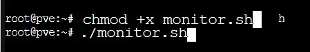
.. |image4| image:: ../media/image4.webp
   :width: 378px
.. |image6| image:: ../media/image6.webp
   :width: 405px
   :height: 104px
.. |image7| image:: ../media/image7.webp
   :width: 538px
   :height: 194px
.. |image8| image:: ../media/image8.webp
   :width: 544px
   :height: 170px
.. |image9| image:: ../media/image9.webp
   :width: 554px
   :height: 276px
.. |image10| image:: ../media/image10.webp
   :width: 636px
.. |image11| image:: ../media/image11.webp
   :width: 626px
.. |image12| image:: ../media/image12.webp
   :width: 557px
   :height: 269px
.. |image13| image:: ../media/image13.webp
   :width: 552px
   :height: 182px
.. |image14| image:: ../media/image14.webp
   :width: 592px
.. |image15| image:: ../media/image15.webp
   :width: 541px
   :height: 176px
.. |image16| image:: ../media/image16.webp
   :width: 547px
   :height: 266px
.. |image17| image:: ../media/image17.webp
   :width: 592px
   :height: 519px
.. |image18| image:: ../media/image18.webp
   :width: 563px
.. |image19| image:: ../media/image19.webp
   :width: 628px
.. |image20| image:: ../media/image20.webp
   :width: 581px
.. |image21| image:: ../media/image21.webp
   :width: 583px  
.. |image22| image:: ../media/image22.webp
   :width: 250px
.. |image23| image:: ../media/image23.webp
   :width: 540px  
.. |image24| image:: ../media/image24.webp
   :width: 485px  
.. |image25| image:: ../media/image25.webp
   :width: 257px  
.. |image27| image:: ../media/image27.webp
   :width: 557px  
.. |image28| image:: ../media/image28.webp
   :width: 391px  
.. |image29| image:: ../media/image29.webp
   :width: 463px  
.. |image30| image:: ../media/image30.webp
   :width: 562px  
.. |image31| image:: ../media/image31.webp
   :width: 206px  

.. |image34| image:: ../media/image34.webp
   :width: 403px  
.. |image35| image:: ../media/image35.webp
   :width: 585px  
.. |image37| image:: ../media/image37.webp
   :width: 548px  
.. |image38| image:: ../media/image38.webp
   :width: 399px  
.. |image39| image:: ../media/image39.webp
   :width: 470px 
.. |image40| image:: ../media/image40.webp
   :width: 478px 
.. |image41| image:: ../media/image41.webp
   :width: 520px 
.. |image42| image:: ../media/image42.webp
   :width: 520px 
.. |image43| image:: ../media/image43.webp
   :width: 618px 
.. |image44| image:: ../media/image44.webp
   :width: 605px 
.. |image45| image:: ../media/image45.webp
   :width: 353px 
.. |image46| image:: ../media/image46.webp
   :width: 605px 
.. |image47| image:: ../media/image47.webp
   :width: 432px 
.. |image48| image:: ../media/image48.webp
   :width: 644px
.. |image50| image:: ../media/image50.webp
   :width: 605px
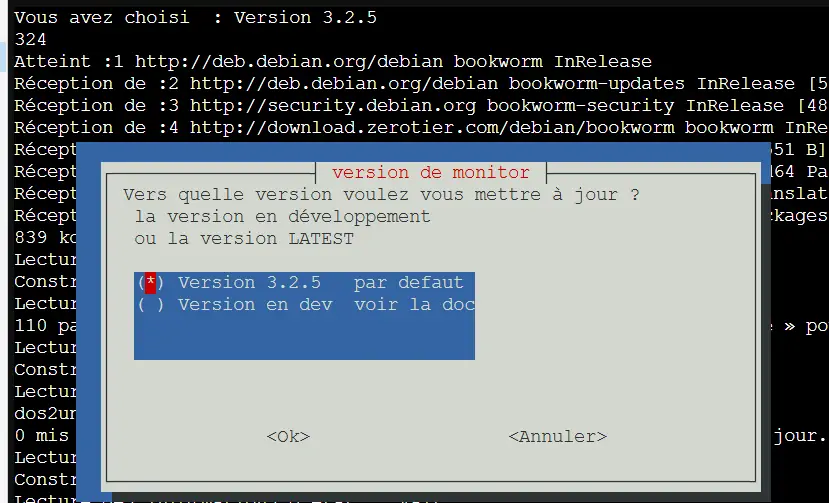
.. |image52| image:: ../media/image52.webp
   :width: 446px
.. |image53| image:: ../media/image53.webp
   :width: 605px
.. |image54| image:: ../media/image54.webp
   :width: 303px
.. |image55| image:: ../media/image55.webp
   :width: 562px
.. |image56| image:: ../media/image56.webp
   :width: 562px
.. |image57| image:: ../media/image57.webp
   :width: 531px
.. |image58| image:: ../media/image58.webp
   :width: 298px
.. |image59| image:: ../media/image59.webp
   :width: 414px
.. |image60| image:: ../media/image60.webp
   :width: 459px
.. |image64| image:: ../media/image64.webp
   :width: 485px
.. |image65| image:: ../media/image65.webp
   :width: 232px
.. |image66| image:: ../media/image66.webp
   :width: 257px
.. |image67| image:: ../media/image67.webp
   :width: 287px
.. |image68| image:: ../media/image68.webp
   :width: 393px
.. |image69| image:: ../media/image69.webp
   :width: 452px
.. |image70| image:: ../media/image70.webp
   :width: 650px
.. |image72| image:: ../media/image72.webp
   :width: 424px
.. |image75| image:: ../media/image75.webp
   :width: 216px
.. |image76| image:: ../media/image76.webp
   :width: 598px
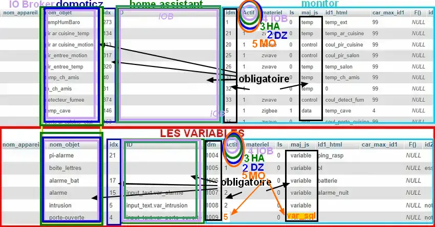
.. |image79| image:: ../media/image79.webp
   :width: 650px        
.. |image80| image:: ../media/image80.webp
   :width: 650px
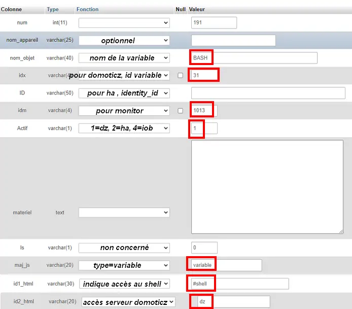
.. |image82| image:: ../media/image82.webp
   :width: 296px     
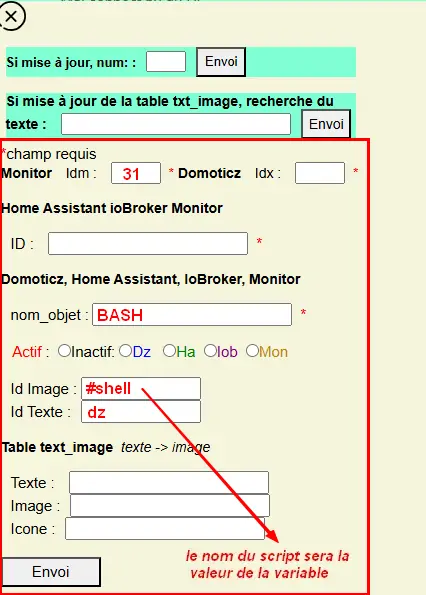
.. |image85| image:: ../media/image85.webp
   :width: 650px 
.. |image87| image:: ../media/image87.webp
   :width: 406px     
.. |image88| image:: ../media/image88.webp
   :width: 408px     
.. |image89| image:: ../media/image89.webp
   :width: 413px     
.. |image91| image:: ../media/image91.webp
   :width: 484px     
.. |image92| image:: ../media/image92.webp
   :width: 700px   
.. |image93| image:: ../media/image93.webp
   :width: 590px  
.. |image94| image:: ../media/image94.webp
   :width: 520px   
.. |image97| image:: ../media/image97.webp
   :width: 509px   
.. |image98| image:: ../media/image98.webp
   :width: 700px   
.. |image99| image:: ../media/image99.webp
   :width: 566px   
.. |image101| image:: ../media/image101.webp
   :width: 205px 
.. |image102| image:: ../media/image102.webp
   :width: 284px 
.. |image103| image:: ../media/image103.webp
   :width: 334px 
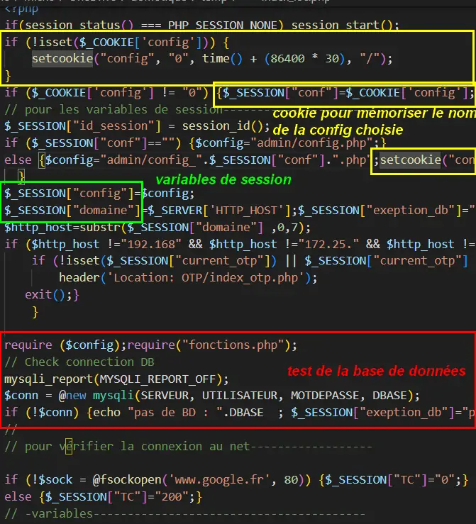
.. |image107| image:: ../media/image107.webp
   :width: 270px 
.. |image108| image:: ../media/image108.webp
   :width: 310px 
.. |image110| image:: ../media/image110.webp
   :width: 676px 
.. |image111| image:: ../media/image111.webp
   :width: 120px 
.. |image112| image:: ../media/image112.webp
   :width: 295px 
.. |image113| image:: ../media/image113.webp
   :width: 321px 
.. |image114| image:: ../media/image114.webp
   :width: 265px 
.. |image115| image:: ../media/image115.webp
   :width: 203px 

.. |image118| image:: ../media/image118.webp
   :width: 449px 
.. |image143| image:: ../media/image143.webp
   :width: 700px 
.. |image358| image:: ../media/image358.webp
   :width: 500px 
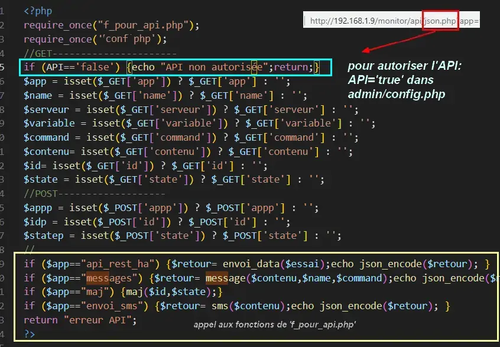

.. |image1111| image:: ../media/image1111.webp
   :width: 529px 
.. |image1179| image:: ../media/image1179.webp
   :width: 548px 
.. |image1180| image:: ../media/image1180.webp
   :width: 544px 
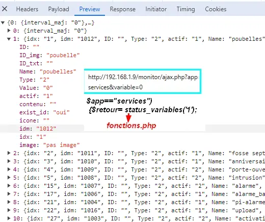
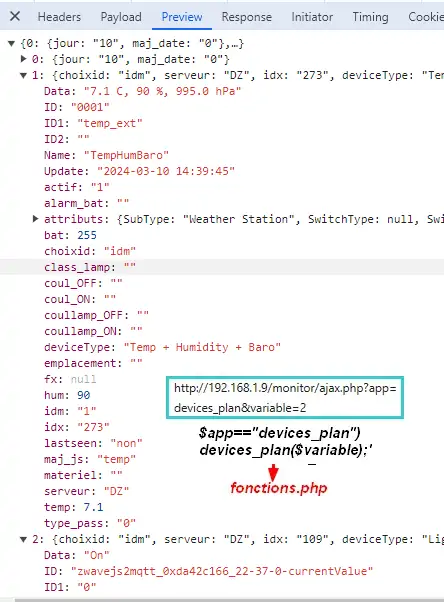
.. |image1218| image:: ../img/image1218.webp
   :width: 407px 
.. |image1219| image:: ../img/image1219.webp
   :width: 407px
.. |image1220| image:: ../img/image1220.webp
   :width: 407px 
.. |image1221| image:: ../img/image1221.webp
   :width: 407px 

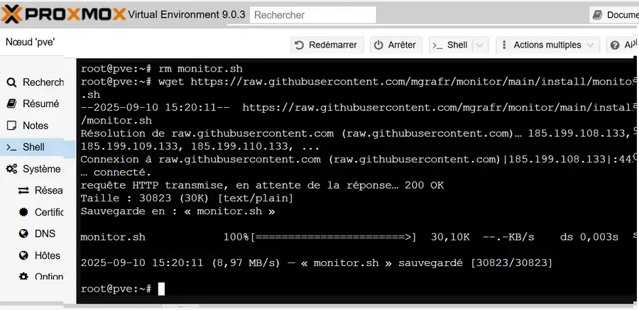

.. |image1270| image:: ../img/image1270.webp
   :width: 500px 
.. |image1271| image:: ../img/image1271.webp
   :width: 400px 
.. |image1272| image:: ../img/image1272.webp
   :width: 500px 
.. |image1273| image:: ../img/image1273.webp
   :width: 500px 
.. |image1274| image:: ../img/image1274.webp
   :width: 500px 
.. |image1275| image:: ../img/image1275.webp
   :width: 448px 
.. |image1276| image:: ../img/image1276.webp
   :width: 600px 
.. |image1303| image:: ../img/image1303.webp
   :width: 222px 

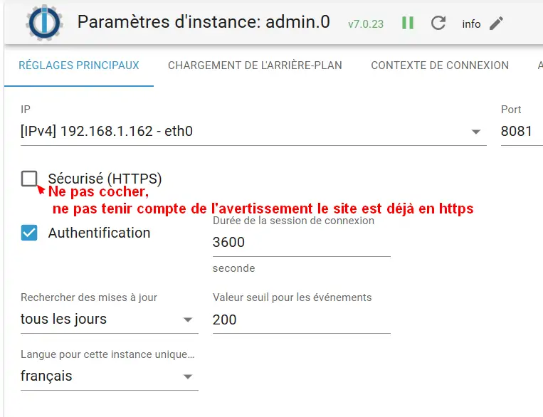
.. |image1327| image:: ../img/image1327.webp
   :width: 300px 
.. |image1329| image:: ../img/image1329.webp
   :width: 414px 
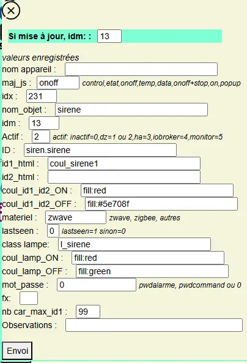
.. |image1348| image:: ../img/image1348.webp
   :width: 298px 

.. |image1364| image:: ../img/image1364.webp
   :width: 700px 

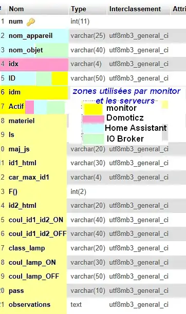
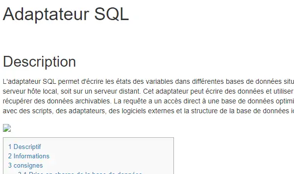
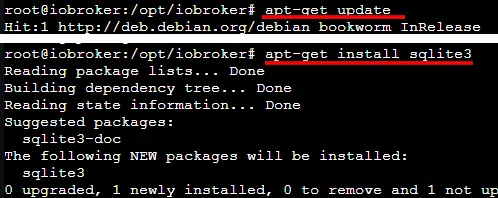

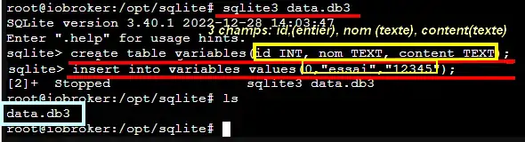

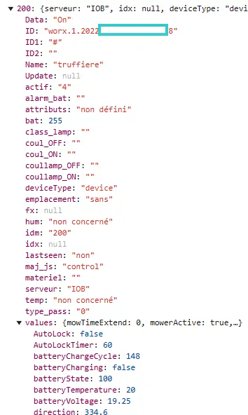
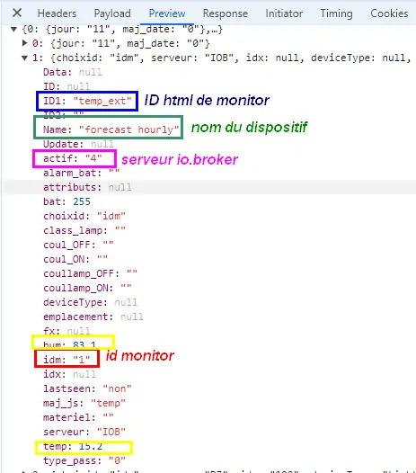
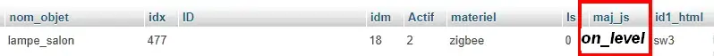

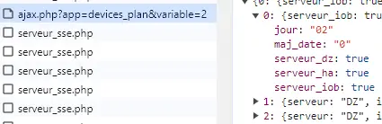

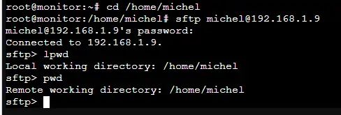

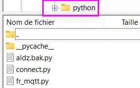

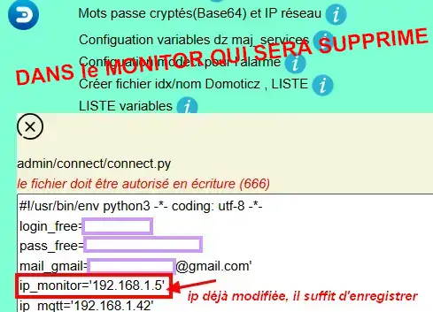

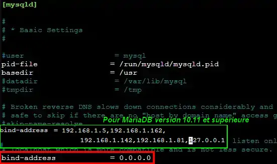
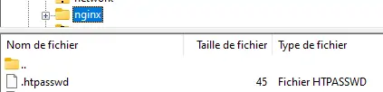
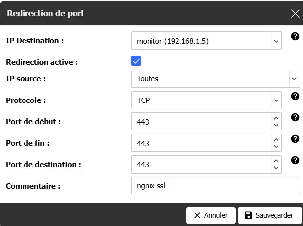

.. |image1562| image:: ../img/image1562.webp
   :width: 582px
.. |image1563| image:: ../img/image1563.webp
   :width: 483px

.. |image1658| image:: ../img/image1658.webp
   :width: 437px

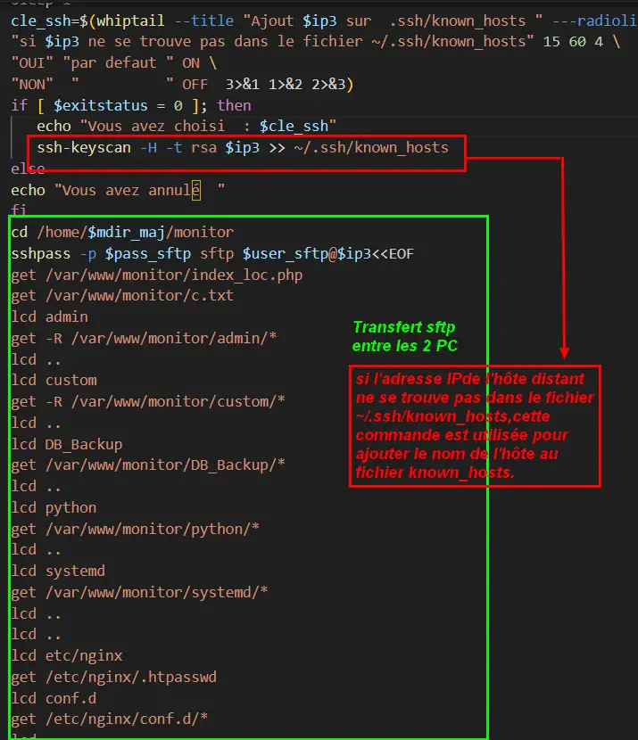

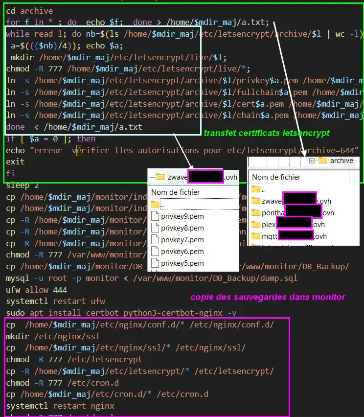
