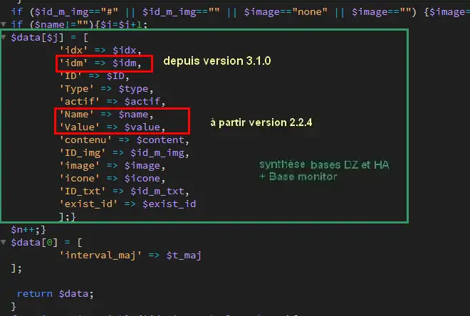

1. Configuration minimum : la page d’accueil
---------------------------------------------

Permet d’afficher 

-	La température extérieure, 

-	Le jour (changement à 0H pour une tablette connectée en permanence), 

- La sortie des poubelles,

-	 La gestion de la fosse septique,

-	La surveillance de la pression de la chaudière 

-	Les anniversaires 

-	Rappel pour la prise de médicaments

-	 La prévision de pluie à 1 heure de Météo France

-	L’arrivée du courrier

-	La mise en service de l’alarme de nuit

-	Le remplacement des piles pour les capteurs concernés

- .... 

|image117|
 
1.1	– Configuration :/admin.config.php
^^^^^^^^^^^^^^^^^^^^^^^^^^^^^^^^^^^^^^^^^^
 :red:`Il faut fournir un minimum de renseignements` :

1.1.1 -Adresse IP , domaine, favicon de monitor 
=============================================== 
.. code-block:: 'fr'

   //general monitor
   -->define('URLMONITOR', '');//domaine (pour accès distant) et port si différent de 443 
   -->define('IPMONITOR', '192.168.1.9');//ip
   define('PASSMONITOR', '*******');//mot passe serveur et SSH2
   define('USERMONITOR', 'michel');//user serveur et SSH2 ;le répertoire perso sera /home/nom de USERMONITOR
   define('MONCONFIG', 'admin/config.php');//fichier config 
   define('DZCONFIG', 'admin/dz/temp.lua');//fichier temp 
   -->define('FAVICON', '/favicon.ico');//fichier favicon  , icone du domaine dans barre url
   define('DISPOSITIFS', 'dispositifs');

.. note::
  :red:`define('DISPOSITIFS', 'dispositifs');`
   Pour faciliter la réinitialisation des dispositifs dans Domoticz ou un transfert (ex, zwavejs2mqtt , zigbee2mqtt sous docker) ; 

   en créant une copie de la table dispositifs (« dispositifs » par défaut), il est 
   possible de préparer le transfert ; ici la table dispositifs a été renommée Dispositifs

   |image120|

   |image121|
 
 
1.1.1.a Pour l’image de fond suivant la résolution d’écran et le logo
"""""""""""""""""""""""""""""""""""""""""""""""""""""""""""""""""""""
.. code-block:: 'fr'

   // Monitor 
   define('IMAGEACCUEIL', 'images/maison.webp');//image page accueil pour écrans >534 px
   define('IMAGEACCUEILSMALL', 'images/maison_small.webp');//image page accueil pour écrans <535 px
   define('IMGLOGO', 'images/logo.png');//image logo

1.1.1.b Pour les titres, slogans et lexique
"""""""""""""""""""""""""""""""""""""""""""
Pour le lexique :

-	true = lexique par défaut
-	false = lexique à modifier /include/lexique_no.php

.. code-block:: 'fr'

   define('NOMSITE', 'Domoticz');//nom principal du site
   define('NOMSLOGAN', xxxxxxxxxxx);//nom secondaire ou slogan
   // affichage lexique
   define('LEXIQUE', true);

1.1.2 intervalles de maj, maj temps réel
========================================
L’intervalle de mise à jour pour les services (poubelles, anniversaires,...) : il est de ½ heure (1800000 milli secondes), il peut être changé
 
.. code-block:: 'fr'
   // interval de maj des fonctions JS maj_services() & maj_devices()
   define('TEMPSMAJSERVICES', 1800000);//interval maj services en milli secondes
   define('TEMPSMAJSERVICESAL', 180000);//interval maj services ALARME ABSENCE(si installée) en milli secondes
   define('TEMPO_DEVICES', 180000);// en milli secondes
   define('TEMPO_DEVICES_DZ', 30000);// en milli secondes (>= 15s) maj déclenchée par Dz voir doc

.. note::
   *TEMPO_DEVICES* pour tous les dispositifs 

   *TEMPO_DEVICES_DZ* : pour les dispositifs qui mettent à 1 une variable pour indiquer à monitor d’effectuer une mise à jour, ici toutes les 30 secondes rafraichissement des dispositifs si par exemple un PIR, un 
   contact de porte qui sont déclaré prioritaire dans DZ passent à ON 

   |image126|

La fonction JS :

.. code-block:: 'fr'

   tempo_devices=<?php echo TEMPO_DEVICES_DZ;?>;
   var idsp=1;if (tempo_devices>14999)	var_sp(idsp);
   function var_sp(idsp){
     $.get( "ajax.php?app=data_var&variable=29", function(datas) {
     var variable_sp = datas;
     if (variable_sp>0){maj_devices(plan);maj_services(0);maj_variable(29,"variable_sp",0,2);}
    });
   setTimeout(var_sp, tempo_devices, idsp); 	
   }
 
La fonction PHP qui récupère la valeur de la variable :

.. code-block:: 'fr'

   // valeur d'une variable
   function val_variable($variable){
   $result=array();	
   $L=URLDOMOTIC."json.htm?type=command&param=getuservariable&idx=".$variable;
   $json_string = file_get_curl($L);
   $result = json_decode($json_string, true);
   $lect_var = $result['result'][0];
   $value = $lect_var['Value'];	
   return 	$value;
   }

1.1.3 Autres données
====================
Choisir Idx de Domoticz ou idm de monitor ? 

.. note::
   Pour une première installation avec Domoticz, choisir idx ; pour une réinstallation de Domoticz, il sera alors préférable de choisir idm pour éviter de renommer tous les dispositifs dans les images svg

   Pour une installation avec HA , idm , il n'existe pas d' Idx, choisir idm et laisser vide 'NUMPLAN'. 

*La création d’un plan qui regroupe les dispositifs sur Domoticz est nécessaire : noter le N° du plan (NUMPLAN)*

.. code-block:: 'fr'

   // choix ID pour l'affichage des infos des dispositifs
   // idx : idx de Domoticz    (dans ce cas ,
   //     en cas de problème il faudra renommer tous les dispositifs 
   //     dans monitor au lieu de la DB)
   define('CHOIXID','idm');// DZ:idm ou idx ; HA : idm uniquement
   define('NUMPLAN','2');//DZ uniquement: n° du plan regroupant tous les capteurs
 
Paramètres de la base de données :
 
.. code-block:: 'fr'

   // parametres serveur DBMaria
   define('SERVEUR','localhost');
   define('MOTDEPASSE','<MOT PASSE>');
   define('UTILISATEUR','michel');
   define('DBASE','monitor');

Paramètres pour Domoticz ou HA :
 
.. code-block:: 'fr'

   //seveurs domotiques Domoticz ou HA
   define('IPDOMOTIC', '192.168.1.76');//ip
   //pour ssh2
   define('USERDOMOTIC', 'michel');//user du serveur,répertoire :home/user
   define('PWDDOMOTIC', '');//mot passe serveur
   define('URLDOMOTIC', 'http://192.168.1.76:8086/');//url
   define('DOMDOMOTIC', 'https://*************');//domaine
   define('TOKENDOMOTIC', '');//TOKEN ou BEARER
   define('IPDOMOTIC1', '');//ip 2emme serveur Domotique
   define('USERDOMOTIC1', 'michel');//user du serveur,répertoire :home/user
   define('PWDDOMOTIC1', '');//mot passe serveur
   define('URLDOMOTIC1', 'http://192.168.1.5:8123/');//url ex:http://192.168.1.5:8123/
   define('DOMDOMOTIC1', 'https://***********');//domaine
   define('TOKEN_DOMOTIC1',"eyJhb*****************************************************************2k");   
   //______________Pour Domoticz
   define('VARTAB', URLDOMOTIC.'modules_lua/string_tableaux.lua');//
   define('BASE64', URLDOMOTIC.'modules_lua/connect.lua');//login et password en Base64
   define('CONF_MODECT', URLDOMOTIC.'modules_lua/string_modect.lua');

.. warning::
  les variables ci-dessus , VARTAB, BASE64, CONF_MODECT sont à déclarer ici que si elles sont utilisées dans un fichier

Le programme démarre avec 11 pages :

-	Accueil

-	Plan intérieur

-	Page d’administration, pour afficher cette page, le mot de passe est obligatoire : par défaut :red:'« admin »'.
  
 il est toujours possible de modifier le fichier de configuration avec un éditeur

-	Les autres pages concernent l’alarme, un mur de caméras, ... 

1.2	- Les fichiers PHP, les styles, le javascript
^^^^^^^^^^^^^^^^^^^^^^^^^^^^^^^^^^^^^^^^^^^^^^^^^^^^^
1.2.1 - à la racine du site :
=============================
 voir ce paragraphe : :ref:`0.4 Le serveur http de NGINX :`

**Complément d'informations concernant "fonctions.php":**

voir le fichier à jour sur Github : https://raw.githubusercontent.com/mgrafr/monitor/main/fonctions.php

Principales fonctions contenues dans ce fichier :

.. admonition:: **function file_http_curl**

   |image134|

.. admonition:: **function status_variables**

   Pour récupérer les valeurs des variables de Domoticz et HA

   |image135|

   |image136|

.. admonition:: **fonctions maj_variable et sql_variable** 

   |image138|

.. admonition:: **function devices_zone** 

   API HA pour récupérer les valeurs des dispositifs

   |image137|

.. admonition:: **function devices_plan** 

   API Domoticz pour les devices :

   |image139|

   |image140|

   **Maj de la date** : si la tablette reste allumée en permanence,la date ne sera pas mise à jour en absence de rafraichissement
   
   On crée un idx=0 qui n'existe pas , aussi avec cet idx la maj sera forcée (voir la fonction maj_devices(plan) dans footer.php) 

   .. code-block:: 'fr'

      $data[0] = ['jour' => date('d'),
                  'idx' => '0'];

   **Maj éta des piles des dispositifs**

   .. code-block:: 'fr'

      $abat="0";
      if ($al_bat==0) $abat="batterie_forte";
      if ($al_bat==1) $abat="batterie_moyenne";
      if ($al_bat==2) $abat="batterie_faible";
      $val_albat=val_variable(PILES[0]);
      if ($abat != $val_albat) maj_variable(PILES[0],PILES[1],$abat,2);

1.2.2 - les styles css
======================
|image141|

https://raw.githubusercontent.com/mgrafr/monitor/main/css/mes_css.css
https://raw.githubusercontent.com/mgrafr/monitor/main/css/jquery-ui.css
		
Fichier mes_css.css , extrait :

.. code-block:: 'fr'

   /*interieur*/
   #linky{position: relative;top: -250px;left: 600px;width: 60px;}
   #th_ext_cuis{position: relative;top: -747px; left: 170px; width: 50px;}
   #temp_ext_cuisine{font-size: 8px; color: black;}
   #voltage{position: absolute;top: -30px;right: -20px;width: 200px;}
   .meteo_concept_am  {display: inline;width: 150px;margin-left: -20px;}
   #meteo_concept_am{position: relative;top: 20px;margin-left: -20px;}
   #meteo_concept{position: relative;top: 10px;}
   .image_met{width:80px;margin-left: -15px;}
   .icone_vent{width: 40px;margin-left: 0;margin-top: -20px;}
   .vvent{font-family: Arial;font-size: 15px;margin-left: 0;
   /* MediaQueries
   /* Large devices (Large desktops 768px and up) */
   @media (min-width:768px) {img#cam1,img#cam2,img#cam3,img#cam4,img#cam5,img#cam6,img#cam7,img#cam8,img#cam9{width: 450px;}
	   .modal-lg {width: 740px;}.cam {margin-left: 100px;}.fond_date {right: -270px;}body {max-width: 768px;margin: 0 auto;background-color: #79afbf;}
    .menu-link {left: 50%;top: 50px;}#bar_pression{top: -750px;left: 450px;}.txt_ext{left:100px;}.modal {left: -100px;}
	   .modal_param {left: 200px;	}.modal-dialog {width:740px;} }

1.2.3 – Le javascript
=====================
	1.2.3 a - Les fichiers footer.php , voir ce script :ref:`1.3.5 les scripts JavaScript`

	1.2.3 b - le fichier mes_js.js : scripts principaux , 

	fichier complet : https://raw.githubusercontent.com/mgrafr/monitor/main/js/mes_js.js

.. admonition:: **virtual keypad** 

   .. code-block:: 'fr'

      /*Minimal Virtual Keypad
      $(document).ready(function () {
     const input_value = $("#password");
     var pwd,nameid;
     //disable input from typing
     $("#password").keypress(function () {
      return false;
     });
     .......

.. admonition:: **fenêtre modale modallink**

   |image145|

1.3 Les fichiers principaux dans /include
^^^^^^^^^^^^^^^^^^^^^^^^^^^^^^^^^^^^^^^^^
1.3.1 entete_html.php 
=====================
https://raw.githubusercontent.com/mgrafr/monitor/main/include/entete_html.php

.. code-block:: 'fr'

   <!DOCTYPE html>
   <html lang="fr">
	<head>
		<meta charset="utf-8">
		<title>monitor-domoticz | by michel Gravier</title>
		<meta name="description" content="Domotique">
		<!-- Mobile Meta -->
		<meta name="viewport" content="width=device-width, initial-scale=1.0">
		<!-- Favicon  racine du site -->
		<link rel="shortcut icon" href="<?php if (substr($_SERVER['HTTP_HOST'], 0, 7)=="192.168") echo '/monitor'.FAVICON;else echo FAVICON; ?>">
		<!-- mes css  dossier css -->
		<link href="bootstrap/css/bootstrap.css?2" rel="stylesheet">
		<link href="bootstrap/bootstrap-switch-button.css" rel="stylesheet">
		<link href="css/mes_css.css?8" rel="stylesheet">
		
		<!-- icones  racine du site -->
		<link rel="apple-touch-icon" href="iphone-icon.png"/>
		<link rel="icon" sizes="196x196" href="logo_t.png">
		<link rel="icon" sizes="192x192" href="logo192.png">
	</head>
   <?php 

*Le HTML du navigateur* :

|image147|

1.3.2 Test de la base de données, test_db.php 
=============================================
https://raw.githubusercontent.com/mgrafr/monitor/main/include/test_db.php

.. code-block:: 'fr'

   <?php
   echo '<textarea id="adm1" style="height:'.$height.'px;" name="command" >';
   echo "test....BD: ";
   // Create connection
   $con = new mysqli(SERVEUR, UTILISATEUR, MOTDEPASSE);
   // Check connection
   if ($con->connect_error) {   die("Pas de connexion au serveur: " . $con->connect_error);$_SESSION["exeption_db"]="pas de connexion à la BD";}
   else echo " connection au serveur OK , ..";
   $conn = new mysqli(SERVEUR, UTILISATEUR, MOTDEPASSE, DBASE);
   if ($conn->connect_error) { die("Verifier le nom de la BD: " . $conn->connect_error);$_SESSION["exeption_db"]="pas de connexion à la BD";}
   echo " connection à la BD OK , ..";$_SESSION["exeption_db"]="";
   echo "connexion terminée , ..";
  ?>
  

1.3.3 le menu, header.php  
=========================
les pages configurées avec config.php sont ajoutées automatiquement au menu

https://raw.githubusercontent.com/mgrafr/monitor/main/include/header.php

Extrait: 

.. code-block:: 'fr'

   <ul class="nav navbar-nav navbar-right" style="color: #adafb1;">
	<li class="zz active"><a href="#header">Accueil</a></li> 
	<?php if (ON_MET==true) echo '<li class="zz"><a href="#meteo">Météo</a></li>';?>
	<li class="zz"><a href="#interieur">Intérieur</a></li>
	<?php if (ON_EXT==true) echo '<li class="zz"><a href="#exterieur">Extérieur</a></li>';?>
	<?php if (ON_ALARM==true) echo '<li class="zz"><a href="#alarmes">Alarmes</a></li>';?>
	<?php if (ON_GRAPH==true) echo '<li class="zz"><a href="#graphiques">Graphiques</a></li>';?>
	<?php if (ON_ONOFF==true) echo '<li class="zz"><a href="#murinter">Mur On/Off</a></li>';?>
	<?php if (ON_ZIGBEE==true) echo '<li class="zz"><a href="#zigbee">Zigbee2mqtt</a></li>';?>
	<?php if (ON_ZWAVE==true) echo '<li class="zz"><a href="#zwave">Zwavejs2mqtt</a></li>';?>
	...

Pour modifier la largeur, Du menu :

|image150|

|image151|

1.3.4   la page d’accueil avec les notifications , accueil.php 
==============================================================
https://raw.githubusercontent.com/mgrafr/monitor/main/include/accueil.php

Le HTML:
 
|image152|
 
|image153|

.. code-block:: 'fr'

   <!--accueil start -->
	<!-- image de la page d'accueuil déclarée dans admin/config.php -->
	

	  

	    

		

		   

			

			<h2 class="text-centre">Température Extérieure</h2>
			
En ce moment , il fait :

			
T° ressentie :

			

1.3.5 les scripts JavaScript
============================
dans la page footer.php : https://raw.githubusercontent.com/mgrafr/monitor/main/include/footer.php

Extrait:

.. code-block:: 'fr'

   <?php
   require("fonctions.php");
   ?>	
   <!-- footer start -->
	<footer id="footer">
	

	

	

</footer>
   <!-- footer end -->
   <!-- JavaScript files placées à la fin du document-->	
   
   
   

1.3.5.1 rafraîchissements de la page
""""""""""""""""""""""""""""""""""""
La fonction pour le rafraichissement des données : à partir d’un changement d’état d’un dispositif dans Domoticz, 
une variable est mise à « 1 » ; 

monitor qui scrute en permanence cette valeur importe les données de tous les dispositifs si cette variable est à 1.

|image155|

Dans les scripts lua :

|image156|

la variable:

|image158|

1.3.5.2 Quelques infos supplémentaires
""""""""""""""""""""""""""""""""""""""
substring(0, 32) : affichage tronqué ID ZWAVE très long

|image159|

substring(0, 11)=="Set Level

|image160|

- La fonction **maj_services** récupère les valeurs de toutes les variables.

- La fonction **maj_variable** modifie la valeur d’une variable.

- La fonction **maj_devices(plan)** récupère les données des dispositifs 

 Un exemple avec set ou get Attribute

|image161|

  Voir le paragraphe concernant les volets :ref:`8.2.4 Exemple volet roulant`

- La fonction **switchOnOff_setpoint()** exécute des commandes

.. note::
   La ligne en PHP « <?php if ($_SESSION["exeption_db"]!="pas de connexion à la BD") {sql_plan(0);}?> » crée pour chaque dispositif on/off le script correspondant à partir de la BD

|image162|

Le HTML :

|image163|

- la fonction **maj_sevices()**

  Copie d’écran le jour de l’entretien de la fosse septique

|image164|

|image165|

- la fonction **Maj_devices(plan)**: pour l’installation minimale, ne concerne que la maj de la température extérieure et de la date ; 

  lorsqu’une tablette reste connectée en permanence, donc sans rafraichissement , la date affichée doit être rafraichie.

  Une solution pour la maj de la date : un script qui tourne en permanence sur la tablette : je n’ai pas retenu cette solution car un script dans Domoticz gère très bien la gestion du temps.  :ref:`Maj de la date>`

.. admonition:: **solution JS sur la tablette**

   .. code-block:: 'fr'

      fonction date_heure(id){
      date = new Date;
      annee = date.getFullYear();
      moi = date.getMonth();
      mois = new Array('Janvier', 'F&eacute;vrier', 'Mars', 'Avril', 'Mai', 'Juin', 'Juillet', 'Ao&ucirc;t', 'Septembre', 'Octobre', 'Novembre', 'D&eacute;cembre');
      j = date.getDate();
      jour = date.getDay();
      jours = new Array('Dimanche', 'Lundi', 'Mardi', 'Mercredi', 'Jeudi', 'Vendredi', 'Samedi');
      h = date.getHours();
      if(h<10){h = "0"+h;}
      m = date.getMinutes();
      if(m<10){m = "0"+m;}
      s = date.getSeconds();
      if(s<10){s = "0"+s;}
      resultat = 'Nous sommes le '+jours[jour]+' '+j+' '+mois[moi]+' '+annee+' il est '+h+':'+m+':'+s;
      document.getElementById(id).innerHTML = resultat;
      setTimeout('date_heure("'+id+'");','1000');
      return true;}

|image166|

.. note::
   Pour que les icones sur la page d’accueil soient affichées, il faut enregistrer les variables dans la base de Données Maria DB,

   - soit avec monitor-->**Administration-->Enregistrer Variable (DZ ou HA) dans SQL**
   - soit avec PHPMyAdmin

- La table **dispositifs**

|image167|

- La table d’équivalence texte ->images : **text_image**

|image168|

|image169|

.. note::
   Pour les Anniversaires, il faut entrer chaque prénom ou nom dans la base de données, ces noms correspondent à ceux du script LUA décrit ci-après :

   |image170|

   |image171|

   L’image peut être personnalisée pour chaque nom

*Sur la page d’accueil, il est possible d’ajouter d’autres icones, il suffit d’ajouter un ID dans accueil.php et de renseigner la base de données*
   
|image172|

1.4 Le lexique et la température extérieure
^^^^^^^^^^^^^^^^^^^^^^^^^^^^^^^^^^^^^^^^^^^
1.4.1 Le lexique
================
L’image est inline dans header.php

La fenêtre modale dans include/lexique .php ou include/lexique_no.php (le fichier est choisi par la configuration) :

.. code-block:: 'fr'

   // affichage lexique

   define('LEXIQUE', true);

|image174|

- Lexique.php

|image175|

- Lexique_no.php

|image176|

.. warning::
   Pour ne pas utiliser de lexique et donc de supprimer l’icône :|image177|

   - Supprimer le script ou le ou mettre en commentaire : :red:`<!--`  

 
1.4.2 La température extérieure (valable pour d’autres dispositifs)
===================================================================

|image179|

Le fichier Json reçu par monitor après une demande de la fonction devices(plan):

|image180|

1.5 liens avec Domoticz ou Home Assistant
^^^^^^^^^^^^^^^^^^^^^^^^^^^^^^^^^^^^^^^^^
1.5.1 Liens avec Domoticz
=========================

|image183|

Le script **maj_services.lua** concerne :

- les poubelles
- la fosse septique
- les anniversaires
- la gestion des piles des dispositifs
- ….et plus encore

Affichage des évènements :
-	sur monitor, 

-	sur la TV

-	notifications SMS

-	envoi e_mail

lien Github: https://raw.githubusercontent.com/mgrafr/monitor/main/share/scripts_dz/lua/maj_services.lua

le script met à jour, suivant l’horaire et la date, des variables Domoticz ; quand javascript 
demande une mise à jour, il appelle, par l’intermédiaire d’un fichier ajax.php, une fonction 
PHP (status_variables), qui récupère toutes les infos (API Domoticz) et renvoi un fichier Json

*Variables Domoticz* :

   - :darkblue:`variables not_tv_* : pour le script notifications_tv.lua`

|image181|

fichier Json* :

|image182|

.. admonition:: **REMARQUE**

   :darkblue:`D’une année à l’autre, certains jours de ramassage des poubelles peuvent être modifiés` :

   Pour en tenir compte dans Domoticz, il est possible de mettre les variables (string et tableau dans un fichier, voir ci-après: 

1.5.1.1 les variables lua de configuration dans un fichier externe
""""""""""""""""""""""""""""""""""""""""""""""""""""""""""""""""""
Les jours de ramassage des poubelles peuvent changer, le nombre d’anniversaires augmenter, toutes les variables correspondantes à ces valeurs peuvent être insérées dans un fichier appelé dans le script lua ; pour les anniversaires on utilise un tableau multidimensionnel, plus facile à compléter que 2 tableaux, si les données sont importantes.

.. note::
   ce fichier peut alors être modifié dans monitor sans intervenir dans Domoticz, voir le paragraphe concernant l’administration  :ref:`14. ADMINISTRATION`

   Dans ce cas il faut que le fichier soit accessible en http, il faut donc créer un répertoire « modules_lua »   dans « :darkblue:`/home/USER/domoticz/www` »

   Exemple le fichier :darkblue:`/home/USER/domoticz/www/modules_lua/string_tableaux.lua`, affiché dans monitor

   |image186|

Pour une maj depuis monitor, on utilise une variable de Domoticz, ainsi c'est Domoticz qui télécharge le fichier modifié.

|image187|

Il est ausi possible d'utiliser SSH2 pour modifier à distance le fichier; ce n'est pas l'option retenue ici.

voir le paragraphe :ref:`14.7 Explications concernant l’importation distantes d’un tableau LUA`

.. admonition:: **Façon de procéder**

   On place le fichier (ici : string_tableaux.lua)  dans ce répertoire

   |image188|

   Dans le script LUA, pour les jours de poubelles, les anniversaires, on appelle ce fichier, en ayant indiqué le chemin :

   .. code-block:: 'fr'

      -- chargement fichier contenant les variables de configuration
      package.path..";/home/USER/domoticz/www/modules_lua/?.lua"
      require 'string_tableaux'

      -- exclusion ou ajout dates poubelles ,
          for k,v in pairs(e_poubelles) do 
            if (jour_mois==k) then 
                if (v == "g") then jour_poubelle_grise = "";  
		elseif (v == "j") then jour_poubelle_jaune = "";
		end
            end    
         end
	for k,v in pairs(a_poubelles) do 
      if (jour_mois==k) then print(k)
		if (v == "g") then jour_poubelle_grise = day;
		elseif (v == "j") then jour_poubelle_jaune = day;
		end
	  end    
    end 

    -- anniversaires ,
    if (time == "01:30")  then
      local jour_mois = jour.."-"..mois
      for k,v in pairs(anniversaires) do 
         if (jour_mois==k) then  commandArray['Variable:anniversaires'] = v;
         print(v)  
         end
      end
    end

1.5.1.2 les scripts de notifications gérées par Domoticz
""""""""""""""""""""""""""""""""""""""""""""""""""""""""
Alarmes SMS ou Mail , 

- le script LUA pour les variables : ‘:darkblue:`notifications_variables`’ 

https://raw.githubusercontent.com/mgrafr/monitor/main/scripts_dz/lua/notification_variables.lua

Extrait:

.. code-block:: 'fr'

   return {
	on = {
		variables = {
			'alarme_bat',
		    'boite_lettres',
		    'upload',
		    'zm_cam',
		    'pression-chaudiere',
		    'porte-ouverte',
		    'intrusion',
		    'variable_sp',
		    'pilule_tension',
		    'BASH'
		}
	},
	execute = function(domoticz, variable)

- le script LUA pour les dispositifs : ‘:darkblue:`notifications_devices`’ 

https://raw.githubusercontent.com/mgrafr/monitor/main/scripts_dz/lua/notification_devices.lua

|image194|

.. _scriptluatimer:

   - le script LUA pour les notifications concernant le temps: ‘:darkblue:`notification-timer.lua`,

|image195|

1.5.2 Liens avec Home Assistant
===============================
1.5.2.1  Exemple d’un ON OFF sur un interrupteur virtuel 
""""""""""""""""""""""""""""""""""""""""""""""""""""""""

|image196|

|image197|

|image198|

Réponse de l’API sur l’état :

|image199|

|image200|

|image201|

La fonction PHP

|image202|

Comme pour Domoticz une commande dans monitor appelle l’api qui exécute la commande.

Dans footer.php : départ de la commande avec le script créé automatiquement depuis la base de données:

|image203|

- la fonction :darkblue:`turnonoff()`

.. code-block:: 'fr'

   function turnonoff(idm,idx,command,pass="0"){console.log(idm);
	if (pp[idm].Data == "On" || pp[idm].Data == "on") {command="off";}
	else {command="on";}
	$.ajax({ //commande ON/OFF
    	type: "GET",
    	dataType: "json",
    	url: "ajax.php",
    	data: "app=turn&device="+idx+"&command="+command+"&name="+pass,
    	success: function(response){qq=response;
	   if (qq.resultat != "OK" ){alert("erreur");}
	   else { 
           $.ajax({ // commande STATE
    	   type: "GET",
    	   dataType: "json",
    	   url: "ajax.php",
    	   data: "app=turn&device="+idx+"&command=etat&name="+pass,
    	   success: function(response){qq=response;
		}});}
           }   });
	var level="";command=qq.state;										 
	maj_switch(idx,command,level,idm);
	}

commande concernée dans ajax.php:

.. code-block:: 'fr'

   if ($app=="turn") {$retour=devices_id($device,$command);echo $retour; }

La fonction PHP ":darkblue:`device_id`" ci-dessus retourne pour les capteurs binaires :

|image206|

En plus clair :

|image207|

.. note::

Pour les interrupteurs réels : l’API retourne un tableau vide , d’où un appel de l’API/states pour avoir une confirmation du changement d’état.

Pour faire des essais à partir d’un navigateur :

|image208|

1.6 – Lien avec la base de données SQL
^^^^^^^^^^^^^^^^^^^^^^^^^^^^^^^^^^^^^^
1.6.1- exemple avec la date de ramassage des poubelles
======================================================
En Dordogne, les poubelles jaunes sont ramassées toutes les 2 semaines mais les poubelles grises sont ramassées selon une procédure différente :

- Le contrat annuel comprend 12 ramassages mais le ramassage est possible chaque semaine,

il faut donc gérer au mieux le nombre de ramassages pour éviter des facturations supplémentaires.

c’est le script décrit ici qui enregistre les dates des ramassages réels effectués.

*Il faut au préalable ajouter une table dans la base de données*

.. code-block:: 'fr'

   -- Structure de la table `date_poub`
   --
   CREATE TABLE `date_poub` (
  `num` int(11) NOT NULL,
  `date` text NOT NULL,
  `valeur` text NOT NULL,
  `icone` text NOT NULL
   ) ENGINE=InnoDB DEFAULT CHARSET=utf8;

- Les 2 icones svg : |image209|

- La table

|image210|

- La page d’accueil :

|image211|

un script est ajouté dans footer.php

Idx_idimg existe déjà dans footer.php , sa valeur est « poubelle_grise » ou « poubelle_jaune » suivant les valeurs choisies dans le script LUA de Domoticz ; 

on va **ajouter une variable pour l’icône dans les données json**

.. code-block:: 'fr'
   $("#poubelle").click(function () {
   var date_poub=new Date();
   var jour_poub=date_poub.getDate();
   var an_poub=date_poub.getFullYear();
   var months=new Array('Janvier','Février','Mars','Avril','Mai','Juin','Juillet','Aout','Septembre','Octobre','Novembre','Décembre');
   var mois_poub=months[date_poub.getMonth()];
   var date_poub=jour_poub+' '+mois_poub+" "+an_poub;
            $.ajax({
             url: "ajax.php",
             data: "app=sql&idx=0&variable=date_poub&type="+idx_idimg+"&command="+
			 date_poub+"&name="+idx_ico,
            }).done(function() {
             alert('date ramassage enregigistrée:'  +date_poub);
            });
        });

|image212|

Dans ajax.php

.. code-block:: 'fr'

  if ($app=="sql") {$retour=sql_app($idx,$variable,$type,$command,$name);echo $retour;}//$choix,$table,$valeur,$date,$icone

Dans fonctions.php , la fonction :darkblue:`sql_app`

.. code-block:: 'fr'

   function sql_app($choix,$table,$valeur,$date,$icone=''){
   // SERVEUR SQL connexion
   $conn = new mysqli(SERVEUR,UTILISATEUR,MOTDEPASSE,DBASE);
   if ($choix==0) {// Pour insertion des données
   $sql="INSERT INTO ".$table." (`num`, `date`, `valeur`, `valeur`) VALUES (NULL, '".$date."', '".$valeur."', '".$icone."');";	
   $result = $conn->query($sql);;}
   if ($choix==1) { // Pour lecture des données
   $sql="SELECT * FROM ".$table." ORDER BY num DESC LIMIT 24";
   $result = $conn->query($sql);
   $number = $result->num_rows;
   while($row = $result->fetch_array(MYSQLI_ASSOC)){
    echo $row['date'].'  '.$row['valeur'].'  ';}
   }
   $conn->close();
   return;}

Et pour ajouter l’icône au fichier json concernant les variables :

.. code-block:: 'fr'

   function status_variables($xx){
   $p=0;$n=0;	
   if(IPDOMOTIC != ""){
   $L=URLDOMOTIC."json.htm?type=command&param=getuservariables";
   $json_string = file_get_curl($L);
   $resultat = json_decode($json_string, true);
   ...
   ...
   $data[$n+1] = [	
		'idx' => $idx,
		'ID' => $ID,
		'Type' => $type,
		'Name' => $name,
		'Value' => $value,
		'ID_img' => $id_m_img,
		'image' => $image,
	--->	'icone' => $icone,
		'ID_txt' => $id_m_txt,
		'exist_id' => $exist_id
		];}

Le fichier Json reçu par monitor :

|image216|

Les enregistrements sont sauvegardés, 

pour afficher l’historique des dates, voir le paragraphe  :ref:`12.1.1 Edition de l’historique du ramassage des poubelles`  

|image218|

1.7 – Ajuster le menu au nombre de pages
^^^^^^^^^^^^^^^^^^^^^^^^^^^^^^^^^^^^^^^^
Au-delà de 12 pages il faut étendre en largeur le menu ; il faut aussi le descendre de 50 px 
pour ne pas cacher le menu hamburger

|image219|

*Modification à apporter au fichier : /js/big-Slide.js :*

|image220|

Pour descendre le menu : modifier la class .nav dans css/mes_css.css

|image221|

.. |image117| image:: ../media/image117.webp
   :width: 531px 
.. |image120| image:: ../media/image120.webp
   :width: 357px 
.. |image121| image:: ../media/image121.webp
   :width: 239px 
.. |image126| image:: ../media/image126.webp
   :width: 604px 
.. |image134| image:: ../media/image134.webp
   :width: 544px 
.. |image135| image:: ../media/image135.webp
   :width: 605px    

.. |image137| image:: ../media/image137.webp
   :width: 650px  
.. |image138| image:: ../media/image138.webp
   :width: 650px  
.. |image139| image:: ../media/image139.webp
   :width: 605px  
.. |image140| image:: ../media/image140.webp
   :width: 650px  
.. |image141| image:: ../media/image141.webp
   :width: 205px  
.. |image145| image:: ../media/image145.webp
   :width: 479px  
.. |image147| image:: ../media/image147.webp
   :width: 540px  
.. |image150| image:: ../media/image150.webp
   :width: 499px  
.. |image151| image:: ../media/image151.webp
   :width: 601px  
.. |image152| image:: ../media/image152.webp
   :width: 700px  
.. |image153| image:: ../media/image153.webp
   :width: 498px  
.. |image155| image:: ../media/image155.webp
   :width: 581px  
.. |image156| image:: ../media/image156.webp
   :width: 378px  
.. |image158| image:: ../media/image158.webp
   :width: 686px  
.. |image159| image:: ../media/image159.webp
   :width: 536px  
.. |image160| image:: ../media/image160.webp
   :width: 650px  
.. |image161| image:: ../media/image161.webp
   :width: 602px 
.. |image162| image:: ../media/image162.webp
   :width: 621px  
.. |image163| image:: ../media/image163.webp
   :width: 650px  
.. |image164| image:: ../media/image164.webp
   :width: 650px  
.. |image165| image:: ../media/image165.webp
   :width: 602px  
.. |image166| image:: ../media/image166.webp
   :width: 602px  
.. |image167| image:: ../media/image167.webp
   :width: 662px  
.. |image168| image:: ../media/image168.webp
   :width: 352px  
.. |image169| image:: ../media/image169.webp
   :width: 338px  
.. |image170| image:: ../media/image170.webp
   :width: 700px  
.. |image171| image:: ../media/image171.webp
   :width: 529px 
.. |image172| image:: ../media/image172.webp
   :width: 700px 
.. |image174| image:: ../media/image174.webp
   :width: 602px 
.. |image175| image:: ../media/image175.webp
   :width: 465px 
.. |image176| image:: ../media/image176.webp
   :width: 650px 
.. |image177| image:: ../media/image177.webp
   :width: 60px 
.. |image179| image:: ../media/image179.webp
   :width: 438px 
.. |image180| image:: ../media/image180.webp
   :width: 286px 
.. |image181| image:: ../media/image181.webp
   :width: 650px 
.. |image182| image:: ../media/image182.webp
   :width: 285px 
.. |image183| image:: ../media/image183.webp
   :width: 307px 
.. |image186| image:: ../media/image186.webp
   :width: 506px 
.. |image187| image:: ../media/image187.webp
   :width: 573px 
.. |image188| image:: ../media/image188.webp
   :width: 402px 
.. |image194| image:: ../media/image194.webp
   :width: 650px 
.. |image195| image:: ../media/image195.webp
   :width: 552px 
.. |image196| image:: ../media/image196.webp
   :width: 440px 
.. |image197| image:: ../media/image197.webp
   :width: 596px 
.. |image198| image:: ../media/image198.webp
   :width: 529px 
.. |image199| image:: ../media/image199.webp
   :width: 529px 
.. |image200| image:: ../media/image200.webp
   :width: 547px
.. |image201| image:: ../media/image201.webp
   :width: 700px 
.. |image202| image:: ../media/image202.webp
   :width: 700px 
.. |image203| image:: ../media/image203.webp
   :width: 655px 
.. |image206| image:: ../media/image206.webp
   :width: 327px 
.. |image207| image:: ../media/image207.webp
   :width: 454px 
.. |image208| image:: ../media/image208.webp
   :width: 700px 
.. |image209| image:: ../media/image209.webp
   :width: 153px 
.. |image210| image:: ../media/image210.webp
   :width: 695px 
.. |image211| image:: ../media/image211.webp
   :width: 638px 
.. |image212| image:: ../media/image212.webp
   :width: 700px 
.. |image216| image:: ../media/image216.webp
   :width: 369px 
.. |image218| image:: ../media/image218.webp
   :width: 526px 
.. |image219| image:: ../media/image219.webp
   :width: 526px 
.. |image220| image:: ../media/image220.webp
   :width: 316px 
.. |image221| image:: ../media/image221.webp
   :width: 338px 
