1. Configuration minimum : la page d’accueil
********************************************

Permet d’afficher 

- La température extérieure, 

- Le jour (changement à 0H pour une tablette connectée en permanence), 

- La sortie des poubelles,

- La gestion de la fosse septique,

- La surveillance de la pression de la chaudière 

- Les anniversaires 

- Rappel pour la prise de médicaments

- La prévision de pluie à 1 heure de Météo France

- L’arrivée du courrier

- La mise en service de l’alarme de nuit

- Le remplacement des piles pour les capteurs concernés

- Les dispositifs off line

-  etc .... 

|image117|
 
1.1	– Configuration :/admin.config.php
==========================================
 :red:`Il faut fournir un minimum de renseignements` :

1.1.1 -Adresse IP , domaine, favicon de monitor 
-----------------------------------------------
.. code-block::

   //general monitor
   -->define('URLMONITOR', '');//domaine (pour accès distant) et port si différent de 443 
   -->define('IPMONITOR', '192.168.1.9');//ip
   define('PASSMONITOR', '*******');//mot passe serveur et SSH2
   define('USERMONITOR', 'michel');//user serveur et SSH2 ;le répertoire perso sera /home/nom de USERMONITOR
   define('MONCONFIG', 'admin/config.php');//fichier config 
   define('DZCONFIG', 'admin/dz/temp.lua');//fichier temp 
   -->define('FAVICON', '/favicon.ico');//fichier favicon  , icone du domaine dans barre url
   define('DISPOSITIFS', 'dispositifs');
   define('ECRAN_ADMIN', array( // enable ou disable
     "connect_lua" => "enable", // Mots passe cryptés(Base64) et IP réseau
     "string_tableaux" => "enable",//Configuation variables dz maj_services
     "modect" => "enable", //Configuation modect dz alarmes 
	 "idx_dz_list" => "enable", //Créer fichier idx/nom Domoticz , LISTE
	 "var_list" => "enable", //LISTE variables (HA et DZ)
	 "mod_py_list" => "enable", //LISTE modules python dans monitor
	 "idx_dz-zigbee" => "enable", //Créer fichier idx/nom Domoticz , TABLEAU zigbee
	 "reboot_pi" => "enable", //Reboot Raspberry
	 "msmtprc" => "enable", //msmtprc (config envoi mail)
     "connect_py" => "enable" // Maj automatique des IP depuis connect.py
	));
   define('ON_SOS',true);// bouton sos page accueil, le disositif dit être enregistré dans SQL
   define('BASE64', 'admin/connect/connect.py');//login et password en Base64 pour dz,ha,iobroker

.. note::
  :red:`define('DISPOSITIFS', 'dispositifs');`
   Pour faciliter la réinitialisation des dispositifs dans Domoticz ou un transfert (ex, zwavejs2mqtt , zigbee2mqtt sous docker) ; 

   en créant une copie de la table dispositifs (« dispositifs » par défaut), il est 
   possible de préparer le transfert ; ici la table dispositifs a été renommée Dispositifs

   |image120|

   |image121|
 
 
1.1.1.a Pour l’image de fond suivant la résolution d’écran et le logo
^^^^^^^^^^^^^^^^^^^^^^^^^^^^^^^^^^^^^^^^^^^^^^^^^^^^^^^^^^^^^^^^^^^^^
.. code-block::

   // Monitor 
   define('IMAGEACCUEIL', 'images/maison.webp');//image page accueil pour écrans >534 px
   define('IMAGEACCUEILSMALL', 'images/maison_small.webp');//image page accueil pour écrans <535 px
   define('IMGLOGO', 'images/logo.png');//image logo

1.1.1.b Pour les titres, slogans et lexique
^^^^^^^^^^^^^^^^^^^^^^^^^^^^^^^^^^^^^^^^^^^
Pour le lexique :

-	true = lexique par défaut
-	false = lexique à modifier /include/lexique_no.php

.. code-block::

   define('NOMSITE', 'Domoticz');//nom principal du site
   define('NOMSLOGAN', xxxxxxxxxxx);//nom secondaire ou slogan
   // affichage lexique
   define('LEXIQUE', true);

1.1.2 intervalles de maj
------------------------
L’intervalle de mise à jour pour les services (poubelles, anniversaires,...) et les dispositifs, il peut être changé: 
- il est de ½ heure (1800000 milli secondes) pour les variables (services) 
- il est se 3Os pour les dispositifs avec un minimum de 5 secondes.

.. code-block::

   // interval de maj des fonctions JS maj_services() & maj_devices()
   define('TEMPSMAJSERVICES', 1800000);//interval maj services en milli secondes
   define('TEMPSMAJSERVICESAL', 180000);//interval maj services ALARME ABSENCE(si installée) en milli secondes
   define('TEMPO_DEVICES', 180000);// en milli secondes, rafraichissement programmé(dispositifs non prioritaires)
   define('TEMPO_DEVICES_D', 30000);// en milli secondes (>=5s, <30s) maj déclenchée par Dz ou Ha voir doc
   
.. IMPORTANT:: 

   Si define('SSE', true) = TEMP REEL :  :red:'TEMPO_DEVICES_DZ est annulé'.

   un serveur SSE doit etre installé ainsi qu'un script(léger)  dans DZ ou(et) HA  

.. note::
   *TEMPO_DEVICES* pour tous les dispositifs

   *TEMPO_DEVICES_D ou serveur SSE** pour les dispositifs qui doivent afficher leurs données en temps réel (voir le § suivant)

1.1.3 maj en temps réel
-----------------------
2 solutions :

- semi temps réel , monitor interroge une variable mis à jour par Dz ou Ha lors d'un changement de valeur d'un dispositif; si la variable est à 1 monitor fait une mise à jour avec l'API des dispositifs et remet à 0 la variable.C'est la solution historique de monitor mais la solution SSE-php, incluse dans monitor est à privilégier.cette solution sera obsolète dans les prochaines versions

- temps réel, en recevant de Domoticz ou Home Assistant, par un message depuis un SSE(Server-sent Events) , les données du dispositifs qui ont changées de valeur 

.. note::

   **TEMPO_DEVICES_D** : avec la valeur dans config.php, rafraichissement des dispositifs toutes les 30 secondes pouvant être ramenée à 5 secondes ( si par exemple un PIR, un contact de porte,  qui sont déclarés prioritaires dans DZ passent à ON)

   - Avantage : simplicité de mise en oeuvre , création d'une variable dans DZ ou HA et ajout d'une (ou plusieurs) ligne(s)  de script (DzVent ou yaml).

   - Inconvénients : Retard dans la mise à jour de 5 secondes minimum , si 2 écrans (2 navigateurs sont connectés) la mise à jour est effective sur un seul des écrans ; le second écran sera mis à jour lors de la mise à jour cyclique.
 	avec les groupes, les scènes ou automatisations ce retard du rafraichissement peut être désagréable.

   |image126|

   **Seveur SSE** pour l'installation d'un serveur node.js voir ce § :ref:'21.12 Serveur SSE Node JS'

   - Avantages : Vrai temps réel, économise de la bande passante; un serveur SSE PHP est déjà installé dans monitor , la création d'un script pour envoyer les données depuis DZ ou HA est simple;

   - Inconvénients : Installation d'un serveur JS pour la version SSE NodeJS ;  

   .. IMPORTANT::

      En https,pour des connexions distantes, il suffit de demander des certificats Let'encrypt; le serveur SSE-PHP installé dans monitor n'a pas besoin de certificat contrairement à un serveur SSE Node.JS 

1.1.3.1 Solution semi temps réel
^^^^^^^^^^^^^^^^^^^^^^^^^^^^^^^^
:red:`Cette solution est obsolète et sera supprimée dans les futures version`.

La fonction JS :

.. code-block::

   <?php
   if (MQTT==false) echo '
   tempo_devices='.TEMPO_DEVICES_D.';
   var idsp=1;if (tempo_devices>30000)	tempo_devices=30000;
   var_sp(idsp);
   function var_sp(idsp){
     $.getJSON( "ajax.php?app=data_var&variable=29", function(data) {
     //console.log(data.var_dz);
     if (data.var_dz=="1"){maj_variable(29,"variable_sp",0,2);maj_devices(plan);maj_services(0);}
	 if (data.message!="0"){maj_variable("msg",data.message,0,0);maj_services(0);  }
    });
   setTimeout(var_sp, tempo_devices, idsp); 	
   }';?>
 
La fonction PHP qui récupère la valeur de la variable Domoticz:

.. code-block::
 
   // valeur d'une variable
   function val_variable($variable){
   $result=array();	
   $L=URLDOMOTIC."json.htm?type=command&param=getuservariable&idx=".$variable;
   $json_string = file_get_curl($L);
   $result = json_decode($json_string, true);
   $lect_var = $result['result'][0];
   $value = $lect_var['Value'];	
   return 	$value;
   }

pour Home Assistant l' API monitor peut être  utilisée.

1.1.3.2 Solution temps réel SSE
^^^^^^^^^^^^^^^^^^^^^^^^^^^^^^^^
Le serveur SSE-NodeJS voir § :ref:`21.12 Serveur SSE Node JS`

Le serveur SSE-PHP voir ce § :ref:`18.10 Serveur SSE installé dans Monitor`

.. note::

   cette solution évite pour l'accès distant la demande d'un certificat pour https

Pour SSE-node, l'IP, le port, sont à déclarer dans /admin/config.php.

Pour SSE-php , indiquer le rafraichissement en secondes.

.. code-block::

   define('SSE', false);//  node ou php si serveur SSE utilisé par monitor
   //pour SSE php
   define('SSE_SLEEP', 2);//raffraichissement en secondes   
   // pour SSE node
   define('SSE_USER', "michel");//user et mot passe 
   define('SSE_PASS', "<mot passe>");
   define('SSE_URL', 'socket.<DOMAINE>.ovh');
   define('SSE_IP', '192.168.1.26');//adresse IP
   define('SSE_PORT', 3000);// 

.. note::

   Port mqtt: 3000

les scripts JS dans footer.php:

.. admonition:: **Client SSE PHP, solution incluse dans monitor:**
voir ce paragraphe concernant le serveur :ref:`18.10 Serveur SSE installé dans Monitor`

   .. code-block::

   	if (SSE=='php') {echo "
      ";}?>

.. admonition:: **Client SSE NodeJS:**

   .. code-block::

	if (SSE=='node') {echo "
	";}

.. code-block::	

   function maj_mqtt(id_x,state,ind,level=0){
   switch (ind) {
	case 0: 
   for (attribute in maj_dev) {
	if (maj_dev[attribute]==id_x) var id_m=attribute;
   }
   var command=state;
   pp[id_m].Data=command;
   console.log(command)
   var sid1=pp[id_m].ID1;;
   var sid2=pp[id_m].ID2;
   var scoul_on=pp[id_m].coul_ON;	
   var scoul_off=pp[id_m].coul_OFF;
   var c_l_on=pp[id_m].coullamp_ON
   var c_l_off=pp[id_m].coullamp_OFF
   var scoul="";var scoull="";	
   if (command=="On" || command=="on")  {scoul=scoul_on;scoull=c_l_on;}
   else if (command.substring(0, 9)=="Set Level")  {scoull=scoull=c_l_on;}
   else if  (command=="Off"  || command=="off" ) {scoul=scoul_off;scoull=c_l_off;}
   else return;	
   document.getElementById(sid1).style = scoul;
   if (sid2) {document.getElementById(sid2).style = scoul;}
   var c_lamp= pp[id_m].class_lamp	;console.log("c_lamp="+c_lamp);		
   if (command.substring(0, 9)=="Set Level") {var h=document.getElementById(sid1).getAttribute("h");
	document.getElementById(sid1).setAttribute("height",parseInt((h*(level)/100)));
	console.log("h="+h+parseInt((h*(level)/100)));}
   break;
   case 1:scoull=state;c_lamp=id_x;console.log("c_lamp="+c_lamp);	
   break;
   default:
   break;	
   }
   if (c_lamp!="" && scoull!="") {
	var elements = document.getElementsByClassName(c_lamp);
	for (var i = 0; i < elements.length; i++) {
    var element = elements[i];
    element.style=scoull;}
	}
   return;
   }

**explications**: 

2 parties dans ce script, la 1ère partie concerne la réception des évènements avec SSE (php ou node.js), la 2eme partie, la mise à jour des dispositifs

|image906|

1.1.4 Autres données
--------------------
Choisir Idx de Domoticz ou idm de monitor ? 

.. note::
   Pour une première installation avec Domoticz, choisir idx ; pour une réinstallation de Domoticz, il sera alors préférable de choisir idm pour éviter de renommer tous les dispositifs dans les images svg

   Pour une installation avec HA , idm , il n'existe pas d' Idx, choisir idm et laisser vide 'NUMPLAN'. 

*La création d’un plan qui regroupe les dispositifs sur Domoticz est nécessaire : noter le N° du plan (NUMPLAN)*

.. code-block::

   // choix ID pour l'affichage des infos des dispositifs
   // idx : idx de Domoticz    (dans ce cas ,
   //     en cas de problème il faudra renommer tous les dispositifs 
   //     dans monitor au lieu de la DB)
   define('CHOIXID','idm');// DZ:idm ou idx ; HA : idm uniquement
   define('NUMPLAN','2');//DZ uniquement: n° du plan regroupant tous les capteurs
 
Paramètres de la base de données :
 
.. code-block::

   // parametres serveur DBMaria
   define('SERVEUR','localhost');
   define('MOTDEPASSE','<MOT PASSE>');
   define('UTILISATEUR','michel');
   define('DBASE','monitor');

Paramètres pour Domoticz , HA ou IoBroker:
 
.. code-block::

   // Domoticz ou HA ou iobroker
   define('DOMOTIC', 'DZ');//domaine//DZ ou HA ou IOB ou "" (non utlisé)
   define('DOMOTIC1', 'HA');//DZ ou HA ou IOB ou ""
   define('DOMOTIC2', 'IOB');//DZ ou HA ou IOB ou ""
   // URL HTTPS
   define('URLDZ', 'https://domoticz.la-truffiere.ovh');
   define('URLHA', 'https://ha.la-truffiere.ovh');
   define('URLIOB', array(
    0 => "https://iobroker.la-truffiere.ovh",  // serveur config
    1 => "https://iobweb.la-truffiere.ovh"  )); // serveur web
   //
   define('IPDOMOTIC', '192.168.1.142');//ip
   define('USERDOMOTIC', 'michel');//user du serveur,répertoire :home/user
   define('PWDDOMOTIC', '');//mot passe serveur
   define('URLDOMOTIC', 'http://192.168.1.76:8086/');//url
   define('DOMDOMOTIC', 'https://*************');//domaine
   define('TOKENDOMOTIC', '');//TOKEN ou BEARER
   define('IPDOMOTIC1', '');//ip 2emme serveur Domotique
   define('USERDOMOTIC1', 'michel');//user du serveur,répertoire :home/user
   define('PWDDOMOTIC1', '');//mot passe serveur
   define('URLDOMOTIC1', 'http://192.168.1.5:8123/');//url ex:http://192.168.1.5:8123/
   define('DOMDOMOTIC1', 'https://***********');//domaine
   define('TOKEN_DOMOTIC1',"eyJhb*****************************************************************2k");
   define('IPDOMOTIC2', '192.168.1.162');//ip 3emme serveur Domotique
   define('USERDOMOTIC2', 'michel');//user du serveur,répertoire :home/user
   define('PWDDOMOTIC2', 'Idem4546');//mot passe serveur
   define('URLDOMOTIC2', 'http://192.168.1.162:8081/');//url ex:http://192.168.1.104:8081/
   define('TOKEN_DOMOTIC2',""); 
   define('PORT_API_DOMO2','8093');//port de l'API éventuel
   define('PORT_WEBUI_DOMO2','8082/vis-2/index.html');//port web UI et vis 2 et dossier éventuel
   //*************modules et constantes  complémentaires Domoticz
   define('NUMPLAN','2');//DZ uniquement: n° du plan regroupant tous les capteurs
   define('VARTAB', 'admin/connect/string_tableaux.lua');//
   define('CONF_MODECT', 'admin/string_modect.json');
   //*********** pour Iobroker
   define('OBJ_IOBROKER','zigbee2mqtt.0,yr.0.forecastHourly,worx.1');// séparer les objets par une virgule,yr.0.forecastHourly.0h
   //-----------------------------------------------------------
   // Sauvegardes domoticz
   define('FICVARDZ','var_dz');//fichier json sauvegarde des variables

.. warning::
  les variables ci-dessus , VARTAB, CONF_MODECT ne sont à déclarer ici que si elles sont utilisées dans un fichier

Paramètres divers

.. code-block::

   //Constantes diverses
   //Raspberry
   define('IPRPI', '192.168.1.8');//IP du Raspberry
   define('LOGIN_PASS_RPI', '<USER>:<PASS>');
   define('MSMTPRC_LOC_PATH', '/var/www/html/monitor/scripts/');//copie config serveur mail
   define('MOD_PYTHON_FILE', '/var/www/monitor/admin/connect/mod.json');//liste des modules Python
   $file = '/var/www/monitor/admin/connect/connect.py';// ajout domaine dans connect.py
   $current = file_get_contents($file);
   if (str_contains($current, 'domaine')===false ){
   $current = $current."domaine='".URLMONITOR."'\n"; // pour les maj
   file_put_contents($file, $current);}

Le programme démarre avec 3 pages :

-	Accueil

-	Plan intérieur

-	Page d’administration, pour afficher cette page, le mot de passe est obligatoire : par défaut :red:`« admin »`.

.. note:: 

   *pour afficher d'autres pages existantes dans le programme, modifier la configuration.*

   - à partir de la page administration
   
   - avec un éditeur (le fichier à modifier: :green:'admin/config.php'

Les autres pages concernent l’alarme, un mur de caméras, ... 

1.2	- Les fichiers PHP, les styles, le javascript
=====================================================
1.2.1 - à la racine du site :
-----------------------------
 voir ce paragraphe : :ref:`0.4 Le serveur http de NGINX`

**Complément d'informations concernant "fonctions.php":**

voir le fichier à jour sur Github : https://raw.githubusercontent.com/mgrafr/monitor/main/fonctions.php

Principales fonctions contenues dans ce fichier :

.. admonition:: **function file_http_curl**

   |image134|

1.2.1.1 status_variables , devices_zone et device_plan
^^^^^^^^^^^^^^^^^^^^^^^^^^^^^^^^^^^^^^^^^^^^^^^^^^^^^^

.. admonition:: **function status_variables**

   Pour récupérer les valeurs des variables de Domoticz et HA

   |image1181|

   |image135|

   |image136|

.. admonition:: **fonctions maj_variable et sql_variable** 

   |image138|

   |image1184|

.. admonition:: **function devices_zone** 

   API HA pour récupérer les valeurs des dispositifs

   |image137|

.. admonition:: **function devices_plan et function sql_plan()** 

   API Domoticz pour les devices : les dispositifs doivent être placés dans un plan; celui-ci peut se résumer à un rectangle ou un carré

   |image1414|

   |image139|

   |image1413|

   |image1328|

   |image140|

   .. important:: **plan Domoticz**

      Le mode plan consiste à définir des salles et y placer différents périphériques; l'avantage de ce mode c'est que l'api peut envoyer des données concernant tous les dispositifs dun plan.

      Plusieurs plans peuvent être crées mais l'un d'eux doit regrouper tous les dispositifs utilisés par monitor.

      |image943|

   **Maj de la date**
   
   si la tablette reste allumée en permanence,la date ne sera pas mise à jour en absence de rafraichissement
   
   On crée un maj_date=0 avec lequel la maj sera forcée (voir la fonction maj_devices(plan) dans footer.php) 

   .. code-block::

      $data[0] = ['jour' => date('d'),
                  'maj_date' => '0'];

   **Maj état des piles des dispositifs**

   .. code-block::

      $abat="0";
      if ($al_bat==0) $abat="batterie_forte";
      if ($al_bat==1) $abat="batterie_moyenne";
      if ($al_bat==2) $abat="batterie_faible";
      $val_albat=val_variable(PILES[0]);
      if ($abat != $val_albat) maj_variable(PILES[0],PILES[1],$abat,2);

1.2.2 les styles css
--------------------
|image141|

https://raw.githubusercontent.com/mgrafr/monitor/main/css/mes_css.css
https://raw.githubusercontent.com/mgrafr/monitor/main/css/jquery-ui.css
		
Fichier mes_css.css , extrait :

.. code-block::

   /*interieur*/
   #linky{position: relative;top: -250px;left: 600px;width: 60px;}
   #th_ext_cuis{position: relative;top: -747px; left: 170px; width: 50px;}
   #temp_ext_cuisine{font-size: 8px; color: black;}
   #voltage{position: absolute;top: -30px;right: -20px;width: 200px;}
   .meteo_concept_am  {display: inline;width: 150px;margin-left: -20px;}
   #meteo_concept_am{position: relative;top: 20px;margin-left: -20px;}
   #meteo_concept{position: relative;top: 10px;}
   .image_met{width:80px;margin-left: -15px;}
   .icone_vent{width: 40px;margin-left: 0;margin-top: -20px;}
   .vvent{font-family: Arial;font-size: 15px;margin-left: 0;
   /* MediaQueries
   /* Large devices (Large desktops 768px and up) */
   @media (min-width:768px) {img#cam1,img#cam2,img#cam3,img#cam4,img#cam5,img#cam6,img#cam7,img#cam8,img#cam9{width: 450px;}
	   .modal-lg {width: 740px;}.cam {margin-left: 100px;}.fond_date {right: -270px;}body {max-width: 768px;margin: 0 auto;background-color: #79afbf;}
    .menu-link {left: 50%;top: 50px;}#bar_pression{top: -750px;left: 450px;}.txt_ext{left:100px;}.modal {left: -100px;}
	   .modal_param {left: 200px;	}.modal-dialog {width:740px;} }

1.2.2.1 styles CSS communs à toutes les pages
^^^^^^^^^^^^^^^^^^^^^^^^^^^^^^^^^^^^^^^^^^^^^
.. code-block::

  #interieur, #exterieur, #meteo, #alarmes,#commandes,#murcam ,#murinter,#app_diverses,#graphiques,#admin, #zigbee, #zwave, #dvr, #nagios,#spa,#recettes{
    width: 100%;height: 1120px;padding: 80px 0;min-height: 100%;position: relative;color: #000;top: 350px;z-index:-20;overflow: auto;}
  #interieur, #exterieur,#alarmes,#commandes,#murcam ,#murinter,#app_diverses,#admin, #zigbee, #zwave, #dvr, #nagios,#spa,#recettes{
    background-color: aquamarine;} 

1.2.3 – Le javascript
---------------------
	1.2.3 a - Les fichiers footer.php , voir ce script :ref:`1.3.5 les scripts JavaScript`

	1.2.3 b - le fichier mes_js.js : scripts principaux , 

	fichier complet : https://raw.githubusercontent.com/mgrafr/monitor/main/js/mes_js.js

.. admonition:: **virtual keypad** 

   .. code-block::

      /*Minimal Virtual Keypad
      $(document).ready(function () {
     const input_value = $("#password");
     var pwd,nameid;
     //disable input from typing
     $("#password").keypress(function () {
      return false;
     });
     .......

.. admonition:: **fenêtre modale modallink**

   |image145|

1.3 Les fichiers principaux dans /include
=========================================
1.3.1 entete_html.php 
---------------------
https://raw.githubusercontent.com/mgrafr/monitor/main/include/entete_html.php

.. code-block::

   <!DOCTYPE html>
   <html lang="fr">
	<head>
		<meta charset="utf-8">
		<title>monitor-domoticz | by michel Gravier</title>
		<meta name="description" content="Domotique">
		<!-- Mobile Meta -->
		<meta name="viewport" content="width=device-width, initial-scale=1.0">
		<!-- Favicon  racine du site -->
		<link rel="shortcut icon" href="<?php if (substr($_SERVER['HTTP_HOST'], 0, 7)=="192.168") echo '/monitor'.FAVICON;else echo FAVICON; ?>">
		<!-- mes css  dossier css -->
		<link href="bootstrap/css/bootstrap.css?2" rel="stylesheet">
		<link href="bootstrap/bootstrap-switch-button.css" rel="stylesheet">
		<link href="css/mes_css.css?8" rel="stylesheet">
		
		<!-- icones  racine du site -->
		<link rel="apple-touch-icon" href="iphone-icon.png"/>
		<link rel="icon" sizes="196x196" href="logo_t.png">
		<link rel="icon" sizes="192x192" href="logo192.png">
	</head>
   <?php 

*Le HTML du navigateur* :

|image147|

1.3.2 Test de la base de données, test_db.php 
---------------------------------------------
https://raw.githubusercontent.com/mgrafr/monitor/main/include/test_db.php

.. code-block::

   <?php
   echo '<textarea id="adm1" style="height:'.$height.'px;" name="command" >';
   echo "test....BD: ";
   // Create connection
   $con = new mysqli(SERVEUR, UTILISATEUR, MOTDEPASSE);
   // Check connection
   if ($con->connect_error) {   die("Pas de connexion au serveur: " . $con->connect_error);$_SESSION["exeption_db"]="pas de connexion à la BD";}
   else echo " connection au serveur OK , ..";
   $conn = new mysqli(SERVEUR, UTILISATEUR, MOTDEPASSE, DBASE);
   if ($conn->connect_error) { die("Verifier le nom de la BD: " . $conn->connect_error);$_SESSION["exeption_db"]="pas de connexion à la BD";}
   echo " connection à la BD OK , ..";$_SESSION["exeption_db"]="";
   echo "connexion terminée , ..";
  ?>
  

1.3.3 le menu, header.php  
-------------------------
les pages configurées avec config.php sont ajoutées automatiquement au menu

https://raw.githubusercontent.com/mgrafr/monitor/main/include/header.php

Extrait: 

.. code-block::

   <ul class="nav navbar-nav navbar-right" style="color: #adafb1;">
	<li class="zz active"><a href="#header">Accueil</a></li> 
	<?php if (ON_MET==true) echo '<li class="zz"><a href="#meteo">Météo</a></li>';?>
	<li class="zz"><a href="#interieur">Intérieur</a></li>
	<?php if (ON_EXT==true) echo '<li class="zz"><a href="#exterieur">Extérieur</a></li>';?>
	<?php if (ON_ALARM==true) echo '<li class="zz"><a href="#alarmes">Alarmes</a></li>';?>
	<?php if (ON_GRAPH==true) echo '<li class="zz"><a href="#graphiques">Graphiques</a></li>';?>
	<?php if (ON_ONOFF==true) echo '<li class="zz"><a href="#murinter">Mur On/Off</a></li>';?>
	<?php if (ON_ZIGBEE==true) echo '<li class="zz"><a href="#zigbee">Zigbee2mqtt</a></li>';?>
	<?php if (ON_ZWAVE==true) echo '<li class="zz"><a href="#zwave">Zwavejs2mqtt</a></li>';?>
	...

Pour modifier la largeur, Du menu :

|image150|

|image151|

1.3.4   la page d’accueil avec les notifications , accueil.php 
--------------------------------------------------------------
https://raw.githubusercontent.com/mgrafr/monitor/main/include/accueil.php

Le HTML:
 
|image152|
 
|image153|

.. code-block::

   <!--accueil start -->
	<!-- image de la page d'accueuil déclarée dans admin/config.php -->
	

	  

	    

		

		   

			

			<h2 class="text-centre">Température Extérieure</h2>
			
En ce moment , il fait :

			
T° ressentie :

			

1.3.5 les scripts JavaScript
----------------------------
dans la page footer.php : https://raw.githubusercontent.com/mgrafr/monitor/main/include/footer.php

Extrait:

.. code-block::

   <?php
   require("fonctions.php");
   ?>	
   <!-- footer start -->
	<footer id="footer">
	

	

	

</footer>
   <!-- footer end -->
   <!-- JavaScript files placées à la fin du document-->	
   
   
   

1.3.5.1 rafraîchissements des données
^^^^^^^^^^^^^^^^^^^^^^^^^^^^^^^^^^^^^
voir dans ce même chapitre le § :ref:`1.1.3 maj en temps réel`

1.3.5.1.a rafrichissement de la page avec une variable
~~~~~~~~~~~~~~~~~~~~~~~~~~~~~~~~~~~~~~~~~~~~~~~~~~~~~~
La fonction pour le rafraichissement des données : à partir d’un changement d’état d’un dispositif, une variable est mise à « 1 » ; 

monitor qui scrute en permanence cette valeur importe les données de tous les dispositifs si cette variable est à 1.

**Exemple pour Domoticz

|image155|

Dans les scripts lua :

|image156|

la variable:

|image158|

1.3.5.1.b rafraichissement avec SSE
~~~~~~~~~~~~~~~~~~~~~~~~~~~~~~~~~~~

.. admonition:: **Dans Domoticz**

   - Soit on utilise une fonction qui appelle un script python si le serveur est sous Node.js

   .. code-block::

      function send_topic(txt,txt1)
      local sse = 'python3 userdata/scripts/python/sse.py '..txt..' '..txt1..' >>  /opt/domoticz/userdata/sse.log 2>&1' ;
      print(sse);
      os.execute(sse)
      end

   - soit on utilise l' API monitor si le serveur est sous PHP , voir ce § :ref:`0.12 API de monitor`  
   
   .. seealso:: 

      Voir le § :ref:`21.12.2.1 Depuis Domoticz`

.. admonition:: **Dans Home Assistant**

   - Soit on utilise SSE avec un script python comme avec Domoticz mais python_script ne peut pas être utilisé car un seul import python est autorisé.Dans ce cas il faut utilisé pyscrypt et HACS; :darkblue:`dans les cas simples la 2eme solution ci-dessous est à privilégier mais pour se familiariser avec Pyscript c'est un cas interressant`. voir ce § :ref:`21.10.3 Python avec pyscript`

   - Soit on crée une automation :

	. appelant le service :darkblue:`shell_command` pour un serveur Node.js

	. appelant le service :green:`rest_command` pour un serveur PHP

   .. code-block::

      shell_command: 
          curl_sse:  "curl -X POST  -H 'Content-Type: application/json'  -d '{{ data }}' -s {{ url }}"
      rest_command:
        monitor_2:
          url: "http://192.168.1.9/monitor/api/json.php?app=maj&id={{id}}&contenu={{state}}"
   
   .. seealso:: 

      Voir le § :ref:`21.12.2.2 Depuis Home Assistant`

Avec Monitor, vérification de réception des messages:

|image1211|

Domoticz et Home Assistant sont tous deux connectés au serveur mosquitto, ils reçoivent les topics SSE.

1.3.5.1.c Le serveur SSE
~~~~~~~~~~~~~~~~~~~~~~~~
Comme indiqué précédemment , 2 possibilites : 

- Sous node.js , il peut être installé sur le serveur principal ou dans une VM ou dans un conteneur, :ref:`21.12.1 Installation: dans un conteneur LXC Proxmox`

- Sous PHP , il peut être installé sur le serveur web de monitor, voir ce § :ref:`18.10 Installer un serveur SSE PHP`

J'ai installé un serveur Node dans un conteneur LXC Proxmox.

1.3.5.2 Quelques infos supplémentaires
^^^^^^^^^^^^^^^^^^^^^^^^^^^^^^^^^^^^^^
substring(0, 32) : affichage tronqué ID ZWAVE très long

|image159|

substring(0, 11)=="Set Level

|image160|

- La fonction **maj_services** récupère les valeurs de toutes les variables.

- La fonction **maj_variable** modifie la valeur d’une variable.

- La fonction **maj_devices(plan)** récupère les données des dispositifs 

- La fonction **maj_mqtt((id_x,state,ind,level=0)** modifie en temps réel l'état des dispositifs (voir sse)

|image1749|

|image1750|

- La fonction **json_idx_idm(command)** crée une table d'équivalence idm->idx ou ID

.. code-block::

   function json_idx_idm(command){
    $.ajax({
    type: "GET",
    dataType: "json",
    url: "ajax.php",
    data: "app=idxidm&command="+command,
    success: function(html){}
    });	 };

|image1185|

 Un exemple avec set ou get Attribute

|image161|

|image1536|

  Voir le paragraphe concernant les volets :ref:`8.2.6 Exemple volet roulant`

- La fonction **switchOnOff_setpoint()** exécute des commandes

.. note::
   La ligne en PHP « <?php if ($_SESSION["exeption_db"]!="pas de connexion à la BD") {sql_plan(0);}?> » crée pour chaque dispositif on/off le script correspondant à partir de la BD

|image162|

Le HTML :

|image163|

- la fonction **maj_sevices()**

  Copie d’écran le jour de l’entretien de la fosse septique

|image164|

|image165|

- la fonction **Maj_devices(plan)**: pour l’installation minimale, ne concerne que la maj de la température extérieure et de la date ; 

  lorsqu’une tablette reste connectée en permanence, donc sans rafraichissement , la date affichée doit être rafraichie.

  Une solution pour la maj de la date : un script qui tourne en permanence sur la tablette.

  je n’ai pas retenu cette solution car un script dans Domoticz gère très bien la gestion du temps.  :ref:`1.2.1 - à la racine du site :` *maj date*

.. admonition:: **solution JS sur la tablette**

   .. code-block::

      fonction date_heure(id){
      date = new Date;
      annee = date.getFullYear();
      moi = date.getMonth();
      mois = new Array('Janvier', 'F&eacute;vrier', 'Mars', 'Avril', 'Mai', 'Juin', 'Juillet', 'Ao&ucirc;t', 'Septembre', 'Octobre', 'Novembre', 'D&eacute;cembre');
      j = date.getDate();
      jour = date.getDay();
      jours = new Array('Dimanche', 'Lundi', 'Mardi', 'Mercredi', 'Jeudi', 'Vendredi', 'Samedi');
      h = date.getHours();
      if(h<10){h = "0"+h;}
      m = date.getMinutes();
      if(m<10){m = "0"+m;}
      s = date.getSeconds();
      if(s<10){s = "0"+s;}
      resultat = 'Nous sommes le '+jours[jour]+' '+j+' '+mois[moi]+' '+annee+' il est '+h+':'+m+':'+s;
      document.getElementById(id).innerHTML = resultat;
      setTimeout('date_heure("'+id+'");','1000');
      return true;}

|image1486|

.. warning::

   Pour la fonction custom_js appelé dans la fonction devices_plan voir le paragraphe consacré aux pages perso.

   voir un exemple d'utilisation dans la page perso consacré au robot Worx :ref:`21.14.4 Le Javascript concerné`

.. note::
   Pour que les icones sur la page d’accueil soient affichées, il faut enregistrer les variables dans la base de Données Maria DB,

   - soit avec monitor-->**Administration-->Enregistrer Variable (DZ ou HA) dans SQL**
   - soit avec PHPMyAdmin

- La table **dispositifs**

|image167|

- La table d’équivalence texte ->images : **text_image**

|image168|

|image169|

.. note::
   Pour les Anniversaires, il faut entrer chaque prénom ou nom dans la base de données, ces noms correspondent à ceux du script LUA décrit ci-après :

   |image170|

   |image171|

   L’image peut être personnalisée pour chaque nom

*Sur la page d’accueil, il est possible d’ajouter d’autres icones, il suffit d’ajouter un ID dans accueil.php et de renseigner la base de données*
   
|image172|

1.4 Le lexique et la température extérieure
===========================================
1.4.1 Le lexique
----------------
L’image est inline dans header.php

La fenêtre modale dans include/lexique .php ou include/lexique_no.php (le fichier est choisi par la configuration) :

.. code-block::

   // affichage lexique
   define('LEXIQUE', true);

|image174|

- Lexique.php

|image175|

- Lexique_no.php

|image176|

.. warning::
   Pour ne pas utiliser de lexique et donc de supprimer l’icône :|image177|

   - Supprimer le script ou le ou mettre en commentaire : :red:`<!--`  

 
1.4.2 La température extérieure (valable pour d’autres dispositifs)
-------------------------------------------------------------------

|image179|

Le fichier Json reçu par monitor après une demande de la fonction devices(plan):

|image180|

1.5 liens avec Domoticz, Home Assistant ou io.broker
====================================================
1.5.1 Liens avec Domoticz
-------------------------

|image183|

Le script **maj_services.lua** concerne :

- les poubelles
- la fosse septique
- les anniversaires
- la gestion des piles des dispositifs
- ….et plus encore

Affichage des évènements :
-	sur monitor, 

-	sur la TV

-	notifications SMS

-	envoi e_mail

lien Github: https://raw.githubusercontent.com/mgrafr/monitor/main/share/scripts_dz/lua/maj_services.lua

le script met à jour, suivant l’horaire et la date, des variables Domoticz ; quand javascript 
demande une mise à jour, il appelle, par l’intermédiaire d’un fichier ajax.php, une fonction 
PHP (status_variables), qui récupère toutes les infos (API Domoticz) et renvoi un fichier Json

*Variables Domoticz* :

   - :darkblue:`variables not_tv_* : pour le script notifications_tv.lua`

|image181|

fichier Json* :

|image182|

.. admonition:: **REMARQUE**

   :darkblue:`D’une année à l’autre, certains jours de ramassage des poubelles peuvent être modifiés` :

   Pour en tenir compte dans Domoticz, il est possible de mettre les variables (string et tableau dans un fichier, voir ci-après: 

1.5.1.1 les variables lua de configuration dans un fichier externe
^^^^^^^^^^^^^^^^^^^^^^^^^^^^^^^^^^^^^^^^^^^^^^^^^^^^^^^^^^^^^^^^^^
Les jours de ramassage des poubelles peuvent changer, le nombre d’anniversaires augmenter, toutes les variables correspondantes à ces valeurs peuvent être insérées dans un fichier appelé dans le script lua ; pour les anniversaires on utilise un tableau multidimensionnel, plus facile à compléter que 2 tableaux, si les données sont importantes.

.. note::
   ce fichier peut alors être modifié dans monitor sans intervenir dans Domoticz, voir le paragraphe concernant l’administration  :ref:`14. ADMINISTRATION`

   Dans ce cas il faut que le fichier soit accessible en http, il faut donc créer un répertoire « modules_lua »   dans « :darkblue:`/home/USER/domoticz/www` »

   Exemple le fichier :darkblue:`/home/USER/domoticz/www/modules_lua/string_tableaux.lua`, affiché dans monitor

   |image186|

Pour une maj depuis monitor, on utilise une variable de Domoticz, ainsi c'est Domoticz qui télécharge le fichier modifié.

|image187|

Il est ausi possible d'utiliser SSH2 pour modifier à distance le fichier; ce n'est pas l'option retenue ici.

voir le paragraphe :ref:`14.7 Explications concernant l’importation distantes d’un tableau LUA`

.. admonition:: **Façon de procéder**

   On place le fichier (ici : string_tableaux.lua)  dans ce répertoire

   |image188|

   Dans le script LUA, pour les jours de poubelles, les anniversaires, on appelle ce fichier, en ayant indiqué le chemin :

   .. code-block::

      -- chargement fichier contenant les variables de configuration
      package.path..";/home/USER/domoticz/www/modules_lua/?.lua"
      require 'string_tableaux'

      -- exclusion ou ajout dates poubelles ,
          for k,v in pairs(e_poubelles) do 
            if (jour_mois==k) then 
                if (v == "g") then jour_poubelle_grise = "";  
		elseif (v == "j") then jour_poubelle_jaune = "";
		end
            end    
         end
	for k,v in pairs(a_poubelles) do 
      if (jour_mois==k) then print(k)
		if (v == "g") then jour_poubelle_grise = day;
		elseif (v == "j") then jour_poubelle_jaune = day;
		end
	  end    
    end 

    -- anniversaires ,
    if (time == "01:30")  then
      local jour_mois = jour.."-"..mois
      for k,v in pairs(anniversaires) do 
         if (jour_mois==k) then  commandArray['Variable:anniversaires'] = v;
         print(v)  
         end
      end
    end

1.5.1.2 les scripts de notifications gérées par Domoticz
^^^^^^^^^^^^^^^^^^^^^^^^^^^^^^^^^^^^^^^^^^^^^^^^^^^^^^^^
Alarmes SMS ou Mail , 

- le script LUA pour les variables : ‘:darkblue:`notifications_variables`’ 

https://raw.githubusercontent.com/mgrafr/monitor/main/scripts_dz/lua/notification_variables.lua

Extrait:

.. code-block::

   return {
	on = {
		variables = {
		    'alarme_bat',
		    'boite_lettres',
		    'upload',
		    'zm_cam',
		    'pression-chaudiere',
		    'variable_sp',
		    'pilule_tension',
		    'BASH'
		}
	},
	execute = function(domoticz, variable)

- le script LUA pour les dispositifs : ‘:darkblue:`notifications_devices`’ 

https://raw.githubusercontent.com/mgrafr/monitor/main/scripts_dz/lua/notification_devices.lua

|image194|

script lua
~~~~~~~~~~

- le script LUA pour les notifications concernant le temps: ‘:darkblue:`notification-timer.lua`,

|image195|

1.5.2 Liens avec Home Assistant
-------------------------------
Les services gérés peuvent être les même que pour Domoticz ; au lieu de Lua les scripts sont écrit en Yaml. 

.. note::

   Pour faire un essai de Rest API, sans installer de client HTTP, il suffit à partir de monitor d'envoyer la variable app=ha

   .. code-block::

      http://IP DE MONITOR/monitor/ajax.php?app=ha

|image142|

1.5.2.1  Exemple d’un ON OFF sur un interrupteur virtuel 
^^^^^^^^^^^^^^^^^^^^^^^^^^^^^^^^^^^^^^^^^^^^^^^^^^^^^^^^

|image196|

|image197|

|image198|

Réponse de l’API sur l’état :

|image199|

|image200|

|image201|

La fonction PHP

|image202|

Comme pour Domoticz une commande dans monitor appelle l’api qui exécute la commande.

Dans footer.php : départ de la commande avec le script créé automatiquement depuis la base de données:

|image203|

- la fonction :darkblue:`turnonoff()`

.. code-block::

   function turnonoff(idm,idx,command,pass="0"){console.log(idm);
	if (pp[idm].Data == "On" || pp[idm].Data == "on") {command="off";}
	else {command="on";}
	$.ajax({ //commande ON/OFF
    	type: "GET",
    	dataType: "json",
    	url: "ajax.php",
    	data: "app=turn&device="+idx+"&command="+command+"&name="+pass,
    	success: function(response){qq=response;
	   if (qq.resultat != "OK" ){alert("erreur");}
	   else { 
           $.ajax({ // commande STATE
    	   type: "GET",
    	   dataType: "json",
    	   url: "ajax.php",
    	   data: "app=turn&device="+idx+"&command=etat&name="+pass,
    	   success: function(response){qq=response;
		}});}
           }   });
	var level="";command=qq.state;										 
	maj_mqtt(idx,command,0,level)
       //maj_switch(idx,command,level,idm);remplacé par maj_mqtt
	}

commande concernée dans ajax.php:

.. code-block::

   if ($app=="turn") {$retour=devices_id($device,$command);echo $retour; }

La fonction PHP ":darkblue:`device_id`" ci-dessus retourne pour les capteurs binaires :

|image206|

En plus clair :

|image207|

.. note::

   Pour les interrupteurs réels : l’API retourne un tableau vide , d’où un appel de l’API/states pour avoir une confirmation du changement d’état.

   Pour faire des essais à partir d’un navigateur :

|image208|

1.5.3 Liaison MQTT entre Home Assistant et Domoticz
---------------------------------------------------
1.5.3.1  Ajout dans Domoticz
^^^^^^^^^^^^^^^^^^^^^^^^^^^^

- **Créer une pièce fictive** nommée :darkblue:`mqttDevices` où seront placés les dispositifs concernés.

.. note:: les dispositifs peuvent appartenir également à une autre pièce

|image1092|

Ici les 2 dispositifs concernant les interrupteurs pour l'alarme d'absence et l'alarme de nuit.

|image1094|

- **Sous Configuration/Matériel**, ajoutez un périphérique de ce type : :darkblue:`MQTT Client Gateway with LAN interface`

|image1093|

.. note:: pour la pièce choisie ci-dessus le topic sera :darkblue:`domoticz/out/interieur/mqttDevices` et :darkblue:`domoticz/out`

1.5.3.2  Ajout dans Home Assistant
^^^^^^^^^^^^^^^^^^^^^^^^^^^^^^^^^^

- **Créer un répertoire mqtt** et l'inclure dans :darkblue:`/config/configuration.yaml`

.. code-block::

   mqtt: !include_dir_merge_named mqtt/

|image1095|

enregistrer le fichier modifié

- **créer un fichier qui concernera les interrupteurs: :darkblue:`switches.yaml`

|image1096|

- **ajouter le code pour chaque interrupteur:**

.. code-block::

   switch:
     - name: "alarme_absence"
       object_id: "41"
       unique_id: alarme_absence
       state_topic: "domoticz/out/interieur/mqttDevices"
       command_topic: "domoticz/in"
       value_template: "{{ value_json.nvalue }}"
       state_on: "1"
       state_off: "0"
       payload_on:  '{"command": "switchlight", "idx": 41 , "switchcmd": "On" }'
       payload_off: '{"command": "switchlight", "idx": 41, "switchcmd": "Off" }'
       optimistic: false
       qos: 0
       retain: true

Pour l'alarme de nuit (idx=42), le script sera le même avec comme object_id et idx :red:`42` au lieu de :darkblue:`41`

Enregistrer le fichier modifier, vérifier la configuration et **redémarrer Home Assistant**

|image1097|

1.5.4 Liens avec io.broker
--------------------------
Au lieu d'utiliser Lua(Dz) ou Yaml(Ha), on utilise plutôt Javascript 

Avec io.broker , 2 solutions:

- soit on utilise l'API comme pour Domoticz ou Home Assistant

- soit on crée de belles pages avec Vis 2.0 et la mise à jour par web socket est automatique, c'est cette solution qui est à privilégier

1.5.4.1  Utlisation de rest-api
^^^^^^^^^^^^^^^^^^^^^^^^^^^^^^^
https://github.com/ioBroker/ioBroker.rest-api

les dispositifs crées automatiquement à partir de la BD

|image1521|

La fonction PHP:

|image1522|

Voir un exemple concret :  :ref:`21.14 Robot tondeuse Landroid Worx`

1.5.4.2 Utlisation de Vis 2.0
^^^^^^^^^^^^^^^^^^^^^^^^^^^^^
l'adaptateur est installé: |image1523|

.. admonition:: **Allumage et l'extinction de l'éclairage et affichage de la température**

    |image1525| 

    |image1524| 

   Ajouter une image d'arrière plan:

   |image1526|

   |image1527|

   Ajouter une lampe:

   |image1528|

   |image1529|

   Ajouter la température

   |image1530|

   .. note::

      Pour ajouter quand a eu lieu la dernière mesure

      |image1531|

   Pour ajouter une icone devant la température

  |image1532|

   Résultat en direct

   |image1533|

Affichage dans Monitor:

|image1534|

Voir aussi le § :ref:`21.13 Io.Broker`
   
1.6 Lien avec la base de données SQL
====================================
1.6.1- exemple avec la date de ramassage des poubelles
------------------------------------------------------
En Dordogne, les poubelles jaunes sont ramassées toutes les 2 semaines mais les poubelles grises sont ramassées selon une procédure différente :

- Le contrat annuel comprend 12 ramassages mais le ramassage est possible chaque semaine,

il faut donc gérer au mieux le nombre de ramassages pour éviter des facturations supplémentaires.

c’est le script décrit ici qui enregistre les dates des ramassages réels effectués.

*Il faut au préalable ajouter une table dans la base de données*

.. code-block::

   -- Structure de la table `date_poub`
   --
   CREATE TABLE `date_poub` (
  `num` int(11) NOT NULL,
  `date` text NOT NULL,
  `valeur` text NOT NULL,
  `icone` text NOT NULL
   ) ENGINE=InnoDB DEFAULT CHARSET=utf8;

- Les 2 icones svg : |image209|

- La table

|image210|

- La page d’accueil :

|image211|

un script est ajouté dans footer.php

Idx_idimg existe déjà dans footer.php , sa valeur est « poubelle_grise » ou « poubelle_jaune » suivant les valeurs choisies dans le script LUA de Domoticz ; 

on va **ajouter une variable pour l’icône dans les données json**

.. code-block::

   $("#poubelle").click(function () {
   var date_poub=new Date();
   var jour_poub=date_poub.getDate();
   var an_poub=date_poub.getFullYear();
   var months=new Array('Janvier','Février','Mars','Avril','Mai','Juin','Juillet','Aout','Septembre','Octobre','Novembre','Décembre');
   var mois_poub=months[date_poub.getMonth()];
   var date_poub=jour_poub+' '+mois_poub+" "+an_poub;
            $.ajax({
             url: "ajax.php",
             data: "app=sql&idx=0&variable=date_poub&type="+idx_idimg+"&command="+
			 date_poub+"&name="+idx_ico,
            }).done(function() {
             alert('date ramassage enregigistrée:'  +date_poub);
            });
        });

|image212|

Dans ajax.php

.. code-block::

  if ($app=="sql") {$retour=sql_app($idx,$variable,$type,$command,$name);echo $retour;}//$choix,$table,$valeur,$date,$icone

Dans fonctions.php , la fonction :darkblue:`sql_app`

.. code-block::

   function sql_app($choix,$table,$valeur,$date,$icone=''){
   // SERVEUR SQL connexion
   $conn = new mysqli(SERVEUR,UTILISATEUR,MOTDEPASSE,DBASE);
   if ($choix==0) {// Pour insertion des données
   $sql="INSERT INTO ".$table." (`num`, `date`, `valeur`, `valeur`) VALUES (NULL, '".$date."', '".$valeur."', '".$icone."');";	
   $result = $conn->query($sql);;}
   if ($choix==1) { // Pour lecture des données
   $sql="SELECT * FROM ".$table." ORDER BY num DESC LIMIT 24";
   $result = $conn->query($sql);
   $number = $result->num_rows;
   while($row = $result->fetch_array(MYSQLI_ASSOC)){
    echo $row['date'].'  '.$row['valeur'].'  ';}
   }
   $conn->close();
   return;}

Et pour ajouter l’icône au fichier json concernant les variables :

.. code-block::

   function status_variables($xx){
   $p=0;$n=0;	
   if(IPDOMOTIC != ""){
   $L=URLDOMOTIC."json.htm?type=command&param=getuservariables";
   $json_string = file_get_curl($L);
   $resultat = json_decode($json_string, true);
   ...
   ...
   $data[$n+1] = [	
		'idx' => $idx,
		'ID' => $ID,
		'Type' => $type,
		'Name' => $name,
		'Value' => $value,
		'contenu' => $content,
		'ID_img' => $id_m_img,
		'image' => $image,
	--->	'icone' => $icone,
		'ID_txt' => $id_m_txt,
		'exist_id' => $exist_id
		];}

Le fichier Json reçu par monitor :

|image216|

Les enregistrements sont sauvegardés, 

pour afficher l’historique des dates, voir le paragraphe  :ref:`12.1.1 Edition de l’historique du ramassage des poubelles`  

|image218|

1.7 Ajuster le menu au nombre de pages
======================================
Au-delà de 12 pages il faut étendre en largeur le menu ; il faut aussi le descendre de 50 px 
pour ne pas cacher le menu hamburger

|image219|

*Modification à apporter au fichier : /js/big-Slide.js :*

|image220|

Pour descendre le menu : modifier la class .nav dans css/mes_css.css

|image221|

On peut aussi augmenter la hauteur:

|image1182|  |image1183|

1.8 Complément pour les notifications sur l'écran d'accueil
===========================================================
1.8.1 les notifications incluses dans le programme
--------------------------------------------------

|image1146|

Domoticz met à jour une variable et HA met à jour un dispositifs virtuel;monitor compare la valeur de ces variables ou dispositifs avec la Base de données et affiche la notification.

|image1147|

1.8.2 Mode d'emploi pour ajouter une notification
-------------------------------------------------
1.8.2.1 Ecriture d'un script Dzvent ou yaml
^^^^^^^^^^^^^^^^^^^^^^^^^^^^^^^^^^^^^^^^^^^^
l'ajout concerne "Vu pour la dernière fois" (lastSeen) et "Dernière mise à jour" (LastUpdate) des dispositifs

.. warning::

   Domotiz et Home assistant n'affiche pas ces 2 paramètres , ZwaveJsMqtt et Zigbee2mqtt ne les envoient pas de la même façon, c'est très difficile de trouver les bonnes informations.

   Un exemple concret dans Domoticz et Home Assistant avec Zigbee2mqtt et un interrupteur de volet roulant Tuya:

.. admonition:: **les différents dispositifs pour cet appareil Zigbee**

   |image1172|

   Prenons 2 dispositifs Domoticz qui n'affichent pas le même last_updated:

   |image1173| 

   |image1174|

   l'un envoie des informations toutes les 2 ou 3 minutes tandis que l'autre attend de recevoir des informations (une commande du volet roulant pour ce dispositif); l'un est d'un type "general", l'autre d'un type "light/switch" et les subtype sont aussi différents.

   Prenons ces 2 mêmes dispositifs dans Home Assistant qui affichent, l'un last_seen et l'autre last_updated, mais le dispositif qui nous intéresse est le même pour les 2 serveurs ce qui simplifie l'information dans la BD SQL de monitor.

   |image213|

   |image214|

   c'est sensiblement identique , un vrai lastseen pour l'un des dispositifs et pour le plus utilisé un lastupdate

   .. admonition:: **En conclusion pour Zigbee**, 

      :red:`il faut tenir compte de ces informations pour écrire un script qui fera le travail pour afficher un vrai LastSeen`

      :green:`Pour résoudre définitivement le problème avec Zigbee, c'est de demander l'information pour un appareil à l'un des dispositifs qui affiche l'information même si ce dispositif n'est pas celui utilisé couramment`.

      :darkblue:`pour Domoticz il suffit d'utiliser les dispositifs dont le type est "general"`

      :darkblue:`pour Home Assistant il suffit d'utiliser les dispositifs qui ont comme attribut "last_seen"`

.. admonition:: Lastseen existe peu pour les appareils Zwave**

   Les informations reçues par les dispositifs Zwave sont parfois identiques aux appareils Zigbee mais souvent c'est plus compliqué; les niveaux de batterie signalés sont souvent erronés; ci dessous un exemple pour une prise de courant; Le voltage est rafraichis toutes les 2 ou 3 minutes mais la partie switch de la prise attend une commande.Les PIR, les sirènes , les contacts de portes et fenêtres, etc n'ont pas de dispositifs rafraichis aussi souvent, le Lastupdate ne correspond pas à celui affiché dans l'application Zwave-JS-UI.

   |image1175|

   Exemple pour un PIR Zwave: on ne prend pas en compte l'info "motion" car en cas d'absence cette info ne sera pas rafraichie

   |image259|

   Pour les contacts de porte ,le lastupdate correspond aux ouvertures ou fermetures alors que sur l'App Zwave-JS-UI le rafraichissement a lieu périodiquement.

  |image249| 

.. admonition:: **les bases pour l'écriture d'un script**

   Pour Zigbee, il est facile de trouver la bonne information, mais, pour les appareils Zwave ( la sirène, les PIR , etc ) les dispositifs ne fournissent cette info ni à DZ, ni à HA, pourtant présente dans Zwave-JS-UI, ce qui ne simplifie pas l'écriture d'un script.

   |image1176|

   |image1177|

1.8.2.1.1 Domoticz
~~~~~~~~~~~~~~~~~~
En premier , création d'une variable, noter son nom :

|image1150|

En second , création de 3 variables dans le tableau de variables (string_tableaux.lua) :

- max_lastseen, pour la valeur qui considère l'appareil en défaut

- max_lastupdate , ....idem......

-  max_bat , *voir ci-après le pourquoi de cette variable*

.. note:: 

   à partir de monitor (:darkblue:`Administration->Configuation variable dz maj_services`) ou avec la console

   |image1152|

   |image1153|

.. admonition:: **Script DzVent**

   .. warning:: 

      Comme on vient de le voir, :darkblue:`Vu pour la dernière fois` pour l'appareil n'est pas stocké dans la base de données aussi DZ ne l'exporte pas vers le système d'événements. L'info n'est disponible que pour les dispositifs qui envoient l'information (exemple le dispositif indiquant la valeur de la tension pour une prise de courant, le dispositif on/off de la prise attend une commande et ce n'est qu'à ce moment que :darkblue:`vu pour la dernière fois` sera mis à jour). La seule façon de l’obtenir est de récupérer l'information avec l'API pour les dispositifs qui la fournissent car il n'est pas envisageable de le faire systématiquement pour tous les appareils car cela prendrait beaucoup trop de ressources système.

   L'écriture d'un script est donc nécessaire pour obtenir la propriété lastSeen des appareils. J’ai choisi cet exemple car il permet d'appréhender l'écriture de scripts pour l'affichage ou l'envoi de notifications complexes.
   
   Le script tient compte des recommandations précédentes, 

   - seront concernés les dispositifs de Type "General".

   - pour Zigbee, une table des appareils avec indication du dispositif de type "general" ;

   - les dispositifs appartiennent à un Plan

   - les dispositifs virtuels et de surveillance réseau sont exclus

   - une valeur max en minutes de LastSeen est définie

   - une valeur max en heures de LastUpdate est définie

   - pour les appareils Zwave dont on ne peut obtenir un Lastseen on teste le % de la batterie et au dela d'un seuil défini

   .. code-block::
   
      -- Script dzVents destiné à détecter les périphériques morts ou offline.

      -- chargement fichier contenant les variable de configuration
      package.path = package.path..";www/modules_lua/?.lua"
      require 'string_tableaux' -- variable concernée : max_lastseen  max update et max_bat
      require 'connect'
      require 'table_zb_zw'
      adresse_mail=mail_gmail -- mail_gmail dans connect.lua
	
      local function split(s, delimiter)
	local result = {}
	for match in (s..delimiter):gmatch('(.-)'..delimiter) do
		table.insert(result, match)
	end
	return result
      end

      local ls=0
      local scriptVar = 'lastSeen'
      local test=0 
      return {
          on = { timer =  {'at 17:50'}, httpResponses = { scriptVar }},
          logging = { level   = domoticz.LOG_ERROR, marker  = scriptVar },
    
          execute = function(dz, item) 
        
              if not (item.isHTTPResponse) then
                  dz.openURL({ 
                      url = dz.settings['Domoticz url'] .. '/json.htm?type=command&param=getdevices',
                      callback = scriptVar })
              else
                  local Time = require('Time');local lastup="";listidx="lastseen#"
                  for i, node in pairs(item.json.result) do
               	      for i=1,nombre_enr do
			if liste_ls[i]['idx'] == node.idx and liste_ls[i]['lastseen'] =="non"  then test=1	 
			print('-------------------------------essai','l=',liste_ls[i]['name'])
			else test=0
			end 
		      end   
		  if node.HardwareName ~= "virtuels" and node.HardwareName ~= "surveillance réseau"  and node.HardwareType ~= "Linky"  and node.PlanID == "2" and test==0 then
				       
	                  if node.Type == "General" then 
			   	local lastSeen = Time(node.LastUpdate).minutesAgo
			   	if lastSeen >=max_lastseen then -- limite en heure pour considérer le dispositif on line
				lastup = lastup..'idx:'..node.idx..','..node.Name..' lastseen:'..lastSeen..' '
				listidx=listidx..' '..node.idx..node.Name..'Lastseen:'..tostring(lastSeen)..' / '..node.LastUpdate..' '    
		   	        ls=1
		   	        end    
   	                  elseif string.find(node.ID, "zwavejs2mqtt") ~= nil then
		                local lastUpdated = Time(node.LastUpdate).hoursAgo
			        if lastUpdated > max_lastupdate and node.BatteryLevel <= 100 then 
			         print(node.ID)
		   	        lastup = lastup..'idx:'..node.idx..','..node.Name..',LastUpdate:'..node.LastUpdate..'bat:'..node.BatteryLevel..' '
				listidx=listidx..' '..node.idx..node.Name..'LastUpdate:'..node.LastUpdate..'bat:'..node.BatteryLevel..' '
			        ls=3
			        end
			   end 
		  end
			--dz.log('id '..  node.idx .. '('  ..node.Name .. ') lastSeen ' .. lastSeen ,dz.LOG_FORCE)
	       end
	     print("ls="..ls)
             if ls > 0 then
             dz.variables('lastseen').set(listidx)
             obj='alarme lastseen: '..listidx;dz.email('LastSeen',lastup,adresse_mail)
             ls=0
             end
          end
       end
      }

   .. important:: **objet domoticz** : *domoticz ou dz mais c'est l'un ou l'autre dans le script*

La table des dispositifs  Zigbee & Zwave

|image149|

Cette table est créée automatquement par monitor à partir des infos de la base de données, voir ce § :ref:`0.3.2 Les Dispositifs`

Elle permet de sélectionner le meilleur dispositif qui affiche le dernier "vu pour la dernière fois" 

1.8.2.1.2 La variable lastseen
~~~~~~~~~~~~~~~~~~~~~~~~~~~~~~

   |image1151|

   .. note::

      **Quelques explications**

      Comme on peut le voir le caactère # sépare le texte pour la table "text_image" (affichage de l'icone) et le contenu de la notification; on peut retrouver ce contenu  dans la donnée "contenu" du fichier Json reçu par monitor.

      |image1162|

1.8.2.1.3 Home Assistant
~~~~~~~~~~~~~~~~~~~~~~~~
:red:`Comme pour Domoticz, Zwave-JS-UI est le problème` 

Dans HA, on ne peut, comme dans DZ utiliser des variables globales aussi les valeurs max seront définies dans le script.

Pour l'annulation de la notification, création d'un switch binaire, nommé ici "essai1":

|image130|

Créer 2 automatisations : 

- la première pour déterminer les dispositifs concernés par "lastseen" et envoyer des notifications

- la 2eme pour effacer la notification

.. admonition:: **script yaml "lastseen"**

   .. admonition:: **notification sur l'appli**

      .. warning::

         C'est cette notification dans un "input_text" que monitor va utiliser pour l'afficher sur son écran d'accueil, mais pour la composition des messages on va utiliser un fichier qui ne limite pas le texte à 255 caractères.

         Les notifications sont redontantes, il suffit de supprimer celles qui ne vous seront pas utiles.

         |image144|

      .. attention::

         |image173|

         .. note:: lastseen ou lastseen1 ou ..autre, voir § suivant

   merci à **OzGav** *https://community.home-assistant.io/u/OzGav*, je me suis inspiré de son script et je l'ai simplifié.

   .. code-block::
               
      - id: lastseen_alerte_dispositifs
  	alias: LastSeen Alerte Dispositifs
  	trigger:
 	 - platform: time
    	     at: '23:11:00'
        condition:
        - condition: template
    	  value_template: '     true    '
        action:
      - service: input_text.set_value
   	  target:
      	  entity_id: input_text.essai
    	  data:
      	    value: "Certains appareils Zigbee n’ont pas été vus dernièrement...\n  \n    \n      \n        {{ ((as_timestamp(now()) - as_timestamp(state.attributes.last_seen))
        	/ (3600)) | round(1) }} hours ago for {{ state.name }}            \n      \n    \n  \n"
      - service: rest_command.domoticz_1
    	data:
      	  svalue: "{{ states('input_text.essai') }}"
      - service: persistent_notification.create
        data:
          notification_id: not_lastseen
          title: Lastseen
          message: !include message2.yaml
      - service: notify.email
    	data:
      	  title: alerte dispositifs
          message: !include message2.yaml
      - service: notify.mobile_app_RMO_NX1
    	data:
      	  message: !include message2.yaml

   .. important::

      Le script précédent montre les possibilités pour le texte des messages pour éviter des répétitions;

      Qelques explications : le fichier message2.yaml contient (aux \n remplcé par  ) près la valeur pour input_text.essai

      |image411|

      Pour la rest_command on utilise la valeur de (et non pour) de input_text.essai

      |image412|

      pour cet essai j'ai crée un dispostif virtuel dans Domoticz appelé "message1" qui reçoit par l'API la valeur de input_text.essai

      |image413|
      
   .. note::

      Pour une notification par Email , dans :darkblue:`/config/configuration.yaml`

      .. code-block::

         notify:
           - name: "email"
             platform: smtp
             server: "smtp.orange.fr"
             port: 587
             timeout: 15
             encryption: starttls
             username: "NOM_UTILISATEUR"
             password: "MOT DE PASSE"
             sender: "EMAIL_EXPEDITEUR"
             recipient: 
               - "EMAIL_DESTINATAIRE"
             sender_name: "NOM_EXPEDITEUR" 
             debug: true

   |image1169|

   Pour la notification dans l'Appli HA, Vérifier que dans la config par defaut, :green:`mobile_app` est présent 

   |image1170|

   Les notifications sur le smartphone :

   |image1171| |image154|

**Second script automation:**

.. admonition:: **Effacement de la notification**

   *à partir du bouton binaire crée précédemment*

   .. code-block::

      - id: d9988583-5210-456e-9e98-5c242d484566
     alias: annulation notification lastseen
     trigger:
     - platform: state
       entity_id:
       - input_boolean.essai
       to: 'on'
       from: 'off'
     condition: []
     action:
     - delay:
         milliseconds: 500
     - service: input_boolean.turn_off
       target:
         entity_id: input_boolean.essai
     - service: input_text.set_value
       data:
         value: ''
       target:
         entity_id: input_text.essai

   |image131|

**Essai à partir de monitor:**

|image157|

1.8.2.1.4 Io.Broker
~~~~~~~~~~~~~~~~~~~

en cours de rédaction

1.8.2.2  La page d'accueil de monitor : include/accueil.php
^^^^^^^^^^^^^^^^^^^^^^^^^^^^^^^^^^^^^^^^^^^^^^^^^^^^^^^^^^^

|image127|

Soit un emplacement disponible est utilisé (voir le § suivant), soit on définit un emplacement:

- on indique l'idx de Domoticz ou l'ID de HA ( utilisé pour l'effacement de la notification)

- on indique l'ID de l'image

- on indique la class de la 

   <!-- Les ID sont différentes afin de pouvoir utiliser les 2 sources-->
   

   

|image128|

- on choisit une image placée dans le répertoire :darkblue:`image`

|image129|

1.8.3 les emplacements disponibles et les styles css
----------------------------------------------------
Pour cet exemple l'ID (lastseen) est imposé mais 4 id's pré programmés sont disponibles; les styles associés sont déclarés dans le fichier :darkblue:`custom/css/styles.css`:

la classe .lastseen créee:

|image1155|

les classes pré programmées :notif1, notif2, notif3, notif4

.. code-block::

   .notif1,.notif2,.notif3,.notif4{width: 50px;
    height: 50px;
    position: absolute;
    Top: 600px;
    }
   .notif1{left:50px;display:none}
   .notif2{left: 120px;display:none}
   .notif3{left: 190px;display:none}
   .notif4{left: 260px;display:none}

.. note::
Les emplacements de ces IDs disponibles sur la page d'accueil:

|image1156|

.. warning:: chaque icone sera celle indiquée dans la table SQL :darkblue:`text-image`

les ID étant soit notif1, notif2, notif3 ou notif4

1.8.4 Enregistrement de la variable dans la base SQL
----------------------------------------------------
*et pour HA du switch binaire, option facultative* 

- *Avec monitor*:

|image1158|

- *Avec PhpMyAdmin*: les tables :darkblue:`text-image`text-image` et :green:`dispositifs`

|image1159|

.. admonition:: *dans cet exemple lastseen pour DZ, faire de même avec lastseen1 pour HA*

|image1160|

.. note:: 

   Le switch binaire de HA est activé par la commande "CLOSE" du popup qui affiche la notification; il n'y a donc pas d'ID utilisé par JQuery pour commander ce switch.

   La création des scripts pour les switches étant automatique , :red:`un ID vide n'est pas permit d'ou cet ID: inactif`

   :green:`Il est aussi possible de ne pas enregistrer ce switch binaire dans la BD bien qu'il soit utlisé par monitor, c'est la solution la plus simple.`

La variable :darkblue:`contenu` du fichier Json reçu par monitor un jour de défaillance de la clé zigbee:

|image1157|

La même variable lors d'un seul dispositif en défaut:

|image1166|

.. note:: * la valeur de Lastseen est en heures , le delta correspond à la différence entre LastUpdate et Lasteen.

1.8.5 Affichage dans monitor
----------------------------

|image1161|

.. attention::

   il y a un nombre important de dispositifs du au réglage des valeurs max : avec d'autres valeurs plus normales  , seulement un dispositif n'a pas communiqué depuis la valeur max choisie.

   Pour **Zigbee**, sur mon installation, "vu pour la dernière fois" ne dépasse pas :red:`22 minutes`.

|image1167|

accueil.php, css et table "text_image" concernant cet affichage:

|image146|

1.8.5.1 function status_variables($xx) dans fonctions.php
^^^^^^^^^^^^^^^^^^^^^^^^^^^^^^^^^^^^^^^^^^^^^^^^^^^^^^^^^

|image1163|

La variable "lastseen" de domoticz ou l'input_text de Home Assistant "essai" ont pour valeur une chaine composée du nom du texte de la table "text-image" et du contenu correspondant aux disposifs off line ou morts, ces 2 valeurs séparés par le caractère :red:`#`; voir ce § :ref:`1.8.2.1.2 La variable lastseen`

Pour décomposer cette chaîne en 2 valeurs d'un tableau, on utilise la fonction PHP :green:`explode`: pour résumer, *si "value" contient # on la découpe en value et contenu*.

1.8.5.2 script Jquery dans footer.php
^^^^^^^^^^^^^^^^^^^^^^^^^^^^^^^^^^^^^

|image1164|

on récupére la valeur de contenu pour l'afficher dans un popup qui permet d'annuler la notification

|image148|

Suivant le serveur domotique la fonction pour l'effacement de la notification est différente.

.. NOTE::

   Split est utilisé pour découper l' input_text.NOM_DE_L_ENTITE et récuperer le nom de l'entité pour ainsi créer le input_boolean.NOM_DE_L_ENTITE.

   Il n'est pas necessaire de créer ce switch binaire dans SQL mais les :red:`2 entités doivent porter le même nom`

1.8.6 Réception du mail de notification
---------------------------------------

|image1165|

|image1168|

1.9 Accès distant HTTPS ou VPN
==============================
Pour HTTPS, voir cette page web : http://domo-site.fr/accueil/dossiers/3

1.9.1 Accès HTTPS
-----------------
1.9.1.1 Configuration NGINX, monitor.conf
^^^^^^^^^^^^^^^^^^^^^^^^^^^^^^^^^^^^^^^^^

.. code-block::

   upstream monitor {
	server 192.168.1.9;
   }
   server {
    server_name  monitor.<DOMAINE>;
    root /var/www/html/monitor;
    index  index.php index.html index.htm;
 
   location ~ \.php$ {
        fastcgi_split_path_info ^(.+\.php)(/.+)$;
        fastcgi_pass   unix:/var/run/php/php8.2-fpm.sock;
        fastcgi_index  index.php;
        fastcgi_param  SCRIPT_FILENAME $document_root$fastcgi_script_name;
        include        fastcgi_params;
    }

    listen 443 ssl; # managed by Certbot
    ssl_certificate /etc/letsencrypt/live/<DOMAINE>fullchain.pem; # managed by Certbot
    ssl_certificate_key /etc/letsencrypt/live/<DOMAINE>/privkey.pem; # managed by Certbot
    include /etc/letsencrypt/options-ssl-nginx.conf; # managed by Certbot
    ssl_dhparam /etc/letsencrypt/ssl-dhparams.pem; # managed by Certbot
   }

   server {
    if ($host = monitor.<DOMAINE>) {
        return 301 https://$host$request_uri;
    } # managed by Certbot

    listen       80;
    server_name  monitor.<DOMAINE>;
    return 404; # managed by Certbot
   }

.. note:: ce fichier est pour un accès en https, avec PHP 8.2

   *un nom de domaine doit être demandé auprès d'un fournisseur*

   *le certificat peut être fourni gratuitement par Let'sEncrypt*

   Comment installer Let's Encrypt sur Nginx : https://upcloud.com/resources/tutorials/install-lets-encrypt-nginx

1.9.1.2 Authentification basique
^^^^^^^^^^^^^^^^^^^^^^^^^^^^^^^^
Créer un fichier de mots de passe

.. code-block::

   sudo htpasswd -c /etc/nginx/.htpasswd <USER>

Ajouter dans les fichiers de configuration concernant les Hôtes virtuels

.. code-block::

   auth_basic "Mot de Passe Obligatoire";
   auth_basic_user_file /etc/nginx/.htpasswd;

|image1667|

|image1668|

1.9.1.3 Authentification à deux facteurs (2FA)
^^^^^^^^^^^^^^^^^^^^^^^^^^^^^^^^^^^^^^^^^^^^^^
|image1659|

1.9.1.3.a les dossiers et fichiers
~~~~~~~~~~~~~~~~~~~~~~~~~~~~~~~~~~
|image1666|

1.9.1.3.b la table SQL 2fa_token
~~~~~~~~~~~~~~~~~~~~~~~~~~~~~~~~~
Elle est installée lors de l'installation de monitor

.. code-block::

   CREATE TABLE `2fa_token` (
  `num` int(3) NOT NULL,
  `user_id` varchar(20) NOT NULL,
  `token` varchar(20) NOT NULL,
  `sms` int(1) NOT NULL DEFAULT 0,
  `user_free` varchar(10) NOT NULL,
  `pass_free` varchar(20) NOT NULL
   ) ENGINE=InnoDB DEFAULT CHARSET=utf8mb3 COLLATE=utf8mb3_general_ci;

   INSERT INTO `2fa_token` (`num`, `user_id`, `token`, `sms`, `user_free`, `pass_free`) VALUES
   (1, '', '', 0, '', '');

   ALTER TABLE `2fa_token`
     ADD PRIMARY KEY (`num`);
   ALTER TABLE `2fa_token`
     MODIFY `num` int(3) NOT NULL AUTO_INCREMENT, AUTO_INCREMENT=2;
   COMMIT;

|image1665|

sms: 0=pas de sms, 1=sms par GSM, 2=sms par API Free Mobile

1.9.1.3.c Script pour l'evoi d'un SMS
 
.. admonition:: utilisation d'un modem GSM

   voir le § :ref:`13.6 SMS réception et émission`

   lignes à ajouter à index_otp.php
  
   .. code-block::
  
      if ($sms==1){
      $content="#!/usr/bin/env python3 -*- coding: utf-8 -*- \nx='Code:".$current_otp."' \npriority=0";
      file_put_contents('/var/www/monitor/python/aldz.py',$content);
      }

.. admonition:: notification par l'API Free Mobile

   lignes à ajouter à index_otp.php

   .. code-block::

      if ($sms==2){
        $cmd='wget "https://smsapi.free-mobile.fr/sendmsg?user='.$user_free.'&pass='.$pass_free.'&msg="'.$current_otp;
        shell_exec( $cmd );
       }

1.9.1.3.d Les scripts PHP
~~~~~~~~~~~~~~~~~~~~~~~~~

**index_otp.php**

|image1660|

|image1661|

|image1662|

**verif_otp.php**

|image1663|

**modification de index_loc.php** : l'utilisation de l'Authentification à deux facteurs n'est utilisé que pour HTTPS. 

|image1664|

1.9.2 Accès VPN
----------------
voir le § :ref:`21.16 VPN Wireguard dans un CT LXC`

.. |image117| image:: ../media/image117.webp
   :width: 531px 
.. |image120| image:: ../media/image120.webp
   :width: 357px 
.. |image121| image:: ../media/image121.webp
   :width: 239px 
.. |image126| image:: ../media/image126.webp
   :width: 604px 
.. |image127| image:: ../media/image127.webp
   :width: 500px 
.. |image128| image:: ../media/image128.webp
   :width: 500px 
.. |image129| image:: ../media/image129.webp
   :width: 155px 
.. |image130| image:: ../media/image130.webp
   :width: 317px 
.. |image131| image:: ../media/image131.webp
   :width: 589px 
.. |image134| image:: ../media/image134.webp
   :width: 544px 
.. |image135| image:: ../media/image135.webp
   :width: 605px    
.. |image136| image:: ../media/image136.webp
   :width: 635px    
.. |image137| image:: ../media/image137.webp
   :width: 650px  
.. |image138| image:: ../media/image138.webp
   :width: 650px  
.. |image139| image:: ../media/image139.webp
   :width: 605px  
.. |image140| image:: ../media/image140.webp
   :width: 650px  
.. |image141| image:: ../media/image141.webp
   :width: 205px  
.. |image142| image:: ../media/image142.webp
   :width: 700px  
.. |image144| image:: ../media/image144.webp
   :width: 400px  
.. |image145| image:: ../media/image145.webp
   :width: 479px  
.. |image146| image:: ../media/image146.webp
   :width: 700px  
.. |image147| image:: ../media/image147.webp
   :width: 540px  
.. |image148| image:: ../media/image148.webp
   :width: 700px  
.. |image149| image:: ../media/image149.webp
   :width: 500px  
.. |image150| image:: ../media/image150.webp
   :width: 700px  
.. |image151| image:: ../media/image151.webp
   :width: 500px  
.. |image152| image:: ../media/image152.webp
   :width: 700px  
.. |image153| image:: ../media/image153.webp
   :width: 498px  
.. |image154| image:: ../media/image154.webp
   :width: 250px  
.. |image155| image:: ../media/image155.webp
   :width: 700px  
.. |image156| image:: ../media/image156.webp
   :width: 378px  
.. |image157| image:: ../media/image157.webp
   :width: 700px 
.. |image158| image:: ../media/image158.webp
   :width: 686px  
.. |image159| image:: ../media/image159.webp
   :width: 536px  
.. |image160| image:: ../media/image160.webp
   :width: 650px  
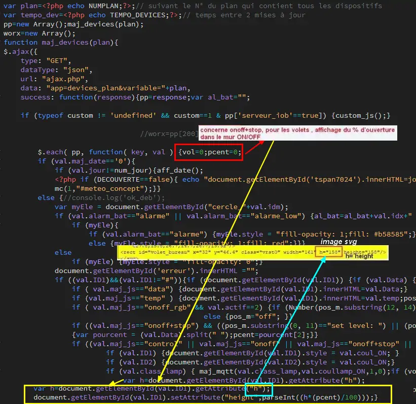
.. |image162| image:: ../media/image162.webp
   :width: 621px  
.. |image163| image:: ../media/image163.webp
   :width: 650px  
.. |image164| image:: ../media/image164.webp
   :width: 650px  
.. |image165| image:: ../media/image165.webp
   :width: 602px  
.. |image167| image:: ../media/image167.webp
   :width: 662px  
.. |image168| image:: ../media/image168.webp
   :width: 352px  
.. |image169| image:: ../media/image169.webp
   :width: 338px  
.. |image170| image:: ../media/image170.webp
   :width: 700px  
.. |image171| image:: ../media/image171.webp
   :width: 529px 
.. |image172| image:: ../media/image172.webp
   :width: 700px 
.. |image173| image:: ../media/image173.webp
   :width: 335px 
.. |image174| image:: ../media/image174.webp
   :width: 602px 
.. |image175| image:: ../media/image175.webp
   :width: 465px 
.. |image176| image:: ../media/image176.webp
   :width: 650px 
.. |image177| image:: ../media/image177.webp
   :width: 60px 
.. |image179| image:: ../media/image179.webp
   :width: 438px 
.. |image180| image:: ../media/image180.webp
   :width: 286px 
.. |image181| image:: ../media/image181.webp
   :width: 650px 
.. |image182| image:: ../media/image182.webp
   :width: 285px 
.. |image183| image:: ../media/image183.webp
   :width: 307px 
.. |image186| image:: ../media/image186.webp
   :width: 506px 
.. |image187| image:: ../media/image187.webp
   :width: 573px 
.. |image188| image:: ../media/image188.webp
   :width: 402px 
.. |image194| image:: ../media/image194.webp
   :width: 650px 
.. |image195| image:: ../media/image195.webp
   :width: 650px 
.. |image196| image:: ../media/image196.webp
   :width: 440px 
.. |image197| image:: ../media/image197.webp
   :width: 596px 
.. |image198| image:: ../media/image198.webp
   :width: 529px 
.. |image199| image:: ../media/image199.webp
   :width: 529px 
.. |image200| image:: ../media/image200.webp
   :width: 547px
.. |image201| image:: ../media/image201.webp
   :width: 700px 
.. |image202| image:: ../media/image202.webp
   :width: 700px 
.. |image203| image:: ../media/image203.webp
   :width: 655px 
.. |image206| image:: ../media/image206.webp
   :width: 327px 
.. |image207| image:: ../media/image207.webp
   :width: 454px 
.. |image208| image:: ../media/image208.webp
   :width: 700px 
.. |image209| image:: ../media/image209.webp
   :width: 153px 
.. |image210| image:: ../media/image210.webp
   :width: 695px 
.. |image211| image:: ../media/image211.webp
   :width: 638px 
.. |image212| image:: ../media/image212.webp
   :width: 700px 
.. |image213| image:: ../media/image213.webp
   :width: 420px 
.. |image214| image:: ../media/image214.webp
   :width: 420px 
.. |image216| image:: ../media/image216.webp
   :width: 369px 
.. |image218| image:: ../media/image218.webp
   :width: 526px 
.. |image219| image:: ../media/image219.webp
   :width: 526px 
.. |image220| image:: ../media/image220.webp
   :width: 316px 
.. |image221| image:: ../media/image221.webp
   :width: 338px 
.. |image249| image:: ../media/image249.webp
   :width: 700px 
.. |image259| image:: ../media/image259.webp
   :width: 393px 
.. |image411| image:: ../media/image411.webp
   :width: 700px 
.. |image412| image:: ../media/image412.webp
   :width: 700px 
.. |image413| image:: ../media/image413.webp
   :width: 383px 
.. |image906| image:: ../media/image906.webp
   :width: 700px 
.. |image907| image:: ../media/image907.webp
   :width: 480px 
.. |image910| image:: ../media/image910.webp
   :width: 480px 
.. |image943| image:: ../media/image943.webp
   :width: 600px 
.. |image1092| image:: ../media/image1092.webp
   :width: 500px 
.. |image1093| image:: ../media/image1093.webp
   :width: 600px 
.. |image1094| image:: ../media/image1094.webp
   :width: 500px 
.. |image1095| image:: ../media/image1095.webp
   :width: 319px 
.. |image1096| image:: ../media/image1096.webp
   :width: 291px 
.. |image1097| image:: ../media/image1097.webp
   :width: 443px 
.. |image1146| image:: ../media/image1146.webp
   :width: 474px 
.. |image1147| image:: ../media/image1147.webp
   :width: 480px 
.. |image1148| image:: ../media/image1148.webp
   :width: 700px 
.. |image1149| image:: ../media/image1149.webp
   :width: 600px 
.. |image1150| image:: ../media/image1150.webp
   :width: 700px 
.. |image1151| image:: ../media/image1151.webp
   :width: 459px 
.. |image1152| image:: ../media/image1152.webp
   :width: 396px 
.. |image1153| image:: ../media/image1153.webp
   :width: 441px 
.. |image1154| image:: ../media/image1154.webp
   :width: 150px 
.. |image1155| image:: ../media/image1155.webp
   :width: 250px 
.. |image1156| image:: ../media/image1156.webp
   :width: 524px 
.. |image1157| image:: ../media/image1157.webp
   :width: 533px 
.. |image1158| image:: ../media/image1158.webp
   :width: 414px 
.. |image1159| image:: ../media/image1159.webp
   :width: 561px 
.. |image1160| image:: ../media/image1160.webp
   :width: 700px 
.. |image1161| image:: ../media/image1161.webp
   :width: 500px 
.. |image1162| image:: ../media/image1162.webp
   :width: 523px 
.. |image1163| image:: ../media/image1163.webp
   :width: 600px 
.. |image1164| image:: ../media/image1164.webp
   :width: 600px 
.. |image1165| image:: ../media/image1165.webp
   :width: 449px 
.. |image1166| image:: ../media/image1166.webp
   :width: 577px 
.. |image1167| image:: ../media/image1167.webp
   :width: 500px 
.. |image1168| image:: ../media/image1168.webp
   :width: 450px 
.. |image1169| image:: ../media/image1169.webp
   :width: 650px 
.. |image1169| image:: ../media/image1169.webp
   :width: 650px 
.. |image1170| image:: ../media/image1170.webp
   :width: 421px 
.. |image1171| image:: ../media/image1171.webp
   :width: 300px 
.. |image1172| image:: ../media/image1172.webp
   :width: 650px 
.. |image1173| image:: ../media/image1173.webp
   :width: 379px 
.. |image1174| image:: ../media/image1174.webp
   :width: 370px 
.. |image1175| image:: ../media/image1175.webp
   :width: 700px 
.. |image1176| image:: ../media/image1176.webp
   :width: 550px 
.. |image1177| image:: ../media/image1177.webp
   :width: 530px 
.. |image1181| image:: ../media/image1181.webp
   :width: 650px 
.. |image1182| image:: ../media/image1182.webp
   :width: 292px 
.. |image1183| image:: ../media/image1183.webp
   :width: 138px 
.. |image1184| image:: ../media/image1184.webp
   :width: 700px 
.. |image1185| image:: ../media/image1185.webp
   :width: 214px
.. |image1186| image:: ../media/image1186.webp
   :width: 600px
.. |image1187| image:: ../media/image1187.webp
   :width: 500px
.. |image1191| image:: ../media/image1191.webp
   :width: 600px
.. |image1192| image:: ../media/image1192.webp
   :width: 597px
.. |image1194| image:: ../media/image1194.webp
   :width: 150px
.. |image1206| image:: ../img/image1206.webp
   :width: 301px
.. |image1211| image:: ../img/image1211.webp
   :width: 482px
.. |image1222| image:: ../img/image1222.webp
   :width: 660px
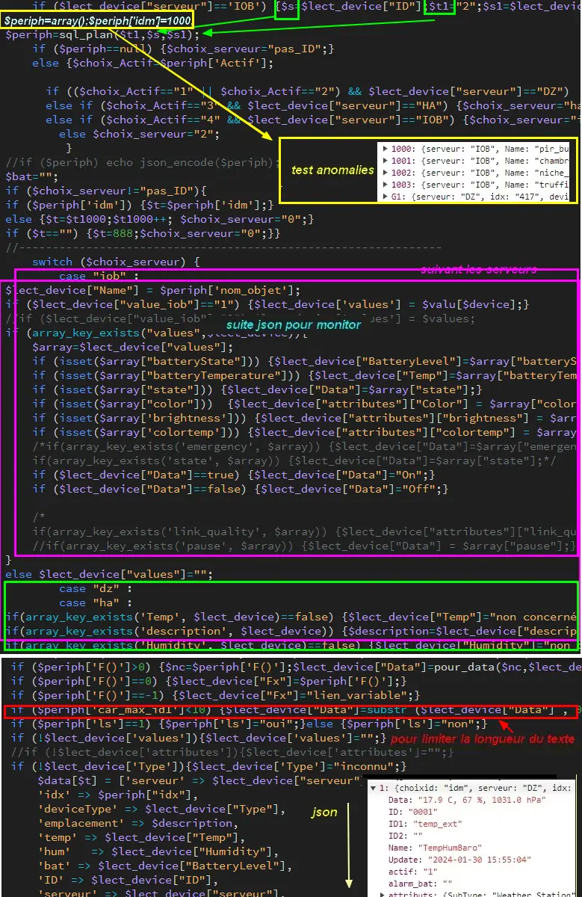
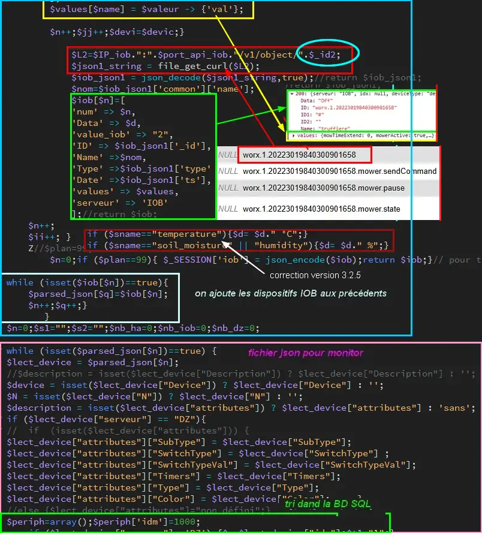
.. |image1414| image:: ../img/image1414.webp
   :width: 700px

.. |image1522| image:: ../img/image1522.webp
   :width: 700px
.. |image1523| image:: ../img/image1523.webp
   :width: 300px

.. |image1525| image:: ../img/image1525.webp
   :width: 700px
.. |image1526| image:: ../img/image1526.webp
   :width: 660px

.. |image1530| image:: ../img/image1530.webp
   :width: 700px
.. |image1531| image:: ../img/image1531.webp
   :width: 550px
.. |image1532| image:: ../img/image1532.webp
   :width: 700px
.. |image1533| image:: ../img/image1533.webp
   :width: 550px

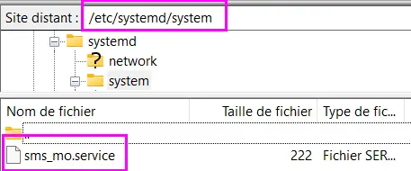
.. |image1659| image:: ../img/image1659.webp
   :width: 489px
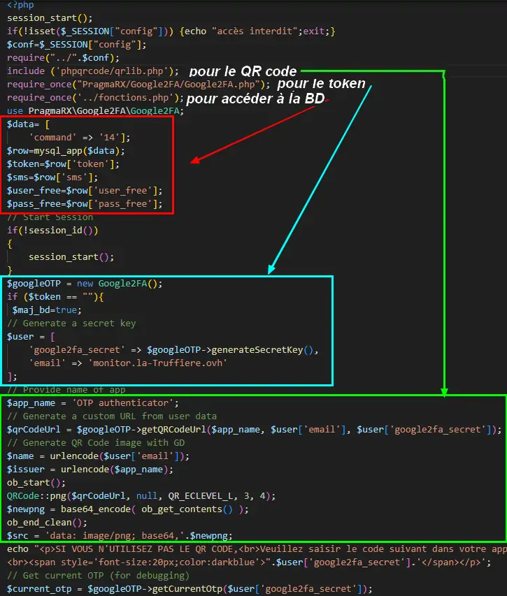

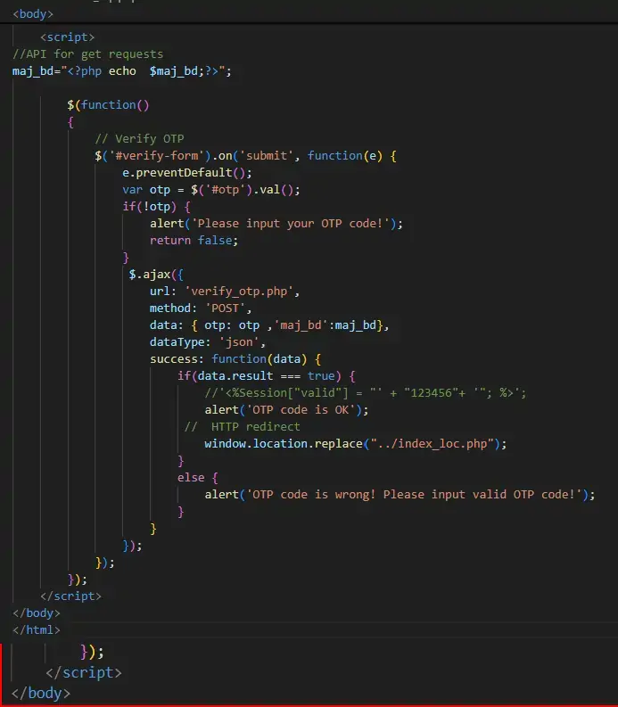
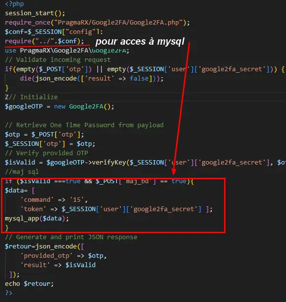
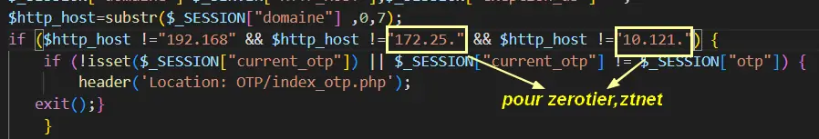
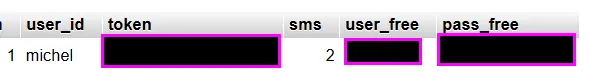
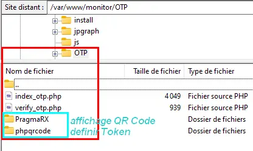

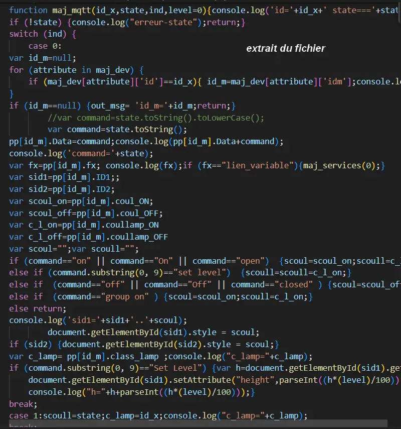

