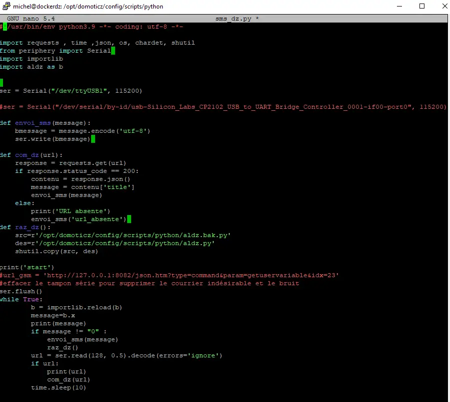
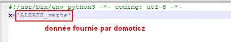
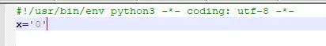
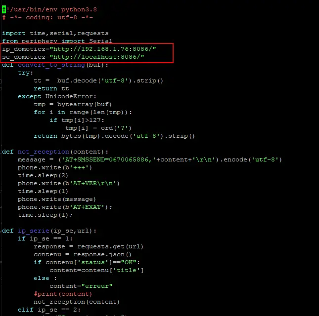
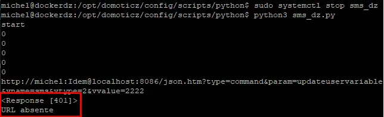
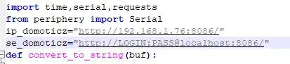
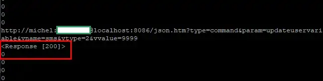
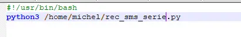
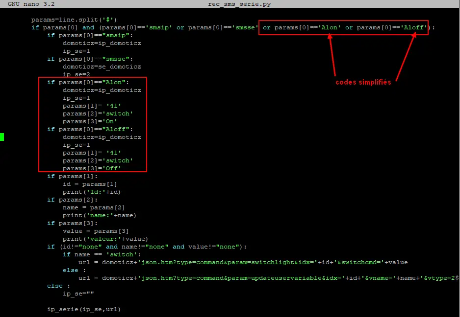
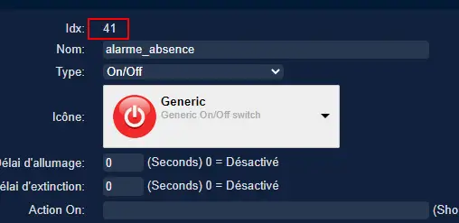

18. Divers
------------
18.1 Debian : Installer un serveur LAMP (Apache MySQL PHP)
^^^^^^^^^^^^^^^^^^^^^^^^^^^^^^^^^^^^^^^^^^^^^^^^^^^^^^^^^^

|image983|

https://www.linuxtricks.fr/wiki/debian-installer-un-serveur-lamp-apache-mysql-php

18.2 Installer Paho-mqtt
^^^^^^^^^^^^^^^^^^^^^^^^
*paho-mqtt est le code source pour la bibliothèque Python MQTT*

.. code-block::

   sudo pip3 install paho-mqtt

18.2.1 Le script pour envoyer des messages (mqtt.py)
====================================================

.. code-block::

   #!/usr/bin/env python3.7
      # -*- coding: utf-8 -*- 
      import paho.mqtt.client as mqtt
      import json
      import sys
      # Variables et Arguments
      topic= str(sys.argv[1])
      etat= str(sys.argv[2]) 
      valeur= str(sys.argv[3]) 
      MQTT_HOST = "192.168.1.42"
      MQTT_PORT = 1883
      MQTT_KEEPALIVE_INTERVAL = 45
      MQTT_TOPIC = topic
      MQTT_MSG=json.dumps({etat: valeur});
      # 
      def on_publish(client, userdata, mid):
        print ("Message Publié...")
      def on_connect(client, userdata, flags, rc):
        client.subscribe(MQTT_TOPIC)
        client.publish(MQTT_TOPIC, MQTT_MSG)
      def on_message(client, userdata, msg):
        print(msg.topic)
        print(msg.payload)
        payload = json.loads(msg.payload) # convertion en json
        print(payload['state_l2']) 
        client.disconnect() 
      # Initiatlisation MQTT Client
      mqttc = mqtt.Client()
      # callback function
      mqttc.on_publish = on_publish
      mqttc.on_connect = on_connect
      mqttc.on_message = on_message
      # Connection avec le serveur MQTT 
      mqttc.connect(MQTT_HOST, MQTT_PORT, MQTT_KEEPALIVE_INTERVAL)
      # Loop forever
      mqttc.loop_forever()

.. IMPORTANT:: 

   Pour être sûr que le fichier est au bon format (Unix) : utiliser dos2unix , § :ref:`8.2.1.1 Problème de lecture de fichier`

