18. Divers
------------
18.1 Debian : Installer un serveur LAMP (Apache MySQL PHP)
^^^^^^^^^^^^^^^^^^^^^^^^^^^^^^^^^^^^^^^^^^^^^^^^^^^^^^^^^^

|image983|

https://www.linuxtricks.fr/wiki/debian-installer-un-serveur-lamp-apache-mysql-php

18.2 Installer Paho-mqtt
^^^^^^^^^^^^^^^^^^^^^^^^
*paho-mqtt est le code source pour la bibliothèque Python MQTT*

.. code-block::

   sudo pip3 install paho-mqtt

18.2.1 Le script pour envoyer des messages (mqtt.py)
====================================================

.. code-block::

   #!/usr/bin/env python3.7
      # -*- coding: utf-8 -*- 
      import paho.mqtt.client as mqtt
      import json
      import sys
      # Variables et Arguments
      topic= str(sys.argv[1])
      etat= str(sys.argv[2]) 
      valeur= str(sys.argv[3]) 
      MQTT_HOST = "192.168.1.42"
      MQTT_PORT = 1883
      MQTT_KEEPALIVE_INTERVAL = 45
      MQTT_TOPIC = topic
      MQTT_MSG=json.dumps({etat: valeur});
      # 
      def on_publish(client, userdata, mid):
        print ("Message Publié...")
      def on_connect(client, userdata, flags, rc):
        client.subscribe(MQTT_TOPIC)
        client.publish(MQTT_TOPIC, MQTT_MSG)
      def on_message(client, userdata, msg):
        print(msg.topic)
        print(msg.payload)
        payload = json.loads(msg.payload) # convertion en json
        print(payload['state_l2']) 
        client.disconnect() 
      # Initiatlisation MQTT Client
      mqttc = mqtt.Client()
      # callback function
      mqttc.on_publish = on_publish
      mqttc.on_connect = on_connect
      mqttc.on_message = on_message
      # Connection avec le serveur MQTT 
      mqttc.connect(MQTT_HOST, MQTT_PORT, MQTT_KEEPALIVE_INTERVAL)
      # Loop forever
      mqttc.loop_forever()

.. IMPORTANT:: 

   Pour être sûr que le fichier est au bon format (Unix) : utiliser dos2unix , § :ref:`8.2.1.1 Problème de lecture de fichier`

18.3 Liaison série Domoticz-PI
^^^^^^^^^^^^^^^^^^^^^^^^^^^^^^
*Scripts dans Domoticz*

Ils sont exécutés en dehors du conteneur si Domoticz est sous Docker.

.. attention:: 

   **La passerelle Zigbee 3.0 SonOff utilise le même driver série CP2102 -donc pour /dev/serial/by-id = IDENTIQUE**

- **sms_dz.py** : https://raw.githubusercontent.com/mgrafr/monitor/main/share/scripts_dz/py/sms_dz.py

|image987|

.. note:: 

   *Modifier si besoin le numéro de la variable et le port de domoticz*

Le démarrage automatique est assuré par systemd (voir § :ref:`13.6.2.1 Enregistrement des n° de téléphone`

.. seealso:: *voir http://domo-site.fr/accueil/dossiers/70 *(liaison série)*

- **aldz.py**  voir § :ref:`13.6.2 émission SMS`

|image988|

aldz.bak.dz, en absence de message

|image989|

.. admonition:: **Scripts PI**

   - **rec_sms_serie.py** : https://raw.githubusercontent.com/mgrafr/monitor/main/share/scripts_PI8/rec_sms_serie.py

    extrait:

    |image990|
   
   .. IMPORTANT:: 

      :red:`Utiliser localhost et non 127.0.0.1`

   .. warning:: **Si ce massage en bash**

      |image991|
   
       C'est un problème de mot de passe

      |image992|
      |image993|

   - *start_rec_sms.sh**

    |image994|

    Démarrage auto avec systemd :

   .. code-block:: 

      [Unit]
      Description=start rec sms pour Domoticz
      [Service]
      Type=simple
      ExecStart=/home/michel/start_rec_sms.sh
      Restart=on-failure
      RestartSec=10
      KillMode=process
      [Install]
      WantedBy=multi-user.target
 
18.4 Commandes de l’alarme à partir d’un GSM
^^^^^^^^^^^^^^^^^^^^^^^^^^^^^^^^^^^^^^^^^^^^
*Pour faciliter l’activation ou l’arrêt de l’alarme*

il est facile d’ajouter des codes au script du paragraphe précédent :ref:`18.3 Liaison série Domoticz-PI`

Extrait de **rec_sms_serie.py** installé sur le PI qui assure le monitoring , les notifications GSM et les sauvegardes
ù
.. code-block:: 

   if params[0]=="Alon":
         domoticz=ip_domoticz
         ip_se=1
         params[1]= '41'
         params[2]='switch'
         params[3]='On'
   if params[0]=="Aloff":
         domoticz=ip_domoticz
         ip_se=1
         params[1]= '41'
         params[2]='switch'
         params[3]='Off'

.. note::  :red:`Alon et Aloff` = Marche/Arrêt de l'alarme

|image996|

Le switch domoticz : |image997|

voir le $ :ref:`5.1 Dans Domoticz, les interrupteurs virtuels, les variables`

18.5 Données compteur Linky
^^^^^^^^^^^^^^^^^^^^^^^^^^^
*Configuration après installation du plugin: https://github.com/guillaumezin/DomoticzLinky*

|image998|

.. Important::

   Pour la correspondance avec ENEDIS : Ne pas copier toute l'adresse http, s’arrêter après le code

   |image999|

|image1000|

- **Dans monitor**

|image1001|

|image1002|

.. seealso:: § :ref:`15.1 ajout d’un dispositif` 

|image1003|

.. seealso:: §  :ref:`6. GRAHIQUES & BASE DE DONNEES`

- **Les modifications dans Domoticz**   *export_sql*

pour enregistrer dans la BD SQL, voir §  :ref:`6.2 Dans Domoticz`

.. admonition:: **Avec Lua**

   |image1004|

.. admonition:: **Avec DzVent & l'API Domoticz**

   counter et usage du Device sont restés bloqués au jour ou le plugin s'est arrêté lors d'une mise à jour ENEDIS.j'ai donc utilisé l'API et item.result.json.Counter & item.result.json.Usage.L'utilisation de l'API peut être utilisée lors d'autres occasions.Le port de mon Domoticz est 8086 avec une IP 192.168.X.X mais Domotice est installé sous Docker d'où l'adresse 127.0.0.1:8080.  

    |image1215|

   .. code-block::

      local function split(s, delimiter)
	   local result = {}
	   for match in (s..delimiter):gmatch('(.-)'..delimiter) do
		table.insert(result, match)
	   end
	   return result
      end
      --function tointeger( x )
      --    num = tonumber( x )
      --    return num < 0 and math.ceil( num ) or math.floor( num )
      --end
      function envoi_fab(don)
        local command = "/bin/bash userdata/scripts/bash/./fabric.sh"..don.." > /home/michel/fab.log 2>&1";
        os.execute(command);
      end
      function round(num,numDecimal)
       local mult = 10^(numDecimal or 0)
       return math.floor(num * mult + 0.5) / mult
      end
      --
      local scriptVar = 'linky_sql'
      return {
          on = { 
           timer =  {'at 16:12'}, 
           httpResponses = { scriptVar }},
           logging = { level = domoticz.LOG_ERROR, marker  = scriptVar },
    
          execute = function(dz, item) 
           if (item.isTimer) then
            local url = 'http://127.0.0.1:8080/json.htm?type=command&param=getdevices&rid=427';
            print(url);
            dz.openURL({ 
                url = url, 
                method = 'GET',
                callback = scriptVar, })
           end
         if (item.isHTTPResponse ) then
            local results = item.json.result
            -- loop through the nodes and print some info
            for i, node in pairs(results) do
            print('Data'.. node.Data);m=split(node.Data, ';')
            local mCounter = m[1] ; print("compteur_kwh:"..mCounter);--mCounter=tointeger(mCounter)/1000;
            local mUsage = m[5] ;    print("compteur_kw:"..mUsage) ;
            
            libelle="energie#conso"
            don=" "..libelle.."#"..tostring(round(tonumber(mCounter)/1000,1)) .."#"..datetime.."#pmax#"..tostring(round(tonumber(mUsage)/1000,1)); print("energie"..don);
            envoi_fab(don)
            end
        end
      end
      }

|image1005|

- **Le compteur est ajouté au plan** , les données sont disponibles pour monitor : voir § :ref:`1.2.1.1 status_variables , devices_zone et device_plan` 

- **Table dispositifs** : *création du dispositif*

|image1006|

.. seealso:: le § :ref:`0.3.2 Les Dispositifs`

- **Table energie** : création de la table

|image1007|

voir un exemple : :ref:`17.1.2. Création des tables PH, Redox, temp, ...`

- **Fichier json** envoyé par domoticz :

|image1008|

.. admonition:: **Les fichiers modifiés dans monitor**

   - **Interieur.php** : *ajout de l’image svg* 

   .. code-block::

      
<?php include ('linky_svg.php');?>

   |image1009|

   - **graphiques.php**

   |image1010|

18.6 Complément sur l’utilisation des Mots de Passe cryptés dans Domoticz
^^^^^^^^^^^^^^^^^^^^^^^^^^^^^^^^^^^^^^^^^^^^^^^^^^^^^^^^^^^^^^^^^^^^^^^^^
*Une des solutions pour crypter et décrypter les mots de passe*

.. seealso:: Codage : https://www.base64encode.org/

   |image1011|

- **Décodage** , *Extrait du script maj-services.lua*

.. code-block::

   -- chargement fichier contenant les variables de configuration
   package.path = package.path..";www/modules_lua/?.lua"
   require 'connect'
   local base64 = require'base64'
   local user_free = base64.decode(login_free);local passe_free = base64.decode(pass_free);
   local sms_free="curl --insecure  'https://smsapi.free-mobile.fr/sendmsg?user="..user_free.."&pass="..passe_free.."&msg=poubelle' >> /home/michel/OsExecute.log 2>&1"

voir ce § :ref:`14.6.1.1 connect.lua`

18.7 pages sans rapport avec la domotique
^^^^^^^^^^^^^^^^^^^^^^^^^^^^^^^^^^^^^^^^^
18.7.1  Les recettes de cuisines sur la tablette domotique
==========================================================

|image1015|

.. important:: 

   **Comme pour chaque ajout de page , il faut modifier les fichiers** :

   -	mes.css.css

   -	config.php

   -	index_loc.php

   -	header.php

  *et parfois le fichier* :darkblue:`big-Slide.js` , si l’on doit modifier la largeur du menu § :ref:`1.7 Ajuster le menu au nombre de pages`

   |image1016|

- **le fichier recettes.php**  https://raw.githubusercontent.com/mgrafr/monitor/main/include/recettes.php

 |image1018|

- **Dans fonctions.php**  *sql_app()*

|image1019|

18.8 migration de Domoticz différentes étapes pour ne rien oublier
^^^^^^^^^^^^^^^^^^^^^^^^^^^^^^^^^^^^^^^^^^^^^^^^^^^^^^^^^^^^^^^^^^
.. admonition:: **Exemple migration vers Docker .**

   - faire une suvegarde e la base de bonnées domoticz.db

   -	Modifier les IP/PORT de Domoticz, Zwavejs2mqtt, Zigbee2mqtt,…dans le fichier de configuration de monitor.

   -	Pour les scripts externes non gérés dans le conteneur Domoticz ,installer les versions de python, node, … nécessaires, et les dépendances nécessaires ;par exemple pour la communication série de Domoticz , l’installation de python-periphery , le démarrage auto sur systemd ,…. Si l’API de Domoticz est utilisée dans ces scripts , modifier le Port de Domoticz

       |image1278|  

   -    Pour VOIP asterisk, modifier ip de domoticz pour la capture d’image (portier) ; pour appeler json de Domoticz depuis Docker, autoriser dans les paramètres de Domoticz le réseau 172.*.*.* 

   -	Pour le monitoring Nagios, il faut indiquer les IP/PORT qui sont modifiés et les noms des VM Proxmox si Proxmox est utilisé.

   -	Si une nouvelle page doit être ajoutée à monitor, par exemple pour Zwave (OZW n’étant plus maintenu) : créer le sous-domaine pour l’accès distant et le certificat pour HTTPS (Letsencrypt-cerbot)

   -	Les dispositifs sont souvent difficiles à réveiller, s’ils sont réinstallés, modifier l’ID de Domoticz dans la base de données de monitor

   -    Pour les cripts LUA ou DzVent  sous Docker le fichier Config s'appelle userdata; les sous répertoires sont attachés à Config et non directement à domoticz .

       |image1279|

.. admonition:: **Exemple migration vers un conteneur LXC .**

   Si aucune clés Zwave ou Zigbee ne sont installés sur le conteneur (Zigbee2mqtt et Zwave-JS-UI sont installés dans des conteneurs séparés), l'installation se résume à installer Curl et à lancer la commande bash:

   .. code-block::

      apt install curl 
      sudo bash -c "$(curl -sSfL https://install.domoticz.com)"

   -   Pour une migration depuis Docker, lire le § précédent et modifier les scripts Lua et DZvent pour revenir à un schéma classique des répertoires.

   .. warning::

      le port sous docker peut être différent alors que sous LXC c'est le même 

      |image1281|

   -   Une sauvegarde suivi d'un backup sur le nouveau serveur et Domoticz sera de nouveau opérationnel.

   **Si une clé USB est installée, ne pas oublier de la déconnecter d'une machine virtuelle sinon elle n'apparaitra pas avec**  :darkblue:`ls -ln /dev/ttyUSB*`

.. admonition:: **Pour tout changement de serveur.**

   Ne pas oublier d'exporter les scripts Debian, exemple:

   **Systemd**:

   |image1304|

   |image1305|

.. warning::

   la version 2024.1 ne fonctionne pas sous Debian 12 qui utilise openssl 3.0 (domoticz utilise opebssl 1.1)

18.9 des commandes linux utiles
^^^^^^^^^^^^^^^^^^^^^^^^^^^^^^^

- Le port est déjà utilisé :

.. code-block::

   lsof -i tcp:<PORT>
   kill -9 <PID>

|image1264|

- Pour modifier le fuseau horaire d'un serveur Linux (ex: UTC+2), il suffit d'exécuter la commande suivante :

.. code-block::

   timedatectl set-timezone Europe/Paris

|image1277|

18.10 Serveur SSE installé dans Monitor
^^^^^^^^^^^^^^^^^^^^^^^^^^^^^^^^^^^^^^^
pour communiquer entre les diverses applications (Domoticz, Home Assistant, les Clients et le serveur Web) nous utiliserons la base de données SQL; nous créons une nouvelle table avec un enregistrement:

.. code block::

   CREATE TABLE `sse` (
  `num` int(1) NOT NULL,
  `id` varchar(20) NOT NULL,
  `state` varchar(5) NOT NULL
   ) ENGINE=InnoDB DEFAULT CHARSET=utf8mb4 COLLATE=utf8mb4_general_ci;

   INSERT INTO `sse` (`num`, `id`, `state`) VALUES
   (0, '0', '');
   COMMIT;

 ce fichier sse.sql peut être importé depuis le référentiel.

|image1265|

18.10.1  Le serveur SSE PHP
===========================
fichier :darkblue:`serveur_sse.php`

.. code-block::

   header('Connection: keep-alive');
   header("Access-Control-Allow-Origin: *"); 
   require_once('../fonctions.php');
   ignore_user_abort(true); // Empêche PHP de vérifier la déconnexion de l'utilisateur
   connection_aborted(); // Vérifie si l'utilisateur s'est déconnecté ou non
   // en cas de reconnexion du client, il enverra Last_Event_ID dans les en-têtes
   // ceci n'est évalué que lors de la première requête et de la reconnexion ultérieure du client
   $lastEventId = floatval(isset($_SERVER["HTTP_LAST_EVENT_ID"]) ? $_SERVER["HTTP_LAST_EVENT_ID"] : 0);
        if ($lastEventId == 0) {
            $lastEventId = floatval(isset($_GET["lastEventId"]) ? $_GET["lastEventId"] : false);
        }
   // conserve également notre propre dernier identifiant pour les mises à jour normales mais favorise last_event_id s'il existe
   // puisqu'à chaque reconnexion, cette valeur sera perdue
   // Get the current time on server
   date_default_timezone_set('Europe/Paris');
   $currentTime = date("H:i:s", time());
   $event= 'message';
   if(connection_aborted()){
   exit();}
   // importation des données si il en existent de nouvelles
   $donnees=[
      'command'=> '5',
      'id' => "",
      'state' => "",
      'date' => $currentTime
    ];
   $retour=mysql_app($donnees);
   $d = array("heure"=>$currentTime, "id"=>$retour['id'], "state"=>$retour['state']);
   $id=$retour['id'];
            if($id !="" ){
           echo "event: " . $event . "\n";
           echo "data: ".json_encode($d)." \n\n";
           ob_flush();
           flush();
   $donnees1=[
   'command'=> '6',
   'id' => "",
   'state' => ""
    ];mysql_app($donnees1);
   }
   else 
    sleep(SSE_SLEEP);
   ?>

|image1266|

Le client reçoit:

|image1223|

18.10.2  L'API de monitor
=========================
*http://192.168.1.9/monitor/api/json.php?app=maj&id=xxx&state=XX*

la fonction :darkblue:`maj()` dans /api/f_pour_api.php

.. code-block::

   function maj($id,$state){
   $donnees=array();	
   $donnees=[
      'command'=> '4',
      'id' => $id,
      'state' => $state,
      'date' => date("H:i:s", time())
       ];
   mysql_app($donnees);	
   return 'OK';
   }

la fonction mysql_app() dans /fonctions.php

|image1267|

18.10.3  L'API de monitor depuis HA ou DZ
=========================================
18.10.3.1  depuis Domoticz
""""""""""""""""""""""""""
.. code-block::

   function send_sse(txt,txt1)
   local api_mon="curl --insecure  'http://192.168.1.9/monitor/api/json.php?app=maj&id="..txt.."&state="..txt1.."' > sse.log 2>&1"  
   os.execute(api_mon)
   end

|image1302|

18.10.3.2  depuis Home Assistant
""""""""""""""""""""""""""""""""

Dans configuration yaml, la :darkblue:`rest_command` 

.. code-block::

   rest_command:
     monitor_2:
       url: "http://192.168.1.9/monitor/api/json.php?app=maj&id={{id}}&state={{value}}"

Dans automations.yaml,

.. code-block::

   action:
  
  - service: rest_command.monitor_1
    data:
      value: "{{ trigger.to_state.state }}"
      id: "{{ trigger.entity_id }} "

.. |image983| image:: ../media/image983.webp
   :width: 200px
.. |image987| image:: ../media/image987.webp
   :width: 700px
.. |image988| image:: ../media/image988.webp
   :width: 468px
.. |image989| image:: ../media/image989.webp
   :width: 412px
.. |image990| image:: ../media/image990.webp
   :width: 645px
.. |image991| image:: ../media/image991.webp
   :width: 644px
.. |image992| image:: ../media/image992.webp
   :width: 413px
.. |image993| image:: ../media/image993.webp
   :width: 643px
.. |image994| image:: ../media/image994.webp
   :width: 410px
.. |image996| image:: ../media/image996.webp
   :width: 700px
.. |image997| image:: ../media/image997.webp
   :width: 400px
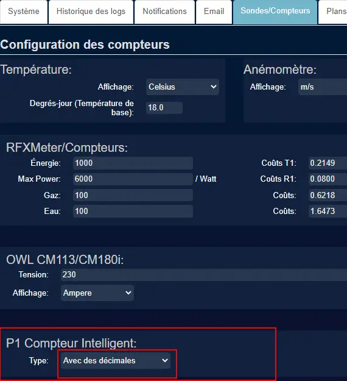
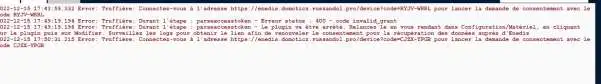
.. |image1000| image:: ../media/image1000.webp
   :width: 596px
.. |image1001| image:: ../media/image1001.webp
   :width: 700px
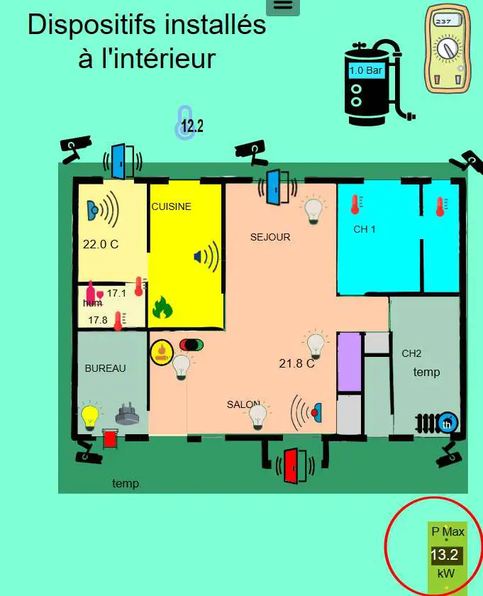
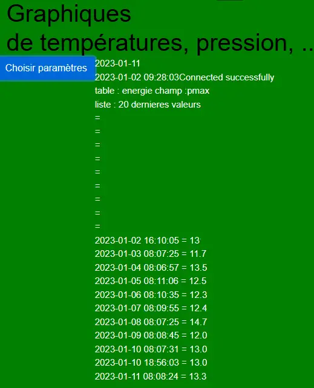
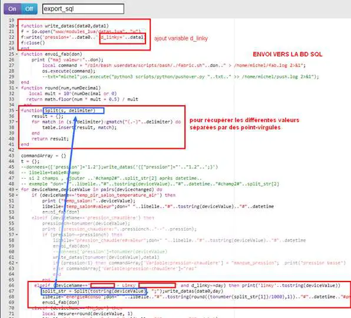
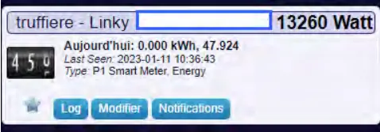
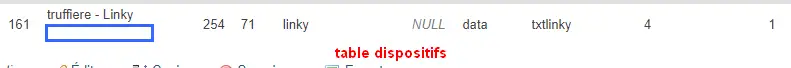
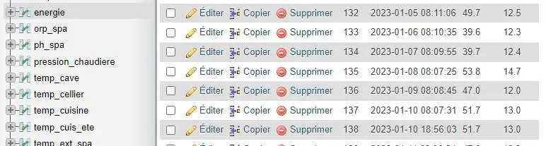
.. |image1008| image:: ../media/image1008.webp
   :width: 406px
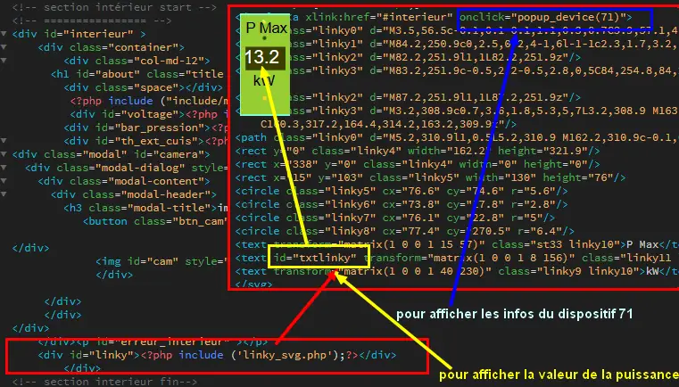
.. |image1010| image:: ../media/image1010.webp
   :width: 700px
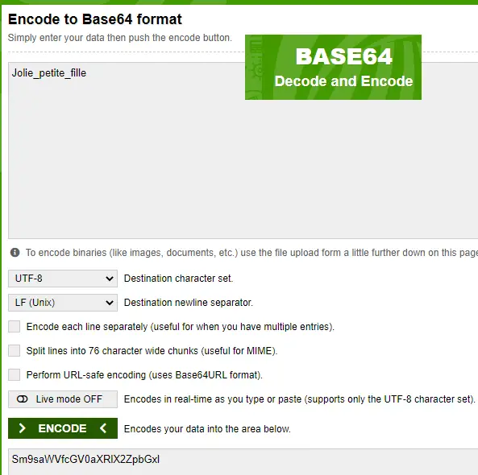

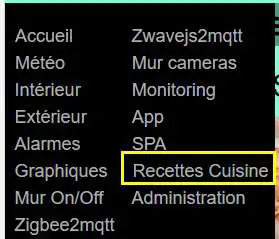
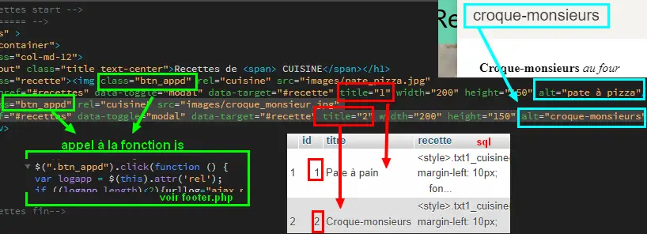
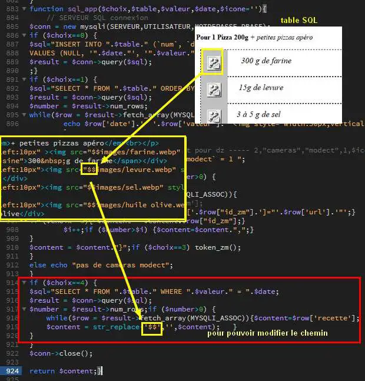
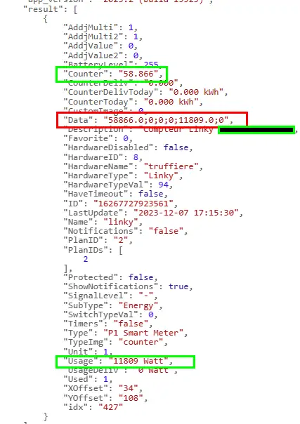
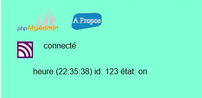
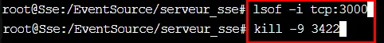
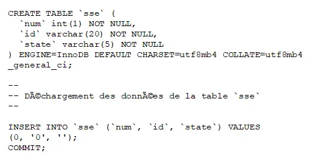
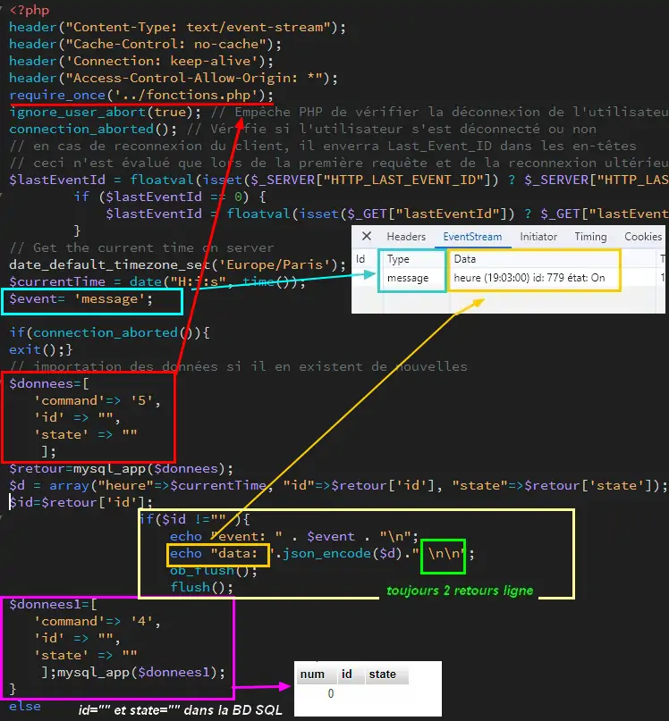
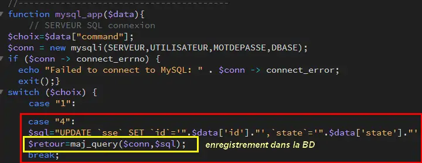

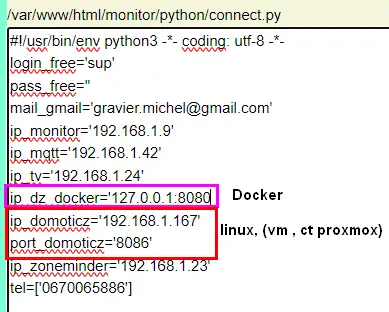
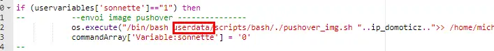
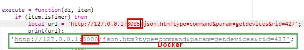
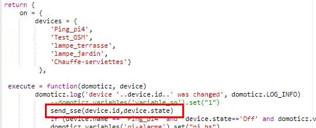
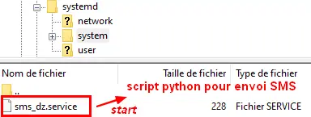
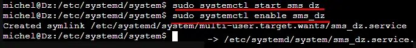
