17. DIY
-------
17.1 Domotiser un SPA (ou une piscine)
^^^^^^^^^^^^^^^^^^^^^^^^^^^^^^^^^^^^^^
Ce paragraphe contient différentes parties qui peuvent être indépendantes ou liées suivant le choix de chacun :

-	La réalisation d’un boitier électronique de mesures de PH, Redox, Températures, Débit de la filtration, les mesures étant envoyées sur un serveur MQTT;Cette réalisation est décrite sur le site domo-site.fr

-	La création de capteurs virtuels dans Domoticz qui récupère les valeurs envoyées par le serveur MQTT et les envoie vers la base de données de Monitor ; il envoie également des alertes sur la TV comme pour les poubelles et la fosse septique. 

-	La création d’une page dans Monitor pour afficher les données sur une page dédiée, afficher des alertes et commander s’il y a lieu le chauffage, les pompes ,...

|image914|

17.1.1. Création de capteurs virtuels dans Domoticz
===================================================
*Pour mémoire*

|image915|

.. warning:: C’est Domoticz qui fournit l’IDX, il faut donc modifier cet IDX dans EasyEsp ;Pour le PH, le redox, le débit, les capteurs sont " Custom ".

   |image916|

**Dans EasyEsp**

|image917|

17.1.2. Création des tables PH, Redox, temp, ...
================================================
*dans la base de données*

.. note::

   Dans phpMyAdmin, il n’est pas possible de faire des copier/coller, aussi il faut enregistrer les lignes ci-dessous dans un fichier et l’importer pour éviter de taper toutes les lignes.

**4  ou 5 caractères** sont nécessaires pour la valeur (5 caractères reçus par Dz de MQTT , réduits à 4 avec :red:`round(deviceValue, 1)` dans le script lua).

- **La commande SQL** :

.. code-block::

   CREATE TABLE `ph_spa` (
  `num` int(5) NOT NULL,
  `date` timestamp NOT NULL DEFAULT current_timestamp() ON UPDATE current_timestamp(),
  `valeur` varchar(5) NOT NULL 
   ) ENGINE=InnoDB DEFAULT CHARSET=utf8;
   ALTER TABLE `debit_spa` CHANGE `num` `num` INT(5) NOT NULL AUTO_INCREMENT, add PRIMARY KEY (`num`);

|image918|

*Faire de même pour les autres tables , en remplaçant le nom de la table dans le fichier ; exemple : CREATE TABLE `orp_spa`*

|image919|

.. important:: :darkblue:`Si la création est manuelle , ne pas oublier Auto incrémenter « num »`

   |image920|

17.1.3 Envoi des données à la BD de monitor par Domoticz
========================================================
*Le paragraphe 6.2 traite de ce sujet (envoie de températures issues de capteurs réels ou virtuels)*.

Il suffit donc d’ajouter les données PH, Redox, etc... dans le script export_sql dans Evènements de Domoticz :

|image921|

.. note:: Pour rappel :darkblue:`fabric` appelle le script python :darkblue:`sqlite_mysql.py` de monitor

Les valeurs si dessous ne sont pas réelles, la sonde PH n’est pas branchée.

|image922|

17.1.4. – Affichage dans Monitor
================================
.. warning:: Pour que Monitor reçoive les données, il faut enregistrer les capteurs dans la BD et les ajouter dans un plan dans Domoticz plan, voir les $ 

- :ref:`0.3.1 Les Tables "dispositifs(variables)" & "text-image"` 

- :ref:`2.1.4 - ajout d’un ou plusieurs dispositifs`

17.1.4.1 la page spa.php
""""""""""""""""""""""""
*cette page a la particularité d'affichher un écran à pages multiples défilantes*

.. code-block::

   <!-- section SPA start -->
		

			

		      

<h1 class="title_ext text-center">SPA contrôle qualité</h1> 

	         <?php include ("ph-redox_svg.php");?>
            
   
    

   

|image923|

.. admonition:: **Explication de cette ligne**

   .. code-block::

      var ecranspa=<?php echo '["' . implode('", "', ECRANSPA) . '"]' ?>;

  :darkblue:`C’est la façon de passer un array PHP à une fonction JavaScript`

*La fonction graph de la page graphique est utilisée*

- **Dans config.php** : *(permet d’ajouter facilement une autre page)*

Il suffira alors simplement d’ajouter cette page à l’image svg, voir le § :ref:`17.1.4.2 ajout d’un ID dans  l’image svg pour le 2eme écran (ecran1)`

.. code-block::

   //SPA
   define('ON_SPA',true);// mise en service SPA
   define('NB_ECRAN_SPA',6);
   define('ECRANSPA', array(
    0 => "ph",// si nb ecran >=2
    1 => "orp",// si nb ecran >=3 
    2 => "debit", //débit en M3 // si nb ecran >=4
    3 => "temp", //si nb ecran >=5
    4 => "temp_ext", //si nb ecran >=6
	));

.. warning:: **NE PAS OUBLIER d'ajouter la page au menu , à index_loc.php et son ID aux CSS**, voir le paragraphe :ref:`16. Ajouter des pages ou des alertes`

|image925|

17.1.4.1.a L’image svg support de l’affichage
~~~~~~~~~~~~~~~~~~~~~~~~~~~~~~~~~~~~~~~~~~~~~
*https://raw.githubusercontent.com/mgrafr/monitor/main/include/ph-redox_svg.php*

|image928|

|image929|

|image930|

- **Enregistrer les capteurs dans la table « dispositifs »** 

voir le § :ref:`0.3.2 Les Dispositifs`

- **Monitor reçoit**

|image932|

.. admonition:: **La 1ère page**

   |image933|

17.1.4.2 ajout d’un ID dans  l’image svg pour le 2eme écran (ecran1)
""""""""""""""""""""""""""""""""""""""""""""""""""""""""""""""""""""
*qui affichera les données de la BD*

 |image934|

.. code-block::

   <g id="graphic_ph" transform="matrix(1 0 0 1 70 65)" class="spa2 spa3"></g>

 |image935|

17.1.4.2.a Les autres fichiers concernés
~~~~~~~~~~~~~~~~~~~~~~~~~~~~~~~~~~~~~~~~
-	fonctions.php graph()

-	export_tab_sqli.php

|image936|

.. important::

   L’écran de mesure est petit , l’affichage est limité à 10 analyses ; pour un historique plus long , utiliser page  graphique et « infos_bd »

   L’image svg n’accepte pas les retours à la ligne   , pour chaque ligne il faut définir un <text>…</text> ; le fichier fonctions.php est donc modifié en conséquence.

   .. code-block::

      <text transform="matrix(1 0 0 1 0 '.$ccc.')" class="spa2 spa3">'.$xdate[$i].'='.$yvaleur[$i].'</text>

   |image937|

   |image938|

.. warning:: **Les lignes non indispensables sont supprimées** pour $periode= « text_svg »; 

   en remplacement, affichage de "connected"  : :green:`echo '<text transform="matrix(1 0 0 1 0 0)" class="spa2 spa3">Connected</text>';`

17.1.4.3 ajout d’un ID dans  l’image svg pour 3eme écran
""""""""""""""""""""""""""""""""""""""""""""""""""""""""
*qui affiche les données Redox de la même façon que pour le PH ci-dessus*

|image939|

|image940|

17.1.4.4  ajout d’autres écrans
"""""""""""""""""""""""""""""""
*Mesure de la température de l’eau, de l’air, le débit de la filtration,...*

.. admonition:: **Calcul du débit de la filtration**

   Impulsion de débit : F(Hz)=(0.20xQ)-3%
 
   Q=L/min

   F= 0,2 L/mn

- **dans EasyEsp** les données envoyées sont :

|image941|

- **Domoticz reçoit**

|image942|

Pour envoyer à la BD le débit : script lua "export_sql"

.. code-block::

   t = {};
   ...
    elseif (deviceName=='Debit_filtration_SPA') then
	print ("debit:"..deviceValue);c=0;
	for i in string.gmatch(deviceValue,"[^;]+") do
        t[c]=i;c=c+1;
        end
	libelle="debit_spa#valeur";don=" "..libelle.."#"..t[0].."#"..datetime
	envoi_fab(don)   

|image944|

- **Dans monitor**, *ajout du 3eme écran(ecran2) à l’image svg*

.. code-block::

   <g id="ecran3" style="display:none">
   <rect x="43" y="36.5" class="spa9" width="256.7" height="145.9"/>
   <text transform="matrix(1 0 0 1 70 55)" class="spa2 spa3">Dernières Mesures de Débit :</text>
   <g id="graphic_debit" transform="matrix(1 0 0 1 70 65)" class="spa2 spa3"></g>		
   </g>

|image947|

17.1.4.4. ecran4 , ecran5
~~~~~~~~~~~~~~~~~~~~~~~~~

|image949|

17.2 Extension Pompes perisaltiques pour réguler PH et REDOX
^^^^^^^^^^^^^^^^^^^^^^^^^^^^^^^^^^^^^^^^^^^^^^^^^^^^^^^^^^^^
*en cours de rédaction*

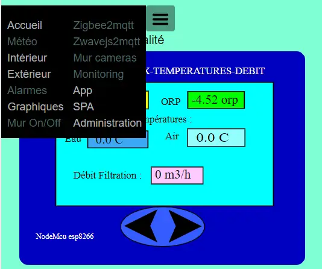
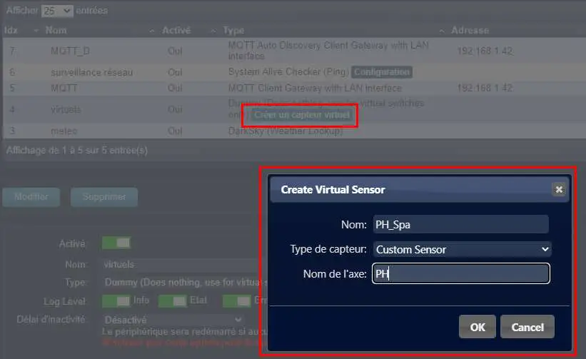
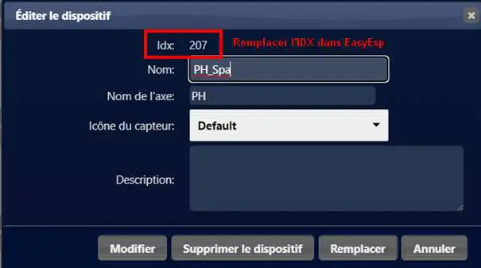
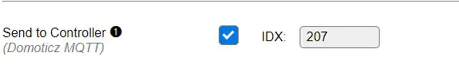
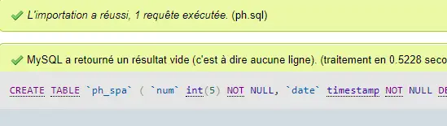
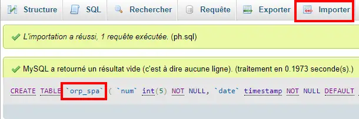
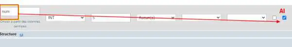
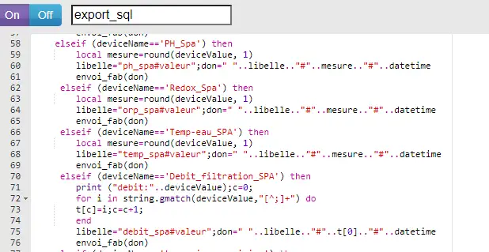
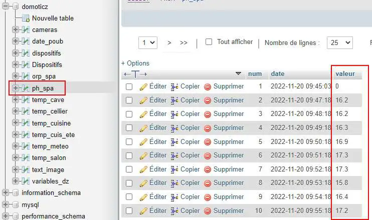
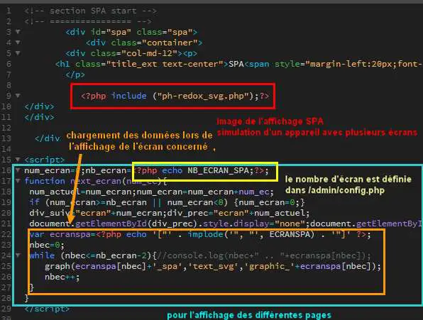
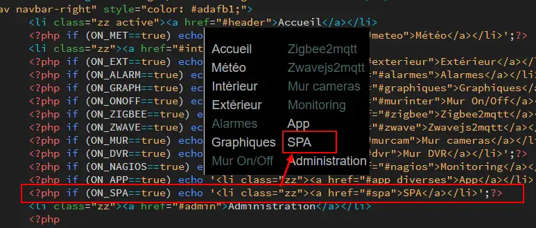
.. |image928| image:: ../media/image928.webp
   :width: 602px
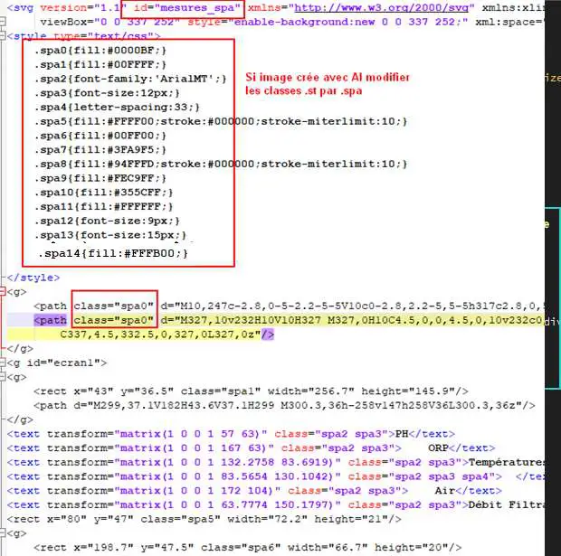
.. |image930| image:: ../media/image930.webp
   :width: 327px
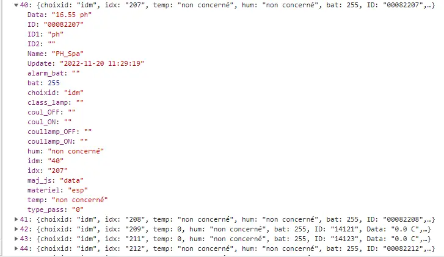
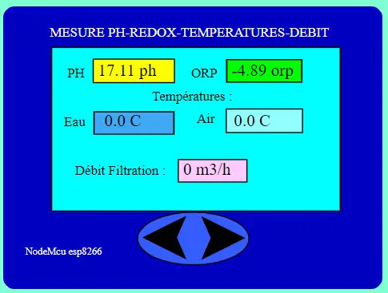
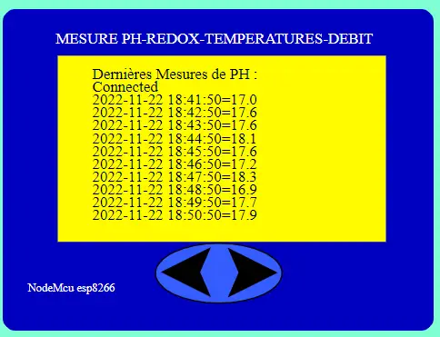
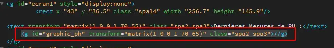
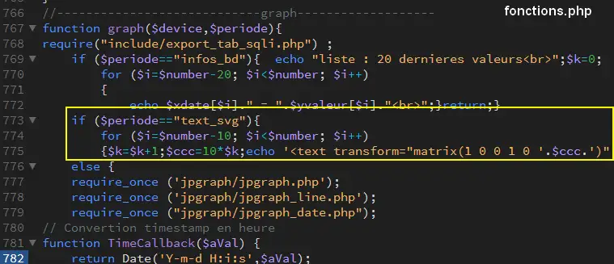
.. |image937| image:: ../media/image937.webp
   :width: 700px
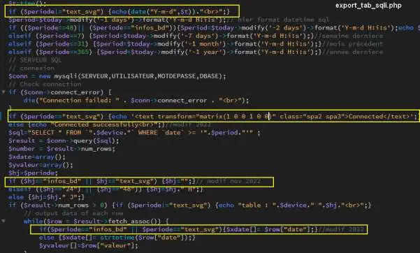
.. |image939| image:: ../media/image939.webp
   :width: 650px
.. |image940| image:: ../media/image940.webp
   :width: 491px
.. |image941| image:: ../media/image941.webp
   :width: 510px
.. |image942| image:: ../media/image942.webp
   :width: 408px
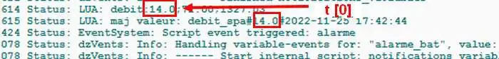
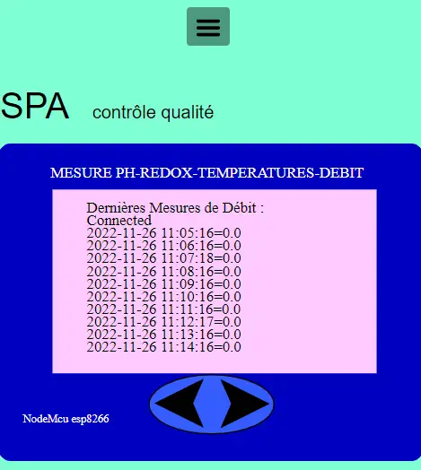
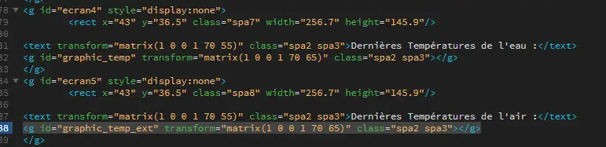

