17. DIY
-------
17.1 Domotiser un SPA (ou une piscine)
^^^^^^^^^^^^^^^^^^^^^^^^^^^^^^^^^^^^^^
Ce paragraphe contient différentes parties qui peuvent être indépendantes ou liées suivant le choix de chacun :

-	La réalisation d’un boitier électronique de mesures de PH, Redox, Températures, Débit de la filtration, les mesures étant envoyées sur un serveur MQTT;Cette réalisation est décrite dans le paragraphe :ref:`17.2 monitoring pour spa, réalisation`

-	La création de capteurs virtuels dans Domoticz qui récupère les valeurs envoyées par le serveur MQTT et les envoie vers la base de données de Monitor ; il envoie également des alertes sur la TV comme pour les poubelles et la fosse septique. 

-	La création d’une page dans Monitor pour afficher les données sur une page dédiée, afficher des alertes et commander s’il y a lieu le chauffage, les pompes ,...

|image914|

17.1.1. Création de capteurs virtuels dans Domoticz
===================================================
*Pour mémoire*

|image915|

.. warning:: C’est Domoticz qui fournit l’IDX, il faut donc modifier cet IDX dans EasyEsp ;Pour le PH, le redox, le débit, les capteurs sont " Custom ".

   |image916|

**Dans EasyEsp**

|image917|

17.1.2. Création des tables PH, Redox, temp, ...
================================================
*dans la base de données*

.. note::

   Dans phpMyAdmin, il n’est pas possible de faire des copier/coller, aussi il faut enregistrer les lignes ci-dessous dans un fichier et l’importer pour éviter de taper toutes les lignes.

**4  ou 5 caractères** sont nécessaires pour la valeur (5 caractères reçus par Dz de MQTT , réduits à 4 avec :red:`round(deviceValue, 1)` dans le script lua).

- **La commande SQL** :

.. code-block::

   CREATE TABLE `ph_spa` (
  `num` int(5) NOT NULL,
  `date` timestamp NOT NULL DEFAULT current_timestamp() ON UPDATE current_timestamp(),
  `valeur` varchar(5) NOT NULL 
   ) ENGINE=InnoDB DEFAULT CHARSET=utf8;
   ALTER TABLE `debit_spa` CHANGE `num` `num` INT(5) NOT NULL AUTO_INCREMENT, add PRIMARY KEY (`num`);

|image918|

*Faire de même pour les autres tables , en remplaçant le nom de la table dans le fichier ; exemple : CREATE TABLE `orp_spa`*

|image919|

.. important:: :darkblue:`Si la création est manuelle , ne pas oublier Auto incrémenter « num »`

   |image920|

17.1.3 Envoi des données à la BD de monitor par Domoticz
========================================================
*Le paragraphe 6.2 traite de ce sujet (envoie de températures issues de capteurs réels ou virtuels)*.

Il suffit donc d’ajouter les données PH, Redox, etc... dans le script export_sql dans Evènements de Domoticz :

|image921|

.. note:: Pour rappel :darkblue:`fabric` appelle le script python :darkblue:`sqlite_mysql.py` de monitor

Les valeurs si dessous ne sont pas réelles, la sonde PH n’est pas branchée.

|image922|

17.1.4. – Affichage dans Monitor
================================
.. warning:: Pour que Monitor reçoive les données, il faut enregistrer les capteurs dans la BD et les ajouter dans un plan dans Domoticz plan, voir les $ 

- :ref:`0.3.1 Les Tables "dispositifs(variables)" & "text-image"` 

- :ref:`2.1.4 - ajout d’un ou plusieurs dispositifs`

17.1.4.1 la page spa.php
""""""""""""""""""""""""
*cette page a la particularité d'affichher un écran à pages multiples défilantes*

.. code-block::

   <!-- section SPA start -->
		

			

		      

<h1 class="title_ext text-center">SPA contrôle qualité</h1> 

	         <?php include ("ph-redox_svg.php");?>
            
   
    

   

|image923|

.. admonition:: **Explication de cette ligne**

   .. code-block::

      var ecranspa=<?php echo '["' . implode('", "', ECRANSPA) . '"]' ?>;

  :darkblue:`C’est la façon de passer un array PHP à une fonction JavaScript`

*La fonction graph de la page graphique est utilisée*

- **Dans config.php** : *(permet d’ajouter facilement une autre page)*

Il suffira alors simplement d’ajouter cette page à l’image svg, voir le § :ref:`17.1.4.2 ajout d’un ID dans  l’image svg pour le 2eme écran (ecran1)`

.. code-block::

   //SPA
   define('ON_SPA',true);// mise en service SPA
   define('NB_ECRAN_SPA',6);
   define('ECRANSPA', array(
    0 => "ph",// si nb ecran >=2
    1 => "orp",// si nb ecran >=3 
    2 => "debit", //débit en M3 // si nb ecran >=4
    3 => "temp", //si nb ecran >=5
    4 => "temp_ext", //si nb ecran >=6
	));

.. warning:: **NE PAS OUBLIER d'ajouter la page au menu , à index_loc.php et son ID aux CSS**, voir le paragraphe :ref:`16. Ajouter des pages ou des alertes`

|image925|

17.1.4.1.a L’image svg support de l’affichage
~~~~~~~~~~~~~~~~~~~~~~~~~~~~~~~~~~~~~~~~~~~~~
*https://raw.githubusercontent.com/mgrafr/monitor/main/include/ph-redox_svg.php*

|image928|

|image929|

|image930|

- **Enregistrer les capteurs dans la table « dispositifs »** 

voir le § :ref:`0.3.2 Les Dispositifs`

- **Monitor reçoit**

|image932|

.. admonition:: **La 1ère page**

   |image933|

17.1.4.2 ajout d’un ID dans  l’image svg pour le 2eme écran (ecran1)
""""""""""""""""""""""""""""""""""""""""""""""""""""""""""""""""""""
*qui affichera les données de la BD*

 |image934|

.. code-block::

   <g id="graphic_ph" transform="matrix(1 0 0 1 70 65)" class="spa2 spa3"></g>

 |image935|

17.1.4.2.a Les autres fichiers concernés
~~~~~~~~~~~~~~~~~~~~~~~~~~~~~~~~~~~~~~~~
-	fonctions.php graph()

-	export_tab_sqli.php

|image936|

.. important::

   L’écran de mesure est petit , l’affichage est limité à 10 analyses ; pour un historique plus long , utiliser page  graphique et « infos_bd »

   L’image svg n’accepte pas les retours à la ligne   , pour chaque ligne il faut définir un <text>…</text> ; le fichier fonctions.php est donc modifié en conséquence.

   .. code-block::

      <text transform="matrix(1 0 0 1 0 '.$ccc.')" class="spa2 spa3">'.$xdate[$i].'='.$yvaleur[$i].'</text>

   |image937|

   |image938|

.. warning:: **Les lignes non indispensables sont supprimées** pour $periode= « text_svg »; 

   en remplacement, affichage de "connected"  : :green:`echo '<text transform="matrix(1 0 0 1 0 0)" class="spa2 spa3">Connected</text>';`

17.1.4.3 ajout d’un ID dans  l’image svg pour 3eme écran
""""""""""""""""""""""""""""""""""""""""""""""""""""""""
*qui affiche les données Redox de la même façon que pour le PH ci-dessus*

|image939|

|image940|

17.1.4.4  ajout d’autres écrans
"""""""""""""""""""""""""""""""
*Mesure de la température de l’eau, de l’air, le débit de la filtration,...*

.. admonition:: **Calcul du débit de la filtration**

   Impulsion de débit : F(Hz)=(0.20xQ)-3%
 
   Q=L/min

   F= 0,2 L/mn

- **dans EasyEsp** les données envoyées sont :

|image941|

- **Domoticz reçoit**

|image942|

Pour envoyer à la BD le débit : script lua "export_sql"

.. code-block::

   t = {};
   ...
    elseif (deviceName=='Debit_filtration_SPA') then
	print ("debit:"..deviceValue);c=0;
	for i in string.gmatch(deviceValue,"[^;]+") do
        t[c]=i;c=c+1;
        end
	libelle="debit_spa#valeur";don=" "..libelle.."#"..t[0].."#"..datetime
	envoi_fab(don)   

|image944|

- **Dans monitor**, *ajout du 3eme écran(ecran2) à l’image svg*

.. code-block::

   <g id="ecran3" style="display:none">
   <rect x="43" y="36.5" class="spa9" width="256.7" height="145.9"/>
   <text transform="matrix(1 0 0 1 70 55)" class="spa2 spa3">Dernières Mesures de Débit :</text>
   <g id="graphic_debit" transform="matrix(1 0 0 1 70 65)" class="spa2 spa3"></g>		
   </g>

|image947|

17.1.4.4.a  ecran4 , ecran5
~~~~~~~~~~~~~~~~~~~~~~~~~

|image949|

17.2 monitoring pour spa, réalisation
^^^^^^^^^^^^^^^^^^^^^^^^^^^^^^^^^^^^^
pour les mesures :

-	PH

-	Redox

-	Température de l’eau

-	Débit de la filtration

-	Température de l’air

inspiré de https://easydomoticz.com/forum/viewtopic.php?t=11590

|image1438|

17.2.1 Matériel
===============
En plus d’un coffret électrique étanche,

- 1 module NodeMcu V3  et un kit de développement 

- 1 module ADC ADS1115

  |image1439|

  |image1440|

.. note::

   ADS1115

   |image1441|

   https://www.ti.com/lit/ds/symlink/ads1115.pdf?ts=1669880254595&ref_url=https%253A%252F%252Fwww.ti.com%252Fproduct%252FADS1115%253Futm_source%253Dgoogle%2526utm_medium%253Dcpc%2526utm_campaign%253Dasc-null-null-GPN_EN-cpc-pf-google-eu%2526utm_content%253DADS1115%2526ds_k%253DADS1115%2526DCM%253Dyes%2526gclid%253DEAIaIQobChMIs9Xrz_TX-wIVh6jVCh2PiwwaEAAYASAAEgL8U_D_BwE%2526gclsrc%253Daw.ds

   Large plage d’alimentation : :red:`2,0 V à 5,5 V`

- 2 modules de contrôle avec interface BNC

   |image1442|

- 1 capteur de débit d’eau

  |image1443|

- Des fils Dupont

  |image1444|

- 1 résistance de 4,7kὨ  |image1445|

.. note::

   Le bus à 1 fil (1 Wire) nécessite que le signal de commande soit tiré vers le haut afin que le périphérique maître puisse le tirer vers le bas pour demander des données; le périphérique esclave peut le tirer vers le bas pour donner les données; Ceci permet d'installer plusieurs appareils sur le même « 1 wire ».

- 2 sondes de température
 
   . pour la température de l'eau

      |image1446|

   . pour la température de l'air

      |image1447|

- 1 sonde PH

   |image1450|

- 1 sonde ORP

   |image1451|

- 1 alimentation 230V/12 Volts; elle peut être interne ou externe 

  |image1448|  |image1449| 

17.2.2 Cablâge et connexion au PC
=================================
Avec les fils Dupont mais pour les sondes de température une résistance est à insérer entre le 3 Volts et le fil de données ;j' ai utilisé des prises aviation pour raccorder les sondes à l'extérieur du boitier , la résistance est soudée ente PLUS et DATA dur l'un des connecteurs.

17.2.2.1 Alimentation des différents composants
"""""""""""""""""""""""""""""""""""""""""""""""

|image1452| 

17.2.2.2 circuits des données
"""""""""""""""""""""""""""""
|image1453| 

17.2.2.3 Le firmware 
""""""""""""""""""""
- S’assurer que la carte est bien reconnue, connecter la micro USB du NodeMcu à une prise USB du PC

|image1454| 

- Ouvrir le gestionnaire de périphériques

Si le drivers n’est pas reconnu, l’installer ; Noter le port COM et choisir 115200 Bauds

|image1455| 

- Télécharger le firmware

17.2.1.3.a Pour un esp¬8266
~~~~~~~~~~~~~~~~~~~~~~~~~~~
https://github.com/letscontrolit/ESPEasy/releases

|image1456| 

Dans ESPEasy_binaries.zip , choisir un fichier pour le firmware:

|image1457| 

17.2.1.3.b Pour un esp¬32
~~~~~~~~~~~~~~~~~~~~~~~~~
.. IMPORTANT:: 
   Pour une liaison série il faut choisir un fichier avec une extension « factory »

|image1458| 

17.2.3 Flashage de l'ESP
========================
Choisir un programme dans ESPEasy_dist.zip,

|image1459|

 j’ai l’habitude d’utiliser Expressif_flash_download_tools : 

https://www.espressif.com/en/support/download/other-tools?keys=&field_type_tid%5B%5D=14

|image1460| 

17.2.3.1 NodeMcu avec esp 8266
""""""""""""""""""""""""""""""
Lancer flash_download_tools 

|image1461| 

|image1463| 

Appuyer sur le bouton Flash du NodeMcu et ensuite sur START du programme avant de relacher la pression sur le bouton.

Avec  kit de développement NodeMCU, c’est facile la connexion USB peut tirer GPIO0 vers le bas en affirmant DTR et réinitialiser la carte en affirmant RTS.

|image1464| 

|image1465| 

17.2.3.2 NodeMcu avec esp 32
""""""""""""""""""""""""""""
Lancer flash_download_tools 

|image1462| 

|image1466| 

**Apputer sur START et sur BOOT du esp32**

|image1467| 

17.2.4 Programmation de l'ESP
=============================
- Débrancher le NodeMcu du PC et mettez le sous tension avec l’alimentation 

- Connecter le PC sur le point d’accès ESP-Easy  (la clé est affiché ci-dessous):

  |image1468| 

- Le PC est connecté sur 192.168.4.1 

   |image1469| 

- Choisir un routeur et indiquer le mot de passe

  |image1470| 

  |image1471| 

17.2.4.1 Choisir un contrôleur
""""""""""""""""""""""""""""""
j’ai un serveur MQTT installé sur Proxmox et Domoticz qui reçoit et émet les données, c’est Domticz-MQTT qu’i faut choisir et l’adresse IP du serveur MQTT

|image1472| 

à suivre

17.3 Extension Pompes perisaltiques pour réguler PH et REDOX
^^^^^^^^^^^^^^^^^^^^^^^^^^^^^^^^^^^^^^^^^^^^^^^^^^^^^^^^^^^^
*en cours de rédaction*

.. |image914| image:: ../media/image914.webp
   :width: 534px
.. |image915| image:: ../media/image915.webp
   :width: 700px
.. |image916| image:: ../media/image916.webp
   :width: 605px
.. |image917| image:: ../media/image917.webp
   :width: 700px
.. |image918| image:: ../media/image918.webp
   :width: 549px
.. |image919| image:: ../media/image919.webp
   :width: 610px
.. |image920| image:: ../media/image920.webp
   :width: 601px
.. |image921| image:: ../media/image921.webp
   :width: 618px
.. |image922| image:: ../media/image922.webp
   :width: 700px
.. |image923| image:: ../media/image923.webp
   :width: 596px
.. |image925| image:: ../media/image925.webp
   :width: 700px
.. |image928| image:: ../media/image928.webp
   :width: 602px
.. |image929| image:: ../media/image929.webp
   :width: 620px
.. |image930| image:: ../media/image930.webp
   :width: 327px
.. |image932| image:: ../media/image932.webp
   :width: 700px
.. |image933| image:: ../media/image933.webp
   :width: 485px
.. |image934| image:: ../media/image934.webp
   :width: 484px
.. |image935| image:: ../media/image935.webp
   :width: 650px
.. |image936| image:: ../media/image936.webp
   :width: 700px
.. |image937| image:: ../media/image937.webp
   :width: 700px
.. |image938| image:: ../media/image938.webp
   :width: 601px
.. |image939| image:: ../media/image939.webp
   :width: 650px
.. |image940| image:: ../media/image940.webp
   :width: 491px
.. |image941| image:: ../media/image941.webp
   :width: 510px
.. |image942| image:: ../media/image942.webp
   :width: 408px
.. |image944| image:: ../media/image944.webp
   :width: 650px
.. |image947| image:: ../media/image947.webp
   :width: 469px
.. |image949| image:: ../media/image949.webp
   :width: 700px
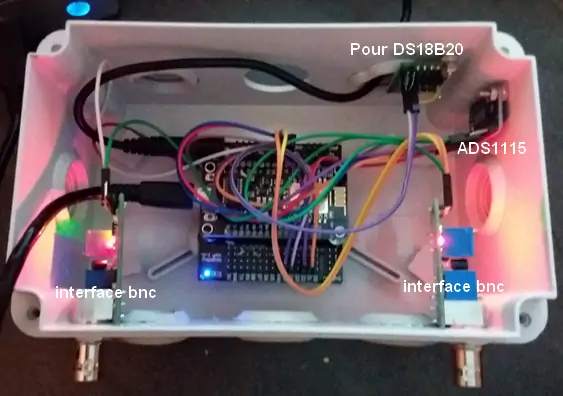
.. |image1439| image:: ../img/image1439.webp
   :width: 605px
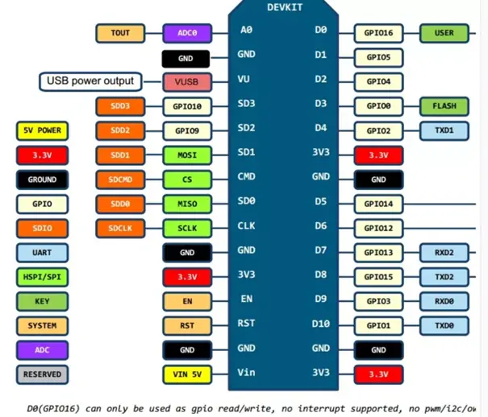
.. |image1441| image:: ../img/image1441.webp
   :width: 605px
.. |image1442| image:: ../img/image1442.webp
   :width: 605px
.. |image1443| image:: ../img/image1443.webp
   :width: 605px
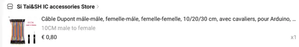
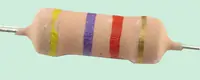
.. |image1446| image:: ../img/image1446.webp
   :width: 605px
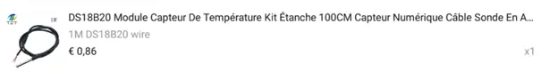
.. |image1448| image:: ../img/image1448.webp
   :width: 270px
.. |image1449| image:: ../img/image1449.webp
   :width: 294px
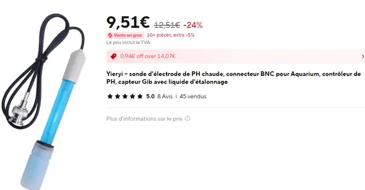
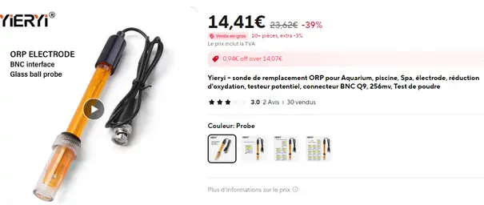
.. |image1452| image:: ../img/image1452.webp
   :width: 605px
.. |image1453| image:: ../img/image1453.webp
   :width: 605px
.. |image1454| image:: ../img/image1454.webp
   :width: 600px
.. |image1455| image:: ../img/image1455.webp
   :width: 605px
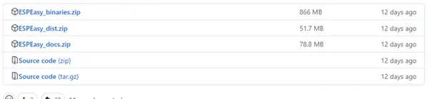
.. |image1457| image:: ../img/image1457.webp
   :width: 605px
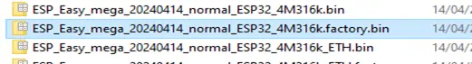
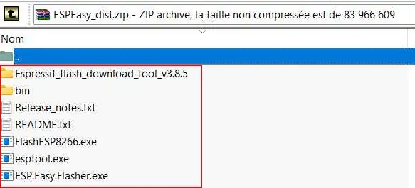
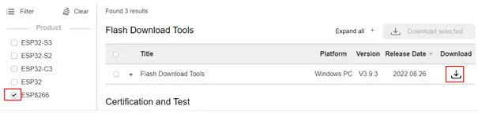
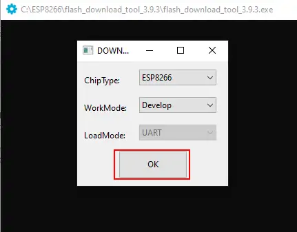
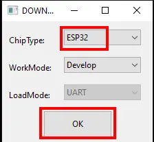
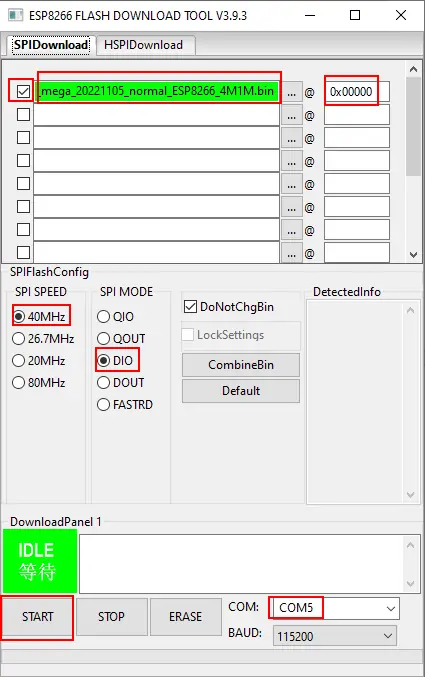
.. |image1464| image:: ../img/image1464.webp
   :width: 372px
.. |image1465| image:: ../img/image1465.webp
   :width: 306px
.. |image1466| image:: ../img/image1466.webp
   :width: 429px
.. |image1467| image:: ../img/image1467.webp
   :width: 372px
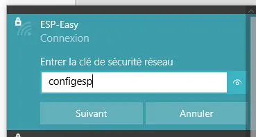
.. |image1469| image:: ../img/image1469.webp
   :width: 569px
.. |image1470| image:: ../img/image1470.webp
   :width: 605px
.. |image1471| image:: ../img/image1471.webp
   :width: 605px
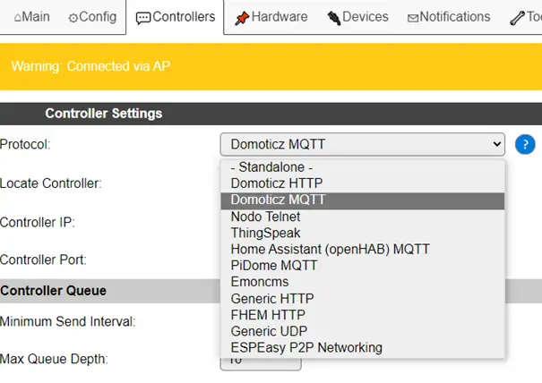
