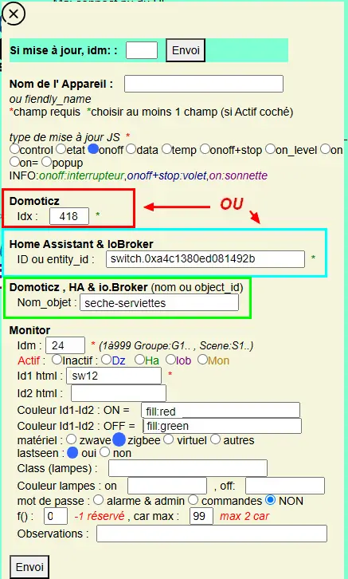

15. EXEMPLES
------------
15.1 ajout d’un dispositif
^^^^^^^^^^^^^^^^^^^^^^^^^^
15.1.1 Ajout d’un contact de porte supplémentaire
=================================================
|image878|

Dans Domoticz le dispositif est ajouté au plan :

|image879|

|image880|

15.1.1.1 Modifier l’image
"""""""""""""""""""""""""
-	*On effectue (avec Notepad par exemple) une sauvegarde de l’image* 

|image881|

-	*Avec Inkscape, ouvrir et modifier l’image*

|image882|

- *Faire un copier/coller d’un dispositif existant ou importer une icone*

|image883| |image884|

- *Placer l’icône et renseigner l’ID*

|image885|

- *Pour la couleur*

|image886|

- *Sauvegarder l’image dans le fichier PHP d’origine, en supprimant la ligne XML*

|image887|

15.1.1.2 Dans la Base de données SQL
""""""""""""""""""""""""""""""""""""
*Insérer le dispositif dans la table « dispositifs »*

|image888|

15.1.1.3 Dans le fichier PHP de l’image 
"""""""""""""""""""""""""""""""""""""""
*On ajoute un onclick pour l’affichage des propriétés*

.. note::

   avec Inkscape, il est possible de l’ajouter lors de la création de l’image si l’on a déjà choisi l’ID monitor.

   Ce n’est pas important, il faut ouvrir de toute façon cette image pour ajouter un cercle clignotant pour la gestion de la pile.

.. code-block::

   <g
   id="ouverture_porte_sejour"
   onclick="popup_device(7)"

|image890|

On peut vérifier que l’iD pour la couleur est bien présent

|image891|

Pour le cercle le plus simple c’est de faire un copier/coller d’un cercle existant avec des coordonnées facile à retrouver et avec une opacité à 1 

Voir paragraphe :ref:`2.1.1.b avec Adobe Illustrator`

|image892|

Avec F12 du navigateur ajuster la position

|image893| |image894|

15.1.2 Ajout d’un Panic bouton (SOS)
====================================
le bouton zigbee utilisé: https://www.zigbee2mqtt.io/devices/BT400B.html

les données envoyées par le dispositif:

|image185|

|image184|

.. IMPORTANT::

   Ce panic button est un sensor; si le fonctionnement est simple dand domoticz (passage à Off lors d'un appui sur le bouton suivi d'un retour à On ) ,dans Home Assistant c'est plus compliqué (réception de l'appel mais renouvellement toutes les 4 heures de l'action (envoi d'un SMS ici)

  |image1386| 

réception d'un SMS :

|image1385|

15.1.2.1 Utilisation du bouton dans Domoticz 
""""""""""""""""""""""""""""""""""""""""""""

pour Domoticz : soit on utilise une icone disponible, soit on ajoute au fichier :darkblue:`www/switch_icons.txt` une icone perso.( voir ci dessous le mode d'emploi)

|image73|

.. admonition:: Icônes personnalisées pour Domoticz

   Les images téléversées dans le dossier "images" de DZ doivent être au format **png de 48x48 px**

   |image104|

   Ajouter les informations concernant l'icone dans le fichier :darkblue:`switch_icons.txt` comme indiqué ci-après:

   |image105|

Le script lua pour envoyer une alerte SMS et mail

.. code-block::

   if (device.name == 'SOS (Action)_emergency') then 
      txt='alarmeùSOS';obj='alarme SOS';alerte_gsm(txt);domoticz.email('Alarme',obj,adresse_mail) 
   end

LE script :darkblue:`notifications_devices.lua` :

|image109|

Voir le § :ref:`13.6 SMS réception et émission` , concernant l'envoi d'un SMS

15.1.2.2 Utilisation du bouton dans Home Assistant 
""""""""""""""""""""""""""""""""""""""""""""""""""
On récupère l'entity_id 

|image189|

Création d'une automation pour envoyer le SMS (seul un changement d'état se produit , une chaine vide est envoyée, d'où le trigger sans indiquer l' état) :

.. code-block::

  - id: alarme_sos
    alias: sos_gsm
    trigger:
    - platform: state
      entity_id: sensor.sos_action
    condition: []
    action:
    - service: shell_command.set_aldz
      data:
        msg: "SOS" 

.. note:: 

   l'envoi du SMS est défini dans :darkblue:`configuration.yaml` :

   .. code-block::
      
      shell_command:
          set_aldz:
            "./pyscript/aldz.bash '\"{{ msg }}\"' "

   le fichier bash :darkblue:`aldz.sh`:

   ..  code-block::

       #! /bin/bash
       printf '#!/usr/bin/env python3 -*- coding: utf-8 -*- \nx='$1'\npriority=1' >  /config/pyscript/aldz.py

   le fichier python :darkblue:`aldz.py` :

   .. code-block::

      #!/usr/bin/env python3 -*- coding: utf-8 -*-
      x='0'
      priority=0

   Voir le § :ref:`13.6.2 émission SMS` pour des explications concernant le script sms_dz.py (utilisé aussi par Domoticz)

15.1.2.3 Utilisation du bouton dans io.broker 
"""""""""""""""""""""""""""""""""""""""""""""

.. important::

   J'utilise les mêmes scripts python décrits précédemment aussi python3 et pip(si besoin) doivent être installés.

   Sous debian 12 , pour verifier la version installée à l'installation: 

   .. code-block::

      python3 --version

   pour installer pip:

   .. code-block::

     apt install python3-pip -y 

   Des modules doivent aussi avoir été installés:

   .. code-block::

      import requests , time ,json, os, chardet, shutil
      from periphery import Serial
      import importlib

   Sous dbian 12, il faut au préalable créer un environnement virtuel; ici je ke crée dans le répertoire /opt/python dans lequel j'ai déjà installeé les scripts

   .. code-block::

      apt install python3-venv 
      python3 -m venv env
      source env/bin/activate 
   
   |image1512|

   Sous debian 12 periphery peut être installé avec apt ou avec pip; si il est installé avec apt il devra tout de même être installé dans l'environnement.

   .. code-block::

      apt-get install python3-periphery

   |image1511|

   |image1513|

15.1.2.3.1 script sms_dz modifié 
~~~~~~~~~~~~~~~~~~~~~~~~~~~~~~~~
Ce script  a été écrit pour Domoticz aussi les répertoires utilisés peuvent être différent sous io.broker

|image1514|

15.1.2.3.2 script js dans io.broker
~~~~~~~~~~~~~~~~~~~~~~~~~~~~~~~~~~~

.. important::

   le moteur de script JS doit être installé

   |image1515|

le script :

.. code-block::

   var sos ='zigbee2mqtt.0.0xa4c138be9958ad84.emergency'/*sos*/;
   var sos_state = String(getState(sos).val);
   on({id: sos/*emergency*/}, function (obj)
   {   if(sos_state == 'true')
     {
    const fs = require('fs');
    var txt = "sos";
    fs.writeFile('/opt/python/aldz.py', '#!/usr/bin/env python3 -*- coding: utf-8 -*-\nx="'+txt+'"\npriority=1', (err) => {
	if (err) throw err;
	console.log('erreur');});
     }
     });

|image1516|

15.1.2.3.3 script systemd pour le démarrage automatique
~~~~~~~~~~~~~~~~~~~~~~~~~~~~~~~~~~~~~~~~~~~~~~~~~~~~~~~
C'est également le même script que pour Domoticz en adaptant le répertoire utilisé.

.. code-block::

   [Unit]
   Description=commande iob par sms
   After=multi-user.target
   [Service]
   Type=idle
   ExecStart=/usr/bin/python3 /opt/python/sms_dz.py > /root/sms_dz.log 2>&1
   [Install]
   WantedBy=multi-user.target

Pour lancer un service au démarrage, utilisez la commande enable :

.. code-block::

   systemctl enable sms_dz.service

.. note::

   ne démarrer sms_dz que sur un seul system domotique

15.1.2.4 Utilisation du bouton dans Monitor 
"""""""""""""""""""""""""""""""""""""""""""

|image119|

Dans admin/config.php

.. code-block::

   define('ON_SOS',true);// bouton sos page accueil, le disositif dit être enregistré dans SQL

Les valeurs du dispositif enregistrées dans la BD monitor:

|image132|

L'mage du bouton dans le plan intérieur :

|image133|

Extrait du SVG concernant le SOS:

.. code-block::

   <g>
	<g class="sos_urg" onclick="popup_device(91)">
		<path class="st20" d="M678.1,152.5L678.1,152.5c11.8,0,21.3,9.4,21.3,21l0,0c0,11.6-9.6,21-21.3,21l0,0c-11.8,0-21.3-9.4-21.3-21
			l0,0C656.8,161.9,666.3,152.5,678.1,152.5z"/>
	</g>
		<g id="SOS1">
		<g>
			<g transform="translate(0.000000,511.000000) scale(0.100000,-0.100000)">
				<path class="st68" d="M6718.4,3521.9c-70.1-7.8-121.5-75.7-110.1-145.6c8.2-49.9,46.7-90.9,95.7-101.9c3.9-0.9,7.6-2.1,8.4-2.7
					c0.7-0.6,7.5-8.7,15.1-18.1c7.6-9.4,15.6-18.8,17.8-20.9c4.4-4.4,8.5-6.2,11.3-4.9c0.8,0.4,10.8,12.1,22,26.1l20.4,25.4h15.1
					c18.6,0.1,32.5,1,41.6,2.8c37.2,7.5,69.7,31.8,86.5,64.8c22.5,44.4,15.7,96.5-17.6,134c-20.3,23-50,37.9-81.6,41.1
					C6834.3,3522.9,6726.3,3522.9,6718.4,3521.9z M6853.3,3509.7c30.3-6.6,55.5-23.2,72.1-47.6c17.6-25.9,23.2-57.6,15.3-88.1
					c-9.1-35.6-38-66.1-73.5-77.5c-15.3-4.9-24.6-6-51.4-6c-13,0-20.6-0.3-21.5-0.8c-1.1-0.6-24.6-29-39.2-47.4l-1.5-2l-1.9,1.7
					c-1,0.9-7.4,8.5-14.1,16.9c-13.4,16.5-18.5,22.2-21.3,23.6c-1,0.5-4.4,1.4-7.5,2.1c-39.1,7.8-72,37-85,75.3
					c-4.7,13.9-5.6,20-5.6,36.3c0,12.5,0.2,15.6,1.6,21.8c3.4,16,9.5,30.1,18.5,43.5c7.3,10.7,21.3,24.5,32.2,31.6
					c14.9,9.7,31.1,15.7,48.2,18c1.2,0.2,30.3,0.3,64.8,0.2C6845.6,3511.3,6846.2,3511.2,6853.3,3509.7z"/>
				<path class="st68" d="M6677.1,3443.7c-7.5-2.7-13-7.8-16.7-15.3c-2-4.2-2.2-5.1-2.2-11.9c0-7,0.1-7.5,2.7-12.6
					c3-6.1,7.5-10.5,13.7-13.5c4-1.9,4.1-1.9,21.4-2.3l17.4-0.3l2.1-2c3.4-3.2,4.6-7.4,4.6-15c0-3.6-0.4-7.9-0.9-9.6
					c-1.2-3.9-4.6-7.6-7.7-8.5c-1.5-0.4-11.3-0.7-22.7-0.7c-20.1,0-20.1,0-21.6-1.6c-2-2-2-4.6-0.1-7l1.5-1.9l23.4,0.2
					c26.7,0.2,26.3,0.1,32.3,6.8c4.9,5.3,6.3,9.6,6.7,20.3c0.3,7.6,0.1,9.4-1.2,13.6c-2.2,7.2-5.1,11.1-10.5,13.8l-4.5,2.3h-14.9
					c-16.7,0-19.6,0.5-24.3,4.1c-3.9,3-6.8,8.9-6.8,13.9c0,5,2.9,10.9,6.8,13.9c4.7,3.7,7.4,4.1,26.7,4.1c9.6,0,17.9,0.2,18.6,0.4
					c3.2,1.2,3.4,7.7,0.4,9.3c-0.8,0.4-9.4,0.7-20.9,0.7C6683.1,3445,6680.3,3444.8,6677.1,3443.7z"/>
				<path class="st68" d="M6772.9,3444.1c-8.3-2.8-14.6-8.1-18.2-15.6l-2.3-4.6v-30.5v-30.5l2.3-4.6c2.9-6.1,8-11.1,14.1-13.9
					c4.4-2.1,5.3-2.2,12.1-2.2c6.8,0,7.7,0.1,12.1,2.2c6.2,2.8,11.3,7.8,14.1,13.9l2.3,4.6v30.5v30.5l-2.3,4.6
					c-2.9,6.1-8,11.1-14.1,13.9c-4,1.9-5.6,2.2-11.1,2.4C6778.2,3445,6774.7,3444.7,6772.9,3444.1z M6789.8,3432
					c3.4-1.9,5.6-4.1,7.9-8.5c1.3-2.2,1.3-4.4,1.3-30.2c0-25.7-0.1-27.9-1.3-30.2c-2.4-4.4-4.4-6.6-8.2-8.7
					c-5.3-2.8-11.4-2.8-16.7,0c-3.8,2.1-5.8,4.2-8.2,8.7c-1.2,2.2-1.3,4.6-1.5,27c-0.1,13.5-0.1,26.2,0.2,28.2
					c0.6,5.3,4.1,10.5,8.7,13.2c2,1.2,4.6,2.4,5.6,2.5C6781,3434.8,6786.3,3433.8,6789.8,3432z"/>
				<path class="st68" d="M6850.9,3444c-13.3-4-22.4-18.4-20-31.7c1.7-9.4,8.2-18,16.7-21.9c3.9-1.8,4.6-1.9,19.6-2.2
					c12.5-0.3,15.9-0.6,17.6-1.5c6.5-3.5,9.6-11.6,8.1-21.8c-0.4-2.9-1.4-6.5-2.3-8c-2.6-4.6-3.4-4.8-27.3-4.8
					c-12.5,0-21.7-0.3-22.5-0.7c-3.3-1.7-2.7-8.5,0.8-9.4c0.9-0.2,11.9-0.3,24.5-0.2l22.9,0.2l3.4,1.8c4.2,2.1,7.4,6,9.5,11.5
					c1.9,4.9,2.7,16.8,1.5,22.3c-1.8,8-7,15.1-13.8,18.7c-3.4,1.8-3.9,1.9-19.4,2.2c-17.6,0.4-19,0.8-23.6,5.7
					c-3.8,4-4.9,6.6-4.9,12.3c0,3.7,0.4,5.9,1.3,7.6c1.8,3.4,5.2,6.8,8.5,8.5c2.7,1.5,3.9,1.5,22.3,1.7l19.6,0.2l1.4,1.8
					c1.8,2.3,1.8,4.4-0.1,6.7l-1.4,1.8l-19.8-0.1C6859.4,3445,6853,3444.7,6850.9,3444z"/>
			   </g>
		   </g>
	   </g>
   </g>

Le style:

.. code-block::

    

15.2 Ajout d'une commande ON-OFF
^^^^^^^^^^^^^^^^^^^^^^^^^^^^^^^^
A partir d'une prise ce courant Zigbee pour alimenter le seche-serviette de la SDB.

|image498|

La prise Zigbee dans Domoticz:

|image499|

La prise Zigbee dans Home Assistant

|image505|

L'image SVG du seche-serviette:

|image607|

On possède maintenant les élément pour enregistrer la prise dans la base SQL:

|image506|

On ajoute le dispositif sur le MUR de Commandes , entre les balises <ul> ...>/ul> :

.. code-block::

   <li style="margin-left:150px;margin-top:-660px"><a href="#murinter"><?php include ("seche-serviettes_svg.php");?></li>

Pour avoir un retour en temps réel d'un changement de position de la prise ( ajout temporisation, mise à jour lors de l'extinction,etc,...), on ajoute dans le script LUA concernant les devices:

|image608|

15.3 Réinitialisation des dispositifs dans Domoticz
^^^^^^^^^^^^^^^^^^^^^^^^^^^^^^^^^^^^^^^^^^^^^^^^^^^
.. note:: **Exemple** 

   transfert de Domoticz linux vers Domoticz Docker avec Zwave et Zigbee sous docker également, avec la reconnaissance automatique MQTT

   |image895|

Dans ce cas tous les dispositifs changent d’idx dans Domoticz, il faut mettre à jour la table de la base de données : « dispositifs »
.
Pour préparer le travail, faire une copie de la table « dispositifs en l’exportant

|image896|

Modifier le fichier exporté 

|image897|

Importer la nouvelle table  |image898|

**Faire correspondre les nouveaux « idx » de Domoticz avec les « idm « de monitor.**

Dans le fichier de configuration, modifier le nom de la table et la nouvelle IP de Domoticz :

.. code-block::

   define('DISPOSITIFS', 'Dispositifs');
   define('URLDOMOTIC', 'http://192.168.1.76:8086/');//url

.. |image73| image:: ../media/image73.webp
   :width: 400px
.. |image104| image:: ../media/image104.webp
   :width: 400px

.. |image109| image:: ../media/image109.webp
   :width: 700px
.. |image119| image:: ../media/image119.webp
   :width: 479px

.. |image184| image:: ../media/image184.webp
   :width: 454px
.. |image185| image:: ../media/image185.webp
   :width: 516px

.. |image498| image:: ../media/image498.webp
   :width: 400px
.. |image499| image:: ../media/image499.webp
   :width: 400px
.. |image505| image:: ../media/image505.webp
   :width: 400px

.. |image607| image:: ../media/image607.webp
   :width: 700px
.. |image608| image:: ../media/image608.webp
   :width: 700px
.. |image878| image:: ../media/image878.webp
   :width: 350px
.. |image879| image:: ../media/image879.webp
   :width: 348px
.. |image880| image:: ../media/image880.webp
   :width: 528px
.. |image881| image:: ../media/image881.webp
   :width: 665px
.. |image882| image:: ../media/image882.webp
   :width: 356px
.. |image883| image:: ../media/image883.webp
   :width: 306px
.. |image884| image:: ../media/image884.webp
   :width: 198px
.. |image885| image:: ../media/image885.webp
   :width: 502px
.. |image886| image:: ../media/image886.webp
   :width: 549px
.. |image887| image:: ../media/image887.webp
   :width: 604px
.. |image888| image:: ../media/image888.webp
   :width: 617px
.. |image890| image:: ../media/image890.webp
   :width: 291px
.. |image891| image:: ../media/image891.webp
   :width: 560px
.. |image892| image:: ../media/image892.webp
   :width: 656px
.. |image893| image:: ../media/image893.webp
   :width: 285px
.. |image894| image:: ../media/image894.webp
   :width: 268px
.. |image895| image:: ../media/image895.webp
   :width: 700px
.. |image896| image:: ../media/image896.webp
   :width: 563px
.. |image897| image:: ../media/image897.webp
   :width: 392px
.. |image898| image:: ../media/image898.webp
   :width: 180px
.. |image1385| image:: ../img/image1385.webp
   :width: 300px

.. |image1512| image:: ../img/image1512.webp
   :width: 500px
.. |image1513| image:: ../img/image1513.webp
   :width: 550px
.. |image1514| image:: ../img/image1514.webp
   :width: 400px
.. |image1515| image:: ../img/image1515.webp
   :width: 323px

