6. GRAHIQUES & BASE DE DONNEES
------------------------------
|image523|

Voir ces pages pour installer les scripts :
-	 http://domo-site.fr/accueil/dossiers/40
-	 http://domo-site.fr/accueil/dossiers/42

|image524|

|image525|

.. admonition:: **Prérequis**

   -	Jpgraph est installé avec le cache |image526|

   -	php-gd est installé |image527|

   -	la bibliothèque python fabric est importé

   -	le module python mysql.connector est importé

6.1 Les table SQL
^^^^^^^^^^^^^^^^^
.. warning::

   Pour le nom des tables concernant les graphiques, NE PAS UTILISER le CARACTERE –(moins)

   Ce caractère est utilisé comme séparateur pour l’indication de l’ensemble table-champ pour les graphiques

   |image528|

   **En absence de champ c’est le champ « valeur » qui est utilisé sinon** :

   Value= « <TABLE>-<CHAMP> »

|image529|

*Avec 2 champs ou 3 champs*

|image530| |image531|

**Création de la table avec phpMyAdmin** :*exemple*

.. code-block:: 

   CREATE TABLE `pression_chaudiere` (
  `num` int(5) NOT NULL,
  `date` timestamp NOT NULL DEFAULT current_timestamp() ON UPDATE current_timestamp(),
  `valeur` varchar(4) NOT NULL
   ) ENGINE=InnoDB DEFAULT CHARSET=utf8;
   ALTER TABLE `pression_chaudiere` CHANGE `num` `num` INT(4) NOT NULL AUTO_INCREMENT, add PRIMARY KEY (`num`);

6.2 Dans Domoticz
^^^^^^^^^^^^^^^^^
Les données à enregistrer peuvent provenir de capteurs réels ou virtuels. Pour éviter un trop grand nombre de valeurs, il est utile pour certains dispositifs, de créer des variables pour comparer les valeurs et les limiter aux valeurs entières (c’est le cas de la météo Darsky, des capteurs de température Onoff).

Pour utiliser des données de la base SQL, il faut au préalable les avoir enregistrées depuis Domoticz : c’est le rôle de la bibliothèque Python :darkblue:`fabric` 

Pour l'installer (pip est déjà installé):

.. code-block::

   sudo pip3 install fabric

Une fois un premier enregistrement crée, pour une température, dans la base, il suffit pour un nouvel enregistrement d’une autre t° d’ajouter dans le script LUA « évènement /:darkblue:`NOM_DU SCRIPT` » cette T°

**Depuis la version 2023-2 de Domoticz le script a été réécrit en dzvent**

*pour info Extrait du script en lua*:

.. code-block::

   package.path = package.path..";www/modules_lua/?.lua"
   require 'datas'
   require 'string_tableaux'
   data0=pression;data1=d_linky
   year 	= tonumber(os.date("%Y"));
   month 	= os.date("%m");
   day 	= os.date("%d");
   hour 	= os.date("%H");
   min 	= os.date("%M");
   sec     = os.date("%S");
   weekday = tonumber(os.date("%w"));
   time    = os.date("%X");
   datetime = year.."-"..month.."-"..day.." "..time;
   --
    function write_datas(data0,data1)
   f = io.open("www/modules_lua/datas.lua", "w")
   f:write('pression='..data0..';d_linky='..data1)
   f:close()
   end
   function envoi_fab(don)
	print ("maj valeur:"..don);
        local command = "/bin/bash userdata/scripts/bash/./fabric.sh"..don.." > /home/michel/fab.log 2>&1";
        os.execute(command);
        os.execute("python3 scripts/python/pushover.py "..txt.." >> /home/michel/push.log 2>&1");
   end
   function round(num,numDecimal)
   local mult = 10^(numDecimal or 0)
   return math.floor(num * mult + 0.5) / mult
   end
   function Split(s, delimiter)
    result = {};
    for match in (s..delimiter):gmatch("(.-)"..delimiter) do
        table.insert(result, match);
    end
    return result;
  end 
  commandArray = {}
  t = {};
   --donnees={['pression']='1.2'};write_datas('{["pression"]="'.."1.2"..';}')
   -- libelle=table#champ
   -- si 2 champs , ajouter ..'#champ2#"..split_str[2] après datetime.. 
   -- exemple "don=" "..libelle.."#"..tostring(deviceValue).."#"..datetime.."#champ2#"..split_str[2]
   for deviceName,deviceValue in pairs(devicechanged) do
    if (deviceName=='pir_salon_temp') then
        print ("temp_salon:"..deviceValue);
	    libelle="temp_salon#valeur";don=" "..libelle.."#"..tostring(deviceValue).."#"..datetime
        envoi_fab(don)
   ...... 

|image534|

**Le script en DzVent "export_dev_sql"**

.. code-block::

   --
   --[[
   export_dev_sql]]
   --
   package.path = package.path..";www/modules_lua/?.lua"
   require 'datas'
   require 'string_tableaux'
   data0=pression;
   year 	= tonumber(os.date("%Y"));
   month 	= os.date("%m");
   day 	= os.date("%d");
   hour 	= os.date("%H");
   min 	= os.date("%M");
   sec     = os.date("%S");
   weekday = tonumber(os.date("%w"));
   time    = os.date("%X");
   datetime = year.."-"..month.."-"..day.." "..time;
   function write_datas(data0)
   f = io.open("www/modules_lua/datas.lua", "w")
   f:write('pression='..data0)
   f:close()
   end
   function round(num,numDecimal)
   local mult = 10^(numDecimal or 0)
   return math.floor(num * mult + 0.5) / mult
   end

   function envoi_fab1(libelle,valeur)
    don=" "..libelle.."#"..valeur.."#"..datetime
	print("maj valeur:"..don);
        command = "/bin/bash userdata/scripts/bash/./fabric.sh "..don.." > /home/michel/fab.log 2>&1";
        os.execute(command);
   end
   return {
	on = {
		devices = {
			'temp_cave',
			'temp_cuisine_ete',
			'temp_cellier',
			'TempHumBaro',
			'pir_salon_temp',
			'pir ar cuisine_temp',
			'pression_chaudière',
			'PH_Spa',
			'Redox_Spa'
		}
	},

       execute = function(domoticz, item)
        domoticz.log('item '..item.name..' was changed', domoticz.LOG_INFO)
            
        if (item.name=='temp_cuisine_ete') then 
        -- choix nb decimales apres la virgule 
        -- local temp=round(deviceValue, 1)
           valeur=tostring(round(item.temperature, 0))
            if (domoticz.variables('temp_cuis_ete').value ~= valeur) then
            domoticz.variables('temp_cuis_ete').set(valeur) 
    	    libelle="temp_cuis_ete#valeur";
    	    envoi_fab1(libelle,valeur) 
            end       
        elseif (item.name=='temp_cave') then 
           --local valeur=round(item.temperature, 1)
          valeur=tostring(round(item.temperature, 0))
            if tostring(valeur)~=domoticz.variables('temp_cave').value then
            domoticz.variables('temp_cave').set(tostring(valeur))
    	    libelle="temp_cave#valeur";
    	   envoi_fab1(libelle,valeur) 
            end  
       elseif (item.name=='temp_cellier') then 
        -- local valeur=round(deviceValue, 1)
           valeur=tostring(round(item.temperature, 0))
            if tostring(valeur)~=domoticz.variables('temp_cellier').value then
            domoticz.variables('temp_cellier').set(tostring(valeur))    
    	    libelle="temp_cellier#valeur";
            envoi_fab1(libelle,valeur) 
            end
       elseif (item.name=='TempHumBaro') then 
            valeur=tostring(round(item.temperature, 0))
            if valeur~=domoticz.variables('temp_meteo').value then
            domoticz.variables('temp_meteo').set(valeur)   
    	    libelle="temp_meteo#valeur";
    	    envoi_fab1(libelle,valeur) 
            end
       elseif (item.name=='pir_salon_temp') then
        valeur=tostring(round(item.temperature, 0))
        if tostring(valeur)~=domoticz.variables('temp_salon').value then
           domoticz.variables('temp_salon').set(tostring(valeur))    
            libelle="temp_salon#valeur";
           envoi_fab1(libelle,valeur)  
        end
       elseif (item.name=='pir ar cuisine_temp') then 
        valeur=tostring(round(item.temperature, 0))
        if tostring(valeur)~=domoticz.variables('temp_ar_cuisine').value then
            domoticz.variables('temp_ar_cuisine').set(tostring(valeur))    
	        libelle="temp_cuisine#valeur";
            envoi_fab1(libelle,valeur) 
        end
   ...
   ...
    end       
   }
   
|image783| 

.. important:: **Nom pour les fonctions DzVent**

   le même nom ne peut pas être utilisé pour 2 fonctions dans des scripts DzVents (mêmes différents). 

Pour limiter le nb d’enregistrements :

|image535|

Dans cet exemple, il a été créer plusieurs variables qui permettent des enregistrements dans la BD à chaque changement de valeurs limité au degré.:

|image536|

6.2.1 fabric
============

.. admonition:: **Le script fabric.sh**

   installé ici dans le répertoire « scripts » de Domoticz

   |image537|

   .. code-block::

      #!/bin/bash

      echo $1
      echo $2
      a="#"
      c=$1$a$2
      echo $c
      cd /home/michel/python
      fab maintask --don=$c  > /home/michel/fab.log 2>&1

   Pour tester le script, il est plus facile de travailler dans le répertoire USER, c’est l’objet de la création du lien symbolique vers le dossier python de Domoticz

   |image538|

   |image539|

.. admonition:: **Le script fabfile.py**

   |image540|

   .. code-block::

      #!/usr/bin/env python2.7
      # -*- coding: utf-8 -*-
      from fabric import Connection
      from fabric.tasks import task
      @task
      def subtask(ctx, donn):
        with ctx.cd("/www/monitor/python"):
          ctx.run(donn)
      @task( optional = ['don'])
      def maintask(ctx, don = None ):
        con = Connection(host = '192.168.1.7', user = 'michel', connect_kwargs = {'password':'PASS'})
        file = "python3 sqlite_mysql.py "
        donn = file+don
        print(subtask(con,donn))

   *Le script fabfile.py appelle sur le serveur qui héberge la BD le script sqlite_mysql.py*;

**sqlite_mysql.py n’est exécuté que lorsqu’il est appelé, il n’écoute pas en permanence si des données sont envoyées**

|image541|

**POUR RESUMER** : sur le serveur de Domoticz

- script LUA->MENU Domoticz évènements

- script fabric.sh-> ../domoticz/scripts/

- script fabfile.py->../domoticz/scripts/python/   avec ls /home/USER/python/

-  fab.log-> /home/USER

6.3 Sur le serveur de la base de données
^^^^^^^^^^^^^^^^^^^^^^^^^^^^^^^^^^^^^^^^
Le serveur Nginx avec aussi Monitor,

réception des datas : Le script python :darkblue:`sqlite_mysql.py` :

.. code-block::

   #!/usr/bin/env python3
   # -*- coding: utf-8 -*-
   import sys
   import mysql.connector
   from mysql.connector import Error
   total_arg = len(sys.argv)
   if (total_arg>0) :
       x= str(sys.argv[1])
       temp = x.split('#')
       table=temp[0]
       champ=temp[1]
       val1=temp[2]
       val=temp[3]+" "+temp[4]
   if (len(temp)==7) :
       champ2=temp[5]
       val2=temp[6]
   try:
       connection = mysql.connector.connect(
             host = "127.0.0.1",
             user = "michel",
          password = xxxxxxxx",
          database = "domoticz")

       if connection.is_connected():
           db_Info = connection.get_server_info()
           print("Connected to MySQL Server version ", db_Info)
           cursor = connection.cursor()
           cursor.execute("select database();")
           record = cursor.fetchone()
           print("You're connected to database: ", record)
           if (len(temp)==7) :
               query = "INSERT INTO "+table+" (date,"+champ+","+champ2+") VALUES(%>
               values = (val, val1, val2)
           else :
               query = "INSERT INTO "+table+" (date,"+champ+") VALUES(%s, %s)"
               values = (val, val1)
           cursor.execute(query, values)
       connection.commit()
       print(cursor.rowcount, "Record inserted successfully into Laptop table")
   except Error as e:
       print("Error while connecting to MySQL", e)
   finally:
       if (connection.is_connected()):
           cursor.close()

|image542|

6.4 Dans Monitor
^^^^^^^^^^^^^^^^
Le cache pour jpgraph est présent :

|image543|

Jpgraph est installé à la racine de monitor

|image544|

6.4.1 la page graphique.php
===========================

|image545|

- *css*

.. code-block:: 

   #graphic{color:white;}
   graphique_img{max-width:700px;margin:0 1px 0 1px,;width:100%;}
   graphiques{background-color: green;}

6.4.2 la fonction graph
=======================
**dans fonctions.php** et appelée par ajax.php, la fonction :darkblue:`graph()`

.. code-block::

   if ($app=="graph") {graph($device,$variable);}

|image548|

**L'accès à base de données**, le fichier PHP: :darkblue:`include/export_tab_sqli.php` et traitement des données par la BD

https://raw.githubusercontent.com/mgrafr/monitor/main/include/export_tab_sqli.php

|image549|

*Suite de graph()*

|image550|

.. hint::

   La documentation sur jpgraph : https://jpgraph.net/download/manuals/chunkhtml/index.html

6.4.3 autres fichiers PHP
=========================
- index_loc.php (en général ne pas modifier)

- config.php, header.php (en général ne pas modifier)

   Mettre la variable à « true » dans config.php

|image551|

6.4.4 copies d’écran
====================

|image552|

|image553|

|image554|

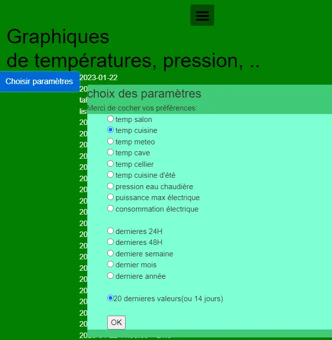

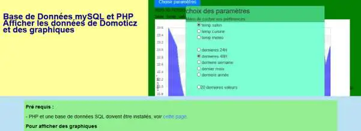
.. |image526| image:: ../media/image526.webp
   :width: 210px
.. |image527| image:: ../media/image527.webp
   :width: 300px
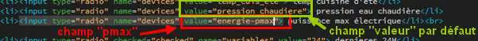
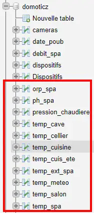
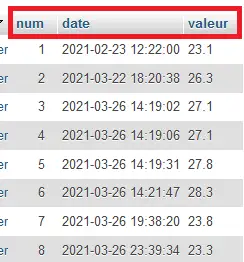
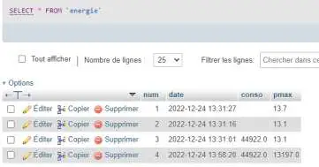
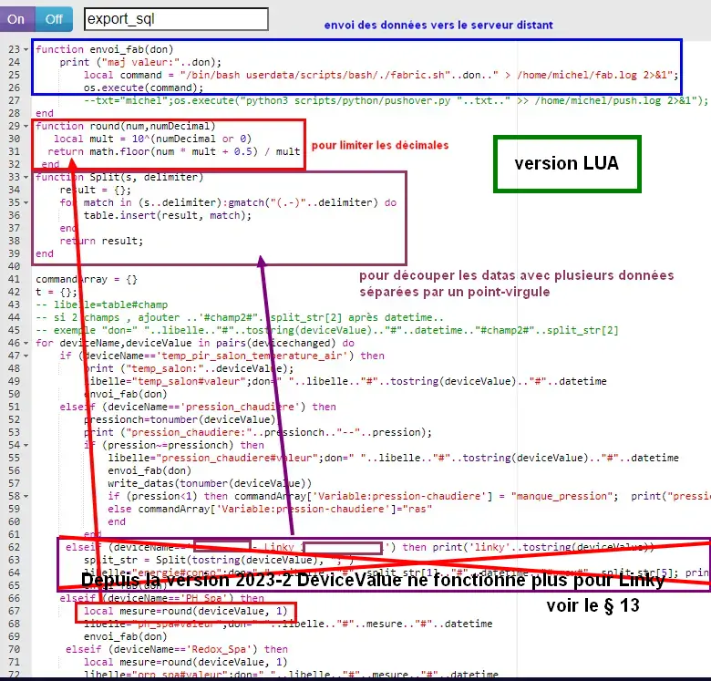
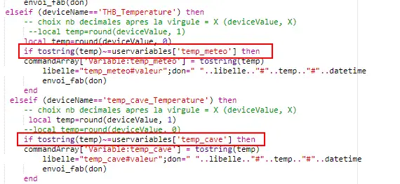
.. |image536| image:: ../media/image536.webp
   :width: 478px
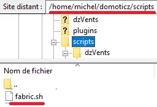
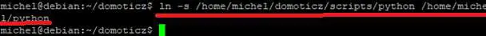
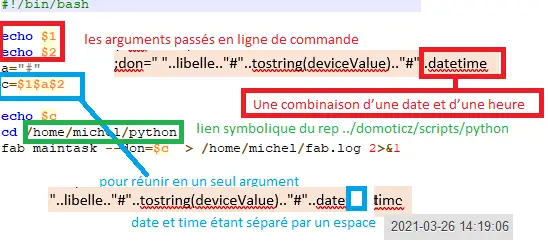
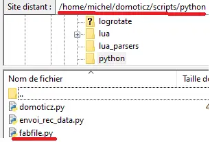
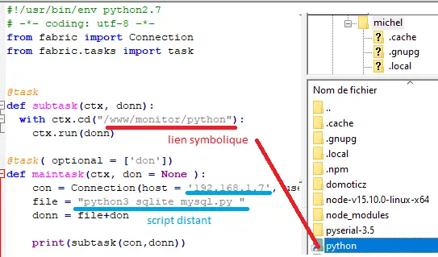
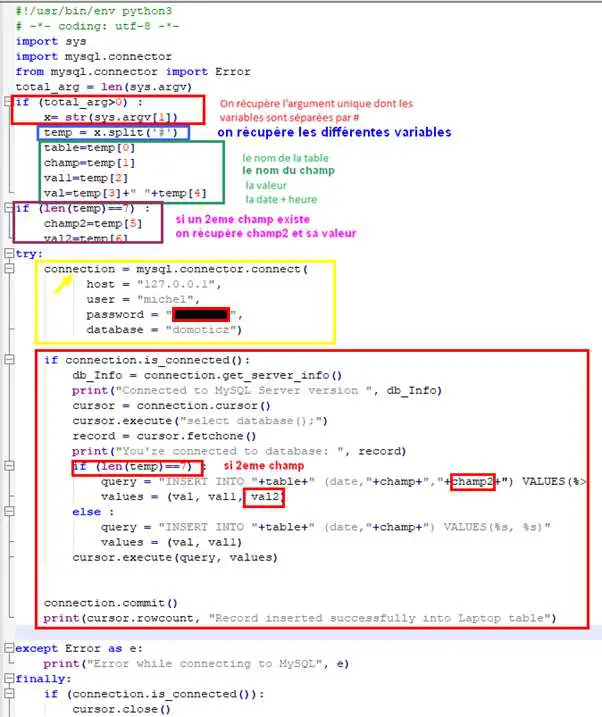
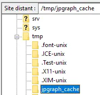
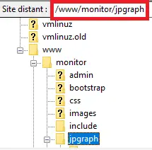
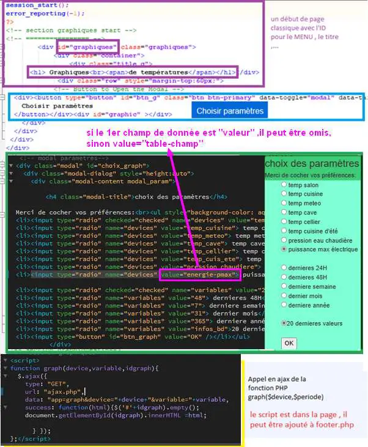
.. |image548| image:: ../media/image548.webp
   :width: 700px
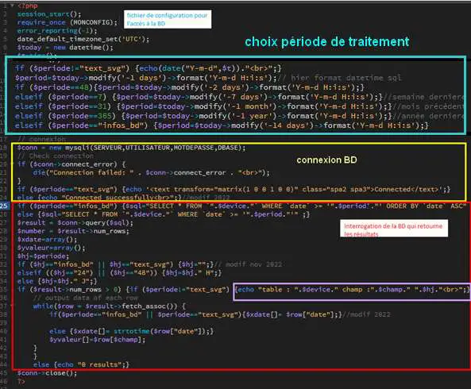
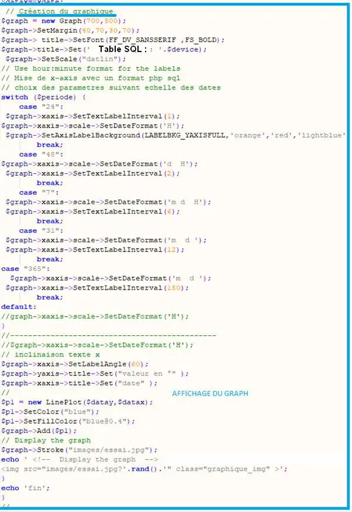
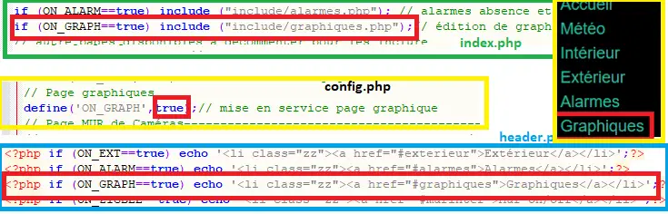
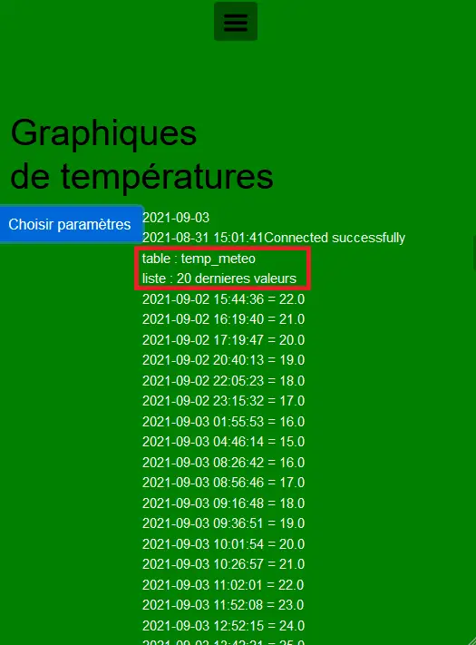
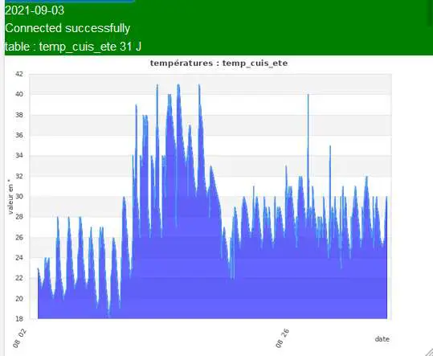
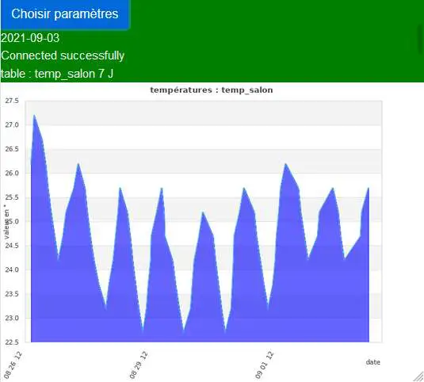
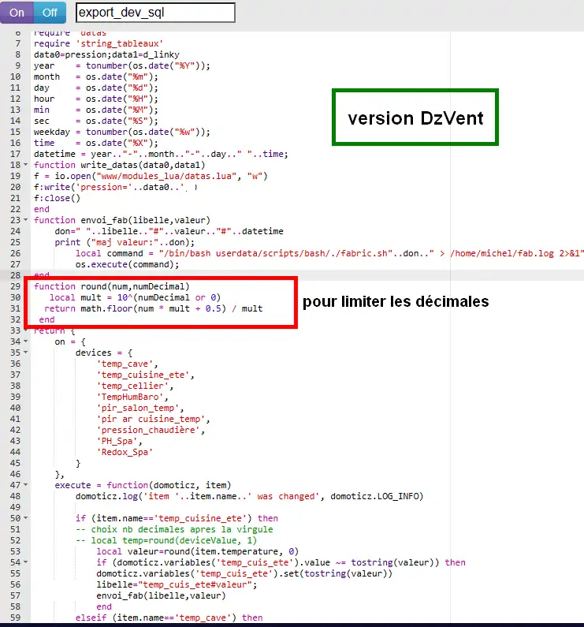
