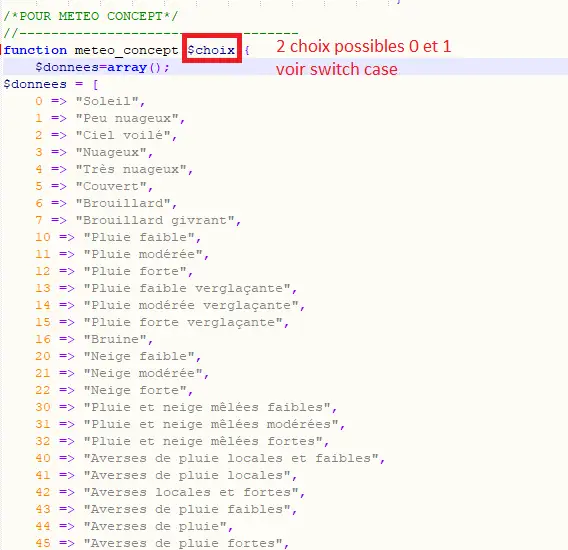
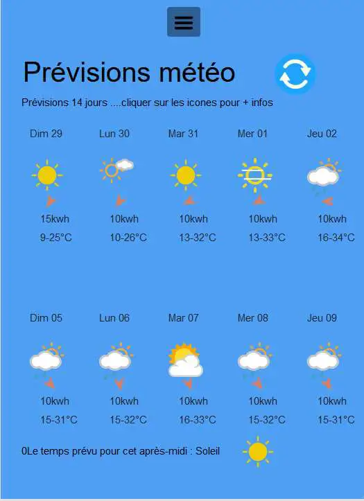
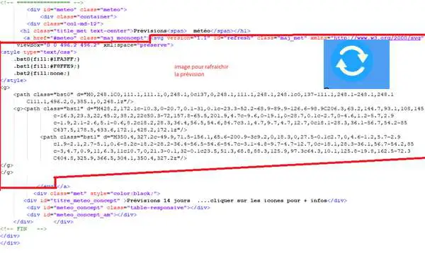
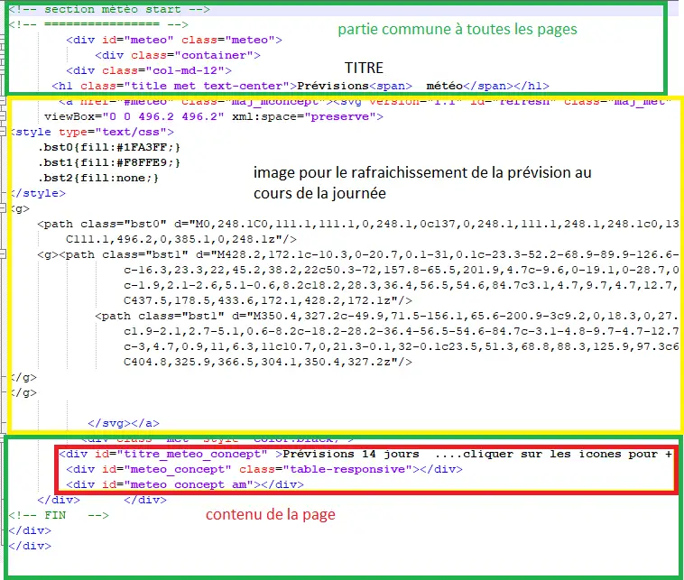

3. Météo
--------
2 affichages :

- Une page de prévision à 14 jours de Météo Concept

- Une alerte pluie imminent (à 1 h de météo France)

3.1 Page météo
^^^^^^^^^^^^^^^
Cette page n’a PAS DE LIAISON AVEC DOMOTICZ

Voir également le site domo-site.fr

|image366|

*L’API est gratuite chez Météo Concept mais il faut s’enregistrer pour obtenir une clé*

- **La fonction  PHP : dans fonctions.php**

|image367|

|image368|

- **Le JS dans footer.php**

|image369|

Pour la mise à jour auto chaque matin :

|image370|

- **Le HTML de la page meteo**

|image371|

l'image SVG de l'icône pour une actualisation:

|image372|

Il faut ajouter la page au site ; la procédure est toujours la même : 

- dans config.php,

  Mettre la variable à « true » ; *il faut au préalable demander un token gratuit*.

.. code-block:: 'fr'

   // Page Météo  meteo concept
   define('ON_MET',true);// affichage page TOKEN PBLIGATOIRE
   // ---Token & code insee
   define('TOKEN_MC','2f**********************************d0');
   define('INSEE','24454');

Dans header.php, l’affichage dans le menu est alors automatique.

.. code-block:: 'fr'

   <?php if (ON_MET==true) echo '<li class="zz"><a href="#meteo">Météo</a></li>';?>

- **La page meteo.php** :

https://raw.githubusercontent.com/mgrafr/monitor/main/include/meteo.php

|image375|

.. |image368| image:: ../media/image368.webp
   :width: 650px 

.. |image370| image:: ../media/image370.webp
   :width: 592px 

