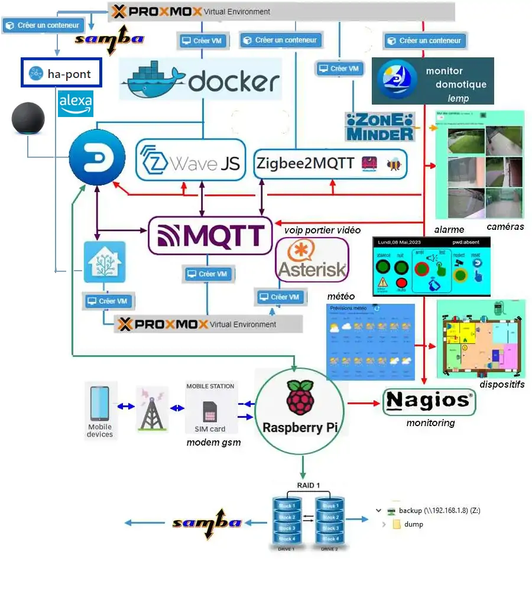

21. – Mon installation
---------------------- 

|image1026|

21.1 Proxmox
^^^^^^^^^^^^
C’est la base du système, il doit être installé en premier, ensuite :

-	Un conteneur, une VM ou une partition classique 

-	Ensuite LEMP 

-	En dernier **monitor**

.. warning:: **Installation de Proxmox** : *assurez-vous que la virtualisation UEFI est activée dans le BIOS*

Pour l'installation: http://domo-site.fr/accueil/dossiers/1

Pour terminer le processus de post-installation de Proxmox VE 7(évite de modifier manuellement les fichiers sources.list  d’apt,) vous pouvez exécuter la commande suivante dans pve Shell.
bash -c "$(wget -qLO - https://github.com/tteck/Proxmox/raw/main/misc/post-pve-install.sh)"

.. seealso:: **sur Github**

   - https://github.com/StevenSeifried/proxmox-scripts

   - https://github.com/tteck/Proxmox

   - https://github.com/StevenSeifried/proxmox-scripts

   |image1027|
 
21.1.1 installation de VM ou CT par l’interface graphique : IP :8006
====================================================================
 
|image1028|

21.1.2 installation automatique de VM ou CT : https://github.com/tteck/Proxmox
==============================================================================
choisir le fichier d’installation : ex Conteneur LXC Debian 11
	 
|image1029|

Copier le lien : |image1030|

Ici : https://github.com/tteck/Proxmox/raw/main/ct/debian.sh

- **Télécharger le script**

.. code-block::

   wget <LIEN>

- **Modifier les droits du fichier** 
	 
.. code-block::

   chmod 777 debian.sh

- **Lancer le script** *et répondre aux questions*
	
|image1033|

21.1.3 installation automatique d’un conteneur LXC,LEMP & Monitor
=================================================================
Voir le § :ref:`0.1.1 installation automatique d’un conteneur LXC +LEMP+ monitor`

21.1.4 Aperçu des VM et CT installés
====================================
 
|image1034|

.. note:: **Plex est installé sur un autre mini PC** 

   *sous Proxmox également, en conteneur, voir le site http://domo-site.fr/accueil/dossiers/53*

21.1.5 Update Version Debian 
============================
**Exemple , updater Bullseye vers Bookworm**

.. seealso:: *https://www.debian.org/releases/stable/amd64/release-notes/ch-upgrading.fr.html#system-status*

*Mettre à jour la dernière version*:

.. code-block::

   apt update && apt full-upgrade 

|image1065|

*Supprimer les paquets (si ils existent)*:

- ne provenant pas de Debian

- Les composants non-free et non-free-firmware

Le fichier sources.list doit ressembler à ceci:

|image1066|

.. admonition:: **pour trouver les paquets indésirables**

   .. code-block::

      find /etc -name '*.dpkg-*' -o -name '*.ucf-*' -o -name '*.merge-error'

  |image1067| 

.. important:: *APT a besoin de gpgv , il est normalement installé*, sinon :darkblue:`apt install gpgv`

Avant de commencer la mise à niveau, vous devez reconfigurer les listes de sources d'APT (/etc/apt/sources.list et les fichiers situés dans /etc/apt/sources.list.d/) pour ajouter les sources pour Bookworm et supprimer celles pour Bullseye.

*/etc/apt/sources.list* 

|image1068|

*/etc/apt/sources.d/nodesource.list*

|image1069|

Mise à jour vers une nouvelle version:

.. code-block::

   apt update

.. code-block::

   apt upgrade --without-new-pkgs

|image1070|

|image1071|

*Entrée ou la flèche pour défiler; pour quitter et poursuivre* : **q**

.. code-block::

   apt full-upgrade

|image1073|

.. code-block::

   apt purge '~o'

|image1072|

.. code-block::

   cat /etc/debian_version

|image1074|

21.2 Domoticz
^^^^^^^^^^^^^
*Installation sous Docker* :  http://domo-site.fr/accueil/dossiers/84

*Installation sur une machine virtuelle* :  http://domo-site.fr/accueil/dossiers/2

- **Mes scripts lua**

|image1035|

- **Mes scripts bash, python et Node js**
 
|image1036|

|image1037|

|image1038|
 
.. note:: *Les scripts sont disponibles sur Github : https://github.com/mgrafr/monitor/tree/main/share/scripts_dz*

21.3 Zwave
^^^^^^^^^^
**Installation de zwave-js-ui**

. dans un conteneur LXC : http://domo-site.fr/accueil/dossiers/99

. sous Docker, avec Domoticz : http://domo-site.fr/accueil/dossiers/86

- **Affichage dans monitor**
 
|image1039|

- **Configuration de l’hôte virtuel Nginx**  *pour affichage dans monitor*
 
|image1040|
 
|image1041|

21.4 Zigbee
^^^^^^^^^^^
21.4.1 Installation de zigbee2mqtt
==================================

-	sous Docker : http://domo-site.fr/accueil/dossiers/88

-	dans un conteneur LXC : http://domo-site.fr/accueil/dossiers/94

**Affichage dans monitor**

|image1042|

**Configuration de l’hôte virtuel Nginx** *pour affichage dans monitor* 
 
|image1043|

.. note:: *Les commentaires du paragraphe précédent s'appliquent également*

21.4.2 Mise à jour de zigbee2mqtt
=================================
Si l'OS du conteneur LXC peut aussi être mis à jour voir ce § :ref:`21.1.5 Update Version Debian`

.. admonition:: **Pour mettre à jour Zigbee2MQTT vers la dernière version**

   Arrêter le service:

   .. code-block::

      sudo systemctl stop zigbee2mqtt

   .. code-block::

      cd /opt/zigbee2mqtt

   Faire une sauvegarde de la configuration

   .. code-block::

      sudo cp -R data data-backup

   |image1075|
 
   Mise à jour:

   .. code-block::

      sudo git pull

   .. code-block::

      sudo npm  ci

   |image1076|

   .. warning:: **Si erreur : bash: npm: command not found**

      .. code-block::

         apt install -y npm 

   Restoration de la  configuration

   .. code-block::

      cp -R data-backup/* data

   Redémarrer le service et si tout fonctionne supprimer la sauvegarde

   .. code-block::

      sudo systemctl start zigbee2mqtt
      rm -rf data-backup

sudo systemctl start zigbee2mqtt

21.5 Asterisk (sip)
^^^^^^^^^^^^^^^^^^^
*Installation dans une VM* :  http://domo-site.fr/accueil/dossiers/9

.. note:: *Il n’est pas utile de créer un hôte virtuel sur Nginx, les modifications, mises à jour,…peuvent se faire sur Proxmox.*

21.6 MQTT (mosquito)
^^^^^^^^^^^^^^^^^^^^
*Installation dans une VM* :  http://domo-site.fr/accueil/dossiers/47

.. note:: *Comme pour Asterisk , il n’est pas utile de créer un hôte virtuel.*

21.7 Zoneminder
^^^^^^^^^^^^^^^
*Installation dans une VM* :  http://domo-site.fr/accueil/dossiers/24

.. warning:: **Ce serveur est nécessaire pour**

   -	 L’affichage du mur de caméras

   -	La détection (mode modect) de présence pour l’alarme

   |image557|

**Configuration de l’hôte virtuel Nginx**
 
|image1045|

21.8 Plex
^^^^^^^^^
*Installation*

. dans un conteneur LXC : http://domo-site.fr/accueil/dossiers/95

. dans une VM  : http://domo-site.fr/accueil/dossiers/53

**partage samba pour Plex** (conteneur LXC) : http://domo-site.fr/accueil/dossiers/93

- **affichage dans un navigateur ou TV**  : :green:`IP :32400/web`
 
|image1046|

- **Configuration de l’hôte virtuel Nginx pour accès distant**
 
|image1047|

21.9 Raspberry PI4
^^^^^^^^^^^^^^^^^^
Alimenté en 12 Volts , comme le mini PC Proxmox, le PI4 couplé à un modem GSM assure l’envoi et la réception des sms même en cas de coupure d’alimentation électrique ENEDIS ; 

.. IMPORTANT:: **L’alarme ainsi que toute les commandes Domoticz restent opérationnelles.**

Le serveur Domoticz et ce PI4 sont reliés par une liaison série ; à partir d’un smartphone l’envoi de sms permet de commander directement des switches par l’intermédiaire de l’API de Domoticz( http://localhost:PORT
Le système est sauvegardé par le logiciel Raspibackup : http://domo-site.fr/accueil/dossiers/81

|image1048|

Le PI4 assure aussi :

-	La sauvegarde RAID1, mais celle-ci n’est pas sauvegardée et un reboot du PI est nécessaire en cas de coupure de courant ; une fonction existe, pour cela, dans monitor….. http://domo-site.fr/accueil/dossiers/60

-	Le monitoring (Nagios) : http://domo-site.fr/accueil/dossiers/71

.. admonition::**Configuration de l'hôte virtuel sur Nginx**

   |image1049|

   
.. admonition::**Installation du système et du raid1**

   http://domo-site.fr/accueil/dossiers/60

   - **Scripts installés en plus de raspibackup et Nagios**

   |image1050|
 
    et **msmtp** , pour envoyer des emails facilement ; pour la configuration voir ce § :ref:`14.10.2 commandes scp pour l’envoi ou la réception de fichiers distants`
 
- **Affichage dans monitor de Nagios**

 |image1052|
 

21.9.1 Résolution des problèmes :
=================================
21.9.1.1  cannot-open-access-to-console-the-root-account-is-locked
""""""""""""""""""""""""""""""""""""""""""""""""""""""""""""""""""
https://www.msn.com/fr-fr/feed

Si votre Raspberry Pi (RPI) ne démarre pas et affiche "Impossible d'ouvrir l'accès à la console, le compte root est verrouillé sur l'écran de démarrage : 

.. admonition:: **Mode d’emploi pour revenir à la situation normale**

   - /etc/fstab  à certainement  une entrée non prise en charge. C’est ce qui se passe si un disque USB externe est déconnecté ou remplacé

   - Pour résoudre ce problème, sortez la carte SD ou la clé USB du PI et branchez-la sur votre ordinateur. Ignorez les demandes de formatage et explorer la partition « boot »  .

   - Ouvrir le fichier appelé cmdline.txt dans le Bloc-notes ou Notepad et ajouter :ref:`init=/bin/sh` à la fin de la première ligne .

	 |image1053|
 
   - Enregistrez le fichier et remettez la carte SD ou la clé USB dans le PI et bootez. 

   .. important::

      Un clavier et un écran sont raccordés au PI ; sur l’écran on peut alors constater qu’une console en bash est alors disponible pour effectuer des modification sur le fichier /etc/fstab.

   .. code-block::
      
      sudo nano /etc/fstab

   |image1054|

   - Commenter ou supprimer la ligne défectueuse 

   - Enregistrer le fichier, CTRL O, ENTER, CTRL X

   - Eteindre le PI, retirer la carte SD ou la clé USB pour supprimer init=/bin/sh du fichier cmdline.txt

   - Redémarrer le Pi 

   .. error:: S’il n’est pas possible de modifier /etc/fstab (écriture non autorisée), il faut alors remonter la partition (/dev/sda2 pour une clé USB ou /dev/ mmcblk0p2 pour une SD Card).

      La commande à effectuer :

      .. code-block::

         mount -o remount,rw  /partition root  /

      |image1055|
 

21.9.1.2 pour monter les partitions sans redémarrer
"""""""""""""""""""""""""""""""""""""""""""""""""""
 
      |image1056|

21.10 Home Assistant
^^^^^^^^^^^^^^^^^^^^
*Installation* : http://domo-site.fr/accueil/dossiers/61

**Script pour une installation automatique** :

.. code-block::

   bash -c "$(wget -qLO - https://github.com/tteck/Proxmox/raw/main/vm/haos-vm-v5.sh)"
 
|image1057|

|image1058|

|image1059|

|image1060|

|image1061|

|image1062|

|image1063|

.. |image1027| image:: ../media/image1027.webp
   :width: 425px
.. |image1028| image:: ../media/image1028.webp
   :width: 604px
.. |image1029| image:: ../media/image1029.webp
   :width: 266px
.. |image1030| image:: ../media/image1030.webp
   :width: 304px
.. |image1033| image:: ../media/image1033.webp
   :width: 571px
.. |image1034| image:: ../media/image1034.webp
   :width: 307px
.. |image1035| image:: ../media/image1035.webp
   :width: 307px 
.. |image1036| image:: ../media/image1036.webp
   :width: 402px 
.. |image1037| image:: ../media/image1037.webp
   :width: 410px 
.. |image1038| image:: ../media/image1038.webp
   :width: 417px 
.. |image1039| image:: ../media/image1039.webp
   :width: 465px 
.. |image1040| image:: ../media/image1040.webp
   :width: 386px  
.. |image1041| image:: ../media/image1041.webp
   :width: 597px   
.. |image1042| image:: ../media/image1042.webp
   :width: 700px   
.. |image1043| image:: ../media/image1043.webp
   :width: 603px   
.. |image557| image:: ../media/image557.webp
   :width: 400px 
.. |image1045| image:: ../media/image1045.webp
   :width: 579px   
.. |image1046| image:: ../media/image1046.webp
   :width: 700px 
.. |image1047| image:: ../media/image1047.webp
   :width: 599px
.. |image1048| image:: ../media/image1048.webp
   :width: 600px
.. |image1049| image:: ../media/image1049.webp
   :width: 588px
.. |image1050| image:: ../media/image1050.webp
   :width: 395px
.. |image1052| image:: ../media/image1052.webp
   :width: 422px
.. |image1053| image:: ../media/image1053.webp
   :width: 536px
.. |image1054| image:: ../media/image1054.webp
   :width: 641px
.. |image1055| image:: ../media/image1055.webp
   :width: 466px
.. |image1056| image:: ../media/image1056.webp
   :width: 283px
.. |image1057| image:: ../media/image1057.webp
   :width: 608px
.. |image1058| image:: ../media/image1058.webp
   :width: 592px
.. |image1059| image:: ../media/image1059.webp
   :width: 610px
.. |image1060| image:: ../media/image1060.webp
   :width: 297px
.. |image1061| image:: ../media/image1061.webp
   :width: 700px
.. |image1062| image:: ../media/image1062.webp
   :width: 249px
.. |image1063| image:: ../media/image1063.webp
   :width: 516px
.. |image1065| image:: ../media/image1065.webp
   :width: 570px
.. |image1066| image:: ../media/image1066.webp
   :width: 579px
.. |image1067| image:: ../media/image1067.webp
   :width: 700px
.. |image1068| image:: ../media/image1068.webp
   :width: 590px
.. |image1069| image:: ../media/image1069.webp
   :width: 700px
.. |image1070| image:: ../media/image1070.webp
   :width: 590px
.. |image1071| image:: ../media/image1071.webp
   :width: 583px
.. |image1072| image:: ../media/image1072.webp
   :width: 570px
.. |image1073| image:: ../media/image1073.webp
   :width: 700px
.. |image1074| image:: ../media/image1074.webp
   :width: 380px
.. |image1075| image:: ../media/image1075.webp
   :width: 501px
.. |image1076| image:: ../media/image1076.webp
   :width: 441px

