21. Mon installation
********************** 

|image1655|

21.0 Routeur & Box internet
===========================
21.0.1 Routeur Beryl AX (GL-MT3000)
-----------------------------------
|image1850|

+ Interfaces
       - 1 x WAN Ethernet port
       - 1 x LAN Ethernet port
       - 1 x USB 3.0 port
       - 1 x Type-C Power Input
       - 1 x Reset button
       - 1 x Toggle button
+  CPU :	MT7981B Dual-core Processor @1.3GHz
+  Memory/Storage : DDR4 512MB / NAND Flash 256MB
+  Protocol:  IEEE 802.11a/b/g/n/ac/ax
+  Wi-Fi Speed:  574Mbps (2.4GHz), 2402Mbps (5GHz)
+  Antennes: 2 x retractable external Wi-Fi antennes
+  Ethernet Speed WAN Port: 10/100/1000/2500Mbps
+  LAN Port :10/100/1000 Mbps
+  Power Input: type-C, 5V/3A
+  Power Consumption : <8W
+  Operating Temperature : 0 ~ 40°C (32 ~ 104°F)
+  Storage Temperature : -20 ~ 70°C (-4 ~ 158°F)
+  Dimension / Weight :120 x 83 x 34mm / 196g

**Firmware Version**: **Native OpenWrt**	24.10

|image1933|

https://dl.gl-inet.com/router/mt3000/open

|image1851|

21.0.2 BOX Free Pop
-------------------
|image1852|

21.0.3 Installation du routeur
------------------------------
.. admonition::  **accès ssh du routeur** 

   Doc GL : https://docs.gl-inet.com/router/en/3/tutorials/ssh/

.. admonition::  **accès à Luci** 

    |image1863| 

   ou : http://<IP_ROUTEUR>/cgi-bin/luci/#

    |image1864| 

21.0.3.1 Connexion  à la Box internet
^^^^^^^^^^^^^^^^^^^^^^^^^^^^^^^^^^^^^
**mode** : « Routeur » (RQ:c'est la configuration de base) 

|image1890|

|image1970|

|image1857|

**le DHCP de la box**

|image1971|

21.0.3.2 Connexion  en IPv4
^^^^^^^^^^^^^^^^^^^^^^^^^^^
Au premier démarrage, rendez-vous à l’adresse 192.168.8.1.

|image1931|

Modification du réseau

|image1932|

le Routeur va redémarrer

21.0.3.3 Connexion  en IPv6
^^^^^^^^^^^^^^^^^^^^^^^^^^^
Lien pour comprendre l'IPv6: https://caleca.developpez.com/tutoriels/ip-v6/

.. admonition::  **Récupération de l’IPv6 du lien local d’OpenWRT**
   
   *l'adresse d'une passerelle commence par fe80::/64*

   Avec Luci, on récupère le nom de l'interface

   |image1865| 
 
   Avec Putty:

   .. code-block::

      ifconfig INTERFACE| grep "Scope:Link" 

   |image1854|

.. admonition:: **Configuration de la Box**:

   **délégation de préfixe IPv6** :  

   - coller dans le "Next hop" du premier nœud de délégation de préfixe l'adresse récupérée précédemment dans le routeur
   - vérifier que le Firewall est désactivé

   |image1853|

   Notez ces 2 informations qui seront utilisées par la suite :

  - Le préfixe de la délégation que vous venez de mettre en place.
  - L’adresse IPv6 du lien local. 

   Désactiver le DHCPv6

   |image1858|

   Désaciver le DNS IPv6 ou ajouter l'adresse de votre serveur DNS préféré

   |image1859|

   Si on veut utiliser le Port Forwarding du routeur, il faut mettre la FreeBox en DMZ vers l'adresse du routeur (exemple : 192.168.0.1).

   |image1861|

   
.. admonition:: **Configuration du routeur**:

   Interfaces **WAN & WAN6**

   |image1866|
  
   WAN

   |image1860|

   + WAN6 :
      - Protocole : Client DHCPv6
      - Demander une adresse IPv6 : try
      - Demander le préfixe IPv6 de la longueur (Request IPv6-prefix) : Automatique
      
   |image1862|

   L’option « Préfixe IPv6 délégué personnalisé » n’est plus présent dans LuCi, il va falloir passer par la ligne de commande :

   Mettre à jour les packages , installer les packages ci-dessous s'ils ne sont pas installés et activer uci

   .. code-block::

      opkg update
      opkg install luci-theme-material luci-i18n-base-fr luci-i18n-firewall-fr luci-i18n-opkg-fr luci-i18n-attendedsysupgrade-fr \
      ipset curl diffutils speedtest-netperf \
      kmod-ipt-nat6 
      uci set network.wan.disabled=0

  |image1884| 

   .. note::

      Pour désactiver uci: **uci set network.wan.disabled=1** 

   Mettre à jour le préfixe
    
   .. code-block::

      uci delete network.wan6.ip6prefi
      uci add_list network.wan6.ip6prefix='2a01:e34:xxxx:xxxx::/64'
      uci commit

   |image1883|

   + Paramètres Internet du routeur
       - Type de connexion : Static IP (si serveur DHCP désactivé sur Freebox)
       - Adresse IP : 192.168.0.1
       - Masque : 255.255.255.0
       - Passerelle : 192.168.0.254
       - DNS 1 : (voir la liste des DNS de FREE)
       - DNS 2 : (voir la liste des DNS de FREE)
   + Paramètres Réseau du routeur
       - Adresse IP : 192.168.1.1
       - Masque : 255.255.255.0
   + Paramètres Réseau des PC
       - Adresse IP : 192.168.1.xxx (si serveur DHCP désactivé sur routeur)
       - Masque : 255.255.255.0
       - Passerelle : 192.168.1.1
       - DNS : 192.168.1.1

   Interfaces **LAN**

   |image1885|

   |image1886|

   LAN/DHCP:

   |image1887|

   |image1888|

   Appliquer les changement

   |image1889|
   

21.0.3.4 Connexion au smartphone en USB
^^^^^^^^^^^^^^^^^^^^^^^^^^^^^^^^^^^^^^^
Brancher un smartphone en USB sur le routeur qui se réveille et se met en charge 
Après avoir validé l’autorisation si nécessaire, retourner sur l’interface d’administration du MT-3000 et activer, si ce n'est déjà fait, le mode partage de connexion par câble USB qui est opérationnel immédiatement.

|image1856|

|image1855|

21.0.4 VPN Vireguard
--------------------
21.0.4.1 Client Vireguard
^^^^^^^^^^^^^^^^^^^^^^^^^
|image1904|

21.0.4.1 Serveur Vireguard
^^^^^^^^^^^^^^^^^^^^^^^^^^
Le serveur et les options:

|image1892|

|image1893|

|image1897|

Configuration d'un client:

|image1898|

|image1899|

|image1900|

21.0.5 Ventilateur
------------------
Version openwrt : 24.10

|image1896|

**Installer le package**

.. code-block::

   opkg update
   opkg install kmod-hwmon-pwmfan

|image1895|

**Désactiver le ventilateur**

.. code-block::

   /bin/echo '0' > /sys/class/hwmon/hwmon2/pwm1_enable

**Activer le ventilateur**

.. code-block::

   /bin/echo '1' > /sys/class/hwmon/hwmon2/pwm1_enable

** Controle de la vitesse**

|image1894|

.. code-block::

   /bin/echo 'xxx' > /sys/class/hwmon/hwmon2/pwm1

21.0 6 Serveur de fichiers (ex: samba)
--------------------------------------
|image1901|

|image1902|

|image1903|

21.0 7 Batterie externe pour le Beryl AX
----------------------------------------
Le GL-MT3000 fonctionne correctement avec une batterie externe Anker. 

21.1 Proxmox
============
C’est la base du système, il doit être installé en premier, ensuite :

-	Un conteneur ou une VM  pour Lemp & Monitor

-	Ensuite LEMP 

-	En dernier **monitor**

.. warning:: **Installation de Proxmox** : *assurez-vous que la virtualisation UEFI est activée dans le BIOS*

Pour l'installation: http://domo-site.fr/accueil/dossiers/1

Pour terminer le processus de post-installation de Proxmox VE 8 (évite de modifier manuellement les fichiers sources.list  d’apt,) vous pouvez exécuter la commande suivante dans pve Shell.
bash -c "$(wget -qLO - https://github.com/tteck/Proxmox/raw/main/misc/post-pve-install.sh)"; Il est recommandé de répondre « oui » (y) à toutes les options présentées au cours du processus.

|image1716|

.. seealso:: **sur Github**

   - https://github.com/StevenSeifried/proxmox-scripts

   - https://github.com/tteck/Proxmox

   - https://github.com/StevenSeifried/proxmox-scripts

   |image1027|
 
21.1.1 installation de VM ou CT par l’interface graphique : IP :8006
--------------------------------------------------------------------
 
|image1028|

21.1.2 installation automatique de VM ou CT : https://github.com/tteck/Proxmox
------------------------------------------------------------------------------
choisir le fichier d’installation : ex Conteneur LXC Debian 11
	 
|image1029|

Copier le lien : |image1030|

Ici : https://github.com/tteck/Proxmox/raw/main/ct/debian.sh

- **Télécharger le script**

.. code-block::

   wget <LIEN>

- **Modifier les droits du fichier** 
	 
.. code-block::

   chmod 777 debian.sh

- **Lancer le script** *et répondre aux questions*
	
|image1033|

21.1.3 installation automatique d’un conteneur LXC,LEMP & Monitor
-----------------------------------------------------------------
Voir le § :ref:`0.1.1 installation automatique d’un conteneur LXC +LEMP+ monitor`

21.1.4 Aperçu des VM et CT installés
------------------------------------
 
|image1034|

.. note:: **Plex est installé sur un autre mini PC** 

   *sous Proxmox également, en conteneur, voir le site http://domo-site.fr/accueil/dossiers/53*

21.1.5 Update Version Debian 
----------------------------
**Exemple , updater Bullseye vers Bookworm**

.. seealso:: *https://www.debian.org/releases/stable/amd64/release-notes/ch-upgrading.fr.html#system-status*

*Mettre à jour la dernière version*:

.. code-block::

   apt update && apt full-upgrade 

|image1065|

*Supprimer les paquets (si ils existent)*:

- ne provenant pas de Debian

- Les composants non-free et non-free-firmware

Le fichier sources.list doit ressembler à ceci:

|image1066|

.. admonition:: **pour trouver les paquets indésirables**

   .. code-block::

      find /etc -name '*.dpkg-*' -o -name '*.ucf-*' -o -name '*.merge-error'

  |image1067| 

.. important:: *APT a besoin de gpgv , il est normalement installé*, sinon :darkblue:`apt install gpgv`

Avant de commencer la mise à niveau, vous devez reconfigurer les listes de sources d'APT (/etc/apt/sources.list et les fichiers situés dans /etc/apt/sources.list.d/) pour ajouter les sources pour Bookworm et supprimer celles pour Bullseye.

*/etc/apt/sources.list* 

|image1068|

*/etc/apt/sources.d/nodesource.list*

|image1069|

Mise à jour vers une nouvelle version:

.. code-block::

   apt update

.. code-block::

   apt upgrade --without-new-pkgs

|image1070|

|image1071|

*Entrée ou la flèche pour défiler; pour quitter et poursuivre* : **q**

.. code-block::

   apt full-upgrade

|image1073|

.. code-block::

   apt purge '~o'

|image1072|

.. code-block::

   cat /etc/debian_version

|image1074|

21.1.6 Datacenter Manager
-------------------------
un seul affichage pour gérer lusieurs serveurs Proxox

|image1681|

**Installation** : https://community-scripts.github.io/ProxmoxVE/scripts?id=proxmox-datacenter-manager

**Un tuto** : https://belginux.com/installer-proxmox-datacenter-manager/#%F0%9F%94%91-premi%C3%A8re-connexion

21.1.7 HA: haute disponibilité
------------------------------
avec un stockage distribuée et redondant Ceph

Il faut pour cela au minimum 2 noeuds + 1 raspberry ou 3 noeuds; j'utilise 2 minis PC, avec des processeurs I5 et I7 et un NUC chinois.

.. admonition:: **Modification matériel pour Ceph**

   sur les mini PC , les disques durs sont des SSD SATA, j'ai ajouté dans l'emplacement msata un ssd de 256 Go (un nouveau SSD et le SSD msata récupéré dans le nuc chinois);

   Dans le NUC chinois , un seul SSD un msata ,un nouveau de 512 GO remplace celui de 256 Go  placé dans un des mini PC

   |image1725|

   .. note::

      Ceph se sert d'une partition toute simple et non d'un disque entier, il est donc possible sur le NUC chinois de créer avant l'installation de Proxmox 1 partitions de 256 Go, ce qu'il reste d'espace étant  utilisé par Ceph

      Mieux vaut que la taille restante du disque soit proche de celle des autres disques du cluster; sur cette installation les ssd ont une capacité de 240 Go et la partition restante est aussi de 240 Go

.. Important::

   Un seul des noeuds peut lors de l'installation contenir des CT ou des VM

21.1.7.1 Créer la grappe de serveur(Cluster)
^^^^^^^^^^^^^^^^^^^^^^^^^^^^^^^^^^^^^^^^^^^^
|image1719|

|image1720|

Copier les informations de jonction:

|image1721|

21.1.7.2 Sur le 2eme Noeud et le 3eme Noeud
^^^^^^^^^^^^^^^^^^^^^^^^^^^^^^^^^^^^^^^^^^^
|image1722|

Statut de la grappe:

|image1723|

21.1.7.3 3eme Noeud sur un Raspberry
^^^^^^^^^^^^^^^^^^^^^^^^^^^^^^^^^^^^
**un RPI3 suffit**

https://jon.sprig.gs/blog/post/2885

**Activer l'accès SSH root** *sur le PI*

.. code-block::

   echo "PermitRootLogin yes" | tee /etc/ssh/sshd_config.d/root_login.conf >/dev/null && systemctl restart ssh.service

**Installer le paquet "corosync-qnetd"** *sur le PI*

.. code-block::

   sudo apt update && sudo apt install -y corosync-qnetd

**Installer le package "corosync-qdevice"** *sur les 2 Noeuds Proxmox*

.. code-block::

   apt update && apt install -y corosync-qdevice

**Exécuter sur le 1er noeud Proxmox** :

.. code-blocl::

   pvecm qdevice setup <IP du Raspberry Pi>

**Pour confirmer que le quorum de 3 noeuds est atteint** ,  *exécuter:**

.. code-block::

   pvecm status

|image1724|

21.1.7.4 Patitionnement du cluster équipé d'un seul SSD
^^^^^^^^^^^^^^^^^^^^^^^^^^^^^^^^^^^^^^^^^^^^^^^^^^^^^^^
|image1726|

On crée une ème partition, de type CAFECAFE-9B03-4F30-B4C6-B4B80CEFF106, utilisant tout le reste du disque nommée **celph block**; On utilise **sgdisk** car c'est l'outil de configuration qu'utilise aussi ceph quand il prépare un disque complet.

|image1728|

On utilise aussi partpobe , il faut donc installer le  paquet : 

.. code-block::

   apt install parted

|image1727|

.. admonition:: **Création de la partition ceph block**

   .. code-block::

      sgdisk --largest-new=4 --change-name="4:ceph block"   --typecode=4:CAFECAFE-9B03-4F30-B4C6-B4B80CEFF106 -- /dev/sda
      partprobe

   |image1729|    

   |image1730|

21.1.7.5 Ceph
^^^^^^^^^^^^^
.. admonition:: **Installer Ceph**

   |image1731|

   |image1732|

   |image1733|

21.1.7.6 Créer Ceph Monitor & Manager 
^^^^^^^^^^^^^^^^^^^^^^^^^^^^^^^^^^^^^
|image1735|

|image1736|

|image1753|

21.1.7.7 Créer Ceph OSD  sur les 3 clusters
^^^^^^^^^^^^^^^^^^^^^^^^^^^^^^^^^^^^^^^^^^^
Créer les disques OSD sur les 3 Clusters

|image1734|

|image1760|

Si une erreur apparait alors que tout semble normal, voir le § :ref:`21.1.8.2 HEALTH_WARN ,daemons have recently crashed`

|image1780|

21.1.7.8 Créer Ceph Pools
^^^^^^^^^^^^^^^^^^^^^^^^^
|image1754|

21.1.7.9 Créer CephFS
^^^^^^^^^^^^^^^^^^^^^
Une fois que vous disposez d'un cluster Ceph fonctionnel incluant Ceph mgr, Ceph mon, Ceph OSD, et le Pool de stockage, installation de CephFS:

|image1755|

|image1756|

La case cochée pour la crétion du stockage:

|image1779|

21.1.7.10 Cluster HA
^^^^^^^^^^^^^^^^^^^^
**Répartition de charges des CT et VM dans un cluster HA**

- **créer un groupe** , sélectionner les noeuds et leur priorité

.. note::

   Plus c'est élevé plus c’est prioritaire, aussi si vous définissez un nœud sur la priorité 1 et un autre sur 2, celui avec 2 sera préféré, s'il est en ligne.

|image1782|

|image1783|

- **créer un second groupe**

|image1784|

.. note::

   en cas d'erreur: |image1787|

  voir ce § :ref:`21.1.8.3 unable to read lrm status`

- **Associer les VM ou CT aux noveaux groupes**

|image1785|

|image1786|

  *Groupe* : le groupe dans lequel la ressource (VM ou CT) doit s'exécuter

  *Started* : la ressource restera dans l'état démarré

  *Stopped* : L'HA garantit que la ressource reste dans l'état arrêté.

  *Ignored* : HA ignore cette ressource et n'effectue aucune action dessus.

  *Disabled* : L'HA garantit que la ressource reste dans l'état arrêté et ne tente pas de migrer vers d'autres nœuds

**copie d'écran de HA**

|image1794|

21.1.8 Commandes shell
----------------------
21.1.8.1 supprimer Disk--old
^^^^^^^^^^^^^^^^^^^^^^^^^^^^
Si l'on veut supprimer une partition ou la nettoyer et qu'elle n'est pas vide:

Pour éviter cette erreur:

|image1717|

utiliser :

.. code-block::

   dmsetup remove <NAME OLD-DISK>

|image1718|

21.1.8.2 HEALTH_WARN ,daemons have recently crashed
^^^^^^^^^^^^^^^^^^^^^^^^^^^^^^^^^^^^^^^^^^^^^^^^^^^
|image1781|

Pour afficher une liste de messages :

.. code-block::

   ceph crash ls

Si vous souhaitez lire le message :

.. code-block::

   ceph crash info <id>

puis pour supprimer le ou les messages:

.. code-block::

   ceph crash archive <id>
   ceph crash archive-all

21.1.8.3 unable to read lrm status
^^^^^^^^^^^^^^^^^^^^^^^^^^^^^^^^^^
.. code-block::

   systemctl reset-failed pve-ha-lrm.service
   systemctl start pve-ha-lrm.service

|image1788|

21.1.8.4 Remplacer un ssd utilisé pour Ceph
^^^^^^^^^^^^^^^^^^^^^^^^^^^^^^^^^^^^^^^^^^^
.. code-block::

   systemctl stop ceph-osd@<id#>
   ceph osd destroy osd.#
   ceph osd crush remove osd.#
   wait active+clean state
   ceph osd rm osd.#
   # replace physical HDD/SDD
   ceph-disk zap /dev/...
   pveceph createosd /dev/...
   systemctl start ceph-osd@#

21.1.8.5 /etc/kernel/proxmox-boot-uuids does not exist.
^^^^^^^^^^^^^^^^^^^^^^^^^^^^^^^^^^^^^^^^^^^^^^^^^^^^^^^
merci à Dunadan-F sur Reddit

Si vous utilisez un système de fichiers ext4 avec EFI, donc vous utilisez GRUB, essayez ce qui suit:

- Pour vérifier quelle partition est /boot avec le format vfat : :~# lsblk -o +FSTYPE
- Pour initialiser la synchronisation ESP, démontez d'abord la partition de démarrage : :~# umount /boot/efi 
- Ensuite, liez la partition vfat avec proxmox-boot-tool : :~# proxmox-boot-tool init /dev/XXXXXXXX où XXXXXXXX est le nom de la partition vfat de lsblk +FSYSTEM 
- Ensuite : :~# mount -a Ensuite, pour mettre à jour les modules : :~# update-initramfs -u -k all
- Redémarrer

|image1870|

|image1869|

|image1871|

21.1.8.6 failed to start pve proxy
^^^^^^^^^^^^^^^^^^^^^^^^^^^^^^^^^^
.. code-block::

   apt install proxmox-ve
   apt install --fix-broken

21.1.8.7 Supprimer node d'un cluster
^^^^^^^^^^^^^^^^^^^^^^^^^^^^^^^^^^^^
.. code-block::

   pvecm delnode pve

21.1.9 Update Proxmox
---------------------
https://rdr-it.com/comment-migrer-proxmox-ve-8-vers-9/

Exécuter :

.. code-block::

   pve8to9 --full

Si aucune erreur bloquante n'est détectée.

.. code-block::

   sed -i 's/bookworm/trixie/g' /etc/apt/sources.list
   sed -i 's/bookworm/trixie/g' /etc/apt/sources.list.d/pve-enterprise.list

.. code-block::

   cat > /etc/apt/sources.list.d/proxmox.sources << EOF
   Types: deb
   URIs: http://download.proxmox.com/debian/pve
   Suites: trixie
   Components: pve-no-subscription
   Signed-By: /usr/share/keyrings/proxmox-archive-keyring.gpg
   EOF

.. code-block::

   cat > /etc/apt/sources.list.d/ceph.sources << EOF
   Types: deb
   URIs: http://download.proxmox.com/debian/ceph-squid
   Suites: trixie
   Components: no-subscription
   Signed-By: /usr/share/keyrings/proxmox-archive-keyring.gpg
   EOF 

.. code-block::

   apt update

.. code-block::

   apt dist-upgrade

|image1867|

Vérifier que les dépots Proxmox sont tous no-subsription, sinon les désactiver

|image1868|   

21.1.10 Liaison directe PROXMOX-PI5
-----------------------------------
21.1.10.1 Liaison série
^^^^^^^^^^^^^^^^^^^^^^^
*liaison remplacée en 2925 par une liaison dirct PC-PC en SSH*

voir le § :ref:`18.3 Liaison série Domoticz-PI`

21.1.10.2 HTTP
^^^^^^^^^^^^^^
Liaison plus simple à mettre en oeuvre qu'une liaison série: 

- coté PI, uniquemen un adaptateur USB-Ethernet, pas de connexion GPIO
- coté mini PC,, pas d'adaptateur RS232 , uniquement comme pour le PI un adaptateur USB-Ethernet ou une 2eme carte réseau.
  c'est le cas sur mon installation , la 2eme carte réseau est d'origine.
  
21.1.10.2.ajouter l'interface sur le PI
~~~~~~~~~~~~~~~~~~~~~~~~~~~~~~~~~~~~~~~
|image1907|

**Vérifier que l'adaptateur est reconnu:**

|image1908|

**avec nmcli**

- Récupérer l'adresse MAC de l'interface pour changer son nom (pour plus de facilités)

  |image1934|

  .. code-block::

      sudo nano /etc/systemd/network/10-persistent-net_lan.link

  |image1910|

- Pour vérifier l'application du changement: 

  |image1911|

- Ajouter l'interface en indiquant son IP(CIDR)

  .. code-block::

     sudo nmcli con add type ethernet con-name <NAME> ifname <NOM INTERFACE> ip4 <IP>

  |image1912|

- Vérifier le bon enregistrement de l'interface avec **nmcli**

  |image1913|

21.1.10.2.b Ajouter l'interface dans PVE de Proxmox
~~~~~~~~~~~~~~~~~~~~~~~~~~~~~~~~~~~~~~~~~~~~~~~~~~~
Création de l'interface bridge pour l'utiliser dans un conteneur LXC

- Dans l'interface graphique

  |image1918|

  |image1919|

- Avec le shell:

  Ajouter l'iface dans bridge-ports

  |image1920|

21.1.10.2.c Ajouter l'interface dans un conteneur
~~~~~~~~~~~~~~~~~~~~~~~~~~~~~~~~~~~~~~~~~~~~~~~~~
 |image1924|

21.1.10.2.c Ping
~~~~~~~~~~~~~~~~
|image1922|

Faire de même depuis le PI

21.1.10.2.d Essai SSH
~~~~~~~~~~~~~~~~~~~~~
|image1923|

|image1914|

POUR UTILISER LE MOT DE PASSE, installation de :darkblue:`SSHPASS`

|image1917|

Envoi d'un SMS depuis la console d'un conteneur; le script : send_sms.py utilisé avec la liaison série ,voir le § :ref:`21.17.2 PUSR USR-G771`

.. code-block::

   sshpass -p<MOT PASSE> ssh <USER>@<IP> 'python3 /home/michel/send_sms.py essai'

|image1925|

21.2 Domoticz
=============
*Installation depuis la version 2025 beta dans un conteneur LCX*

.. admonition:: **Installation de la version beta dans un conteneur LXC Debian 12** 

   .. warning::

      **installation de la version stable 2025 non possible sur Debian 12 qui utilise Openssl 3.0 car Domoticz utilise encore openssl 1.1.1 et la Libssl 1.1.** ; par contre depuis mai 2025 la version beta est installable sur debian 12

   Le conteneur est crée , sudo, le pare-feu sont installés; on ajoute l'utlisateur ;pour les clés USB connectés au conteneur, il suffit de faire une copy du conteneur domoticz existant.

   |image1807| 

   |image1806|

   Quitter root et logger l'utilisateur

   |image1808|

   Récupérer le lien de téléchargement de la version beta, télécharger et décompresser le fichier,=et le supprimer

   |image1809|

   .. code-block::

      sudo wget <LIEN DE TELECHARGEMENT VERSION BETA>
      sudo tar -xzf <nom_archive.tar.gz>
      sudo rm <nom_archive.tar.gz>

   |image1810|

   Installer cette librairie:

   .. code-block::

      sudo apt install libusb-0.1-4

   |image1811|

   Installer systemd pour le démarrage automatique

   .. note::

      *le domoticz.service du wiki de domopticz ne fonctionne pas*

   .. code-block::

      sudo nano /etc/systemd/system/domoticz.service

   .. code-block::

      [Unit]
       Description=domoticz
       After=network.target
      [Service]
       Environment=NODE_ENV=production
       ExecStart=/opt/domoticz/domoticz -www 8087 -sslwww 443
       EnvironmentFile=/home/michel/domoticz.env
       #
       StandardError=inherit
       Restart=10s
       RestartSec=always
       user=michel
      [Install]
       WantedBy=multi-user.target

   |image1812|

   mettre en service systemd

   .. code-block::

      sudo systemctl daemon-reload
      sudo systemctl enable domoticz.service

   |image1813|

   définir une variable d’environnement pour utiliser un environnement python local.

   .. code-block::

      sudo nano /home/michel/domoticz.env
      # insérer:
      PYTHONPATH="/home/michel/Domoticz_Python_Environment/:$PYTHONPATH"

   |image1814|

   Lancer Domoticz:

   .. code-block::

      sudo systemdctl start domoticz

   http://<IP:PORT> 

   |image1815|

   Installer les scripts python, node,... , exemple :

   |image1816|

   Si Domoticz n'est pas sur le bon fuseau horaire

   .. code-block::

    sudo timedatectl set-timezone <FUSEAU HORAIRE> 

   |image1817|

   Ne pas oublier de modifier l'IP et le Port de Domoticz( si différents), dans les fichiers **connect.xxx** de monitor ainsi que dans le fichier **string_tableaux.lua**

   .. warning::

      Ne pas oublier de modifier l'IP et le port dans des app tierces en lien avec Domoticz comme par exempble pour le portier vidéo VTO Dahua qui utilise asterisk

      |image1820|

      Mappage des ports USB

      |image1825|

.. admonition:: **Installation dans un conteneur LXC Debian 11** 

   *Le conteneur LXC* :

   |image1282|

   Le conteneur est crée, on le démarre et on exécute:

   .. code-block::

      apt update 
      apt upgrade
      apt install sudo
      adduser <USER>
      usermod -a -G sudo <USER>
      visudo

  |image1283| 

   On installe Curl pour télécharger Domoticz:

   .. code-block::

      apt install curl

   On quite root, on s'enregistre comme utilisateur et on installe Domoticz:

   .. code-block::

      sudo bash -c "$(curl -sSfL https://install.domoticz.com)"

   |image1284|

   |image1285|

   Ajouter les utlisateurs au groupe dialout

   .. cod-block::

      usermod -aG dialot <USER>

   Installation du pare-feu:

   .. code-block::

      sudo apt install ufw 
      sudo ufw allow http
      sudo ufw allow https
      sudo ufw allow ssh
      sudo ufw enable
      sudo ufw status

   |image1286|

   Si vous avez des modules python à installer, installer PIP

   |image1297|

   Installer les modules, ici :darkblue:`periphery`

   |image1298|

   Si vous avez des modules Node , installer node.js

   .. code-block::

      sudo apt update
      sudo apt install -y nodejs
      sudo apt install -y npm

   Installer les modules, ici :darkblue:`lgtv`

   |image1299|

    Copie des fichiers sauvegardés:

   |image1287|

   Lancer Domoticz

.. admonition:: **Configuration du conteneuravec une clé USB**

   on détermine l' USBx, Bus, Device et ID de la clé pour récupérer les nombres majeur et mineur :

   |image1288|

   |image1289|

   |image1290|

   |image1291|

   .. code-block::

      lxc.cgroup2.devices.allow: c <MAJEUR>:<MINEUR> rwm
      lxc.mount.entry: /dev/ttyUSBx <LIBELLE> none bind,optional,create=file
      lxc.cgroup2.devices.allow: c <majeur>:<mineur> rwm
      lxc.mount.entry: /dev/ttyUSBx <libellé> none bind,optional,create=file

   Avec l'ID, création d'une règle:

   |image1292|

   |image1293|

   Pour rendre éxécutable le port, corriger les autorisations et éviter de redémarrer:

   |image1294|

   .. code-block::

      udevadm control --reload-rules && udevadm trigger

   On récupère le libellé de la clé

   |image1295|

   On peut avec ces données configurer le conteneur:

   |image1296|

   Redémarrer le conteneur, modifier les droits du port:

   |image1300|

*Installations précédentes*
  - sous Docker :  http://domo-site.fr/accueil/dossiers/84

  - sur une machine virtuelle :  http://domo-site.fr/accueil/dossiers/2

- **Mes scripts lua**

|image1035|

- **Mes scripts bash, python et Node js**
 
|image1036|

|image1037|

|image1038|
 
.. note:: *Les scripts sont disponibles sur Github : https://github.com/mgrafr/monitor/tree/main/share/scripts_dz*

.. warning::

   Les scripts Python ne fonctionnent pas toujours, il faut les lancer avec un script bash; :red:`les scripts bash doivent se trouver dans ~~domoticz/scripts`

   |image1323|

   le script bash (remplacer la version de python si nécessaire):

   .. code block::

      #! /bin/sh

      cd /opt/domoticz/scripts/python/
      /usr/bin/python3.9  $1.py  $2  $3  $4 >> /home/michel/onoff.log 2>&1 &

   |image1324|      

21.3 Zwave
==========
21.3.1 Controleurs & Adaptateur LAN
-----------------------------------
EverspringSA413-1, Aeotech gen5+, Zooz zst39

|image1938|   |image1939|   |image1940|

.. important::

   Le 1er contrôleur un Everspring et le 2emme un Aeotech5+ sont équipés d'ue puce Sigma UZB ZWave-Plus utilisant le driver RS232 :darkblue:`ZW050x_USB_VCP_PC_Driver` incompatble avec l'antenne SLZB-MR1U ci-dessous; par contre le 3eme controleur, un Zooz  ZST39, est compatble

**adaptateur Ethernet**

SLZB-MR1U : |image1937| 

L'avantage de cet adaptateur, en plus du réseau Zigbee, il permet au Zwave de s"affranchir des clés USB favorisant la disponibilité dans un cluster Proxmox; l'installation d'un conteneur non privilégié est aussi plus simple .

.. note::

   Les coordinateurs SLZB de la série U prennent en charge la connexion de tous les périphériques série sur les chipsets suivants :
   • CP210x
   • PL2303
   • CH340
   • CH341
   • CH9102 

21.3.2 Installation de zwave-js-ui
----------------------------------
depuis ocobre 2025, j'utilise l'antenne SLZB-MR1U avec une clé Zooz zst39 et un CT lxc Proxmox

.. note::

   Firmware qui fonctionne correctement:

   https://github.com/mgrafr/monitor/blob/main/share/divers/SLZB-MR1U/v3.0.8.zip

Différents chois d'installation: 

. dans un conteneur LXC et clé Zwave: http://domo-site.fr/accueil/dossiers/99

. sous Docker, dans une VM, avec Domoticz : http://domo-site.fr/accueil/dossiers/86

. dans un conteneur LXC et un contrôleur zwave ethernet 

  .. code-block::

     wget https://raw.githubusercontent.com/community-scripts/ProxmoxVE/main/ct/zwave-js-ui.sh
     chmod +x zwave-js-ui.sh
     ./zwave-js-ui.sh

- **Affichage dans monitor**
 
|image1039|

- **Configuration de l’hôte virtuel Nginx**  *pour affichage dans monitor*
 
|image1040|
 
|image1041|

.. admonition:: **changer port**

   Pour remplacer le port 8091: dans le répertoire d'installation, editer le fichier .env et ajouter le port choisi

   |image1936|

   |image1935|

21.4 Zigbee & Matter
====================
.. note::

   MatterBridge est en cour de développement

**Controleur USB utilisé jsqu'en 2025** : Sonoff Zigbee 3.0

|image1757|

**controleur LAN  utilisé actuellement**: SLZB-06M , voir le § :ref:`21.4.5 Le routeur ou contrôleur SLZB-06M`

|image1758|

**réseau maillé**

|image1763|

21.4.1 Installation de zigbee2mqtt
----------------------------------

-	sous Docker : http://domo-site.fr/accueil/dossiers/88

-	dans un conteneur LXC : http://domo-site.fr/accueil/dossiers/94

**Affichage dans monitor**

|image1042|

**Configuration de l’hôte virtuel Nginx** *pour affichage dans monitor* 
 
|image1043|

.. note:: *Les commentaires du paragraphe précédent s'appliquent également*

21.4.2 Mise à jour de zigbee2mqtt
---------------------------------
Si l'OS du conteneur LXC peut aussi être mis à jour voir ce § :ref:`21.1.5 Update Version Debian`

.. admonition:: **Pour mettre à jour Zigbee2MQTT vers la dernière version**

   Arrêter le service:

   .. code-block::

      sudo systemctl stop zigbee2mqtt

   .. code-block::

      cd /opt/zigbee2mqtt

   Faire une sauvegarde de la configuration

   .. code-block::

      sudo cp -R data data-backup

   |image1075|
 
   Mise à jour:

   .. code-block::

      sudo git pull

   .. code-block::

      sudo npm  ci

   |image1076|

   .. warning:: **Si erreur : bash: npm: command not found**

      .. code-block::

         apt install -y npm 

   Restoration de la  configuration

   .. code-block::

      cp -R data-backup/* data

   Redémarrer le service et si tout fonctionne supprimer la sauvegarde

   .. code-block::

      sudo systemctl start zigbee2mqtt
      rm -rf data-backup

   Conflit entre systemd et npm : :red:`unavailable Cannot lock port`

   Arréter zigbee2mqtt avec systemd et redémarrer avec npm start (dans le répertoire d'installation de zigbee2mqtt)

   .. code-block::

      sudo systemctl stop zigbee2mqtt
      npm start

21.4.3 Télécommande Zigbee 3.0, zigbee2mqtt
-------------------------------------------
|image1406|

https://www.zigbee2mqtt.io/devices/FUT089Z.html

Pour utiliser la télécommande directement avec zigbee2mqtt:

- créer un groupe de 101 à 107 our les touches 1 à 7

|image1407|

- Ajouter les lampes affectées à ce groupe:

|image1408|

**la télécommande fonctionnera même avec Zigbee2MQTT en panne.**

21.4.4 installation de MatterBridge
-----------------------------------
Dans un conteneur Proxmox LXC:

Sous Shell de pve (https://tteck.github.io/Proxmox/?id=ioBroker#matterbridge-lxc) :

.. code-block::

   bash -c "$(wget -qLO - https://github.com/tteck/Proxmox/raw/main/ct/matterbridge.sh)"

|image1488|

21.4.4.1 ajout du plugin zigbee2mqtt
^^^^^^^^^^^^^^^^^^^^^^^^^^^^^^^^^^^^
https://github.com/Luligu/matterbridge-zigbee2mqtt

|image1489|

21.4.4.2  Paramètres
^^^^^^^^^^^^^^^^^^^^
|image1490| 

.. note:: 

   si cette erreur, modifier la version du protocole , ici version 4

   |image1491| 

21.4.4.3  Les dispositifs
^^^^^^^^^^^^^^^^^^^^^^^^^
|image1493| 

21.4.5 Le routeur ou contrôleur SLZB-06M
----------------------------------------
Ce contrôleur LAN est intéressant car en cas de problème sur le conteneur LXC, il suffit de restaurer le CT sur un autre serveur Proxmox (Pas de modification de configuration due à l'USB)

|image1891| 

21.4.5.1 remplacer un controleur à base du CC2652P 
^^^^^^^^^^^^^^^^^^^^^^^^^^^^^^^^^^^^^^^^^^^^^^^^^^
le SLZB-06M est équipé d'une puce Silicon Labs EFR32(elle a la particularité de prendre en charge à la fois le Zigbee et Thread), donc compatible matter mais l'inconvénient est qu'il faut réactiver tous les dispositifs; pour faciliter le transfert, il suffit pour cela de concerver provisoirement l'ancien contrôleur et de créer un nouveau réseau avec le nouveau contrôleur; pour simplifier le transfert j'ai crée un nouveau conteneur LXC à partir de la sauvegarde deu conteneur zigbee2mqtt existant.

|image1684| 

.. admonition:: mise à jour du conteneur 

   - modififier dans PVE la config du conteneur en supprimant les lignes concernant le port USB

   |image1685| 

   - remplacer l'ip ou dhcp par une ip différente

   |image1686|

   - Démarrer le conteneur

   - Arrêter zigbee2mqtt

   .. code-block::

      systemctl stop zigbee2mqtt

   |image1687|

   - installer une version plus récente de node.js dans le CT

   .. code-block::

      curl -fsSL https://deb.nodesource.com/setup_22.x -o nodesource_setup.sh
      sudo -E bash nodesource_setup.sh
      apt-get install -y nodejs

    |image1688|  

    |image1689|

.. admonition:: mise à jour de zigbee2mqtt en version 2

   Pour minimiser les risques de changements perturbateurs lors de la mise à jour de la version 1.x.x vers la version 2.0.0, les éléments suivants doivent se trouver dans le fichier configuration.yaml :

   .. code-block::

      cd /opt/zigbee2mqtt/data
      nano configuration.yaml

   .. code-block::

      advanced:
        homeassistant_legacy_entity_attributes: false
        homeassistant_legacy_triggers: false
        legacy_api: false
        legacy_availability_payload: false
      device_options:
        legacy: false

   |image1690|

   - Sauvegarde des dossier "data" et "data-backup"  et superssion de "data-backup"

   .. code-block::

      cp -R data /home/michel
      cp -R data-backup /home/michel      
      rm -R data-backup 

   |image1693|

   - mettre à jour Zigbee2MQTT en Version 2:

   .. code-block::

      .\update.sh

   - pour éliminer cette erreur:

   |image1691|

    exécuter ces lignes et relancer l'update

   .. code-block::

      git checkout data/configuration.example.yaml
      mv data/configuration.yaml data/configuration.yaml.bak
      ./update.sh

   |image1692|

   - Pour corriger cette erreur lors de la mise à jour des dépendances:

   |image1694|

   .. code-block::

      npm ci

   |image1695|

   - installer pnpm

   .. code-block::

      npm install -g pnpm
      ./update.sh  ou ./update.sh force(si problème)

    |image1697|

.. admonition:: Réactivation des dispositifs

   - Pour réactiver les appareils **sans erreur**, il faut arrêter le CT Actuellement opérationnel

     la clé USB , pour l'instant, est laisser en place afin de revenir rapidement à la version précédente si besoin

   |image1696|

   - on récupère la configuration sauvegardée
   
   .. code-block::

      cd /opt/zigbee2mqtt
      mv data/configuration.yaml.bak data/configuration.yaml

   |image1698|

   - quelques modifications sur la config:

     modifier le pan_id etb ajouter GENERATE à network_key & ext_pan_id

   |image1699|

    modifier le port serie et l'adaptateur; j'ai aussi changé le Port fronted

   |image1700|

   - on démarre et on réactive tous les appareils

   .. code-block::

      systemctl start zigbee2mqtt

   .. important::

      NE PAS OUBLIER D' AJOUTER LES APPAREILS REACTIVES AUX GROUPES

      |image1701|

21.4.6 Device Z2M non reconnu
-----------------------------
Récupérer la référence du fabricant:

|image1800|

Dans cet exemple, il s'agit d'un capteur de température et humidité de sol

- Dans le répertoire **/opt/zigbee2mqtt/node_modules/.pnpm/zigbee-herdsman-converters@23.20.1/node_modules/zigbee-herdsman-converters/dist/devices**  et le fichier **tuya.js**, rechercher un appareil similaire; pour cet exemple il s'agit du model "**tuya_soil**"

- faire un copier coller de ce device et le modifier :

|image1802|

Pour ajouter une image personnalisée (512x512 pixels) ,la placer dans « zigbee2mqtt-frontend/dist/icons » et mettre à jour le nouveau convertisseur; un dossier icons est crée: 

.. code-block::

   mkdir /opt/zigbee2mqtt/node_modules/zigbee2mqtt-frontend/dist/icons 
   cp <chemin image> /opt/zigbee2mqtt/node_modules/zigbee2mqtt-frontend/dist/icons 

.. code-block::

    fingerprint: tuya.fingerprint('TS0601', ['_TZE200_xxxxxxxxx']),
    model: 'DONNER UN NOM',
    icon: '/icons/IMAGE',
    vendor: 'TuYa',
   
|image1801|

Pour cet exemple j'ai du diviser par 10 la valeur de la température:

.. code-block::

   [5, "temperature", tuya.valueConverter.divideBy10],

|image1803|

|image1804|

|image1805|

21.5 Asterisk (sip)
===================
- *Installation dans une VM* :  http://domo-site.fr/accueil/dossiers/9

21..5.1 Installation dans un CT LXC
-----------------------------------
.. code-block::

     wget https://raw.githubusercontent.com/community-scripts/ProxmoxVE/main/ct/asterisk.sh
     chmod +x asterisk.sh
     ./asterisk

21.5.2 Installation sur un Raspberry
------------------------------------
*ici un pi5* 

.. note::

   -  cette solution permet de rendre le portier vidéo plus indépendant de la domotique, le pi hébergeant SIP (et non une VM ou un CT Proxmox)
   -  Pour rappel, SIP permet d'acheminer les appels du portier vers un téléphone portable en wifi ou ou gsm (pour recevoir les appels en voiture par exemple)

.. note:: *Il n’est pas utile de créer un hôte virtuel sur Nginx, les modifications, mises à jour,…peuvent se faire sur Proxmox.*

21.6 MQTT (mosquito & nanomq)
=============================
21.6.1 Mosquitto
----------------
*Installation dans une VM* :  http://domo-site.fr/accueil/dossiers/47

*Installation dans un CT Proxmox* , mon installation actuelle

- bash -c "$(wget -qLO - https://github.com/tteck/Proxmox/raw/main/ct/mqtt.sh)"

|image1492| 

.. note:: *Si la mise à jour de monitor par MQTT-websockets n'est pas activée, comme pour Asterisk , il n’est pas utile de créer un hôte virtuel.*

21.6.1.1 Certificats 
^^^^^^^^^^^^^^^^^^^^

.. admonition:: **Obtention de certificats pour websockets**

   Différents scripts existent, j'ai utilisé :   https://github.com/owntracks/tools/blob/master/TLS/generate-CA.sh

   Sous debian 12 , ifconfig n'est pas installé par défaut, il faut installer net-tools:

   |image1230|

  
   Les certificats obtenus:

   |image1231| 

Le fichier de configuration de mosquitto dans /etc/mosquitto/conf.d :

.. code-block::

   listener 1883
   #allow_anonymous true
   password_file /etc/mosquitto/pass.txt
   # Plain WebSockets configuration
   #websockets over TLS/SSL
   listener 9001
   protocol websockets

   listener 8883
   use_identity_as_username true
   cafile /etc/mosquitto/certs/ca.pem
   certfile /etc/mosquitto/certs/server.crt
   keyfile /etc/mosquitto/certs/server.key
   tls_version tlsv1.2
   require_certificate true
   allow_anonymous false

Le fichier de mots de passe:

|image1233|

pour le créer (fichier:pass user:michel):

.. code-block::

   sudo mosquitto_passwd -H sha512 -c /etc/mosquitto/passwd michel

*Mosquitto est alors configuré pour utiliser wws.*

21.6.1.2 Javascripts et websockets 
^^^^^^^^^^^^^^^^^^^^^^^^^^^^^^^^^^
.. seealso:: *https://fr.javascript.info/websocket*

21.6.1.3 Effacement des messages conservés 
^^^^^^^^^^^^^^^^^^^^^^^^^^^^^^^^^^^^^^^^^^
Voir ce § :ref:`1.1.3.3 Solution temps réel MQTT Websocket`

21.6.2 Nanomq
-------------
Serveur de messages MQTT léger et performant, de nouvelle génération conçu pour l'IoT  

|image1982|

21.6.2.1 Installation de Nanomq 
^^^^^^^^^^^^^^^^^^^^^^^^^^^^^^^
dans un conteneur lxc et Debian 13 :

- apt update & upgrade
- apt install sudo
- adduser <USER>
- sudo usermod -aG sudo <USER>
- visudo -> <USER>   ALL=(ALL:ALL) ALL
- apt install curl
- exit

Login <user>

**Installation**: https://nanomq.io/docs/en/latest/installation/packages.html

|image1983|

Contrairement à la doc officielle les fichiers de configuration sont installés dans le répertoire */usr/local/etc* , les déplacer:

.. code-block::

   mv /usr/local/etc/* /etc/

**Configuration**

- /etc/nanomq.conf

.. code-block::

   mqtt {
    property_size = 32
    max_packet_size = 256MB
    max_mqueue_len = 2048
    retry_interval = 10s
    keepalive_multiplier = 1.25
    max_inflight_window = 2048
    max_awaiting_rel = 10s
    await_rel_timeout = 10s
   }
   listeners.tcp {
    bind = "0.0.0.0:1884"
   }
   listeners.ssl {
        bind = "0.0.0.0:8884"
        keyfile = "/etc/certs/server.key"
        certfile = "/etc/certs/server.pem"
        cacertfile = "/etc/certs/ca.pem"
        verify_peer = false
        fail_if_no_peer_cert = false
   }
   listeners.ws {
    bind = "0.0.0.0:9002/mqtt"
   log {
    to = [file, console]
    level = warn
    dir = "/tmp"
    file = "nanomq.log"
    rotation {
        size = 10MB
        count = 5
    }  }
   auth {
    allow_anonymous = true
    no_match = allow
    deny_action = ignore
    cache = {
        max_size = 32
        ttl = 1m
   }     }

|image1984|

**Démarrage**

.. code-block::

   nanomq start --conf /etc/nanomq.conf

|image1985|

|image1990|

21.6.2.2 Certificats SSL TLS
^^^^^^^^^^^^^^^^^^^^^^^^^^^^
https://nanomq.io/docs/en/latest/tutorial/SSL_TLS.html

.. note::

   le tutorial nanomq ne tient pas compte de SAN , il faut donc créer un fichier san.cnf et modifier le script du tuto 

**Configurez l’extension openssl x509 pour créer un certificat SAN**

- le fichier san.cnf:

.. code-block::

   [req]
   distinguished_name = req_distinguished_name
   req_extensions = v3_req
   prompt = no

   [req_distinguished_name]
   C = FR
   ST = France
   L = St Martin
   O = XXXXXXXXX
   CN = 191.168.1.11

   [v3_req]
   keyUsage = critical, digitalSignature, keyEncipherment
   extendedKeyUsage = serverAuth
   subjectAltName = @alt_names

   [alt_names]
   DNS.1 = xxxxxxxxxxxx.ovh
   DNS.2 = mqtt.xxxxxxxx.ovh
   IP.1 = 192.168.1.11
   IP.2 = 192.168.1.167

**Créer des Certificats SAN avec OpenSSL**

.. code-block::

   # Générer une clé privée pour le serveur:
   openssl genrsa -out server.key 2048
   # Créer une demande de signature de certificat pour le serveur
   openssl req -new -key server.key -out server.csr -config san.cnf
   # Emettre un certificat de serveur à l'aide d'un certificat d'autorité de certification auto-signé
   openssl x509 -req -in ./server.csr -CA ca.pem -CAkey ca.key -CAcreateserial -out server.pem -days 3650 -sha256 -extfile san.cnf -extensions v3_req 
   #
   # Générer la clé privée du client
   openssl genrsa -out client-key.pem 2048
   # Créer une demande de signature de certificat pour le client
   openssl req -new -key client-key.pem -out client.csr
   # Émettre un certificat client à l'aide du certificat d'autorité de certification auto-signé
   openssl x509 -req -days 3650 -in client.csr -CA ca.pem -CAkey ca.key -CAcreateserial -out client.

21.6.2.3 Test avec MQTTX
^^^^^^^^^^^^^^^^^^^^^^^^
|image1987|

|image1988|

|image1986|

21.6.2.4 Démarrage avec systend
^^^^^^^^^^^^^^^^^^^^^^^^^^^^^^^
https://github.com/manupawickramasinghe/NanoMQ-SystemD-service

.. code-block::

   systemctl daemon-reload
   systemctl enable nanomq
   systemctl start nanomq
   systemctl status nanomq

|image1989|

21.7 Zoneminder
===============
*Installation dans une VM* :  http://domo-site.fr/accueil/dossiers/24

.. warning:: **Ce serveur est nécessaire pour**

   -	 L’affichage du mur de caméras

   -	La détection (mode modect) de présence pour l’alarme

   |image557|

**Configuration de l’hôte virtuel Nginx**
 
|image1045|

21.8 Plex
=========
*Installation*

. dans un conteneur LXC : http://domo-site.fr/accueil/dossiers/95

. dans une VM  : http://domo-site.fr/accueil/dossiers/53

**partage samba pour Plex** (conteneur LXC) : http://domo-site.fr/accueil/dossiers/93

- **affichage dans un navigateur ou TV**  : :green:`IP :32400/web`
 
|image1046|

- **Configuration de l’hôte virtuel Nginx pour accès distant**
 
|image1047|

21.9 Raspberry PI5
==================
.. note::

   en 2024 le PI4 est remplacé par un PI5 équipé d'un  Serial HAT RS232, le PI-232 

   |image1592|

   Le Serial HAT RS232 est facile à installer et à utiliser. Il suffit de connecter le HAT aux broches GPIO du Raspberry Pi d'utiliser l'UART0.

   En 2025 ajout d'une carte PCI pour SSD NVMe

   |image1905|

   migration d’une carte SD vers un SSD NVMe :

   .. code-block::

      lsblk

   .. code-block::

      sudo dd if=/dev/mmcblk0 of=/dev/nvme0n1 bs=4M conv=fsync status=progress

   |image1906|  

   mes fichiers /boot/firmware/config.txt et /boot/firmware/cmdline.txt:

   |image1593|

   |image1594|

Alimenté en 12 Volts , comme le mini PC Proxmox, le PI5 couplé à un modem GSM assure l’envoi et la réception des sms même en cas de coupure d’alimentation électrique ENEDIS ; 

.. IMPORTANT:: **L’alarme ainsi que toute les commandes Domoticz restent opérationnelles.**

Le serveur Domoticz et ce PI5 sont reliés par une liaison série ; à partir d’un smartphone l’envoi de sms permet de commander directement des switches par l’intermédiaire de l’API de Domoticz( http://localhost:PORT
Le système est sauvegardé par le logiciel Raspibackup : http://domo-site.fr/accueil/dossiers/81

|image1048|

Le PI5 assure aussi :

-  Le monitoring (Nagios) : http://domo-site.fr/accueil/dossiers/71

   .. admonition:: **Configuration de l'hôte virtuel sur Nginx**

      |image1049|

-  L'exécution de scripts installés en plus de raspibackup et Nagios

   |image1050|
 
- **msmtp** , pour envoyer des emails facilement ; pour la configuration voir ce § :ref:`14.10.2 commandes scp pour l’envoi ou la réception de fichiers distants`
   
**Affichage dans monitor de Nagios**

 |image1052|

21.9.1 Résolution des problèmes :
---------------------------------
21.9.1.1  cannot-open-access-to-console-the-root-account-is-locked
^^^^^^^^^^^^^^^^^^^^^^^^^^^^^^^^^^^^^^^^^^^^^^^^^^^^^^^^^^^^^^^^^^
https://www.msn.com/fr-fr/feed

Si votre Raspberry Pi (RPI) ne démarre pas et affiche "Impossible d'ouvrir l'accès à la console, le compte root est verrouillé sur l'écran de démarrage : 

.. admonition:: **Mode d’emploi pour revenir à la situation normale**

   - /etc/fstab  à certainement  une entrée non prise en charge. C’est ce qui se passe si un disque USB externe est déconnecté ou remplacé

   - Pour résoudre ce problème, sortez la carte SD ou la clé USB du PI et branchez-la sur votre ordinateur. Ignorez les demandes de formatage et explorer la partition « boot »  .

   - Ouvrir le fichier appelé cmdline.txt dans le Bloc-notes ou Notepad et ajouter :ref:`init=/bin/sh` à la fin de la première ligne .

	 |image1053|
 
   - Enregistrez le fichier et remettez la carte SD ou la clé USB dans le PI et bootez. 

   .. important::

      Un clavier et un écran sont raccordés au PI ; sur l’écran on peut alors constater qu’une console en bash est alors disponible pour effectuer des modification sur le fichier /etc/fstab.

   .. code-block::
      
      sudo nano /etc/fstab

   |image1054|

   - Commenter ou supprimer la ligne défectueuse 

   - Enregistrer le fichier, CTRL O, ENTER, CTRL X

   - Eteindre le PI, retirer la carte SD ou la clé USB pour supprimer init=/bin/sh du fichier cmdline.txt

   - Redémarrer le Pi 

   .. error:: S’il n’est pas possible de modifier /etc/fstab (écriture non autorisée), il faut alors remonter la partition (/dev/sda2 pour une clé USB ou /dev/ mmcblk0p2 pour une SD Card).

      La commande à effectuer :

      .. code-block::

         mount -o remount,rw  /partition root  /

      |image1055|
 

21.9.1.2 pour monter les partitions sans redémarrer
^^^^^^^^^^^^^^^^^^^^^^^^^^^^^^^^^^^^^^^^^^^^^^^^^^^
 
      |image1056|

21.10 Home Assistant
====================
installation dans un Conteneur LXC, *c'est mon installation actuelle*

|image1826|

21.10.1 Création du conteneur
-----------------------------
.. code-block::

   wget https://raw.githubusercontent.com/community-scripts/ProxmoxVE/main/ct/docker.sh
   chmod +x docker.sh
   ./docker.sh

|image1833|

|image1827|

|image1828|

|image1829|

|image1830|

|image1831|

|image1832|

|image1312|

|image1313|

|image1314|

j'ai choisi de ne pas installer Portainer

|image1315|

21.10.2 Installer Home Assistant
--------------------------------
**Avec Docker compose**

Création de compose.yaml:

.. code-block::

   cd /opt
   mkdir ha
   cd ha
   nano compose.yaml

le fichier compose.yaml:

.. code-block::

   services:
     homeassistant:
       container_name: homeassistant
       image: "ghcr.io/home-assistant/home-assistant:stable"
       volumes:
         - /opt/ha/config:/config
         - /etc/localtime:/etc/localtime:ro
         - /run/dbus:/run/dbus:ro
       restart: unless-stopped
       privileged: true
       network_mode: host

|image1309| 

Lancer Home assistant:

.. code-block::

   docker compose -d
   http://IP_CONTENEUR:8123

|image1308|

Le cas échéant, restauration de la sauvegarde

|image1316|

21.10.2.1 Mise à jour de Home Assistant
^^^^^^^^^^^^^^^^^^^^^^^^^^^^^^^^^^^^^^^
.. code-block::

   cd /opt/ha
   docker compose pull

|image1569|

21.10.3 Installation de HACS, Pyscript, etc
-------------------------------------------
Téléchagement dans le répertoire :darkblue:`/opt/ha/congfig` :

.. code-block::

   wget -O - https://get.hacs.xyz | bash -

|image1310|

**Redémarrer Home Assistant** et ajouter ou mettre à jour l'intégration 

|image1311|

.. admonition:: **Ajouter Pyscript**

   c'est le même procédé que pour HACS, télécharger la dernière version de Pyscript: https://github.com/custom-components/pyscript

   .. code-block::

      cd /var/lib/docker/volumes/hass_config/_data
      mkdir -p custom_components/pyscript
      cd custom_components/pyscript
      wget https://github.com/custom-components/pyscript/releases/download/1.5.0/hass-custom-pyscript.zip
      unzip hass-custom-pyscript.zip
      rm hass-custom-pyscript.zip

   |image1318|

   **Redémarrer Home Assistant**

   |image1319|

21.10.4 Python avec pyscript 
----------------------------
.. admonition:: **Avec HACS**

   Sous HACS -> Intégrations, sélectionnez |image1194|, recherchez et installez pyscript
   
   |image1195|

   On ajoute dans la configuration de HA :

   |image1210|

   .. important::

      Il est recommandé d'installer JUPYTER , pour cela voir ce paragraphe :ref:`13.9 Installation de Jupyter`

      |image1199|

      Dans le répertoire pyscript à la racine de /config , copier les fichiers python concernés:

      |image1196|

      Et dans /config/pyscript/modules (nouveau répertoire crée), les modules perso (ici connect.py)

      |image1206|

      Pour faire un essai, un envoi d'un message MQTT, Paho est installé :

      .. IMPORTANT::

         Advanced SSH & Web Terminal doit être installé; si Terminal & SSH est installé, le désinstaller( Avec terminal Python est très limité et Paho ne peut être installé.)

         |image1189| |image1190|

      .. code-block::

         pip install paho-mqtt

      |image1191|

      Pour faire un essai, avec le terminal:

      |image1192|

      Visualisation dans une console du serveur MQTT

      |image1193|

      Le script python dans le répertoire :darkblue:`/config/pyscript`

      .. code-block::

         import paho.mqtt.client as mqtt
	 import json
	 import sys
	 from connect import ip_mqtt

	 @service
	 def mqtt_publish(topic=None, idx=None, state=None):
	     log.info(f"mqtt: got topic {topic} idx {idx} state {state}")

 	    etat= idx 
 	    valeur= state 
	    MQTT_HOST = ip_mqtt
 	    MQTT_PORT = 9001
 	    MQTT_KEEPALIVE_INTERVAL = 45
	    MQTT_TOPIC = topic
	    MQTT_MSG=json.dumps({'idx': etat,'state': valeur});
    
	    # Initiate MQTT Client
    	    mqttc = mqtt.Client(transport="websockets")
  	    mqttc.connect(MQTT_HOST, MQTT_PORT, MQTT_KEEPALIVE_INTERVAL)
	    mqttc.publish(MQTT_TOPIC, MQTT_MSG)
	    mqttc.disconnect()
     
      |image1209|

      L'appel du service:

      |image1208|

      Script complet de l'automatisation : 

      .. code-block::

         - id: mqtt_12345678
           alias: "essai mqtt"
           trigger:
           - platform: state
             entity_id: light.lampe_jardin, light.lampe_terrasse
             to: 
             - 'on'
             - 'off'
           condition: []
           action:
           - service: pyscript.mqtt_publish
             data_template:
	       topic: monitor/ha
               idx: "{{ trigger.entity_id }}"
               state: "{{ trigger.to_state.state }}" 

21.10.5 Chemins des fichiers sous Docker 
----------------------------------------
|image1350|

Comme on peut le voir sur l'image ci-dessus le dossier :darkblue:`_data` correspond au dossier :darkblue:`config` de Docker; comme pour Domoticz, il faut tenir compte de ces chemins dans les scripts suivant où ils sont lancés.

un exemple : dans le cadre rouge, un script lancé hors du conteneur, dans un cadre bleu un script lancé dans Home assistant (donc dans le conteneur)

|image1351|

21.10.6 NGINX, Virtual Host 
---------------------------
Pré-requis:

- un certificat lets'encrypt

le fichier ha.conf dans /etc/nginx/conf.d:

.. code-block::

   server {
    server_name <DOMAINE>;
    listen 80;
    return 301 https://$host$request_uri;
   }
   server {
    server_name <DOMAINE>;
    ssl_certificate /etc/letsencrypt/live/ha.la-truffiere.ovh/fullchain.pem;
    ssl_certificate_key /etc/letsencrypt/live/ha.la-truffiere.ovh/privkey.pem;
    # Use these lines instead if you created a self-signed certificate
    # ssl_certificate /etc/nginx/ssl/cert.pem;
    # ssl_certificate_key /etc/nginx/ssl/key.pem;
    # Ensure this line points to your dhparams file
    ssl_dhparam /etc/nginx/ssl/dhparams.pem;
    
    listen 443 ssl ; 
    ssl_protocols       TLSv1 TLSv1.1 TLSv1.2 TLSv1.3;
    ssl_ciphers "EECDH+AESGCM:EDH+AESGCM:AES256+EECDH:AES256+EDH:!aNULL:!eNULL:!EXPORT:!DES:!MD5:!PSK:!RC4";
    ssl_prefer_server_ciphers on;
    ssl_session_cache shared:SSL:10m;
    proxy_buffering off;

    location / {
        proxy_pass http://192.168.1.81:8123;
        proxy_set_header Host $host;
        proxy_redirect http:// https://;
        proxy_http_version 1.1;
        proxy_set_header X-Forwarded-For $proxy_add_x_forwarded_for;
        proxy_set_header Upgrade $http_upgrade;
        proxy_set_header Connection $connection_upgrade;
    }
   }

21.10.7 exemples de scripts 
---------------------------
21.10.7.1 Bouton SOS zigbee2mqtt
^^^^^^^^^^^^^^^^^^^^^^^^^^^^^^^^
à venir

21.11 Pont Hue Ha-bridge pour Alexa
===================================
voir le § :ref:`13.8 Pont HA (ha-bridge)`

L'assistant vocal est composé:

- Une enceinte Echo Dot de 4eme génération

|image1109|

- Un serveur Ha-bridge installé dans un conteneur LXC Proxmox

21.12 Serveur SSE Node JS
=========================
21.12.1 Installation: dans un conteneur LXC Proxmox
---------------------------------------------------
.. note::

   installation de Sudo, Curl, NodeJS, Nginx ,Ufw 

Mise à jour du conteneur et installation de Curl et Sudo; création d'un utilisateur en lui ajoutant des droits:

.. code-block::

   apt update
   apt upgrade
   apt install sudo
   adduser <USERNAME>
   usermod -aG sudo michel
   visudo

|image1242|

.. admonition:: ** Installation de NODE JS**

   1.	téléchargemenr de la clé GPG Nodesource

   .. code-block::

      sudo apt-get install -y ca-certificates curl gnupg
      sudo mkdir -p /etc/apt/keyrings
      curl -fsSL https://deb.nodesource.com/gpgkey/nodesource-repo.gpg.key | sudo gpg --dearmor -o /etc/apt/keyrings/nodesource.gpg

   |image1243|

   2.	Creation du référentiel

   ..  WARNING:: *NODE_MAJOR peut être modifié en fonction de la version dont vous avez besoin*

      exemple :NODE_MAJOR=18 , NODE_MAJOR=20 ,NODE_MAJOR=21

   .. code-block::

      NODE_MAJOR=21
      echo "deb [signed-by=/etc/apt/keyrings/nodesource.gpg] https://deb.nodesource.com/node_$NODE_MAJOR.x nodistro main" | sudo tee /etc/apt/sources.list.d/nodesource.list

   |image1244|

   3. Exécutez la mise à jour et l'installation

   .. code-block::

      apt-get update
      apt-get install nodejs -y

   |image1245|

   Vérification des versions de Node et Npm installées:

   |image1246|

.. admonition:: **Installation du serveur Web et du pare-feuu**

   .. code-block::

      apt install nginx
      apt install ufw

   |image1247|

   Configurer et activer le pare-feu

   |image1248|

.. admonition:: **Installation du serveur SSE Node**

   création d'un répertoire EventSource

   .. code-block::

      mkdir /EventSource

   Accédez à ce répertoire et créer un répertoire pour l'installation du serveur; accéder à ce dernier  :

   .. code-block::

      cd /EventSource
      mkdir serveur_sse
      cd serveur_sse

   |image1249|

   Initialiser un nouveau projet npm

   .. code-block::

      npm init -y

   |image1250|

   Installer les dépendances:

   .. code-block::

      npm install express body-parser cors --save
      npm install ip

   |image1251|

   Avec Nano, créez un nouveau fichier : server.js , avec ce contenu

   .. code-block::

      const express = require('express');
      const bodyParser = require('body-parser');
      const cors = require('cors');
      const app = express();

      app.use(cors());
      app.use(bodyParser.json());
      app.use(bodyParser.urlencoded({extended: false}));
      app.get('/status', (request, response) => response.json({clients: clients.length}));
      var ip = require("ip");
      const PORT = 3000;

      let clients = [];
      let facts = [];

      app.listen(PORT, () => {
        console.log(`Facts Events service listening at http://${ip.address()}:${PORT}`)
      })

      // ...

      function eventsHandler(request, response, next) {
      const headers = {
      'Content-Type': 'text/event-stream',
      'Connection': 'keep-alive',
      'Cache-Control': 'no-cache'
       };
      response.writeHead(200, headers);
      const data = `data: ${JSON.stringify(facts)}\n\n`;
      response.write(data);

      const clientId = Date.now();
      const newClient = {
      id: clientId,
      response
      };

      clients.push(newClient);
      request.on('close', () => {
      console.log(`${clientId} Connection closed`);
       clients = clients.filter(client => client.id !== clientId);
      });
      }
      app.get('/events', eventsHandler);

      // ...

      function sendEventsToAll(newFact) {
        clients.forEach(client => client.response.write(`data: ${JSON.stringify(newFact)}\n\n`))
      }
      async function addFact(request, respsonse, next) {
      const newFact = request.body;
      facts.push(newFact);
      respsonse.json(newFact)
      return sendEventsToAll(newFact);
      }
      app.post('/fact', addFact);

   Quelques explications:

   **Initialisation du serveur**:

   |image1252|

   **intergiciel pour les requêtes adressées au point de terminaison GET /events**

   un middleware (anglicisme) ou intergiciel est un logiciel tiers qui crée un réseau d'échange d'informations entre différentes applications informatiques

   |image1253|

   **intergiciel pour les requêtes adressées au point de terminaison POST /fact**

   lorsque de nouveaux messages sont ajoutés,l’intergiciel enregistre le message et les envoie aux clients

   Ajout depuis une console:

   .. code-block::

      curl -X POST  -H "Content-Type: application/json"  -d '{"id": "306", "state": "On"}' -s http://192.168.1.118:3000/fact

   |image1254|

   réception par monitor:

   |image1255|

21.12.2 Envoi des mises à jour depuis Domoticz ou Home Assistant
----------------------------------------------------------------
21.12.2.1 Depuis Domoticz
^^^^^^^^^^^^^^^^^^^^^^^^^
Au lieu d'utiliser Curl comme dans les essais avec la console, on utilise Python et le module Requests;Domoticz est sous Docker et c'est la solution la plus facile à utiliser.

Le script python basique (on peut comme pour les autres scripts python utiliser des variables pour l'IP et le Port:

.. code-block::

   #!/usr/bin/env python3 -*- coding: utf-8 -*-
   import requests
   import sys

   id= str(sys.argv[1])
   etat= str(sys.argv[2]) 
   url = 'http://192.168.1.118:3000/fact'
   payload = '{"id": "'+id+'", "state": "'+etat+'"}'
   headers = {'content-type': 'application/json', 'Accept-Charset': 'UTF-8'}
   r = requests.post(url, data=payload, headers=headers)

|image1256|

Le script DzVent:

.. code-block::

   function send_topic(txt,txt1)
   local sse = 'python3 userdata/scripts/python/sse.py '..txt..' '..txt1..' >>  /opt/domoticz/userdata/sse.log 2>&1' ;
   print(sse);
   os.execute(sse)
   end

|image1257|

21.12.2.2 Depuis Home Assistant
^^^^^^^^^^^^^^^^^^^^^^^^^^^^^^^
.. WARNING:: 

   La création ou la modification de scripts "shell_command" :red:`IMPOSE UN REDEMARRAGE de Home Assistant`.

**Dans /config/configuration.yaml**:

.. code-block::

   shell_command: 
       curl_sse:  "curl -X POST  -H 'Content-Type: application/json'  -d '{{ data }}' -s {{ url }}"   

**Dans /config/automation.yaml**:

.. code-block::

   - id: mqtt_12345678
     alias: "essai mqtt"
     trigger:
     - platform: state
       entity_id: light.lampe_jardin, light.lampe_terrasse
       to: 
       - 'on'
       - 'off'
     condition: []
     action:
     - service: shell_command.curl_sse
       data_template:
         url: 'http://192.168.1.118:3000/fact'
         data: '{"idx": "{{ trigger.entity_id }}","state": "{{ trigger.to_state.state }}" }'

|image1258|

21.12.2.3 EventStream recu par monitor
^^^^^^^^^^^^^^^^^^^^^^^^^^^^^^^^^^^^^^
|image1259|

21.12.3 Accès distant SSL & HTTP2
---------------------------------
- S'il n'est pas installé sur le serveur web, Installation de Cerbot pour obtenir un certificat Let'sencrypt

- Configuration de l'hôte virtuel SSE 

- modification du Client SSE pour utiliser la bonne URL

.. admonition:: **Installer Cerbot pour Nginx**

   .. code-block::

      sudo apt install cerbot python3-cerbot-nginx

   |image1260|

    Configuration de sse.conf dans /etc/nginx/conf.d

   |image1261|

   .. WARNING:: 

      Attention : lorsqu'il n'est pas utilisé sur HTTP/2 , SSE souffre d'une limitation du nombre maximum de connexions ouvertes, ce qui peut être particulièrement pénible lors de l'ouverture de divers onglets car la limite est par navigateur et fixée à un nombre très faible 

   Demander un certificat Let'sencrypt:

   .. code-block::

      sudo certbot --nginx -d <SOUS DOMAINE>.<DOMAINE>

   Le fichier de configuration de l'hôte virtuel SSL et HTTP2

   |image1262|

.. admonition:: **Le client SSE, modification à apporter**

   |image1263|

21.13 Io.Broker
===============

installé dans un conteneur LXC avec :darkblue:`https://tteck.github.io/Proxmox/?id=ioBroker#automation`

|image1424|

Pour réupérer des informations ou envoyer une commande Io.broker est plus facile que Home Hssistant; il existe de nombreux adaptateurs l'équivalent des intégrations ou des plugins de Domoticz;

J'ai installé io.broker pour créer une page sur monitor cncernant mon robot tondeuse Worx Landroid: voir ce § :ref:`21.14 Robot tondeuse Landroid Worx`

|image1425|

**configuration du courtier io**

Utilisation :

.. code-block::

   iobroker setup first

créer des fichiers de configuration s’ils ne sont pas encore créés.

|image1501|

21.13.1 Configuration des hôtes virtuels NGINX 
----------------------------------------------
voir aussi le § :ref:`16.4.2 Hôtes virtuels dans NGINX`

.. admonition:: **VirtualHost port 8081**

   .. code-block::

      server {
      server_name  iobroker.la-truffiere.ovh;
      location / {
      #proxy_hide_header X-Frame-Options;
      add_header Access-Control-Allow-Origin *;
      add_header 'Access-Control-Allow-Methods' 'GET, POST';
      proxy_pass http://192.168.1.162:8081/;
      proxy_set_header Host $host;
      proxy_connect_timeout 30;
      proxy_send_timeout 30;
      #WebSocket support
      proxy_set_header Upgrade $http_upgrade;
      proxy_set_header Connection "upgrade";
      proxy_http_version 1.1;
      #--------------------
      proxy_cache off;
      proxy_cache_bypass $http_upgrade;
      proxy_set_header   X-Forwarded-For $proxy_add_x_forwarded_for;
      proxy_set_header   X-Forwarded-Proto $scheme;
      }
      listen 443 ssl; # managed by Certbot
      ssl_certificate /etc/letsencrypt/live/iobroker.la-truffiere.ovh/fullchain.pem; # managed by Certbot
      ssl_certificate_key /etc/letsencrypt/live/iobroker.la-truffiere.ovh/privkey.pem; # managed by Certbot
      include /etc/letsencrypt/options-ssl-nginx.conf; # managed by Certbot
      ssl_dhparam /etc/letsencrypt/ssl-dhparams.pem; # managed by Certbot
      add_header Strict-Transport-Security "max-age=0" always; # managed by Certbot
      # add_header Strict-Transport-Security "max-age=31536000" always; # managed by Certbot

      ssl_trusted_certificate /etc/letsencrypt/live/iobroker.la-truffiere.ovh/chain.pem; # managed by Certbot
      ssl_stapling on; # managed by Certbot
      ssl_stapling_verify on; # managed by Certbot

      }
      server {
      if ($host = iobroker.la-truffiere.ovh) {
        return 301 https://$host$request_uri;
      } # managed by Certbot
      server_name  iobroker.la-truffiere.ovh;
      location / {
      proxy_pass http://192.168.1.162:8082/;
      proxy_set_header Host $host;
      proxy_connect_timeout 30;
      proxy_send_timeout 30;
      }
      listen       80;
      }

.. important::

   Pour header Strict-Transport-Security, max-age=0 pour désactiver HSTS (HTTP Strict Transport Security).

.. admonition:: **Les paramètres dans admin.0**

   |image1326|

   |image1327|

   affichage du navigateur:

   |image1502|

.. admonition:: **VirtualHost port 8082**

   .. code-block::

      upstream iobweb {
      server 192.168.1.162:8082;
      }
      server {
      server_name  iobweb.la-truffiere.ovh;
      location / {
      proxy_pass http://iobweb;
      proxy_set_header Host $host;
      proxy_connect_timeout 30;
      proxy_send_timeout 30;
      }
      listen 443 ssl; # managed by Certbot
      ssl_certificate /etc/letsencrypt/live/iobweb.la-truffiere.ovh/fullchain.pem; # managed by Certbot
      ssl_certificate_key /etc/letsencrypt/live/iobweb.la-truffiere.ovh/privkey.pem; # managed by Certbot
      include /etc/letsencrypt/options-ssl-nginx.conf; # managed by Certbot
      ssl_dhparam /etc/letsencrypt/ssl-dhparams.pem; # managed by Certbot
      add_header Strict-Transport-Security "max-age=0" always; # managed by Certbot
      ssl_trusted_certificate /etc/letsencrypt/live/iobweb.la-truffiere.ovh/chain.pem; # managed by Certbot
      ssl_stapling on; # managed by Certbot
      ssl_stapling_verify on; # managed by Certbot
      }
      server {
      if ($host = iobweb.la-truffiere.ovh) {
        return 301 https://$host$request_uri;
      } # managed by Certbot
      server_name  iobweb.la-truffiere.ovh;
      location / {
      proxy_pass http://iobweb;
      proxy_set_header Host $host;
      proxy_connect_timeout 30;
      proxy_send_timeout 30;
      }
      listen 80;

   affichage dans un navigateur:

   |image1507|

21.13.2 Ajouter un adaptateur en mode CLI 
-----------------------------------------
https://doc.iobroker.net/#en/documentation/tutorial/adapter.md?theadapterlistintheadmin

https://www.iobroker.net/docu/index-98.htm?page_id=3971&lang=de#iobroker-stop

|image1494|

|image1495|

21.13.2.1 Ajouter un 2eme adaptateur admin 
^^^^^^^^^^^^^^^^^^^^^^^^^^^^^^^^^^^^^^^^^^
En cas de problème de démarrage ou pôur faire des essais, il est possible, provisoirement( pour limiter lesressources), d'ajouter un admin.1.

:red:`Choisir un port non utilisé`

|image1503|

21.13.3 Résoudre des érreurs
----------------------------
21.13.3.1 please modify system.adaptater
^^^^^^^^^^^^^^^^^^^^^^^^^^^^^^^^^^^^^^^^
|image1508|

|image1509|

Faire de même pour eventlist:

|image1510|

21.13.3.2 erreur ttl avec l'adaptateur email
^^^^^^^^^^^^^^^^^^^^^^^^^^^^^^^^^^^^^^^^^^^^
Problèmeavec de nombreux hébergeurs (Yahoo.fr, Gmail, Orange, ..) ; 

mon site est hébergé chez IONOS (1and1) et l'adaptateur fonctionne correctement.

|image1535|

21.13.4 Passer le port série à un 2eme CT non privilégié
--------------------------------------------------------
ce port série a été remplacé par uneliaison directe ethernet, voir ce § :ref:`21.19.2 Liaison HTTP PC-PC`

Sur mon installation Domoticz écoutait sur le port serie , shell de pve:

|image1517|

Plus d'informations dans ce § :ref:`21.2 Domoticz`

Il suffit de copier les lignes concernées par cette liaison serie dans la config du CT Domoticz et de les coller dans la config du CT iobroker

|image1518|

|image1519|

21.13.5 Sauvegarde et restauration
----------------------------------
- avec l'interface graphique créer une sauvegarde
- copier la sauvegarde située : /opt/iobroker/backups/ sur une autre partition avec filezilla 
- |image1949|
- sur la nouvelle installation copier la sauvegarde dans le dossier /opt/iobroker/backups/                       
- restaurer avec la cli

.. code-block::

   iob stop
   iobroker restore <chemin de la sauvegarde>
   iob start

21.14 Robot tondeuse Landroid Worx
==================================
les infos sont récupérées depuis io.broker; il faut installer l'adaptateur:

|image1418|

l'objet worx:

|image1419|

la page dans monitor:

|image1420|

21.14.1 la page worx.php dans custom/php 
----------------------------------------
.. note::

   depuis la version 3.2.4 , avec iobroker 2 répertoires peuvent être explorés, ici mower et calendar; indiquer ces répertoires dans admin/config.php. 

   |image1759|

|image1421|

|image1422|
								
|image1423|

Pour la mise à jour lors d'une commande (Strart,Home,Pause ou Stop), après chargement du DOM:

|image1436|

21.14.2 des dispositifs enregistrés dans SQL 
--------------------------------------------

|image1427|

Enregistrement avec la commande dans "administration"

|image1428|

.. note::

   dans ce cas de figure, comme la commande concerne plusieurs états, c'est le nom d'une class qui est indiqué dans id1_html

21.14.3 Les fonctions PHP concernées 
------------------------------------

partie de la fonction devices_plan() consacrée à io.broker

|image1429|

la fonction sql_1($row,$f1,$ser_dom)

|image1430|

.. note::

   Comme indiqué précédemment, avec maj_js=on=, id1_html est une class

   |image1431|

21.14.4 Le Javascript concerné
------------------------------

Pour la mise à jour de la page worx.php, il faut ajouter dans custom/JS.js:

|image1432|

.. note::

   cette fonction est appelée dans footer.php par devices_plan()

le json reçu par Monitor:

|image1433|

la partie de la fonction switches() concernant io.broker

|image1434|

et switchOnOff(app,idm,idx,command,type,level,pass)

|image1435|

21.14.5 Les styles css
----------------------

|image1437|

21.14.6 Le fichier config
-------------------------

.. code-block::

  define('OBJ_IOBROKER','worx.1.20xxxxxxxxxxxxxx58.mower,worx.1.2xxxxxxxxxxxxxxx58.calendar'); 

il faut définir les clés "mower" et "calendar"

21.15 Sauvegarde RAID1 avec Conteneur LXC non privilégié
========================================================

Le Raid1 utilisé est matériel, voir cette page http://domo-site.fr/accueil/dossiers/60, pour plus d'infos.

.. note::

   Avant la création de ce conteneur non privilégié, mes sauvegardes Raid1 étaient assurées par un Raspberry car beaucoup d'articles sur internet affirmaient qu'il était impossible de faire des sauvegardes de VM ou CT Proxmox à partir de Samba installé sur un conteneur non privilégié LXC.

   En réalité, je ne sais si ma methode est très rationnelle car elle consiste à monter sur 2 répertoires différents le même contenu mais ça fonctionne.

voir aussi http://domo-site.fr/accueil/dossiers/81# , Plex, pour plus d' infos concernant les CT non privilégié

Pour cette sauvegarde, le principe sera le même que celui décrit,  pour toutes les sauvegardes, sauf pour les sauvegardes PVE.

Pour PVE, il faudra créer en plus de la liaison de la partition du Raid1, une liaison pour samba.

21.15.1 Création du conteneur
-----------------------------

https://community-scripts.github.io/ProxmoxVE/scripts?id=debian

|image1578|

Le conteneur:

|image1577|

21.15.2 Installation de Samba
-----------------------------

.. code-block::

  apt install samba samba-common-bin

|image1579|

.. code-block::

   systemctl status smbd

|image1580|

21.15.3 Configuration de SAMBA
------------------------------

Le fichier de configuration de SAMBA : :green:`/etc/samba/smb.conf`

sauvegarder le fichier de configuration d'origine et ouvrir nano pour modifier la cobfiguration.

.. code-block::

   cp /etc/samba/smb.conf /etc/samba/smb.conf.backup
   nano /etc/samba/smb.conf

Ajouter ces lignes

.. code-block::

   [Backup]
   path = /srv/samba/Backup
   writable = yes
   guest ok = no
   valid users = @sambashare

|image1581|

création du répertoire choisi ci dessus et ajout des droits:

.. code-block::

   adduser <vous si ce n'zest pas encore fait>  
   ..
   mkdir -p /srv/samba/Backup
   chown <user>:sambashare /srv/samba/Backup
   chmod 0775 /srv/samba/Backup
 
|image1582|

Création d'un utilisateur pour smb

.. code-block::

   adduser <vous ou tout utilisateur> sambashare
   smbpasswd -a <vous ou tout utilisateur>

|image1583|

21.15.4 Liaisons dans PVE
-------------------------
création des réperoires et ajout des propriétaires 

- pour le disque du Raid1

- pour le partage Samba

.. code-blok::

   mkdir /mnt/Backup # pour le CT raid1 Samba
   mkdir /mnt/Partage2 # pour la connexion de PVE à samba

|image1584|

.. code-block::

   chown -R 100000:110000 /mnt/partage2
   chown -R 100000:110000 /mnt/Backup

Modification du fichier /etc/fstab:

Avec la commande blkid , récupérer l'UUID du Raid1

|image1587|

.. code-block::

   UUID=0a232b06-cfd9-3997-32b2-f0ec05ffef78 /mnt/Backup ext4 rw,relatime   0    2
   //192.168.1.35/Backup/ /mnt/partage2 cifs _netdev,x-systemd.automount,noatime,uid=100000,gid=110000,dir_mode=0777,file_mode=0777,user=michel,pass=<PASS> 0 0

|image1585|

Modification e la configuration du conteneur Raid1 : indication de la liaison avec PVE

.. code-block::

   mp0: /mnt/Backup,mp=/srv/samba/Backup

|image1586|

21.15.5 Création de la sauvegarde samba dans PVE
------------------------------------------------

.. code-block::
 
   pvesm add cifs <NOM DANS PVE> --<IP_SERVEUR-SAMBA> --path /mnt/partage2 --share Backup --username <USER> --password <MOT_PASSE> --smbversion 2.1

|image1589|

.. note::

   Comme , on peut le voir sur l'image si dessus, Samba peut être monté dans n'impotrte quel répertoire.

|image1588|

Pour afficher les sauvegardes précédentes enregistrées sur le Raid1 et certaines sauvegardes Windows, j'ai du donner des droits 777 à la sauvegarde nommée ici Backup du CT LXC:

|image1590|

|image1591|

21.16 VPN & SITE à SITE
=======================
21.16.1 Wireguard dans un conteneur LXC
---------------------------------------
|image1631|

- mise à jour de pve et activation du module wireguard

.. code-block::

   apt update && apt upgrade -y 
   modprobe wireguard

- ajouter le module pour qu'il se charge au démarrage du serveur

.. code-block::

   echo "wireguard" >> /etc/modules-load.d/modules.conf

|image1634|

21.16.1.1 Installation de Wireguard
^^^^^^^^^^^^^^^^^^^^^^^^^^^^^^^^^^^
Pour cela on peut utiliser le script de tteck sur Github

|image1632|

https://community-scripts.github.io/ProxmoxVE/

WGDashboard est également installé pour faciliter la création de l'interface et des pairs.

https://donaldzou.github.io/WGDashboard-Documentation/what-is-wireguard-what-is-wgdashboard.html

|image1633|

.. admonition:: **Dans PVE** 

   Avec nano, ouvrir /etc/pve/lxc/xxx.conf et ajouter ces lignes:

   .. code-block::

      lxc.cgroup2.devices.allow: c 10:200 rwm
      lxc.mount.entry: /dev/net dev/net none bind,create=dir

   Changer le propriétaire de tun :

   .. code-block::

      chown 100000:100000 /dev/net/tun
   
   |image1762|

21.16.1.2 Port-forwarding
^^^^^^^^^^^^^^^^^^^^^^^^^
dans /etc/sysctl.conf, vérifier que le transfert de port (port-forwarding) est activé (normalement activé avec le script de tteck):

  net.ipv4.ip_forward=1

|image1635|

pour appliquez la modification:

|image1636|

21.16.1.3 Installation de UFW et redirection de port
^^^^^^^^^^^^^^^^^^^^^^^^^^^^^^^^^^^^^^^^^^^^^^^^^^^^

Pour l'installation de UFW, voir ce § :ref:`21.12.1 Installation: dans un conteneur LXC Proxmox`

.. IMPORTANT::

   Redirection dans la box Internet, du port utilisé par Wireguard : 51820

   |image1657|

21.16.1.4 Configuration avec WGDashboard
^^^^^^^^^^^^^^^^^^^^^^^^^^^^^^^^^^^^^^^^
|image1637|

- le fichier “wg0.conf” est créé par l’app,c’est le bout du tunnel qui permettra de communiquer avec le réseau local; indiquer le port si différent du port par défaut;

|image1638|

- configuration des pairs

|image1641|

- création d’un pair,une première entrée du tunnel 

|image1639|

|image1642|

- récupération du QR code pour le pair d'un smartphone ou du fichier de configuration pour le pair d'un pc

|image1643|

Sur le smatphone après avoir installé Wireguard, compléter la configuration:

|image1646|

|image1647|

Wiregard pour Android est disponible sur le store:

|image1649|

21.16.1.5 Configuration de UFW
^^^^^^^^^^^^^^^^^^^^^^^^^^^^^^
- autoriser les ports:

.. code-block::
   
   ufw route allow in on wg0 proto tcp to 192.168.1.140 port 8006 # **ex pour limiter les IP**
   ufw allow 51820/udp
   ufw allow from 192.168.1.0/24
   ufw allow from 10.0.0.0/30
   ufw allow 8006
   ufw allow http
   ufw allow https

.. note::

   la route, ajoutée en exemple, au pare-feu permet d'afficher le serveur (ip=192.168.1.140:8006) ,qui est celui de proxmox

   |image1650|

|image1651|

Valider les modifications:

.. code-block::

   ufw reload

|image1648|

21.16.1.6 Tests
^^^^^^^^^^^^^^^
- **affichage de monitor**

.. note::

   Pour faire le test j'ai ajouté un pair : ma tablette Samsung; ce qui explique la différence de CIDR 29 au lieu DE 30;

   |image1653|

   La tablette est connectée en wifi au point d'accès de mon smartphone pour simuler une connection distante.

comme pour l'accès local monitor est accéssible : http://IP/monitor  

|image1654|

Wireguard pour Windows : https://download.wireguard.com/windows-client/wireguard-installer.exe

|image1656|

- Test Ping

|image1645|

Mon WGDashbord

|image1652|

21.16.1.7 Mises à jour Wireguard & WGDashboard
^^^^^^^^^^^^^^^^^^^^^^^^^^^^^^^^^^^^^^^^^^^^^^
|image1644|

21.17 Modem GSM
===============
21.17.1 Ebyrte 4G/LTE E840-DTU
------------------------------
voir : http://domo-site.fr/accueil/dossiers/73

21.17.2 PUSR USR-G771
---------------------
https://www.pusr.com/ndirectory/[Setup-Software]USR-CAT1-Setup-Software-V1.1.4_1687230153.rar

https://www.pusr.com/uploads/20241018/c355c5f354ad1a86ced2533673251366.exe

https://www.pusr.com/ndirectory/[User-Manual]USR-G771-E-User-Manual_1687230153.pdf

|image1823|

Remplace le modem Ebyte en 2025; plus facile à utiliser, ne reconnait pas les caractères accentués?.
|image1824|

.. warning::

   **Il est important de désactiver, avec un smartphone, le code PIN de la carte SIM.**

Le script python send_sms.py remplace le script envoi_sms.py

|image1822|

Le script rec_sms_serie.py est modifié

|image1821|

21.17.3 UART sur le Raspberry
-----------------------------
config.txt

|image1943|

cmdline.txt

|image1944|

21.18 VM Windows 11
===================
- Télécharger Windows 11: https://www.microsoft.com/fr-fr/software-download/windows11

- Télécharger les pilotes : https://fedorapeople.org/groups/virt/virtio-win/direct-downloads/archive-virtio/virtio-win-0.1.271-1/

   |image1841|

21.18.1 Importer les isos dans pve
----------------------------------
|image1836|

21.18.2 Créer la machine virtuelle
----------------------------------
|image1837|

|image1838|

|image1839|

|image1840|

|image1842|

21.18.3 Installation de W11
---------------------------
|image1843|

|image1844|

|image1845|

21.18.4 Console grapique SPICE
------------------------------
|image1846|

Télécharger virt-viewer, le client SPICE: https://virt-manager.org/download.html

|image1847|

Imstaller virt-viewer sur le(les)  poste(s) client

|image1848|

Dans PVE, choisir **SPICE** et cliquer sue le fichier :darkblue:`pve.spice.vv` dans le dossier :darkblue:`Téléchargements`

|image1849|

21.19 Liaisons directes Serveur Proxmox-Raspberry
=================================================
21.19.1 Liaison serie RS232
---------------------------
voir aussi :ref:`http://domo-site.fr/accueil/dossiers/93`

|image1926|

Pour une application pratique voir le §  :ref:`18.3 Liaison série Domoticz-PI`

21.19.2 Liaison HTTP PC-PC
--------------------------
voir ce § :ref:`21.1.10 Liaison directe PROXMOX-PI5`

21.19.3 Scripts SSH: bash, Python pour HTTP
-------------------------------------------
21.19.3.1 Bash ssh
^^^^^^^^^^^^^^^^^^
.. code-block::

   sshpass -p mot_de_passe ssh michel@192.168.10.4 'python3 /home/michel/send_sms.py essai'

|image1930|

21.19.3.2 Python ssh, sftp
^^^^^^^^^^^^^^^^^^^^^^^^^^

un exemple de script Python qui s'execute lors d'un changement dans une variable;Paramiko doit être installé:https://docs.paramiko.org/en/latest/api/client.html

|image1928|

**la variable : dans aldz.py**:

.. code-block::

   #!/usr/bin/env python3 -*- coding: utf-8 -*-
   x=''

**Exemple de modification de la variables dans un script LUA:

|image1929|

**le fichier connect.py contient les données de connexion**:

.. code-block::

   rpi5=['IP','USER','PASSWORD']

**le script envoi.msg.py**:

.. code-block::

   #!/usr/bin/env python3 -*- coding: utf-8 -*-

   import time ,json, os, shutil
   import importlib
   import aldz as b
   import connect as rpi5
   import paramiko
   # variables de connect.py
   server=rpi5.rpi5[0]
   username=rpi5.rpi5[1]
   password=rpi5.rpi5[2]
   #
   def envoi_sms(message):
       bmessage = message.encode('utf-8')
       ssh_client = paramiko.SSHClient()
       # ajouter automatiquement les clés d'hôtes inconnues au magasin d'hôtes connus
       ssh_client.set_missing_host_key_policy(paramiko.AutoAddPolicy())
       ssh_client.connect(server, username=username, password=password)
       stdin, stdout, stderr = ssh_client.exec_command('python3 /home/michel/send_sms.py '+message)
   def com_dz(url):
       response = requests.get(url)
       if response.status_code == 200:
           contenu = response.json()
           message = contenu['title']
           envoi_sms(message)
       else:
           print('URL absente')
           envoi_sms('url_absente')
   def raz_dz():
       src=r'/opt/domoticz/scripts/python/aldz.bak.py'
       des=r'/opt/domoticz/scripts/python/aldz.py'
       shutil.copy(src, des)
   #
   while True:
           b = importlib.reload(b)
           message=b.x
           if message != "0":
               sms=message
               print(sms)
               envoi_sms(sms)
               time.sleep(5)
           raz_dz()
           time.sleep(10)
**script systemd pour démarrage automatique**

.. code-block::

   Unit]
   Description=commande envoi message par sms
   After=multi-user.target
   [Service]
   Type=idle
   ExecStart=/usr/bin/python3 /opt/domoticz/scripts/python/envoi_msg.py > /home/michel/envoi_msg.log
   [Install]
   WantedBy=multi-user.target

|image1927|

.. |image1028| image:: ../media/image1028.webp
   :width: 604px
.. |image1029| image:: ../media/image1029.webp
   :width: 266px
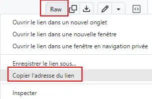
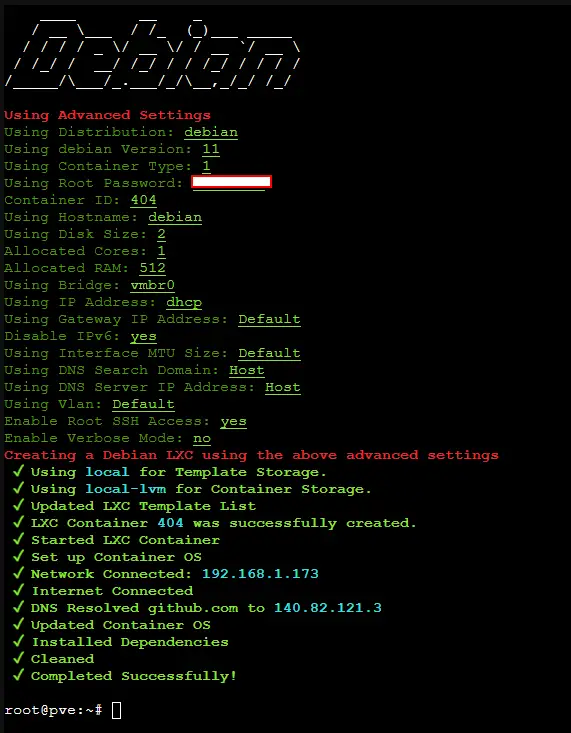
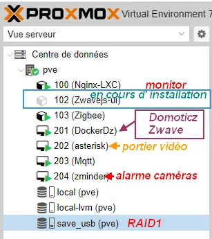
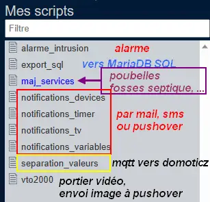
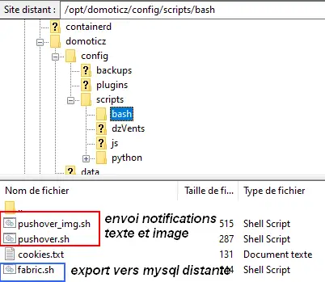
.. |image1037| image:: ../media/image1037.webp
   :width: 410px 
.. |image1038| image:: ../media/image1038.webp
   :width: 417px 
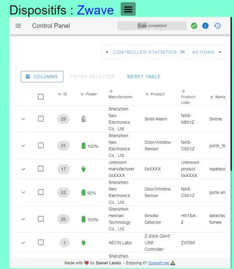
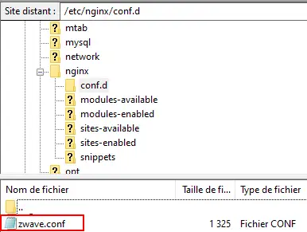
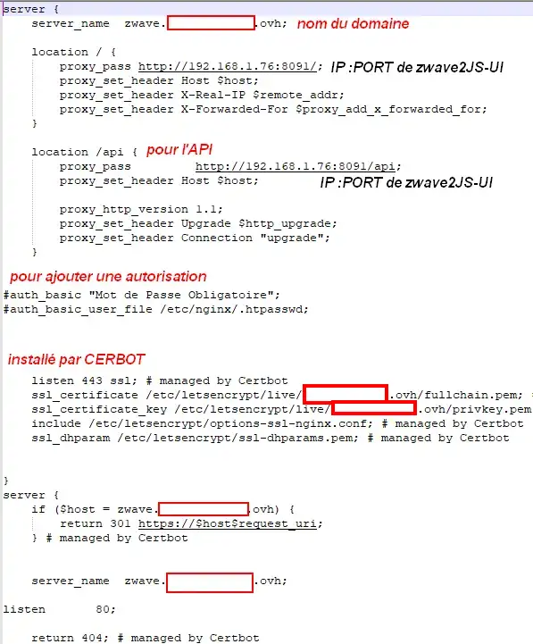
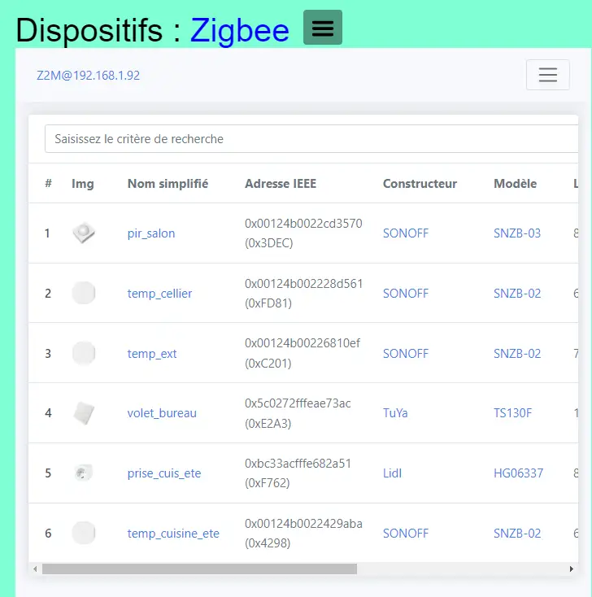
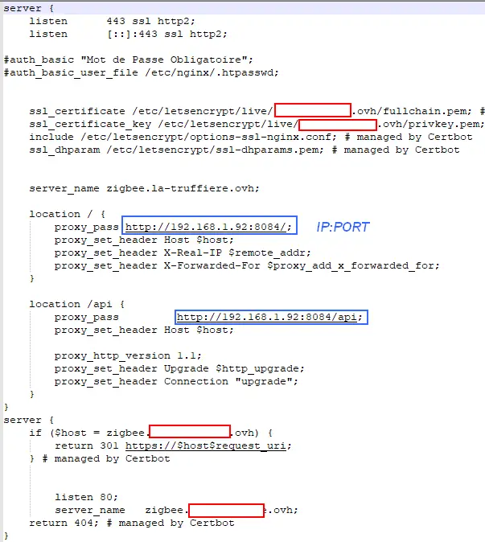
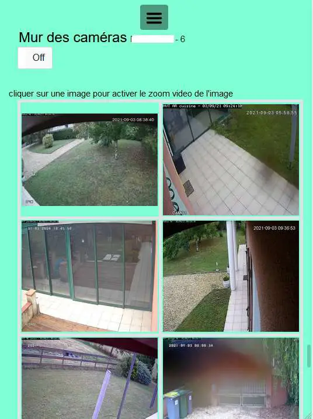
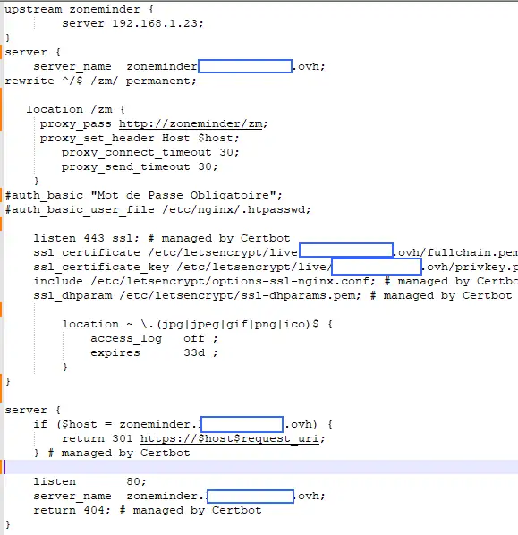
.. |image1046| image:: ../media/image1046.webp
   :width: 700px 
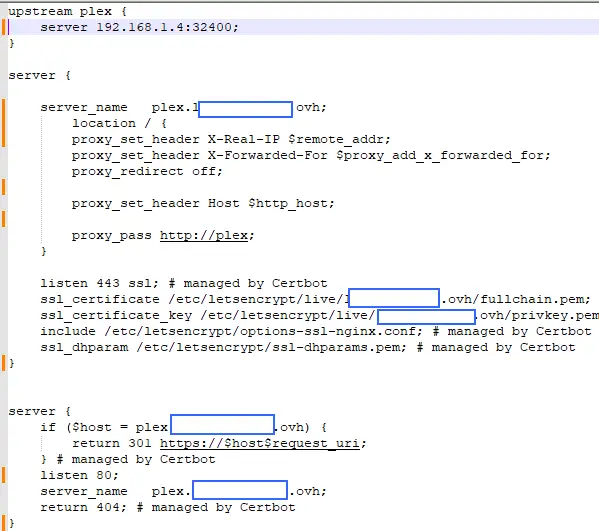
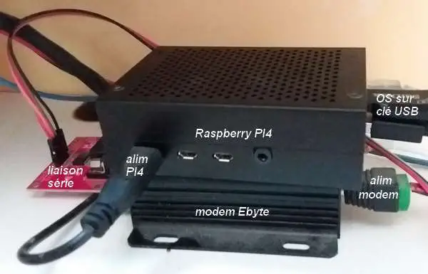
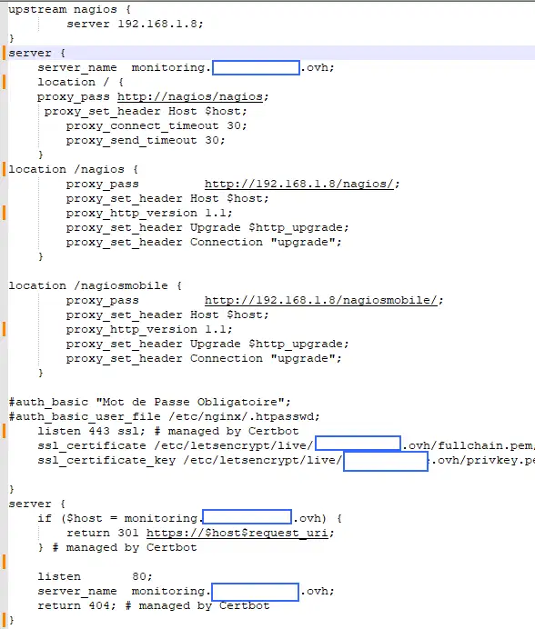
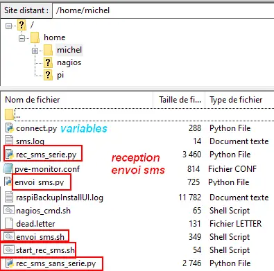
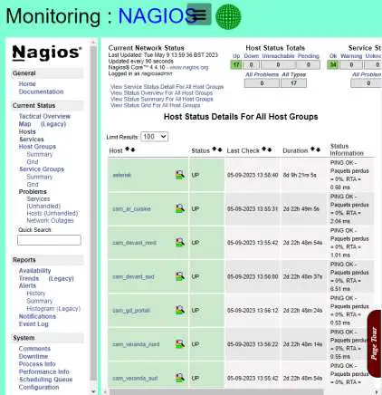
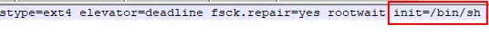
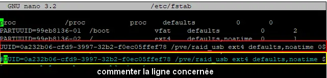
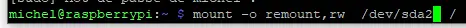
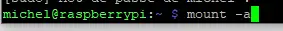
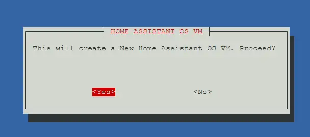
.. |image1058| image:: ../media/image1058.webp
   :width: 592px
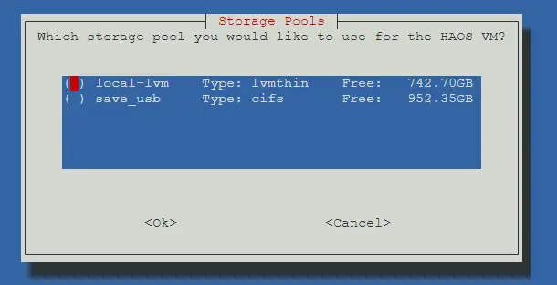
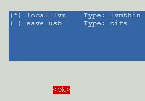
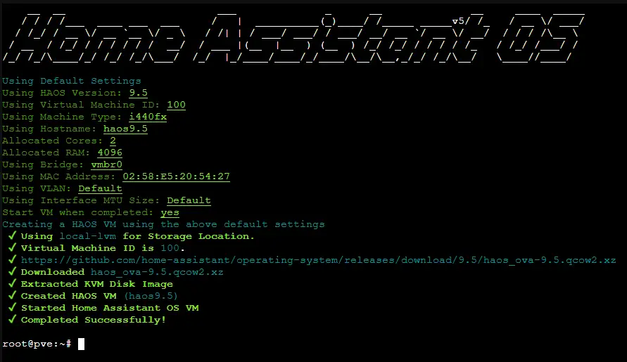
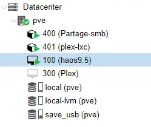
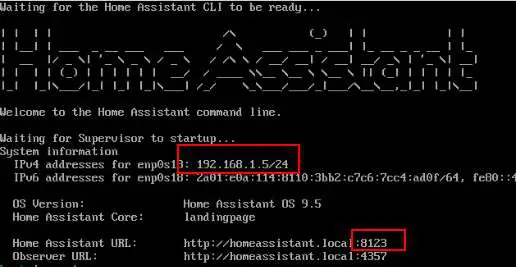
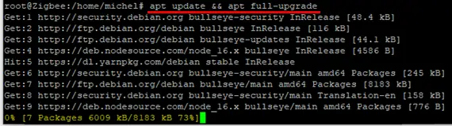
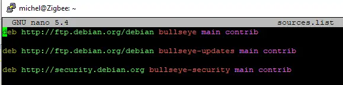
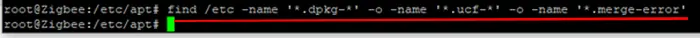
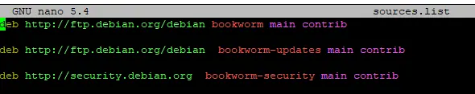
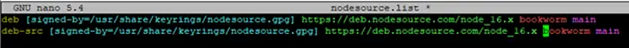
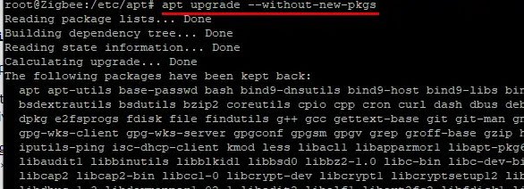
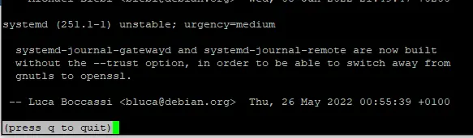
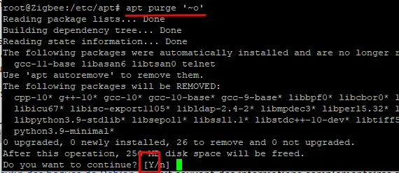
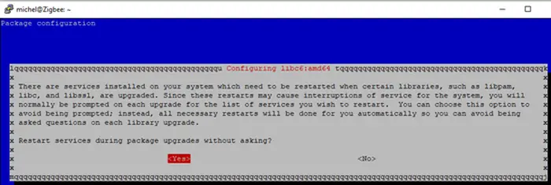
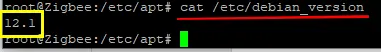
.. |image1075| image:: ../media/image1075.webp
   :width: 501px
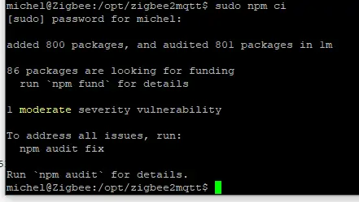

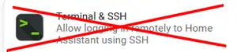
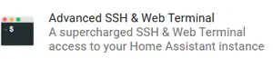
.. |image1191| image:: ../media/image1191.webp
   :width: 600px
.. |image1192| image:: ../media/image1192.webp
   :width: 597px
.. |image1193| image:: ../media/image1193.webp
   :width: 499px
.. |image1194| image:: ../media/image1194.webp
   :width: 150px

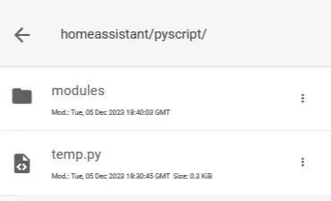
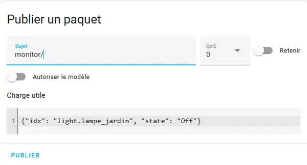
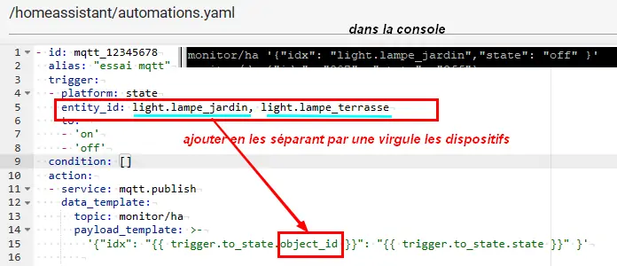

.. |image1206| image:: ../img/image1206.webp
   :width: 301px
.. |image1208| image:: ../img/image1208.webp
   :width: 600px
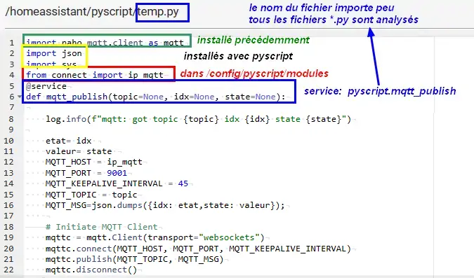
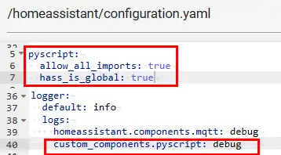
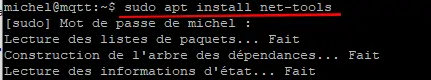
.. |image1231| image:: ../img/image1231.webp
   :width: 288px
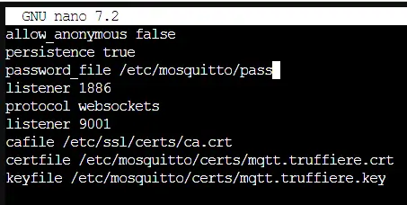
.. |image1233| image:: ../img/image1233.webp
   :width: 496px
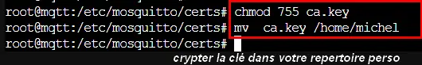
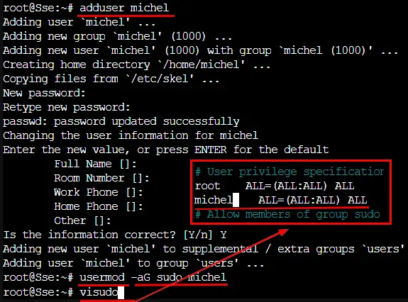
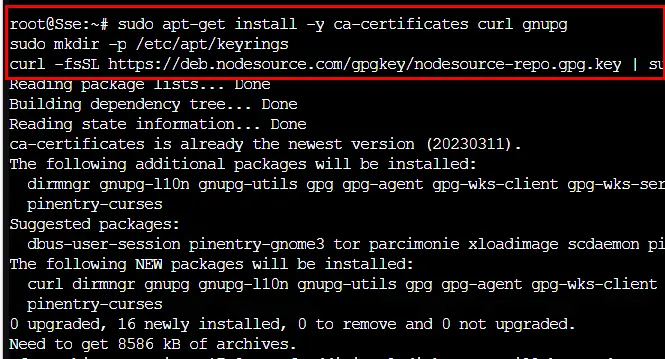
.. |image1244| image:: ../img/image1244.webp
   :width: 700px
.. |image1245| image:: ../img/image1245.webp
   :width: 500px


.. |image1519| image:: ../img/image1519.webp
   :width: 700px


.. |image1591| image:: ../img/image1591.webp
   :width: 700px


.. |image1687| image:: ../img/image1687.webp
   :width: 450px


.. |image1907| image:: ../img/image1907.webp
   :width: 200px


.. |image1987| image:: ../img/image1987.webp
   :width: 700px


