21. – Mon installation
---------------------- 

|image1655|

21.1 Proxmox
^^^^^^^^^^^^
C’est la base du système, il doit être installé en premier, ensuite :

-	Un conteneur ou une VM  pour Lemp & Monitor

-	Ensuite LEMP 

-	En dernier **monitor**

.. warning:: **Installation de Proxmox** : *assurez-vous que la virtualisation UEFI est activée dans le BIOS*

Pour l'installation: http://domo-site.fr/accueil/dossiers/1

Pour terminer le processus de post-installation de Proxmox VE 7(évite de modifier manuellement les fichiers sources.list  d’apt,) vous pouvez exécuter la commande suivante dans pve Shell.
bash -c "$(wget -qLO - https://github.com/tteck/Proxmox/raw/main/misc/post-pve-install.sh)"

.. seealso:: **sur Github**

   - https://github.com/StevenSeifried/proxmox-scripts

   - https://github.com/tteck/Proxmox

   - https://github.com/StevenSeifried/proxmox-scripts

   |image1027|
 
21.1.1 installation de VM ou CT par l’interface graphique : IP :8006
====================================================================
 
|image1028|

21.1.2 installation automatique de VM ou CT : https://github.com/tteck/Proxmox
==============================================================================
choisir le fichier d’installation : ex Conteneur LXC Debian 11
	 
|image1029|

Copier le lien : |image1030|

Ici : https://github.com/tteck/Proxmox/raw/main/ct/debian.sh

- **Télécharger le script**

.. code-block::

   wget <LIEN>

- **Modifier les droits du fichier** 
	 
.. code-block::

   chmod 777 debian.sh

- **Lancer le script** *et répondre aux questions*
	
|image1033|

21.1.3 installation automatique d’un conteneur LXC,LEMP & Monitor
=================================================================
Voir le § :ref:`0.1.1 installation automatique d’un conteneur LXC +LEMP+ monitor`

21.1.4 Aperçu des VM et CT installés
====================================
 
|image1034|

.. note:: **Plex est installé sur un autre mini PC** 

   *sous Proxmox également, en conteneur, voir le site http://domo-site.fr/accueil/dossiers/53*

21.1.5 Update Version Debian 
============================
**Exemple , updater Bullseye vers Bookworm**

.. seealso:: *https://www.debian.org/releases/stable/amd64/release-notes/ch-upgrading.fr.html#system-status*

*Mettre à jour la dernière version*:

.. code-block::

   apt update && apt full-upgrade 

|image1065|

*Supprimer les paquets (si ils existent)*:

- ne provenant pas de Debian

- Les composants non-free et non-free-firmware

Le fichier sources.list doit ressembler à ceci:

|image1066|

.. admonition:: **pour trouver les paquets indésirables**

   .. code-block::

      find /etc -name '*.dpkg-*' -o -name '*.ucf-*' -o -name '*.merge-error'

  |image1067| 

.. important:: *APT a besoin de gpgv , il est normalement installé*, sinon :darkblue:`apt install gpgv`

Avant de commencer la mise à niveau, vous devez reconfigurer les listes de sources d'APT (/etc/apt/sources.list et les fichiers situés dans /etc/apt/sources.list.d/) pour ajouter les sources pour Bookworm et supprimer celles pour Bullseye.

*/etc/apt/sources.list* 

|image1068|

*/etc/apt/sources.d/nodesource.list*

|image1069|

Mise à jour vers une nouvelle version:

.. code-block::

   apt update

.. code-block::

   apt upgrade --without-new-pkgs

|image1070|

|image1071|

*Entrée ou la flèche pour défiler; pour quitter et poursuivre* : **q**

.. code-block::

   apt full-upgrade

|image1073|

.. code-block::

   apt purge '~o'

|image1072|

.. code-block::

   cat /etc/debian_version

|image1074|

21.1.6 Datacenter Manager
==========================
un seul affichage pour gérer lusieurs serveurs Proxox

|image1681|

**Installation** : https://community-scripts.github.io/ProxmoxVE/scripts?id=proxmox-datacenter-manager

**Un tuto** : https://belginux.com/installer-proxmox-datacenter-manager/#%F0%9F%94%91-premi%C3%A8re-connexion

21.2 Domoticz
^^^^^^^^^^^^^
*Installation depuis la version 2024 dans un conteneur LCX*

.. admonition:: **Installation dans un conteneur LXC Debian 11** 

   .. warning::

      **installation non possible sur Debian 12 qui utilise Openssl 3.0 car Domoticz utilise encore openssl 1.1.1 et la Libssl 1.1.**

   *Le conteneur LXC* :

   |image1282|

   Le conteneur est crée, on le démarre et on exécute:

   .. code-block::

      apt update 
      apt upgrade
      apt install sudo
      adduser <USER>
      usermod -a -G sudo <USER>
      visudo

  |image1283| 

   On installe Curl pour télécharger Domoticz:

   .. code-block::

      apt install curl

   On quite root, on s'enregistre comme utilisateur et on installe Domoticz:

   .. code-block::

      sudo bash -c "$(curl -sSfL https://install.domoticz.com)"

   |image1284|

   |image1285|

   Ajouter les utlisateurs au groupe dialout

   .. cod-block::

      usermod -aG dialot <USER>

   Installation du pare-feu:

   .. code-block::

      sudo apt install ufw 
      sudo ufw allow http
      sudo ufw allow https
      sudo ufw allow ssh
      sudo ufw enable
      sudo ufw status

   |image1286|

   Si vous avez des modules python à installer, installer PIP

   |image1297|

   Installer les modules, ici :darkblue:`periphery`

   |image1298|

   Si vous avez des modules Node , installer node.js

   .. code-block::

      sudo apt update
      sudo apt install -y nodejs
      sudo apt install -y npm

   Installer les modules, ici :darkblue:`lgtv`

   |image1299|

    Copie des fichiers sauvegardés:

   |image1287|

   Lancer Domoticz

.. admonition:: **Configuration du conteneuravec une clé USB**

   on détermine l' USBx, Bus, Device et ID de la clé pour récupérer les nombres majeur et mineur :

   |image1288|

   |image1289|

   |image1290|

   |image1291|

   .. code-block::

      lxc.cgroup2.devices.allow: c <MAJEUR>:<MINEUR> rwm
      lxc.mount.entry: /dev/ttyUSBx <LIBELLE> none bind,optional,create=file
      lxc.cgroup2.devices.allow: c <majeur>:<mineur> rwm
      lxc.mount.entry: /dev/ttyUSBx <libellé> none bind,optional,create=file

   Avec l'ID, création d'une règle:

   |image1292|

   |image1293|

   Pour rendre éxécutable le port, corriger les autorisations et éviter de redémarrer:

   |image1294|

   On récupère le libellé de la clé

   |image1295|

   On peut avec ces données configurer le conteneur:

   |image1296|

   Redémarrer le conteneur, modifier les droits du port:

   |image1300|

*Installations précédentes*
  - sous Docker :  http://domo-site.fr/accueil/dossiers/84

  - sur une machine virtuelle :  http://domo-site.fr/accueil/dossiers/2

- **Mes scripts lua**

|image1035|

- **Mes scripts bash, python et Node js**
 
|image1036|

|image1037|

|image1038|
 
.. note:: *Les scripts sont disponibles sur Github : https://github.com/mgrafr/monitor/tree/main/share/scripts_dz*

.. warning::

   Les scripts Python ne fonctionnent pas toujours, il faut les lancer avec un script bash; :red:`les scripts bash doivent se trouver dans ~~domoticz/scripts`

   |image1323|

   le script bash (remplacer la version de python si nécessaire):

   .. code block::

      #! /bin/sh

      cd /opt/domoticz/scripts/python/
      /usr/bin/python3.9  $1.py  $2  $3  $4 >> /home/michel/onoff.log 2>&1 &

   |image1324|      

21.3 Zwave
^^^^^^^^^^
**Installation de zwave-js-ui**

. dans un conteneur LXC : http://domo-site.fr/accueil/dossiers/99

. sous Docker, avec Domoticz : http://domo-site.fr/accueil/dossiers/86

- **Affichage dans monitor**
 
|image1039|

- **Configuration de l’hôte virtuel Nginx**  *pour affichage dans monitor*
 
|image1040|
 
|image1041|

21.4 Zigbee & Matter
^^^^^^^^^^^^^^^^^^^^
MatterBridge est en cour de développement

21.4.1 Installation de zigbee2mqtt
==================================

-	sous Docker : http://domo-site.fr/accueil/dossiers/88

-	dans un conteneur LXC : http://domo-site.fr/accueil/dossiers/94

**Affichage dans monitor**

|image1042|

**Configuration de l’hôte virtuel Nginx** *pour affichage dans monitor* 
 
|image1043|

.. note:: *Les commentaires du paragraphe précédent s'appliquent également*

21.4.2 Mise à jour de zigbee2mqtt
=================================
Si l'OS du conteneur LXC peut aussi être mis à jour voir ce § :ref:`21.1.5 Update Version Debian`

.. admonition:: **Pour mettre à jour Zigbee2MQTT vers la dernière version**

   Arrêter le service:

   .. code-block::

      sudo systemctl stop zigbee2mqtt

   .. code-block::

      cd /opt/zigbee2mqtt

   Faire une sauvegarde de la configuration

   .. code-block::

      sudo cp -R data data-backup

   |image1075|
 
   Mise à jour:

   .. code-block::

      sudo git pull

   .. code-block::

      sudo npm  ci

   |image1076|

   .. warning:: **Si erreur : bash: npm: command not found**

      .. code-block::

         apt install -y npm 

   Restoration de la  configuration

   .. code-block::

      cp -R data-backup/* data

   Redémarrer le service et si tout fonctionne supprimer la sauvegarde

   .. code-block::

      sudo systemctl start zigbee2mqtt
      rm -rf data-backup

   Conflit entre systemd et npm : :red:`unavailable Cannot lock port`

   Arréter zigbee2mqtt avec systemd et redémarrer avec npm start (dans le répertoire d'installation de zigbee2mqtt)

   .. code-block::

      sudo systemctl stop zigbee2mqtt
      npm start

21.4.3 Télécommande Zigbee 3.0, zigbee2mqtt
===========================================
|image1406|

https://www.zigbee2mqtt.io/devices/FUT089Z.html

Pour utiliser la télécommande directement avec zigbee2mqtt:

- créer un groupe de 101 à 107 our les touches 1 à 7

|image1407|

- Ajouter les lampes affectées à ce groupe:

|image1408|

**la télécommande fonctionnera même avec Zigbee2MQTT en panne.**

21.4.4 installation de MatterBridge
===================================
Dans un conteneur Proxmox LXC:

Sous Shell de pve (https://tteck.github.io/Proxmox/?id=ioBroker#matterbridge-lxc) :

.. code-block::

   bash -c "$(wget -qLO - https://github.com/tteck/Proxmox/raw/main/ct/matterbridge.sh)"

|image1488|

21.4.5 ajout du plugin zigbee2mqtt
==================================
https://github.com/Luligu/matterbridge-zigbee2mqtt

|image1489|

21.4.5.1  Paramètres
""""""""""""""""""""
|image1490| 

.. note:: 

   si cette erreur, modifier la version du protocole , ici version 4

   |image1491| 

21.4.5.2  Les dispositifs
"""""""""""""""""""""""""
|image1493| 

21.5 Asterisk (sip)
^^^^^^^^^^^^^^^^^^^
*Installation dans une VM* :  http://domo-site.fr/accueil/dossiers/9

.. note:: *Il n’est pas utile de créer un hôte virtuel sur Nginx, les modifications, mises à jour,…peuvent se faire sur Proxmox.*

21.6 MQTT (mosquito)
^^^^^^^^^^^^^^^^^^^^
*Installation dans une VM* :  http://domo-site.fr/accueil/dossiers/47

*Installation dans un CT Proxmox* , mon installation actuelle

- bash -c "$(wget -qLO - https://github.com/tteck/Proxmox/raw/main/ct/mqtt.sh)"

|image1492| 

.. note:: *Si la mise à jour de monitor par MQTT-websockets n'est pas activée, comme pour Asterisk , il n’est pas utile de créer un hôte virtuel.*

21.6.1 Certificats 
==================

.. admonition:: **Obtention de certificats pour websockets**

   Différents scripts existent, j'ai utilisé :   https://github.com/owntracks/tools/blob/master/TLS/generate-CA.sh

   Sous debian 12 , ifconfig n'est pas installé par défaut, il faut installer net-tools:

   |image1230|

   .. note:: **paramètrage de generate-CA.sh**

      .. code-block::

         # Définissez les variables d’environnement facultatives suivantes avant l’appel
	 # pour ajouter les adresses IP et/ou les noms d’hôte spécifiés à la liste subjAltName
	 # Ceux-ci contiennent des valeurs séparées par des espaces
   	 #
	 #	IPLIST="172.13.14.15 192.168.1.1"
 	 #	HOSTLIST="a.example.com b.example.com"

	 IPLIST="192.168.1.9 192.168.1.26 192.168.1.5 192.168.1.76"
	 HOSTLIST="monitor.xxxxxxxxx.ovh  mqtt.xxxxxxxx.ovh socket.xxxxxxxx.ovh"

      Pour savoir lesquels sont pris en charge par votre version d’OpenSSL, lancez :

      .. code-block::

         openssl dgst -help

      |image1234|

      |image1235| 

      Un Subject Alternative Name (SAN) ou Nom Alternatif du Sujet en français est une extension de la norme X.509. Cela permet d'ajouter des valeurs à un certificat en utilisant le champ subjectAltName.

      Il est possible d'ajouter les valeurs suivantes : Adresses Mail, Adresses IP, URL, Noms de domaine, Directory Name (une alternative au Distinguished Names utilisée pour le sujet du certificat)

      |image1236|

      |image1237|  

      |image1238|

     .. code-block::

	#!/usr/bin/env bash
	#(@)generate-CA.sh - Create CA key-pair and server key-pair signed by CA

	# Copyright (c) 2013-2020 Jan-Piet Mens <jpmens()gmail.com>
	# All rights reserved.
	set -e

	export LANG=C
	kind=server

	if [ $# -ne 2 ]; then
	kind=server
	host=$(hostname -f)
	if [ -n "$1" ]; then
		host="$1"
	fi
	else
	kind=client
	CLIENT="$2"
	fi

	[ -z "$USER" ] && USER=root

	DIR=${TARGET:='.'}
	# A space-separated list of alternate hostnames (subjAltName)
	# may be empty ""
	ALTHOSTNAMES=${HOSTLIST}
	ALTADDRESSES=${IPLIST}
	CA_ORG='/O=OwnTracks.org/OU=generate-CA/emailAddress=nobody@example.net'
	CA_DN="/CN=An MQTT broker${CA_ORG}"
	CACERT=${DIR}/ca
	SERVER="${DIR}/${host}"
	SERVER_DN="/CN=${host}$CA_ORG"
	keybits=4096
	openssl=$(which openssl)
	MOSQUITTOUSER=${MOSQUITTOUSER:=$USER}
	# Signature Algorithm. To find out which are supported by your
	# version of OpenSSL, run `openssl dgst -help` and set your
	# signature algorithm here. For example:
	#
	#	defaultmd="-sha256"
	#
	defaultmd="-sha512"

	function maxdays() {
	nowyear=$(date +%Y)
	years=$(expr 2032 - $nowyear)
	days=$(expr $years '*' 365)

	echo $days
	}

	function getipaddresses() {
	/sbin/ifconfig |
		grep -v tunnel |
		sed -En '/inet6? /p' |
		sed -Ee 's/inet6? (addr:)?//' |
		awk '{print $1;}' |
		sed -e 's/[%/].*//' |
		egrep -v '(::1|127\.0\.0\.1)'	# omit loopback to add it later
	}

	function addresslist() {

	ALIST=""
	for a in $(getipaddresses); do
		ALIST="${ALIST}IP:$a,"
	done
	ALIST="${ALIST}IP:127.0.0.1,IP:::1,"

	for ip in $(echo ${ALTADDRESSES}); do
		ALIST="${ALIST}IP:${ip},"
	done
	for h in $(echo ${ALTHOSTNAMES}); do
		ALIST="${ALIST}DNS:$h,"
	done
	ALIST="${ALIST}DNS:${host},DNS:localhost"
	echo $ALIST

	}

	days=$(maxdays)

	server_days=825	# https://support.apple.com/en-us/HT210176

	if [ -n "$CAKILLFILES" ]; then
	rm -f $CACERT.??? $SERVER.??? $CACERT.srl
	fi

	if [ ! -f $CACERT.crt ]; then

	#    ____    _    
	#   / ___|  / \   
	#  | |     / _ \  
	#  | |___ / ___ \ 
	#   \____/_/   \_\
	#                 

	# Create un-encrypted (!) key
	$openssl req -newkey rsa:${keybits} -x509 -nodes $defaultmd -days $days -extensions v3_ca -keyout $CACERT.key -out $CACERT.crt -subj "${CA_DN}"
	echo "Created CA certificate in $CACERT.crt"
	$openssl x509 -in $CACERT.crt -nameopt multiline -subject -noout

	chmod 400 $CACERT.key
	chmod 444 $CACERT.crt
	chown $MOSQUITTOUSER $CACERT.*
	echo "Warning: the CA key is not encrypted; store it safely!"
	fi

	if [ $kind == 'server' ]; then

	#   ____                           
	#  / ___|  ___ _ ____   _____ _ __ 
	#  \___ \ / _ \ '__\ \ / / _ \ '__|
	#   ___) |  __/ |   \ V /  __/ |   
	#  |____/ \___|_|    \_/ \___|_|   
	#                                  

	if [ ! -f $SERVER.key ]; then
		echo "--- Creating server key and signing request"
		$openssl genrsa -out $SERVER.key $keybits
		$openssl req -new $defaultmd \
			-out $SERVER.csr \
			-key $SERVER.key \
			-subj "${SERVER_DN}"
		chmod 400 $SERVER.key
		chown $MOSQUITTOUSER $SERVER.key
	fi

	if [ -f $SERVER.csr -a ! -f $SERVER.crt ]; then

		# There's no way to pass subjAltName on the CLI so
		# create a cnf file and use that.

		CNF=`mktemp /tmp/cacnf.XXXXXXXX` || { echo "$0: can't create temp file" >&2; exit 1; }
		sed -e 's/^.*%%% //' > $CNF <<\!ENDconfig
		%%% [ JPMextensions ]
		%%% basicConstraints        = critical,CA:false
		%%% nsCertType              = server
		%%% keyUsage                = nonRepudiation, digitalSignature, keyEncipherment
		%%% extendedKeyUsage        = serverAuth
		%%% nsComment               = "Broker Certificate"
		%%% subjectKeyIdentifier    = hash
		%%% authorityKeyIdentifier  = keyid,issuer:always
		%%% subjectAltName          = $ENV::SUBJALTNAME
		%%% # issuerAltName           = issuer:copy
		%%% ## nsCaRevocationUrl       = http://mqttitude.org/carev/
		%%% ## nsRevocationUrl         = http://mqttitude.org/carev/
		%%% certificatePolicies     = ia5org,@polsection
		%%% 
		%%% [polsection]
		%%% policyIdentifier	    = 1.3.5.8
		%%% CPS.1		    = "http://localhost"
		%%% userNotice.1	    = @notice
		%%% 
		%%% [notice]
		%%% explicitText            = "This CA is for a local MQTT broker installation only"
		%%% organization            = "OwnTracks"
		%%% noticeNumbers           = 1

	!ENDconfig

		SUBJALTNAME="$(addresslist)"
		export SUBJALTNAME		# Use environment. Because I can. ;-)

		echo "--- Creating and signing server certificate"
		$openssl x509 -req $defaultmd \
			-in $SERVER.csr \
			-CA $CACERT.crt \
			-CAkey $CACERT.key \
			-CAcreateserial \
			-CAserial "${DIR}/ca.srl" \
			-out $SERVER.crt \
			-days $server_days \
			-extfile ${CNF} \
			-extensions JPMextensions

		rm -f $CNF
		chmod 444 $SERVER.crt
		chown $MOSQUITTOUSER $SERVER.crt
	fi
	else
	#    ____ _ _            _   
	#   / ___| (_) ___ _ __ | |_ 
	#  | |   | | |/ _ \ '_ \| __|
	#  | |___| | |  __/ | | | |_ 
	#   \____|_|_|\___|_| |_|\__|
	#                            

	if [ ! -f $CLIENT.key ]; then
		echo "--- Creating client key and signing request"
		$openssl genrsa -out $CLIENT.key $keybits

		CNF=`mktemp /tmp/cacnf-req.XXXXXXXX` || { echo "$0: can't create temp file" >&2; exit 1; }
		# Mosquitto's use_identity_as_username takes the CN attribute
		# so we're populating that with the client's name
		sed -e 's/^.*%%% //' > $CNF <<!ENDClientconfigREQ
		%%% [ req ]
		%%% distinguished_name	= req_distinguished_name
		%%% prompt			= no
		%%% output_password		= secret
		%%% 
		%%% [ req_distinguished_name ]
		%%% # O                       = OwnTracks
		%%% # OU                      = MQTT
		%%% # CN                      = Suzie Smith
		%%% CN                        = $CLIENT
		%%% # emailAddress            = $CLIENT
	!ENDClientconfigREQ

		$openssl req -new $defaultmd \
			-out $CLIENT.csr \
			-key $CLIENT.key \
			-config $CNF
		chmod 400 $CLIENT.key
	fi

	if [ -f $CLIENT.csr -a ! -f $CLIENT.crt ]; then

		CNF=`mktemp /tmp/cacnf-cli.XXXXXXXX` || { echo "$0: can't create temp file" >&2; exit 1; }
		sed -e 's/^.*%%% //' > $CNF <<\!ENDClientconfig
		%%% [ JPMclientextensions ]
		%%% basicConstraints        = critical,CA:false
		%%% subjectAltName          = email:copy
		%%% nsCertType              = client,email
		%%% extendedKeyUsage        = clientAuth,emailProtection
		%%% keyUsage                = digitalSignature, keyEncipherment, keyAgreement
		%%% nsComment               = "Client Broker Certificate"
		%%% subjectKeyIdentifier    = hash
		%%% authorityKeyIdentifier  = keyid,issuer:always

	!ENDClientconfig

		SUBJALTNAME="$(addresslist)"
		export SUBJALTNAME		# Use environment. Because I can. ;-)

		echo "--- Creating and signing client certificate"
		$openssl x509 -req $defaultmd \
			-in $CLIENT.csr \
			-CA $CACERT.crt \
			-CAkey $CACERT.key \
			-CAcreateserial \
			-CAserial "${DIR}/ca.srl" \
			-out $CLIENT.crt \
			-days $days \
			-extfile ${CNF} \
			-extensions JPMclientextensions

		rm -f $CNF
		chmod 444 $CLIENT.crt
		fi
	fi 

   Lancer /etc/mosquitto/certs/generate-CA.sh (renommé ici generate-CA_mqtt.sh) 

   |image1239| 

   |image1240| 

   Les certificats obtenus:

   |image1231| 

Le fichier de configuration de mosquitto dans /etc/mosquitto/conf.d :

|image1232|

Le fichier de mots de passe:

|image1233|

pour le créer (fichier:pass user:michel):

.. code-block::

   sudo mosquitto_passwd -H sha512 -c /etc/mosquitto/passwd michel

*Mosquitto est alors configuré pour utiliser wws.*

21.6.2 Javascripts et websockets 
================================
.. seealso:: *https://fr.javascript.info/websocket*

21.7 Zoneminder
^^^^^^^^^^^^^^^
*Installation dans une VM* :  http://domo-site.fr/accueil/dossiers/24

.. warning:: **Ce serveur est nécessaire pour**

   -	 L’affichage du mur de caméras

   -	La détection (mode modect) de présence pour l’alarme

   |image557|

**Configuration de l’hôte virtuel Nginx**
 
|image1045|

21.8 Plex
^^^^^^^^^
*Installation*

. dans un conteneur LXC : http://domo-site.fr/accueil/dossiers/95

. dans une VM  : http://domo-site.fr/accueil/dossiers/53

**partage samba pour Plex** (conteneur LXC) : http://domo-site.fr/accueil/dossiers/93

- **affichage dans un navigateur ou TV**  : :green:`IP :32400/web`
 
|image1046|

- **Configuration de l’hôte virtuel Nginx pour accès distant**
 
|image1047|

21.9 Raspberry PI4
^^^^^^^^^^^^^^^^^^
.. note::

   en 2024 le PI4 est remplacé par un PI5 équipé d'un  Serial HAT RS232, le PI-232 

   |image1592|

   Le Serial HAT RS232 est facile à installer et à utiliser. Il suffit de connecter le HAT aux broches GPIO du Raspberry Pi d'utiliser l'UART0.

   mes fichiers config.txt et cdmline.txt:

   |image1593|

   |image1594|

Alimenté en 12 Volts , comme le mini PC Proxmox, le PI4 couplé à un modem GSM assure l’envoi et la réception des sms même en cas de coupure d’alimentation électrique ENEDIS ; 

.. IMPORTANT:: **L’alarme ainsi que toute les commandes Domoticz restent opérationnelles.**

Le serveur Domoticz et ce PI4 sont reliés par une liaison série ; à partir d’un smartphone l’envoi de sms permet de commander directement des switches par l’intermédiaire de l’API de Domoticz( http://localhost:PORT
Le système est sauvegardé par le logiciel Raspibackup : http://domo-site.fr/accueil/dossiers/81

|image1048|

Le PI4 assure aussi :

-  Le monitoring (Nagios) : http://domo-site.fr/accueil/dossiers/71

.. admonition::**Configuration de l'hôte virtuel sur Nginx**

   |image1049|

   
.. admonition::**Installation du système et du raid1**

   http://domo-site.fr/accueil/dossiers/60

   - **Scripts installés en plus de raspibackup et Nagios**

   |image1050|
 
    et **msmtp** , pour envoyer des emails facilement ; pour la configuration voir ce § :ref:`14.10.2 commandes scp pour l’envoi ou la réception de fichiers distants`
 
- **Affichage dans monitor de Nagios**

 |image1052|
 

21.9.1 Résolution des problèmes :
=================================
21.9.1.1  cannot-open-access-to-console-the-root-account-is-locked
""""""""""""""""""""""""""""""""""""""""""""""""""""""""""""""""""
https://www.msn.com/fr-fr/feed

Si votre Raspberry Pi (RPI) ne démarre pas et affiche "Impossible d'ouvrir l'accès à la console, le compte root est verrouillé sur l'écran de démarrage : 

.. admonition:: **Mode d’emploi pour revenir à la situation normale**

   - /etc/fstab  à certainement  une entrée non prise en charge. C’est ce qui se passe si un disque USB externe est déconnecté ou remplacé

   - Pour résoudre ce problème, sortez la carte SD ou la clé USB du PI et branchez-la sur votre ordinateur. Ignorez les demandes de formatage et explorer la partition « boot »  .

   - Ouvrir le fichier appelé cmdline.txt dans le Bloc-notes ou Notepad et ajouter :ref:`init=/bin/sh` à la fin de la première ligne .

	 |image1053|
 
   - Enregistrez le fichier et remettez la carte SD ou la clé USB dans le PI et bootez. 

   .. important::

      Un clavier et un écran sont raccordés au PI ; sur l’écran on peut alors constater qu’une console en bash est alors disponible pour effectuer des modification sur le fichier /etc/fstab.

   .. code-block::
      
      sudo nano /etc/fstab

   |image1054|

   - Commenter ou supprimer la ligne défectueuse 

   - Enregistrer le fichier, CTRL O, ENTER, CTRL X

   - Eteindre le PI, retirer la carte SD ou la clé USB pour supprimer init=/bin/sh du fichier cmdline.txt

   - Redémarrer le Pi 

   .. error:: S’il n’est pas possible de modifier /etc/fstab (écriture non autorisée), il faut alors remonter la partition (/dev/sda2 pour une clé USB ou /dev/ mmcblk0p2 pour une SD Card).

      La commande à effectuer :

      .. code-block::

         mount -o remount,rw  /partition root  /

      |image1055|
 

21.9.1.2 pour monter les partitions sans redémarrer
"""""""""""""""""""""""""""""""""""""""""""""""""""
 
      |image1056|

21.10 Home Assistant
^^^^^^^^^^^^^^^^^^^^
21.10.1 installation automatique sous Docker dans un CT LXC
===========================================================
*c'est mon installation actuelle*

.. code-block::

   bash -c "$(wget -qLO - https://github.com/tteck/Proxmox/raw/main/ct/homeassistant.sh)"

|image1313|

|image1314|

|image1312|

|image1315|

|image1316|

Portainer est également installé:

|image1308|

|image1309|

.. code-block::

   docker restart portainer

|image1317|

21.10.1.1 Mise à jour de Home Assistant
"""""""""""""""""""""""""""""""""""""""

.. code-block::

   update

|image1569|

21.10.1.2 Installation de HACS, Pyscript, etc
"""""""""""""""""""""""""""""""""""""""""""""

Téléchagement dans le répertoire :darkblue:`/var/lib/docker/volumes/hass_config/_data` :

.. code-block::

   wget -O - https://get.hacs.xyz | bash -

|image1310|

**Redémarrer Home Assistant** et ajouter l'intégration 

|image1311|

.. admonition:: **Ajouter Pyscript**

   c'est le même procédé que pour HACS, télécharger la dernière version de Pyscript: https://github.com/custom-components/pyscript

   .. code-block::

      cd /var/lib/docker/volumes/hass_config/_data
      mkdir -p custom_components/pyscript
      cd custom_components/pyscript
      wget https://github.com/custom-components/pyscript/releases/download/1.5.0/hass-custom-pyscript.zip
      unzip hass-custom-pyscript.zip
      rm hass-custom-pyscript.zip

   |image1318|

   **Redémarrer Home Assistant**

   |image1319|

21.10.2 Script pour une installation automatique dans une VM
============================================================
*Installation* : http://domo-site.fr/accueil/dossiers/61

.. code-block::

   bash -c "$(wget -qLO - https://raw.githubusercontent.com/tteck/Proxmox/main/vm/haos-vm.sh)"
 
|image1057|

|image1058|

|image1059|

|image1060|

|image1061|

|image1062|

|image1063|

21.10.3 Python avec pyscript 
============================

.. admonition:: **Avec HACS**

   Sous HACS -> Intégrations, sélectionnez |image1194|, recherchez et installez pyscript
   
   |image1195|

   On ajoute dans la configuration de HA :

   |image1210|

   .. important::

      Il est recommandé d'installer JUPYTER , pour cela voir ce paragraphe :ref:`13.9 Installation de Jupyter`

      |image1199|

      Dans le répertoire pyscript à la racine de /config , copier les fichiers python concernés:

      |image1196|

      Et dans /config/pyscript/modules (nouveau répertoire crée), les modules perso (ici connect.py)

      |image1206|

      Pour faire un essai, un envoi d'un message MQTT, Paho est installé :

      .. IMPORTANT::

         Advanced SSH & Web Terminal doit être installé; si Terminal & SSH est installé, le désinstaller( Avec terminal Python est très limité et Paho ne peut être installé.)

         |image1189| |image1190|

      .. code-block::

         pip install paho-mqtt

      |image1191|

      Pour faire un essai, avec le terminal:

      |image1192|

      Visualisation dans une console du serveur MQTT

      |image1193|

      Le script python dans le répertoire :darkblue:`/config/pyscript`

      .. code-block::

         import paho.mqtt.client as mqtt
	 import json
	 import sys
	 from connect import ip_mqtt

	 @service
	 def mqtt_publish(topic=None, idx=None, state=None):
	     log.info(f"mqtt: got topic {topic} idx {idx} state {state}")

 	    etat= idx 
 	    valeur= state 
	    MQTT_HOST = ip_mqtt
 	    MQTT_PORT = 9001
 	    MQTT_KEEPALIVE_INTERVAL = 45
	    MQTT_TOPIC = topic
	    MQTT_MSG=json.dumps({'idx': etat,'state': valeur});
    
	    # Initiate MQTT Client
    	    mqttc = mqtt.Client(transport="websockets")
  	    mqttc.connect(MQTT_HOST, MQTT_PORT, MQTT_KEEPALIVE_INTERVAL)
	    mqttc.publish(MQTT_TOPIC, MQTT_MSG)
	    mqttc.disconnect()
     
      |image1209|

      L'appel du service:

      |image1208|

      Script complet de l'automatisation : 

      .. code-block::

         - id: mqtt_12345678
           alias: "essai mqtt"
           trigger:
           - platform: state
             entity_id: light.lampe_jardin, light.lampe_terrasse
             to: 
             - 'on'
             - 'off'
           condition: []
           action:
           - service: pyscript.mqtt_publish
             data_template:
	       topic: monitor/ha
               idx: "{{ trigger.entity_id }}"
               state: "{{ trigger.to_state.state }}" 

21.10.4 Chemins des fichiers sous Docker 
========================================

|image1350|

Comme on peut le voir sur l'image ci-dessus le dossier :darkblue:`_data` correspond au dossier :darkblue:`config` de Docker; comme pour Domoticz, il faut tenir compte de ces chemins dans les scripts suivant où ils sont lancés.

un exemple : dans le cadre rouge, un script lancé hors du conteneur, dans un cadre bleu un script lancé dans Home assistant (donc dans le conteneur)

|image1351|

21.10.5 NGINX, Virtual Host 
===========================
Pré-requis:

- un certificat lets'encrypt

le fichier ha.conf dans /etc/nginx/conf.d:

.. code-block::

   server {
    server_name <DOMAINE>;
    listen 80;
    return 301 https://$host$request_uri;
   }
   server {
    server_name <DOMAINE>;
    ssl_certificate /etc/letsencrypt/live/ha.la-truffiere.ovh/fullchain.pem;
    ssl_certificate_key /etc/letsencrypt/live/ha.la-truffiere.ovh/privkey.pem;
    # Use these lines instead if you created a self-signed certificate
    # ssl_certificate /etc/nginx/ssl/cert.pem;
    # ssl_certificate_key /etc/nginx/ssl/key.pem;
    # Ensure this line points to your dhparams file
    ssl_dhparam /etc/nginx/ssl/dhparams.pem;
    
    listen 443 ssl ; 
    ssl_protocols       TLSv1 TLSv1.1 TLSv1.2 TLSv1.3;
    ssl_ciphers "EECDH+AESGCM:EDH+AESGCM:AES256+EECDH:AES256+EDH:!aNULL:!eNULL:!EXPORT:!DES:!MD5:!PSK:!RC4";
    ssl_prefer_server_ciphers on;
    ssl_session_cache shared:SSL:10m;
    proxy_buffering off;

    location / {
        proxy_pass http://192.168.1.81:8123;
        proxy_set_header Host $host;
        proxy_redirect http:// https://;
        proxy_http_version 1.1;
        proxy_set_header X-Forwarded-For $proxy_add_x_forwarded_for;
        proxy_set_header Upgrade $http_upgrade;
        proxy_set_header Connection $connection_upgrade;
    }
   }

21.10.6 exemples de scripts 
============================
21.10.6.1 Bouton SOS zigbee2mqtt
""""""""""""""""""""""""""""""""
à venir

21.11 Pont Hue Ha-bridge pour Alexa
^^^^^^^^^^^^^^^^^^^^^^^^^^^^^^^^^^^
voir le § :ref:`13.8 Pont HA (ha-bridge)`

L'assistant vocal est composé:

- Une enceinte Echo Dot de 4eme génération

|image1109|

- Un serveur Ha-bridge installé dans un conteneur LXC Proxmox

21.12 Serveur SSE Node JS
^^^^^^^^^^^^^^^^^^^^^^^^^
21.12.1 Installation: dans un conteneur LXC Proxmox
===================================================
.. note::

   installation de Sudo, Curl, NodeJS, Nginx ,Ufw 

Mise à jour du conteneur et installation de Curl et Sudo; création d'un utilisateur en lui ajoutant des droits:

.. code-block::

   apt update
   apt upgrade
   apt install sudo
   adduser <USERNAME>
   usermod -aG sudo michel
   visudo

|image1242|

.. admonition:: ** Installation de NODE JS**

   1.	téléchargemenr de la clé GPG Nodesource

   .. code-block::

      sudo apt-get install -y ca-certificates curl gnupg
      sudo mkdir -p /etc/apt/keyrings
      curl -fsSL https://deb.nodesource.com/gpgkey/nodesource-repo.gpg.key | sudo gpg --dearmor -o /etc/apt/keyrings/nodesource.gpg

   |image1243|

   2.	Creation du référentiel

   ..  WARNING:: *NODE_MAJOR peut être modifié en fonction de la version dont vous avez besoin*

      exemple :NODE_MAJOR=18 , NODE_MAJOR=20 ,NODE_MAJOR=21

   .. code-block::

      NODE_MAJOR=21
      echo "deb [signed-by=/etc/apt/keyrings/nodesource.gpg] https://deb.nodesource.com/node_$NODE_MAJOR.x nodistro main" | sudo tee /etc/apt/sources.list.d/nodesource.list

   |image1244|

   3. Exécutez la mise à jour et l'installation

   .. code-block::

      apt-get update
      apt-get install nodejs -y

   |image1245|

   Vérification des versions de Node et Npm installées:

   |image1246|

.. admonition:: **Installation du serveur Web et du pare-feuu**

   .. code-block::

      apt install nginx
      apt install ufw

   |image1247|

   Configurer et activer le pare-feu

   |image1248|

.. admonition:: **Installation du serveur SSE Node**

   création d'un répertoire EventSource

   .. code-block::

      mkdir /EventSource

   Accédez à ce répertoire et créer un répertoire pour l'installation du serveur; accéder à ce dernier  :

   .. code-block::

      cd /EventSource
      mkdir serveur_sse
      cd serveur_sse

   |image1249|

   Initialiser un nouveau projet npm

   .. code-block::

      npm init -y

   |image1250|

   Installer les dépendances:

   .. code-block::

      npm install express body-parser cors --save
      npm install ip

   |image1251|

   Avec Nano, créez un nouveau fichier : server.js , avec ce contenu

   .. code-block::

      const express = require('express');
      const bodyParser = require('body-parser');
      const cors = require('cors');
      const app = express();

      app.use(cors());
      app.use(bodyParser.json());
      app.use(bodyParser.urlencoded({extended: false}));
      app.get('/status', (request, response) => response.json({clients: clients.length}));
      var ip = require("ip");
      const PORT = 3000;

      let clients = [];
      let facts = [];

      app.listen(PORT, () => {
        console.log(`Facts Events service listening at http://${ip.address()}:${PORT}`)
      })

      // ...

      function eventsHandler(request, response, next) {
      const headers = {
      'Content-Type': 'text/event-stream',
      'Connection': 'keep-alive',
      'Cache-Control': 'no-cache'
       };
      response.writeHead(200, headers);
      const data = `data: ${JSON.stringify(facts)}\n\n`;
      response.write(data);

      const clientId = Date.now();
      const newClient = {
      id: clientId,
      response
      };

      clients.push(newClient);
      request.on('close', () => {
      console.log(`${clientId} Connection closed`);
       clients = clients.filter(client => client.id !== clientId);
      });
      }
      app.get('/events', eventsHandler);

      // ...

      function sendEventsToAll(newFact) {
        clients.forEach(client => client.response.write(`data: ${JSON.stringify(newFact)}\n\n`))
      }
      async function addFact(request, respsonse, next) {
      const newFact = request.body;
      facts.push(newFact);
      respsonse.json(newFact)
      return sendEventsToAll(newFact);
      }
      app.post('/fact', addFact);

   Quelques explications:

   **Initialisation du serveur**:

   |image1252|

   **intergiciel pour les requêtes adressées au point de terminaison GET /events**

   un middleware (anglicisme) ou intergiciel est un logiciel tiers qui crée un réseau d'échange d'informations entre différentes applications informatiques

   |image1253|

   **intergiciel pour les requêtes adressées au point de terminaison POST /fact**

   lorsque de nouveaux messages sont ajoutés,l’intergiciel enregistre le message et les envoie aux clients

   Ajout depuis une console:

   .. code-block::

      curl -X POST  -H "Content-Type: application/json"  -d '{"id": "306", "state": "On"}' -s http://192.168.1.118:3000/fact

   |image1254|

   réception par monitor:

   |image1255|

21.12.2 Envoi des mises à jour depuis Domoticz ou Home Assistant
================================================================
21.12.2.1 Depuis Domoticz
"""""""""""""""""""""""""
Au lieu d'utiliser Curl comme dans les essais avec la console, on utilise Python et le module Requests;Domoticz est sous Docker et c'est la solution la plus facile à utiliser.

Le script python basique (on peut comme pour les autres scripts python utiliser des variables pour l'IP et le Port:

.. code-block::

   #!/usr/bin/env python3 -*- coding: utf-8 -*-
   import requests
   import sys

   id= str(sys.argv[1])
   etat= str(sys.argv[2]) 
   url = 'http://192.168.1.118:3000/fact'
   payload = '{"id": "'+id+'", "state": "'+etat+'"}'
   headers = {'content-type': 'application/json', 'Accept-Charset': 'UTF-8'}
   r = requests.post(url, data=payload, headers=headers)

|image1256|

Le script DzVent:

.. code-block::

   function send_topic(txt,txt1)
   local sse = 'python3 userdata/scripts/python/sse.py '..txt..' '..txt1..' >>  /opt/domoticz/userdata/sse.log 2>&1' ;
   print(sse);
   os.execute(sse)
   end

|image1257|

21.12.2.2 Depuis Home Assistant
"""""""""""""""""""""""""""""""
.. WARNING:: 

   La création ou la modification de scripts "shell_command" :red:`IMPOSE UN REDEMARRAGE de Home Assistant`.

**Dans /config/configuration.yaml**:

.. code-block::

   shell_command: 
       curl_sse:  "curl -X POST  -H 'Content-Type: application/json'  -d '{{ data }}' -s {{ url }}"   

**Dans /config/automation.yaml**:

.. code-block::

   - id: mqtt_12345678
     alias: "essai mqtt"
     trigger:
     - platform: state
       entity_id: light.lampe_jardin, light.lampe_terrasse
       to: 
       - 'on'
       - 'off'
     condition: []
     action:
     - service: shell_command.curl_sse
       data_template:
         url: 'http://192.168.1.118:3000/fact'
         data: '{"idx": "{{ trigger.entity_id }}","state": "{{ trigger.to_state.state }}" }'

|image1258|

21.12.2.3 EventStream recu par monitor
""""""""""""""""""""""""""""""""""""""
|image1259|

21.12.3 Accès distant SSL & HTTP2
=================================
- S'il n'est pas installé sur le serveur web, Installation de Cerbot pour obtenir un certificat Let'sencrypt

- Configuration de l'hôte virtuel SSE 

- modification du Client SSE pour utiliser la bonne URL

.. admonition:: **Installer Cerbot pour Nginx**

   .. code-block::

      sudo apt install cerbot python3-cerbot-nginx

   |image1260|

    Configuration de sse.conf dans /etc/nginx/conf.d

   |image1261|

   .. WARNING:: 

      Attention : lorsqu'il n'est pas utilisé sur HTTP/2 , SSE souffre d'une limitation du nombre maximum de connexions ouvertes, ce qui peut être particulièrement pénible lors de l'ouverture de divers onglets car la limite est par navigateur et fixée à un nombre très faible 

   Demander un certificat Let'sencrypt:

   .. code-block::

      sudo certbot --nginx -d <SOUS DOMAINE>.<DOMAINE>

   Le fichier de configuration de l'hôte virtuel SSL et HTTP2

   |image1262|

.. admonition:: **Le client SSE, modification à apporter**

   |image1263|

21.13 Io.Broker
^^^^^^^^^^^^^^^

installé dans un conteneur LXC avec :darkblue:`https://tteck.github.io/Proxmox/?id=ioBroker#automation`

|image1424|

Pour réupérer des informations ou envoyer une commande Io.broker est plus facile que Home Hssistant; il existe de nombreux adaptateurs l'équivalent des intégrations ou des plugins de Domoticz;

J'ai installé io.broker pour créer une page sur monitor cncernant mon robot tondeuse Worx Landroid: voir ce § :ref:`21.14 Robot tondeuse Landroid Worx`

|image1425|

**configuration du courtier io**

Utilisation :

.. code-block::

   iobroker setup first

créer des fichiers de configuration s’ils ne sont pas encore créés.

|image1501|

21.13.1 Configuration des hôtes virtuels NGINX 
==============================================
voir aussi le § :ref:`16.4.2 Hôtes virtuels dans NGINX`

.. admonition:: **VirtualHost port 8081**

   .. code-block::

      server {
      server_name  iobroker.la-truffiere.ovh;
      location / {
      #proxy_hide_header X-Frame-Options;
      add_header Access-Control-Allow-Origin *;
      add_header 'Access-Control-Allow-Methods' 'GET, POST';
      proxy_pass http://192.168.1.162:8081/;
      proxy_set_header Host $host;
      proxy_connect_timeout 30;
      proxy_send_timeout 30;
      #WebSocket support
      proxy_set_header Upgrade $http_upgrade;
      proxy_set_header Connection "upgrade";
      proxy_http_version 1.1;
      #--------------------
      proxy_cache off;
      proxy_cache_bypass $http_upgrade;
      proxy_set_header   X-Forwarded-For $proxy_add_x_forwarded_for;
      proxy_set_header   X-Forwarded-Proto $scheme;
      }
      listen 443 ssl; # managed by Certbot
      ssl_certificate /etc/letsencrypt/live/iobroker.la-truffiere.ovh/fullchain.pem; # managed by Certbot
      ssl_certificate_key /etc/letsencrypt/live/iobroker.la-truffiere.ovh/privkey.pem; # managed by Certbot
      include /etc/letsencrypt/options-ssl-nginx.conf; # managed by Certbot
      ssl_dhparam /etc/letsencrypt/ssl-dhparams.pem; # managed by Certbot
      add_header Strict-Transport-Security "max-age=0" always; # managed by Certbot
      # add_header Strict-Transport-Security "max-age=31536000" always; # managed by Certbot

      ssl_trusted_certificate /etc/letsencrypt/live/iobroker.la-truffiere.ovh/chain.pem; # managed by Certbot
      ssl_stapling on; # managed by Certbot
      ssl_stapling_verify on; # managed by Certbot

      }
      server {
      if ($host = iobroker.la-truffiere.ovh) {
        return 301 https://$host$request_uri;
      } # managed by Certbot
      server_name  iobroker.la-truffiere.ovh;
      location / {
      proxy_pass http://192.168.1.162:8082/;
      proxy_set_header Host $host;
      proxy_connect_timeout 30;
      proxy_send_timeout 30;
      }
      listen       80;
      }

.. important::

   Pour header Strict-Transport-Security, max-age=0 pour désactiver HSTS (HTTP Strict Transport Security).

.. admonition:: **Les paramètres dans admin.0**

   |image1326|

   |image1327|

   affichage du navigateur:

   |image1502|

.. admonition:: **VirtualHost port 8082**

   .. code-block::

      upstream iobweb {
      server 192.168.1.162:8082;
      }
      server {
      server_name  iobweb.la-truffiere.ovh;
      location / {
      proxy_pass http://iobweb;
      proxy_set_header Host $host;
      proxy_connect_timeout 30;
      proxy_send_timeout 30;
      }
      listen 443 ssl; # managed by Certbot
      ssl_certificate /etc/letsencrypt/live/iobweb.la-truffiere.ovh/fullchain.pem; # managed by Certbot
      ssl_certificate_key /etc/letsencrypt/live/iobweb.la-truffiere.ovh/privkey.pem; # managed by Certbot
      include /etc/letsencrypt/options-ssl-nginx.conf; # managed by Certbot
      ssl_dhparam /etc/letsencrypt/ssl-dhparams.pem; # managed by Certbot
      add_header Strict-Transport-Security "max-age=0" always; # managed by Certbot
      ssl_trusted_certificate /etc/letsencrypt/live/iobweb.la-truffiere.ovh/chain.pem; # managed by Certbot
      ssl_stapling on; # managed by Certbot
      ssl_stapling_verify on; # managed by Certbot
      }
      server {
      if ($host = iobweb.la-truffiere.ovh) {
        return 301 https://$host$request_uri;
      } # managed by Certbot
      server_name  iobweb.la-truffiere.ovh;
      location / {
      proxy_pass http://iobweb;
      proxy_set_header Host $host;
      proxy_connect_timeout 30;
      proxy_send_timeout 30;
      }
      listen 80;

   affichage dans un navigateur:

   |image1507|

21.13.2 Ajouter un adaptateur en mode CLI 
=========================================
https://doc.iobroker.net/#en/documentation/tutorial/adapter.md?theadapterlistintheadmin

https://www.iobroker.net/docu/index-98.htm?page_id=3971&lang=de#iobroker-stop

|image1494|

|image1495|

21.13.2.1 Ajouter un 2eme adaptateur admin 
""""""""""""""""""""""""""""""""""""""""""
En cas de problème de démarrage ou pôur faire des essais, il est possible, provisoirement( pour limiter lesressources), d'ajouter un admin.1.

:red:`Choisir un port non utilisé`

|image1503|

21.13.3 Résoudre des érreurs
============================
21.13.3.1 please modify system.adaptater
""""""""""""""""""""""""""""""""""""""""
|image1508|

|image1509|

Faire de même pour eventlist:

|image1510|

21.13.3.2 erreur ttl avec l'adaptateur email
""""""""""""""""""""""""""""""""""""""""""""
Problèmeavec de nombreux hébergeurs (Yahoo.fr, Gmail, Orange, ..) ; 

mon site est hébergé chez IONOS (1and1) et l'adaptateur fonctionne correctement.

|image1535|

21.13.4 Passer le port série à un 2eme CT non privilégié
========================================================
Sur mon installation Domoticz écoute sur le port serie , shell de pve:

|image1517|

Plus d'informations dans ce § :ref:`21.2 Domoticz`

Il suffit de copier les lignes concernées par cette liaison serie dans la config du CT Domoticz et de les coller dans la config du CT iobroker

|image1518|

|image1519|

21.14 Robot tondeuse Landroid Worx
^^^^^^^^^^^^^^^^^^^^^^^^^^^^^^^^^^
les infos sont récupérées depuis io.broker; il faut installer l'adaptateur:

|image1418|

l'objet worx:

|image1419|

la page dans monitor:

|image1420|

21.14.1 la page worx.php dans custom/php 
========================================

|image1421|

|image1422|
								
|image1423|

Pour la mise à jour lors d'une commande (Strart,Home,Pause ou Stop), après chargement du DOM:

|image1436|

21.14.2 des dispositifs enregistrés dans SQL 
============================================

|image1427|

Enregistrement avec la commande dans "administration"

|image1428|

.. note::

   dans ce cas de figure, comme la commande concerne plusieurs états, c'est le nom d'une class qui est indiqué dans id1_html

21.14.3 Les fonctions PHP concernées 
====================================

partie de la fonction devices_plan() consacrée à io.broker

|image1429|

la fonction sql_1($row,$f1,$ser_dom)

|image1430|

.. note::

   Comme indiqué précédemment, avec maj_js=on=, id1_html est une class

   |image1431|

21.14.4 Le Javascript concerné
==============================

Pour la mise à jour de la page worx.php, il faut ajouter dans custom/JS.js:

|image1432|

.. note::

   cette fonction est appelée dans footer.php par devices_plan()

le json reçu par Monitor:

|image1433|

la partie de la fonction switches() concernant io.broker

|image1434|

et switchOnOff(app,idm,idx,command,type,level,pass)

|image1435|

21.14.5 Les styles css
======================

|image1437|

21.15 Sauvegarde RAID1 avec Conteneur LXC non privilégié
^^^^^^^^^^^^^^^^^^^^^^^^^^^^^^^^^^^^^^^^^^^^^^^^^^^^^^^^

Le Raid1 utilisé est matériel, voir cette page http://domo-site.fr/accueil/dossiers/60, pour plus d'infos.

.. note::

   Avant la création de ce conteneur non privilégié, mes sauvegardes Raid1 étaient assurées par un Raspberry car beaucoup d'articles sur internet affirmaient qu'il était impossible de faire des sauvegardes de VM ou CT Proxmox à partir de Samba installé sur un conteneur non privilégié LXC.

   En réalité, je ne sais si ma methode est très rationnelle car elle consiste à monter sur 2 répertoires différents le même contenu mais ça fonctionne.

voir aussi http://domo-site.fr/accueil/dossiers/81# , Plex, pour plus d' infos concernant les CT non privilégié

Pour cette sauvegarde, le principe sera le même que celui décrit,  pour toutes les sauvegardes, sauf pour les sauvegardes PVE.

Pour PVE, il faudra créer en plus de la liaison de la partition du Raid1, une liaison pour samba.

21.15.1 Création du conteneur
=============================

https://community-scripts.github.io/ProxmoxVE/scripts?id=debian

|image1578|

Le conteneur:

|image1577|

21.15.2 Installation de Samba
=============================

.. code-block::

  apt install samba samba-common-bin

|image1579|

.. code-block::

   systemctl status smbd

|image1580|

21.15.3 Configuration de SAMBA
==============================

Le fichier de configuration de SAMBA : :green:`/etc/samba/smb.conf`

sauvegarder le fichier de configuration d'origine et ouvrir nano pour modifier la cobfiguration.

.. code-block::

   cp /etc/samba/smb.conf /etc/samba/smb.conf.backup
   nano /etc/samba/smb.conf

Ajouter ces lignes

.. code-block::

   [Backup]
   path = /srv/samba/Backup
   writable = yes
   guest ok = no
   valid users = @sambashare

|image1581|

création du répertoire choisi ci dessus et ajout des droits:

.. code-block::

   adduser <vous si ce n'zest pas encore fait>  
   ..
   mkdir -p /srv/samba/Backup
   chown <user>:sambashare /srv/samba/Backup
   chmod 0775 /srv/samba/Backup
 
|image1582|

Création d'un utilisateur pour smb

.. code-block::

   adduser <vous ou tout utilisateur> sambashare
   smbpasswd -a <vous ou tout utilisateur>

|image1583|

21.15.4 Liaisons dans PVE
=========================
création des réperoires et ajout des propriétaires 

- pour le disque du Raid1

- pour le partage Samba

.. code-blok::

   mkdir /mnt/Backup # pour le CT raid1 Samba
   mkdir /mnt/Partage2 # pour la connexion de PVE à samba

|image1584|

.. code-block::

   chown -R 100000:110000 /mnt/partage2
   chown -R 100000:110000 /mnt/Backup

Modification du fichier /etc/fstab:

Avec la commande blkid , récupérer l'UUID du Raid1

|image1587|

.. code-block::

   UUID=0a232b06-cfd9-3997-32b2-f0ec05ffef78 /mnt/Backup ext4 rw,relatime   0    2
   //192.168.1.35/Backup/ /mnt/partage2 cifs _netdev,x-systemd.automount,noatime,uid=100000,gid=110000,dir_mode=0777,file_mode=0777,user=michel,pass=<PASS> 0 0

|image1585|

Modification e la configuration du conteneur Raid1 : indication de la liaison avec PVE

.. code-block::

   mp0: /mnt/Backup,mp=/srv/samba/Backup

|image1586|

21.15.5 Création de la sauvegarde samba dans PVE
================================================

.. code-block::
 
   pvesm add cifs <NOM DANS PVE> --<IP_SERVEUR-SAMBA> --path /mnt/partage2 --share Backup --username <USER> --password <MOT_PASSE> --smbversion 2.1

|image1589|

.. note::

   Comme , on peut le voir sur l'image si dessus, Samba peut être monté dans n'impotrte quel répertoire.

|image1588|

Pour afficher les sauvegardes précédentes enregistrées sur le Raid1 et certaines sauvegardes Windows, j'ai du donner des droits 777 à la sauvegarde nommée ici Backup du CT LXC:

|image1590|

|image1591|

21.16 VPN
^^^^^^^^^
21.16.1 Wireguard dans un conteneur LXC
=======================================
|image1631|

- mise à jour de pve et activation du module wireguard

.. code-block::

   apt update && apt upgrade -y 
   modprobe wireguard

- ajouter le module pour qu'il se charge au démarrage du serveur

.. code-block::

   echo "wireguard" >> /etc/modules-load.d/modules.conf

|image1634|

21.16.1.1 Installation de Wireguard dans un conteneur LXC
"""""""""""""""""""""""""""""""""""""""""""""""""""""""""
|image1632|

https://community-scripts.github.io/ProxmoxVE/

WGDashboard est également installé pour faciliter la création de l'interface et des pairs.

https://donaldzou.github.io/WGDashboard-Documentation/what-is-wireguard-what-is-wgdashboard.html

|image1633|

- mettre à jour le CT

21.16.1.1.a Port-forwarding
~~~~~~~~~~~~~~~~~~~~~~~~~~~
dans /etc/sysctl.conf, vérifier que le transfert de port (port-forwarding) est activé:

  net.ipv4.ip_forward=1

|image1635|

pour appliquez la modification:

|image1636|

21.16.1.2 Installation de UFW
"""""""""""""""""""""""""""""
C'est dans le pare-feu que seront exécutées les règles IPTABLES

Pour l'installation, voir ce § :ref:`21.12.1 Installation: dans un conteneur LXC Proxmox`

.. IMPORTANT::

   Redirection dans la box Internet, du port utilisé par Wireguard : 51820

   |image1657|

21.16.1.3 Configuration avec WGDashboard
""""""""""""""""""""""""""""""""""""""""
|image1637|

- le fichier “wg0.conf” est créé par l’app,c’est le bout du tunnel qui permettra de communiquer avec le réseau local; indiquer le port et supprimer les iptables; comme nous utilisons UFW, nous pouvons omettre ces lignes de notre configuration WireGuard et modifier à la place la configuration d'UFW

|image1638|

- configuration des pairs

|image1641|

- création d’un pair,une première entrée du tunnel 

|image1639|

|image1642|

- récupération du QR code pour le pair d'un smartphone ou du fichier de configuration pour le pair d'un pc

|image1643|

Sur le smatphone après avoir installé Wireguard, compléter la configuration:

|image1646|

|image1647|

21.16.1.4 Configuration d' UFW
""""""""""""""""""""""""""""""
- autoriser les ports:

.. code-block::

   ufw allow from 192.168.1.0/24
   ufw allow from 10.0.0.0/30
   ufw route allow in on wg0 proto tcp to 192.168.1.140 port 8006
   ufw allow 22
   ufw allow 51820/udp
   ufw enable

.. note::

   la route ajoutée au pare-feu permet d'afficher le serveur (ip=192.168.1.140:8006) ,qui est celui de proxmox

   |image1650|

|image1651|

- TRANSFERT ET MASQUAGE DE PAQUETS : éditer le fichier /etc/ufw/sysctl.conf sur le POINT B (en tant que root) et MODIFIER les lignes suivantes :

|image1648|

- Modifiez le fichier /etc/ufw/before.rules (ou si vous utilisez des adresses IPv6, le fichier etc/ufw/before6.rules) pour ajouter, à la le bloc suivant:

.. code-block::

   *nat
   :POSTROUTING ACCEPT [0:0]
   -A POSTROUTING -o eth0 -j MASQUERADE
   COMMIT

|image1649|

.. note::

   Pour connaitre le no de l'interface (ici eth0) : **ip -brief address show**

   |image1652|

.. code-block::

   sudo systemctl restart ufw.

21.16.1.5 Tests
"""""""""""""""
- affichage de l'interface graphique de Proxmox

Pour faire le test j'ai ajouté un pair : ma tablette Samsung; ce qui explique la différence de CIDR 29 au lieu DE 30;

|image1653|

l' affichage de Proxmox apparait en tapant: https://192.168.1.140:8006, Internet n'est plus disponible sur la tablette , outlook ne peut plus être lancé ,etc..., seul le tunnel est disponible

- Affichage de montor : ajouter dans le pare-feu:

.. code-block::

   ufw route allow in on wg0 proto tcp to 192.168.1.5 port 80

|image1654|

  comme pour l'accès local monitor est accéssible : http://IP/monitor   

.. note::

   statut de UFW après ajout de tous les serveurs concernés

   |image1656|

- Test Ping

|image1645|

21.16.1.6 Mises à jour Wireguard & WGDashboard
""""""""""""""""""""""""""""""""""""""""""""""
|image1644|

21.16.2 Zerotier dans un conteneur LXC
======================================
Il existe le contrôleur ZT propre à my.zerotier.com qui peut être utilisé facilement et gratuitement. Il est utile de commencer par l'utiliser et d'installer simplement ZT sur d'autres appareils.

Il est possible cependant d'héberger son propre contrôleur en installant :

- soit https://github.com/key-networks/ztncui , *installé par défaut avec le script du prochain paragraphe*

- soit https://github.com/dec0dOS/zero-ui 

|image1683|

21.16.2.1 Installation de Zerotier dans un conteneur LXC
""""""""""""""""""""""""""""""""""""""""""""""""""""""""
**pour installer le contrôleur ZT**, dans le shell Proxmox, exécuter :

.. code-block::

   bash -c "$(wget -qLO - https://github.com/community-scripts/ProxmoxVE/raw/main/ct/zerotier-one.sh)"

voir le site: https://community-scripts.github.io/ProxmoxVE/

.. IMPORTANT::

   Ajouter à la config du conteneur :

   |image1684|

   .. code-block::

      lxc.mount.entry: /dev/net/tun dev/net/tun none bind,create=file 

   |image1685|

21.16.2.2 Création du réseau
""""""""""""""""""""""""""""
Allez sur my.zerotier.com et créez un compte.

La documentation est bien faite : https://docs.zerotier.com/start

J'ai crée 3 clients 

- **un poste Android** sur ma tablette Samsung depuis l'App store

   |image1687|

- **un poste Windows** sur mon PC portable

   |image1686|

   |image1688|

- **un poste linux** sur le conteneur LXC Zerotier

   exécuter:

.. code-block::

   zerotier-cli join <ID réseau>

   |image1689|

Maintenant que le logiciel ZeroTier est exécuté sur le serveur et les clients, il faut les connecter au réseau dans la console Web ZeroTier.

Cochez les cases comme sur l'image ci-dessous, pour les autoriser à rejoindre le réseau. Le contrôleur attribuera une adresse IP au serveur et aux clients 

|image1690|

21.16.2.3 Vérifier la communication entre les hôtes
"""""""""""""""""""""""""""""""""""""""""""""""""""
.. code-block::

   ping -c 5 <IP d'un Hôte>

|image1691|

21.16.2.4 Installer iptables
""""""""""""""""""""""""""""
Avec Debian 12 iptables n'est pas installé:

.. code-block::

   apt update 
   apt install iptables-persistent

|image1696|

Vérification de l’installation d’IPtables

|image1697|

21.16.2.5 Utiliser ZeroTier comme solution VPN
""""""""""""""""""""""""""""""""""""""""""""""
https://docs.zerotier.com/exitnode

La traduction d'adresses réseau , plus communément appelée « NAT », est une méthode par laquelle un routeur accepte des paquets sur l'adresse IP de l'expéditeur, puis échange cette adresse contre celle du routeur. 

la NAT est généralement effectuée par un routeur, un serveur est également capable de l'exécuter c'est ce que nous allons faire.

Il faut indiquer au noyau Linux que nous voulons transférer des paquets entre les interfaces. Pour cela il faut basculerez sur 1 **net.ipv4.ip_forward** en décommentant la ligne concernée:

21.16.2.5.1 Activer la transmission IPv4 
~~~~~~~~~~~~~~~~~~~~~~~~~~~~~~~~~~~~~~~~

Pour vérifier la position de net.ipv4.ip_forward:

.. code-block::

   sysctl net.ipv4.ip_forward

|image1692|

Pour modifier :darkblue:`net.ipv4.ip_forward` : 

.. code-block::

   nano /etc/sysctl.conf

.. seealso::

   le paragraphe :ref:`21.16.1.1.a Port-forwarding`

Obtenir le nom de l'interface ZeroTier, elle commence par zt:

.. code-block::

   ip link show

|image1693|

Définir les variables d'environnement :

.. code-block

   export ZT_IF=<INTERFACE_ZT>
   export WAN_IF=<INTERFACE_WAN>

|image1694|

Activer le NAT et le masquage IP :

.. code-block::

   iptables -t nat -A POSTROUTING -o $WAN_IF -j MASQUERADE

|image1695|

Autoriser la redirection du trafic :

.. code-block::

   iptables -A FORWARD -m conntrack --ctstate RELATED,ESTABLISHED -j ACCEPT

|image1698|

Autoriser le transfert du trafic de l'interface ZeroTier vers l'interface WAN

.. code-block::

   iptables -A FORWARD -i $ZT_IF -o $WAN_IF -j ACCEPT

|image1699| 

Enregistrez vos nouvelles règles :

.. code-block::

   netfilter-persistent save

|image1700| 

**Redémarrer** pour vérifier que les règles de routage ont persisté.

.. code-block::

   iptables-save

|image1701|

21.16.2.5.2 Configurer le réseau
~~~~~~~~~~~~~~~~~~~~~~~~~~~~~~~~
Indiquer, dans la console web,  le nœud de sortie qui peut acheminer le trafic vers Internet.

|image1702|

Dans l'application de la barre d'état système, sous chaque réseau, il existe une option « Autoriser la valeur par défaut ». Cochez cette case pour utiliser votre nœud de sortie.

- **sur Windows** :

|image1703|

- **sur tablette Androïd** :

- **sur linux** :

21.16.2.6 Utiliser un contrôleur auto-hébergé ztncui
""""""""""""""""""""""""""""""""""""""""""""""""""""
**ztncui** est une interface utilisateur Web pour un contrôleur de réseau ZeroTier autonome; https://key-networks.com/ztncui/

se Connecter au port 3443 via HTTPS dans votre navigateur Web,ip du conteeur LXC

|image1706|

- **Créer le réseau** :

|image1707|

- Ajouter un membre , ici un pc Windows

|image1704|

- Autoriser le membre dans zncui

|image1708|

.. |image1027| image:: ../media/image1027.webp
   :width: 425px
.. |image1028| image:: ../media/image1028.webp
   :width: 604px
.. |image1029| image:: ../media/image1029.webp
   :width: 266px
.. |image1030| image:: ../media/image1030.webp
   :width: 304px
.. |image1033| image:: ../media/image1033.webp
   :width: 571px
.. |image1034| image:: ../media/image1034.webp
   :width: 307px
.. |image1035| image:: ../media/image1035.webp
   :width: 307px 
.. |image1036| image:: ../media/image1036.webp
   :width: 402px 
.. |image1037| image:: ../media/image1037.webp
   :width: 410px 
.. |image1038| image:: ../media/image1038.webp
   :width: 417px 
.. |image1039| image:: ../media/image1039.webp
   :width: 465px 
.. |image1040| image:: ../media/image1040.webp
   :width: 386px  
.. |image1041| image:: ../media/image1041.webp
   :width: 597px   
.. |image1042| image:: ../media/image1042.webp
   :width: 700px   
.. |image1043| image:: ../media/image1043.webp
   :width: 603px   
.. |image557| image:: ../media/image557.webp
   :width: 400px 
.. |image1045| image:: ../media/image1045.webp
   :width: 579px   
.. |image1046| image:: ../media/image1046.webp
   :width: 700px 
.. |image1047| image:: ../media/image1047.webp
   :width: 599px
.. |image1048| image:: ../media/image1048.webp
   :width: 600px
.. |image1049| image:: ../media/image1049.webp
   :width: 588px
.. |image1050| image:: ../media/image1050.webp
   :width: 395px
.. |image1052| image:: ../media/image1052.webp
   :width: 422px
.. |image1053| image:: ../media/image1053.webp
   :width: 536px
.. |image1054| image:: ../media/image1054.webp
   :width: 641px
.. |image1055| image:: ../media/image1055.webp
   :width: 466px
.. |image1056| image:: ../media/image1056.webp
   :width: 283px
.. |image1057| image:: ../media/image1057.webp
   :width: 608px
.. |image1058| image:: ../media/image1058.webp
   :width: 592px
.. |image1059| image:: ../media/image1059.webp
   :width: 610px
.. |image1060| image:: ../media/image1060.webp
   :width: 297px
.. |image1061| image:: ../media/image1061.webp
   :width: 700px
.. |image1062| image:: ../media/image1062.webp
   :width: 249px
.. |image1063| image:: ../media/image1063.webp
   :width: 516px
.. |image1065| image:: ../media/image1065.webp
   :width: 570px
.. |image1066| image:: ../media/image1066.webp
   :width: 579px
.. |image1067| image:: ../media/image1067.webp
   :width: 700px
.. |image1068| image:: ../media/image1068.webp
   :width: 590px
.. |image1069| image:: ../media/image1069.webp
   :width: 700px
.. |image1070| image:: ../media/image1070.webp
   :width: 590px
.. |image1071| image:: ../media/image1071.webp
   :width: 583px
.. |image1072| image:: ../media/image1072.webp
   :width: 570px
.. |image1073| image:: ../media/image1073.webp
   :width: 700px
.. |image1074| image:: ../media/image1074.webp
   :width: 380px
.. |image1075| image:: ../media/image1075.webp
   :width: 501px
.. |image1076| image:: ../media/image1076.webp
   :width: 441px
.. |image1109| image:: ../media/image1109.webp
   :width: 288px
.. |image1189| image:: ../media/image1189.webp
   :width: 300px
.. |image1190| image:: ../media/image1190.webp
   :width: 300px
.. |image1191| image:: ../media/image1191.webp
   :width: 600px
.. |image1192| image:: ../media/image1192.webp
   :width: 597px
.. |image1193| image:: ../media/image1193.webp
   :width: 499px
.. |image1194| image:: ../media/image1194.webp
   :width: 150px
.. |image1195| image:: ../media/image1195.webp
   :width: 300px
.. |image1196| image:: ../media/image1196.webp
   :width: 300px
.. |image1197| image:: ../media/image1197.webp
   :width: 600px
.. |image1198| image:: ../media/image1198.webp
   :width: 700px
.. |image1199| image:: ../media/image1199.webp
   :width: 200px
.. |image1206| image:: ../img/image1206.webp
   :width: 301px
.. |image1208| image:: ../img/image1208.webp
   :width: 600px
.. |image1209| image:: ../img/image1209.webp
   :width: 650px
.. |image1210| image:: ../img/image1210.webp
   :width: 358px
.. |image1230| image:: ../img/image1230.webp
   :width: 431px
.. |image1231| image:: ../img/image1231.webp
   :width: 288px
.. |image1232| image:: ../img/image1232.webp
   :width: 405px
.. |image1233| image:: ../img/image1233.webp
   :width: 496px
.. |image1234| image:: ../img/image1234.webp
   :width: 700px
.. |image1235| image:: ../img/image1235.webp
   :width: 450px
.. |image1236| image:: ../img/image1236.webp
   :width: 695px
.. |image1237| image:: ../img/image1237.webp
   :width: 602px
.. |image1238| image:: ../img/image1238.webp
   :width: 464px
.. |image1239| image:: ../img/image1239.webp
   :width: 512px
.. |image1240| image:: ../img/image1240.webp
   :width: 581px
.. |image1241| image:: ../img/image1241.webp
   :width: 530px
.. |image1242| image:: ../img/image1242.webp
   :width: 450px
.. |image1243| image:: ../img/image1243.webp
   :width: 550px
.. |image1244| image:: ../img/image1244.webp
   :width: 700px
.. |image1245| image:: ../img/image1245.webp
   :width: 500px
.. |image1246| image:: ../img/image1246.webp
   :width: 232px
.. |image1247| image:: ../img/image1247.webp
   :width: 550px
.. |image1248| image:: ../img/image1248.webp
   :width: 400px
.. |image1249| image:: ../img/image1249.webp
   :width: 380px
.. |image1250| image:: ../img/image1250.webp
   :width: 450px
.. |image1251| image:: ../img/image1251.webp
   :width: 600px
.. |image1252| image:: ../img/image1252.webp
   :width: 650px
.. |image1253| image:: ../img/image1253.webp
   :width: 700px
.. |image1254| image:: ../img/image1254.webp
   :width: 700px
.. |image1255| image:: ../img/image1255.webp
   :width: 540px
.. |image1256| image:: ../img/image1256.webp
   :width: 608px
.. |image1257| image:: ../img/image1257.webp
   :width: 700px
.. |image1258| image:: ../img/image1258.webp
   :width: 600px
.. |image1259| image:: ../img/image1259.webp
   :width: 440px
.. |image1260| image:: ../img/image1260.webp
   :width: 650px
.. |image1261| image:: ../img/image1261.webp
   :width: 500px
.. |image1262| image:: ../img/image1262.webp
   :width: 640px
.. |image1263| image:: ../img/image1263.webp
   :width: 600px
.. |image1282| image:: ../img/image1282.webp
   :width: 600px
.. |image1283| image:: ../img/image1283.webp
   :width: 400px
.. |image1284| image:: ../img/image1284.webp
   :width: 550px
.. |image1285| image:: ../img/image1285.webp
   :width: 400px
.. |image1286| image:: ../img/image1286.webp
   :width: 450px
.. |image1287| image:: ../img/image1287.webp
   :width: 450px
.. |image1288| image:: ../img/image1288.webp
   :width: 700px
.. |image1289| image:: ../img/image1289.webp
   :width: 700px
.. |image1290| image:: ../img/image1290.webp
   :width: 600px
.. |image1291| image:: ../img/image1291.webp
   :width: 700px
.. |image1292| image:: ../img/image1292.webp
   :width: 700px
.. |image1293| image:: ../img/image1293.webp
   :width: 700px
.. |image1294| image:: ../img/image1294.webp
   :width: 650px
.. |image1295| image:: ../img/image1295.webp
   :width: 700px
.. |image1296| image:: ../img/image1296.webp
   :width: 700px
.. |image1297| image:: ../img/image1297.webp
   :width: 550px
.. |image1298| image:: ../img/image1298.webp
   :width: 550px
.. |image1299| image:: ../img/image1299.webp
   :width: 470px
.. |image1300| image:: ../img/image1300.webp
   :width: 400px
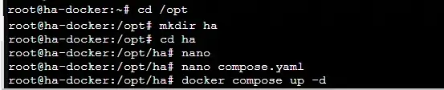
.. |image1309| image:: ../img/image1309.webp
   :width: 605px

.. |image1311| image:: ../img/image1311.webp
   :width: 700px
.. |image1312| image:: ../img/image1312.webp
   :width: 550px
.. |image1313| image:: ../img/image1313.webp
   :width: 550px
.. |image1314| image:: ../img/image1314.webp
   :width: 550px
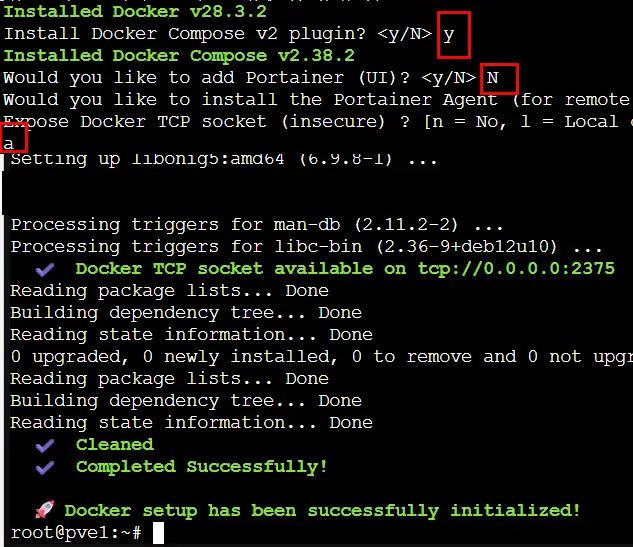
.. |image1316| image:: ../img/image1316.webp
   :width: 600px
.. |image1317| image:: ../img/image1317.webp
   :width: 605px
.. |image1318| image:: ../img/image1318.webp
   :width: 647px
.. |image1319| image:: ../img/image1319.webp
   :width: 489px
.. |image1323| image:: ../img/image1323.webp
   :width: 494px
.. |image1324| image:: ../img/image1324.webp
   :width: 650px
.. |image1326| image:: ../img/image1326.webp
   :width: 650px
.. |image1327| image:: ../img/image1327.webp
   :width: 700px
.. |image1350| image:: ../img/image1350.webp
   :width: 700px
.. |image1351| image:: ../img/image1351.webp
   :width: 616px
.. |image1406| image:: ../img/image1406.webp
   :width: 150px
.. |image1407| image:: ../img/image1407.webp
   :width: 700px
.. |image1408| image:: ../img/image1408.webp
   :width: 700px

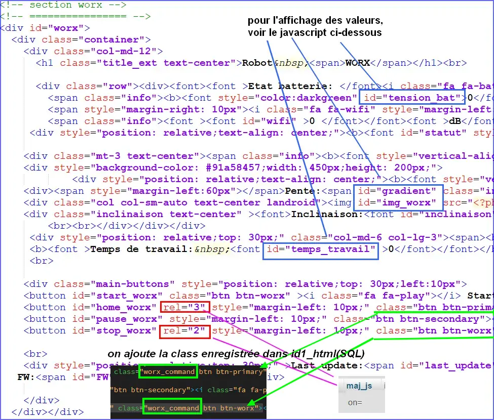
.. |image1422| image:: ../img/image1422.webp
   :width: 650px
.. |image1423| image:: ../img/image1423.webp
   :width: 700px
.. |image1424| image:: ../img/image1424.webp
   :width: 500px
.. |image1425| image:: ../img/image1425.webp
   :width: 700px
.. |image1427| image:: ../img/image1427.webp
   :width: 700px
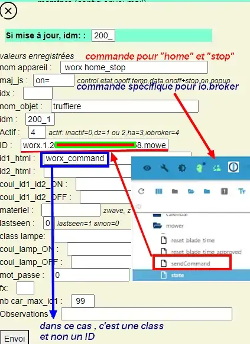
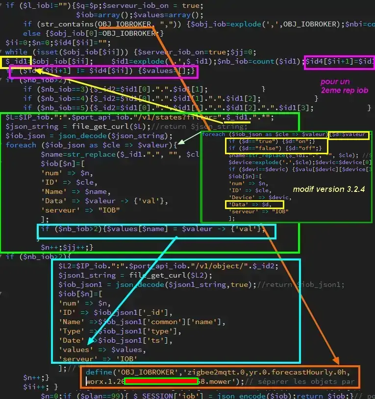

.. |image1431| image:: ../img/image1431.webp
   :width: 700px
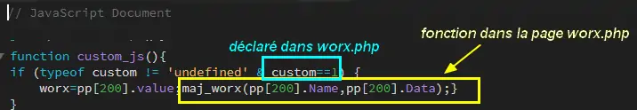
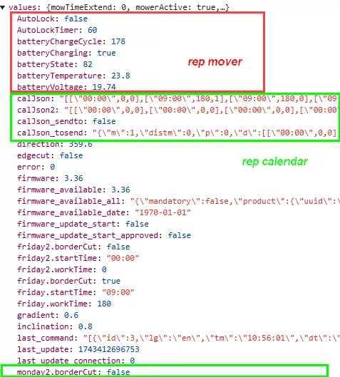

.. |image1435| image:: ../img/image1435.webp
   :width: 650px
.. |image1436| image:: ../img/image1436.webp
   :width: 650px
.. |image1437| image:: ../img/image1437.webp
   :width: 533px
.. |image1488| image:: ../img/image1488.webp
   :width: 700px
.. |image1489| image:: ../img/image1489.webp
   :width: 700px
.. |image1490| image:: ../img/image1490.webp
   :width: 516px
.. |image1491| image:: ../img/image1491.webp
   :width: 700px

.. |image1493| image:: ../img/image1493.webp
   :width: 700px
.. |image1494| image:: ../img/image1494.webp
   :width: 700px
.. |image1495| image:: ../img/image1495.webp
   :width: 360px

.. |image1503| image:: ../img/image1503.webp
   :width: 598px
.. |image1507| image:: ../img/image1507.webp
   :width: 650px

.. |image1509| image:: ../img/image1509.webp
   :width: 385px
.. |image1510| image:: ../img/image1510.webp
   :width: 284px

.. |image1519| image:: ../img/image1519.webp
   :width: 700px

.. |image1569| image:: ../img/image1569.webp
   :width: 700px

.. |image1579| image:: ../img/image1579.webp
   :width: 511px
.. |image1580| image:: ../img/image1580.webp
   :width: 605px
.. |image1581| image:: ../img/image1581.webp
   :width: 605px
.. |image1582| image:: ../img/image1582.webp
   :width: 597px
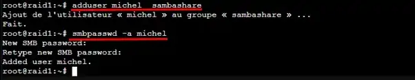

.. |image1585| image:: ../img/image1585.webp
   :width: 700px
.. |image1586| image:: ../img/image1586.webp
   :width: 646px

.. |image1589| image:: ../img/image1589.webp
   :width: 700px

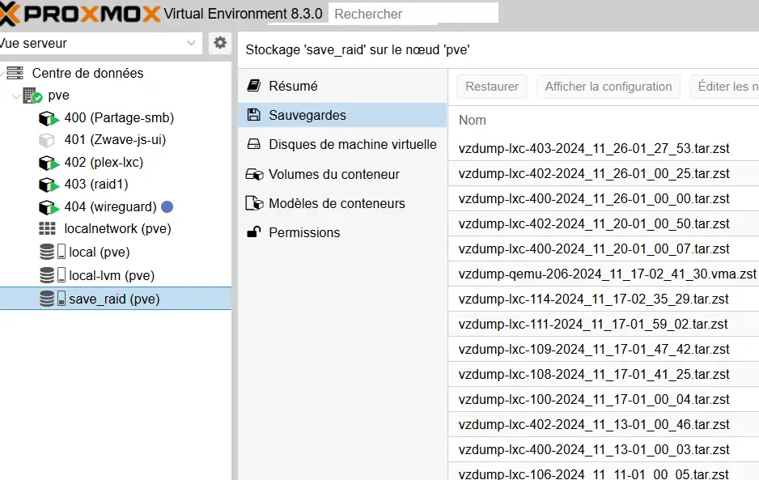

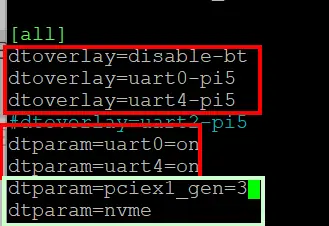

.. |image1631| image:: ../img/image1631.webp
   :width: 524px
.. |image1632| image:: ../img/image1632.webp
   :width: 605px
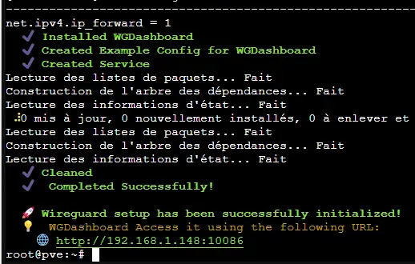

.. |image1635| image:: ../img/image1635.webp
   :width: 627px

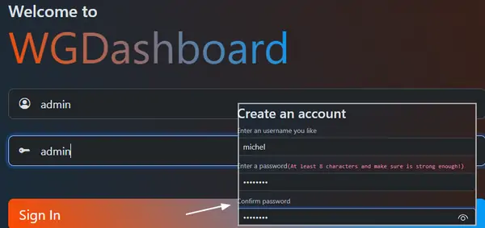
.. |image1638| image:: ../img/image1638.webp
   :width: 700px
.. |image1639| image:: ../img/image1639.webp
   :width: 313px
.. |image1641| image:: ../img/image1641.webp
   :width: 700px
.. |image1642| image:: ../img/image1642.webp
   :width: 650px
.. |image1643| image:: ../img/image1643.webp
   :width: 700px
.. |image1644| image:: ../img/image1644.webp
   :width: 480px
.. |image1645| image:: ../img/image1645.webp
   :width: 700px
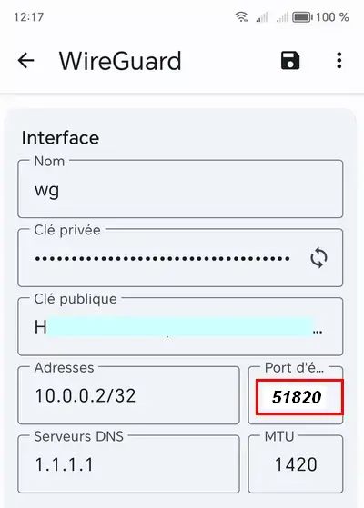
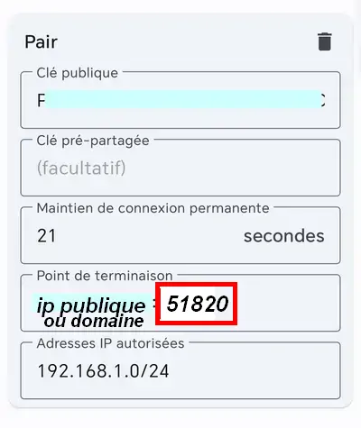
.. |image1648| image:: ../img/image1648.webp
   :width: 700px
.. |image1649| image:: ../img/image1649.webp
   :width: 497px
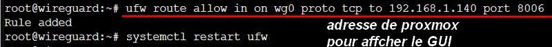
.. |image1651| image:: ../img/image1651.webp
   :width: 500px
.. |image1652| image:: ../img/image1652.webp
   :width: 650px
.. |image1653| image:: ../img/image1653.webp
   :width: 700px
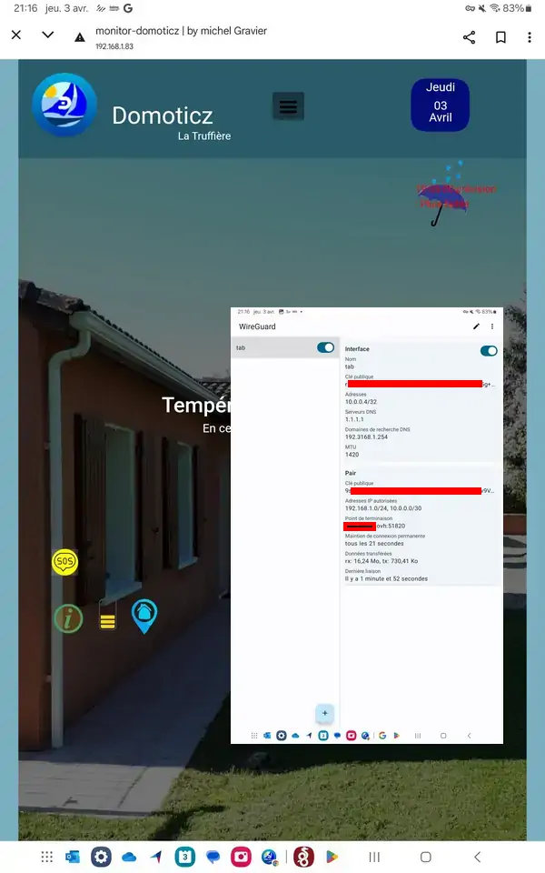
.. |image1655| image:: ../img/image1655.webp
   :width: 700px
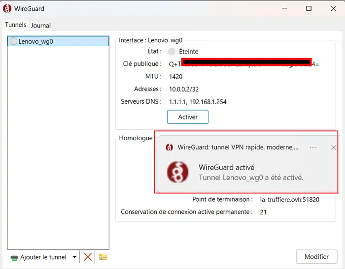
.. |image1657| image:: ../img/image1657.webp
   :width: 400px
.. |image1681| image:: ../img/image1681.webp
   :width: 700px
.. |image1683| image:: ../img/image1683.webp
   :width: 600px
.. |image1684| image:: ../img/image1684.webp
   :width: 530px
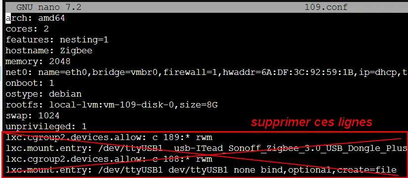
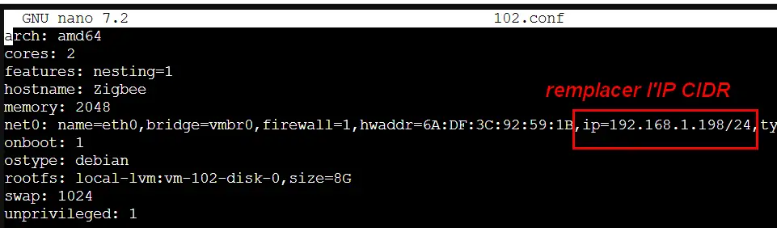
.. |image1687| image:: ../img/image1687.webp
   :width: 480px
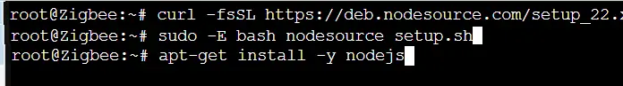
.. |image1689| image:: ../img/image1689.webp
   :width: 590px
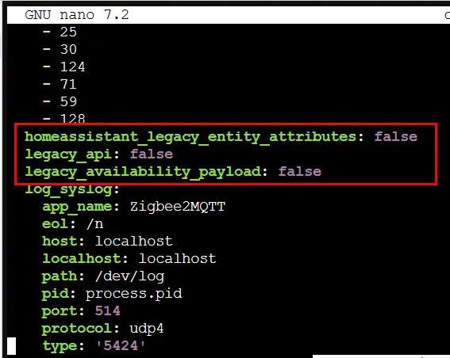
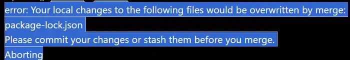
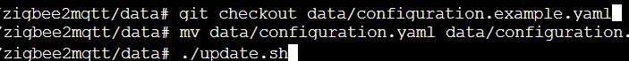
.. |image1693| image:: ../img/image1693.webp
   :width: 605px
.. |image1694| image:: ../img/image1694.webp
   :width: 530px
.. |image1695| image:: ../img/image1695.webp
   :width: 641px

.. |image1697| image:: ../img/image1697.webp
   :width: 605px

.. |image1699| image:: ../img/image1699.webp
   :width: 500px

.. |image1701| image:: ../img/image1701.webp
   :width: 500px
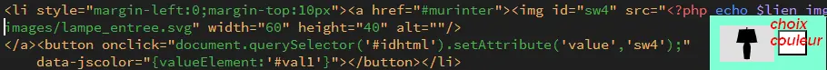
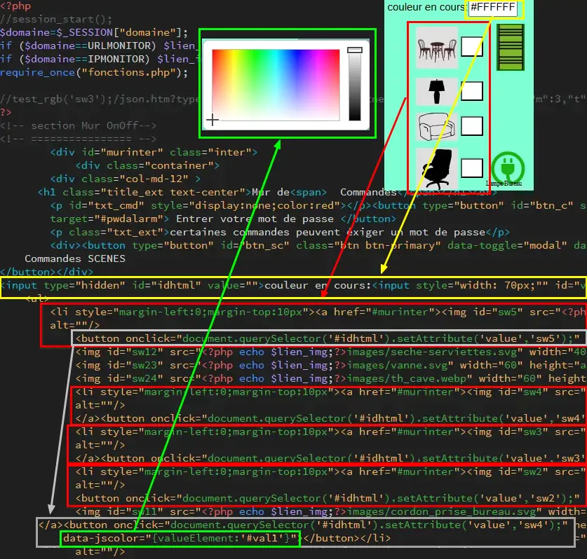
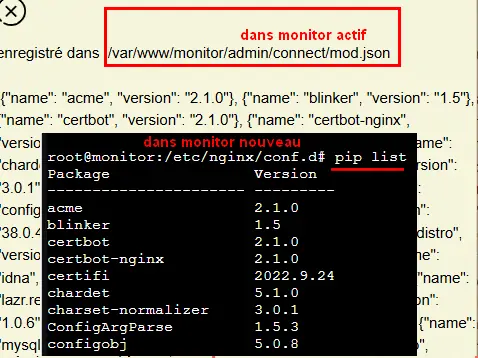
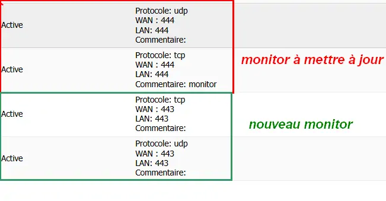
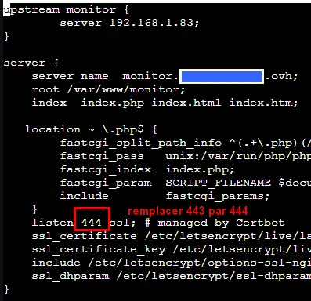
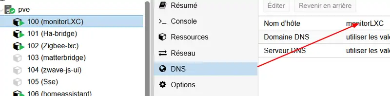
