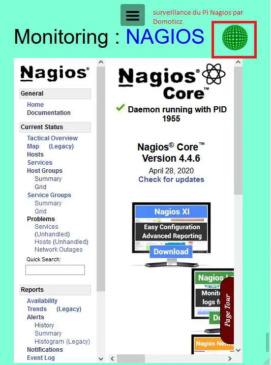
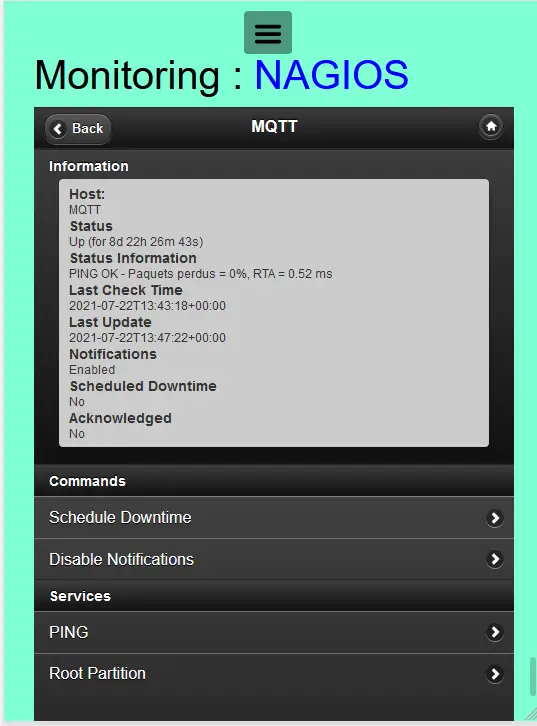

11. MONITORING Nagios
---------------------
Avec Nagios ou Nagios mobile sur monitor

.. note::

   L’app Nagios PC est installée sur un Raspberry 4 8Go, celui qui gère également les sauvegardes et la com GSM

|image668|

|image669|

11.1 accès distant 
^^^^^^^^^^^^^^^^^^
Il faut configurer Nginx et ensuite demander un certificat Letsencrypt,

Voir paragraphe :ref:`9.1 accès distant` , *un exemple de configuration avant de faire une demande de certificat* ; 

11.2 Supprimer l’affichage YouTube
^^^^^^^^^^^^^^^^^^^^^^^^^^^^^^^^^^

