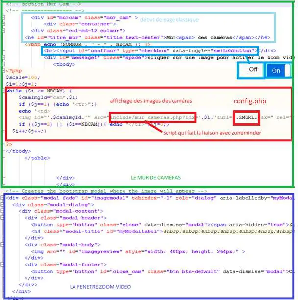
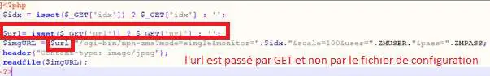

7. MUR de CAMERAS
-----------------
.. warning::

   Zoneminder doit être installé

Pour éviter des problèmes de capacité mémoire, vider le cache périodiquement avec CRON : 

**crontab -e** |image555|

*Avec nano ou vim* :

.. code-block:: 

   0 12 * *  * sync; echo 3 > /proc/sys/vm/drop_caches

|image556|

Ici la mémoire sera libérée des données cache et tampon tous les jours à 12H ; 

.. note:: **plus d’ infos** : https://www.tomzone.fr/vider-la-memoire-cache-dun-serveur-linux/

|image557|

.. warning:: 

   Il est important d’ajouter les caméras dans Zoneminder les unes après les autres sans en supprimer afin que ces cameras suivent un ordre chronologique (1,2,3,4,5, 6, ...)
   
   Voir la page : http://domo-site.fr/accueil/dossiers/44

   |image558|

7.1- les pages index_loc.php, header.php, entete_html.php
^^^^^^^^^^^^^^^^^^^^^^^^^^^^^^^^^^^^^^^^^^^^^^^^^^^^^^^^^

- **Index_loc.php** , en général, ne pas modifier 

.. code-block:: 

   if (ON_MUR==true) {include ("include/mur_cam.php");
   $_SESSION["zmuser"]=ZMUSER;$_SESSION["zmpass"]=ZMPASS;}

.. note:: $_SESSION["zmuser"]=ZMUSER;$_SESSION["zmpass"]=ZMPASS;}: voir les explications ci-après

- **config.php**

.. code-block:: 

   // utilisation du mur :true sinon false , Nom du mur , nb caméras
   define('ON_MUR',true);// mise en service MUR
   define('NOMMUR','');// nom du mur
   define('NBCAM','0');// nombre caméras
   // Zoneminder
   define('ZMURL','http://192.168.1.23/zm');//IP/zm
   define('ZMURLTLS','https:zoneminder.DOMAINE.ovh');// sous domaine
   define('ZMUSER','michel');// pour mur_cameras.php
   define('ZMPASS','MOT_PASSE');// pour mur_cameras.php
   define('TIMEAPI','3400');//suivant la valeur indiquée dans zoneminder

- **header.php** , il n'y a rien à modifier

 |image561|

- **entete_html.php** , pour le switch ajouter cette ligne

.. code-block:: 

   <link href="bootstrap/bootstrap-switch-button.css" rel="stylesheet">

.. info:: https://github.com/gitbrent/bootstrap-switch-button/releases/latest

7.2- la page de monitor 
^^^^^^^^^^^^^^^^^^^^^^^^^^^^^^^^^^^^^
- **mur_cam.php**

 |image563|

- **Le script du bouton On/Off** , dans footer , ajouter cette ligne:

.. code-block:: 

   

|image565|

- **mur_cameras.php**

|image566|

.. warning::

   **IMPORTANT** : le fichier include/mur_cameras.php est indépendant du programme (‘est une image en retour) et de ce fait on ne peut utiliser les constantes définies dans admin/config.php
   On va donc pour remédier à ce problème :
   -	passer l’url en paramètre ainsi que l’Idx
   -	utiliser les variables de session :red:`$_SESSION["zmuser"] et $_SESSION["zmpass"] pour le login et le mot de passe` car ces données sont sensibles 

**Les fichiers sont tous UTF-8 sans BOM** et l’url des caméras doit se trouver dans :darkblue:`mur_cam.php`. (:red:`ZMURL dans mur_cam.php` et non dans mur_cameras.php); 

Extrait de mur_cam.php

.. code-block:: 

   <?php
   $scale=100;$i=1;$j=1;
   while ($i <= NBCAM) {
	   $camImgId="cam".$i;
	   if ($j==1) {echo "<tr>";}
  	   echo '<td>
	   </td>';
	   if (($j==2) || ($i==NBCAM)){ echo "</tr>";$j=0;}
     $i++;$j++;}				

|image568|

7.3- Les scripts JS pour la vidéo dans footer.php 
^^^^^^^^^^^^^^^^^^^^^^^^^^^^^^^^^^^^^^^^^^^^^^^^^
Le Zoom Bootstrap :

.. |image555| image:: ../media/image555.webp
   :width: 332px
.. |image556| image:: ../media/image556.webp
   :width: 700px
.. |image557| image:: ../media/image557.webp
   :width: 536px
.. |image558| image:: ../media/image558.webp
   :width: 601px
.. |image561| image:: ../media/image561.webp
   :width: 570px

.. |image565| image:: ../media/image565.webp
   :width: 581px
.. |image566| image:: ../media/image566.webp
   :width: 700px

