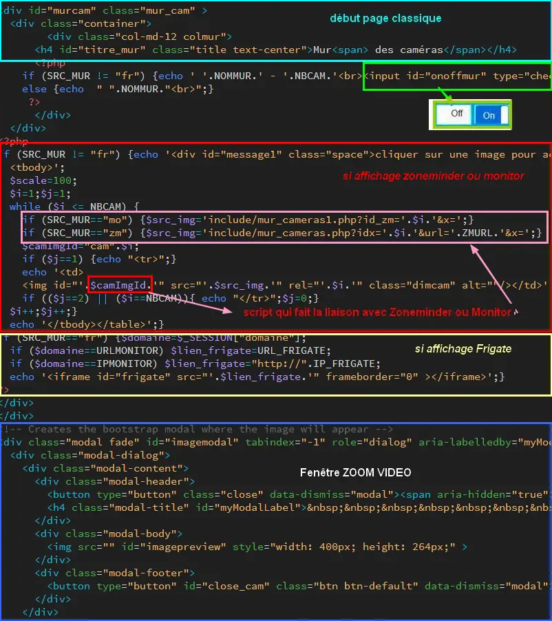

7. MUR de CAMERAS
-----------------
Plusieurs possibilités :

- Installation de Frigate avec un accélérateur Coral pcie ou usb et l'app go2rtc

- installation de Zoneminder et lecture des caméras à partir de celui-ci

- lecture des caméras directementà partir de Monitor

.. note::

    Aujourd'hui, j'ai installé le mur avec Frigate sur ma tablette Samsung tabs9+ et le mur de caméras avec monitor sur une vielle tablette accrochéedans la cuisine.cela en utilisant une configuration différente pour chaque tablette.....voir ce paragraphe :
:ref:`0.4.1 Un fichier de configuration par écran de contrôle`

.. warning::

   Les images peuvent provenir de Zoneminder ou de Monitor, depuis la table "cameras". :red:`Avec les derniéres versions de Zoneminder l'utilisation du cpu atteint en permanence 100% aussi j'ai fai le choix d'abandonner progressivement zoneminder et la 1ere étape a été de d'afficher le mur de caméras depuis monitor`

   Le choix se fait dans admin/config.php

   .. code-block::

      define('SRC_MUR','mo');// zm=Zoneminder, mo=monitor, fr=Frigate

Pour éviter des problèmes de capacité mémoire, vider le cache de Zoneminder ou Monitor périodiquement avec CRON : 

**crontab -e** |image555|

*Avec nano ou vim* :

.. code-block:: 

   0 12 * *  * sync; echo 3 > /proc/sys/vm/drop_caches

|image556|

Ici la mémoire sera libérée des données cache et tampon tous les jours à 12H ; 

.. note:: **plus d’ infos** : https://www.tomzone.fr/vider-la-memoire-cache-dun-serveur-linux/

*Affichage mo ou zm:*

|image557|

*Affichage fr:*

|image1618|

.. warning:: 

   **Images provenant de Zoneminder**

   Il est important d’ajouter les caméras dans Zoneminder les unes après les autres sans en supprimer afin que ces cameras suivent un ordre chronologique (1,2,3,4,5, 6, ...); c'est l'id de Zoneminder qui doit être ajouté  dans la BD (id_zm)
   
   Voir la page : http://domo-site.fr/accueil/dossiers/44

   |image558|

   **Images gérées par monitor**

   Il suffit de numéroter les caméras (id_zm) dans l'ordre souhaité  

7.1- les pages index_loc.php, header.php, entete_html.php
^^^^^^^^^^^^^^^^^^^^^^^^^^^^^^^^^^^^^^^^^^^^^^^^^^^^^^^^^

- **Index_loc.php** , en général, ne pas modifier 

.. code-block:: 

   if (ON_MUR==true) {include ("include/mur_cam.php");
   $_SESSION["zmuser"]=ZMUSER;$_SESSION["zmpass"]=ZMPASS;}

.. note:: 

   $_SESSION["zmuser"] et $_SESSION["zmpass"], voir les explications ci-après

- **config.php**

.. code-block:: 

   // utilisation du mur :true sinon false , Nom du mur , nb caméras
   define('ON_MUR',true);// mise en service MUR
   define('NBCAM','0');// nombre caméras ,pour frigate = non concerné
   define('SRC_MUR','mo');// zm=Zoneminder, mo=monitor,fr=Frigate
   define('IP_FRIGATE','http://192.168.1.2:5000');// pour Frigate
   define('URL_FRIGATE','https://<SOUS-DOMAINE>');// 
   // Zoneminder
   define('ZMURL','http://192.168.1.23/zm');//IP/zm
   define('ZMURLTLS','https:zoneminder.DOMAINE.ovh');// sous domaine
   define('ZMUSER','<LOGIN>');// pour mur_cameras.php
   define('ZMPASS','MOT_PASSE');// pour mur_cameras.php
   define('TIMEAPI','3400');//suivant la valeur indiquée dans zoneminder

- **header.php** , il n'y a rien à modifier

 |image561|

- **entete_html.php et footer.php** , pour le switch ajouter ces lignes 

.. warning:: modification depuis la version 3.1.3 (la précédente version du switch ne fonctionne plus)

.. code-block:: 

   <!-- entetete.php  -->
   <link href="bootstrap/css/bootstrap4-toggle.min.css" rel="stylesheet">
    <!-- footer.php  -->
   

.. note:: 

   https://gitbrent.github.io/bootstrap4-toggle/

7.2- la page de monitor 
^^^^^^^^^^^^^^^^^^^^^^^^^^^^^^^^^^^^^

- **mur_cam.php**

 |image1387|

- **Le script du bouton On/Off** , dans footer , ajouter cette ligne:

.. code-block:: 

   

|image565|

- **mur_cameras.php** , pour Zoneminder

|image566|

- **mur_cameras1.php** , pour Monitor

|image1388|

.. warning::

   **IMPORTANT POUR ZONEMINDER** : le fichier include/mur_cameras.php est indépendant du programme (‘est une image en retour) et de ce fait on ne peut utiliser les constantes définies dans admin/config.php
   
   On va donc pour remédier à ce problème :

   -	passer l’url en paramètre ainsi que l’Idx

   -	utiliser les variables de session :red:`$_SESSION["zmuser"] et $_SESSION["zmpass"] pour le login et le mot de passe` car ces données sont sensibles 

   **Les fichiers sont tous UTF-8 sans BOM** et l’url des caméras doit se trouver dans :darkblue:`mur_cam.php`. (:red:`ZMURL dans mur_cam.php` et non dans mur_cameras.php); 

Extrait de mur_cam.php

.. code-block:: 

   <?php
   while ($i <= NBCAM) {
	if (SRC_MUR=="mo") {$src_img='include/mur_cameras1.php?id_zm='.$i.'&x=';}
	if (SRC_MUR=="zm") {$src_img='include/mur_cameras.php?idx='.$i.'&url='.ZMURL.'&x=';}				

|image1389|

7.3- Les scripts JS pour la vidéo dans footer.php 
^^^^^^^^^^^^^^^^^^^^^^^^^^^^^^^^^^^^^^^^^^^^^^^^^
**NE CONCERNE PAS FRIGATE**

Le Zoom Bootstrap :

|image569|

.. important:: **Rafraichissement des images** 

   Pour limiter l’utilisation de la bande passante, le rafraichissement des images n’a lieu que si le bouton est sur ON ; par contre même sur OFF le zoom d’une caméra est opérationnel
   La fonction updateImage() dans footer.php

  .. code-block:: 
 
   function updateImage(camIndex)
   {if (arret_mur==0) return false;
	// get cam image ID
	camImgId="cam" + camIndex;
	
	// if cam image element is fully downloaded
	if (document.getElementById(camImgId).complete==true) 
	{	now=new Date();
	// update cam index to next cam
		camIndex++;
		if (camIndex > nbrCam) camIndex=1;
		// update next cam URL to force refresh
		camImgId="cam" + camIndex;
	 
		camImg=document.getElementById(camImgId);
		camImgURL=camImg.src;console.log('gg'+camImgURL);
		camImg.src=URL[camIndex]+now.getTime();
	}

   |image571|

.. ATTENTION:: Les caméras ne sont pas en https, pour éviter les certificats, mais comme l’accès se fait en local (sur le réseau 192.168.1.x) et enregistre une image, sur le serveur, chaque 100ms pour recréer une 
   vidéo, l’accès distant en https est assuré.

   |image572|

7.4- Ajouter une caméra
^^^^^^^^^^^^^^^^^^^^^^^
**NE CONCERNE PAS FRIGATE**

Il suffit d’indiquer dans admin/config.php le nb de caméras

 .. code-block:: 

   define('NBCAM','8');// nombre 

.. |image555| image:: ../media/image555.webp
   :width: 332px
.. |image556| image:: ../media/image556.webp
   :width: 700px
.. |image557| image:: ../media/image557.webp
   :width: 536px
.. |image558| image:: ../media/image558.webp
   :width: 601px
.. |image561| image:: ../media/image561.webp
   :width: 570px
.. |image565| image:: ../media/image565.webp
   :width: 581px
.. |image566| image:: ../media/image566.webp
   :width: 700px

.. |image571| image:: ../media/image571.webp
   :width: 538px
.. |image572| image:: ../media/image572.webp
   :width: 566px

