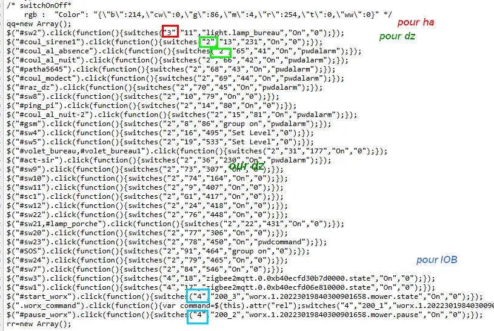

8. MUR de COMMANDES ON/OFF
--------------------------

|image574|

|image575|

8.1 les fichiers de base 
^^^^^^^^^^^^^^^^^^^^^^^^
Index_loc.php en général ne pas modifier

.. code-block:: 

   if (ON_ONOFF==true) include ("include/mur_inter.php");

- **header.php**

.. code-block:: 

   <?php if (ON_ONOFF==true) echo '<li class="zz"><a href="#murinter">Mur On/Off</a></li>';?>

- **styles** : mes_css.css

.. code-block:: 

   #murinter{
    width: 100%;
    height: 1120px;padding: 80px 0;
    min-height: 100%;
    position: relative;
    color: #000;
    top: 350px;z-index:-20;overflow: auto;
   }
   #murinter{background-color: aquamarine;}

8.1.1 écriture automatique du javascript
========================================
Effectuée par une fonction PHP à partir de la base de données

Extrait de la page html pour des commandes pour Domoticz et Home Assistant:

|image580|

voir le § :ref:`switches <bien_debuter>`

8.2 mur_inter.php
^^^^^^^^^^^^^^^^^^

8.2.4 Exemple volet roulant
=============================

.. |image574| image:: ../media/image574.webp
   :width: 528px
.. |image575| image:: ../media/image575.webp
   :width: 629px

