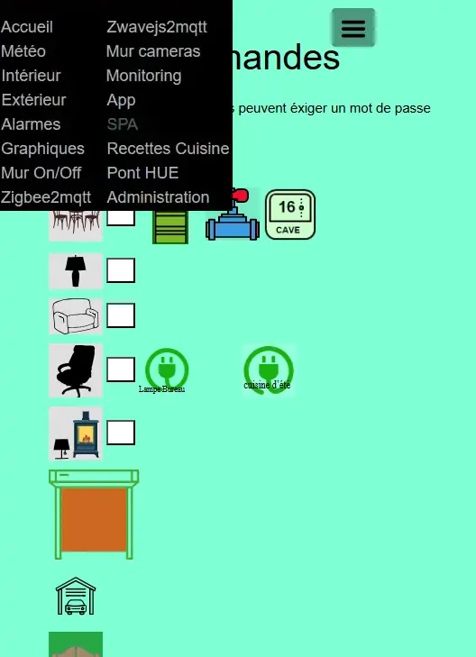
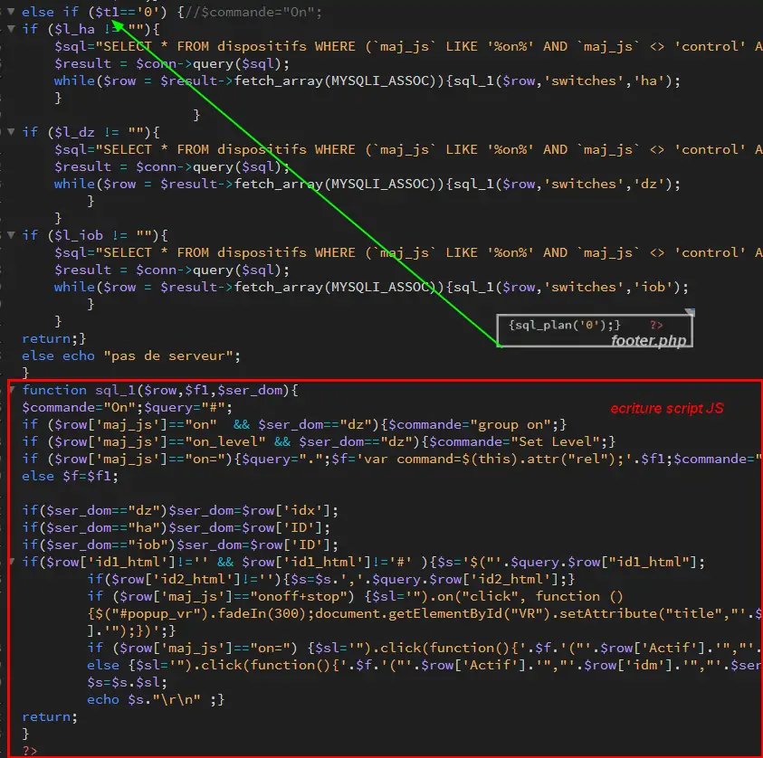
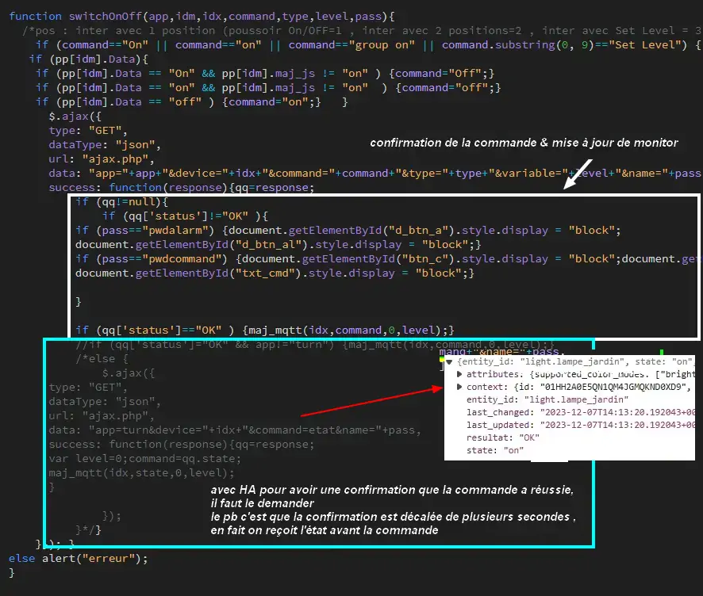
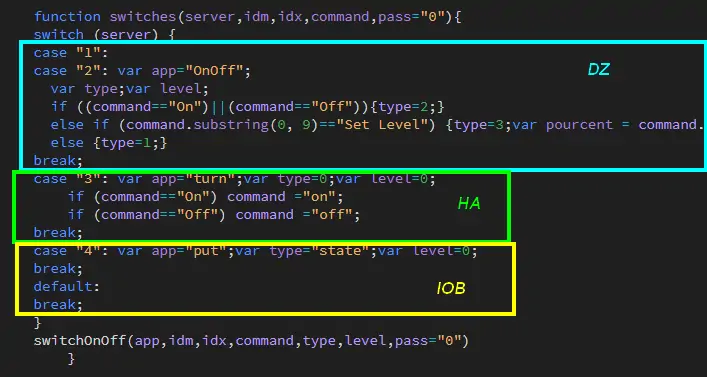
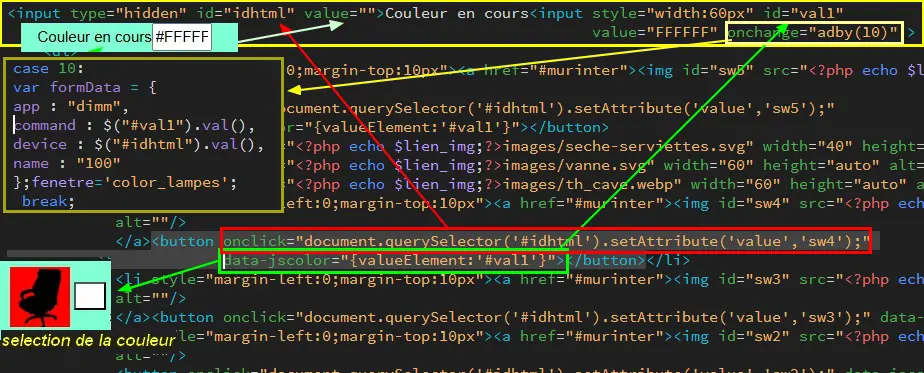
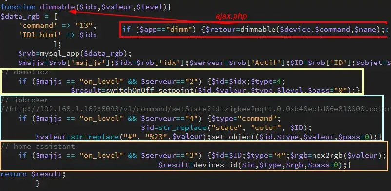

8. MUR de COMMANDES
-------------------

|image574|

|image575|

8.1 les fichiers de base 
^^^^^^^^^^^^^^^^^^^^^^^^
Index_loc.php en général ne pas modifier

.. code-block:: 

   if (ON_ONOFF==true) include ("include/mur_inter.php");

- **header.php**

.. code-block:: 

   <?php if (ON_ONOFF==true) echo '<li class="zz"><a href="#murinter">Mur On/Off</a></li>';?>

- **styles** : mes_css.css

.. code-block:: 

   #murinter{
    width: 100%;
    height: 1120px;padding: 80px 0;
    min-height: 100%;
    position: relative;
    color: #000;
    top: 350px;z-index:-20;overflow: auto;
   }
   #murinter{background-color: aquamarine;}

8.1.1 écriture automatique du javascript
========================================
Effectuée par une fonction PHP à partir de la base de données

|image1212|

Extrait de la page html pour des commandes pour Domoticz et Home Assistant:

|image580|

voir le §  :ref:`0.3.2 Les Dispositifs`  *exemple des scripts générés automatiquement*

8.1.2 Commandes de changement d'état
====================================
.. note::

   pour zigbee2mqtt, le dialogue s'effectue en mqtt sous javacript

.. admonition:: les fonctions PHP

   **pour l'API Home Assistant**

   .. code-block::

      function devices_id($deviceid,$type,$value="",$pass=0){$post="";global $L_ha,$Token_ha; 
	$type= strtolower($type);
	$mat=explode('.',$deviceid);$mat=$mat[0];
	switch ($type) {
	case "etat" :		
	$api="api/states/".$deviceid;$mode=1;	
	break;
	case "service" :
	$api="api/services";$mode=1;	
	break;
	case "on" :
	$mode=2;	
	if ($mat=="input_boolean") {$api="api/services/input_boolean/turn_on";$post='{"entity_id": "'.$deviceid.'"}';}	
	if ($mat=="switch") {$api="api/services/switch/turn_on";$post='{"entity_id": "'.$deviceid.'"}';}
	if ($mat=="light") {$api="api/services/light/turn_on";$post='{"entity_id": "'.$deviceid.'"}';}	
	break;
	case "off" :
	$mode=2;	
	if ($mat=="input_boolean") {$api="api/services/input_boolean/turn_off";$post='{"entity_id": "'.$deviceid.'"}';}
	if ($mat=="switch") {$api="api/services/switch/turn_off";$post='{"entity_id": "'.$deviceid.'"}';}
	if ($mat=="light") {$api="api/services/light/turn_off";$post='{"entity_id": "'.$deviceid.'"}';}	
	break;
	case "4" ://"entity_id":"light.salon", "brightness": 255, "rgb_color": [20,30,20]
	$mode=2;$rgb=$value;//$value=str_replace('(','[',$value);$value=str_replace(')',']',$value);	
	$api="api/services/light/turn_on";$post='{"entity_id": "'.$deviceid.'", "brightness": 255, "rgb_color": '.json_encode($value).'}';
	break;		
	case "value" :
	$mode=2;	
	if ($mat=="input_text") {$api="api/services/input_text/set_value";$post='{"entity_id": "'.$deviceid.'" , "value" : "'.$value.'" }';}	
	break;	
	default:
	}								
	$L=$L_ha.$api;
	$ha=file_http_curl($L,$mode,$post,$Token_ha);
	$data = json_decode($ha, true);
	$data['status']="OK";										
	$data['address_api']=$post;										
	return json_encode($data);}

   **pour l'API de Domoticz**

   .. code-block::

      function switchOnOff_setpoint($idx,$valeur,$type,$level,$pass="0"){$auth=9;global $L_dz;
	// exemple : http://192.168.1.75:8082/json.htm?type=command&param=udevice&idx=84&nvalue=Off&svalue=2
	//  /json.htm?type=command&param=switchlight&idx=99&switchcmd=Set%20Level&level=6
	//  /json.htm?type=command&param=setcolbrightnessvalue&idx=99&hex=RRGGBB&brightness=100&iswhite=false																   
	if ($pass=="0") {$auth=0;}
	if ((($pass==NOM_PASS_CM)&&($_SESSION['passwordc']==PWDCOMMAND))&&($_SESSION['timec']>time())) {$auth=1;}
	if (($pass==NOM_PASS_AL)&&($_SESSION['passworda']==PWDALARM)&&($_SESSION['time']>time())) {$auth=2;}
	if ($auth<3){$json2="json.htm?type=command&param=";
	// $type=1 .....
	if ($type==1){$json1='udevice&idx='.$idx.'&nvalue=group%20on&svalue=2';}
	// $type=2 .....ON/OFF
	if ($type==2){$json1='switchlight&idx='.$idx.'&switchcmd='.$valeur;}
	// $type=3 Réglez une lumière dimmable/stores/sélecteur à un certain niveau
	if ($type==3){$json1='switchlight&idx='.$idx.'&switchcmd=Set%20Level&level='.$level;}
	// $type=4 Réglez une lumière RVB dimmable
	if ($type==4){
	$hex=substr($valeur,1,6);$json1='setcolbrightnessvalue&idx='.$idx.'&hex='.$hex.'&brightness='.$level.'&iswhite=false';}		 
	$json= $L_dz.$json2.$json1;
	$json_string=file_get_curl($json);
	$result = json_decode($json_string, true);
	}
	else {$result['status']="acces interdit";}
	return $result ;
	  }

   **pour l'API de Io.broker** , avec :darkblue:`ioBroker Swagger UI`, voir le § :ref:`0.2.3.3 pour IoBroker`

      .. code-block::

         function set_object($device,$type,$value,$pass=0){global $Token_iob,$port_api_iob,$IP_iob;
	 //http://192.168.1.104:8093/v1/state/zigbee2mqtt.0.0xa4c13878aa747f7e.state?value=false		
	 //http://192.168.1.162:8093/v1/command/setState?id=zigbee2mqtt.0.0xb40ecfd06e810000.color&state=%231BFF42											
	 //$mode=1;//$device=$device.".".$type;
	 switch ($type) {
	 case "state" :	
 	 if ($value=="On") {$value='true';}
	 if ($value=="Off") {$value='false';}
	 $L=$IP_iob.':'.$port_api_iob.'/v1/state/'.$device.'?value='.$value;
	 break;
	 case "command" :
	 $L=$IP_iob.':'.$port_api_iob.'/v1/command/setState?id='.$device.'&state='.$value;	
	 //file_http_curl($L,$mode,$post,$token)
	 break;
	 default:
	 }		
	 $iob=file_get_curl($L);
	 $iob = json_decode($iob, true);
	 $data['status']="OK";			
	 $data['id']=$iob['id'];		
	 $data['valeur']=$iob['val'];	 
	 return $data;										
	 }

.. admonition:: les fonctions Javascript

   |image1214|

   |image1213|

8.1.2.1 client mqtt zigbee2mqtt
"""""""""""""""""""""""""""""""
**Depuis la version monitor 4.1.0**: MQTT.js remplace Paho, voir ce § ref:`9.5.4 Installation de mqtt.JS coté client`

voir le paragrahe ref:`8.2.6.3.2 avec Paho-MQTT`  pour utiliser Paho js

.. admonition:: **publier un message**

   ., code-block::

       function publish_mqtt(idx,type,command,level=0){
       // Publish a Message
      	var msg='{ "'+ type+'":"'+ command+'"}';console.log(msg);
	    var topic='zigbee2mqtt/'+idx+'/set';
	   client.publish(topic, msg);return;
      }

8.1.2.2 Commandes de changement de couleur des lampes
"""""""""""""""""""""""""""""""""""""""""""""""""""""
le color picker jscolor.js est utilisé: https://jscolor.com/

.. admonition:: explications concernant les couleurs des lampes zigbee

   les couleurs peuvent être modifiées par :

   - le systeme hue huesat ( h & s + brigthness)
   - le systeme de coordonnées xy (x & y + brightness)
   - color_temp pour les différente couleurs de blancs(valeurs en mired( pour simplifier c'est l'inverse des ° Kelvin)

   Scripts PHP utilisé pour la conversion Hex vers rgb,hs,xy et mired(1 000 000/Kelvin)

   .. code-block::

      function power($c){
	  if ($c> 0.04045){$c = pow(($c + 0.055) / (1.0 + 0.055), 2.4);}
	  else {$c = ($c/12.92);}
	  return $c;}

	  function hextohsl($hex,$lum){// ex: #FFFFFF , 255
	  require ('ColorConverter.php');
	  $converter = new ColorConverter();
	  $color=[];
	  // Convert HEX to RGB
	  $rgb = $converter->hexToRgb($hex); // [255, 87, 51]
	  // convert RGB to xy
	  $red = power(($rgb[0]/255),2.4);$green=power(($rgb[1]/255),2.4);$blue=power(($rgb[2]/255),2.4);
	  $X = ($red * 0.664511) + ($green * 0.154324) + ($blue * 0.162028);
	  $Y = ($red * 0.283881) + ($green * 0.668433) + ($blue * 0.047685);
	  $Z = ($red * 0.000088) + ($green * 0.072310) + ($blue * 0.986039);
	  $x = $X/($X + $Y + $Z);$y = $Y/($X + $Y + $Z);// 0.1234  0.4567
	  // convert xy to CCT (temp_color)
	  $n = ($x-0.3320)/(0.1858-$y) ;
	  $CCT = 437*pow($n,3) + 3601*pow($n,2) + 6861*$n + 5517;
	  $mired=intval(1000000/$CCT);
	  // Convert HEX to HSL
	  $hsl2 = $converter->hexToHsl($hex); // [10.59, 100, 60]
	  if ($lum>253) {$hsl2[0]=51;$hsl2[1]=100;$hsl2[2]=100;}
	  $color=[
	  	R' => $rgb[0], 
 	    V' => $rgb[1],
   	   'B' => $rgb[2],
       'rgb' => $rgb,
       'hsl' => $hsl2,
       'Hue' => $hsl2[0],
       'Saturation' => $hsl2[1], 
       'luminosité' => $hsl2[2],
       'x' => round($x,4),
       'y' => round($y,4),
       'CCT' => $CCT,
       'mired' => $mired
        ];
      return $color;}

 |image1409|

le fichier include/mur_inter.php

|image1410|

Dans include/footer.php la fonction suivante permet d'envoyer aux api (DZ, HA, IOB) la couleur choisie  (pour DZ ,IOB, HA); pour Zigbee2mqtt la fonction envoie directement un message websocket à z2m.

.. code-block::

   function adby(choix) {var formData=new Array();
    case 10: // couleur lampes
	var lumin=get_brightness($("#val1").val());
	//document.getElementById('val2').value =lumin;
	$("#val2").val(lumin);
	var formData = {
	app : "dimm",
	command : $("#val1").val(),
	type : lumin,
	device : $("#idhtml").val(),
	name : "100"		
	};fenetre='color_lampes';dType="json";
	break;		 
	default:
	}
    $.ajax({
      type: "GET",
      url: "ajax.php",
      data: formData,
      dataType: dType,
	success:function (data) {
		$('#'+fenetre).empty();
		if (choix !=10) {document.getElementById(fenetre).innerHTML = data;document.getElementById(fenetre).style.display = "block";}
		else {
			if (data['serveur']==6){ const msg=data['payload'];const topic=data['topic'];
				client.publish(topic, msg);}  
			}
		},
		error: function() { 
                          alert('La requête n\'a pas abouti'); 
                        } 
      });
     }	

Pour calculer la luninosité:

.. code-block::

   function get_brightness(hexCode) {
   // strip off any leading #
   hexCode = hexCode.replace('#', '');

   var c_r = parseInt(hexCode.substr(0, 2),16);
   var c_g = parseInt(hexCode.substr(2, 2),16);
   var c_b = parseInt(hexCode.substr(4, 2),16);

   return Math.round(((c_r * 299) + (c_g * 587) + (c_b * 114)) / 1000);
   }

Dans fonctions.php :

|image1776|

8.2 mur_inter.php
^^^^^^^^^^^^^^^^^^
Sans les changements de couleurs pour les lampes

|image582|

8.2.1 Exemple avec node red
===========================
L’interrupeur mécanique de l’éclairage extérieur de l’entrée commande également en zigbee l’éclairage du jardin.

Cette solution est un exemple pour des cas paticuliers ; la solution plus simple est d'utiliser un groupe ou une scène.

|image583| |image584|

**Domoticz** , Les capteurs virtuels

|image585|

Les capteurs sont mis à jour par MQTT et node-red depuis zigbee2mqtt

.. admonition:: **Les scripts node-red** 

   *envoi vers domoticz/in*

   |image586|

   *La réponse de Domoticz* 

   |image587|

.. important:: **Ce script automatique de Domoticz ne suffit pas en cas de commande de l’interrupteur car le délai de réponse de domoticz/out peut atteindre plus de 10 s, il faut donc envoyer un message MQTT à partir de l’interrupteur virtuel.**

.. admonition:: **Le script python lancé par la « lampe_ext_entree »**

   Ce script publie un message MQTT vers zigbee2mqtt pour allumer l’éclairage du jardin si 
   l’interrupteur « lampe_ext_entree » est actionné

   |image588|

   .. code-block:: 

      .../domoticz/scripts/python/mqtt.py zigbee2mqtt/eclairage_ext/set state_l2 ON 
      .../domoticz/scripts/python/mqtt.py zigbee2mqtt/eclairage_ext/set state_l2 OFF

   **le script mqtt.py**

   voir ce §  :ref:`18.2.1 Le script pour envoyer des messages (mqtt.py)`
   
   |image591|

|paho|
 
https://www.eclipse.org/paho/index.php?page=clients/python/docs/index.php

8.2.2 Problème de lecture de fichier
====================================

Pour éviter des erreurs (512, 256), penser à convertir le fichier python en Unix s’il a été créé
avec Notepad++

.. admonition:: **dos2unix**
   installation  et commande bash pour convertir le fichier en Unix

   .. code-block:: 

      sudo apt install dos2unix

   .. code-block::

      dos2unix <CHEMIN/NOM DU FICHIER>

.. attention:: 

   Attention aussi aux autorisations

   |image590|

8.2.3 Exemple pour un éclairage de jardin
=========================================
Cet exemple est choisi car un interrupteur sur le mur de commandes allume plusieurs lampes dont l'allumage doit aussi être visible sur le plan extérieur.

**Le plan**: un interrupteur est ajouté

|image592|

**monitor** le fichier exterieur.php

Les lampes concernées en gris et jaune

|image595|

|image596|

*css pour les lampes de* :darkblue:`exterieur_svg.php`

.. code-block:: 

   /*exterieur*/
   .txt_ext{position:relative;top:20px;left:20px;}
   .lj1{fill:#a29e9e;}
   .lj2{fill:#a29e9e;}

|image594|

**La Base de Données**

|image597|

**Le Javascript** dans footer.php

- *maj_devices()*

|image598|

- *maj_mqtt()* , remplace depuis la version 2.2.7 maj_switch()

|image599|

   la fonction PHP pour établir la table decorrespondance entre idm et ID ou idx

   |image1416|

8.2.4 Exemple pour arrosage jardin
==================================
*Relais Sonoff wifi ip 192.168.x.x :8081*

**DOMOTICZ** : Le Capteur virtuel :

|image601|

|image602|

Le capteur est ajouté au plan

|image604|

**Le script python**

.. code-block:: 

   #!/usr/bin/env python3.7
   # -*- coding: utf-8 -*-
   import sys
   import urllib.request
   import json    
   total_arg = len(sys.argv)
   if (total_arg>0) : arg= str(sys.argv[1])
   data = '{"deviceid":"1000a0876c","data":{"switch":"'+arg+'"}}'
   url = 'http://192.168.1.146:8081/zeroconf/switch'
   req = urllib.request.Request(url)
   dataasbytes = data.encode('utf-8')   # needs to be bytes
   req.add_header('Content-Length', len(dataasbytes))
   response = urllib.request.urlopen(req, dataasbytes)

**mur_inter.php**

.. code-block:: 

   <ul>
   <li style="margin-left:0;margin-top:10px"><a href="#murinter">/images/arrosage.svg" width="60" height="auto" alt=""/></a></li>

**La Base de données** 

|image606|

8.2.5 Exemple éclairage simple, une lampe de salon
==================================================
**Dans Domoticz**

- *création d'un dispositif virtuel*

- *ajout du dispositif au plan*

|image609|

- *placement sur le plan*

**Dans monitor**

- *mur_inter.php*

|image612|

Les images pour lampe de bureau :

|image613| |image614|

.. admonition:: **extrait de maison_svg.php**
   |image615|

   |image616|

**La base de données « monitor »**, table dispositifs

 |image617|

**Affichage** : :green:`Eteint` / :red:`Allumé` 

|image618| |image619|
    
8.2.6 Exemple volet roulant
===========================
*Le moteur est à 4 fils, piloté par une commande TUYA FT30F et Zigbee2mqtt*

|image620|

.. important:: **pour éviter que les commandes soient inversées dans Domoticz, mettre à TRUE le paramètre spécifique concernant cet interrupteur, dans le fronted de zigbee2mqtt**

   |image621|

.. note:: **Calibration**

   |image1140|

.. warning:: **Pour utiliser le Javascript (comme pour le plan) il ne faut pas charger l’image par son nom mais l’incorporer dans un fichier PHP.**

   .. code-block:: 

      <li style="margin-left:0;margin-top:10px"><?php include ("volet-roulant_svg.php");?></li>

**L’image svg** :

|image623|

- Cette image a été ajoutée avec la CLASS ci-dessus, les ID étant uniques ; 

- ID « volet_bureau » (1er <rect ) pour indiquer le % d’ouverture

- ID « volet_bureau1 » (2eme <rect ) :red:`pour pouvoir cliquer n’importe où sur l’image`.

8.2.6.1 Affichage sur le plan
"""""""""""""""""""""""""""""
**Le plan** :

|image624|

Pour un clic qui fonctionne sans problème, on peut ajouter un rectangle :

.. code-block:: 

   <rect style="fill:black;fill-opacity:1" xlink:href="#interieur" 
	onclick="popup_device(31)" 
	class="volet_bureau" 
	id="volet_bur" width="26" height="37" x="113" y="726">
	<title id="title69449">volet_bur</title></rect> 

|image626|

**Domoticz** ,  Ci-dessous le dispositif concerné 

|image627|

**Base de données SQL**

- Enregistrer le dispositif avec l’ID pour le mur de commande et une CLASS pour le plan (permet de visualiser, comme pour les lampes l’ouverture ou la fermeture des volets 

  |image628|

.. note:: **Sur le plan on indique simplement si les volets sont fermés ou ouverts (même partiellement)**

   |image629|

**Le Javascript** , footer.php

- *maj_devices()*

 |image630|

	. L’ouverture est Open ou les 12 premiers caractères sont « Set Level :  » 

	. La fermeture est Closed

	|image631|

8.2.6.2 Dans le mur ON/OFF
"""""""""""""""""""""""""""
*Pour afficher le % d’ouverture*

Pour indiquer le % d’ouverture on ajoute un rectangle dans l’image, la hauteur sera fonction du % d’ouverture ; pour cela il faut indiquer dans l’image la hauteur de référence ; sinon un pourcentage s’appliquera à la hauteur déjà modifiée qui diminuera au fil des mises à jour.

.. important:: **Height de l’image sera suivant le % d’ouverture modifié dans le Dom, c’est pourquoi on crée un attribut h qui est le reflet du height d’origine**

   |image632|

   Le volume d’ouverture est indiqué dans Data : Set Level : VALEUR en %

   |image633|

   On applique ce pourcentage au rectangle de l’mage.

Dans maj_devices() , on récupère la valeur h de l’image

.. code-block:: 

   var h=document.getElementById(val.ID1).getAttribute("h");

On attribue à l’image la bonne hauteur qui tient compte du % d’ouverture

.. code-block:: 

   document.getElementById(val.ID1).setAttribute("height",parseInt((h*pourcent[2])/100));

Ou suivant que les 100% soit pour l’ouverture ou la fermeture :

.. code-block:: 

   document.getElementById(val.ID1).setAttribute("height",parseInt((h*(100-pourcent[2]))/100));

**Affichage sur le mur de commandes**:

 |image634|

*La fonction complète maj_devices(plan) dans footer.php*

|image635|

.. admonition:: **Manoeuvrer le volet**
   
   Le rectangle indiquant le % d’ouverture peut être très petit, aussi pour pouvoir cliquer n’importe où sur l’image, il suffit d’ajouter un rectangle incolore comme déjà indiqué dans ce paragraphe :

   |image636|

   On ajoute l’id de ce rectangle dans la base de données :

   |image637|

   Comme pour les commandes onoff , les scripts des commandes onoff+stop sont écrits automatiquement par la fonction function sql_plan($t) ;

   |image638|

   Le wiki de Domoticz concernant ces commandes :

   |image639|

   La fonction PHP sql_1() , partie consacrée à :darkblue:`maj_js=onoff+stop`

   .. code-block:: 

      if ($row['maj_js']=="onoff+stop") {$sl='").on("click", function () 
      {$("#popup_vr").fadeIn(300);document.getElementById("VR").setAttribute("title","'.$row['idm'].'");document.getElementById("VR").setAttribute("rel","'.$row['idx'].'");})';}

   La fenêtre complémentaire :

   |image641|

   le code PHP dans mur_inter.php

   |image642|

   C’est cette fenêtre qui va envoyer les commandes d’ouverture, fermeture 

8.2.6.3 les scripts JS
""""""""""""""""""""""
2 solutions:

8.2.6.3.1  avec Ajax et PHP
~~~~~~~~~~~~~~~~~~~~~~~~~~~
*amount=id pour input button* voir l'mage du § precédent

|image643|

Ci-dessus, on récupère idx idm et la commande

|image644|

Mise à jour instantanée : on utilise la fonction qui met à jour dans monitor, les dispositifs si ils sont activés depuis domoticz ou Home Assistant.(d'où son nom maj_mqtt)

|image645|

8.2.6.3.2 avec Paho-MQTT
~~~~~~~~~~~~~~~~~~~~~~~~
.. important::

PHP-MQTT et MQTT.js plus faciles à utiliser, remplacent désormais Paho; :red`la solution ci-dessous n'est que pour information.`

**define('MQTT', true) de config.php fait référence  désormais à MQTT.js**

C’est une autre solution qui peut s’appliquer pour tout dispositifs non gérer par HA, DZ ou IOB ; c'est aussi la solution pour la maj en temps rél depuis IoBroker. Il faut installer la bibliothèque ci-dessous paho-mqtt voir le § :ref:`18.2 Installer Paho-mqtt`

https://www.eclipse.org/paho/index.php?page=clients/js/index.php

Cette solution est aussi utilisée pour la mise à jour des données en temps réel: :ref:`1.1.3.2 Solution temps réel MQTT` et :ref:`1.3.5.1.b rafraichissement avec MQTT`

|image646|

|image647|

Ce fichier est chargé automatiquement dans footer.php si MQTT est à true dans /admin/config

.. code-block:: 

   define('MQTT', false);//  true si serveur MQTT utilisé par monitor

.. code-block:: 

   if (MQTT==true) echo '';?>	

La même commande de volet par MQTT

|image650|

L'envoi des données doit être un tableau json

|image651|

.. code-block:: 

   Value= {idx : 177,  switchcmd : ‘’ Set Level’’ , level  : ‘’ On ‘’} 

.. note::
   Le topic étant **domoticz/in**, voir cette page de domo-site.fr :http://domo-site.fr/accueil/dossiers/90

   Cette page est consacrée à un capteur mais la publication d'un message est identique

.. admonition:: **convertir une valeur JavaScript en chaîne JSON**
   
   *avec La méthode JSON.stringify()* 

   .. code-block::

      var result = JSON.stringify(value);

**La commande** :

|image652|

8.5 les Groupes et Scenes
^^^^^^^^^^^^^^^^^^^^^^^^^
|image493|

exemples avec des groupes et scènes simples

Le dispositif de commande (bouton virtuel) est enregistré dans la base de données de la même façon  que tous les dispositifs;pour différencier ce fonctionnement l' idm du dispositif commencera par :

- G: pour groupe

- S: pour scène

|image475|

8.5.1 Exemple avec Domoticz
===========================
le groupe "Allumage Jardin ALL"

Pur chaque interrupteur qui peut commander plusieurs lampes, il est possible d'ajouter une extinction personnalisée. 

|image474|

le bouton virtuel est ajouté au plan qui regroupe tous les dispositifs, il est ajouté au fichier Json que reçoit monitor:

|image478|

Comme pour tous les dispositifs ON/OFF le Jquery est écrit automatiquement dans le HTML

|image492|

8.5.2 Exemple avec Home Assistant
=================================
le groupe "Lumieres_jardin"

Contrairement à Domoticz l'extinction des lampes commandées par un interrupteur, provoque également l'extinction des lampes des autres interrupteurs du groupe.

|image494|

|image495|

Comme pour DZ, on enregistre la commande dans la base de données; les données sont pour la plupart les même puisque les lampes sont les mêmes

|image496|

.. |paho| image:: ../images/paho.png
   :width: 100px
.. |image474| image:: ../media/image474.webp
   :width: 524px
.. |image475| image:: ../media/image475.webp
   :width: 396px
.. |image478| image:: ../media/image478.webp
   :width: 382px
.. |image492| image:: ../media/image492.webp
   :width: 557px
.. |image493| image:: ../media/image493.webp
   :width: 450px
.. |image494| image:: ../media/image494.webp
   :width: 650px
.. |image495| image:: ../media/image495.webp
   :width: 399px
.. |image496| image:: ../media/image496.webp
   :width: 421px

.. |image575| image:: ../media/image575.webp
   :width: 629px
.. |image580| image:: ../media/image580.webp
   :width: 700px
.. |image582| image:: ../media/image582.webp
   :width: 700px
.. |image583| image:: ../media/image583.webp
   :width: 300px
.. |image584| image:: ../media/image584.webp
   :width: 300px
.. |image585| image:: ../media/image585.webp
   :width: 612px
.. |image586| image:: ../media/image586.webp
   :width: 365px
.. |image587| image:: ../media/image587.webp
   :width: 398px
.. |image588| image:: ../media/image588.webp
   :width: 700px
.. |image590| image:: ../media/image590.webp
   :width: 465px
.. |image591| image:: ../media/image591.webp
   :width: 514px
.. |image592| image:: ../media/image592.webp
   :width: 511px
.. |image594| image:: ../media/image594.webp
   :width: 557px
.. |image595| image:: ../media/image595.webp
   :width: 526px
.. |image596| image:: ../media/image596.webp
   :width: 462px
.. |image597| image:: ../media/image597.webp
   :width: 624px
.. |image598| image:: ../media/image598.webp
   :width: 700px
.. |image599| image:: ../media/image599.webp
   :width: 650px
.. |image601| image:: ../media/image601.webp
   :width: 502px
.. |image602| image:: ../media/image602.webp
   :width: 462px
.. |image604| image:: ../media/image604.webp
   :width: 549px
.. |image606| image:: ../media/image606.webp
   :width: 623px
.. |image609| image:: ../media/image609.webp
   :width: 570px
.. |image612| image:: ../media/image612.webp
   :width: 605px
.. |image613| image:: ../media/image613.webp
   :width: 82px
.. |image614| image:: ../media/image614.webp
   :width: 50px
.. |image615| image:: ../media/image615.webp
   :width: 582px
.. |image616| image:: ../media/image616.webp
   :width: 514px
.. |image617| image:: ../media/image617.webp
   :width: 605px
.. |image618| image:: ../media/image618.webp
   :width: 270px
.. |image619| image:: ../media/image619.webp
   :width: 270px
.. |image620| image:: ../media/image620.webp
   :width: 467px
.. |image621| image:: ../media/image621.webp
   :width: 650px
.. |image623| image:: ../media/image623.webp
   :width: 700px
.. |image624| image:: ../media/image624.webp
   :width: 561px
.. |image626| image:: ../media/image626.webp
   :width: 438px
.. |image627| image:: ../media/image627.webp
   :width: 398px
.. |image628| image:: ../media/image628.webp
   :width: 700px
.. |image629| image:: ../media/image629.webp
   :width: 210px
.. |image630| image:: ../media/image630.webp
   :width: 700px
.. |image631| image:: ../media/image631.webp
   :width: 239px
.. |image632| image:: ../media/image632.webp
   :width: 638px
.. |image633| image:: ../media/image633.webp
   :width: 406px
.. |image634| image:: ../media/image634.webp
   :width: 192px
.. |image635| image:: ../media/image635.webp
   :width: 700px
.. |image636| image:: ../media/image636.webp
   :width: 650px
.. |image637| image:: ../media/image637.webp
   :width: 650px
.. |image638| image:: ../media/image638.webp
   :width: 647px
.. |image639| image:: ../media/image639.webp
   :width: 700px
.. |image640| image:: ../media/image640.webp
   :width: 700px
.. |image641| image:: ../media/image641.webp
   :width: 423px
.. |image642| image:: ../media/image642.webp
   :width: 533px
.. |image643| image:: ../media/image643.webp
   :width: 634px
.. |image644| image:: ../media/image644.webp
   :width: 700px
.. |image645| image:: ../media/image645.webp
   :width: 524px
.. |image646| image:: ../media/image646.webp
   :width: 648px
.. |image647| image:: ../media/image647.webp
   :width: 650px
.. |image650| image:: ../media/image650.webp
   :width: 700px
.. |image651| image:: ../media/image651.webp
   :width: 597px
.. |image652| image:: ../media/image652.webp
   :width: 523px
.. |image1140| image:: ../media/image1140.webp
   :width: 650px

