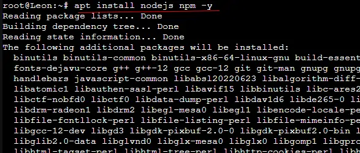
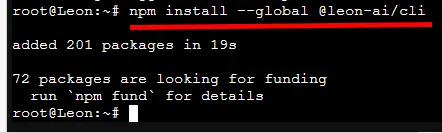
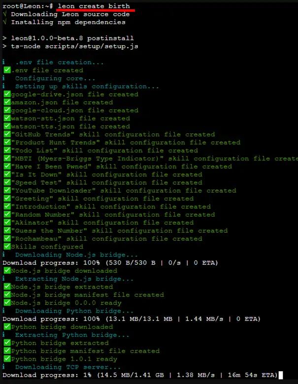
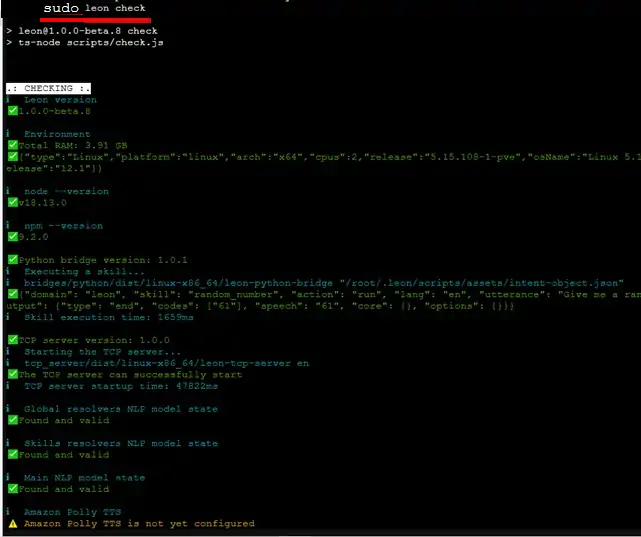

22. OPTIMISATION en cours
-------------------------
22.1 Reset à distance du modem GSM
^^^^^^^^^^^^^^^^^^^^^^^^^^^^^^^^^^
*1 Bug  en 2 ans !!!* 

22.1.1 Simple programme de commande de relais USB LCUS_1
========================================================

**le script bash**
  
.. code-block::
  
   #!/usr/bin/bash

   echo "Entrer une commande : ON ou OFF "
   read COMMANDE
   if [ "$COMMANDE" = "ON" ] ; then cmd='\xA0\x01\x01\xA2'
   fi
   if [ "$COMMANDE" = "OFF" ] ; then cmd='\xA0\x01\x01\xA2';
   fi
   serdev="/dev/ttyUSB0"

   echo 'reset modem gsm'
   /bin/bash -c "echo -n -e '$cmd' > $serdev"

**Retour d’info avec GPIO du RPI**

|image1064|

22.2 Assistant personnel open source Leon
^^^^^^^^^^^^^^^^^^^^^^^^^^^^^^^^^^^^^^^^^
|image1112|  https://github.com/leon-ai/leon

Installation dans un conteneur LXC Proxmox

.. note::

   - conteneur LXC Debian 12 Standart
   - disque :24Go
   - disque d'échange 4096 Mo
   - mémoire : minimum 4096 Mo
   - package: sudo et un utilisateur

22.2.1 Prérequis
================

.. admonition:: **Installation de Node.js et npm**

   .. code-block::

       apt install nodejs npm -y 

|image1113|

.. important:: **Il faudra installer SST et TTS** 
|image1117| ne fonctionne pas avec Python 3.11 aussi :
- soit on utilise un conteneur Debian 11 ou Python est déjà installé 
_ soit on installe Python 3.9 en plus de Python 3.11

22.2.2 Installation de Leon
===========================
**- Installation de Leon CLI**

.. code-block::

   npm install --global @leon-ai/cli

|image1114|

**- Installation de Leon (stable branch)**

.. code-block::

   leon create birth

|image1115|

**- Vérifiez la configuration** 

.. code-block::

   leon check
 
|image1116|

# Check the setup went well
leon check

.. |image1064| image:: ../media/image1064.webp
   :width: 696px

