22. OPTIMISATION en cours
-------------------------
22.1 Reset à distance du modem GSM
^^^^^^^^^^^^^^^^^^^^^^^^^^^^^^^^^^
*1 Bug  en 2 ans !!!* 

22.1.1 Simple programme de commande de relais USB LCUS_1
========================================================

**le script bash**
  
.. code-block::
  
   #!/usr/bin/bash

   echo "Entrer une commande : ON ou OFF "
   read COMMANDE
   if [ "$COMMANDE" = "ON" ] ; then cmd='\xA0\x01\x01\xA2'
   fi
   if [ "$COMMANDE" = "OFF" ] ; then cmd='\xA0\x01\x01\xA2';
   fi
   serdev="/dev/ttyUSB0"

   echo 'reset modem gsm'
   /bin/bash -c "echo -n -e '$cmd' > $serdev"

**Retour d’info avec GPIO du RPI**

|image1064|

22.2 Assistant personnel open source Leon
^^^^^^^^^^^^^^^^^^^^^^^^^^^^^^^^^^^^^^^^^
|image1112|  https://github.com/leon-ai/leon

Installation dans un conteneur LXC Proxmox

.. note::

   - conteneur LXC Debian 11 Standard ou Debian 12 Standard
   - disque :26 Go minimum (pour 19Go mais rep /temp très sollicité)
   - disque d'échange 4096 Mo minimum
   - mémoire : minimum 4096 Mo
   - package: sudo (apt install sudo)  et un utilisateur avec des droits (adduser <USER> & usermod -aG sudo <USER>)
   - package Git (apt install git-all)

.. admonition:: **choisir entre Debian 11 et Debian 12**

  . Debian 12 fourni Python 3.11 et Node.JS 18 mais 🐸TTS ne fonctionne pas avec python 3.11
  . Debian 11 fourni Python 3.9 et node.JS  12 et 🐸STT ne fonctionne pas avec Node.JS <16.

j'ai choisi Debian 11 et l'installation de node.js 20 en remplacement de la version 12 .

.. note:: *j'ai indiqué ci-après comment ajouter node.js 18 et python 3.9 à debian 12* 

22.2.1 Prérequis
================

.. admonition:: **Installation de Node.js et npm** *spous Debian 11

   .. code-block::

      sudo apt-get update
      sudo apt-get install -y ca-certificates curl gnupg
      sudo mkdir -p /etc/apt/keyrings
      curl -fsSL https://deb.nodesource.com/gpgkey/nodesource-repo.gpg.key | sudo gpg --dearmor -o /etc/apt/keyrings/nodesource.gpg
      NODE_MAJOR=20
      echo "deb [signed-by=/etc/apt/keyrings/nodesource.gpg] https://deb.nodesource.com/node_$NODE_MAJOR.x nodistro main" | sudo tee /etc/apt/sources.list.d/nodesource.list
      sudo apt update
      sudo apt install nodejs -y

   |image1118|

   .. admonition :: **sous debian 12** 

      Pour node.js, il suffit d'utiliser apt install comme ci dessous

      .. code-block::

         sudo apt install nodejs npm -y

      Pour Python 3.9:

      .. code-block::

         wget https://www.python.org/ftp/python/3.9.17/Python-3.9.17.tar.xz
         tar -xf Python-3.9.17.tar.xz
         mv Python-3.9.17 /usr/local/share/python3.9
         cd /usr/local/share/python3.9
         ./configure --enable-optimizations --enable-shared
         Make
         sudo make altinstall
         sudo ldconfig /usr/local/share/python3.9

|image1113|

22.2.2 Installation et configuration de Leon
============================================
22.2.2.1 INSTALLATION
"""""""""""""""""""""
Si l'on est encore sous ROOT:|image1133|

**- Installation de Leon CLI**

.. code-block::

   npm install --global @leon-ai/cli

*Pour une version beta* : :darkblue:`npm install --global @leon-ai/cli@beta`

|image1114|

**- Installation de Leon (stable branch)**

.. code-block::

   leon create birth

*Pour la version en developpement*: :darkblue:`leon create birth --develop`

|image1115|

|image1119|

**- Vérifiez la configuration** 

.. code-block::

   leon check
 
|image1116|

|image1120|

22.2.2.2 CONFIGURATION
""""""""""""""""""""""
.. important:: **PORTS des serveurs HTTP et TCP**

   . Sur mon installation les ports 1337 et 1342 ne fonctionne pas , déjà utilisés !!
   . Je les ai remplacés par les port 8089 et 8090

Pour trouver l' IP du conteneur LXC:

|image1121|

Dans le répertoire d'installation ~/.leon , remplacer IP, Ports, Langue,...

.. code-block::

   sudo nano .env

|image1122|

22.2.2.3 LANCER Leon
""""""""""""""""""""
|image1123|

|image1124|

Dans un navigateur, au clavier:

|image1125|

|image1126|

22.2.3 Installation de STT et TTS
=================================
22.2.3.1 Installation de STT
""""""""""""""""""""""""""""
Le moyen le plus rapide d'utiliser un modèle |image1117| SST

- **Créer un environment virtuel**

.. code-block::

   python3 -m venv venv-stt
   source venv-stt/bin/activate

.. warning:: *sous debian 12*

   remplacé par ces 2 lignes: 

   .. code-block::

      sudo apt install python3.11-venv 
      sudo apt install virtualenv python3-virtualenv

   |image1128|        

|image1127|

- **Installer 🐸STT model manager**

.. code-block::

   python3 -m pip install -U pip
   python3 -m pip install coqui-stt-model-manager   

|image1130|

.. warning:: *Sous Debian 12*
   
   remplacé par ces 2 lignes: 

   .. code-block::

      sudo apt install python3-pip   
      python3 -m pip install -U pip --root-user-action=ignore  --break-system-packages

22.2.3.2 Installation de TTS
""""""""""""""""""""""""""""
.. code-block::

   pip install TTS 

|image1131|

- pb ??

|image1132|

22.2.4 Fonctionnement HORS LIGNE
================================
Avec STT et TTS et le nœud hotword (moteur de détection de mots clés), tout tourne sur votre machine, rien ne sort pour requêter un service tiers

.. |image1064| image:: ../media/image1064.webp
   :width: 696px
.. |image1112| image:: ../media/image1112.webp
   :width: 144px
.. |image1113| image:: ../media/image1113.webp
   :width: 439px
.. |image1114| image:: ../media/image1114.webp
   :width: 442px
.. |image1115| image:: ../media/image1115.webp
   :width: 605px
.. |image1116| image:: ../media/image1116.webp
   :width: 641px

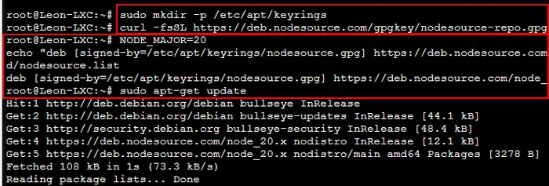
.. |image1119| image:: ../media/image1119.webp
   :width: 545px
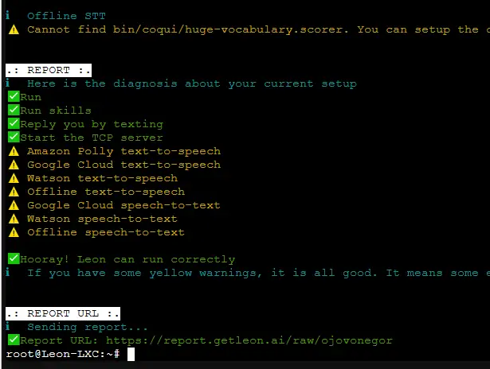
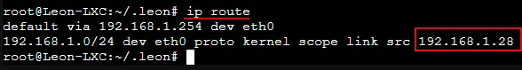
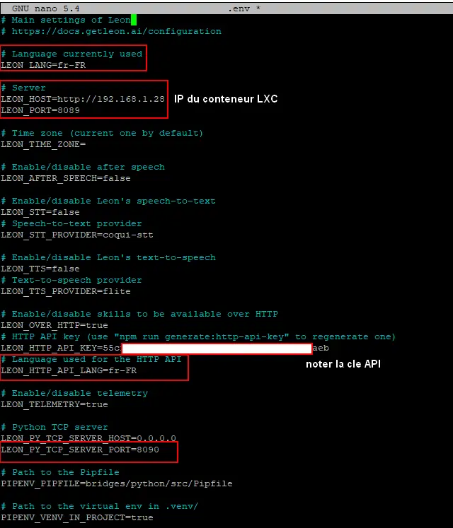
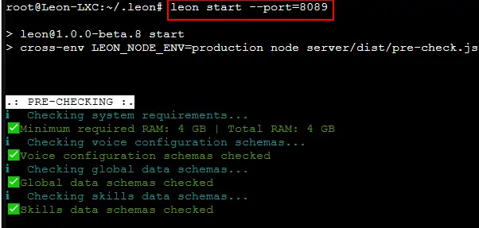
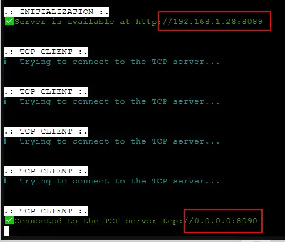
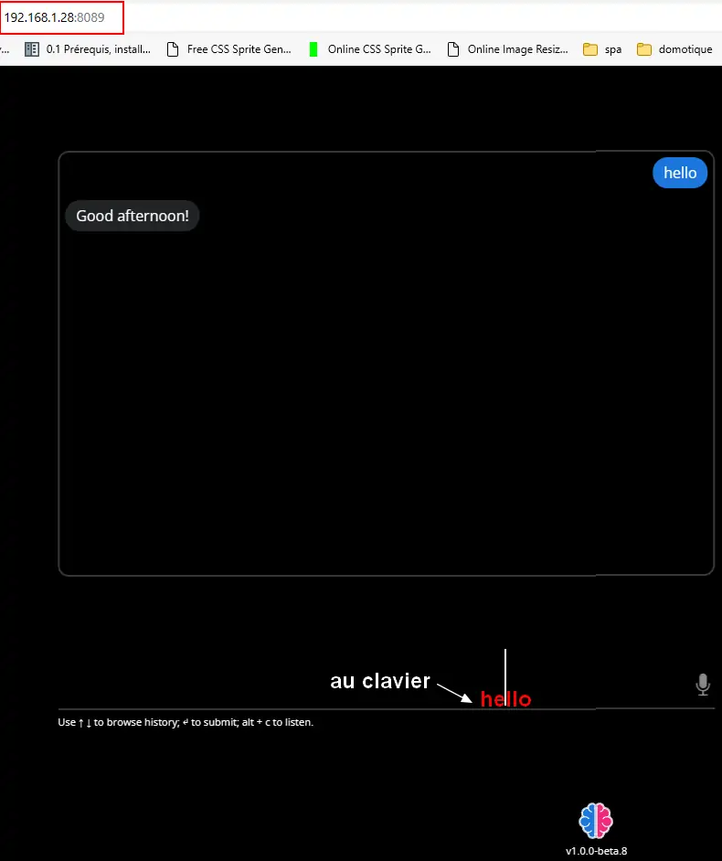

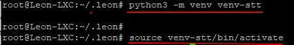
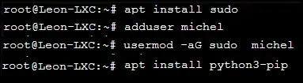
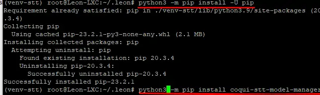
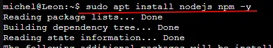
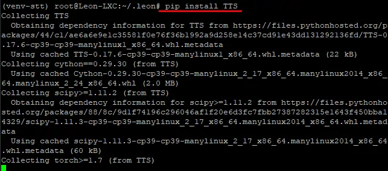
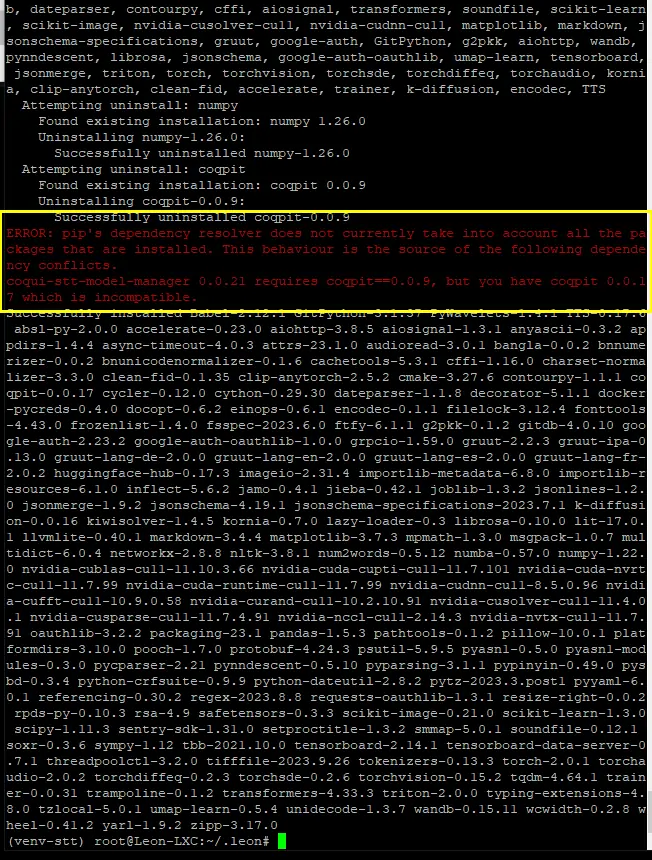
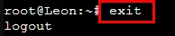
