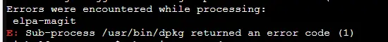

22. OPTIMISATION en cours
-------------------------
22.1 Reset à distance du modem GSM
^^^^^^^^^^^^^^^^^^^^^^^^^^^^^^^^^^
*1 Bug  en 2 ans !!!* 

22.1.1 Simple programme de commande de relais USB LCUS_1
========================================================

**le script bash**
  
.. code-block::
  
   #!/usr/bin/bash

   echo "Entrer une commande : ON ou OFF "
   read COMMANDE
   if [ "$COMMANDE" = "ON" ] ; then cmd='\xA0\x01\x01\xA2'
   fi
   if [ "$COMMANDE" = "OFF" ] ; then cmd='\xA0\x01\x01\xA2';
   fi
   serdev="/dev/ttyUSB0"

   echo 'reset modem gsm'
   /bin/bash -c "echo -n -e '$cmd' > $serdev"

**Retour d’info avec GPIO du RPI**

|image1064|

22.2 Assistant personnel open source Leon
^^^^^^^^^^^^^^^^^^^^^^^^^^^^^^^^^^^^^^^^^
|image1112|  https://github.com/leon-ai/leon

Installation dans un conteneur LXC Proxmox

.. note::

   - conteneur LXC Debian 11 Standard ou Debian 11 Standard
   - disque :20 Go 
   - disque d'échange 4096 Mo minimum
   - mémoire : minimum 4096 Mo
   - package: sudo (apt install sudo) 
   - un utilisateur avec des droits 
  
   |image1128|

22.2.1 Prérequis
================
Si l'on est encore sous ROOT:

|image1133| , ouvrir une session utilisateur

.. admonition:: *Installation de Node.js et npm* **sous Debian 11**

   La version de node.js doit être =>16 et avec debian 11 c'est la version 12 qui est installée

   .. code-block::

      sudo apt-get install -y ca-certificates curl gnupg
      sudo mkdir -p /etc/apt/keyrings
      curl -fsSL https://deb.nodesource.com/gpgkey/nodesource-repo.gpg.key | sudo gpg --dearmor -o /etc/apt/keyrings/nodesource.gpg
      NODE_MAJOR=20
      echo "deb [signed-by=/etc/apt/keyrings/nodesource.gpg] https://deb.nodesource.com/node_$NODE_MAJOR.x nodistro main" | sudo tee /etc/apt/sources.list.d/nodesource.list
      sudo apt update
      sudo apt install nodejs npm -y

   |image1118|

   |image1113|

.. admonition:: *installation de Node.js et npm* **sous Debian 12**

   .. code-block::

      sudo apt install nodejs npm -y

   |image1130|

22.2.2 Installation et configuration de Leon
============================================
22.2.2.1 INSTALLATION
"""""""""""""""""""""

**- Installation de Leon CLI**

.. code-block::

   sudo npm install --global @leon-ai/cli

*Pour une version beta* : :darkblue:`npm install --global @leon-ai/cli@beta`

|image1114|

**- Installation de Leon (stable branch)**

.. code-block::

   sudo leon create birth

*Pour la version en developpement*: :darkblue:`leon create birth --develop`

|image1127|

|image1115|

|image1119|

.. note:: **sous Debian 11 si Git n'est pas installé, l'installer**

   .. code-block:: 

      sudo apt install git-all

**- Vérifiez la configuration** 

.. code-block::

   sudo leon check
 
|image1116|

|image1120|

22.2.2.2 CONFIGURATION
""""""""""""""""""""""
.. important:: **PORTS des serveurs HTTP et TCP**

   . Sur mon installation les ports 1337 et 1342 ne fonctionne pas , déjà utilisés !!
   . Je les ai remplacés par les port 8089 et 8090

Pour trouver l' IP du conteneur LXC:

|image1121|

Dans le répertoire d'installation ~/.leon , remplacer IP, Ports, Langue,...

.. note::
   si l'installation à été réalisée en /root/.leon, passer en root

  |image1132| 

.. code-block::

   sudo nano .env

|image1122|

22.2.2.3 LANCER Leon
""""""""""""""""""""
Quitter le shell en root : exit

.. code-block::

   sudo leon start --port=<PORT>

|image1123|

|image1124|

Dans un navigateur, au clavier:

|image1125|

|image1126|

22.2.3 Installation de STT et TTS
=================================
22.2.3.1 Installation de STT
""""""""""""""""""""""""""""
Léon utilise Coqui |image1117| SST

.. note:: *Comme pour la configuration , il peut être necessaire de passer en root*

.. code-block::

   npm run setup:offline-stt

|image1134|

Dans le fichier de configuration .env:

.. code-block::

   # Enable/disable Leon's speech-to-text
   LEON_STT=true 
   # Speech-to-text provider
   LEON_STT_PROVIDER=coqui-stt

22.2.3.2 Installation de TTS
""""""""""""""""""""""""""""
Léon utilise CMU Flite qui est un petit et rapide moteur de synthèse vocale

.. code-block::

   npm run setup:offline-tts 

|image1135|

Comme por STT , il faut modifier la configuration .env :

.. code-block::

   # Enable/disable Leon's text-to-speech
   LEON_TTS=true 
   # Text-to-speech provider
   LEON_TTS_PROVIDER=flite

.. admonition:: **hotword Léon**
   Hotword: détection de l'activité vocale

   Une fois que Léon a entendu son nom, il est prêt à écouter une requête

   - **Installation**

   .. code-block::

      npm run setup:offline-hotword

   **L'installation de snowboy échoue !!! mais sox est installé**

   |image1136|  

22.2.4 Fonctionnement HORS LIGNE
================================
Avec STT et TTS et le nœud hotword (moteur de détection de mots clés), tout tourne sur votre machine, rien ne sort pour requêter un service tiers

.. |image1064| image:: ../media/image1064.webp
   :width: 696px
.. |image1112| image:: ../media/image1112.webp
   :width: 144px
.. |image1113| image:: ../media/image1113.webp
   :width: 439px
.. |image1114| image:: ../media/image1114.webp
   :width: 544px
.. |image1115| image:: ../media/image1115.webp
   :width: 600px
.. |image1116| image:: ../media/image1116.webp
   :width: 309px
.. |image1117| image:: ../media/image1117.webp
   :width: 50px
.. |image1118| image:: ../media/image1118.webp
   :width: 700px
.. |image1119| image:: ../media/image1119.webp
   :width: 600px
.. |image1120| image:: ../media/image1120.webp
   :width: 615px
.. |image1121| image:: ../media/image1121.webp
   :width: 588px
.. |image1122| image:: ../media/image1122.webp
   :width: 600px
.. |image1123| image:: ../media/image1123.webp
   :width: 600px
.. |image1124| image:: ../media/image1124.webp
   :width: 485px
.. |image1125| image:: ../media/image1125.webp
   :width: 700px
.. |image1126| image:: ../media/image1126.webp
   :width: 700px
.. |image1127| image:: ../media/image1127.webp
   :width: 358px
.. |image1128| image:: ../media/image1128.webp
   :width: 383px
.. |image1129| image:: ../media/image1129.webp
   :width: 600px
.. |image1130| image:: ../media/image1130.webp
   :width: 446px
.. |image1131| image:: ../media/image1131.webp
   :width: 600px
.. |image1132| image:: ../media/image1132.webp
   :width: 314px
.. |image1133| image:: ../media/image1133.webp
   :width: 295px

