23. OPTIMISATION en cours
-------------------------
23.1 Reset à distance du modem GSM
^^^^^^^^^^^^^^^^^^^^^^^^^^^^^^^^^^
*1 Bug  en 2 ans !!!* 

23.1.1 Simple programme de commande de relais USB LCUS_1
========================================================

**le script bash**
  
.. code-block::
  
   #!/usr/bin/bash

   echo "Entrer une commande : ON ou OFF "
   read COMMANDE
   if [ "$COMMANDE" = "ON" ] ; then cmd='\xA0\x01\x01\xA2'
   fi
   if [ "$COMMANDE" = "OFF" ] ; then cmd='\xA0\x01\x01\xA2';
   fi
   serdev="/dev/ttyUSB0"

   echo 'reset modem gsm'
   /bin/bash -c "echo -n -e '$cmd' > $serdev"

**Retour d’info avec GPIO du RPI**

|image1064|

23.2 Découverte de Gladys Assistant
^^^^^^^^^^^^^^^^^^^^^^^^^^^^^^^^^^^
23.2.1 Essai de Gladys Assistant dans un CT LXC sans DOCKER
===========================================================
|image1120|

exécution de l'image Docker de Gladys dans un CT LXC Proxmox(images OCI), version de proxmox minimum 9.1

.. IMPORTANT:: 

   C'est une solution uniquement pour décovrir Gladys, tout fonctionne correctement mais impossible d'ajouter les exensions de la communauté car elle fonctionnent toutes dans des conteneurs Docker; c'est le mode de fonctionnement choisi par gladys et difficile, sans des modifications importantes des esxtensions, de les exécuier.

   Par contre le fonctionnement de Gladys est correcte sous Docker installé dans un CT LXC (cf le § :ref:`23.2.2 Installer Gladys Assistant dans un CT LXC & Docker`) avec un avantage important concernant l'utilisation de la mémore et du processeur;les copieS d'ecran suivantes ont été réalisées sur une VM et un CT ayant la même configuration de Gladys.

   la VM fonctionne sous Ubuntu, (impossible le lancer Gladys sous docker et debian13), le CT fonctionne correctement sous debian Trixie ???

   |image1132|   

23.2.1 Création du conteneur
============================
 - Récupérer le nom de l'image : ex: gladysassistant/gladys:v5
    https://github.com/gladysassistant/Gladys

 - Dans proxmox, indiquer le nom de l'image OCI dans le registre

  |image1112|

  Cliquez sur Télécharger pour extraire l'image
  
  |image1114|

  Le modèle est ajouté au stockage

  |image1113|

 - **Création du conteneur** 

   |image1125|

  d'après l'image docker et les infos fournies lors de la création du CT

    |image1122|

23.2.2 Démarrage du conteneur
=============================
la console affiche :

 |image1115|

Elle ne peut être utilisée, la solution pour contourner le problème:

- utiliser le shell du noeud

  .. code-block::

     pct enter <NUMERO DU CT>

 |image1116|

 - mettre à jour et installer la locale :darkblue:`fr_FR.UTF-8 UTF-8` & des utiliaires:

  .. code-block::

     apt update & upgrade
     apt install sudo,nano,openssh-server
     apt install locales
     dpkg-reconfigure locales

  |image1118|

  |image1128|

23.2.3 Accés depuis le navigateur
=================================
http://gladysassistant.local ou <IP du SERVEUR>

|image1121|

Les appareils apres l'ajout de l'intégration Zigbee2mqtt

|image1123|

L'activité en direct

|image1126|

l'accueil 

|image1127|

23.2.2 Installer Gladys Assistant dans un CT LXC & Docker
=========================================================
https://tutozine.fr/installation-docker-engine-docker-compose-sur-debian-13-trixie/

Pré requis: 1 CT Debian 13(ISO minimale debian-13.2.0-amd64-netinst.iso) & les paquets SUDOn CURL µ

.. code-block::

   apt update && apt upgrade -y
   apt install sudo -y & apt install ca-certificates curl 

23.2.2.1 créer un utilisateur
"""""""""""""""""""""""""""""
.. code-block::

   adduser <USER>
   usermod -aG sudo <USER>
   exit

23.2.2.2 Installation de Docker
"""""""""""""""""""""""""""""""
l'utilisateur créer se connecte à la console:

Ajout de la clé de sécurité pour garantir l’authenticité des paquets :

.. code-block::

   sudo install -m 0755 -d /etc/apt/keyrings
   sudo curl -fsSL https://download.docker.com/linux/debian/gpg -o /etc/apt/keyrings/docker.asc
   sudo chmod a+r /etc/apt/keyrings/docker.asc

création d'un fichier de configuration pour apt (format .sources ) 

.. code-block::

   sudo tee /etc/apt/sources.list.d/docker.sources <<EOF
   Types: deb
   URIs: https://download.docker.com/linux/debian
   Suites: $(. /etc/os-release && echo "$VERSION_CODENAME")
   Components: stable
   Signed-By: /etc/apt/keyrings/docker.asc
   EOF

Installation de Docker & Docker compose

.. code-block::

   sudo apt update
   sudo apt install docker-ce docker-ce-cli containerd.io docker-buildx-plugin docker-compose-plugin

Vérification et Premier Conteneur

.. code-block::

   docker run hello-world

23.2.2.3 Installation de Gladys
"""""""""""""""""""""""""""""""
23.2.2.3.1 Modification de configuration
~~~~~~~~~~~~~~~~~~~~~~~~~~~~~~~~~~~~~~~~
- Changer le port HTTP:

  |image1124|

en cours de rédaction

23.2.2.3.1 communication sftp
~~~~~~~~~~~~~~~~~~~~~~~~~~~~~
- Affichage du contenu du serveur dans filezilla 

   |image1119|

.. note::

   Gladys Assistant utilise deux types de bases de données en local selon les infos stockées : 
   - SQLite : pour les données générales (utilisateurs, configuration, appareils et états de base).
   - DuckDB : une base de données analytique dédiée aux données temporelles (historique des capteurs)

23.2.2.4 Sauvegarde et restauration
"""""""""""""""""""""""""""""""""""
en cours de rédaction

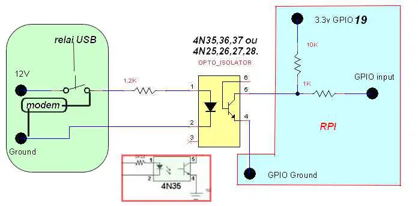
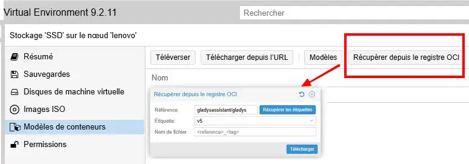
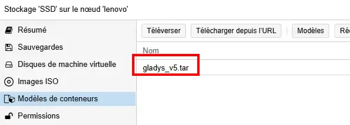
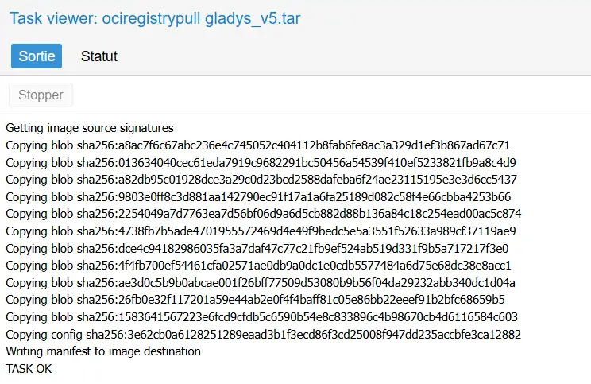

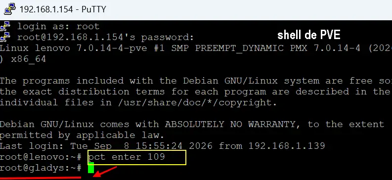

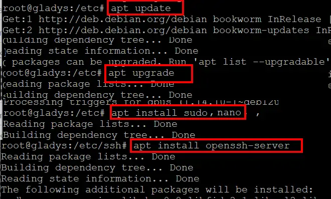
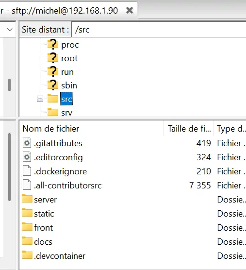
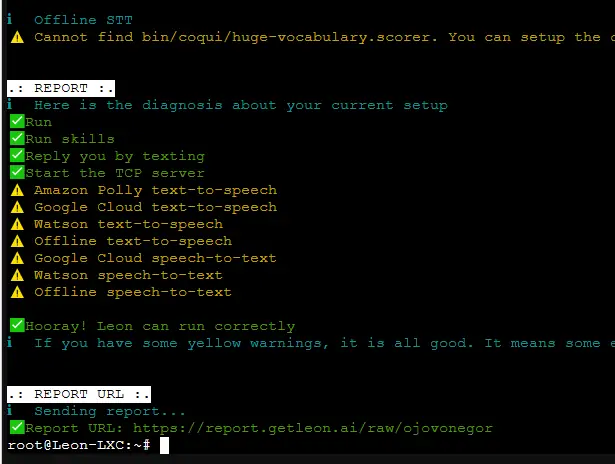

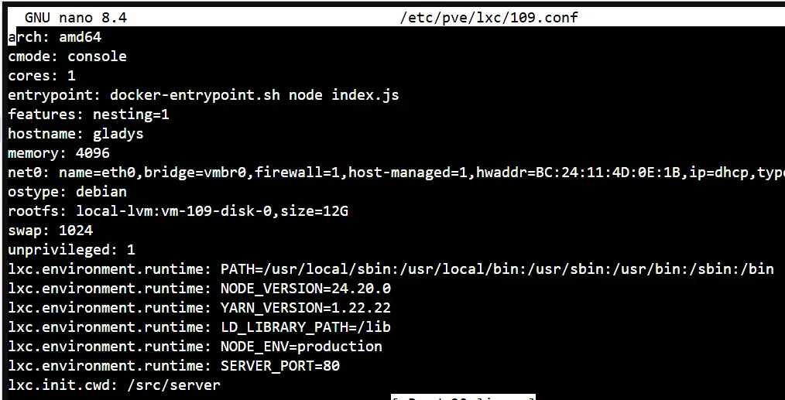

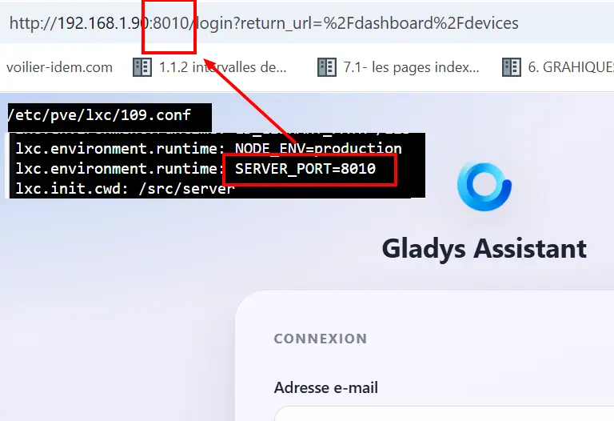
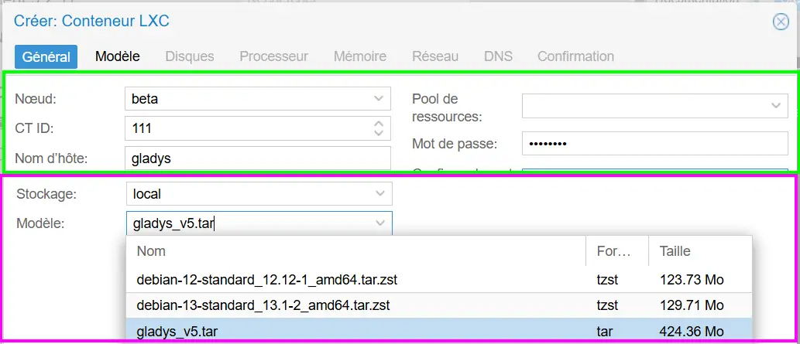

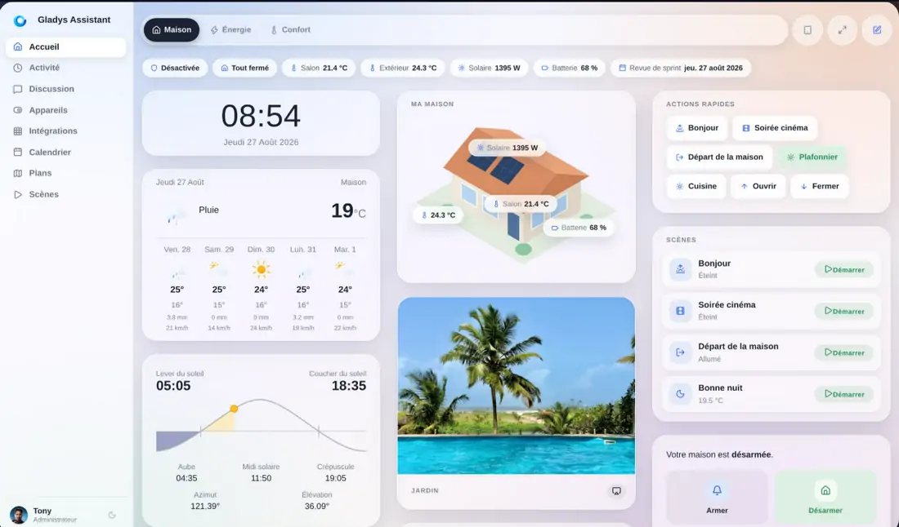
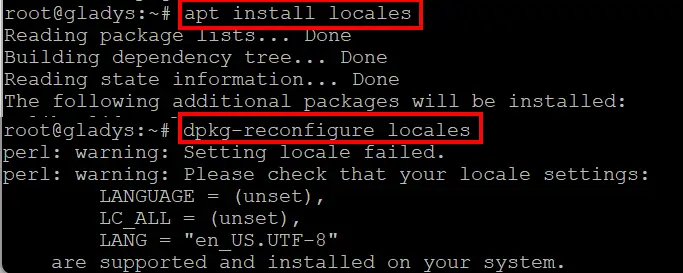

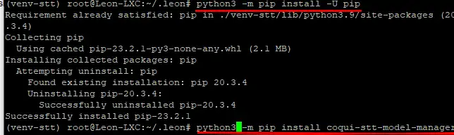
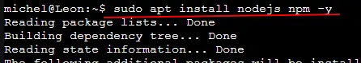
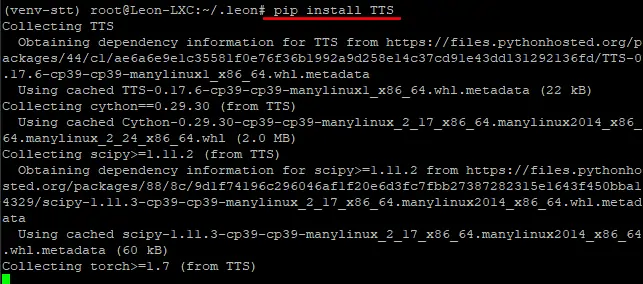
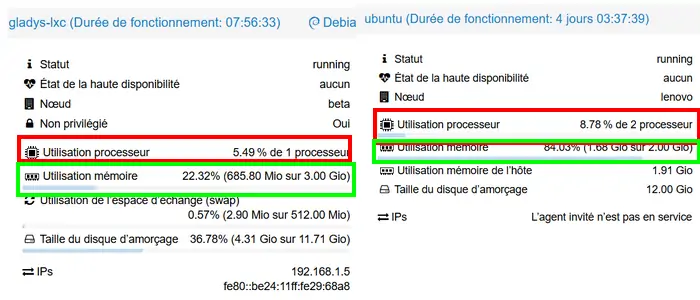
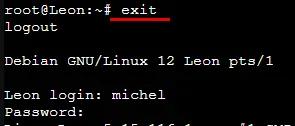
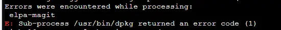
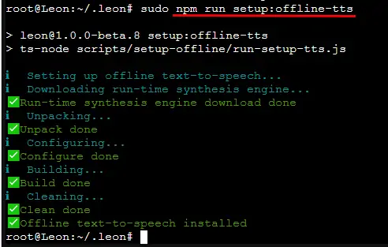
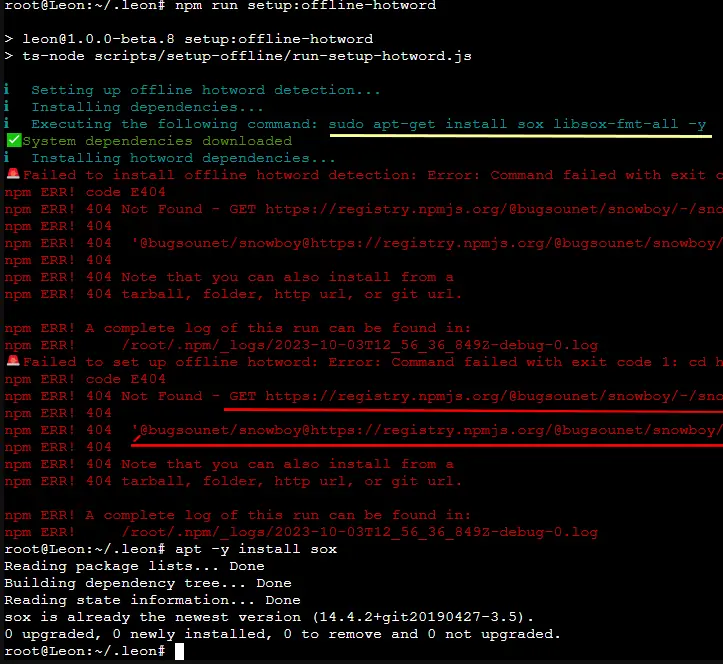
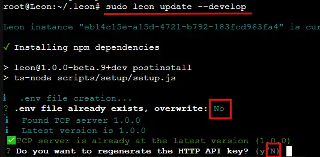
