4. La page du plan extérieur
----------------------------

|image393|

*La construction est la même que pour la page inteieur.php*.

.. warning::
   Le chargement des pages se faisant dès l’appel de l’url, pour éviter les class similaires dans l’image svg, si elle a été créée avec Adobe Illustrateur), il est impératif de les renommer.

   Avec Inkscape, la feuille de style n’est pas gérée par le logiciel, mais insérer par l’utilisateur lors de la construction :

.. admonition:: **UNIQUEMENT POUR AI**

   Pour renommer les styles:

   |image394|

   Quelques styles comme les textes utilisent plusieurs classes, ils ne sont pas nombreux : les modifier manuellement.

   |image395|

   Pour réduire le nombre de classes et éviter les doublons de couleurs, de polices, …des solutions existent :
   -	Construire les 2 plans intérieur et extérieur dans la même image et les exporter séparément ensuite ; il suffit alors de ne garder que l’ensemble des styles sans les doublons (même classes) ; pas toujours 
      facile car on commence souvent avec quelques dispositifs sur un plan, ensuite il est trop tard .

**Nettoyage** : Ces lignes ne servent à rien , les enlever 

|image396|
                            
L’image est sauvegardée par exemple en « exterieur_svg.php » (un fichier avec l’extension .php) :

https://github.com/mgrafr/monitor/raw/main/include/exterieur_svg.php

4.1 La page PHP : exterieur.php
^^^^^^^^^^^^^^^^^^^^^^^^^^^^^^^^^
https://raw.githubusercontent.com/mgrafr/monitor/main/include/exterieur.php

- **Les infos des dispositifs** : la fenêtre modale est commune avec interieur.php

- **Les dispositifs** en plus des capteurs classiques déjà décrits :

  .	Eclairage du jardin

  .	Arrosage automatique

  .	Portier vidéo

  . Boite aux lettres,...

  ... sont chargés avec un seul script, celui décrit dans footer.php (voir interieur.php)

- **Les caméras** : une fenêtre modale, identique à celle de interieur.php, (aux ID près) est ajouter sur la page

|image397|

|image398|

|image399|

4.1.1 Ajouter des lampes
========================

Apres avoir téléchargé une image svg ajouter les icones au plan

|image400|

|image401|

Pour commander les lampes : un interrupteur virtuel dans Domoticz ou un interrupteur réel (Zigbee ou Zwave) et un double sera aussi ajouté à Monitor, c’est l’objet du chapitre  :ref:`8. MUR de COMMANDES ON/OFF`

 |image402|

- **La table « dispositifs » SQL** :

  |image403|

  |image404|

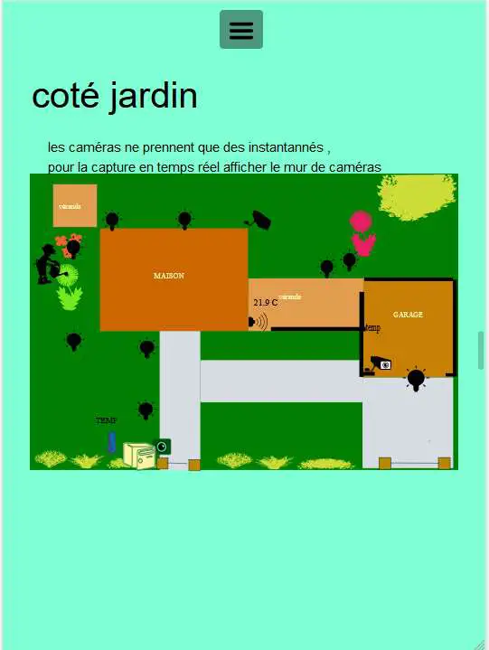
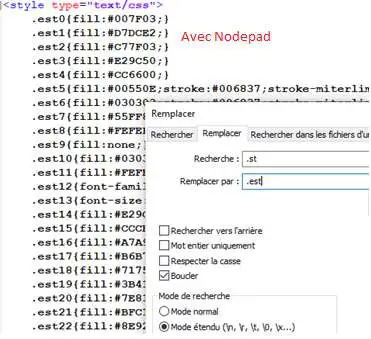
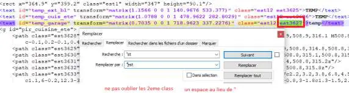
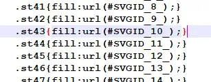
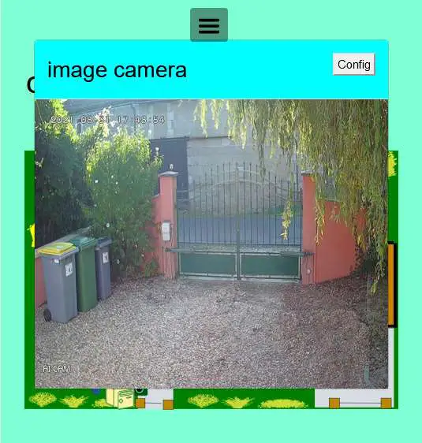
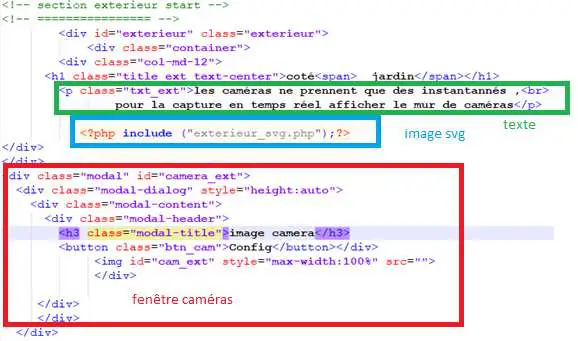
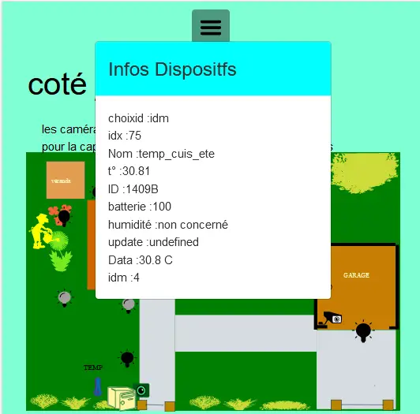
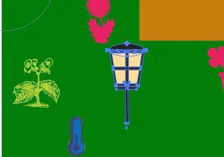
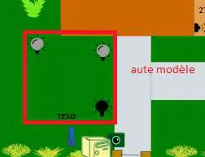
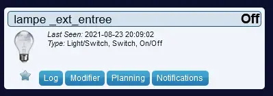
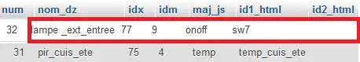
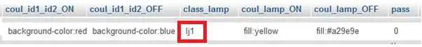

