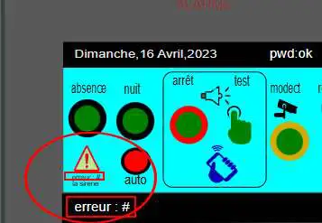
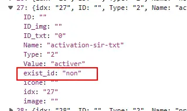

20. Résolution de problèmes
---------------------------
20.1 concernant les variables :
^^^^^^^^^^^^^^^^^^^^^^^^^^^^^^^
*L’idx ou l’ID indiqué dans MySQL (table dispositifs) ne correspond pas avec celui de Domoticz HA*

|image1024|

- Vérifier avec F12 du navigateur ->réseau le json renvoyé : exist_id doit être « oui »

|image1025|

