9. Dispositifs Zigbee
---------------------
**Avec zigbee2mqtt**

9.1 Démarrage automatique
^^^^^^^^^^^^^^^^^^^^^^^^^
- **Pour une installation classique node.js**

Démarrage auto : avec PM2 , Voir la page domo-site : http://domo-site.fr/accueil/dossiers/74 

[image658|

|image659|

- **Pour une installation sous Docker**, le démarrage sera automatique.

9.2 Le fronted
^^^^^^^^^^^^^^
|image1143|

Affichage

|image653|

.. admonition:: **ajouter une fonction utile**: *vu pour la derière fois*

   |image1142|

   A parir du frontend:

   |image1141|

   .. note:: **ISO 8601** c'est la  représentation de la date, en format internationalement, exemple : 2023-10-06T17:13:26Z

   le payload MQTT:

      .. code::

         MQTT publish: topic 'zigbee2mqtt/lampe_jardin', payload '{"last_seen":"2023-10-05T20:52:34.706Z","linkquality":156,"state_l1":"OFF","state_l2":"OFF"}'

   La donnée "last_seen" peut être utilisé avec Node , HA (mais pas avec Dz) pour connaitre les dispositifs :red:`offline`

.. note:: Voir la page du site consacrée à frontend : http://domo-site.fr/accueil/dossiers/48

9.3 Ajouter le Fronted dans monitor
^^^^^^^^^^^^^^^^^^^^^^^^^^^^^^^^^^^

- **la page zigbee.php**

|image654|

- **Le fichier admin/config.php**

.. code-block:: 

   // Page zigbee2mqtt
   define('ON_ZIGBEE',true);// mise en service Zigbee
   define('IPZIGBEE', 'http://192.168.1.92:8084');//ip:port
   define('URLZIGBEE', 'https://zigbee.<DOMAINE>');//url

- **Le fichier index_loc.php** : pour info, ne pas modifier

.. code-block::

   if (ON_ZIGBEE==true) include ("include/zigbee.php");// fronted zigbee2mqtt

- **Les styles CSS**

En plus des css pour la page:

.. code-block::

   /*zigbee2mqtt zwavejs2mqtt & ngiosmobile   (----------------*/
   #zbmqtt,#zwmqtt {margin-top:-40px;width: 100%;height: 800px;}

- **zigbee.php**

on ajoute une iframe *(permet d'obtenir une page HTML intégrée dans la page courante)*

.. code-block::		         

   <iframe id="zbmqtt" src="<?php echo $lien_zigbee;?>" frameborder="0" ></iframe>

|image657|

9.4 accès distant HTTPS 
^^^^^^^^^^^^^^^^^^^^^^^
Il faut configurer NGINX : - :ref:`1.8 Accès distant HTTPS`

.. admonition:: **Exemple de fichier .conf avant de demander un certificat cerbot**

   .. code-block::

      server {
       listen       80;
       server_name  zigbee.<DOMAINE>;
       #return 301   https://zigbee<DOMAINE>$request_uri;
      }
       location / {
        proxy_pass http://<IP>:<PORT>/;
        proxy_set_header Host $host;
        proxy_set_header X-Real-IP $remote_addr;
        proxy_set_header X-Forwarded-For $proxy_add_x_forwarded_for;
       }
       location /api {
        proxy_pass         http://<IP>:<PORT>/api;
        proxy_set_header Host $host;

        proxy_http_version 1.1;
        proxy_set_header Upgrade $http_upgrade;
        proxy_set_header Connection "upgrade";
        }
       }

- **Demande de certificat Let's Encrypt** :

.. prereq::**Installer Cerbot**

   .. code-block::

      sudo apt install certbot python3-certbot-nginx

.. code-block::

   sudo cerbot --nginx

Le fichier modifié par cerbot lors de la demande de certificat

|image655|

.. attention:: ** Pour utiliser auth basic**
   *comme c'est le cas ici*

   Il faut créer un fichier de mot de passe et ajouter des utilisateurs

   https://docs.nginx.com/nginx/admin-guide/security-controls/configuring-http-basic-authentication/

9.5 utilisation directe avec monitor 
^^^^^^^^^^^^^^^^^^^^^^^^^^^^^^^^^^^^
sans l'intermédiaire de Domoticz, Home Assistant ou Ipbroker

9.5.1 Créer un lien symbolique de state.json
""""""""""""""""""""""""""""""""""""""""""""
Ce fichier json contient les dernières valeurs de tous les dispositifs. il est mis à jour toutes les 5 minutes.

.. note::

   la mise à jour en temps réel n'est effective que pour les dispositifs affichant un état ON/OFF; en règle général la mise à jour des autres dispositifs s'effectue dans le delai indiqué dans include/admin/config.php TEMPO_DEVICES', 180000) pour DZ, HA, IOB ; il peut être judicieux , lors de l'utilisation de z2m directement par monitor d'armoniser cette mise à jour: 150 000 , 300 000, 450 000 milli secondes; pour une utilisation de seulement monitor + z2m , régler TEMPO_DEVICES sur 3000000.

.. code-block::

   ln -s /opt/zigbee2mqtt/data/state.json /opt/zigbee2mqtt/node_modules/zigbee2mqtt-windfront/dist/state.json

.. note::

   Ce lien permer de récutérer en http le contenu du fichier : http://IP_Z2M:8084:state.json

   |image1955|

9.5.2 Installation de php-mqtt/client coté serveur
""""""""""""""""""""""""""""""""""""""""""""""""""
https://github.com/php-mqtt/client

.. note::

   Un autre choix existe : mosquitto client; le paquet pour Debian, libmosquitto-dev mais l’installation n’est pas aussi simple qu’avec php-mqtt/client

installé depuis composer; composer ne peut pas être installé en root

.. code-block::

   mkdir /www/monitor/ws_z2m
   cd /www/monitor/ws_z2m
   sudo apt install composer
   composer require php-mqtt/client

|image1956|

9.5.2.1 envoyer et recevoir les messages
~~~~~~~~~~~~~~~~~~~~~~~~~~~~~~~~~~~~~~~~
Le script est est exécuter dans le répertoire  d'installation de php-mqtt/client, ici dans ws_z2m

.. code-block::

   <?php
   require('vendor/autoload.php');
   require('/www/monitor/admin/config.php');
   use \PhpMqtt\Client\MqttClient;
   use \PhpMqtt\Client\ConnectionSettings;
   //
   function publier($message){global $server,$port,$username,$password;
   $topic="z2m";
   $clientId = rand(6, 15);
   $connectionSettings = (new ConnectionSettings)
     ->setUsername($username)
     ->setPassword($password);
   $mqtt = new \PhpMqtt\Client\MqttClient($server, $port, $clientId);
   $mqtt->connect($connectionSettings);
   while (true) {
    $iterationStartedAt = microtime(true);
    $mqtt->publish('z2m', $message, 1,true);
   echo "envoi msg:".$message;
   // You can set a third optional parameter as a timeout
   $mqtt->loopOnce();
   $iterationDuration = microtime(true) - $iterationStartedAt;
    if ($iterationDuration < 1) {
        usleep((1 - $iterationDuration) * 1_000_000);
    }
   }
   $mqtt->disconnect();
   return;
   }
   function id_name($nom_objet) {
    if ($nom_objet=="") {return ['ID' => '0'];}
    $conn = new mysqli(SERVEUR,UTILISATEUR,MOTDEPASSE,DBASE);
	$sql="SELECT * FROM ".DISPOSITIFS." WHERE nom_objet = '".$nom_objet."' AND Actif = '6' AND maj_js <> 'variable';";
	$result = $conn->query($sql);$nb_rows=$result->num_rows;
         $row = $result->fetch_assoc();
         if ($row!=null) {$ro=explode(":",$row['param']) ;$rq=[];
            $rq=['ID' => $row['ID'],
				  'nom_objet' => $row['nom_objet'],
				  'json' => $ro[1]
         ];
         $rx=json_encode($rq);echo $rx;}
         else {$rq=['ID' => '0'];}
         return
   $server   = MQTT_IP;
   $port     = 1883;
   $clientId = rand(5, 15);
   $username = MQTT_USER;
   $password = MQTT_PASS;
   $clean_session = false;
   $mqtt_version = MqttClient::MQTT_3_1_1;
   //
   $connectionSettings = (new ConnectionSettings)
     ->setUsername($username)
     ->setPassword($password)
     ->setKeepAliveInterval(60)
     ->setLastWillTopic('zigbee2mqtt/last-will')
     ->setLastWillMessage('client disconnect')
     ->setLastWillQualityOfService(1);
   //
   try {
    $mqtt = new MqttClient($server, $port, $clientId, $mqtt_version);
    $mqtt->connect($connectionSettings, $clean_session);
    printf("client connecté\n");	
    $mqtt->subscribe('zigbee2mqtt/#', function ($topic, $message) use ($mqtt,$msg) {
    if ($topic == "monitor") {sms($message);}
    $str=explode("/",$topic);$name=$str[1];$search_id=[];
    $search_id=id_name($name);$id=$search_id['ID'];
    if ($id!="0") {$json=$search_id['json'];$obj = json_decode($message);
      if (isset($obj->state) && $obj->state=="offline"){$ob=$obj->state;$msg='{ "id" : "'.$id.'", "state" : "'.$ob.'" }';maj($id,$ob);}
      if (isset($obj->$json)) {$ob=$obj->$json;$msg='{ "id" : "'.$id.'", "state" : "'.$ob.'" }';echo '------------'.$msg;
      publier($msg);  
      } }} );
    $mqtt->loop();
    $mqtt->disconnect();
   }
   catch (\Throwable $e) {
    echo 'An exception occured: ' . $e->getMessage() . PHP_EOL;
   }

|image1957|

|image1967|

|image1968|

9.5.2.2 démmarrage automatique systemd
~~~~~~~~~~~~~~~~~~~~~~~~~~~~~~~~~~~~~~
le fichier php-mqtt.service

.. code-block::

   [Unit]
   Description=cclient mqtt php
   After=multi-user.target
   [Service]
   Type=idle
   ExecStart=php /var/www/monitor/ws_z2m/sub_messages_mqtt.php > /home/michel/sub_mqtt.log 2>&1
   [Install]
   WantedBy=multi-user.target

|image1965| 

Pour activer et démarrer le service :

.. code-block::

   Systemctl enable php-mqtt
   systemctl start php-mqtt.service

|image1966| 

9.5.3 Scripts concernés dans monitor
""""""""""""""""""""""""""""""""""""
.. admonition:: **fonctions.php & include/fonctions_1.php**

   fonctions.php

    |image1958| 

   include/fionctions_1.php

    |image1964| 

9.5.4 Installation de mqtt.JS coté client
"""""""""""""""""""""""""""""""""""""""""
|image1959| 

https://github.com/mqttjs/MQTT.js

.. code-block::

   if (MQTT==true) {echo '
';include ('include/mqtt-js.php');}

|image1960| 

9.5.4.1 Le javascript sur la page html
~~~~~~~~~~~~~~~~~~~~~~~~~~~~~~~~~~~~~~
fichier include/mqtt-js.php

.. code-block::
    
   <?php require_once('admin/config.php');?>
   ;

|image1961| 

9.5.4.2 envoyer et recevoir les messages
~~~~~~~~~~~~~~~~~~~~~~~~~~~~~~~~~~~~~~~~

.. code-block::

   client.publish(topic, msg);} // topic , payload

Exemples:

|image1962| 

Scripts concernés dans include/footer.php

|image1963| 

Voir aussi le § :ref:`8.1.2.2 Commandes de changement de couleur des lampes`
   

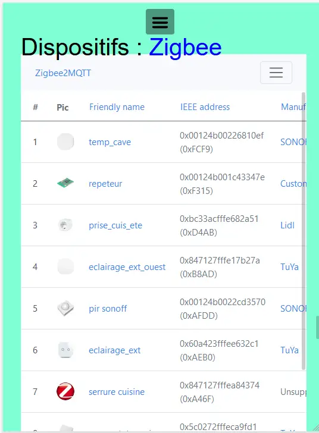
.. |image654| image:: ../media/image654.webp
   :width: 625px
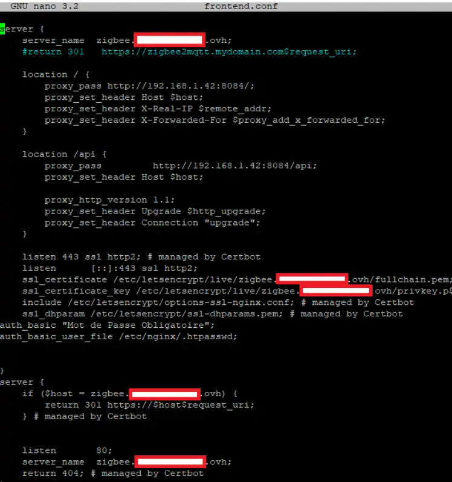
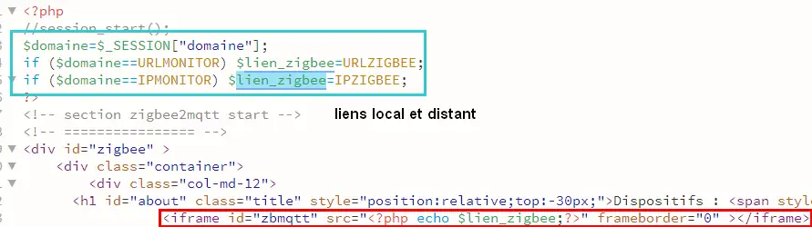
.. |image658| image:: ../media/image658.webp
   :width: 600px
.. |image659| image:: ../media/image659.webp
   :width: 647px
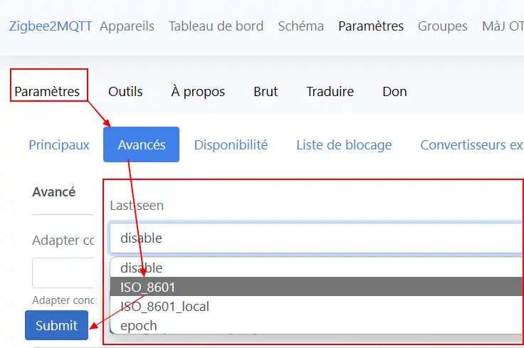
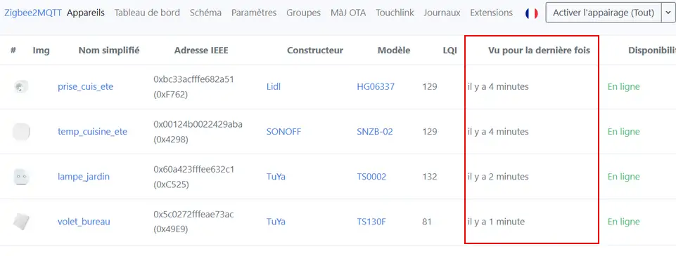
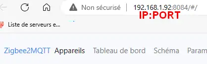
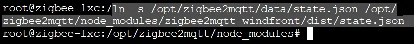
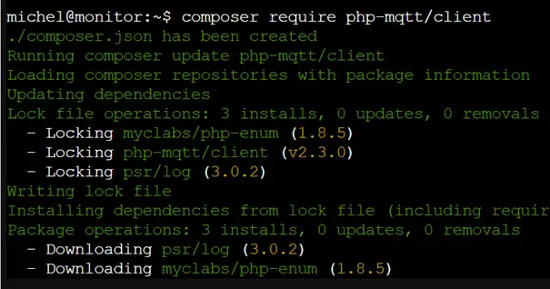
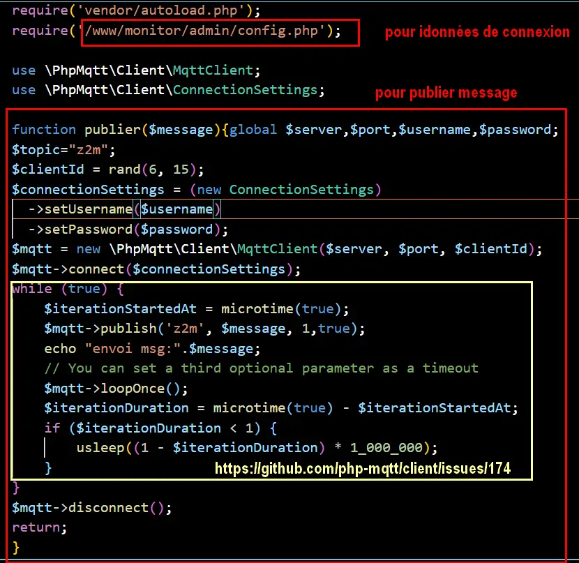
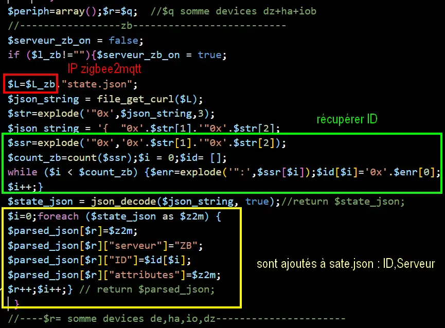

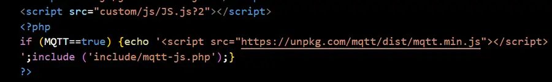
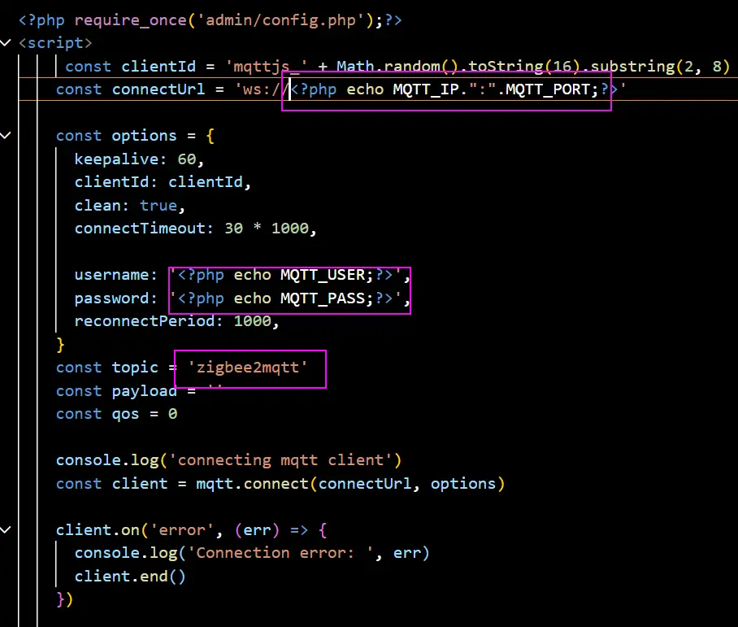
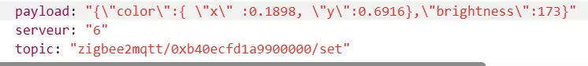
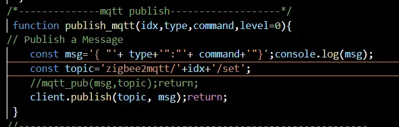
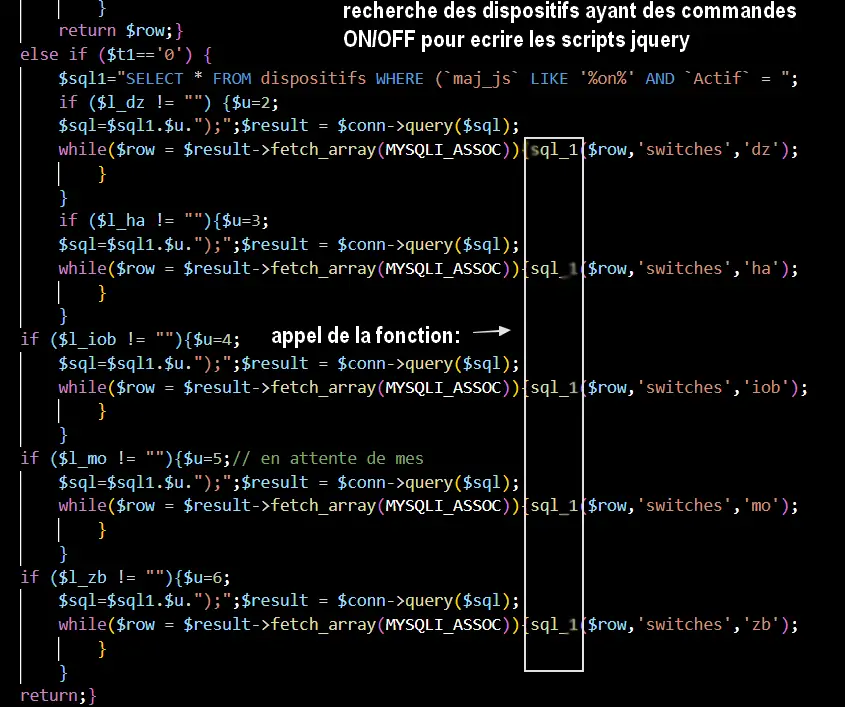
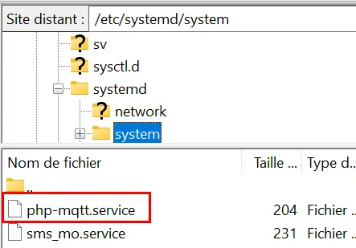
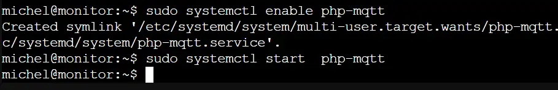
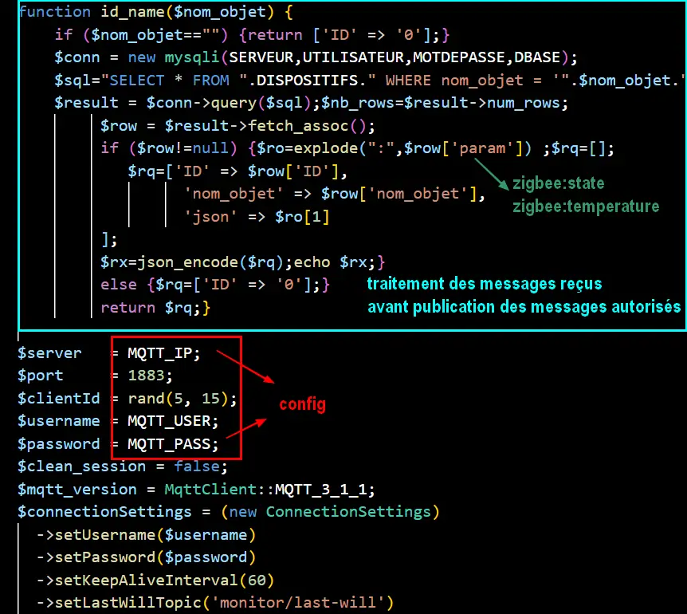
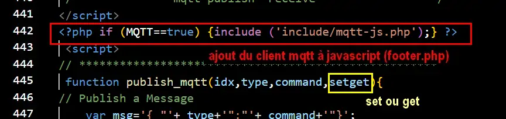

