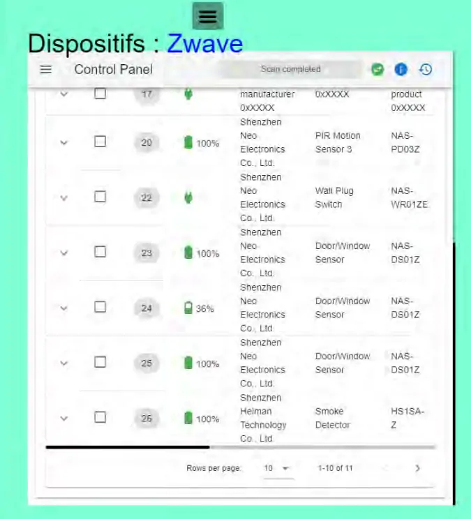

10. Dispositifs Zwave
---------------------
**Avec zwavejs2mqtt**, installé sous docker 

|image656|

- **La page zwave.php**

La structure est la même que pour la page zigbee.php, voir cette page :ref:`9. Dispositifs Zigbee`

- **Le fichier admin/config**

.. code-block::

   //Page zwavejs2mqtt
   define('ON_ZWAVE',true);// mise en service Zwave
   define('IPZWAVE', 'http://192.168.1.76:8091');
   define('URLZWAVE', 'https://zwave.<DOMAINE>');//url');

- **Les styles**

