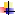

Monitor-domotique Documentation
========================================

.. toctree::
    :hidden:
    :maxdepth: 2

        source/guides/modifications
        source/guides/sommaire
        source/guides/bien_debuter
       
Github Repository <https://github.com/mgrafr/monitor>`__     

 |image1| **Logiciel monitor version 2.2.0** *maj manuel 2.2.1 du
  27/07/2023*
 **Compatible Domoticz & Home assistant**

**Dernières modifications :**

:doc:`source/guides/modifications`

|image2| Tous les fichiers sont sur Github :

 **Sommaire :**

:doc:`guides/sommaire`
  
:doc:`guides/bien_debuter`

.. |image2| image:: media/image2.webp
   :width: 0.64583in
   :height: 0.61389in
