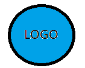
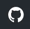

Monitor-domotique Documentation
========================================

.. toctree::
        
        guides/modifications.rst
        guides/sommaire.rst
        guides/bien_debuter.rst
        guides/configuration_minimum.rst
        guides/plan_interieur.rst
        guides/meteo.rst
        guides/plan_exterieur.rst
        guides/alarme.rst
        guides/graphiques.rst
        guides/mur_cameras.rst
        guides/mur_de_commandes.rst
        guides/zigbee.rst
        guides/zwave.rst
        guides/monitoring.rst
        guides/app_diverses.rst
        guides/app_externes.rst
        guides/administration.rst
        guides/exemples.rst
        guides/ajout_page_alertes.rst
        guides/divers.rst
        guides/mon_installation.rst

Github Repository <https://github.com/mgrafr/monitor>    

 |image1|

**Logiciel monitor version 2.2.0**

*maj manuel 2.2.1 du 27/07/2023*

**Compatible Domoticz & Home assistant**

Mises à jour
----------------
:doc:`guides/modifications`
    modifications

|image2| Tous les fichiers sont sur Github :

Table de matières
-----------------
:doc:`guides/sommaire`
  sommaire

Bien débuter
------------
:doc:`guides/bien_debuter`
    bien débuter

Configuration minimum
---------------------
:doc:`guides/configuration_minimum`
    Configuration minimum

Plan interieur
--------------
:doc:`guides/plan_interieur`
    1ere page plan intérieur

Météo
-----
:doc:`guides/meteo`
   Météo

Coté Jardin
-----------
:doc:`guides/plan_exterieur`
   Coté jardin

Alarme
------
:doc:`guides/alarme`
  Alarme

Graphiques et Base de données
-----------------------------
:doc:`guides/graphiques`
  Graphiques et Base de données

Mur de Caméras
--------------
:doc:`guides/mur_cameras`
  Mur de Caméras

Mur de commande On/Off
----------------------
:doc:`guides/mur_de_commandes`   
   MUR de commandes ON/OFF

Zigbee
------
:doc:`guides/zigbee`   
   Zigbee

Zwave
-----
:doc:`guides/zwave`   
   Zwave

Monitoring
----------
:doc:`guides/monitoring`   
   Monitoring Nagios

App Diverses
------------
:doc:`guides/app_diverses` 
     App Diverses

Applications  Externes
----------------------
:doc:`guides/app_externes`   
    Applications externes

Administration
--------------
:doc:`guides/administration`   
    Administration

Exemples
--------
:doc:`guides/exemples`   
    Exemples

Ajout Page Alertes
------------------
:doc:`guides/ajout_page_alertes`   
   Ajout Pages Alertes

Mon Installation
----------------
:doc:`guides/mon_installation`
    Mon Installation

Divers
------
:doc:`guides/divers`
    Divers

.. |image1| image:: images/logo.png
   :width: 1.52in
   :height: 1.52in

