18. Divers
------------
18.1 Debian : Installer un serveur LAMP (Apache MySQL PHP)
^^^^^^^^^^^^^^^^^^^^^^^^^^^^^^^^^^^^^^^^^^^^^^^^^^^^^^^^^^

|image983|

https://www.linuxtricks.fr/wiki/debian-installer-un-serveur-lamp-apache-mysql-php

18.2 Installer Paho-mqtt
^^^^^^^^^^^^^^^^^^^^^^^^
*paho-mqtt est le code source pour la bibliothèque Python MQTT*

.. code-block::

   sudo pip3 install paho-mqtt

18.2.1 Le script pour envoyer des messages (mqtt.py)
====================================================

.. code-block::

   #!/usr/bin/env python3.7
      # -*- coding: utf-8 -*- 
      import paho.mqtt.client as mqtt
      import json
      import sys
      # Variables et Arguments
      topic= str(sys.argv[1])
      etat= str(sys.argv[2]) 
      valeur= str(sys.argv[3]) 
      MQTT_HOST = "192.168.1.42"
      MQTT_PORT = 1883
      MQTT_KEEPALIVE_INTERVAL = 45
      MQTT_TOPIC = topic
      MQTT_MSG=json.dumps({etat: valeur});
      # 
      def on_publish(client, userdata, mid):
        print ("Message Publié...")
      def on_connect(client, userdata, flags, rc):
        client.subscribe(MQTT_TOPIC)
        client.publish(MQTT_TOPIC, MQTT_MSG)
      def on_message(client, userdata, msg):
        print(msg.topic)
        print(msg.payload)
        payload = json.loads(msg.payload) # convertion en json
        print(payload['state_l2']) 
        client.disconnect() 
      # Initiatlisation MQTT Client
      mqttc = mqtt.Client()
      # callback function
      mqttc.on_publish = on_publish
      mqttc.on_connect = on_connect
      mqttc.on_message = on_message
      # Connection avec le serveur MQTT 
      mqttc.connect(MQTT_HOST, MQTT_PORT, MQTT_KEEPALIVE_INTERVAL)
      # Loop forever
      mqttc.loop_forever()

.. IMPORTANT:: 

   Pour être sûr que le fichier est au bon format (Unix) : utiliser dos2unix , § :ref:`8.2.1.1 Problème de lecture de fichier`

18.3 Liaison série Domoticz-PI
^^^^^^^^^^^^^^^^^^^^^^^^^^^^^^
*Scripts dans Domoticz*

Ils sont exécutés en dehors du conteneur si Domoticz est sous Docker.

.. attention:: 

   **La passerelle Zigbee 3.0 SonOff utilise le même driver série CP2102 -donc pour /dev/serial/by-id = IDENTIQUE**

- **sms_dz.py** : https://raw.githubusercontent.com/mgrafr/monitor/main/share/scripts_dz/py/sms_dz.py

|image987|

.. note:: 

   *Modifier si besoin le numéro de la variable et le port de domoticz*

Le démarrage automatique est assuré par systemd (voir § :ref:`13.6.2.1 Enregistrement des n° de téléphone`

.. seealso:: *voir http://domo-site.fr/accueil/dossiers/70 *(liaison série)*

- **aldz.py**  voir § :ref:`13.6.2 émission SMS`

|image988|

aldz.bak.dz, en absence de message

|image989|

.. admonition:: **Scripts PI**

   - **rec_sms_serie.py** : https://raw.githubusercontent.com/mgrafr/monitor/main/share/scripts_PI8/rec_sms_serie.py

    extrait:

    |image990|
   
   .. IMPORTANT:: 

      :red:`Utiliser localhost et non 127.0.0.1`

   .. warning:: **Si ce massage en bash**

      |image991|
   
       C'est un problème de mot de passe

      |image992|
      |image993|

   - *start_rec_sms.sh**

    |image994|

    Démarrage auto avec systemd :

   .. code-block:: 

      [Unit]
      Description=start rec sms pour Domoticz
      [Service]
      Type=simple
      ExecStart=/home/michel/start_rec_sms.sh
      Restart=on-failure
      RestartSec=10
      KillMode=process
      [Install]
      WantedBy=multi-user.target
 
18.4 Commandes de l’alarme à partir d’un GSM
^^^^^^^^^^^^^^^^^^^^^^^^^^^^^^^^^^^^^^^^^^^^
*Pour faciliter l’activation ou l’arrêt de l’alarme*

il est facile d’ajouter des codes au script du paragraphe précédent :ref:`18.3 Liaison série Domoticz-PI`

Extrait de **rec_sms_serie.py** installé sur le PI qui assure le monitoring , les notifications GSM et les sauvegardes
ù
.. code-block:: 

   if params[0]=="Alon":
         domoticz=ip_domoticz
         ip_se=1
         params[1]= '41'
         params[2]='switch'
         params[3]='On'
   if params[0]=="Aloff":
         domoticz=ip_domoticz
         ip_se=1
         params[1]= '41'
         params[2]='switch'
         params[3]='Off'

.. note::  :red:`Alon et Aloff` = Marche/Arrêt de l'alarme

|image996|

Le switch domoticz : |image997|

voir le $ :ref:`5.1 Dans Domoticz, les interrupteurs virtuels, les variables`

18.5 Données compteur Linky
^^^^^^^^^^^^^^^^^^^^^^^^^^^
*Configuration après installation du plugin: https://github.com/guillaumezin/DomoticzLinky*

|image998|

.. Important::

   Pour la correspondance avec ENEDIS : Ne pas copier toute l'adresse http, s’arrêter après le code

   |image999|

|image1000|

- **Dans monitor**

|image1001|

|image1002|

.. seealso:: § :ref:`15.1 ajout d’un dispositif` 

|image1003|

.. seealso:: §  :ref:`6. GRAHIQUES & BASE DE DONNEES`

- **Les modifications dans Domoticz**   *export_sql*

pour enregistrer dans la BD SQL, voir §  :ref:`6.2 Dans Domoticz`

|image1004|

|image1005|

- **Le compteur est ajouté au plan** , les données sont disponibles pour monitor : voir § :ref:`1.2.1.1 status_variables , devices_zone et device_plan` 

- **Table dispositifs** : *création du dispositif*

|image1006|

.. seealso:: le § :ref:`0.3.2 Les Dispositifs`

- **Table energie** : création de la table

|image1007|

voir un exemple : :ref:`17.1.2. Création des tables PH, Redox, temp, ...`

- **Fichier json** envoyé par domoticz :

|image1008|

.. admonition:: **Les fichiers modifiés dans monitor**

   - **Interieur.php** : *ajout de l’image svg* 

   .. code-block::

      
<?php include ('linky_svg.php');?>

   |image1009|

   - **graphiques.php**

   |image1010|

18.6 Complément sur l’utilisation des Mots de Passe cryptés dans Domoticz
^^^^^^^^^^^^^^^^^^^^^^^^^^^^^^^^^^^^^^^^^^^^^^^^^^^^^^^^^^^^^^^^^^^^^^^^^
*Une des solutions pour crypter et décrypter les mots de passe*

.. seealso:: Codage : https://www.base64encode.org/

   |image1011|

- **Décodage** , *Extrait du script maj-services.lua*

.. code-block::

   -- chargement fichier contenant les variables de configuration
   package.path = package.path..";www/modules_lua/?.lua"
   require 'connect'
   local base64 = require'base64'
   local user_free = base64.decode(login_free);local passe_free = base64.decode(pass_free);
   local sms_free="curl --insecure  'https://smsapi.free-mobile.fr/sendmsg?user="..user_free.."&pass="..passe_free.."&msg=poubelle' >> /home/michel/OsExecute.log 2>&1"

voir ce § :ref:`14.6.1.1 connect.lua`

18.7 pages sans rapport avec la domotique
^^^^^^^^^^^^^^^^^^^^^^^^^^^^^^^^^^^^^^^^^
18.7.1  Les recettes de cuisines sur la tablette domotique
==========================================================

|image1015|

.. important:: 

   **Comme pour chaque ajout de page , il faut modifier les fichiers** :

   -	mes.css.css

   -	config.php

   -	index_loc.php

   -	header.php

  *et parfois le fichier* :darkblue:`big-Slide.js` , si l’on doit modifier la largeur du menu § :ref:`1.7 Ajuster le menu au nombre de pages`

   |image1016|

- **le fichier recettes.php**  https://raw.githubusercontent.com/mgrafr/monitor/main/include/recettes.php

 |image1018|

- **Dans fonctions.php**  *sql_app()*

|image1019|

18.8 migration de Domoticz différentes étapes pour ne rien oublier
^^^^^^^^^^^^^^^^^^^^^^^^^^^^^^^^^^^^^^^^^^^^^^^^^^^^^^^^^^^^^^^^^^
.. admonition:: **Exemple migration vers Docker.**

   -	Modifier les IP/PORT de Domoticz, Zwavejs2mqtt, Zigbee2mqtt,…dans le fichier de configuration de monitor.

   -	Pour les scripts externes non gérés dans le conteneur Domoticz ,installer les versions de python, node, … nécessaires, et les dépendances nécessaires ;par exemple pour la communication série de Domoticz , l’installation de python-periphery , le démarrage auto sur systemd ,…. Si l’API de Domoticz est utilisée dans ces scripts , modifier le Port de Domoticz

      Pour VOIP asterisk, modifier ip de domoticz pour la capture d’image (portier) ; pour appeler json de Domoticz depuis Docker, autoriser dans les paramètres de Domoticz le réseau 172.*.*.* 

   -	Pour le monitoring Nagios, il faut indiquer les IP/PORT qui sont modifiés et les noms des VM Proxmox si Proxmox est utilisé.

   -	Si une nouvelle page doit être ajoutée à monitor, par exemple pour Zwave (OZW n’étant plus maintenu) : créer le sous-domaine pour l’accès distant et le certificat pour HTTPS (Letsencrypt-cerbot)

   -	Les dispositifs sont souvent difficiles à réveiller, s’ils sont réinstallés, modifier l’ID de Domoticz dans la base de données de monitor

.. |image983| image:: ../pages/image983.png
   :width: 200px
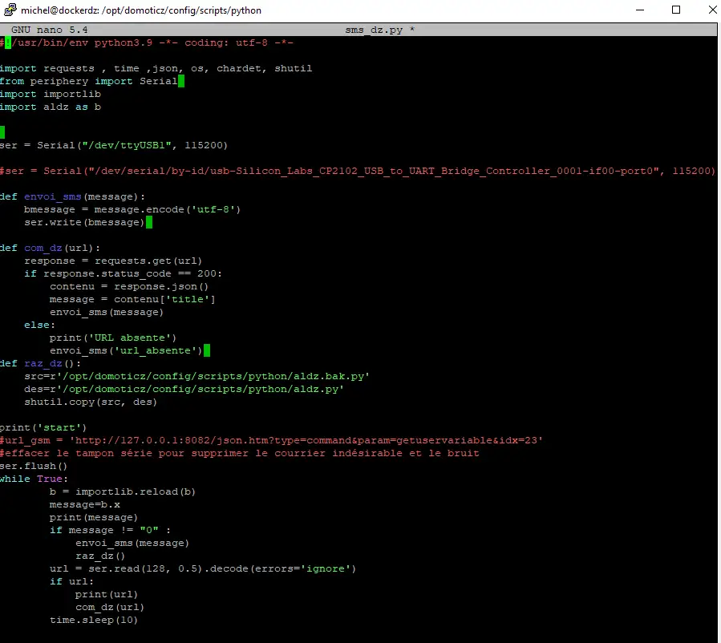
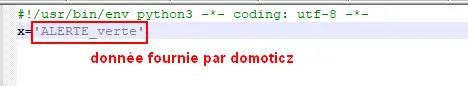
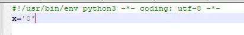
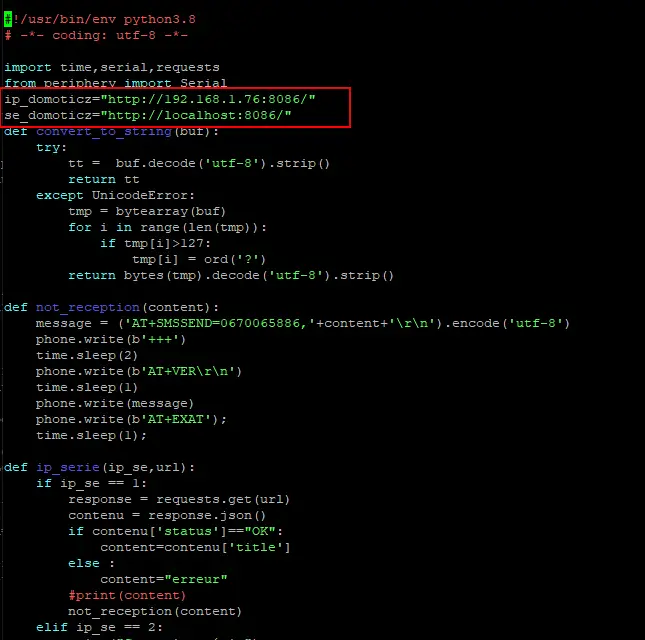
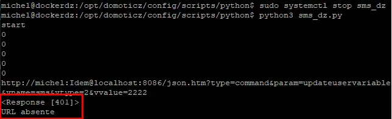
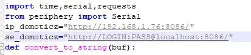
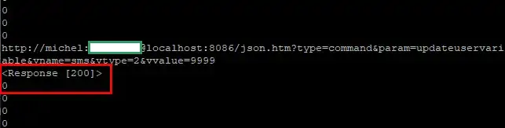
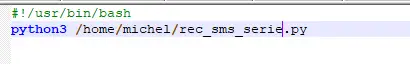
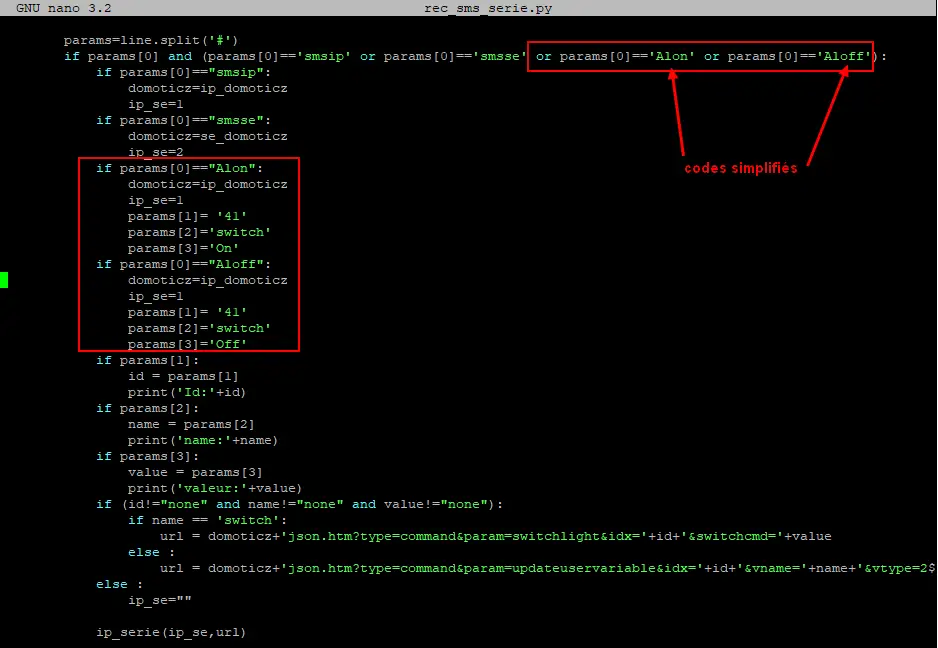
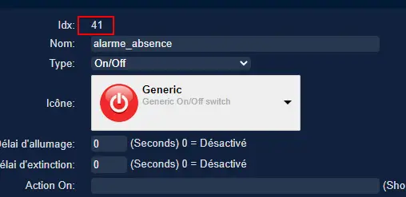
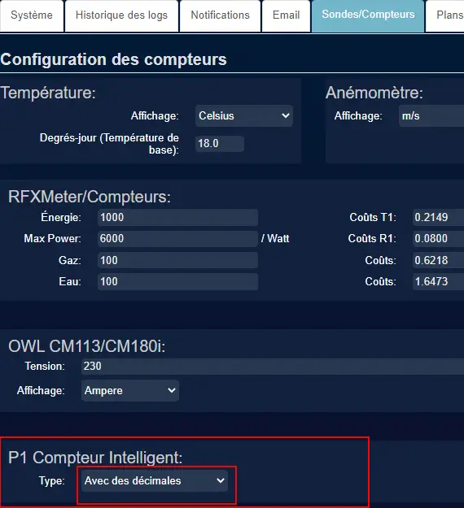
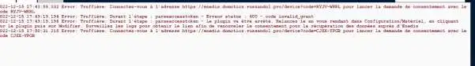
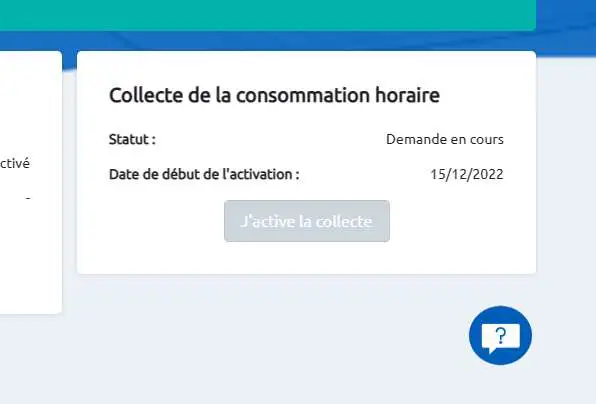
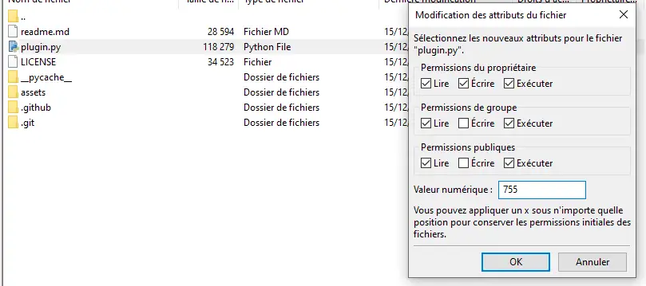
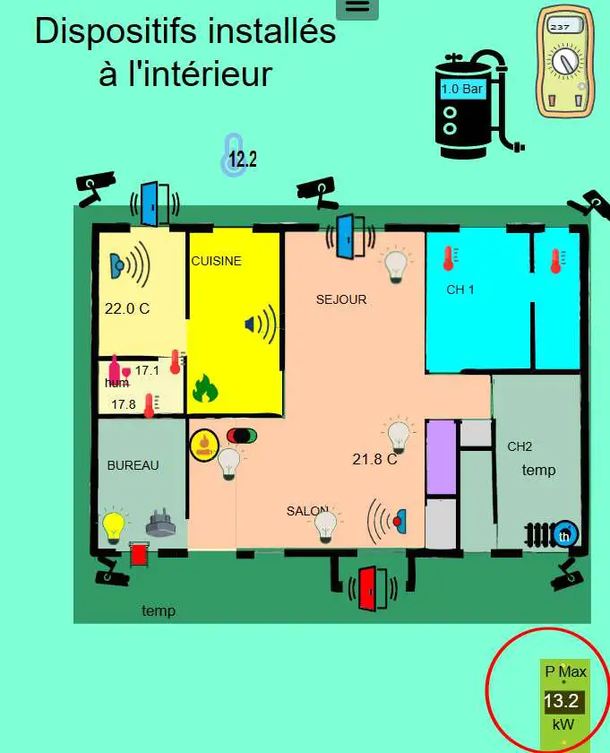
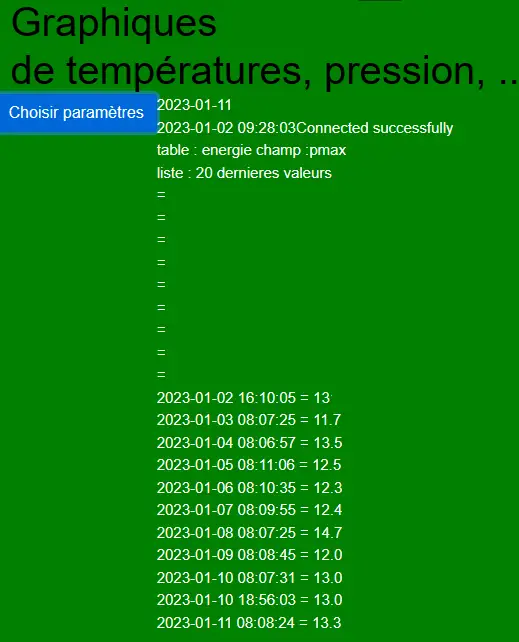
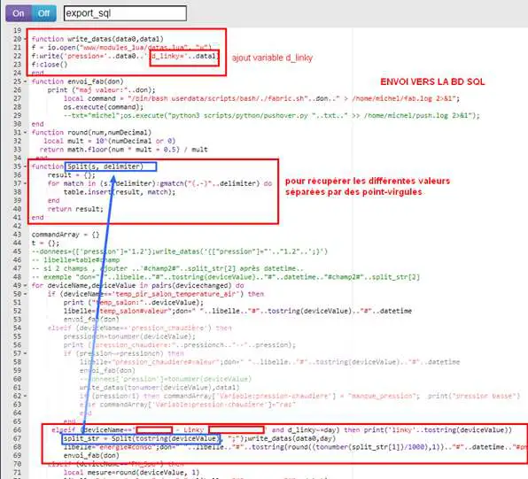
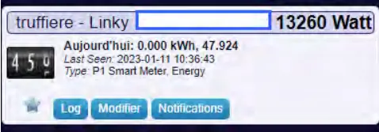
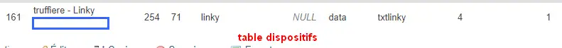
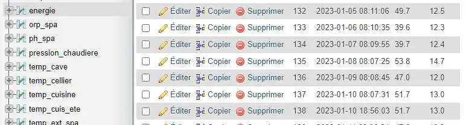
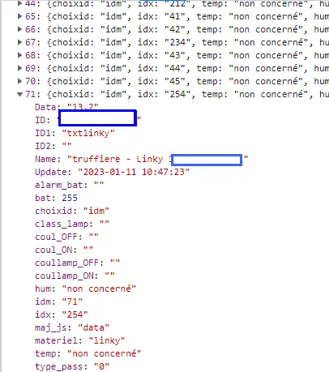
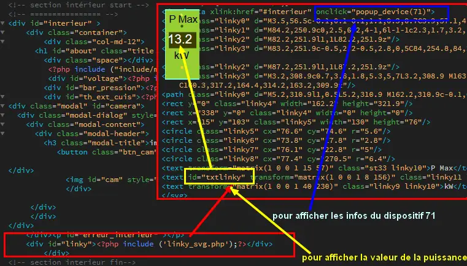
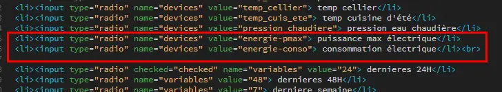
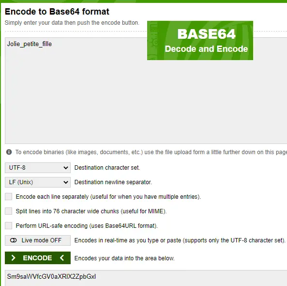
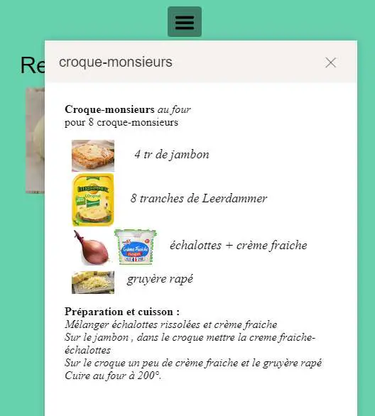
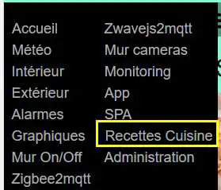
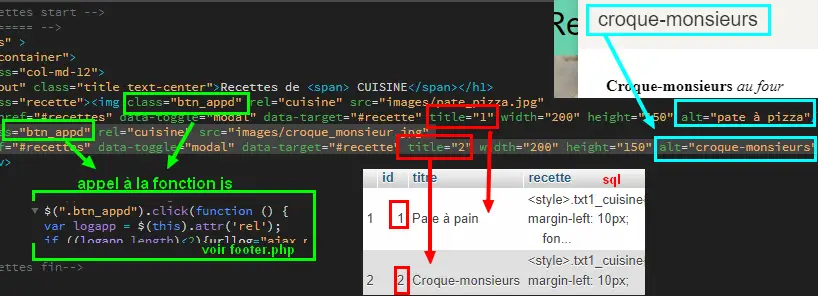
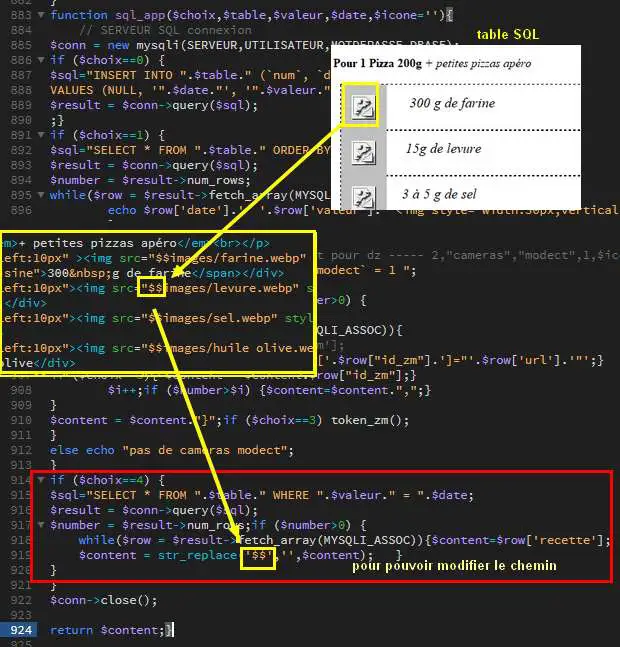
