3. Météo
--------
2 affichages :

- Une page de prévision à 14 jours de Météo Concept

- Une alerte pluie imminent (à 1 h de météo France)

3.1 Page météo
^^^^^^^^^^^^^^^
Cette page n’a PAS DE LIAISON AVEC DOMOTICZ

Voir également le site domo-site.fr

|image366|

*L’API est gratuite chez Météo Concept mais il faut s’enregistrer pour obtenir une clé*

- **La fonction  PHP : dans fonctions.php**

|image367|

|image368|

- **Le JS dans footer.php**

|image369|

Pour la mise à jour auto chaque matin :

|image370|

- **Le HTML de la page meteo**

|image371|

l'image SVG de l'icône pour une actualisation:

|image372|

Il faut ajouter la page au site ; la procédure est toujours la même : 

- dans config.php,

  Mettre la variable à « true » ; *il faut au préalable demander un token gratuit*.

.. code-block::

   // Page Météo  meteo concept
   define('ON_MET',true);// affichage page TOKEN PBLIGATOIRE
   // ---Token & code insee
   define('TOKEN_MC','2f**********************************d0');
   define('INSEE','24454');

Dans header.php, l’affichage dans le menu est alors automatique.

.. code-block::

   <?php if (ON_MET==true) echo '<li class="zz"><a href="#meteo">Météo</a></li>';?>

- **La page meteo.php** :

https://raw.githubusercontent.com/mgrafr/monitor/main/include/meteo.php

|image375|

_ **Les css : en plus du style pour la page** 

.. code-block::

   .meteo_concept_am  {display: inline;width: 150px;margin-left: -20px;}
   #meteo_concept_am{position: relative;top: 20px;margin-left: -20px;}
   #meteo_concept{position: relative;top: 10px;}

- **Les icones**

|image377|

|image378|

3.2 La Météo à 1 heure de Météo France
^^^^^^^^^^^^^^^^^^^^^^^^^^^^^^^^^^^^^^
Ne fait pas partie de la page météo : affichage sur la page d’accueil

|image379|

|image380|

**Extrait de accueil.php** :

.. code-block::

   

	 

Les icones svg « pluie imminente » et « pas de pluie » disponibles

|image382| |image383| |image384| |image385|

**Le JS dans Footer.php** :

|image386|

**PHP** : ajax.php et fonction PHP « app_met($choix) »

- *ajax.php* :

.. code-block::

   if ($app=="infos_met") {$retour=app_met($variable);echo json_encode($retour);}

- *app_met()*

   2 Choix :

   .   (1) en HTML sur le site https://www.lameteoagricole.net/index_pluie-dans-heure.php
       https://www.lameteoagricole.net/meteo-a-10-jours/Saint-Martin-De-Gurson-24610.html

       Indiquer Commune-Code postal

   .   (2) par météo France et son API avec un Token

   |image388|

**La base de données**: correspondance texte – image, la table text_image

|image389|

*Voir le site domo-site.fr*

|image390|

3.3 Autres prévisions météo depuis météo Concept
^^^^^^^^^^^^^^^^^^^^^^^^^^^^^^^^^^^^^^^^^^^^^^^^
- relevés temps réel depuis une station 

.. code-block::

   case 3://prévision horaire
   $url = 'https://api.meteo-concept.com/api/forecast/nextHours?&token='.TOKEN_MC.'&insee='.INSEE;
   $prevam = file_get_curl($url);
   $forecast = json_decode($prevam);$info=array();
		$forecasth=$forecast->forecast[0];
		$info['temp']=$forecasth->temp2m;
		$info['hum']=$forecasth->rh2m;
		$info['Data']=$info['temp'].'°  '.$info['hum'].'%';
   return json_encode($info);
   break;		

- prévision heure par heure : peut remplacer Darsky (devenu payant) ou OpenWeatherMap, c’est français et plus facile d’utilisation, nombreux exemple sur le site web Méteoconcept

.. code-block::

   case 2:// relevé temps réel station la pus proche (40Km)
   $url = 'https://api.meteo-concept.com/api/observations/around?param=temperature&radius=40&token='.TOKEN_MC.'&insee='.INSEE;
   //$url2 = 'https://api.meteo-concept.com/api/forecast/nextHours?token='.TOKEN_MC.'&insee='.INSEE;		
   $prevam = file_get_curl($url);//echo $prevam;return;
   $forecastam = json_decode($prevam);$info=array();
		//$info['time']=$forecastam[0]->observation->time;
		$info['temp']=$forecastam[0]->observation->temperature->value;
		$info['hPa']=$forecastam[0]->observation->atmospheric_pressure->value;
   return json_encode($info);
   break;

|image392|

.. |image367| image:: ../pages/image367.png
   :width: 568px    
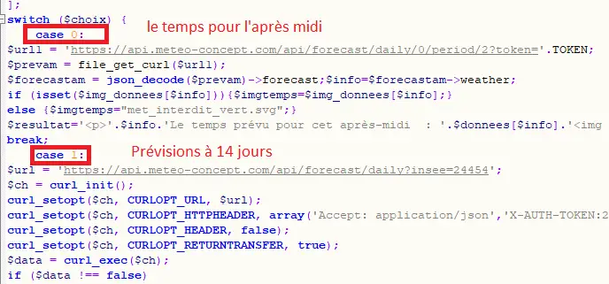

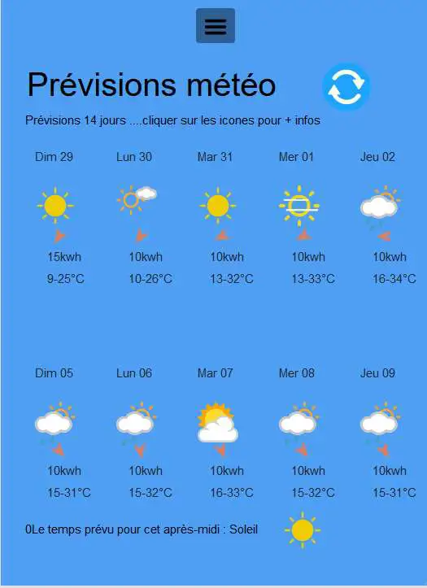
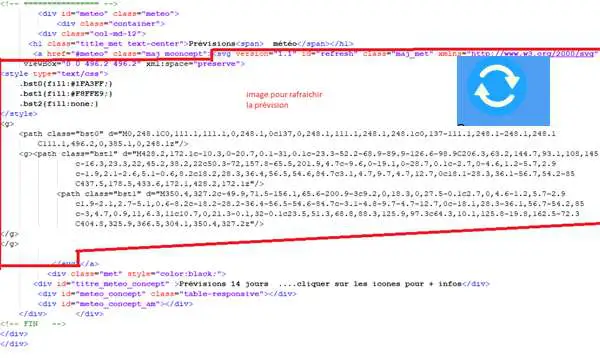

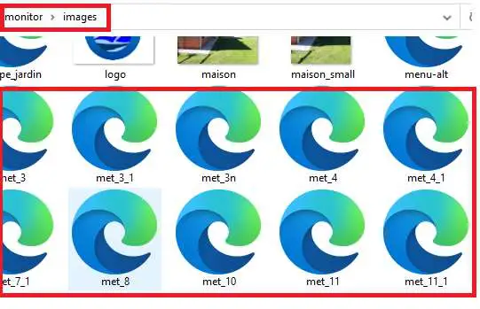
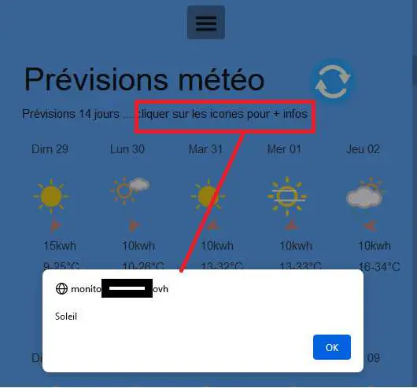

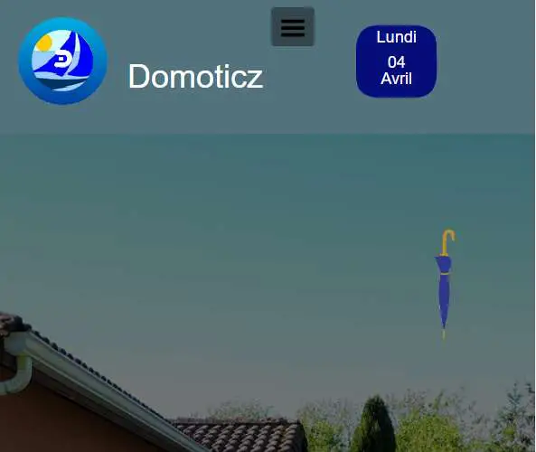
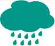

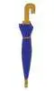
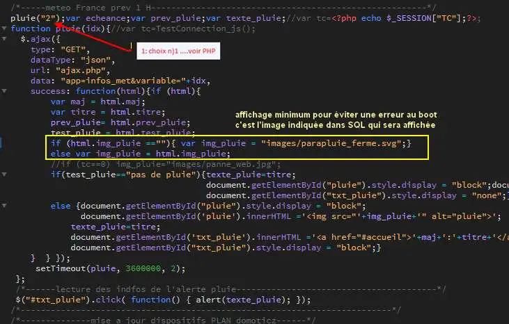
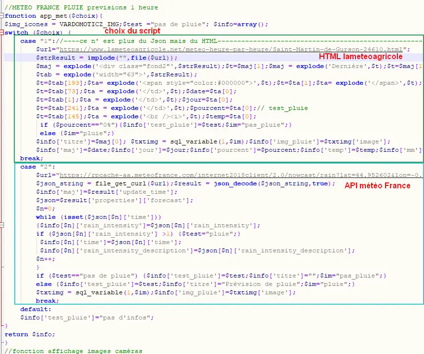
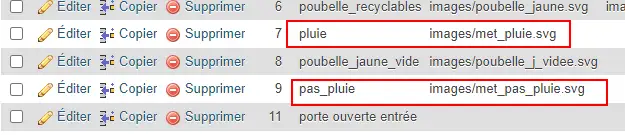

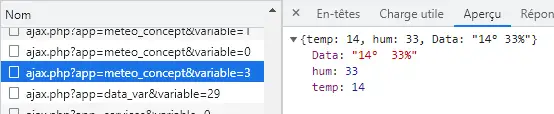

