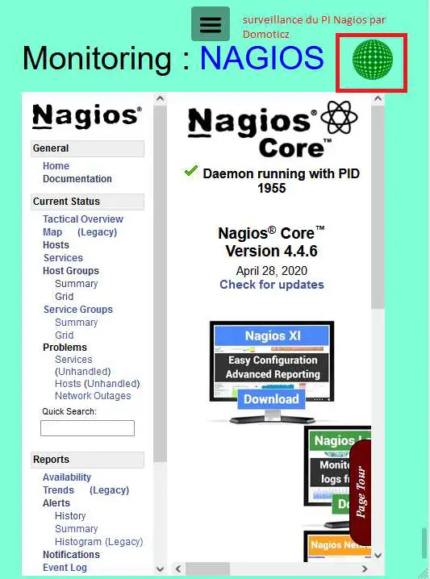
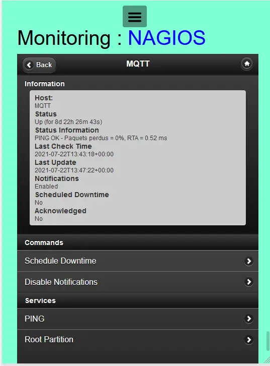
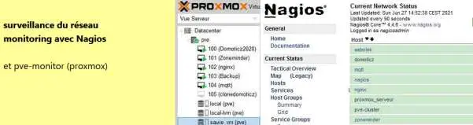
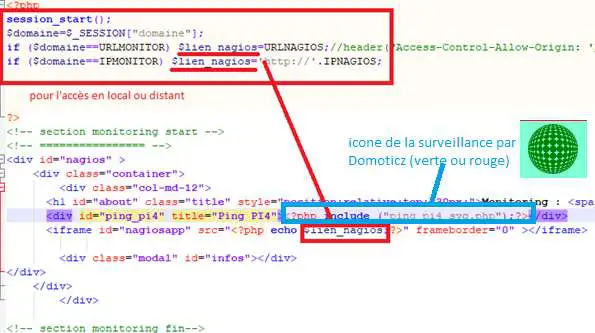
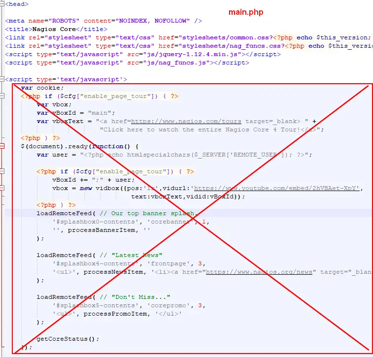

11. MONITORING Nagios
---------------------
Avec Nagios ou Nagios mobile sur monitor

.. note::

   L’app Nagios PC est installée sur un Raspberry 4 8Go, celui qui gère également les sauvegardes et la com GSM

|image668|

|image669|

.. note::
   
   Nagios effectue le monitoring des VM Proxmox avec un plugin : voir le site domo-site.fr

   http://domo-site.fr/accueil/dossiers/71

   |image670|

**La page a la même structure que zigbee2mqtt exceptés les ID (css) et liens local et distant** : :ref:`9. Dispositifs Zigbee`

- **config.php**

.. code-block::

   //Nagios
   define('ON_NAGIOS',true);// mise en service Monitoring
   define('IPNAGIOS', '192.168.1.8/nagios');//ip/dossier
   define('URLNAGIOS', 'https://monitoring.<DOMAINE>/nagios/');
   define('NAUSER', 'nagiosadmin');
   define('NAPASS', '<PASSWORD>');

- **Styles css** , *en plus de ceux de la page*

.. code-block::

   #nagiosmobile {width:750px;margin-top:-50px;height: 700px;}
   #nagiosapp{width: 750px;height: 700px;position: relative;top: -70px;}

- **Le html**, le fichier index_loc.php  (ne pas modifier)

.. code-block::

   if (ON_NAGIOS==true) include ("include/nagios.php");//monitoring

- **header.php**

.. code-block::

   <?php if (ON_NAGIOS==true) echo '<li class="zz"><a href="#nagios">Monitoring</a></li>';?>

- **nagios.php**

on ajoute une iframe :

|image675|

Surveillance par Domoticz du PI : voir scripts paragraphe :ref:`13.4 Surveillance du PI par Domoticz`

Voir la page consacrée à ce sujet sur http://domo-site.fr/accueil/dossiers/76

11.1 accès distant 
^^^^^^^^^^^^^^^^^^
Il faut configurer Nginx et ensuite demander un certificat Letsencrypt,

Voir paragraphe :ref:`9.1 accès distant HTTPS` , *un exemple de configuration avant de faire une demande de certificat* ; 

.. code-block::

   sudo cerbot --nginx

11.2 Supprimer l’affichage YouTube
^^^^^^^^^^^^^^^^^^^^^^^^^^^^^^^^^^

|image678|

