8. MUR de COMMANDES ON/OFF
--------------------------

|image574|

|image575|

8.1 les fichiers de base 
^^^^^^^^^^^^^^^^^^^^^^^^
Index_loc.php en général ne pas modifier

.. code-block:: 

   if (ON_ONOFF==true) include ("include/mur_inter.php");

- **header.php**

.. code-block:: 

   <?php if (ON_ONOFF==true) echo '<li class="zz"><a href="#murinter">Mur On/Off</a></li>';?>

- **styles** : mes_css.css

.. code-block:: 

   #murinter{
    width: 100%;
    height: 1120px;padding: 80px 0;
    min-height: 100%;
    position: relative;
    color: #000;
    top: 350px;z-index:-20;overflow: auto;
   }
   #murinter{background-color: aquamarine;}

8.1.1 écriture automatique du javascript
========================================
Effectuée par une fonction PHP à partir de la base de données

Extrait de la page html pour des commandes pour Domoticz et Home Assistant:

|image580|

voir le §  :ref:`0.3.2 Les Dispositifs`  *exemple des scripts générés automatiquement*

8.2 mur_inter.php
^^^^^^^^^^^^^^^^^^

|image582|

8.2.1 Exemple pour éclairage jardin
===================================
L’interrupeur mécanique de l’éclairage extérieur de l’entrée commande également en zigbee l’éclairage du jardin.

|image583| |image584|

**Domoticz** , Les capteurs virtuels

|image585|

Les capteurs sont mis à jour par MQTT et node-red depuis zigbee2mqtt

.. admonition:: **Les scripts node-red** 

   *envoi vers domoticz/in*

   |image586|

   *La réponse de Domoticz* 

   |image587|

.. important:: **Ce script automatique de Domoticz ne suffit pas en cas de commande de l’interrupteur car le délai de réponse peut atteindre plus de 10 s, il faut donc envoyer un message MQTT à partir de l’interrupteur virtuel.**

.. admonition:: **Le script python lancé par la « lampe_ext_entree »**

   Ce script publie un message MQTT vers zigbee2mqtt pour allumer l’éclairage du jardin si 
   l’interrupteur « lampe_ext_entree » est actionné

   |image588|

   .. code-block:: 

      .../domoticz/scripts/python/mqtt.py zigbee2mqtt/eclairage_ext/set state_l2 ON 
      .../domoticz/scripts/python/mqtt.py zigbee2mqtt/eclairage_ext/set state_l2 OFF

   **le script mqtt.py**

   voir ce §  :ref:`18.2.1 Le script pour envoyer des messages (mqtt.py)`
   
   |image591|

|paho|
 
https://www.eclipse.org/paho/index.php?page=clients/python/docs/index.php

8.2.1.1 Problème de lecture de fichier
""""""""""""""""""""""""""""""""""""""

Pour éviter des erreurs (512, 256), penser à convertir le fichier python en Unix s’il a été créé
avec Notepad++

.. admonition:: **dos2unix**
   installation  et commande bash pour convertir le fichier en Unix

   .. code-block:: 

      sudo apt install dos2unix

   .. code-block::

      dos2unix <CHEMIN/NOM DU FICHIER>

.. attention:: 

   Attention aussi aux autorisations

   |image590|

**Le plan**: l’interrupteur est ajouté

|image592|

**monitor** le fichier exterieur.php

Les lampes concernées en gris et jaune

|image595|

|image596|

*css pour les lampes de* :darkblue:`exterieur_svg.php`

.. code-block:: 

   /*exterieur*/
   .txt_ext{position:relative;top:20px;left:20px;}
   .lj1{fill:#a29e9e;}
   .lj2{fill:#a29e9e;}

|image594|

**La Base de Données**

|image597|

**Le Javascript** dans footer.php

.. important:: **La mise à jour de tous les dispositifs est automatique mais avec un temps de réponse, aussi pour la commande des interrupteurs le second script permet une mise à jour instantanée**
  
- *maj_devices()*

|image598|

- *maj_switch()*

|image599|

8.2.2 Exemple pour arrosage jardin
==================================
*Relais Sonoff wifi ip 192.168.x.x :8081*

**DOMOTICZ** : Le Capteur virtuel :

|image601|

|image602|

Le capteur est ajouté au plan

|image604|

**Le script python**

.. code-block:: 

   #!/usr/bin/env python3.7
   # -*- coding: utf-8 -*-
   import sys
   import urllib.request
   import json    
   total_arg = len(sys.argv)
   if (total_arg>0) : arg= str(sys.argv[1])
   data = '{"deviceid":"1000a0876c","data":{"switch":"'+arg+'"}}'
   url = 'http://192.168.1.146:8081/zeroconf/switch'
   req = urllib.request.Request(url)
   dataasbytes = data.encode('utf-8')   # needs to be bytes
   req.add_header('Content-Length', len(dataasbytes))
   response = urllib.request.urlopen(req, dataasbytes)

**mur_inter.php**

.. code-block:: 

   <ul>
   <li style="margin-left:0;margin-top:10px"><a href="#murinter">/images/arrosage.svg" width="60" height="auto" alt=""/></a></li>

**La Base de données** 

|image606|

8.2.3 Exemple éclairage simple, une lampe de salon
==================================================
**Dans Domoticz**

- *création d'un dispositif virtuel*

- *ajout du dispositif au plan*

|image609|

- *placement sur le plan*

**Dans monitor**

- *mur_inter.php*

|image612|

Les images pour lampe de bureau :

|image613| |image614|

.. admonition:: **extrait de maison_svg.php**
   |image615|

   |image616|

**La base de données « monitor »**, table dispositifs

 |image617|

**Affichage** : :green:`Eteint` / :red:`Allumé` 

|image618| |image619|
    
8.2.4 Exemple volet roulant
=============================
*Le moteur est à 4 fils, piloté par une commande TUYA FT30F et Zigbee2mqtt*

|image620|

.. important:: **pour éviter que les commandes soient inversées dans Domoticz, mettre à TRUE le paramètre spécifique concernant cet interrupteur, dans le fronted de zigbee2mqtt**

   |image621|

.. warning:: **Pour utiliser le Javascript (comme pour le plan) il ne faut pas charger l’image par son nom mais l’incorporer dans un fichier PHP.**

   .. code-block:: 

      <li style="margin-left:0;margin-top:10px"><?php include ("volet-roulant_svg.php");?></li>

**L’image svg** :

|image623|

- Cette image a été ajoutée avec la CLASS ci-dessus, les ID étant uniques ; 

- ID « volet_bureau » (1er <rect ) pour indiquer le % d’ouverture

- ID « volet_bureau1 » (2eme <rect ) :red:`pour pouvoir cliquer n’importe où sur l’image`.

8.2.4.1 Affichage sur le plan
"""""""""""""""""""""""""""""
**Le plan** :

|image624|

Pour un clic qui fonctionne sans problème, on peut ajouter un rectangle :

.. code-block:: 

   <rect style="fill:black;fill-opacity:1" xlink:href="#interieur" 
	onclick="popup_device(31)" 
	class="volet_bureau" 
	id="volet_bur" width="26" height="37" x="113" y="726">
	<title id="title69449">volet_bur</title></rect> 

|image626|

**Domoticz** ,  Ci-dessous le dispositif concerné 

|image627|

**Base de données SQL**

- Enregistrer le dispositif avec l’ID pour le mur de commande et une CLASS pour le plan (permet de visualiser, comme pour les lampes l’ouverture ou la fermeture des volets 

  |image628|

.. note:: **Sur le plan on indique simplement si les volets sont fermés ou ouverts (même partiellement)**

   |image629|

**Le Javascript** , footer.php

- *maj_devices()*

 |image630|

	. L’ouverture est Open ou les 12 premiers caractères sont « Set Level :  » 

	. La fermeture est Closed

	|image631|

8.2.4.2 Dans le mur ON/OFF
"""""""""""""""""""""""""""
*Pour afficher le % d’ouverture*

Pour indiquer le % d’ouverture on ajoute un rectangle dans l’image, la hauteur sera fonction du % d’ouverture ; pour cela il faut indiquer dans l’image la hauteur de référence ; sinon un pourcentage s’appliquera à la hauteur déjà modifiée qui diminuera au fil des mises à jour.

.. important:: **Height de l’image sera suivant le % d’ouverture modifié dans le Dom, c’est pourquoi on crée un attribut h qui est le reflet du height d’origine**

   |image632|

   Le volume d’ouverture est indiqué dans Data : Set Level : VALEUR en %

   |image633|

   On applique ce pourcentage au rectangle de l’mage.

Dans maj_devices() , on récupère la valeur h de l’image

.. code-block:: 

   var h=document.getElementById(val.ID1).getAttribute("h");

On attribue à l’image la bonne hauteur qui tient compte du % d’ouverture

.. code-block:: 

   document.getElementById(val.ID1).setAttribute("height",parseInt((h*pourcent[2])/100));

Ou suivant que les 100% soit pour l’ouverture ou la fermeture :

.. code-block:: 

   document.getElementById(val.ID1).setAttribute("height",parseInt((h*(100-pourcent[2]))/100));

**Affichage sur le mur de commandes**:

 |image634|

*La fonction complète maj_devices(plan) dans footer.php*

|image635|

.. admonition:: **Manoeuvrer le volet**
   
   Le rectangle indiquant le % d’ouverture peut être très petit, aussi pour pouvoir cliquer n’importe où sur l’image, il suffit d’ajouter un rectangle incolore comme déjà indiqué dans ce paragraphe :

   |image636|

   On ajoute l’id de ce rectangle dans la base de données :

   |image637|

   Comme pour les commandes onoff , les scripts des commandes onoff+stop sont écrits automatiquement par la fonction function sql_plan($t) ;

   |image638|

   Le wiki de Domoticz concernant ces commandes :

   |image639|

   La fonction PHP sql_1() , partie consacrée à :darkblue:`maj_js=onoff+stop`

   .. code-block:: 

      if ($row['maj_js']=="onoff+stop") {$sl='").on("click", function () 
      {$("#popup_vr").fadeIn(300);document.getElementById("VR").setAttribute("title","'.$row['idm'].'");document.getElementById("VR").setAttribute("rel","'.$row['idx'].'");})';}

   La fenêtre complémentaire :

   |image641|

   le code PHP dans mur_inter.php

   |image642|

   C’est cette fenêtre qui va envoyer les commandes d’ouverture, fermeture 

8.2.4.3 les scripts JS
""""""""""""""""""""""
2 solutions:

8.2.4.3.1  avec Ajax et PHP
~~~~~~~~~~~~~~~~~~~~~~~~~~~
*amount=id pour input button* voir l'mage du § prec

|image643|

Ci-dessus, on récupère idx idm et la commande

|image644|

Mise à jour instantanée :

|image645|

8.2.4.3.2 avec MQTT
~~~~~~~~~~~~~~~~~~~
C’est une autre solution qui peut s’appliquer pour tout dispositifs non gérer par le programme. Il faut installer la bibliothèque ci-dessous paho-mqtt voir le § :ref:`18.2 Installer Paho-mqtt`

https://www.eclipse.org/paho/index.php?page=clients/js/index.php

|image646|

|image647|

Ce fichier est chargé automatiquement dans footer.php si MQTT est à true dans /admin/config

.. code-block:: 

   define('MQTT', false);//  true si serveur MQTT utilisé par monitor

.. code-block:: 

   if (MQTT==true) echo '';?>	

La même commande de volet par MQTT

|image650|

L'envoi des données doit être un tableau json

|image651|

.. code-block:: 

   Value= {idx : 177,  switchcmd : ‘’ Set Level’’ , level  : ‘’ On ‘’} 

.. note::
   Le topic étant **domoticz/in**, voir cette page de domo-site.fr :http://domo-site.fr/accueil/dossiers/90

   Cette page est consacrée à un capteur mais la publication d'un message est identique

.. admonition:: **convertir une valeur JavaScript en chaîne JSON**
   
   *avec La méthode JSON.stringify()* 

   .. code-block::

      var result = JSON.stringify(value);

**La commande** :

|image652|

.. |paho| image:: ../images/paho.png
   :width: 100px
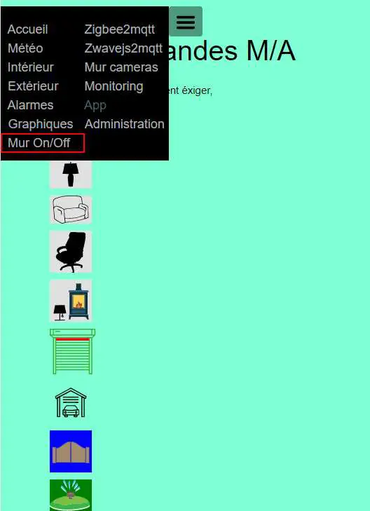
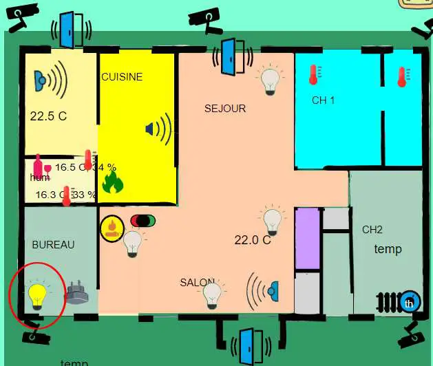
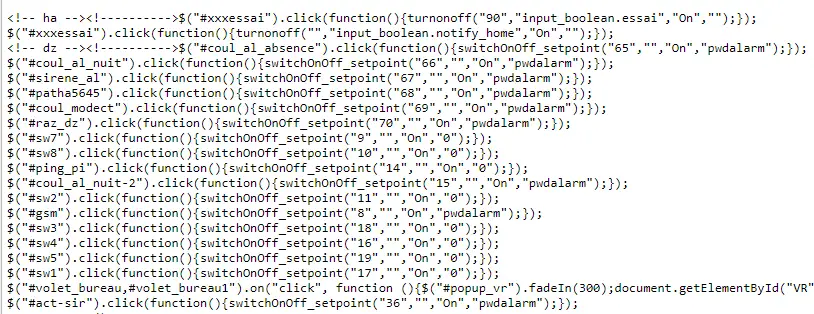
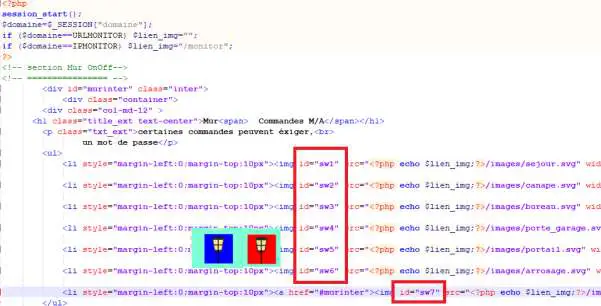
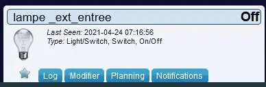
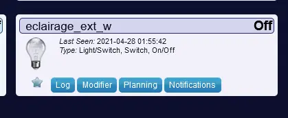
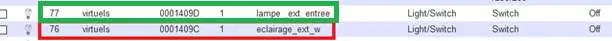
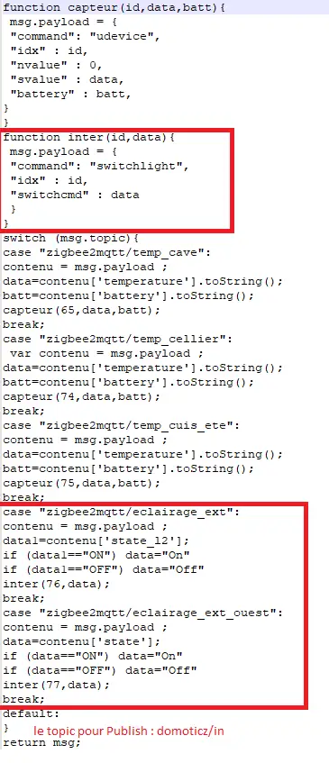
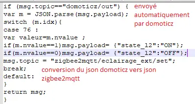
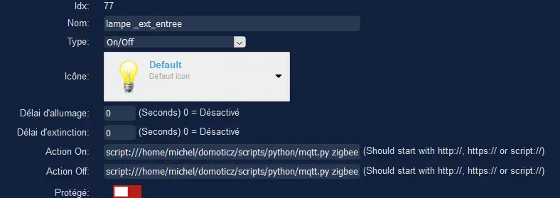
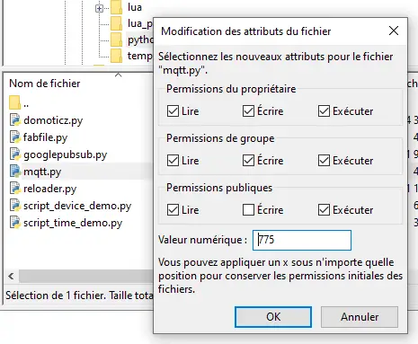
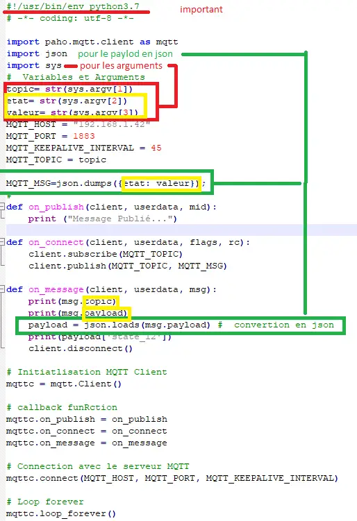
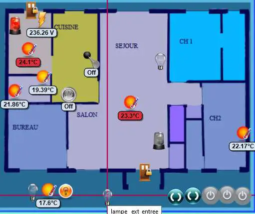
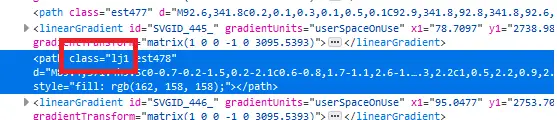
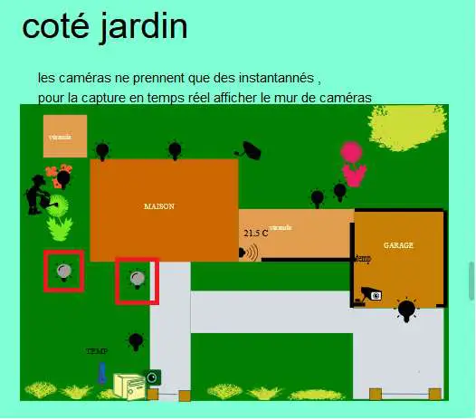
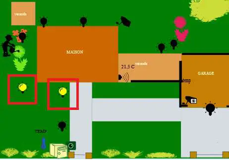
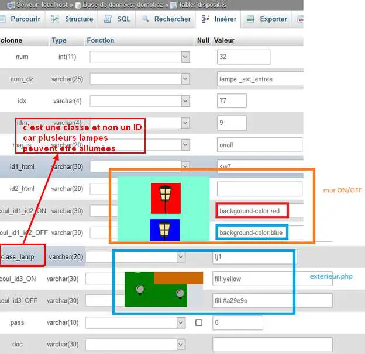
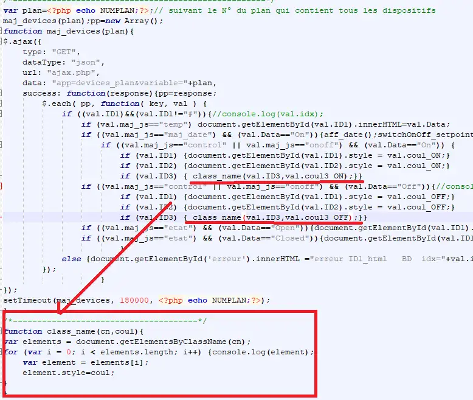
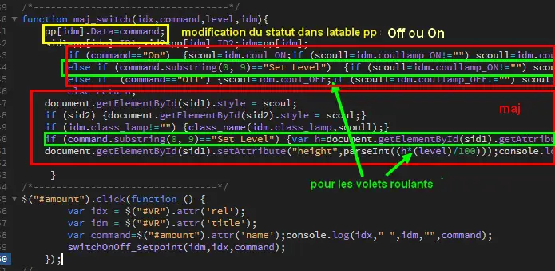
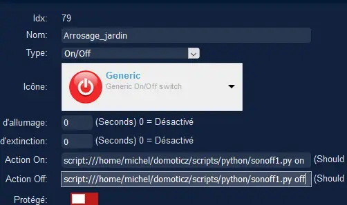
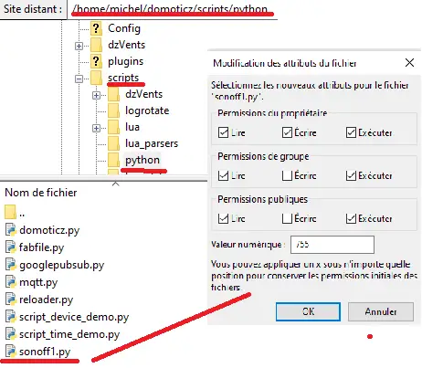
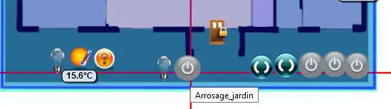
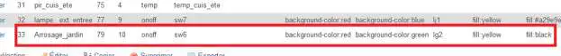
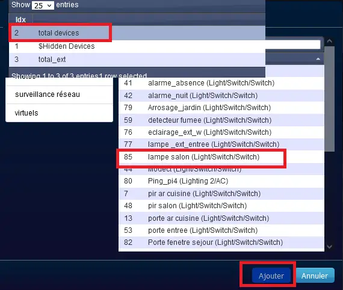
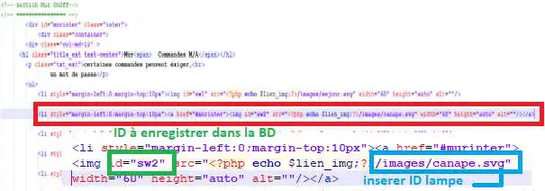
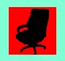

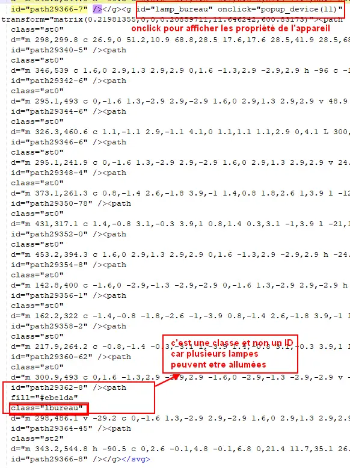
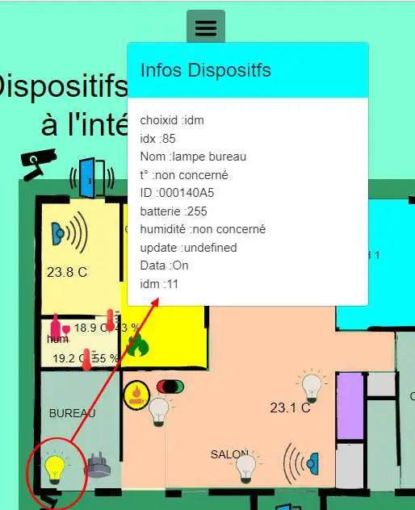
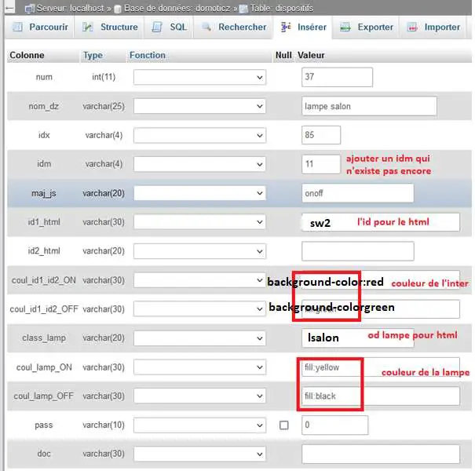
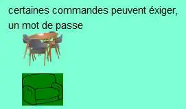
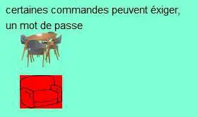
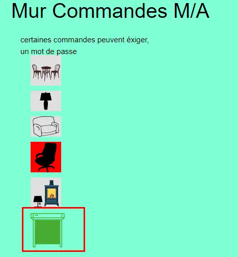
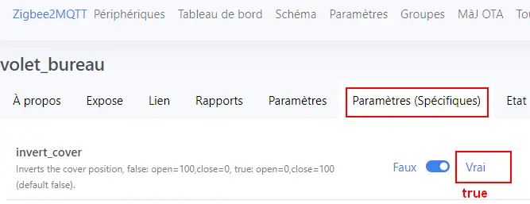
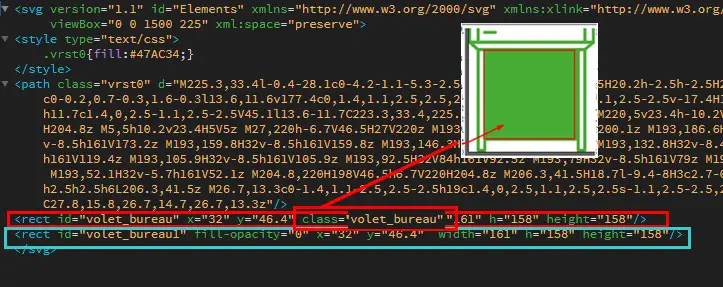
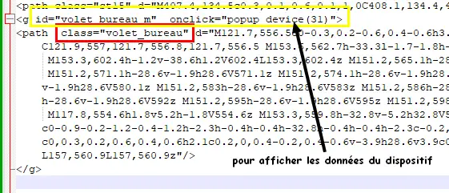
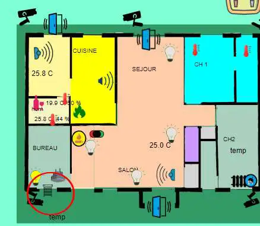
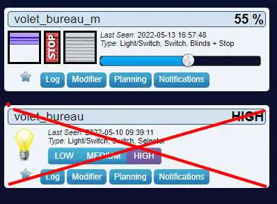
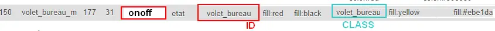
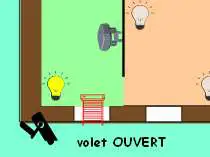
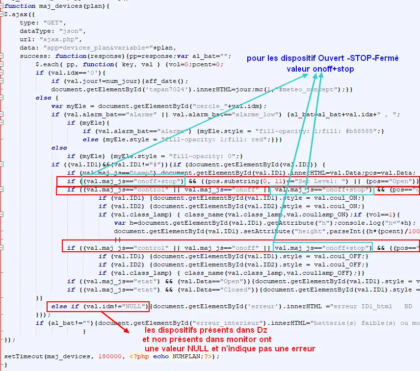
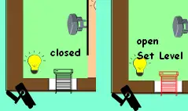
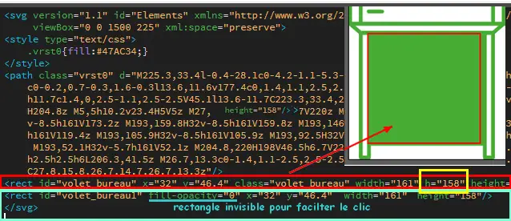
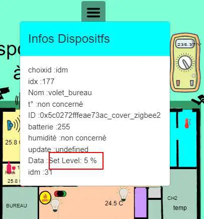
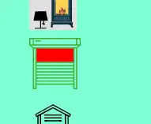
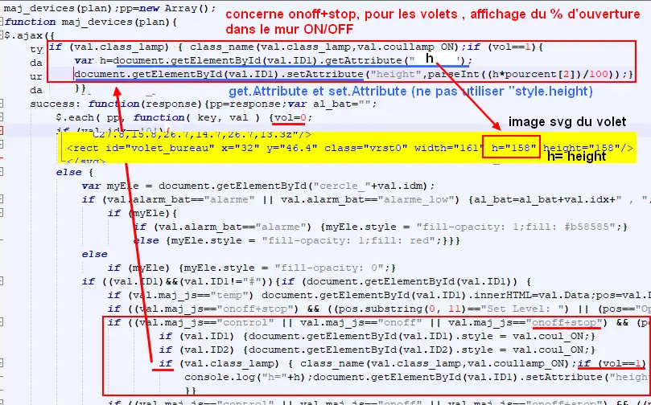
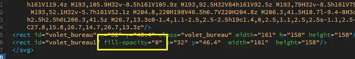
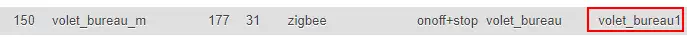
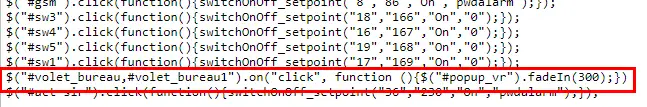
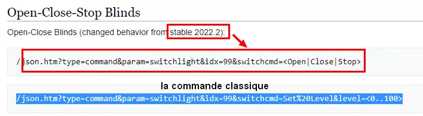
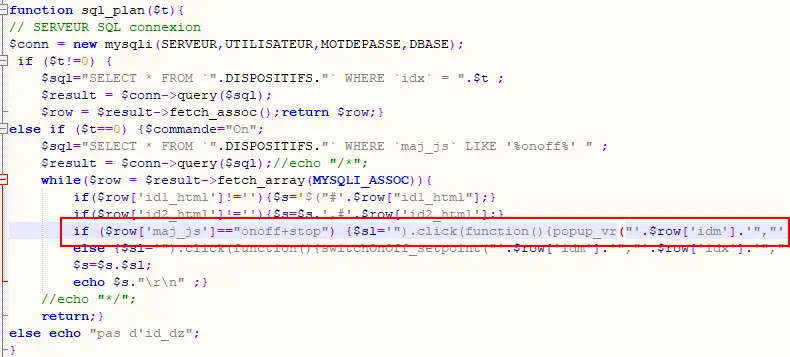

.. |image651| image:: ../pages/image651.png
   :width: 597px

